# 🎮 10학년 바이브 코딩 커리큘럼 v3 (8차시)

## 📌 커리큘럼 개요

### 핵심 교육 방식: PRIMM
**PRIMM** = Predict → Run → Investigate → Modify → Make

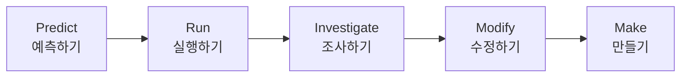

| 단계 | 영문 | 한글 | 활동 | 목표 |
|------|------|------|------|------|
| **P** | Predict | 예측하기 | 완성 게임 보고 구조 예측 | 사전 이해 |
| **R** | Run | 실행하기 | 프롬프트로 게임 생성 | 도구 활용 |
| **I** | Investigate | 조사하기 | 플로우차트로 구조 분석 | 구조 이해 |
| **M** | Modify | 수정하기 | 프롬프트 수정으로 변형 | 적용 능력 |
| **Mk** | Make | 만들기 | 나만의 게임 완성 | 창작 능력 |

---

## 📚 전체 8차시 구조

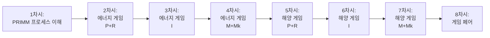

| 차시 | 프로젝트 | PRIMM 단계 | 핵심 활동 | 결과물 |
|:----:|---------|-----------|---------|--------|
| **1** | 프로세스 이해 | 전체 체험 | PRIMM 5단계 빠른 체험 | 샘플 게임 |
| **2** | 에너지 게임 | P + R | 예측 + 프롬프트 실행 | 기본 게임 |
| **3** | 에너지 게임 | I | 플로우차트 분석 | 구조 이해 |
| **4** | 에너지 게임 | M + Mk | 수정 + 완성 | 나만의 게임 |
| **5** | 해양 게임 | P + R | 예측 + 프롬프트 실행 | 기본 게임 |
| **6** | 해양 게임 | I | 플로우차트 분석 | 구조 이해 |
| **7** | 해양 게임 | M + Mk | 수정 + 완성 | 나만의 게임 |
| **8** | 종합 | - | 게임 페어 + 성찰 | 전시 |

---

## 🎯 2개 게임 프로젝트 개요

| 프로젝트 | 장르 | 핵심 메커니즘 | 교육 주제 | 기술 난이도 |
|---------|------|--------------|----------|-----------|
| **에너지 절약 챌린지** | 클리커 | 버튼 클릭, 타이머, 상태 관리 | 에너지 절약, 기후변화 | ★★☆ |
| **바닷속 모험** | 액션 | 키보드 이동, 충돌 감지 | 해양 오염, 생태 보전 | ★★★ |

### 프로젝트 선정 이유

**왜 게임 기반 학습인가?**
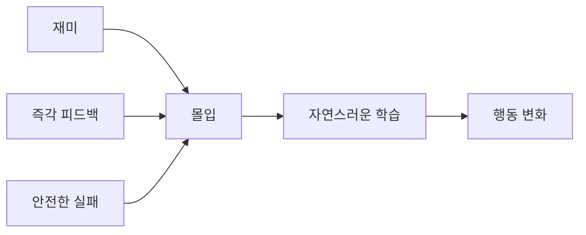

**왜 이 2개 게임인가?**
1. **에너지 게임**: 간단한 클릭 → 상태 관리 개념 학습
2. **해양 게임**: 복잡한 이동 + 충돌 → 좌표 계산 학습
3. **난이도 차이**: 점진적 학습 곡선

---

## 📖 PRIMM 방식 상세 설명

### PRIMM이란?

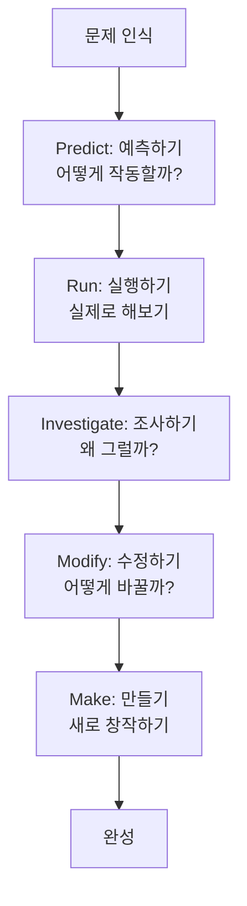

### 각 단계별 활동

| 단계 | 핵심 질문 | 활동 | 도구 | 결과 |
|------|----------|------|------|------|
| **Predict** | "어떻게 작동할까?" | 완성작 관찰, 기능 예측 | 눈으로 관찰 | 예측 노트 |
| **Run** | "실제로 해보자" | 프롬프트로 생성 | v0 + 프롬프트 | 작동하는 게임 |
| **Investigate** | "왜 그럴까?" | 플로우차트 분석 | Mermaid, 순서도 | 구조 이해 |
| **Modify** | "어떻게 바꿀까?" | 프롬프트 수정 | v0 + 수정 프롬프트 | 변형 버전 |
| **Make** | "새로 만들어보자" | 나만의 요소 추가 | 창의성 | 완성작 |

---

# 📅 차시별 상세 커리큘럼

---

## 1차시: PRIMM 프로세스 이해하기

### 🎯 학습 목표
- PRIMM 5단계 프로세스를 이해한다
- 프롬프트로 게임을 만드는 과정을 체험한다
- 플로우차트로 게임 구조를 읽는다

### 📦 예상 결과물
✅ 간단한 클릭 카운터 게임

### ⏱️ 시간 배분 (50분)

| 시간 | 활동 | PRIMM | 내용 |
|------|------|-------|------|
| 10분 | 도입 | - | PRIMM 소개, 8차시 로드맵 |
| 10분 | 예측 | P | 샘플 게임 보고 구조 예측 |
| 10분 | 실행 | R | 프롬프트로 게임 생성 |
| 10분 | 조사 | I | 플로우차트 읽기 |
| 5분 | 수정 | M | 색상 변경해보기 |
| 5분 | 정리 | - | 다음 차시 예고 |

---

### 📚 학습 활동

#### Part 1: PRIMM 소개 (10분)

**PRIMM 프로세스 전체 흐름**

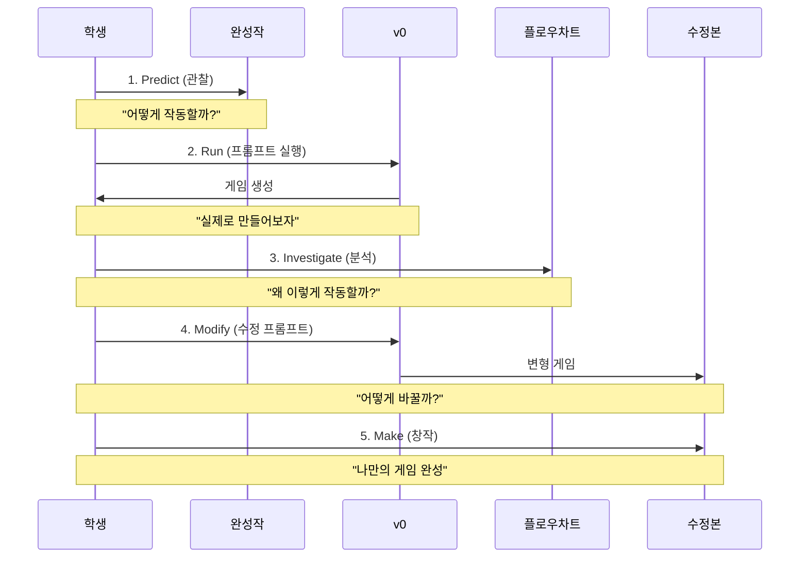

**왜 PRIMM인가?**

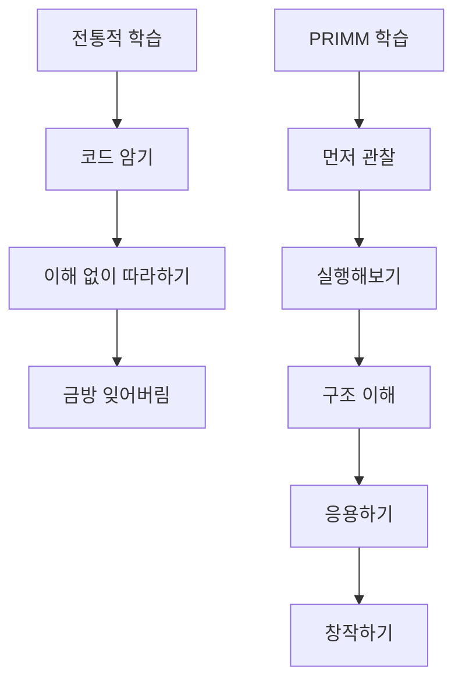

---

#### Part 2: Predict - 예측하기 (10분)

**미션: 클릭 카운터 게임 관찰**

[교사가 미리 준비한 샘플 게임 링크 제공]

**예측 워크시트**

```
🔮 예측하기 (Predict)

게임을 보고 예측해보세요:

1. 화면 구성
   □ 어떤 요소가 있나요?
     • _____________________
     • _____________________
     • _____________________
   
2. 버튼 클릭 시
   □ 무슨 일이 일어날까요?
     • _____________________
   
3. 10번 클릭 후
   □ 어떻게 될까요?
     • _____________________

4. 필요한 데이터
   □ 어떤 변수가 필요할까요?
     • 점수: 숫자 (0부터 시작)
     • _____________________
   
5. 게임 흐름 예측
   시작 → _____ → _____ → _____ → 완료
```

**예측 이유: 왜 먼저 예측하나요?**
- 사전 지식 활성화
- 관찰력 향상
- 구조적 사고 훈련
- 나중에 플로우차트와 비교

---

#### Part 3: Run - 실행하기 (10분)

**미션: 프롬프트로 게임 만들기**

**프롬프트 템플릿 구조**

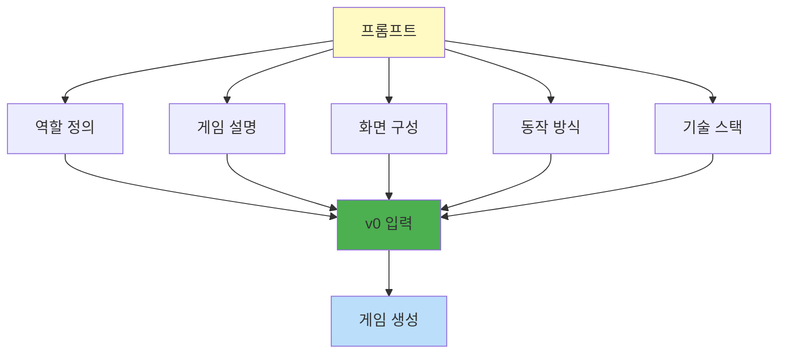

**프롬프트 템플릿: 클릭 카운터 게임**

```
[v0에 붙여넣기]

당신은 교육용 웹 게임 개발자입니다.

학생들이 클릭 동작을 배울 수 있는 간단한 카운터 게임을 만들어주세요.

## 화면 구성
- 배경: 연한 파스텔 블루 (#E3F2FD)
- 중앙 정렬

## 요소
1. 점수 표시
   - 텍스트: "점수: X"
   - 크기: 64px
   - 굵게
   - 색상: 검은색

2. 클릭 버튼
   - 텍스트: "클릭하세요!"
   - 크기: 200px × 80px
   - 배경: 초록색 (#4CAF50)
   - 텍스트: 24px, 흰색, 굵게
   - 둥근 모서리: 12px
   - 호버 시: 진한 초록 (#45a049)

3. 목표 안내
   - 텍스트: "목표: 10번 클릭"
   - 크기: 18px
   - 색상: 회색

## 동작
- 초기 점수: 0
- 버튼 클릭 시: 점수 +1
- 10점 도달 시: "성공! 🎉" 메시지 표시
- "다시하기" 버튼 나타남

## 기술
- Next.js 14
- Tailwind CSS
- React Hooks (useState)

이 게임을 만들어주세요.
```

**실행 체크리스트**

```
✅ 실행 확인

□ v0에 프롬프트 붙여넣기 완료
□ Generate 클릭
□ 3-5분 대기
□ 생성 완료
□ Preview에서 테스트
  □ 점수 0 표시
  □ 버튼 클릭 → 점수 증가
  □ 10점 → 성공 메시지
  □ 다시하기 작동
```

---

#### Part 4: Investigate - 조사하기 (10분)

**미션: 플로우차트로 구조 이해**

**게임 플로우차트**

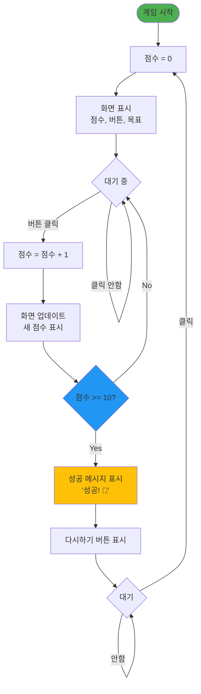

**구조 분석 워크시트**

```
🔍 조사하기 (Investigate)

플로우차트를 보고 답하세요:

1. 시작 시 무엇을 하나요?
   → 점수를 0으로 초기화

2. 버튼 클릭 시 어떤 순서로 동작하나요?
   → 1. _____________________
   → 2. _____________________
   → 3. _____________________

3. 조건 확인은 언제 하나요?
   → _____________________

4. 게임이 끝나는 조건은?
   → _____________________

5. 다시하기는 어디로 가나요?
   → _____________________
```

**왜 플로우차트를 보나요?**

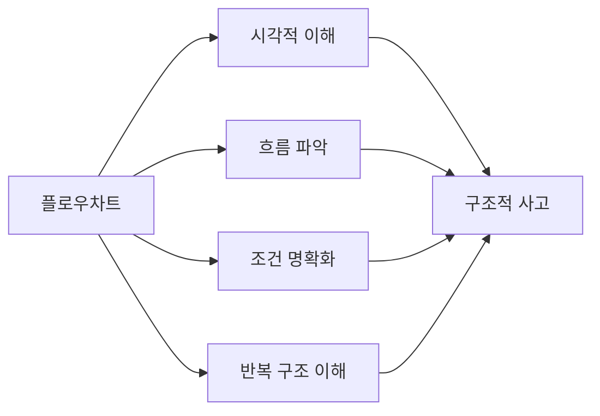

---

#### Part 5: Modify - 수정하기 (5분)

**미션: 색상 변경해보기**

**수정 프롬프트 템플릿**

```
[v0에 추가 입력]

다음을 변경해줘:
- 배경색: 파스텔 블루 → 파스텔 핑크 (#FCE4EC)
- 버튼 색: 초록 → 보라 (#9C27B0)
- 호버 색: 진한 보라 (#7B1FA2)

나머지는 그대로 유지해줘.
```

**수정 전후 비교**

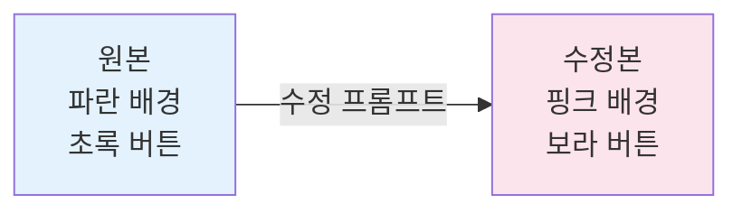

**왜 수정해보나요?**
- 프롬프트 수정 연습
- 변경 가능 범위 이해
- 원인과 결과 학습

---

### 📊 1차시 평가

| 항목 | 평가 기준 | 배점 |
|------|----------|------|
| **예측** | 게임 구조를 정확히 예측 | 20% |
| **실행** | 프롬프트로 게임 생성 성공 | 30% |
| **조사** | 플로우차트 이해도 | 30% |
| **수정** | 프롬프트 수정 시도 | 20% |

---

## 2차시: 에너지 절약 게임 - Predict + Run

### 🎯 학습 목표
- 완성된 에너지 게임을 관찰하고 구조 예측하기
- 제공된 프롬프트로 게임 생성하기
- 기본 동작 테스트하기

### 📦 예상 결과물
✅ 작동하는 에너지 절약 게임 (기본 버전)

### ⏱️ 시간 배분 (50분)

| 시간 | 활동 | PRIMM | 내용 |
|------|------|-------|------|
| 15분 | 관찰 | P | 완성 게임 플레이 및 예측 |
| 5분 | 템플릿 | R | 프롬프트 구조 이해 |
| 20분 | 생성 | R | v0로 게임 생성 |
| 10분 | 테스트 | R | 기능 확인 체크리스트 |

---

### 📚 학습 활동

#### Part 1: Predict - 에너지 게임 예측 (15분)

**게임 개요**

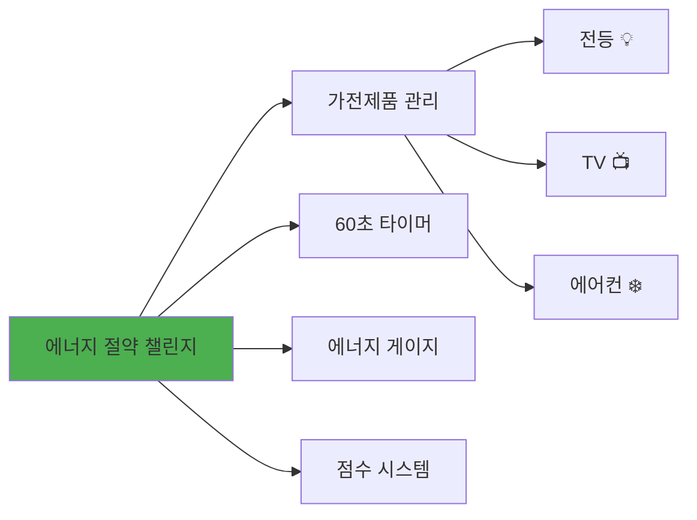

**예측 워크시트**

```
🔮 에너지 게임 예측하기

[완성 게임을 플레이하고 답하세요]

1. 화면 구성 예측
   상단 HUD:
   □ __________________ (에너지 게이지)
   □ __________________ (타이머)
   □ __________________ (점수)
   
   중앙 게임 영역:
   □ __________________ (버튼 개수)
   □ __________________ (버튼 종류)
   
   하단:
   □ __________________ (정보)

2. 버튼 클릭 시 예측
   전등 클릭 → __________________
   TV 클릭 → __________________
   에어컨 클릭 → __________________

3. 시간 경과 시 예측
   에너지는? __________________
   타이머는? __________________

4. 게임 종료 조건 예측
   조건 1: __________________
   조건 2: __________________

5. 필요한 데이터 예측
   변수 1: 에너지 (0-100%)
   변수 2: __________________
   변수 3: __________________
   변수 4: __________________
```

**게임 구조 예측 다이어그램**

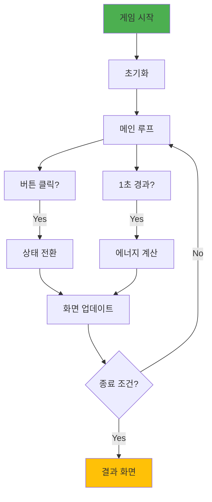

---

#### Part 2: Run - 프롬프트로 생성 (25분)

**프롬프트 구조 설명**

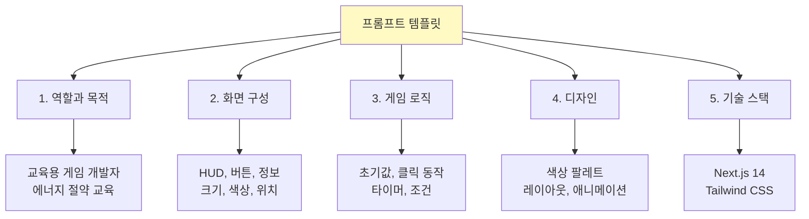

**에너지 게임 프롬프트 템플릿**

```
[v0에 붙여넣기]

당신은 교육용 게임 개발자입니다.

학생들에게 에너지 절약의 중요성을 가르치는 웹 게임을 만들어주세요.

## 게임 개요
- 제목: 에너지 절약 챌린지
- 목표: 60초 동안 에너지 30% 이상 유지
- 방법: 가전제품을 끄고 에너지 관리

## 화면 구성

### 상단 HUD
1. 에너지 게이지
   - 프로그레스 바 (0-100%)
   - 높이: 32px
   - 색상: 초록 (>50%), 노랑 (30-50%), 빨강 (<30%)
   - 중앙에 "에너지: XX%" 표시

2. 타이머
   - 텍스트: "⏱️ 남은 시간: XX초"
   - 초기값: 60초
   - 30초 미만: 빨간색

3. 점수
   - 텍스트: "💰 점수: XXX점"
   - 초기값: 0점

### 중앙 게임 영역
제목: "에너지 절약 챌린지" (48px, 초록색)

가전제품 버튼 3개 (1행 3열):

**버튼 1: 전등 💡**
- 크기: 200px × 200px
- 초기 상태: ON
- ON: 밝은 노란색 배경
- OFF: 어두운 회색 배경
- 상태 텍스트 표시

**버튼 2: TV 📺**
- 크기: 200px × 200px
- 초기 상태: ON
- ON: 밝은 파란색 배경
- OFF: 어두운 회색 배경

**버튼 3: 에어컨 ❄️**
- 크기: 200px × 200px
- 초기 상태: ON
- ON: 밝은 하늘색 배경
- OFF: 어두운 회색 배경

### 하단 정보
팁: "💡 에어컨이 전력을 가장 많이 소모해요!"

## 게임 로직

### 초기값
- 에너지: 50%
- 타이머: 60초
- 점수: 0점
- 모든 가전: ON

### 버튼 클릭
- 상태 전환 (ON ↔ OFF)
- OFF 전환 시 점수 증가:
  * 전등: +30점
  * TV: +50점
  * 에어컨: +70점

### 1초마다 자동 실행
에너지 변화:
- 전등 ON: -3% / OFF: +1%
- TV ON: -5% / OFF: +2%
- 에어컨 ON: -7% / OFF: +3%

타이머 -1초

### 종료 조건
- 에너지 0% → 즉시 게임 오버
- 타이머 0초 → 결과 계산

### 결과
- 에너지 ≥50%: ⭐⭐⭐ "환경 지킴이!"
- 에너지 30-49%: ⭐⭐ "잘했어요!"
- 에너지 <30%: ⭐ "다시 도전!"

## 디자인
- 배경: 연한 초록 그라데이션
- 버튼: 둥근 모서리, 그림자
- 애니메이션: 클릭 시 scale
- 반응형: 모바일 대응

## 기술
- Next.js 14
- Tailwind CSS
- React useState, useEffect
- localStorage (최고 점수)

이 게임을 만들어주세요.
```

**생성 프로세스**

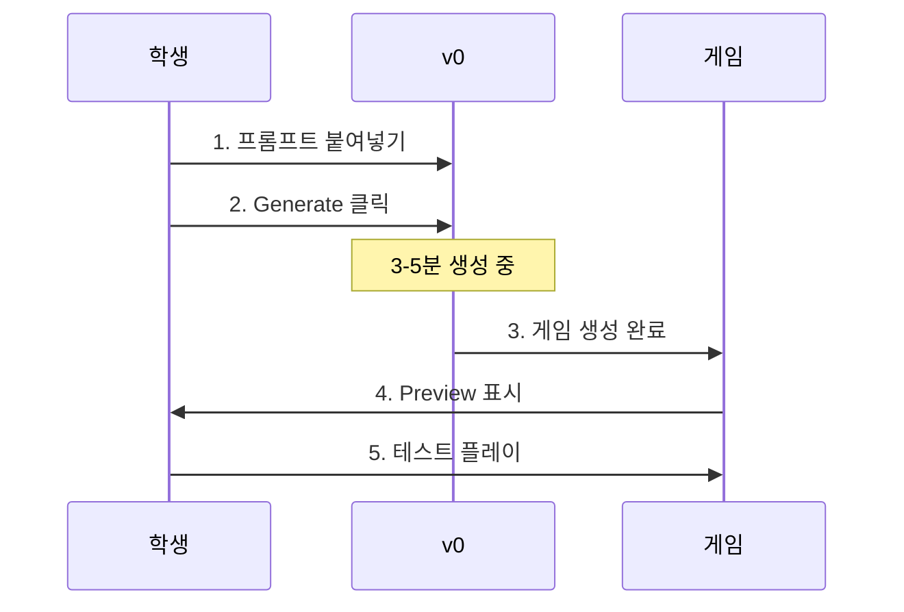

---

#### Part 3: 테스트 - 기능 확인 (10분)

**체크리스트**

```
✅ 에너지 게임 테스트

□ 1단계: 초기 화면
  □ 에너지 50% 표시
  □ 타이머 60초 표시
  □ 점수 0점 표시
  □ 3개 버튼 모두 ON (밝은 색)

□ 2단계: 버튼 클릭
  □ 전등 클릭 → 상태 변경 + 점수 +30
  □ TV 클릭 → 상태 변경 + 점수 +50
  □ 에어컨 클릭 → 상태 변경 + 점수 +70

□ 3단계: 시간 경과
  □ 1초마다 타이머 감소
  □ 에너지 자동 변화
  □ 게이지 바 색상 변화

□ 4단계: 게임 종료
  □ 에너지 0% → 게임 오버
  □ 60초 → 결과 화면
  □ 별 개수 정확
  □ 다시하기 작동
```

---

### 📊 2차시 평가

| 항목 | 평가 기준 | 배점 |
|------|----------|------|
| **예측** | 게임 구조 정확히 예측 | 30% |
| **실행** | 프롬프트로 게임 생성 | 40% |
| **테스트** | 체크리스트 완료 | 30% |

---

## 3차시: 에너지 절약 게임 - Investigate

### 🎯 학습 목표
- 플로우차트로 게임 전체 흐름 이해하기
- 순서도로 단계별 동작 파악하기
- 구조 설계 이유 이해하기

### 📦 예상 결과물
✅ 플로우차트 분석 보고서

### ⏱️ 시간 배분 (50분)

| 시간 | 활동 | 내용 |
|------|------|------|
| 15분 | 플로우차트 읽기 | 전체 흐름 이해 |
| 15분 | 순서도 분석 | 단계별 동작 파악 |
| 15분 | 설계 이유 탐구 | "왜?" 질문하기 |
| 5분 | 정리 | 핵심 개념 요약 |

---

### 📚 학습 활동

#### Part 1: 플로우차트 읽기 (15분)

**에너지 게임 전체 플로우차트**

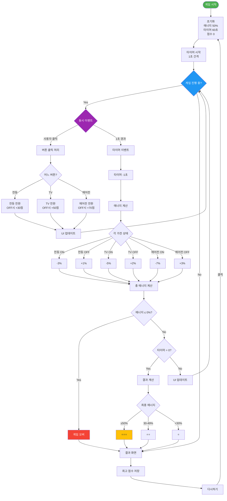

**플로우차트 분석 워크시트**

```
🔍 플로우차트 조사하기

1. 주요 흐름 파악
   시작 → 초기화 → __________ → __________ → 결과
   
2. 반복 구조 찾기
   어디에서 어디로 반복하나요?
   → ___________________________________
   
3. 조건 분기 찾기
   다이아몬드 모양은 몇 개?
   → ____개
   
   각 조건의 역할:
   • ___________________________________
   • ___________________________________
   • ___________________________________
   
4. 동시 이벤트
   "Parallel" 박스의 의미는?
   → ___________________________________
   
5. 종료 경로
   게임이 끝나는 경로는 몇 개?
   → ____개
   
   각 경로:
   • ___________________________________
   • ___________________________________
```

---

#### Part 2: 순서도 분석 (15분)

**단계별 순서도 표**

| 단계 | 동작 | 조건 | 변수 변화 | 다음 단계 | 설계 이유 |
|:----:|------|------|----------|----------|----------|
| 1 | 게임 시작 | - | - | 2 | 사용자 접속 |
| 2 | 초기화 | - | energy=50<br/>timer=60<br/>score=0<br/>allOn=true | 3 | 시작 값 설정 |
| 3 | 타이머 시작 | - | - | 4 | 1초 간격 루프 |
| 4 | 대기 | 클릭 or<br/>1초 경과 | - | 5 or 10 | 이벤트 리스너 |
| 5 | 버튼 클릭 | 어느 버튼? | - | 6 | 사용자 입력 |
| 6 | 상태 전환 | ON → OFF? | 상태 반전<br/>점수 증가 | 7 | 가전 제어 |
| 7 | UI 업데이트 | - | - | 4 | 화면 반영 |
| 10 | 타이머 감소 | - | timer = -1 | 11 | 시간 경과 |
| 11 | 에너지 계산 | 각 가전<br/>ON/OFF | energy +=<br/>계산값 | 12 | 실시간 반영 |
| 12 | 에너지 체크 | ≤0%? | - | Yes:16<br/>No:13 | 즉시 실패 |
| 13 | 타이머 체크 | =0? | - | Yes:17<br/>No:14 | 시간 종료 |
| 14 | UI 업데이트 | - | - | 4 | 계속 진행 |
| 16 | 게임 오버 | - | gameOver | 18 | 실패 처리 |
| 17 | 결과 계산 | 에너지? | stars=1-3 | 18 | 성과 평가 |
| 18 | 결과 표시 | - | - | 19 | 피드백 |
| 19 | 점수 저장 | 최고 점수? | localStorage | 20 | 기록 유지 |
| 20 | 대기 | 클릭? | - | Yes:2<br/>No:20 | 재시작 |

**왜 이 순서인가요?**

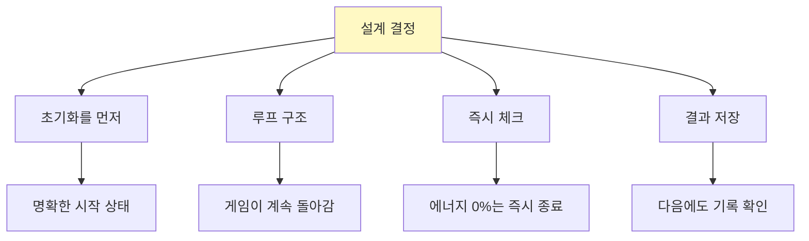

---

#### Part 3: 설계 이유 탐구 (15분)

**"왜?" 질문 워크시트**

```
💡 설계 이유 탐구하기

1. 왜 초기 에너지를 50%로 했나요?
   □ 너무 높으면: ___________________
   □ 너무 낮으면: ___________________
   □ 50%가 적절한 이유: _____________

2. 왜 에어컨이 가장 많이 소모하나요?
   실제 전력 소비:
   • 전등: 약 10-20W
   • TV: 약 50-150W
   • 에어컨: 약 1000-2000W
   
   게임에서의 교육 효과:
   → _________________________________

3. 왜 OFF 전환 시에만 점수를 주나요?
   □ ON 전환도 점수 주면?
   → _________________________________
   
   □ OFF만 점수 주는 이유:
   → _________________________________

4. 왜 타이머를 60초로 했나요?
   □ 30초면: _________________________
   □ 120초면: ________________________
   □ 60초가 적절한 이유: _____________

5. 왜 별 3개 등급으로 나눴나요?
   □ 2등급이면: ______________________
   □ 5등급이면: ______________________
   □ 3등급의 장점: ___________________
```

**설계 원칙 정리**

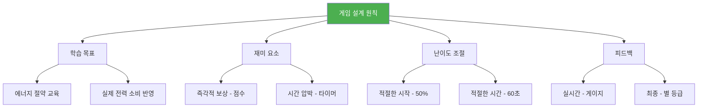

---

### 📊 3차시 평가

| 항목 | 평가 기준 | 배점 |
|------|----------|------|
| **플로우차트** | 전체 흐름 정확히 이해 | 40% |
| **순서도** | 단계별 동작 파악 | 30% |
| **설계 이유** | "왜?" 질문에 답변 | 30% |

---

## 4차시: 에너지 절약 게임 - Modify + Make

### 🎯 학습 목표
- 프롬프트를 수정하여 게임 변형하기
- 나만의 요소를 추가하여 완성하기
- 수정 전후를 비교하고 설명하기

### 📦 예상 결과물
✅ 나만의 에너지 절약 게임

### ⏱️ 시간 배분 (50분)

| 시간 | 활동 | PRIMM | 내용 |
|------|------|-------|------|
| 5분 | 도입 | - | 수정 가능 범위 설명 |
| 20분 | 수정 | M | 프롬프트 수정 시도 |
| 20분 | 창작 | Mk | 나만의 요소 추가 |
| 5분 | 발표 | - | 변경 사항 공유 |

---

### 📚 학습 활동

#### Part 1: Modify - 수정하기 (20분)

**수정 가능한 요소**

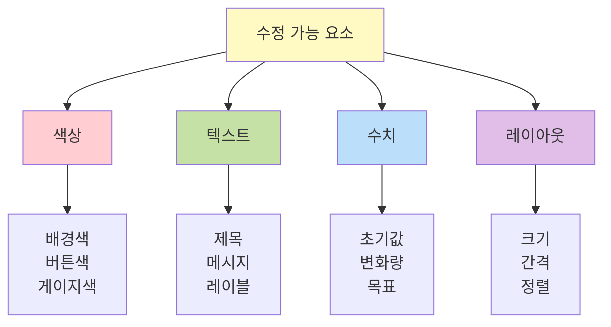

**수정 프롬프트 템플릿**

```
[v0에 추가 입력]

다음을 변경해줘:

## 색상 변경
- 배경: 연한 초록 → [원하는 색]
- 전등 버튼 ON: 노란색 → [원하는 색]
- TV 버튼 ON: 파란색 → [원하는 색]
- 에어컨 버튼 ON: 하늘색 → [원하는 색]

## 텍스트 변경
- 제목: "에너지 절약 챌린지" → "[새 제목]"
- 성공 메시지: "환경 지킴이!" → "[새 메시지]"

## 난이도 변경 (선택)
- 초기 에너지: 50% → [30-70%]
- 타이머: 60초 → [30-90초]
- 목표: 30% → [20-50%]

나머지 로직과 구조는 그대로 유지해줘.
```

**수정 예시**

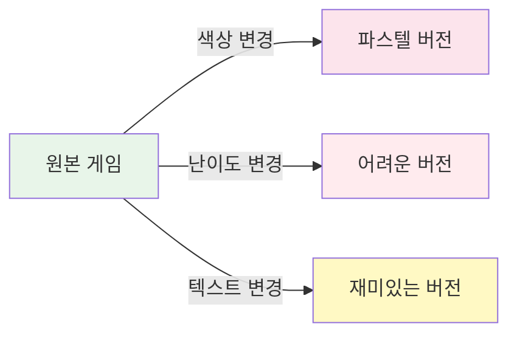

**수정 기록 시트**

```
📝 수정 기록

변경 전 → 변경 후

1. 색상
   - 배경: _______ → _______
   - 버튼: _______ → _______

2. 텍스트
   - 제목: _______ → _______
   - 메시지: _______ → _______

3. 수치 (선택)
   - 초기 에너지: ___% → ___%
   - 타이머: ___초 → ___초

4. 변경 이유
   _________________________________
   _________________________________
```

---

#### Part 2: Make - 창작하기 (20분)

**나만의 요소 추가**

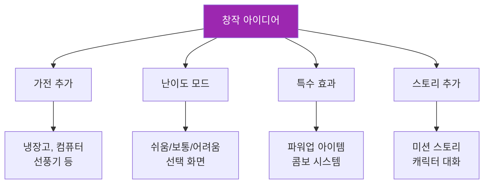

**창작 프롬프트 템플릿**

```
[v0에 추가 입력]

다음 기능을 추가해줘:

## 1. 가전 추가 (예시)
4번째 버튼 추가:
- 이름: 냉장고 🧊
- 크기: 200px × 200px
- ON: 연한 회색
- OFF: 어두운 회색
- 에너지: ON -4%, OFF +2%
- 점수: OFF 전환 시 +40점

## 2. 난이도 선택 (예시)
게임 시작 전 난이도 선택 화면:
- 쉬움: 초기 70%, 타이머 90초
- 보통: 초기 50%, 타이머 60초 (기본)
- 어려움: 초기 30%, 타이머 45초

## 3. 효과음 메시지 (예시)
버튼 클릭 시:
- "좋아요! +30점" 메시지 표시
- 2초간 표시 후 사라짐
- 위치: 버튼 위

기존 로직은 유지하고 새 기능만 추가해줘.
```

**창작 계획서**

```
💡 나만의 게임 만들기

제목: _________________________________

추가할 기능 (1-2개 선택):

1. ___________________________________
   상세 설명:
   ___________________________________
   ___________________________________

2. ___________________________________
   상세 설명:
   ___________________________________
   ___________________________________

예상 효과:
___________________________________
___________________________________

완성 목표:
□ 모든 기능 작동
□ 디자인 통일
□ 친구에게 공유 가능
```

---

### 📊 4차시 평가

| 항목 | 평가 기준 | 배점 |
|------|----------|------|
| **수정** | 프롬프트 수정 성공 | 40% |
| **창작** | 나만의 요소 추가 | 40% |
| **완성도** | 전체 게임 작동 | 20% |

---

## 5-7차시: 바닷속 모험 게임

*(에너지 게임과 동일한 PRIMM 방식 적용)*

### 5차시: Predict + Run
- 해양 게임 관찰 및 예측
- 프롬프트로 생성
- 기능 테스트

### 6차시: Investigate
- 2D 이동 로직 플로우차트
- 충돌 감지 순서도
- 설계 이유 탐구

### 7차시: Modify + Make
- 캐릭터/배경 변경
- 난이도 조정
- 나만의 게임 완성

---

## 8차시: 게임 페어 & 종합 성찰

### 🎯 학습 목표
- 2개 게임을 전시하고 공유하기
- PRIMM 프로세스 전체 회고하기
- 학습 성과 정리하기

### ⏱️ 시간 배분 (50분)

| 시간 | 활동 | 내용 |
|------|------|------|
| 20분 | 게임 페어 | 부스 운영, 동료 게임 플레이 |
| 20분 | 종합 회고 | PRIMM 프로세스 정리 |
| 10분 | 발표 | 우수작 공유 |

---

### 📚 학습 활동

**PRIMM 프로세스 회고**

```mermaid
graph TD
    A[8차시 여정] --> B[Predict<br/>2+5차시]
    A --> C[Run<br/>2+5차시]
    A --> D[Investigate<br/>3+6차시]
    A --> E[Modify<br/>4+7차시]
    A --> F[Make<br/>4+7차시]
    
    B --> B1[관찰력 향상]
    C --> C1[도구 활용]
    D --> D1[구조적 사고]
    E --> E1[적용 능력]
    F --> F1[창의성]
    
    style A fill:#4CAF50,color:#fff
    style D fill:#2196F3,color:#fff
```

**종합 회고 시트**

```
🎓 PRIMM 학습 회고

1. Predict (예측)
   처음 vs 지금:
   - 처음: _________________________
   - 지금: _________________________
   
2. Run (실행)
   프롬프트 작성 능력:
   - 1차시: ★☆☆☆☆
   - 8차시: ★★★★★
   
3. Investigate (조사)
   플로우차트 이해도:
   - 처음: _________________________
   - 지금: _________________________
   
4. Modify (수정)
   가장 어려웠던 수정:
   _________________________________
   
   해결 방법:
   _________________________________
   
5. Make (창작)
   나만의 게임:
   - 에너지 게임: _________________
   - 해양 게임: ___________________
   
   가장 뿌듯한 점:
   _________________________________
```

---

## 🎉 커리큘럼 마무리

### 10학년 학습 성과

```mermaid
graph LR
    A[PRIMM 프로세스] --> B[관찰력]
    A --> C[구조적 사고]
    A --> D[프롬프트 작성]
    A --> E[디버깅]
    A --> F[창의성]
    
    B --> G[문제 해결 능력]
    C --> G
    D --> G
    E --> G
    F --> G
    
    style A fill:#4CAF50,color:#fff
    style G fill:#FFC107
```

### 핵심 메시지

**"구조를 이해하고, 도구를 활용하고, 창의적으로 변형한다!"**

---

**버전**: v3.2 (PRIMM 방식)  
**작성일**: 2025년 11월  
**특징**:
- PRIMM 5단계 명확화
- 차시별 구분
- Mermaid 다이어그램
- 프롬프트 템플릿 중심
- 코드 제거
- 구조와 설계 이유 설명

---

# 📅 5-7차시: 바닷속 모험 게임 (상세)

---

## 5차시: 바닷속 모험 - Predict + Run

### 🎯 학습 목표
- 2D 액션 게임 구조 예측하기
- 키보드 조작과 충돌 감지 개념 이해하기
- 프롬프트로 해양 게임 생성하기

### 📦 예상 결과물
✅ 작동하는 바닷속 모험 게임 (기본 버전)

### ⏱️ 시간 배분 (50분)

| 시간 | 활동 | PRIMM | 내용 |
|------|------|-------|------|
| 15분 | 관찰 | P | 완성 게임 플레이 및 예측 |
| 5분 | 템플릿 | R | 프롬프트 구조 이해 |
| 20분 | 생성 | R | v0로 게임 생성 |
| 10분 | 테스트 | R | 기능 확인 |

---

### 📚 학습 활동

#### Part 1: Predict - 해양 게임 예측 (15분)

**게임 개요**

```mermaid
graph LR
    A[바닷속 모험] --> B[수중 로봇 조종]
    A --> C[플라스틱 수거]
    A --> D[해양 생물 보호]
    A --> E[60초 타이머]
    
    B --> F[키보드 조작<br/>↑↓←→]
    C --> G[충돌 감지<br/>자동 수거]
    D --> H[보너스 점수<br/>+50점]
    
    style A fill:#0288D1,color:#fff
```

**예측 워크시트**

```
🔮 해양 게임 예측하기

[완성 게임을 플레이하고 답하세요]

1. 캐릭터 조작 예측
   이동 방법: _______________________
   이동 속도: _______________________
   경계 처리: _______________________

2. 아이템 예측
   플라스틱:
   • 생성 위치: ____________________
   • 이동 방향: ____________________
   • 사라지는 때: __________________
   
   물고기:
   • 이동 패턴: ____________________
   • 충돌 시: ______________________

3. 게임 로직 예측
   수거 방법: _______________________
   목표 개수: _______________________
   충돌 감지: _______________________

4. 에너지 게임과의 차이
   • 조작: 클릭 → ___________________
   • 구조: 상태 관리 → ______________
   • 난이도: ________________________
```

**2D 게임 구조 예측**

```mermaid
graph TD
    Start[게임 시작] --> Init[캐릭터 위치<br/>아이템 생성]
    Init --> Loop[게임 루프<br/>60fps]
    
    Loop --> Input[키 입력 확인]
    Loop --> Move[아이템 이동]
    Loop --> Collision[충돌 감지]
    
    Input --> Update1[캐릭터 위치 업데이트]
    Move --> Update2[아이템 위치 업데이트]
    Collision --> Update3[수거/점수 업데이트]
    
    Update1 --> Check{종료?}
    Update2 --> Check
    Update3 --> Check
    
    Check -->|No| Loop
    Check -->|Yes| Result[결과]
    
    style Start fill:#0288D1,color:#fff
    style Loop fill:#4CAF50,color:#fff
```

---

#### Part 2: Run - 프롬프트로 생성 (25분)

**바닷속 모험 프롬프트 템플릿**

```
[v0에 붙여넣기]

당신은 교육용 게임 개발자입니다.

학생들에게 해양 오염 문제를 알리는 2D 액션 게임을 만들어주세요.

## 게임 개요
- 제목: 바닷속 모험
- 목표: 60초 동안 플라스틱 20개 수거
- 조작: 키보드 방향키 (↑↓←→)
- 교육: 해양 오염, 생태 보전

## 화면 구성

### 배경
- 크기: 800px × 600px
- 색상: 바다 그라데이션
  * 상단: 밝은 파란색 (#0288D1)
  * 하단: 어두운 파란색 (#01579B)

### 상단 HUD
1. 수거 현황
   - "🗑️ 수거: X/20개"
   - 크기: 24px
   - 색상: 흰색
   - 배경: 반투명 검은색

2. 타이머
   - "⏱️ XX초"
   - 크기: 32px
   - 30초 미만: 빨간색

3. 점수
   - "💰 XXX점"
   - 크기: 24px
   - 색상: 노란색

### 게임 영역

**캐릭터: 수중 로봇**
- 크기: 50px × 50px (원형)
- 색상: 주황색 (#FF9800)
- 테두리: 4px 흰색
- 이모지: 🤖 (40px)
- 초기 위치: (375, 550) - 하단 중앙
- 이동 속도: 5px/키 입력
- 경계: 0-750 (x), 0-550 (y)

**플라스틱**
- 크기: 30px × 30px
- 색상: 흰색
- 테두리: 2px 회색
- 이모지: 🗑️ (24px)
- 생성: 5개
  * 위치: 랜덤 x(0-770), y(0)
- 이동: 아래로 1px/프레임
- 재생성: y > 600이면 상단 재생성

**물고기**
- 크기: 40px × 40px
- 이모지: 🐠 🐟 🐡 (랜덤)
- 개수: 3마리
- 위치: 랜덤 x(50-750), y(100-500)
- 이동: 좌우 2px/프레임
- 방향 반전: 경계 도달 시

## 게임 로직

### 초기값
- 로봇 위치: {x: 375, y: 550}
- 수거: 0/20개
- 타이머: 60초
- 점수: 0점

### 키보드 조작
- ArrowUp: y -5px
- ArrowDown: y +5px
- ArrowLeft: x -5px
- ArrowRight: x +5px
- 경계 체크: x(0-750), y(0-550)

### 게임 루프 (60fps)
매 프레임마다:
1. 키 입력 확인 → 로봇 이동
2. 플라스틱 아래로 이동
3. 물고기 좌우 이동
4. 충돌 감지

### 충돌 감지
플라스틱 충돌:
- 조건: |로봇x - 플라스틱x| < 40 AND
        |로봇y - 플라스틱y| < 40
- 처리:
  * 플라스틱 상단 재생성
  * 수거 +1
  * 점수 +10

물고기 충돌:
- 조건: 동일
- 처리:
  * 점수 +50
  * "생물 보호! +50" 메시지 (2초)
  * 물고기는 그대로

### 종료 조건
- 20개 수거 → 즉시 승리
- 60초 종료 → 결과 계산

### 결과
- 20개: ⭐⭐⭐ "바다가 깨끗해졌어요!"
- 15-19개: ⭐⭐ "잘했어요!"
- 10-14개: ⭐ "다시 도전!"
- <10개: "더 노력해요!"

## 디자인
- 버튼: 둥근 모서리, 그림자
- 애니메이션: 부드러운 이동
- 반응형: 모바일 대응

## 기술
- Next.js 14
- Tailwind CSS
- React useState, useEffect, useRef
- requestAnimationFrame (게임 루프)
- localStorage (최고 점수)

이 게임을 만들어주세요.
```

---

#### Part 3: 테스트 - 기능 확인 (10분)

**체크리스트**

```
✅ 바닷속 모험 테스트

□ 1단계: 캐릭터 조작
  □ ↑ 키: 위로 이동
  □ ↓ 키: 아래로 이동
  □ ← 키: 왼쪽 이동
  □ → 키: 오른쪽 이동
  □ 화면 밖 안 나감

□ 2단계: 플라스틱
  □ 5개 표시
  □ 아래로 천천히 이동
  □ 화면 밖 나가면 재생성

□ 3단계: 물고기
  □ 3마리 표시
  □ 좌우로 이동
  □ 경계에서 방향 전환

□ 4단계: 충돌
  □ 플라스틱 닿으면 수거
  □ 수거 카운트 증가
  □ 점수 +10
  □ 물고기 닿으면 +50
  □ 메시지 표시

□ 5단계: 종료
  □ 20개 수거 → 승리
  □ 60초 → 결과
  □ 별 개수 정확
```

---

## 6차시: 바닷속 모험 - Investigate

### 🎯 학습 목표
- 2D 이동 로직 플로우차트 이해하기
- 충돌 감지 알고리즘 분석하기
- 게임 루프 개념 파악하기

### 📦 예상 결과물
✅ 플로우차트 분석 보고서 + 충돌 감지 이해

### ⏱️ 시간 배분 (50분)

| 시간 | 활동 | 내용 |
|------|------|------|
| 20분 | 플로우차트 | 전체 흐름 + 게임 루프 |
| 15분 | 충돌 감지 | 수학적 원리 이해 |
| 10분 | 설계 이유 | "왜?" 질문 |
| 5분 | 정리 | 핵심 개념 |

---

### 📚 학습 활동

#### Part 1: 플로우차트 읽기 (20분)

**바닷속 모험 전체 플로우차트**

```mermaid
flowchart TD
    Start([게임 시작]) --> Init[초기화<br/>로봇 375,550<br/>플라스틱 5개<br/>물고기 3마리]
    
    Init --> StartLoop[게임 루프 시작<br/>requestAnimationFrame]
    
    StartLoop --> LoopCheck{게임 진행 중?}
    
    LoopCheck -->|Yes| Frame[프레임 처리<br/>60fps]
    LoopCheck -->|No| ShowResult[결과 화면]
    
    Frame --> Input[1. 키 입력 확인]
    
    Input --> CheckKeys{누른 키?}
    CheckKeys -->|Up| MoveUp[y -5px]
    CheckKeys -->|Down| MoveDown[y +5px]
    CheckKeys -->|Left| MoveLeft[x -5px]
    CheckKeys -->|Right| MoveRight[x +5px]
    CheckKeys -->|없음| NoMove[이동 없음]
    
    MoveUp --> BoundCheck[경계 체크]
    MoveDown --> BoundCheck
    MoveLeft --> BoundCheck
    MoveRight --> BoundCheck
    NoMove --> MovePlastics
    
    BoundCheck --> ClampPos[위치 보정<br/>x: 0-750<br/>y: 0-550]
    ClampPos --> MovePlastics
    
    MovePlastics[2. 플라스틱 이동] --> PlasticLoop{각 플라스틱}
    PlasticLoop --> PlasticDown[y +1px]
    PlasticDown --> CheckOffScreen{y > 600?}
    CheckOffScreen -->|Yes| RegenPlastic[y=0, x=랜덤]
    CheckOffScreen -->|No| NextPlastic[다음]
    RegenPlastic --> NextPlastic
    NextPlastic -->|더 있음| PlasticLoop
    NextPlastic -->|끝| MoveFishes
    
    MoveFishes[3. 물고기 이동] --> FishLoop{각 물고기}
    FishLoop --> FishMove{방향?}
    FishMove -->|Right| FishRight[x +2px]
    FishMove -->|Left| FishLeft[x -2px]
    FishRight --> CheckFishBound{경계?}
    FishLeft --> CheckFishBound
    CheckFishBound -->|Yes| Reverse[방향 반전]
    CheckFishBound -->|No| NextFish[다음]
    Reverse --> NextFish
    NextFish -->|더 있음| FishLoop
    NextFish -->|끝| CollisionCheck
    
    CollisionCheck[4. 충돌 감지] --> CheckAllPlastics{각 플라스틱}
    
    CheckAllPlastics --> CalcDist[거리 계산<br/>dx = abs(rx-px)<br/>dy = abs(ry-py)]
    CalcDist --> IsCollide{dx<40 AND<br/>dy<40?}
    
    IsCollide -->|Yes| CollectPlastic[수거 처리<br/>+1 개<br/>+10 점<br/>재생성]
    IsCollide -->|No| NextCheck1[다음]
    
    CollectPlastic --> CheckWin{수거=20?}
    CheckWin -->|Yes| Victory[즉시 승리]
    CheckWin -->|No| NextCheck1
    
    NextCheck1 -->|더 있음| CheckAllPlastics
    NextCheck1 -->|끝| CheckFishColl
    
    CheckFishColl[물고기 충돌] --> FishCollLoop{각 물고기}
    FishCollLoop --> CalcFishDist[거리 계산]
    CalcFishDist --> IsFishColl{충돌?}
    IsFishColl -->|Yes| BonusScore[+50점<br/>메시지]
    IsFishColl -->|No| NextCheck2[다음]
    BonusScore --> NextCheck2
    NextCheck2 -->|더 있음| FishCollLoop
    NextCheck2 -->|끝| TimerCheck
    
    TimerCheck[타이머 체크] --> DecTimer{1초 경과?}
    DecTimer -->|Yes| TimerDec[timer -1]
    DecTimer -->|No| UpdateUI
    TimerDec --> CheckTimeZero{timer=0?}
    CheckTimeZero -->|Yes| CalcResult[결과 계산]
    CheckTimeZero -->|No| UpdateUI
    
    UpdateUI[5. UI 업데이트] --> NextFrame[다음 프레임]
    NextFrame --> LoopCheck
    
    Victory --> ShowResult
    CalcResult --> ResultCheck{수거량?}
    ResultCheck -->|>=20| Stars3[⭐⭐⭐]
    ResultCheck -->|15-19| Stars2[⭐⭐]
    ResultCheck -->|10-14| Stars1[⭐]
    ResultCheck -->|<10| Stars0[💪]
    
    Stars3 --> ShowResult
    Stars2 --> ShowResult
    Stars1 --> ShowResult
    Stars0 --> ShowResult
    
    ShowResult --> SaveScore[최고 점수]
    SaveScore --> Replay[다시하기]
    Replay -->|클릭| Init
    
    style Start fill:#0288D1,color:#fff
    style Victory fill:#4CAF50,color:#fff
    style LoopCheck fill:#9C27B0,color:#fff
    style CollisionCheck fill:#FF9800,color:#fff
```

**게임 루프 개념**

```mermaid
sequenceDiagram
    participant 브라우저
    participant 게임루프
    participant 키보드
    participant 화면
    
    브라우저->>게임루프: requestAnimationFrame
    Note over 게임루프: 60fps (16.67ms마다)
    
    loop 매 프레임
        게임루프->>키보드: 키 입력 확인
        키보드-->>게임루프: 방향키 상태
        게임루프->>게임루프: 위치 계산
        게임루프->>게임루프: 충돌 감지
        게임루프->>화면: UI 업데이트
    end
    
    게임루프->>브라우저: 다음 프레임 요청
```

**왜 게임 루프를 사용하나요?**

```mermaid
graph TD
    A[게임 루프 필요성] --> B[실시간 처리]
    A --> C[부드러운 움직임]
    A --> D[즉각 반응]
    
    B --> B1["1초에 60번<br/>상태 업데이트"]
    C --> C1["프레임 단위 이동<br/>애니메이션 효과"]
    D --> D1["키 입력 즉시<br/>화면 반영"]
    
    style A fill:#FFF9C4
```

---

#### Part 2: 충돌 감지 분석 (15분)

**충돌 감지 알고리즘**

```mermaid
graph TD
    A[충돌 감지<br/>AABB 방식] --> B[로봇 좌표<br/>rx, ry]
    A --> C[플라스틱 좌표<br/>px, py]
    
    B --> D[거리 계산]
    C --> D
    
    D --> E[dx = abs-rx-px-]
    D --> F[dy = abs-ry-py-]
    
    E --> G{dx < 40?}
    F --> H{dy < 40?}
    
    G -->|Yes| I[X축 겹침]
    H -->|Yes| J[Y축 겹침]
    
    I --> K{둘 다<br/>겹침?}
    J --> K
    
    K -->|Yes| L[충돌!]
    K -->|No| M[충돌 아님]
    
    style L fill:#4CAF50,color:#fff
    style M fill:#F44336,color:#fff
```

**충돌 감지 시각화**

```
로봇 위치: (400, 300)
플라스틱 위치: (420, 310)

거리 계산:
dx = |400 - 420| = 20
dy = |300 - 310| = 10

충돌 판정:
dx < 40? → 20 < 40 ✓
dy < 40? → 10 < 40 ✓
결과: 충돌!

┌─────────────────────┐
│                     │
│      (400,300)      │
│        🤖          │
│      로봇 50x50     │
│                     │
│    (420,310)        │
│      🗑️            │
│   플라스틱 30x30    │
│                     │
└─────────────────────┘

겹치는 영역이 있으므로 충돌
```

**왜 40px로 비교하나요?**

```mermaid
graph LR
    A[로봇 크기] --> C[충돌 거리]
    B[플라스틱 크기] --> C
    
    A -->|50px / 2| D[25px]
    B -->|30px / 2| E[15px]
    
    D --> F[25 + 15 = 40px]
    E --> F
    
    F --> G[두 중심이<br/>40px 이내면<br/>겹침]
    
    style G fill:#4CAF50,color:#fff
```

---

#### Part 3: 설계 이유 탐구 (10분)

**"왜?" 질문 워크시트**

```
💡 설계 이유 탐구

1. 왜 키보드 조작인가요?
   vs 마우스 클릭:
   □ 키보드: _________________________
   □ 마우스: _________________________
   □ 교육 효과: _______________________

2. 왜 플라스틱이 위에서 떨어지나요?
   실제 해양 오염:
   □ _________________________________
   교육 메시지:
   □ _________________________________

3. 왜 물고기는 제거하지 않나요?
   □ 생태 보전 메시지: _______________
   □ 게임 재미: _______________________

4. 왜 60fps 게임 루프인가요?
   vs 1초마다:
   □ _________________________________
   부드러운 이유:
   □ _________________________________

5. 왜 목표를 20개로 했나요?
   난이도 고려:
   □ _________________________________
```

---

## 7차시: 바닷속 모험 - Modify + Make

### 🎯 학습 목표
- 캐릭터와 배경 커스터마이징하기
- 난이도 조정하기
- 나만의 해양 게임 완성하기

### ⏱️ 시간 배분 (50분)

| 시간 | 활동 | PRIMM | 내용 |
|------|------|-------|------|
| 20분 | 수정 | M | 캐릭터/배경 변경 |
| 25분 | 창작 | Mk | 새 요소 추가 |
| 5분 | 공유 | - | 결과 발표 |

---

### 📚 학습 활동

**수정 프롬프트 템플릿**

```
[v0에 추가 입력]

다음을 변경해줘:

## 캐릭터 변경
- 로봇 🤖 → [원하는 이모지]
  (예: 🐢 거북이, 🦈 상어, 🐙 문어)
- 색상: 주황 → [원하는 색]
- 크기: 50px → [40-60px]

## 배경 변경
- 그라데이션 색상:
  * 상단: #0288D1 → [원하는 색]
  * 하단: #01579B → [원하는 색]

## 플라스틱 종류
- 🗑️ 단일 → 랜덤 (🗑️ 🧴 🥤 🍾)
- 각각 다른 점수:
  * 🗑️: +10점
  * 🧴: +15점
  * 🥤: +20점
  * 🍾: +25점

## 난이도 조정
- 이동 속도: 5px → [3-7px]
- 플라스틱 속도: 1px → [0.5-2px]
- 목표: 20개 → [15-30개]
- 타이머: 60초 → [45-90초]

기존 로직은 유지해줘.
```

**창작 아이디어**

```mermaid
graph TD
    A[창작 아이디어] --> B[장애물 추가]
    A --> C[파워업 아이템]
    A --> D[레벨 시스템]
    A --> E[스토리 모드]
    
    B --> B1["바위, 해파리<br/>닿으면 점수 감소"]
    C --> C1["속도 UP<br/>무적 모드"]
    D --> D1["레벨 1→2→3<br/>점점 어려워짐"]
    E --> E1["미션 스토리<br/>캐릭터 대화"]
    
    style A fill:#0288D1,color:#fff
```

---

## 📊 교사용 운영 가이드

### 차시별 준비물

| 차시 | 준비물 | 비고 |
|------|--------|------|
| 1 | 샘플 게임 링크 | 미리 생성 |
| 2,5 | 완성 게임 링크 | 미리 생성 |
| 3,6 | 플로우차트 출력물 | A4 크기 |
| 4,7 | 커스터마이징 예시 | 화면 공유 |
| 8 | 전시 부스 준비 | QR 코드 |

### 수업 운영 TIP

```mermaid
graph LR
    A[성공 포인트] --> B[명확한 예시]
    A --> C[단계별 진행]
    A --> D[충분한 시간]
    A --> E[즉각 피드백]
    
    B --> F[효과적 학습]
    C --> F
    D --> F
    E --> F
    
    style A fill:#4CAF50,color:#fff
    style F fill:#FFC107
```

---

## 🎓 학습 평가 루브릭

### 전체 평가표

| 영역 | 우수 (3점) | 보통 (2점) | 미흡 (1점) |
|------|-----------|-----------|-----------|
| **Predict** | 구조 정확히 예측, 논리적 설명 | 기본 구조 예측 | 예측 불완전 |
| **Run** | 프롬프트로 완벽 생성 | 생성 성공, 일부 오류 | 생성 실패 다수 |
| **Investigate** | 플로우차트 완벽 이해 | 기본 흐름 이해 | 이해 부족 |
| **Modify** | 창의적 수정 성공 | 기본 수정 성공 | 수정 미완 |
| **Make** | 독창적 요소 추가 | 일부 요소 추가 | 추가 없음 |

---

## 🎉 최종 정리

### PRIMM 학습 효과

```mermaid
graph TD
    A[PRIMM 프로세스] --> B[단계적 학습]
    
    B --> C[Predict:<br/>사전 이해]
    B --> D[Run:<br/>도구 활용]
    B --> E[Investigate:<br/>깊은 이해]
    B --> F[Modify:<br/>응용 능력]
    B --> G[Make:<br/>창의성]
    
    C --> H[문제 해결 능력]
    D --> H
    E --> H
    F --> H
    G --> H
    
    style A fill:#4CAF50,color:#fff
    style H fill:#F00
```

### 핵심 메시지

**"관찰하고, 실행하고, 이해하고, 수정하고, 창작한다!"**

- **Predict**: 먼저 관찰하고 예측한다
- **Run**: 도구를 활용해 실행한다
- **Investigate**: 구조를 깊이 이해한다
- **Modify**: 배운 것을 응용한다
- **Make**: 창의적으로 변형한다

---

**버전**: v3.3 (PRIMM 완성판)  
**작성일**: 2025년 11월  
**특징**:
- ✅ PRIMM 5단계 명확화
- ✅ 차시별 명확한 구분
- ✅ Mermaid 다이어그램 최적화
- ✅ 프롬프트 템플릿 중심
- ✅ 코드 없이 구조 이해
- ✅ 설계 이유 상세 설명
- ✅ 컴퓨터실 20명 수업 최적화
