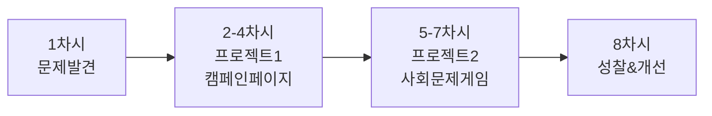
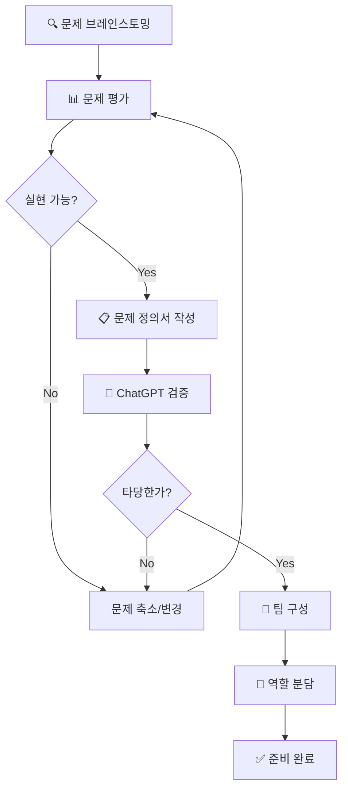
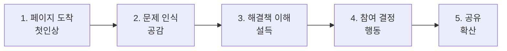

# 🌍 10학년 바이브 코딩 커리큘럼 (8차시)

## 📌 학년 목표 및 핵심 역량

### 학습 목표
- **사회 공감**: 지역사회 문제를 발견하고 해결책 제안하기
- **팀 협업**: 역할 분담과 협업을 통한 프로젝트 완성
- **데이터 활용**: 사용자 입력과 데이터를 활용한 인터랙티브 웹
- **영향력 이해**: 기술이 사회에 미치는 영향 체험

### 핵심 역량
| 역량 | 세부 내용 | 평가 방법 |
|------|----------|----------|
| **문제 발견 능력** | 사회 문제 인식, 사용자 니즈 파악 | 문제 정의서 평가 |
| **협업 능력** | 팀 내 역할 수행, 의사소통 | 동료 평가, 관찰 |
| **AI 리터러시** | 복잡한 프롬프트 작성, AI 활용 전략 | 프롬프트 품질, 결과물 |
| **기업가 정신** | 문제 해결 의지, 실행력 | 프로젝트 완성도 |

---

## 📚 전체 8차시 개요



| 차시 | 주제 | 프로젝트 | 결과물 | 핵심 역량 |
|------|------|---------|--------|----------|
| 1 | 문제 발견 & 팀 구성 | 사회 문제 정의 | 문제 정의서 | 문제 발견 |
| 2 | 캠페인 페이지 기획 | 환경 캠페인 | 기획서 + 구조도 | 기획, 협업 |
| 3 | 캠페인 UI 구현 | 랜딩 페이지 | 메인 페이지 | AI 활용 |
| 4 | 참여 기능 추가 | 서명/댓글 기능 | 완성된 캠페인 | 데이터 처리 |
| 5 | 게임 기획 | 사회문제 게임 | 게임 설계서 | 창의성 |
| 6 | 게임 구현 1 | 게임 메커닉 | 플레이 가능 게임 | 문제 해결 |
| 7 | 게임 완성 | 스코어/피드백 | 완성된 게임 | 디버깅 |
| 8 | 성찰 및 개선 | 사용자 테스트 | 최종 개선안 | 성찰 |

---

## 🎯 차시별 상세 커리큘럼

---

### 📅 1차시: 사회 문제 발견 & 팀 구성

#### 🎯 차시 목표
- 우리 주변의 사회 문제 발견하기
- 문제를 명확히 정의하고 해결책 구상하기
- 팀 구성 및 역할 분담하기

#### 📦 예상 결과물
✅ **문제 정의서** + **팀 구성표**

#### 🧑‍🏫 교사용 지시서

##### 수업 전 준비사항
- [ ] 사회 문제 사례 영상/기사 3개
- [ ] 문제 정의 워크시트 출력
- [ ] 포스트잇, 펜, A4용지
- [ ] 팀 역할 카드 준비

##### 수업 진행 (50분)

| 시간 | 활동 | 교사 행동 | 학생 활동 |
|------|------|----------|----------|
| **5분** | 도입 | - 10학년 목표 소개<br/>- "우리가 바꿀 수 있는 것들" 영상 | - 영상 시청<br/>- 동기부여 |
| **15분** | 문제 발견 | - 브레인스토밍 가이드<br/>- 문제 카테고리 제시<br/>- 질문으로 생각 확장 | - 학교/동네 문제 찾기<br/>- 포스트잇에 적기<br/>- 그룹화 |
| **10분** | 문제 선택 | - 투표 진행<br/>- 실현 가능성 검토<br/>- MVP 관점 강조 | - 상위 3개 문제 투표<br/>- 팀별 문제 선택 |
| **15분** | 팀 구성 | - 역할 설명<br/>- 팀 매칭 지원<br/>- 역할 분담 지도 | - 관심 문제별 팀 구성<br/>- 역할 분담<br/>- 팀명 정하기 |
| **5분** | 정리 | - 각 팀 소개<br/>- 다음 시간 준비사항 | - 팀 발표<br/>- 과제 확인 |

##### 교사 스크립트

```
[도입]
"9학년 때는 '나'를 표현했다면, 
10학년은 '우리'의 문제를 해결합니다.

여러분이 매일 지나치는 불편함,
친구들이 겪는 어려움,
학교나 동네의 문제들...

이것들을 기술로 해결해봅시다!
작은 변화가 큰 영향을 만들 수 있어요."

[문제 발견 가이드]
"좋은 문제란?
1. 구체적이다 (누가, 언제, 어디서, 무엇을)
2. 여러 사람이 겪는다
3. 우리가 해결할 수 있다
4. 8주 안에 프로토타입을 만들 수 있다

예시:
❌ '환경 문제' → 너무 광범위
✅ '우리 학교 식당에서 일회용품 사용이 많다' → 구체적!"

[팀 역할 설명]
"팀 프로젝트의 성공 비결은 명확한 역할 분담!

- 기획 리더: 전체 방향, ChatGPT 질문 총괄
- 디자인 담당: v0 프롬프트, UI/UX
- 개발/테스트: 기능 구현, 디버깅
- 발표 담당: 자료 준비, 스토리텔링

모든 역할이 중요해요!"
```

---

#### 👨‍🎓 학생용 활동 시나리오

##### 미션: 우리가 해결할 문제 찾기

**Step 1: 문제 브레인스토밍 (15분)**

📝 **문제 발견 프레임워크**

```
🔍 어디에서 문제를 찾을까?

┌─────────────────────────────────┐
│ 🏫 학교                          │
│ • 급식/식당                      │
│ • 쓰레기/환경                    │
│ • 이동/접근성                    │
│ • 학습/시험                      │
│ • 동아리/행사                    │
│                                 │
│ 🏘️ 동네                         │
│ • 교통/안전                      │
│ • 공원/시설                      │
│ • 가게/상점                      │
│ • 이웃/커뮤니티                  │
│                                 │
│ 🌍 환경                          │
│ • 플라스틱/쓰레기                │
│ • 에너지 낭비                    │
│ • 물 절약                        │
│                                 │
│ 💪 건강                          │
│ • 운동 부족                      │
│ • 스트레스                       │
│ • 수면/식습관                    │
└─────────────────────────────────┘

포스트잇에 각자 5개씩 적어보세요!
"[장소]에서 [누가] [무엇]때문에 불편하다"
```

**Step 2: 문제 그룹화 및 선택 (10분)**

```
📊 문제 평가 기준

각 문제에 점수 매기기:

1. 심각도 (1-5점)
   많은 사람이 자주 겪는가?

2. 실현가능성 (1-5점)
   우리가 8주 안에 해결책을 만들 수 있나?

3. 영향력 (1-5점)
   해결하면 큰 변화가 있나?

4. 관심도 (1-5점)
   우리 팀이 열정적으로 할 수 있나?

총점이 높은 문제 선택!
```

**Step 3: 문제 정의서 작성 (10분)**

📋 **문제 정의 템플릿**

```
┌───────────────────────────────────┐
│      문제 정의서 (Problem Statement)  │
├───────────────────────────────────┤
│ 프로젝트명: _____________________  │
│ 팀명: __________________________  │
│                                   │
│ 1️⃣ 누가 이 문제를 겪나요?          │
│ (사용자 정의)                      │
│ _______________________________  │
│                                   │
│ 2️⃣ 어떤 문제인가요?                │
│ (구체적으로)                       │
│ _______________________________  │
│ _______________________________  │
│                                   │
│ 3️⃣ 왜 이 문제가 중요한가요?         │
│ (영향, 통계, 사례)                 │
│ _______________________________  │
│                                   │
│ 4️⃣ 우리의 해결책:                  │
│ (1-2문장으로)                     │
│ _______________________________  │
│                                   │
│ 5️⃣ 예상되는 변화:                  │
│ _______________________________  │
│                                   │
│ 6️⃣ 어떻게 측정할까요?              │
│ (성공 지표)                        │
│ _______________________________  │
└───────────────────────────────────┘
```

**Step 4: ChatGPT로 문제 검증 (5분)**

💬 **ChatGPT 질문 예시**

```
"우리 학교 학생들이 일회용 플라스틱을 많이 사용하는 문제를 
해결하고 싶어요.

다음을 알려줘:
1. 이 문제를 해결하기 위한 캠페인 아이디어 3가지
2. 학생들의 참여를 유도하는 방법
3. 효과를 측정할 수 있는 지표
4. 8주 안에 만들 수 있는 웹 프로젝트 제안

중학생이 이해하기 쉽게 설명해줘."
```

**Step 5: 팀 구성 및 역할 분담 (15분)**

👥 **팀 구성**

```
팀 이름: ___________________

├─ 기획 리더 (1명): ___________
│  • 전체 일정 관리
│  • ChatGPT 질문 총괄
│  • 팀 회의 진행
│
├─ 디자인 담당 (1명): ___________
│  • v0 프롬프트 작성
│  • UI/UX 디자인
│  • 색상/레이아웃 결정
│
├─ 개발/테스트 담당 (1명): ___________
│  • 기능 구현 확인
│  • 버그 찾기 및 보고
│  • ChatGPT 디버깅
│
└─ 발표/콘텐츠 담당 (1명): ___________
   • 텍스트 콘텐츠 작성
   • 발표 자료 준비
   • 스토리텔링
```

**과제: 문제 조사하기**

```
다음 시간까지 준비할 것:

□ 우리 문제에 대한 추가 조사
  (통계, 사례, 기사 등)

□ 비슷한 캠페인 사례 3개 찾기
  (좋은 점, 아쉬운 점 정리)

□ 우리 해결책에 필요한 기능 리스트

□ 각자 역할에 맞는 준비
  - 기획: 유사 프로젝트 구조 분석
  - 디자인: 레퍼런스 이미지 수집
  - 개발: 필요한 기능 정리
  - 발표: 문제 스토리 초안
```

---

#### 🔄 문제 발견 프로세스



---

#### 📊 평가 기준

| 항목 | 상 (3점) | 중 (2점) | 하 (1점) |
|------|---------|---------|---------|
| **문제 정의** | 구체적이고 측정 가능, 실현가능 | 기본 정의되었으나 모호함 | 불명확하거나 비현실적 |
| **팀 구성** | 역할 명확, 균형적 분배 | 역할 정해짐, 일부 중복 | 역할 불명확 |
| **참여도** | 적극적 아이디어 제시, 협업 | 기본 참여 | 소극적 참여 |

---

### 📅 2차시: 환경 캠페인 페이지 기획

#### 🎯 차시 목표
- 캠페인 페이지 구조 설계하기
- 사용자 여정 맵 그리기
- 페이지별 콘텐츠 기획하기

#### 📦 예상 결과물
✅ **캠페인 기획서** (구조도 + 사용자 여정 + 콘텐츠)

#### 🧑‍🏫 교사용 지시서

##### 수업 진행 (50분)

| 시간 | 활동 | 교사 행동 | 학생 활동 |
|------|------|----------|----------|
| **5분** | 도입 | - 과제 확인<br/>- 효과적인 캠페인 페이지 예시 | - 조사 내용 공유 |
| **15분** | 구조 설계 | - 랜딩 페이지 구조 설명<br/>- 사용자 여정 개념 | - 페이지 구조 스케치<br/>- 섹션 정의 |
| **20분** | 콘텐츠 기획 | - 팀별 순회지도<br/>- ChatGPT 활용 가이드 | - 섹션별 콘텐츠 작성<br/>- 문구 다듬기 |
| **10분** | 발표 및 피드백 | - 각 팀 기획 발표<br/>- 동료/교사 피드백 | - 팀 기획 공유<br/>- 피드백 받고 정리 |

---

#### 👨‍🎓 학생용 활동 시나리오

##### 미션: 임팩트 있는 캠페인 페이지 설계하기

**Step 1: 캠페인 페이지 구조 설계 (15분)**

📐 **랜딩 페이지 기본 구조**

```
┌────────────────────────────────┐
│ 섹션 1: HERO (첫 화면)          │
│ • 강렬한 이미지/비디오          │
│ • 핵심 메시지 (1문장)           │
│ • CTA 버튼 (참여하기)           │
├────────────────────────────────┤
│ 섹션 2: 문제 제시               │
│ • 현재 상황 (통계/사실)         │
│ • 시각 자료 (그래프/이미지)     │
│ • 감정적 호소                   │
├────────────────────────────────┤
│ 섹션 3: 해결책 소개             │
│ • 우리의 제안                   │
│ • 3가지 실천 방법               │
│ • 아이콘/일러스트              │
├────────────────────────────────┤
│ 섹션 4: 참여 방법               │
│ • 서명/댓글/공유               │
│ • 간단한 폼                    │
│ • 참여자 수 카운터              │
├────────────────────────────────┤
│ 섹션 5: 임팩트 보여주기         │
│ • 예상 효과                     │
│ • 타임라인                      │
│ • 공유 버튼                    │
└────────────────────────────────┘

우리 캠페인에 맞게 수정하기!
```

**Step 2: 사용자 여정 맵 (10분)**



📝 **각 단계별 질문**

```
1️⃣ 첫 5초: 무엇이 보여야 사용자를 멈추게 할까?
   → _______________________________

2️⃣ 문제 인식: 어떻게 공감을 이끌어낼까?
   → _______________________________

3️⃣ 해결책: 무엇을 제안할까?
   → _______________________________

4️⃣ 참여: 어떤 행동을 요청할까?
   → _______________________________

5️⃣ 공유: 어떻게 확산시킬까?
   → _______________________________
```

**Step 3: ChatGPT로 콘텐츠 작성 (20분)**

💬 **ChatGPT 프롬프트 예시**

```
[HERO 섹션 문구]
"환경 캠페인 랜딩 페이지의 HERO 섹션 문구를 만들어줘.

주제: 학교 내 일회용 플라스틱 사용 줄이기
목표 사용자: 중고등학생
톤앤매너: 친근하고 행동을 이끄는

다음을 포함해줘:
1. 강렬한 헤드라인 (10자 이내)
2. 서브 헤드라인 (한 문장)
3. CTA 버튼 문구 (3-5자)

5가지 버전을 제안해줘."

[문제 제시 섹션]
"일회용 플라스틱 문제를 설득력 있게 제시하는 
문구와 통계를 만들어줘.

형식:
- 충격적인 통계 1개
- 공감 유도 문장 2개
- 구체적인 학교 내 사례

중학생이 이해하기 쉽고 공감할 수 있게."
```

**섹션별 콘텐츠 작성**

```
┌──────────────────────────────────┐
│      캠페인 콘텐츠 기획서         │
├──────────────────────────────────┤
│ 📱 HERO 섹션                     │
│ • 헤드라인: ____________________ │
│ • 서브헤드: ____________________ │
│ • CTA 버튼: ____________________ │
│ • 배경 이미지: _________________ │
│                                  │
│ 📊 문제 제시 섹션                 │
│ • 핵심 통계: ___________________ │
│ • 사실 1: ______________________ │
│ • 사실 2: ______________________ │
│ • 감정 문구: ___________________ │
│                                  │
│ 💡 해결책 섹션                    │
│ • 제목: _______________________ │
│ • 실천방법 1: __________________ │
│ • 실천방법 2: __________________ │
│ • 실천방법 3: __________________ │
│                                  │
│ ✍️ 참여 섹션                     │
│ • 제목: _______________________ │
│ • 설명: _______________________ │
│ • 입력 항목:                     │
│   - ____________________________│
│   - ____________________________│
│ • 버튼 문구: ___________________ │
│                                  │
│ 🎯 임팩트 섹션                    │
│ • 예상 효과: ___________________ │
│ • 타임라인: ____________________ │
│ • 마무리 멘트: _________________ │
└──────────────────────────────────┘
```

**Step 4: 디자인 레퍼런스 (5분)**

```
🎨 우리 캠페인 디자인 방향

색상:
• 주 색상: ____________ (이유: _____)
• 보조 색상: __________ 
• 강조 색상: __________

분위기:
□ 진지하고 사실적
□ 밝고 긍정적
□ 긴급하고 행동 중심
□ 따뜻하고 공감적

레퍼런스 이미지:
1. ________________________
2. ________________________
3. ________________________
```

---

#### 📊 평가 기준

| 항목 | 상 (3점) | 중 (2점) | 하 (1점) |
|------|---------|---------|---------|
| **구조 설계** | 논리적 흐름, 사용자 여정 명확 | 기본 구조 있음 | 구조 불명확 |
| **콘텐츠** | 설득력 있고 구체적 | 기본 내용 포함 | 내용 부족 |
| **팀 협업** | 역할 분담 잘됨, 활발한 논의 | 기본 협업 | 협업 미흡 |

---

### 📅 3차시: 캠페인 UI 구현

#### 🎯 차시 목표
- v0로 캠페인 페이지 생성하기
- 섹션별 디자인 구현하기
- 반응형 디자인 적용하기

#### 📦 예상 결과물
✅ **캠페인 랜딩 페이지** (5개 섹션 완성)

#### 👨‍🎓 학생용 활동 시나리오

##### 미션: 임팩트 있는 페이지 만들기

**v0 프롬프트 - HERO 섹션**

```
"환경 캠페인 랜딩 페이지를 만들어줘.

HERO 섹션:
• 전체 화면 크기
• 배경: [주제와 관련된 이미지] 위에 어두운 오버레이
• 중앙에 텍스트:
  - 헤드라인: '[우리가 작성한 헤드라인]' (매우 크고 굵게)
  - 서브헤드: '[서브헤드]' (중간 크기)
  - CTA 버튼: '[버튼 문구]' (크고 눈에 띄게, [색상])
• 하단에 아래 화살표 (스크롤 유도)

스타일:
• 헤드라인: 흰색, 텍스트 그림자
• 버튼: 호버 시 색상 변경, 애니메이션
• 전체적으로 임팩트 있고 진지한 느낌

Next.js, Tailwind CSS, Framer Motion 사용"
```

**v0 프롬프트 - 문제 제시 섹션**

```
"문제 제시 섹션을 추가해줘.

레이아웃:
• 좌측 (50%): 통계 카드
  - 큰 숫자: '[통계 숫자]'
  - 설명: '[통계 설명]'
  - 배경: 어두운 [주 색상]
  
• 우측 (50%): 텍스트
  - 제목: '지금 우리 학교는...'
  - 본문: [작성한 문제 설명]
  - 리스트: 3가지 구체적 사례

스타일:
• 패딩: 넉넉하게
• 통계 숫자: 매우 크게 (8xl), 카운트업 애니메이션
• 스크롤 시 페이드인 애니메이션

모바일에서는 세로 배치"
```

**v0 프롬프트 - 해결책 섹션**

```
"해결책 섹션을 만들어줘.

구조:
• 제목: '우리가 할 수 있는 3가지' (중앙 정렬)
• 3개 카드 (가로 배치):
  
  카드 1:
  • 아이콘: [관련 이모지/아이콘]
  • 제목: '[실천방법 1]'
  • 설명: [설명 텍스트]
  
  카드 2, 3 동일

카드 스타일:
• 흰색 배경, 그림자
• 둥근 모서리
• 호버 시 살짝 위로 올라가는 효과
• 아이콘 크게

레이아웃:
• 그리드 3열 (모바일에서는 1열)
• 카드 간격 적절하게

배경: 연한 [색상]"
```

**Step: 디버깅 및 개선 (10분)**

```
✅ 체크리스트:

□ 모든 섹션이 보이나요?
□ 텍스트가 잘 읽히나요?
□ 버튼이 작동하나요?
□ 색상 조합이 좋은가요?
□ 모바일에서도 잘 보이나요?

🔧 수정이 필요하면:
"[섹션명]의 [요소]를 [변경내용]으로 수정해줘"
```

---

### 📅 4차시: 참여 기능 추가

#### 🎯 차시 목표
- 서명/댓글 기능 구현하기
- localStorage에 데이터 저장하기
- 참여자 카운터 만들기

#### 📦 예상 결과물
✅ **완성된 캠페인 페이지** (참여 기능 작동)

#### 👨‍🎓 학생용 활동 시나리오

**v0 프롬프트 - 참여 폼**

```
"참여 섹션을 추가해줘.

구조:
• 제목: '당신의 한 줄이 변화를 만듭니다' (중앙)
• 참여자 수 표시: '🌱 현재 [숫자]명 참여 중'
• 입력 폼:
  - 이름 (필수, 익명 가능)
  - 한 줄 메시지 (선택, 100자)
  - '참여하기' 버튼

기능:
• 참여하기 클릭 시:
  1. localStorage에 저장
  2. 참여자 수 +1
  3. 성공 메시지 표시 (축하 애니메이션)
  4. 폼 초기화

스타일:
• 중앙 정렬, 넓은 카드 형식
• 입력창: 큼직하고 명확하게
• 버튼: 밝은 [색상], 크게

아래에 최근 참여 메시지 3개 표시 (말풍선 형식)"
```

**ChatGPT 디버깅 질문**

```
"캠페인 페이지 참여 기능을 만들고 있어요.

요구사항:
1. 이름과 메시지를 localStorage에 저장
2. 참여자 수를 실시간으로 표시
3. 최근 참여 메시지 3개를 보여줌

현재 문제:
- [발생한 문제 설명]

코드: [관련 코드 붙여넣기]

어떻게 수정하면 될까요?"
```

---

### 📅 5-7차시: 사회문제 해결 게임 프로젝트

*(계속 작성 중... 문서가 길어서 주요 구조만 제시)*

#### 5차시: 게임 기획
- 게임 메커닉 설계
- 플레이 플로우 차트
- 교육적 메시지 통합

#### 6-7차시: 게임 구현
- 게임 화면 UI
- 점수/레벨 시스템
- 피드백 메시지

---

### 📅 8차시: 사용자 테스트 및 성찰

#### 🎯 차시 목표
- 다른 반 학생들에게 테스트하기
- 피드백 받고 개선하기
- 프로젝트 성찰하기

#### 📦 예상 결과물
✅ **사용자 테스트 리포트** + **개선 계획서**

---

## 📖 교사용 종합 가이드

### 팀 프로젝트 관리 TIP

```
✅ 성공적인 팀 프로젝트를 위한 체크리스트:

주차별:
• 1-2차시: 역할 명확히, 소통 채널 정하기
• 3-4차시: 진도 체크, 낙오자 없이
• 5-6차시: 중간 점검, 방향 조정
• 7-8차시: 완성도 높이기, 발표 준비

매 수업:
□ 팀별 5분 스탠드업 (진행 상황 공유)
□ 막힌 팀 우선 지원
□ 역할별 진도 확인
□ 갈등 조기 발견 및 중재
```

---

**버전**: v1.0 (10학년용)  
**작성일**: 2025년 11월
