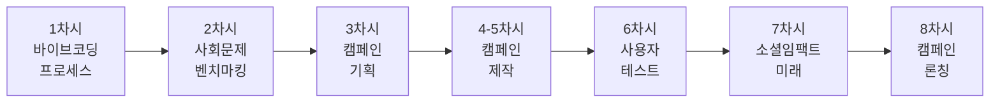
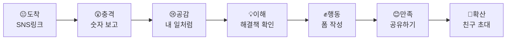
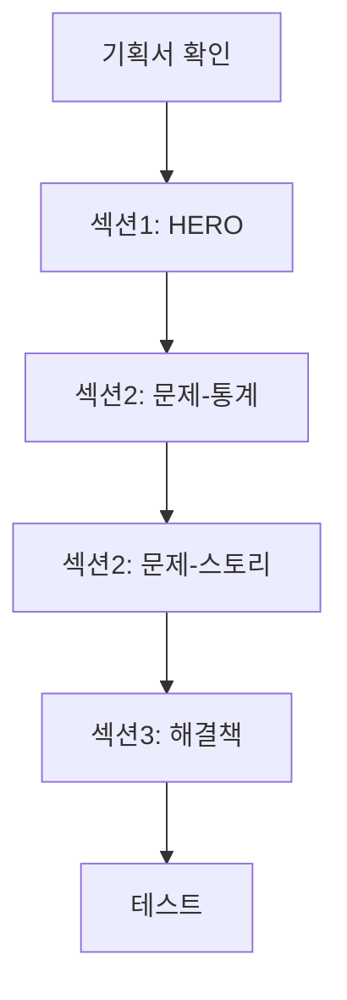

# 🌍 10학년 바이브 코딩 커리큘럼 (8차시)

## 📌 학년 목표 및 핵심 역량

### 학습 목표
- **사회 공감**: 지역사회 문제를 발견하고 해결책 제안하기
- **팀 협업**: 역할 분담과 협업을 통한 프로젝트 완성
- **프로세스 이해**: 벤치마킹 → 기획 → 제작 → 테스트 → 발전
- **임팩트 창출**: 실제로 변화를 만드는 프로젝트 경험

### 핵심 역량
| 역량 | 세부 내용 | 평가 방법 |
|------|----------|----------|
| **문제 발견 능력** | 사회 문제 인식, 니즈 파악 | 문제 정의서 |
| **벤치마킹 능력** | 소셜 임팩트 사례 분석 | 분석 보고서 |
| **협업 능력** | 팀 역할 수행, 의사소통 | 동료 평가 |
| **AI 리터러시** | 복잡한 프로젝트 구현 | 결과물 완성도 |

---

## 📚 전체 8차시 개요



| 차시 | 주제 | 핵심 활동 | 결과물 | 프로세스 단계 |
|------|------|----------|--------|--------------|
| 1 | 바이브 코딩 프로세스 | ChatGPT+v0 체험, 전체 프로세스 | 샘플 프로젝트 | 🎯 프로세스 이해 |
| 2 | 사회문제 벤치마킹 | NGO/캠페인 사례 분석, 문제 선정 | 벤치마킹 + 문제 정의서 | 📊 사례 연구 |
| 3 | 캠페인 페이지 기획 | 사용자 여정, 구조 설계 | 캠페인 기획서 | 📋 기획 |
| 4-5 | 캠페인 제작 | v0로 랜딩페이지 구현 | 캠페인 웹사이트 | 🛠️ 제작 |
| 6 | 사용자 테스트 | 타겟 사용자 피드백 수집 | 테스트 리포트 | 🐛 테스트 |
| 7 | 소셜 임팩트 미래 & 정리 | 사회혁신 트렌드, 제작 과정 문서화 | 임팩트 리포트 | 🚀 발전 방향 |
| 8 | 캠페인 론칭 & 성찰 | 실제 배포, 팀 성찰 | 라이브 캠페인 | 🎉 완성 |

---

## 🎯 차시별 상세 커리큘럼

---

### 📅 1차시: 바이브 코딩 프로세스 요약 & 사회문제 벤치마킹

> **🎯 10학년 특화 차시**: 프로세스 요약(15분) + 벤치마킹 시작(35분)

#### 🎯 차시 목표
- 바이브 코딩 프로세스 핵심 이해하기 (빠르게)
- 소셜 임팩트 캠페인 사례 분석하기
- 우리 학교/지역의 사회 문제 발견하기

#### 📦 예상 결과물
✅ **벤치마킹 리포트** (최소 3개 캠페인 분석) + **문제 정의서 초안**

---

#### 🧑‍🏫 교사용 지시서

##### 수업 전 준비사항
- [ ] 바이브 코딩 프로세스 요약 PPT (10분 분량)
- [ ] 소셜 캠페인 사례 10개 (국내외)
  - 예: 플라스틱 어택, 채식 챌린지, 공정무역 캠페인
- [ ] NGO/사회적 기업 웹사이트 리스트
- [ ] 벤치마킹 분석표 출력

##### 수업 진행 (50분)

| 시간 | 활동 | 교사 행동 | 학생 활동 |
|------|------|----------|----------|
| **15분** | 바이브 코딩 요약 | - 개념 간단 설명 (5분)<br/>- ChatGPT/v0 시연 (5분)<br/>- 5단계 프로세스 소개 (5분) | - 핵심 개념 이해<br/>- 도구 확인 |
| **10분** | 소셜 임팩트 소개 | - 사회문제 해결 사례 영상<br/>- 벤치마킹 중요성 강조 | - 사례 관찰<br/>- 영감 받기 |
| **20분** | 캠페인 사례 분석 | - 3개 캠페인 분석 가이드<br/>- 분석 기준 제시 | - 3개 캠페인 분석<br/>- 분석표 작성 |
| **5분** | 정리 및 과제 | - 다음 시간 준비사항<br/>- 추가 분석 과제 | - 과제 확인 |

##### 교사 스크립트

```
[Part 1: 바이브 코딩 프로세스 요약 - 15분]

"여러분은 이미 9학년 때 바이브 코딩을 경험했죠?
오늘은 빠르게 복습하고 바로 실전으로 들어갑니다!

바이브 코딩 = AI와 대화로 웹 개발
• ChatGPT: 기획, 질문, 디버깅
• v0: 실제 코드 생성

5단계 프로세스:
1️⃣ 벤치마킹 (오늘부터!)
2️⃣ 기획
3️⃣ 제작
4️⃣ 테스트
5️⃣ 디버깅 & 개선

9학년과 다른 점:
• 개인 프로젝트 → 팀 프로젝트
• 자기표현 → 사회문제 해결
• 작은 페이지 → 임팩트 캠페인

준비됐나요? 바로 시작합니다!"

[Part 2: 벤치마킹 시작 - 35분]

"10학년 프로젝트는 '소셜 임팩트 캠페인'입니다.
= 사회 문제를 알리고 변화를 만드는 웹 캠페인

먼저 성공한 캠페인을 연구합니다.
'플라스틱 어택' 아시나요?
→ 과대 포장 제품을 산 후, 포장재를 매장에 두고 오는 운동
→ 전 세계로 확산, 실제 정책 변화!

오늘 3개 캠페인을 분석하고,
우리가 할 문제를 찾아봅시다!"
```

---

#### 👨‍🎓 학생용 활동 시나리오

##### Part 1: 바이브 코딩 프로세스 복습 (15분)

**바이브 코딩 핵심 요약**

```
🎨 바이브 코딩 (Vibe Coding)

1. 도구
   • ChatGPT: 기획/질문/디버깅 파트너
   • v0: 웹페이지 생성 AI

2. 5단계 프로세스
   벤치마킹 → 기획 → 제작 → 테스트 → 개선

3. 핵심 능력
   ✅ 문제를 명확하게 정의하기
   ✅ AI에게 효과적으로 질문하기
   ✅ 에러를 찾고 해결하기

4. 10학년 프로젝트
   • 주제: 소셜 임팩트 캠페인
   • 형태: 랜딩페이지 (1-2페이지)
   • 목표: 실제 변화 만들기
```

**빠른 도구 체크**

```
✅ 준비 확인:
□ ChatGPT 접속 가능
□ v0.dev 접속 가능
□ 9학년 프로젝트 기억 (포트폴리오)
□ 팀 프로젝트 준비 완료

💡 9학년과 다른 점:
- 혼자 → 팀 (4명)
- 나 → 사회
- 작은 페이지 → 임팩트 캠페인
```

##### Part 2: 소셜 캠페인 벤치마킹 (35분)

**Step 1: 캠페인 사례 찾기 (5분)**

🔍 **추천 벤치마킹 대상**

```
국내 캠페인:
1. 그린피스 코리아 (greenpeace.org/korea)
2. 플라스틱 프리 챌린지
3. 채식한끼 캠페인
4. 제로 웨이스트 샵 홍보

해외 캠페인:
1. Plastic Attack (플라스틱 어택)
2. Earth Hour (지구촌 전등 끄기)
3. Meatless Monday (월요일 채식)
4. #TrashTag Challenge

오늘 분석할 3개 선택:
1. _______________________
2. _______________________
3. _______________________
```

**Step 2: 캠페인 분석 (20분)**

📋 **간소화된 분석표** (빠른 버전)

```
┌────────────────────────────────────┐
│     캠페인 분석표 (#1)             │
├────────────────────────────────────┤
│ 캠페인명: ______________________   │
│ 주최: _________________________    │
│                                    │
│ ⭐ 평가 (각 5점)                    │
│                                    │
│ 1. 문제 명확성: [ ]/5              │
│    다루는 문제: _________________  │
│                                    │
│ 2. 메시지 강력함: [ ]/5             │
│    핵심 슬로건: _________________  │
│                                    │
│ 3. 참여 용이성: [ ]/5               │
│    참여 방법: ___________________  │
│                                    │
│ 4. 시각적 임팩트: [ ]/5             │
│    디자인/색상: _________________  │
│                                    │
│ 5. 실제 효과: [ ]/5                 │
│    참여자 수: ________명           │
│    변화: ________________________  │
│                                    │
│ 📈 총점: ___/25점                  │
│                                    │
│ 💡 우리가 따라할 점 1가지:          │
│ _______________________________    │
│                                    │
│ 💡 우리가 개선할 점 1가지:          │
│ _______________________________    │
└────────────────────────────────────┘

※ 3개 모두 빠르게 분석
```

**Step 3: 우리 문제 정의 초안 (10분)**

```
🎯 우리 팀이 다룰 문제

브레인스토밍 (5분):
• 학교: _________________________
• 동네: _________________________
• 환경: _________________________

벤치마킹 기반 선택 (5분):
분석한 캠페인과 비슷한 구조로 할 수 있는 문제:
_________________________________
_________________________________

다음 시간까지 과제:
□ 선택한 문제 통계 조사
□ 추가 캠페인 2개 더 분석
□ 팀원과 아이디어 논의
```

---

### 📅 2차시: 문제 심화 분석 & 팀 구성

#### 🎯 차시 목표
- 소셜 임팩트 캠페인 사례 분석하기
- 우리 학교/지역의 사회 문제 발견하기
- 팀 구성 및 문제 선정하기

#### 📦 예상 결과물
✅ **벤치마킹 리포트** + **문제 정의서** + **팀 구성표**

---

#### 🧑‍🏫 교사용 지시서

##### 수업 전 준비사항
- [ ] 소셜 캠페인 사례 10개 (국내외)
  - 예: 플라스틱 어택, 채식 챌린지, 공정무역 캠페인
- [ ] NGO/사회적 기업 웹사이트 리스트
- [ ] 벤치마킹 분석표 출력
- [ ] 팀 역할 카드 준비 (4인 1팀)

##### 수업 진행 (50분)

| 시간 | 활동 | 교사 행동 | 학생 활동 |
|------|------|----------|----------|
| **10분** | 소셜 임팩트 소개 | - 사회문제 해결 사례 영상<br/>- 벤치마킹 중요성 강조 | - 사례 관찰<br/>- 영감 받기 |
| **15분** | 캠페인 사례 분석 | - 3개 캠페인 함께 분석<br/>- 성공 요인 도출 | - 분석표 작성<br/>- 인사이트 메모 |
| **15분** | 문제 발견 & 팀 구성 | - 브레인스토밍 가이드<br/>- 팀 매칭 지원 | - 문제 아이디어 10개<br/>- 관심사별 팀 구성 |
| **10분** | 문제 정의 | - 문제 정의 프레임워크 제시<br/>- 순회 지도 | - 팀별 문제 정의서 작성 |

##### 교사 스크립트

```
[소셜 임팩트 캠페인이란?]
"여러분, '플라스틱 어택' 캠페인 들어봤나요?
→ 과대 포장 제품을 산 후, 포장재를 매장에 두고 오는 운동

이게 바로 '소셜 임팩트 캠페인'이에요.
= 사회 문제를 알리고 변화를 만드는 활동

오늘 우리가 할 일:
1. 성공한 캠페인 사례 연구 (벤치마킹)
2. 우리 주변의 문제 찾기
3. 팀 구성해서 해결책 기획

10학년 프로젝트는 '나'가 아니라 '우리'를 위한 거예요!"

[벤치마킹 가이드]
"캠페인을 분석할 때 5가지를 보세요:

1. 문제: 어떤 문제를 해결하려 했나?
2. 타겟: 누구를 대상으로 했나?
3. 메시지: 핵심 메시지가 명확한가?
4. 방법: 어떤 방식으로 참여를 유도했나?
5. 결과: 실제로 변화를 만들었나?

이 5가지로 점수를 매기며 배워봅시다!"
```

---

#### 👨‍🎓 학생용 활동 시나리오

##### 미션: 사회문제 캠페인 분석 & 우리 문제 정의하기

**Step 1: 소셜 캠페인 벤치마킹 (15분)**

🔍 **벤치마킹 대상 찾는 곳**

```
추천 사이트/사례:

국내 캠페인:
1. 그린피스 코리아 (greenpeace.org/korea)
2. 환경운동연합 캠페인
3. 공정무역 캠페인
4. 채식 챌린지 (비건 챌린지)
5. 제로 웨이스트 샵

해외 캠페인:
1. Plastic Attack (플라스틱 어택)
2. Earth Hour (지구촌 전등 끄기)
3. Ice Bucket Challenge
4. #MeToo 운동
5. Fridays for Future (청소년 기후 운동)

내가 분석할 3개:
1. _______________________
2. _______________________
3. _______________________
```

📋 **캠페인 분석표**

```
┌────────────────────────────────────┐
│     소셜 캠페인 벤치마킹 (Site #1)  │
├────────────────────────────────────┤
│ 캠페인명: ______________________   │
│ 주최: _____________ (NGO/기업/개인)│
│ URL: ___________________________   │
│                                    │
│ 📊 5가지 기준 평가 (각 5점 만점)    │
│                                    │
│ 1️⃣ 문제 정의: [ ]/5점              │
│   • 다루는 문제: _________________  │
│   • 명확한가?: □Yes □No            │
│   • 공감되는가?: □Yes □No          │
│                                    │
│ 2️⃣ 타겟 설정: [ ]/5점              │
│   • 대상: _____________________    │
│   • 잘 정의되었나?: □Yes □No       │
│                                    │
│ 3️⃣ 핵심 메시지: [ ]/5점            │
│   • 슬로건: ____________________   │
│   • 기억에 남는가?: □Yes □No       │
│   • 행동 유도 명확?: □Yes □No      │
│                                    │
│ 4️⃣ 참여 방법: [ ]/5점              │
│   • 참여 방식: __________________  │
│     □ SNS 챌린지  □ 서명           │
│     □ 기부  □ 불매운동             │
│     □ 기타: ____________________  │
│   • 쉽게 참여 가능?: □Yes □No      │
│                                    │
│ 5️⃣ 임팩트/결과: [ ]/5점            │
│   • 참여자 수: _____________명     │
│   • 실제 변화: __________________  │
│   • 증명 가능한가?: □Yes □No       │
│                                    │
│ 📈 총점: ___/25점                  │
│                                    │
│ 👍 성공 요인 3가지:                 │
│ 1. ___________________________    │
│ 2. ___________________________    │
│ 3. ___________________________    │
│                                    │
│ 👎 아쉬운 점:                       │
│ 1. ___________________________    │
│ 2. ___________________________    │
│                                    │
│ 💡 우리 캠페인에 적용할 아이디어:   │
│ _______________________________    │
│ _______________________________    │
└────────────────────────────────────┘
```

**Step 2: 우리 주변 문제 발견 (10분)**

🔍 **문제 브레인스토밍**

```
🏫 학교 내 문제:
• 환경: 일회용품, 음식물 쓰레기, 에너지 낭비
• 건강: 운동 부족, 스트레스, 수면 부족
• 사회: 따돌림, 편견, 소통 부족
• 기타: _________________________

🏘️ 지역사회 문제:
• 환경: 쓰레기 무단 투기, 대기오염
• 교통: 안전, 주차 문제
• 공동체: 세대 간 소통, 이웃 간 무관심
• 기타: _________________________

🌍 사회 문제:
• 환경: 기후변화, 플라스틱, 동물 보호
• 인권: 차별, 불평등
• 기타: _________________________

팀원들과 의견 나누고 상위 3개 선택:
1. ______________________________
2. ______________________________
3. ______________________________
```

**Step 3: 문제 선정 및 팀 구성 (5분)**

👥 **팀 구성**

```
팀명: _____________________

├─ 기획 리더 (1명): ___________
│  • 전체 캠페인 방향 설정
│  • ChatGPT 질문 총괄
│  
├─ 디자인 담당 (1명): ___________
│  • v0 프롬프트 작성
│  • 비주얼 콘텐츠
│  
├─ 콘텐츠 담당 (1명): ___________
│  • 카피라이팅
│  • 메시지 개발
│  
└─ 테스트/확산 담당 (1명): ___________
   • 사용자 테스트
   • SNS 확산 전략

선택한 문제: _______________________
```

**Step 4: 문제 정의서 작성 (10분)**

📋 **문제 정의 템플릿**

```
┌───────────────────────────────────┐
│         문제 정의서                │
├───────────────────────────────────┤
│ 캠페인명: _______________________ │
│ 팀명: ___________________________ │
│                                   │
│ 1️⃣ 문제 (Problem)                 │
│                                   │
│ 무엇이 문제인가?                   │
│ _________________________________│
│ _________________________________│
│                                   │
│ 구체적 사례 또는 통계:             │
│ _________________________________│
│                                   │
│ 2️⃣ 타겟 (Target)                  │
│                                   │
│ 누가 이 문제를 겪는가?             │
│ • 나이: _________________________│
│ • 특징: _________________________│
│ • 왜 이들인가?: __________________│
│                                   │
│ 3️⃣ 목표 (Goal)                    │
│                                   │
│ 캠페인으로 무엇을 달성할 것인가?   │
│ _________________________________│
│                                   │
│ 측정 가능한 목표:                  │
│ • 참여자 수: ____명 이상          │
│ • 기간: ____주 동안               │
│ • 변화: _________________________│
│                                   │
│ 4️⃣ 핵심 메시지 (Message)           │
│                                   │
│ 한 문장으로:                       │
│ "___________________________"    │
│                                   │
│ 5️⃣ 행동 촉구 (Call to Action)      │
│                                   │
│ 사람들에게 무엇을 하라고 요청?     │
│ □ 서명하기  □ 공유하기            │
│ □ 실천하기  □ 기부하기            │
│ □ 기타: _________________________│
│                                   │
│ 6️⃣ 벤치마킹 반영 사항              │
│                                   │
│ 분석한 캠페인에서 배운 점:         │
│ 1. ______________________________│
│ 2. ______________________________│
│ 3. ______________________________│
│                                   │
│ 우리 캠페인에 적용:                │
│ _________________________________│
└───────────────────────────────────┘
```

**Step 5: ChatGPT로 검증 (10분)**

💬 **검증 프롬프트**

```
"사회문제 해결 캠페인을 기획 중이야.

[문제 정의서 전체 내용 붙여넣기]

다음을 분석해줘:

1. 이 문제가 실제로 심각한가? (통계, 사례)
2. 타겟이 명확한가?
3. 목표가 현실적인가?
4. 핵심 메시지가 명확하고 기억에 남는가?
5. 행동 촉구가 구체적이고 실행 가능한가?
6. 8주 안에 캠페인 웹사이트를 만들 수 있는가?

솔직하게 평가하고 개선 제안 3가지를 줘.
중학생이 이해할 수 있게."
```

---

#### 📊 평가 기준

| 항목 | 상 (3점) | 중 (2점) | 하 (1점) |
|------|---------|---------|---------|
| **벤치마킹** | 3개 캠페인 심층 분석, 인사이트 명확 | 3개 분석, 기본 내용 | 2개 이하 또는 피상적 |
| **문제 정의** | 구체적이고 측정 가능, 타겟 명확 | 기본 정의, 타겟 있음 | 모호하거나 불명확 |
| **팀 협업** | 역할 명확, 활발한 논의 | 역할 분담됨 | 협업 미흡 |

---

### 📅 3차시: 캠페인 페이지 상세 기획 (기능 중심)

#### 🎯 차시 목표
- 벤치마킹 인사이트를 반영한 캠페인 페이지 기획
- 섹션별 기능 명세서 작성하기
- 데이터 구조 및 사용자 여정 상세 설계하기

#### 📦 예상 결과물
✅ **캠페인 상세 기획서** (기능 명세서 + 데이터 구조 + 사용자 여정맵 + 와이어프레임)

---

#### 🧑‍🏫 교사용 지시서

##### 수업 진행 (50분)

| 시간 | 활동 | 교사 행동 | 학생 활동 |
|------|------|----------|----------|
| **5분** | 도입 | - 벤치마킹 우수 사례 복습<br/>- 캠페인 페이지 구조의 중요성 강조 | - 2차시 분석 결과 확인 |
| **15분** | 기능 정의 | - 섹션별 기능 분류 (HERO, 문제, 해결책 등)<br/>- 캠페인 페이지 필수 요소 설명 | - 5개 섹션 기능 리스트 작성 |
| **15분** | 사용자 여정 | - 여정맵 작성 방법<br/>- 감정 곡선 그리기 | - 도착→공감→행동→확산 여정 설계 |
| **15분** | 콘텐츠 설계 | - ChatGPT 활용 가이드<br/>- 카피라이팅 팁 | - 섹션별 콘텐츠 작성 |

---

#### 👨‍🎓 학생용 활동 시나리오

##### 미션: 기능 중심으로 캠페인 페이지 설계하기

**Step 1: 5개 섹션 기능 정의 (15분)**

📋 **기능 명세서 (캠페인 랜딩페이지)**

```
┌──────────────────────────────────────┐
│      캠페인 페이지 기능 명세서         │
│  테마: 학교 내 일회용 플라스틱 줄이기  │
├──────────────────────────────────────┤
│ 📄 섹션 1: HERO (후킹)                │
├──────────────────────────────────────┤
│ 🎯 목적: 방문자 즉시 후킹, 문제 인식   │
│                                      │
│ ✅ 필수 기능 (MUST):                  │
│ 1. 임팩트 헤드라인                    │
│    - 충격적인 숫자 (초대형)           │
│    - 예: "하루 100개"                │
│    - 폰트: 96px (text-8xl), 굵게     │
│    - 색상: 흰색 (강한 그림자)         │
│    - 애니메이션: 숫자 카운트업         │
│                                      │
│ 2. 서브헤드라인                       │
│    - 문제 설명 (한 문장)              │
│    - 예: "우리 학교가 버리는 일회용 컵"│
│    - 폰트: 32px (text-3xl)           │
│    - 색상: 연한 회색                  │
│                                      │
│ 3. 배경 이미지/비디오                 │
│    - 전체 화면 (h-screen)             │
│    - 어두운 오버레이 (opacity-70)     │
│    - 플라스틱 쓰레기 이미지            │
│    - 시차 스크롤 (parallax) 효과      │
│                                      │
│ 4. CTA 버튼 (주요)                   │
│    - 텍스트: "지금 참여하기" or "변화 시작"│
│    - 크기: 큼직 (px-10 py-5)          │
│    - 색상: 밝은 초록 (환경 테마)      │
│    - 애니메이션: 펄스 (pulse)         │
│    - 클릭 시: 섹션 4로 부드럽게 스크롤 │
│                                      │
│ 5. 스크롤 다운 인디케이터             │
│    - 아이콘: 아래 화살표               │
│    - 위치: 하단 중앙                  │
│    - 애니메이션: 위아래 움직임 (bounce)│
│                                      │
│ 🟡 선택 기능 (SHOULD):                │
│ 6. 실시간 참여자 카운터 (작게)        │
│    - 텍스트: "이미 XXX명이 동참!"     │
│    - 위치: CTA 버튼 아래              │
│    - 숫자 증가 애니메이션             │
│                                      │
│ 📊 데이터 필요 항목:                  │
│ • 충격 숫자: ______________________   │
│ • 헤드라인: ______________________   │
│ • 서브헤드: ______________________   │
│ • 배경 이미지 URL: ________________   │
│ • CTA 버튼 텍스트: ________________   │
│ • 참여자 수 (초기값): ______________   │
└──────────────────────────────────────┘

┌──────────────────────────────────────┐
│ 📄 섹션 2: 문제 제시 (공감)            │
├──────────────────────────────────────┤
│ 🎯 목적: 구체적 통계로 문제 심각성 전달 │
│                                      │
│ ✅ 필수 기능 (MUST):                  │
│ 1. 통계 카드 3개 (그리드)             │
│    - 레이아웃: 1행 3열 (grid-cols-3)  │
│    - 간격: 24px                      │
│    
│    각 카드:                           │
│    • 큰 숫자 (text-6xl, 색상 강조)    │
│    • 단위 (작게)                      │
│    • 설명 (2줄 제한)                  │
│    • 출처 (작게, 회색)                │
│    • 호버: 살짝 확대                  │
│                                      │
│    예시:                              │
│    카드 1: "500개" - 연간 버려지는 컵  │
│    카드 2: "70%" - 재활용 안 되는 비율 │
│    카드 3: "450년" - 분해 소요 시간   │
│                                      │
│ 2. 스토리 섹션                        │
│    - 제목: "실제 사례"                │
│    - 2단 레이아웃 (이미지 | 텍스트)    │
│    • 좌측: 이미지 (정사각형)          │
│    • 우측: 짧은 이야기 (200자)        │
│    - 폰트: 친근한 톤                  │
│                                      │
│ 3. 공감 질문                          │
│    - 텍스트: "당신도 이런 적 있나요?"  │
│    - 폰트: 굵게, 중앙 정렬            │
│    - 체크리스트 3-4개 (체크 아이콘)    │
│      예: "□ 학교에서 일회용 컵 사용"   │
│                                      │
│ 🟡 선택 기능 (SHOULD):                │
│ 4. 스크롤 애니메이션                  │
│    - 카드 순차 페이드인                │
│    - Intersection Observer           │
│                                      │
│ 📊 데이터 필요 항목:                  │
│ • 통계 3개:                           │
│   1. 숫자 / 단위 / 설명 / 출처        │
│   2. 숫자 / 단위 / 설명 / 출처        │
│   3. 숫자 / 단위 / 설명 / 출처        │
│ • 스토리 텍스트: __________________   │
│ • 스토리 이미지 URL: _______________   │
│ • 공감 질문 리스트 (3-4개): _________  │
└──────────────────────────────────────┘

┌──────────────────────────────────────┐
│ 📄 섹션 3: 해결책 소개 (설득)          │
├──────────────────────────────────────┤
│ 🎯 목적: 캠페인 소개 및 실천 방법 제시  │
│                                      │
│ ✅ 필수 기능 (MUST):                  │
│ 1. 캠페인 소개                        │
│    - 제목: "우리의 해결책"            │
│    - 캠페인명 (크게, 굵게)            │
│    - 한 문장 설명                     │
│    - 목표 (예: "일주일에 컵 50개 줄이기")│
│                                      │
│ 2. 3단계 실천 방법                    │
│    - 레이아웃: 1행 3열                │
│    - 각 단계:                         │
│      • 번호 (큰 원형 배지)            │
│      • 아이콘 (이모지 or 아이콘)      │
│      • 제목 (한 줄)                   │
│      • 설명 (2-3줄)                   │
│      • 화살표로 연결                  │
│                                      │
│    예시:                              │
│    1️⃣ 텀블러 가져오기                │
│    2️⃣ 친구에게 알리기                │
│    3️⃣ 인증샷 공유하기                │
│                                      │
│ 3. 기대 효과 (임팩트)                 │
│    - 제목: "함께하면 이렇게 달라져요"  │
│    - 2개 카드 (Before/After)          │
│      • Before: 현재 상황 (어두운 색)  │
│      • After: 개선 후 (밝은 색)       │
│    - 숫자로 효과 표시                 │
│                                      │
│ 🟡 선택 기능 (SHOULD):                │
│ 4. 타임라인 (캠페인 기간)             │
│    - 시작일 / 현재 / 종료일           │
│    - 프로그레스 바                    │
│                                      │
│ 📊 데이터 필요 항목:                  │
│ • 캠페인명: ______________________   │
│ • 캠페인 설명 (1문장): ____________   │
│ • 목표: __________________________   │
│ • 실천 방법 3단계:                    │
│   1. 제목 / 설명                      │
│   2. 제목 / 설명                      │
│   3. 제목 / 설명                      │
│ • 기대 효과 (숫자): ________________   │
└──────────────────────────────────────┘

┌──────────────────────────────────────┐
│ 📄 섹션 4: 참여 방법 (행동)            │
├──────────────────────────────────────┤
│ 🎯 목적: 즉시 참여 유도, 허들 최소화   │
│                                      │
│ ✅ 필수 기능 (MUST):                  │
│ 1. 참여 폼 (간단하게!)                │
│    - 배경: 밝은 색상 (주목)           │
│    - 제목: "지금 바로 참여하세요!"     │
│    
│    입력 필드 (최소화):                 │
│    • 이름 (text input)                │
│      - 플레이스홀더: "이름 (익명 가능)"│
│    • 학년/반 (select)                 │
│      - 옵션: 1학년~3학년 / 교사       │
│    • 다짐 한마디 (textarea)            │
│      - 플레이스홀더: "나는 OO을 실천!"│
│      - 최대: 100자                    │
│                                      │
│ 2. 제출 버튼                          │
│    - 텍스트: "참여 완료!"             │
│    - 크기: 큼직                       │
│    - 색상: 초록색                     │
│    - 로딩 상태 표시                   │
│    - 성공 시: 축하 메시지 + 폭죽 애니메이션│
│                                      │
│ 3. 실시간 참여자 리스트               │
│    - 위치: 폼 우측                    │
│    - 최근 참여자 10명 표시            │
│    - 각 항목: 이름 + 다짐 + 시간       │
│    - 자동 스크롤 (최신순)             │
│    - 참여 시 실시간 추가               │
│                                      │
│ 4. 참여자 카운터 (크게)               │
│    - 텍스트: "현재 XXX명 참여 중!"    │
│    - 숫자: 강조 (초록색, 굵게)        │
│    - 실시간 업데이트                  │
│    - 목표 대비 % (프로그레스 바)      │
│                                      │
│ 🟡 선택 기능 (SHOULD):                │
│ 5. 인증샷 업로드                      │
│    - 이미지 업로드 버튼                │
│    - 썸네일 미리보기                  │
│    - 갤러리에 표시                    │
│                                      │
│ 6. SNS 로그인 (선택)                  │
│    - 카카오/구글 간편 로그인          │
│    - 자동 이름 입력                   │
│                                      │
│ 📊 데이터 필요 항목:                  │
│ • 참여자 목표 수: __________________   │
│ • 폼 필드 리스트:                     │
│   - 이름 (필수/선택)                  │
│   - 학년반 (필수/선택)                │
│   - 다짐 (필수/선택)                  │
│ • 성공 메시지: ______________________  │
└──────────────────────────────────────┘

┌──────────────────────────────────────┐
│ 📄 섹션 5: 확산 (바이럴)               │
├──────────────────────────────────────┤
│ 🎯 목적: 캠페인 확산, 네트워크 효과    │
│                                      │
│ ✅ 필수 기능 (MUST):                  │
│ 1. 임팩트 요약                        │
│    - 제목: "지금까지의 변화"          │
│    - 3개 통계 카드 (가로 나열)        │
│      • 참여자 수                      │
│      • 줄인 일회용품 수 (예상)        │
│      • 절약한 CO2 (예상)              │
│    - 각 숫자 애니메이션 (카운트업)    │
│                                      │
│ 2. 공유하기 버튼 (크게!)              │
│    - 제목: "친구에게 알려주세요"       │
│    - SNS 버튼 4-5개 (큼직하게)        │
│      • 카카오톡 (노란색)              │
│      • 인스타그램 (그라데이션)         │
│      • 페이스북 (파란색)              │
│      • 트위터 (하늘색)                │
│      • 링크 복사 (회색)               │
│    - 각 버튼 호버: 확대               │
│    - 클릭: 공유 팝업 or 링크 복사     │
│                                      │
│ 3. 다음 목표                          │
│    - 제목: "다음 목표는..."          │
│    - 마일스톤 (예: 100명, 500명, 1000명)│
│    - 현재 진행률 (프로그레스 바)      │
│    - 달성 시 혜택 (예: "학교 텀블러 지원")│
│                                      │
│ 4. Footer                            │
│    - 주최: [팀명/학교명]              │
│    - 연락처: 이메일 or SNS            │
│    - 상단으로 버튼                    │
│    - 관련 링크 (자원 더보기 등)       │
│                                      │
│ 🟡 선택 기능 (SHOULD):                │
│ 5. 인증샷 갤러리                      │
│    - 참여자들의 텀블러 인증샷          │
│    - 그리드 레이아웃                  │
│    - 클릭 시 확대                     │
│                                      │
│ 📊 데이터 필요 항목:                  │
│ • 임팩트 통계 3개: _________________   │
│ • 공유 메시지 (기본):                 │
│   "저도 [캠페인명]에 참여했어요! 함께해요!"│
│ • 마일스톤 목표: __________________   │
│ • 주최 정보: ______________________   │
│ • 연락처: _________________________   │
└──────────────────────────────────────┘
```

**Step 2: 데이터 구조 설계 (10분)**

💾 **JSON 데이터 구조**

```javascript
// campaign-data.json

{
  "hero": {
    "impactNumber": "100개",
    "headline": "하루 100개",
    "subheadline": "우리 학교가 버리는 일회용 컵",
    "source": "2024년 환경부 조사",
    "ctaText": "지금 참여하기",
    "backgroundImage": "/images/plastic-waste.jpg",
    "currentParticipants": 0
  },
  
  "problem": {
    "statistics": [
      {
        "number": "500개",
        "unit": "연간",
        "description": "한 학생이 버리는 일회용 컵",
        "source": "환경부, 2024"
      },
      {
        "number": "70%",
        "unit": "",
        "description": "재활용되지 않는 비율",
        "source": "한국환경공단, 2023"
      },
      {
        "number": "450년",
        "unit": "",
        "description": "플라스틱 분해 소요 시간",
        "source": "유엔환경계획, 2022"
      }
    ],
    "story": {
      "title": "수지의 이야기",
      "content": "수지는 매일 학교 매점에서 커피를 사 마십니다. 일주일이면 플라스틱 컵 5개. 1년이면 260개...",
      "image": "/images/story.jpg"
    },
    "empathyQuestions": [
      "학교에서 일회용 컵으로 음료 구매한 적 있다",
      "텀블러를 가져오는 게 귀찮다고 느낀 적 있다",
      "플라스틱 쓰레기가 많다고 생각한 적 있다"
    ]
  },
  
  "solution": {
    "campaignName": "텀블러 챌린지",
    "description": "일주일간 학교에서 일회용 컵 사용 줄이기",
    "goal": "일주일에 500개 줄이기",
    "steps": [
      {
        "number": 1,
        "icon": "🥤",
        "title": "텀블러 가져오기",
        "description": "매일 아침 텀블러를 챙겨 등교하세요"
      },
      {
        "number": 2,
        "icon": "📢",
        "title": "친구에게 알리기",
        "description": "같이 하면 더 쉬워요!"
      },
      {
        "number": 3,
        "icon": "📸",
        "title": "인증샷 공유",
        "description": "텀블러와 함께 찍은 사진을 공유하세요"
      }
    ],
    "impact": {
      "before": "현재: 하루 100개 일회용 컵",
      "after": "목표: 하루 50개로 줄이기",
      "co2Reduction": "연간 200kg CO2 감소"
    }
  },
  
  "action": {
    "title": "지금 바로 참여하세요!",
    "formFields": ["name", "grade", "pledge"],
    "placeholders": {
      "name": "이름 (익명 가능)",
      "grade": "학년 선택",
      "pledge": "나는 일회용 컵 대신 텀블러를 사용하겠습니다!"
    },
    "targetParticipants": 500,
    "successMessage": "참여해주셔서 감사합니다! 🎉"
  },
  
  "viral": {
    "impactStats": [
      {
        "label": "참여자",
        "value": 0,
        "unit": "명"
      },
      {
        "label": "절약한 컵",
        "value": 0,
        "unit": "개"
      },
      {
        "label": "줄인 CO2",
        "value": 0,
        "unit": "kg"
      }
    ],
    "shareMessage": "저도 텀블러 챌린지에 참여했어요! 함께해요! 🌱",
    "milestones": [
      { "target": 100, "reward": "매점 할인 쿠폰" },
      { "target": 500, "reward": "학교 텀블러 지원" },
      { "target": 1000, "reward": "환경 동아리 후원금" }
    ],
    "organizer": {
      "name": "OO고등학교 환경동아리",
      "contact": "eco@school.com",
      "instagram": "@school_eco"
    }
  }
}
```

**Step 3: 사용자 여정 맵 (10분)**

📍 **감정 곡선과 행동 단계**



**각 단계별 목표와 기능**

```
1단계: 도착 (0초)
   행동: 링크 클릭 → 페이지 로드
   감정: 호기심
   기능: HERO 섹션 즉시 표시, 로딩 빠르게

2단계: 충격 (3초)
   행동: 큰 숫자 보기
   감정: 놀람, 불안
   기능: 숫자 카운트업 애니메이션, 임팩트 강조

3단계: 공감 (30초)
   행동: 스크롤, 통계/스토리 읽기
   감정: 공감, 죄책감
   기능: 공감 질문 체크리스트, 내 이야기처럼 느끼게

4단계: 이해 (1분)
   행동: 해결책 읽기, 실천 방법 확인
   감정: 희망, 동기부여
   기능: 3단계 방법 명확히, "나도 할 수 있다" 느끼게

5단계: 행동 (2분)
   행동: 폼 작성, 제출
   감정: 결심, 약간 긴장
   기능: 폼 간단하게 (3개 필드), 제출 쉽게

6단계: 만족 (2분 30초)
   행동: 성공 메시지 보기, 참여자 리스트 확인
   감정: 뿌듯함, 소속감
   기능: 축하 애니메이션, "XXX명이 함께합니다" 표시

7단계: 확산 (3분)
   행동: SNS 공유 버튼 클릭
   감정: 자랑, 선한 영향력
   기능: 공유 버튼 크고 눈에 띄게, 클릭 1번으로 완료
```

**Step 4: ChatGPT로 콘텐츠 작성 (15분)**

💬 **섹션별 프롬프트**

```
[프롬프트 1: HERO 카피]
"환경 캠페인 랜딩페이지의 HERO 섹션 카피를 만들어줘.

정보:
- 문제: 학교 내 일회용 플라스틱 컵 과다 사용
- 타겟: 고등학생
- 목표: 텀블러 사용 독려
- 통계: 하루 100개 (실제 조사 데이터)

요구사항:
1. 임팩트 헤드라인 (숫자 활용, 10자 이내)
   - 충격적이고 기억에 남게
   - 예: "하루 100개", "1년에 36,500개"
   
2. 서브헤드라인 (20자 이내)
   - 무엇의 숫자인지 명확히
   - 공감 가능하게
   
3. CTA 버튼 문구 (5-7자)
   - 행동 지향적
   - 긍정적 톤

5가지 버전을 제안해줘. 
각 버전마다 임팩트가 다르게."

[프롬프트 2: 공감 스토리]
"10대 학생이 공감할 수 있는 
일회용 플라스틱 컵 사용에 관한 짧은 스토리를 써줘.

요구사항:
- 실제 학생의 하루 (아침~하교)
- 일회용 컵 사용 장면 3-4번
- 죄책감보다 '나도 그랬는데?' 느낌
- 200자 이내
- 이름: 친근한 이름 사용

3가지 버전 작성해줘."

[프롬프트 3: 3단계 실천 방법]
"학생들이 실제로 실천할 수 있는 
텀블러 사용 장려 3단계 방법을 만들어줘.

조건:
- 각 단계는 구체적이고 실천 가능해야 함
- 너무 거창하지 않게 (작은 행동부터)
- 각 단계마다:
  • 제목 (5-7자)
  • 설명 (30자 이내)
  • 이모지 아이콘 추천

5가지 버전 제안해줘."
```

---

### 📅 4-5차시: 캠페인 페이지 제작 (섹션별 구현)

#### 🎯 차시 목표
- 3차시 기획서를 바탕으로 섹션별 구현하기
- v0로 5개 섹션을 단계적으로 제작하기
- 참여 기능 (폼, 카운터) 실제로 작동시키기

#### 📦 예상 결과물
✅ **작동하는 캠페인 랜딩페이지** (5개 섹션, 참여 기능 포함)

---

#### 👨‍🎓 학생용 활동 시나리오

##### 4차시: 섹션 1-3 제작 (HERO, 문제, 해결책)

**기능별 구현 로드맵**



**Step 1: HERO 섹션 (15분)**

🎨 **v0 프롬프트**

```
"환경 캠페인 랜딩페이지의 HERO 섹션을 만들어줘.

기능 명세:

1. 레이아웃
   - 전체 화면 높이 (h-screen)
   - Flexbox: 중앙 정렬 (items-center, justify-center)
   - 배경: 이미지 or 비디오
     • URL: /images/plastic-waste.jpg
     • 오버레이: 검은색 60% (bg-black/60)
     • 배경 크기: 커버 (background-size: cover)
     • 배경 위치: 중앙 (background-position: center)
   
2. 콘텐츠 (중앙)
   - 임팩트 숫자:
     • 텍스트: "100개"
     • 폰트: 96px (text-9xl)
     • 굵기: 900 (font-black)
     • 색상: 흰색
     • 텍스트 그림자: 큰 그림자 (text-shadow)
     • 애니메이션: 숫자 카운트업 (0→100, 2초)
   
   - 서브헤드:
     • 텍스트: "우리 학교가 하루에 버리는 일회용 컵"
     • 폰트: 32px (text-3xl)
     • 색상: 연한 회색 (text-gray-200)
     • 여백: 위 16px
   
   - 출처:
     • 텍스트: "2024년 환경부 조사"
     • 폰트: 14px (text-sm)
     • 색상: 매우 연한 회색 (text-gray-400)
     • 여백: 위 8px
   
   - CTA 버튼:
     • 텍스트: "지금 참여하기"
     • 크기: px-12 py-5
     • 폰트: text-xl, font-bold
     • 색상: 밝은 초록 (bg-green-500)
     • 호버: 진한 초록 (hover:bg-green-600)
     • 둥근 모서리: rounded-full
     • 애니메이션: pulse (계속 반복)
     • 그림자: shadow-2xl
     • 클릭: 부드럽게 섹션 4로 스크롤 (smooth scroll)
     • 여백: 위 32px
   
   - 참여자 카운터 (작게):
     • 위치: 버튼 아래
     • 텍스트: "이미 0명이 동참했어요!"
     • 폰트: text-base
     • 색상: 연한 회색
     • 숫자 부분만 초록색 강조
     • 여백: 위 16px

3. 스크롤 다운 인디케이터
   - 위치: 하단 중앙 (absolute bottom)
   - 아이콘: 아래 화살표 (Chevron Down)
   - 크기: 32px
   - 색상: 흰색 50%
   - 애니메이션: 위아래 움직임 (bounce)
   - 여백: 하단 40px

4. 애니메이션
   - 페이지 로드 시:
     1. 배경 페이드인 (0.5초)
     2. 숫자 카운트업 (2초)
     3. 텍스트 페이드인 (순차적, 0.2초 간격)
     4. 버튼 페이드인 + 펄스 시작

Next.js 14, Tailwind CSS, Framer Motion 사용
숫자 카운트업은 use-count-up 라이브러리 사용"
```

**Step 2: 문제 제시 섹션 - 통계 카드 (15분)**

```
"캠페인 페이지의 문제 제시 섹션을 만들어줘.

기능 명세:

1. 섹션 레이아웃
   - 배경: 흰색
   - 패딩: 상하 100px, 좌우 40px
   - 최대 너비: 1200px (중앙 정렬)

2. 제목
   - 텍스트: "우리가 마주한 현실"
   - 폰트: 48px (text-5xl), 굵게
   - 색상: 검은색
   - 중앙 정렬
   - 여백: 하단 60px

3. 통계 카드 3개 (그리드)
   - 레이아웃: 1행 3열 (grid-cols-3)
   - 간격: 32px
   - 반응형: 모바일에서 1열

각 카드:
   구조:
   • 배경: 연한 색상 (각각 다른 색)
     - 카드 1: 연한 빨강 (red-50)
     - 카드 2: 연한 주황 (orange-50)
     - 카드 3: 연한 회색 (gray-50)
   
   • 패딩: 40px
   • 둥근 모서리: rounded-2xl
   • 테두리: 해당 색상 200 (2px)
   • 그림자: shadow-lg
   • 호버: 살짝 위로 (-translate-y-2), 그림자 증가
   • 전환: 부드럽게 (transition-all)
   
   내용:
   • 큰 숫자:
     - 폰트: 64px (text-6xl), 굵게
     - 색상: 카드별 강조 색 (red-600, orange-600, gray-700)
     - 숫자 + 단위
   
   • 설명:
     - 폰트: 18px (text-lg)
     - 색상: 회색 (gray-700)
     - 여백: 위 16px
     - 2줄 제한
   
   • 출처:
     - 폰트: 12px (text-xs)
     - 색상: 연한 회색 (gray-500)
     - 여백: 위 12px

데이터:
카드 1: 
  숫자: "500개"
  설명: "한 학생이 1년간 버리는 일회용 컵"
  출처: "환경부, 2024"

카드 2:
  숫자: "70%"
  설명: "재활용되지 않고 매립되는 비율"
  출처: "한국환경공단, 2023"

카드 3:
  숫자: "450년"
  설명: "플라스틱이 완전히 분해되는 시간"
  출처: "유엔환경계획, 2022"

애니메이션:
- 스크롤 시: 카드가 순차적으로 페이드인 (0.2초 간격)
- Intersection Observer 사용
- 숫자는 카운트업 효과

Next.js, Tailwind CSS, Framer Motion"
```

**Step 3: 문제 제시 섹션 - 스토리 (10분)**

```
"이전 섹션 아래에 공감 스토리 섹션을 추가해줘.

기능 명세:

1. 레이아웃
   - 여백: 상단 80px
   - 2단 레이아웃: 좌 40% | 우 60%
   - 간격: 60px
   - 반응형: 모바일 1열

2. 좌측 - 이미지
   - 크기: 400×400px (정사각형)
   - 둥근 모서리: rounded-3xl
   - 그림자: shadow-2xl
   - 플레이스홀더: 연한 회색 배경 + "📸"

3. 우측 - 스토리
   - 레이블:
     • 텍스트: "실제 사례"
     • 폰트: 14px (text-sm), 굵게
     • 색상: 초록색 (green-600)
     • 여백: 하단 16px
   
   - 제목:
     • 텍스트: "수지의 하루"
     • 폰트: 32px (text-3xl), 굵게
     • 여백: 하단 24px
   
   - 본문:
     • 텍스트: [스토리 내용]
     • 폰트: 18px (text-lg)
     • 줄 간격: 넓게 (leading-relaxed)
     • 색상: 회색 (gray-700)
     • 문단: 2-3개

스토리 내용:
"수지는 매일 아침 학교 매점에서 아이스 아메리카노를 사 마십니다. 
점심시간에는 편의점 음료, 방과 후에는 버블티. 
하루에 최소 3개의 플라스틱 컵을 사용하죠.

일주일이면 15개, 한 달이면 90개, 1년이면... 
수지는 한 번도 세어본 적 없습니다.

'나 하나쯤이야'라고 생각했던 수지. 
하지만 우리 학교 학생 1000명이 모두 같은 생각이라면?"

애니메이션:
- 스크롤 시: 이미지 좌측에서, 텍스트 우측에서 슬라이드"
```

**Step 4: 해결책 섹션 (10min)**

```
"캠페인 해결책 섹션을 만들어줘.

기능 명세:

1. 섹션 배경
   - 배경: 연한 초록 (green-50)
   - 패딩: 상하 100px

2. 캠페인 소개
   - 제목: "우리의 해결책"
     • 폰트: 48px, 굵게
     • 중앙 정렬
     • 여백: 하단 16px
   
   - 캠페인명:
     • 텍스트: "텀블러 챌린지 🥤"
     • 폰트: 36px (text-4xl)
     • 색상: 초록색 (green-600)
     • 굵게
     • 여백: 하단 16px
   
   - 설명:
     • 텍스트: "일주일간 학교에서 일회용 컵 사용 줄이기"
     • 폰트: 20px (text-xl)
     • 색상: 회색 (gray-700)
     • 여백: 하단 60px

3. 3단계 실천 방법
   - 레이아웃: 1행 3열 (grid-cols-3)
   - 간격: 40px
   - 화살표로 연결 (중간에 → 아이콘)

각 단계 카드:
   • 배경: 흰색
   • 패딩: 40px
   • 둥근 모서리: rounded-2xl
   • 그림자: shadow-xl
   • 호버: 살짝 확대 (scale-105)
   
   구조:
   • 번호 배지 (상단):
     - 크기: 64×64px (원형)
     - 배경: 초록색 (green-500)
     - 텍스트: "1", "2", "3"
     - 폰트: 32px, 흰색, 굵게
     - 중앙 정렬
     - 그림자
   
   • 이모지 (크게):
     - 크기: 64px
     - 여백: 위 24px
   
   • 제목:
     - 폰트: 24px (text-2xl), 굵게
     - 색상: 검은색
     - 여백: 위 16px
   
   • 설명:
     - 폰트: 16px (text-base)
     - 색상: 회색 (gray-600)
     - 줄 간격: 넓게
     - 여백: 위 12px

데이터:
단계 1:
  이모지: "🥤"
  제목: "텀블러 가져오기"
  설명: "매일 아침 텀블러를 챙겨 등교하세요. 매점과 카페에서 할인도 받을 수 있어요!"

단계 2:
  이모지: "📢"
  제목: "친구에게 알리기"
  설명: "같이 하면 더 쉬워요! 친구와 함께 실천하고 서로 응원해주세요."

단계 3:
  이모지: "📸"
  제목: "인증샷 공유"
  설명: "텀블러와 함께 찍은 사진을 SNS에 공유하고 캠페인을 확산시켜요!"

4. 기대 효과 (하단)
   - 제목: "함께하면 이렇게 달라져요"
     • 여백: 상단 80px, 하단 40px
   
   - 2개 카드 (Before/After)
     • 레이아웃: 1행 2열
     • 간격: 32px
     
     Before 카드:
     • 배경: 연한 빨강 (red-50)
     • 제목: "현재 상황"
     • 내용: "하루 100개 일회용 컵 사용"
     • 아이콘: "😰"
     
     After 카드:
     • 배경: 연한 초록 (green-50)
     • 제목: "목표 달성 시"
     • 내용: "하루 50개로 줄이기 (50% 감소)"
     • 보너스: "연간 200kg CO2 감소"
     • 아이콘: "😊"

애니메이션:
- 단계 카드: 순차 페이드인 (0.3초 간격)
- 호버: 확대 및 그림자 증가

Next.js, Tailwind, Framer Motion"
```

##### 5차시: 섹션 4-5 제작 & 통합 (참여, 확산)

**Step 1: 참여 폼 섹션 (25분)**

```
"캠페인 참여 폼 섹션을 만들어줘.

기능 명세:

1. 섹션 레이아웃
   - 배경: 그라데이션 (green-100 → blue-100)
   - 패딩: 상하 100px
   
2. 2단 레이아웃
   - 좌측 (50%): 참여 폼
   - 우측 (50%): 실시간 참여자 리스트
   - 간격: 40px
   - 반응형: 모바일 1열

3. 좌측 - 참여 폼
   제목:
   • 텍스트: "지금 바로 참여하세요!"
   • 폰트: 40px (text-4xl), 굵게
   • 색상: 검은색
   • 여백: 하단 32px
   
   폼 컨테이너:
   • 배경: 흰색
   • 패딩: 40px
   • 둥근 모서리: rounded-3xl
   • 그림자: shadow-2xl
   
   입력 필드 3개:
   
   필드 1 - 이름:
   • 레이블: "이름" (굵게)
   • Input type: text
   • Placeholder: "이름 (익명 가능)"
   • 스타일:
     - 전체 너비
     - 패딩: px-4 py-3
     - 테두리: 2px 회색
     - 둥근 모서리: rounded-lg
     - Focus: 초록색 테두리, 링
   • 여백: 하단 16px
   
   필드 2 - 학년:
   • 레이블: "학년"
   • Select dropdown
   • 옵션: 1학년, 2학년, 3학년, 교사
   • 스타일: Input과 동일
   • 여백: 하단 16px
   
   필드 3 - 다짐:
   • 레이블: "다짐 한마디"
   • Textarea (3줄)
   • Placeholder: "나는 일회용 컵 대신 텀블러를 사용하겠습니다!"
   • 최대 길이: 100자
   • 글자 수 표시: "0/100"
   • 스타일: Input과 동일
   • 여백: 하단 24px
   
   제출 버튼:
   • 텍스트: "참여 완료!"
   • 크기: 전체 너비, py-4
   • 폰트: text-xl, 굵게
   • 색상: 초록색 (green-500)
   • 호버: 진한 초록
   • 둥근 모서리: rounded-xl
   • 로딩 상태:
     - 텍스트: "제출 중..." + 스피너
     - 버튼 비활성화
   • 성공 시:
     - 폭죽 애니메이션 🎉
     - 메시지: "참여해주셔서 감사합니다!"
     - 폼 초기화
   
4. 우측 - 실시간 참여자 리스트
   제목:
   • 텍스트: "최근 참여자" + 숫자 배지
   • 폰트: 24px (text-2xl), 굵게
   • 여백: 하단 24px
   
   참여자 카운터 (크게):
   • 텍스트: "현재 0명 참여 중!"
   • 폰트: 32px (text-3xl)
   • 색상: 초록색 강조
   • 여백: 하단 24px
   • 숫자 애니메이션: 카운트업
   
   목표 프로그레스 바:
   • 높이: 8px
   • 배경: 연한 회색
   • 진행: 초록색
   • 둥근 모서리: rounded-full
   • 퍼센트 표시: "0 / 500 (0%)"
   • 여백: 하단 32px
   
   리스트 컨테이너:
   • 배경: 흰색
   • 패딩: 24px
   • 둥근 모서리: rounded-2xl
   • 그림자: shadow-lg
   • 높이: 400px
   • 오버플로: 스크롤 (auto)
   
   각 참여자 항목:
   • 패딩: 16px
   • 테두리: 하단만 (연한 회색)
   • 마지막 항목: 테두리 없음
   
   구조:
   • 이름 + 학년:
     - 폰트: 16px, 굵게
     - 색상: 검은색
   
   • 다짐:
     - 폰트: 14px
     - 색상: 회색 (gray-600)
     - 여백: 위 4px
   
   • 시간:
     - 폰트: 12px (text-xs)
     - 색상: 연한 회색 (gray-400)
     - 여백: 위 8px
     - 예: "3분 전"
   
   • 새 항목:
     - 페이드인 애니메이션
     - 상단에 추가 (최신순)
   
   빈 상태 (참여자 0명):
   • 아이콘: "🌱"
   • 텍스트: "첫 번째 참여자가 되어주세요!"
   • 중앙 정렬
   • 색상: 연한 회색

5. 기능 구현
   - useState로 폼 데이터 관리
   - 제출 시:
     1. 유효성 검사 (이름, 학년 필수)
     2. localStorage에 저장
     3. 참여자 수 +1
     4. 리스트에 추가
     5. 성공 애니메이션
   
   - 실시간 업데이트:
     • 5초마다 localStorage 체크
     • 새 참여자 자동 추가

Next.js 14, Tailwind CSS, Framer Motion
localStorage 사용하여 데이터 저장"
```

**Step 2: 확산 & Footer 섹션 (15분)**

```
"캠페인 확산 섹션과 Footer를 만들어줘.

기능 명세:

섹션 1 - 임팩트 요약
1. 배경: 어두운 색 (gray-900)
2. 패딩: 상하 80px

제목:
• 텍스트: "지금까지의 변화"
• 폰트: 48px, 굵게
• 색상: 흰색
• 중앙 정렬
• 여백: 하단 60px

임팩트 통계 3개 (가로 나열):
• 레이아웃: 1행 3열
• 간격: 32px

각 통계 카드:
• 배경: 반투명 흰색 (white/10)
• 패딩: 32px
• 둥근 모서리: rounded-2xl
• 테두리: 1px 연한 흰색
• 호버: 배경 밝아짐

구조:
• 아이콘 (상단):
  - 크기: 48px
  - 이모지: "👥", "🥤", "🌱"
  - 중앙 정렬

• 숫자 (중앙):
  - 폰트: 56px (text-6xl), 굵게
  - 색상: 초록색 (green-400)
  - 카운트업 애니메이션
  - 여백: 상하 16px

• 레이블 (하단):
  - 폰트: 18px (text-lg)
  - 색상: 연한 회색 (gray-300)
  - 중앙 정렬

데이터:
통계 1: "0명" - "참여자"
통계 2: "0개" - "절약한 일회용 컵"
통계 3: "0kg" - "줄인 CO2"

섹션 2 - 공유하기
1. 패딩: 상하 60px

제목:
• 텍스트: "친구에게 알려주세요 🚀"
• 폰트: 36px (text-4xl), 굵게
• 색상: 흰색
• 중앙 정렬
• 여백: 하단 40px

SNS 버튼 5개 (가로 나열):
• 간격: 16px
• 중앙 정렬

각 버튼:
• 크기: 80×80px (정사각형)
• 둥근 모서리: rounded-2xl
• 아이콘: 32px
• 호버: 위로 이동 (-translate-y-2), 그림자
• 클릭: 해당 SNS 공유 팝업

버튼 리스트:
1. 카카오톡:
   - 배경: 노란색 (yellow-400)
   - 아이콘: 카카오톡 로고
   
2. 인스타그램:
   - 배경: 그라데이션 (pink → purple)
   - 아이콘: Instagram

3. 페이스북:
   - 배경: 파란색 (blue-600)
   - 아이콘: Facebook

4. 트위터:
   - 배경: 하늘색 (sky-500)
   - 아이콘: Twitter

5. 링크 복사:
   - 배경: 회색 (gray-700)
   - 아이콘: 링크
   - 클릭 시: "링크가 복사되었습니다!" 토스트

공유 메시지 (기본):
"저도 텀블러 챌린지에 참여했어요! 
일회용 컵 줄이기, 함께해요 🌱"

섹션 3 - 다음 목표
1. 패딩: 상하 60px

제목:
• 텍스트: "다음 목표는..."
• 폰트: 32px, 굵게
• 색상: 흰색
• 중앙 정렬
• 여백: 하단 32px

마일스톤 리스트 (3개):
• 레이아웃: 세로
• 최대 너비: 600px
• 중앙 정렬

각 마일스톤:
• 배경: 반투명 흰색
• 패딩: 24px
• 둥근 모서리: rounded-xl
• 여백: 하단 16px

구조:
• 목표: "100명", "500명", "1000명"
• 달성 시 혜택: "매점 할인 쿠폰" 등
• 프로그레스 바
• 체크 아이콘 (달성 시)

섹션 4 - Footer
1. 배경: 검은색 (black)
2. 패딩: 40px
3. 테두리: 상단만 (연한 회색)

구조 (3단):
좌측:
• 주최: "OO고등학교 환경동아리"
• 연락처: "eco@school.com"
• 폰트: 작게 (text-sm)
• 색상: 연한 회색

중앙:
• SNS 링크 (작은 아이콘들)
• Instagram, Email 등
• 호버: 밝아짐

우측:
• "상단으로" 버튼
• 클릭: 맨 위로 부드럽게 스크롤
• 아이콘: 위 화살표

하단 중앙:
• 저작권: "© 2025 텀블러 챌린지. All rights reserved."
• 폰트: text-xs
• 색상: 매우 연한 회색

Next.js, Tailwind, Framer Motion
react-icons 사용
Web Share API 활용"
```

**Step 3: 최종 통합 & 테스트 (10분)**

✅ **통합 테스트 체크리스트**

```
기능 테스트:
□ HERO 섹션 로딩 애니메이션
□ 숫자 카운트업 (HERO, 통계)
□ 모든 섹션 스크롤 애니메이션
□ CTA 버튼 클릭 → 섹션 4로 스크롤
□ 참여 폼 입력 및 제출
□ 유효성 검사 (이름, 학년 필수)
□ 제출 성공 → 폭죽 애니메이션
□ 참여자 리스트 실시간 업데이트
□ 참여자 카운터 증가
□ 프로그레스 바 업데이트
□ SNS 공유 버튼 작동
□ 링크 복사 기능
□ 상단으로 버튼

디자인 테스트:
□ 색상 일관성 (초록색 테마)
□ 간격 및 여백 적절
□ 텍스트 가독성
□ 이미지 비율 정상
□ 호버 효과 작동
□ 애니메이션 부드러움

반응형 테스트:
□ 데스크톱 (1920px)
□ 태블릿 (768px)
□ 모바일 (375px)
□ 그리드 → 1열 전환
□ 폰트 크기 조정
□ 터치 영역 충분

성능 테스트:
□ 페이지 로딩 빠름
□ 애니메이션 버벅임 없음
□ 이미지 최적화
□ localStorage 작동
```

🐛 **자주 나오는 에러 & 해결**

```
에러 1: 참여 폼 제출 후 데이터 안 보임
원인: localStorage 저장 실패
해결:
"참여 폼 제출 시 localStorage에 저장하고
리스트에 즉시 표시되도록 수정해줘.
JSON.stringify() 사용"

에러 2: 카운트업 애니메이션 안 작동
원인: 라이브러리 미설치
해결:
"use-count-up 또는 react-countup 라이브러리를
설치하고 임포트해줘"

에러 3: 공유 버튼 클릭 안 됨
원인: Web Share API 지원 안 됨
해결:
"Web Share API 지원 여부 체크하고,
미지원 시 fallback으로 링크 복사 기능 사용"

에러 4: 모바일에서 레이아웃 깨짐
원인: 반응형 클래스 누락
해결:
"모든 그리드에 md:grid-cols-3 형식으로
브레이크포인트 추가해줘"
```

---
• 폰트: 굵고 임팩트 있게
• 버튼 호버: 더 밝은 초록 + 위로 살짝
• 전체적으로 긴급하고 진지한 느낌

Next.js, Tailwind CSS, Framer Motion"
```

**v0 프롬프트 - 문제 제시 섹션**

```
"문제 제시 섹션을 추가해줘.

구조:
• 제목: '우리가 모르는 사이에...' (중앙, 큰 글씨)
• 3개 통계 카드 (가로 배치):

카드 1:
• 큰 숫자: '365'
• 단위: '개/년'
• 설명: '한 학생이 1년간 사용하는 일회용 컵'
• 아이콘: ☕

카드 2:
• 큰 숫자: '450년'
• 설명: '플라스틱 컵 1개가 분해되는 시간'
• 아이콘: ⏱️

카드 3:
• 큰 숫자: '100만'
• 단위: '마리'
• 설명: '플라스틱으로 죽는 바다 생물 (년)'
• 아이콘: 🐢

스타일:
• 카드: 흰색, 그림자, 둥근 모서리
• 숫자: 매우 크게 (6xl), 진한 빨강
• 배경: 연한 회색
• 카드 호버: 살짝 위로
• 스크롤 시 하나씩 페이드인

하단에 짧은 스토리:
'민수는 매일 아침 카페에서 테이크아웃...'
(3-4줄, 공감 유도)"
```

---

#### 👨‍🎓 학생용 활동 시나리오 (5차시)

**v0 프롬프트 - 참여 섹션**

```
"참여 섹션을 만들어줘.

구조:
• 제목: '당신의 한 줄이 세상을 바꿉니다' (중앙)
• 참여자 카운터: '🌱 현재 247명 함께하고 있어요'
  (숫자는 localStorage에서 가져오기, 실시간 증가)

참여 폼:
• 이름 입력 (필수)
• 학교/학년 (선택)
• 다짐 한마디 (100자, 필수)
  플레이스홀더: '나는 텀블러를 사용하겠습니다'
• '참여하기' 버튼 (초록, 크게)

기능:
• 제출 시:
  1. localStorage에 저장
  2. 참여자 수 +1
  3. 폭죽 애니메이션
  4. '참여 완료! 친구에게도 알려주세요' 메시지
• 폼 초기화

하단에 최근 참여 메시지 3개:
• 말풍선 형식
• 이름 + 메시지
• 실시간 업데이트

스타일:
• 밝고 희망적인 분위기
• 참여 후 초록색 체크마크
```

**localStorage 구조**

```javascript
// 참여자 데이터
{
  "campaignParticipants": [
    {
      "id": "timestamp",
      "name": "홍길동",
      "school": "바이브중학교",
      "grade": "2",
      "message": "나는 텀블러를 매일 사용하겠습니다!",
      "timestamp": "2025-11-02T10:30:00"
    }
  ]
}
```

---

### 📅 6차시: 사용자 테스트

#### 🎯 차시 목표
- 타겟 사용자에게 테스트하기
- 정량적/정성적 피드백 수집하기
- 캠페인 효과성 측정하기

#### 📦 예상 결과물
✅ **사용자 테스트 리포트** + **개선 사항**

---

#### 👨‍🎓 학생용 활동 시나리오

**테스트 프로토콜**

```
🎯 테스터 10명 모집

기준:
• 타겟 사용자 (같은 학교 학생)
• 캠페인 주제를 모르는 사람
• 다양한 의견을 줄 수 있는 사람

테스트 시나리오:

미션 1: 페이지 도착 후 30초
→ "이 캠페인이 무엇에 관한 건지 이해했나요?"

미션 2: 문제에 공감하기
→ "제시된 문제가 중요하다고 느껴졌나요?"

미션 3: 참여하기
→ "참여 과정이 쉬웠나요?"

측정 지표:
□ 첫 30초 이해도: ___/10명
□ 문제 공감도: 평균 ___/5점
□ 참여 완료율: ___% (___/10명)
□ 공유 의향: ___% (___/10명)
```

---

### 📅 7차시: 소셜 임팩트 미래 & 제작 정리

#### 🎯 차시 목표
- 사회혁신 기술 트렌드 이해하기
- 캠페인 제작 과정 문서화하기
- 임팩트 측정 방법 배우기

#### 📦 예상 결과물
✅ **임팩트 리포트** + **제작 일지** + **확산 전략**

---

#### 👨‍🎓 학생용 활동 시나리오

**Step 1: 소셜 임팩트 미래 트렌드 (15분)**

💬 **ChatGPT로 학습**

```
"사회혁신과 기술의 결합에 대해 알려줘.

다음 주제를:
1. 소셜 벤처와 스타트업의 차이
2. 임팩트 투자란?
3. 기술로 사회문제 해결하는 사례 (국내외 5개)
4. 10년 후 사회혁신 분야 직업
5. 중학생이 지금 시작할 수 있는 소셜 액션

각 주제마다 중학생이 이해하기 쉽게 설명하고
우리 캠페인과 연결할 수 있는 인사이트를 줘."
```

**Step 2: 임팩트 측정 계획 (15분)**

📊 **임팩트 지표 설정**

```
┌────────────────────────────────────┐
│        임팩트 측정 계획             │
├────────────────────────────────────┤
│ 🎯 단기 목표 (1개월)                │
│                                    │
│ 정량적 지표:                        │
│ • 웹사이트 방문자: ___명 목표       │
│ • 참여자: ___명 목표                │
│ • SNS 공유: ___회 목표              │
│                                    │
│ 정성적 지표:                        │
│ • 인식 변화: □측정 방법            │
│ • 행동 변화: □측정 방법            │
│                                    │
│ 📈 중기 목표 (3개월)                │
│                                    │
│ • 학교 내 텀블러 사용률: ___% 증가  │
│ • 일회용 컵 사용량: ___% 감소       │
│ • 협력 학교: ___개교                │
│                                    │
│ 🌟 장기 비전 (1년)                  │
│                                    │
│ • 전국 학교로 확산                  │
│ • 정책 제안 (예: 학교 내 일회용품 규제)│
│ • 환경부/교육부 협력                │
│                                    │
│ 📊 측정 방법                        │
│                                    │
│ • 주간 리포트: 참여자 수, 공유 수   │
│ • 설문조사: 인식/행동 변화 (Before/After)│
│ • 인터뷰: 참여자 스토리 수집        │
│ • 사진 증거: 텀블러 사용 인증샷     │
└────────────────────────────────────┘
```

**Step 3: 제작 회고 (10min)**

```
┌────────────────────────────────────┐
│        캠페인 제작 회고록           │
├────────────────────────────────────┤
│ 📋 프로세스별 경험                  │
│                                    │
│ 1. 벤치마킹:                        │
│    • 분석한 캠페인 수: ___개        │
│    • 가장 영감 받은 것: ___________  │
│    • 배운 핵심 인사이트: __________  │
│                                    │
│ 2. 기획:                            │
│    • 처음 vs 최종 아이디어 차이:    │
│      _____________________________  │
│    • 타겟 변경 여부: □Yes □No      │
│    • 메시지 수정 횟수: ___회        │
│                                    │
│ 3. 제작:                            │
│    • v0 프롬프트 작성 횟수: ___회   │
│    • ChatGPT 활용 횟수: ___회       │
│    • 가장 어려웠던 기능: __________  │
│    • 디버깅 성공 사례: ____________  │
│                                    │
│ 4. 테스트:                          │
│    • 테스터 수: ___명               │
│    • 주요 피드백: _________________  │
│    • 즉시 개선한 것: ______________  │
│                                    │
│ 🤝 팀 협업                          │
│                                    │
│ • 잘한 점: _______________________  │
│ • 아쉬운 점: _____________________  │
│ • 다음 프로젝트에서 개선할 점:      │
│   _______________________________  │
│                                    │
│ 🎓 개인별 성장                      │
│                                    │
│ [내 이름]: ____________________    │
│ • 역할: _________________________  │
│ • 배운 기술: ____________________  │
│ • 가장 뿌듯했던 순간: _____________  │
│ • 소셜 임팩트에 대한 생각 변화:     │
│   Before: _______________________  │
│   After: ________________________  │
└────────────────────────────────────┘
```

**Step 4: 확산 전략 (10분)**

```
🚀 캠페인 확산 계획

1주차: 학교 내 확산
□ 학급 단톡방 공유
□ 복도 포스터 부착
□ 급식실 앞 홍보 부스
□ 아침 방송 출연

2주차: SNS 확산  
□ 인스타그램 릴스 제작
□ 해시태그 캠페인 #우리학교제로플라스틱
□ 친구 태그 챌린지
□ 참여 인증샷 이벤트

3주차: 언론 확산
□ 학교 신문 기고
□ 지역 신문사 보도자료
□ 교육청 우수사례 제출
□ 환경 단체 협력 제안

4주차: 연계 확장
□ 주변 학교 연락
□ 카페/편의점 협력 요청
□ 지자체 정책 제안
□ 온라인 서명운동 연계
```

---

### 📅 8차시: 캠페인 론칭 & 성찰

#### 🎯 차시 목표
- 캠페인 공식 론칭하기
- 실시간 반응 모니터링하기
- 팀 성찰 및 다음 단계 계획하기

#### 📦 예상 결과물
✅ **라이브 캠페인** + **론칭 리포트** + **팀 성찰문**

---

#### 👨‍🎓 학생용 활동 시나리오

**론칭 이벤트 (30분)**

```
🎉 캠페인 론칭 순서

1. 팀별 발표 (3분):
   • 문제 소개 (30초)
   • 해결책 제안 (1분)
   • 라이브 데모 (1분)
   • 참여 독려 (30초)

2. 실시간 참여 유도:
   • QR 코드로 즉시 접속
   • 현장에서 서명/댓글
   • 참여자 수 실시간 집계

3. 임팩트 선언:
   • "우리는 오늘부터..."
   • 팀 다짐

4. 확산 시작:
   • 전교생에게 공유 요청
   • SNS 동시 업로드
```

**최종 성찰 (20분)**

```
📝 팀 성찰 워크시트

1. 우리 캠페인이 만든 변화:
   _______________________________

2. 가장 자랑스러운 순간:
   _______________________________

3. 다음에 하고 싶은 소셜 액션:
   _______________________________

4. 10년 후 나의 모습에서 이 경험은:
   _______________________________

5. 팀원들에게 감사 메시지:
   _______________________________
```

---

## 🎉 마치며

10학년 과정을 마친 학생들은:

✅ **사회문제 해결 프로세스** 체험 (벤치마킹→기획→제작→테스트→확산)  
✅ **소셜 임팩트 캠페인** 실제 론칭  
✅ **팀 협업** 능력 향상  
✅ **임팩트 측정** 방법 학습  
✅ **사회혁신가** 마인드셋 형성

**핵심 메시지**: 
**"작은 변화가 모여 큰 임팩트를 만든다!"**

---

**버전**: v2.0 (10학년용 - 프로세스 강화)  
**작성일**: 2025년 11월  
**주요 변경사항**:
- 1차시: 바이브 코딩 프로세스 통일
- 2차시: 소셜 캠페인 벤치마킹 추가
- 7차시: 소셜 임팩트 미래 & 임팩트 측정 추가
- 8차시: 실제 론칭 이벤트 강화
