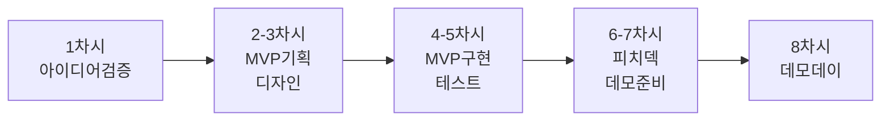
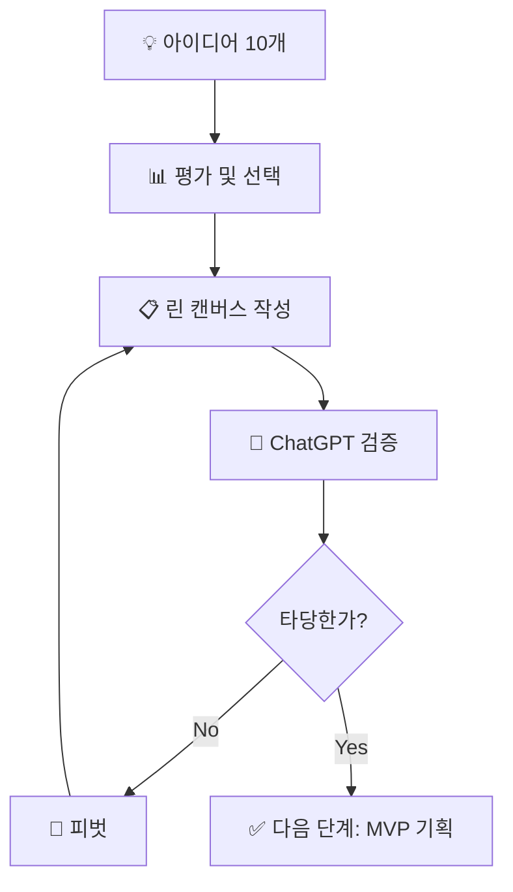
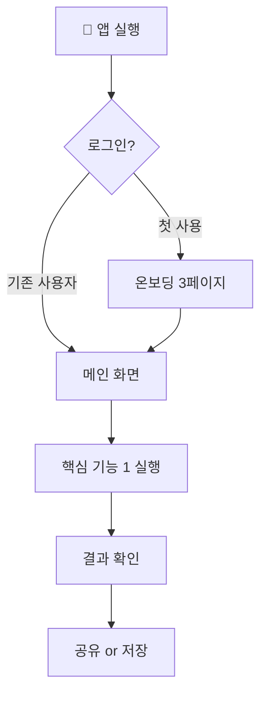

# 🚀 11학년 바이브 코딩 커리큘럼 (8차시)

## 📌 학년 목표 및 핵심 역량

### 학습 목표
- **창업 마인드**: 실제 창업 아이디어를 MVP로 구현하기
- **사용자 중심**: 사용자 테스트와 피드백 기반 개선
- **비즈니스 감각**: 수익 모델과 시장 검증 경험
- **피칭 능력**: 투자자/사용자에게 효과적으로 전달하기

### 핵심 역량
| 역량 | 세부 내용 | 평가 방법 |
|------|----------|----------|
| **기업가 정신** | 문제 발견, 실행력, 피벗 능력 | MVP 완성도, 반복 개선 |
| **시장 검증 능력** | 아이디어 검증, 사용자 조사 | 검증 프로세스, 피드백 활용 |
| **AI 리터러시** | 복잡한 프로젝트 구현, 전략적 활용 | 프로젝트 완성도, 효율성 |
| **커뮤니케이션** | 스토리텔링, 피칭, 설득 | 피치 덱, 발표 평가 |

---

## 📚 전체 8차시 개요



| 차시 | 주제 | 활동 | 결과물 | 핵심 역량 |
|------|------|------|--------|----------|
| 1 | 아이디어 발굴 & 검증 | 린 캔버스, 시장 조사 | 검증된 아이디어 | 문제 발견, 시장 검증 |
| 2 | MVP 기획 | 핵심 기능 정의, 구조 설계 | MVP 기획서 | 우선순위 설정, 전략 |
| 3 | UI/UX 디자인 | 사용자 플로우, 화면 설계 | 디자인 프로토타입 | 사용자 중심 사고 |
| 4 | MVP 구현 1 | 핵심 화면 개발 | 주요 화면 완성 | AI 활용, 구현 |
| 5 | MVP 구현 2 | 기능 추가, 통합 | 작동하는 MVP | 디버깅, 통합 |
| 6 | 사용자 테스트 | 테스터 모집, 피드백 수집 | 테스트 리포트 | 피드백 수집, 분석 |
| 7 | 피치 덱 제작 | 발표 자료, 스크립트 | 피치 덱 | 스토리텔링, 설득 |
| 8 | 데모 데이 | 투자자 피칭, 시연 | 최종 발표 | 발표, 질의응답 |

---

## 🎯 차시별 상세 커리큘럼

---

### 📅 1차시: 창업 아이디어 발굴 & 검증

#### 🎯 차시 목표
- 실제 창업 가능한 아이디어 도출하기
- 린 캔버스로 비즈니스 모델 설계하기
- ChatGPT로 아이디어 검증하기

#### 📦 예상 결과물
✅ **린 캔버스** + **시장 검증 리포트**

#### 🧑‍🏫 교사용 지시서

##### 수업 전 준비사항
- [ ] 성공한 학생 창업 사례 영상 (3개)
- [ ] 린 캔버스 템플릿 출력
- [ ] 아이디어 검증 체크리스트
- [ ] ChatGPT 접속 확인

##### 수업 진행 (50분)

| 시간 | 활동 | 교사 행동 | 학생 활동 |
|------|------|----------|----------|
| **5분** | 동기부여 | - 학생 창업 성공 사례 영상<br/>- 11학년 과정 소개 | - 영상 시청<br/>- 목표 이해 |
| **15분** | 아이디어 발굴 | - 문제 발견 프레임워크 제시<br/>- 브레인스토밍 가이드 | - 개인 아이디어 10개<br/>- 팀/개인 선택 |
| **20분** | 린 캔버스 작성 | - 린 캔버스 설명<br/>- 작성 예시 시연<br/>- 순회 지도 | - 린 캔버스 작성<br/>- 9칸 채우기 |
| **10분** | ChatGPT 검증 | - 검증 질문 가이드<br/>- 피벗 개념 설명 | - ChatGPT로 검증<br/>- 보완점 정리 |

##### 교사 스크립트

```
[도입]
"11학년은 실전입니다! 
9학년: 나를 표현
10학년: 사회 문제 해결
11학년: 실제 창업 아이디어 실행

오늘부터 여러분은 '창업가'입니다.
8차시 후, 투자자(심사위원) 앞에서 피칭합니다.
준비되셨나요?"

[아이디어 발굴 가이드]
"좋은 창업 아이디어란?

3가지 조건:
1. 당신이 겪은 불편함 (진정성)
2. 다른 사람도 돈 낼만큼 불편함 (시장성)
3. 기존 해결책이 부족함 (차별성)

예시:
✅ '숙제 관리가 어렵다' → 학생용 올인원 플래너 앱
✅ '헌 책이 쌓인다' → 교내 중고책 거래 플랫폼
✅ '진로가 막막하다' → AI 진로 상담 챗봇

❌ '모든 사람을 위한 SNS' → 너무 광범위
❌ '게임 만들기' → 창업보다 취미

여러분의 경험에서 시작하세요!"

[린 캔버스 설명]
"린 캔버스는 한 장으로 보는 사업 계획서예요.
9개 칸을 채우면서 아이디어를 구체화합니다.

가장 중요한 칸 3개:
1. 문제: 무엇을 해결하나?
2. 해결책: 어떻게 해결하나?
3. 고유 가치 제안: 왜 우리 것인가?

이 3개가 명확하면 나머지는 따라옵니다!"
```

---

#### 👨‍🎓 학생용 활동 시나리오

##### 미션: 검증된 창업 아이디어 만들기

**Step 1: 문제 발견 (10분)**

🔍 **아이디어 발굴 프레임워크**

```
💡 어디에서 아이디어를 찾을까?

1️⃣ 내가 겪은 불편함
   - 학교 생활에서: _______________
   - 일상에서: ____________________
   - 취미 활동에서: _______________

2️⃣ 주변 사람들의 불편함
   - 친구들이 자주 불평하는 것: _______________
   - 부모님/선생님이 어려워하는 것: ___________

3️⃣ 시장 트렌드
   - 요즘 핫한 주제: _______________
   - 사라지는 것들: ________________
   - 새로 생기는 것들: ______________

💡 10개 아이디어 빠르게 적기:
1. _______________________________
2. _______________________________
3. _______________________________
... (10개까지)

⭐ 가장 하고 싶은 것 3개 선택
```

**Step 2: 아이디어 우선순위 (5분)**

📊 **아이디어 평가표**

```
각 아이디어에 점수 매기기 (1-5점):

┌──────────────────────────────────┐
│ 아이디어 1: ___________________  │
├──────────────────────────────────┤
│ • 열정: [ ]점 (내가 정말 하고 싶은가?) │
│ • 시장성: [ ]점 (사람들이 돈 낼까?)   │
│ • 실현성: [ ]점 (8주 안에 MVP 가능?)  │
│ • 차별성: [ ]점 (기존 것과 다른가?)   │
│ • 총점: ___ / 20점               │
└──────────────────────────────────┘

가장 높은 점수 아이디어 선택!
```

**Step 3: 린 캔버스 작성 (20분)**

📋 **린 캔버스 (Lean Canvas)**

```
┌──────────────────────────────────────────┐
│             린 캔버스                     │
├──────────┬──────────────┬───────────────┤
│ 문제     │ 해결책        │ 고유 가치 제안 │
│          │              │               │
│ 상위 3가지│ 상위 3가지    │ 한 문장으로   │
│ 문제:    │ 핵심 기능:    │ 명확하게      │
│ 1.       │ 1.           │               │
│ 2.       │ 2.           │ "___을 위한   │
│ 3.       │ 3.           │  ___"         │
├──────────┼──────────────┼───────────────┤
│ 차별화 요소│ 채널         │ 고객 세그먼트  │
│          │              │               │
│ 경쟁자 대비│ 어떻게       │ 누구를 위한?  │
│ 우리만의  │ 도달할까?    │               │
│ 장점:    │              │ - 나이:       │
│          │ • SNS        │ - 직업:       │
│          │ • 학교       │ - 특징:       │
│          │ • 구전       │               │
├──────────┴──────────────┼───────────────┤
│ 수익 모델                │ 비용 구조      │
│                         │               │
│ 어떻게 돈을 벌까?        │ 필요한 비용은? │
│ • 유료 기능              │ • 개발:       │
│ • 광고                  │ • 서버:       │
│ • 수수료                │ • 마케팅:     │
└─────────────────────────┴───────────────┘

핵심 지표:
• 성공을 어떻게 측정할까? _______________
```

**각 칸 작성 가이드**

```
1️⃣ 문제 (가장 중요!)
   "우리 학교 학생들은 숙제 마감일을 자주 놓친다.
    알림이 와도 어떤 과목인지 헷갈린다.
    우선순위를 정하기 어렵다."
   → 구체적인 고통 포인트!

2️⃣ 고객 세그먼트
   ❌ "모든 학생"
   ✅ "숙제가 많은 고등학생 (특히 수학/과학 과목)"
   → 좁고 구체적으로!

3️⃣ 고유 가치 제안
   ❌ "좋은 숙제 관리 앱"
   ✅ "과목별 우선순위를 AI가 추천하는 학생 전용 플래너"
   → 차별점 명확히!

4️⃣ 해결책
   • 핵심 기능만 3개!
   • MVP에 꼭 필요한 것만
   • "있으면 좋은" 것 제외

5️⃣ 수익 모델
   • 무료 + 프리미엄
   • 광고
   • 수수료
   → 하나라도 명확히!
```

**Step 4: ChatGPT로 아이디어 검증 (10분)**

💬 **검증 프롬프트**

```
"창업 아이디어를 검증해줘.

[린 캔버스 전체 내용 붙여넣기]

다음을 분석해줘:

1. 이 문제가 정말 존재하는가?
   (시장 규모, 통계 자료)

2. 이미 비슷한 서비스가 있는가?
   (경쟁자 분석, 장단점)

3. 우리 해결책의 차별점이 충분한가?
   (경쟁 우위)

4. 수익 모델이 현실적인가?
   (비즈니스 타당성)

5. 8주 안에 MVP를 만들 수 있는가?
   (실현 가능성)

6. 개선 제안 3가지

솔직하고 비판적으로 평가해줘.
창업가에게 도움이 되는 피드백을."
```

**ChatGPT 답변 정리**

```
┌──────────────────────────────────┐
│       아이디어 검증 리포트        │
├──────────────────────────────────┤
│ ✅ 강점 (계속 진행):              │
│ 1. ___________________________  │
│ 2. ___________________________  │
│                                  │
│ ⚠️ 약점 (보완 필요):              │
│ 1. ___________________________  │
│ 2. ___________________________  │
│                                  │
│ 💡 개선 방향:                     │
│ 1. ___________________________  │
│ 2. ___________________________  │
│ 3. ___________________________  │
│                                  │
│ 🎯 다음 단계:                     │
│ _______________________________  │
└──────────────────────────────────┘
```

**Step 5: 피벗 결정 (5분)**

```
❓ 계속 진행 vs 피벗?

✅ 계속 진행 (다음 조건 중 2개 이상):
□ ChatGPT가 타당하다고 평가
□ 명확한 차별점이 있음
□ 8주 안에 MVP 제작 가능
□ 내가 정말 하고 싶음

⚠️ 피벗 필요 (다음 중 1개라도):
□ 이미 완벽한 경쟁자가 있음
□ 수익 모델이 불명확
□ 기술적으로 너무 어려움
□ 흥미가 없음

→ 내 결정: ________________

피벗한다면:
• 문제는 유지, 해결책만 변경
• 고객 세그먼트를 더 좁게
• 기능 범위를 축소
```

---

#### 🔄 아이디어 검증 프로세스



---

#### 📊 평가 기준

| 항목 | 상 (3점) | 중 (2점) | 하 (1점) |
|------|---------|---------|---------|
| **문제 정의** | 구체적이고 검증 가능 | 기본 정의됨 | 모호함 |
| **린 캔버스** | 9칸 모두 구체적 | 주요 칸 작성 | 불완전 |
| **검증 프로세스** | ChatGPT 활용, 논리적 분석 | 기본 검증 | 검증 부족 |

---

### 📅 2-3차시: MVP 기획 & UI/UX 디자인

#### 🎯 차시 목표 (2차시)
- MVP 핵심 기능 3개 정의하기
- 사용자 플로우 설계하기
- 화면 구조 스케치하기

#### 🎯 차시 목표 (3차시)
- v0로 주요 화면 디자인하기
- 사용자 인터랙션 설계하기
- 프로토타입 완성하기

#### 📦 예상 결과물
✅ **MVP 기획서** + **디자인 프로토타입**

---

#### 👨‍🎓 학생용 활동 시나리오 (2차시)

##### 미션: MVP 핵심 기능 정의하기

**Step 1: MVP 개념 이해 (5분)**

```
🎯 MVP (Minimum Viable Product)란?

"최소한의 기능으로 가치를 제공하는 제품"

❌ 완벽한 제품을 만들려고 하지 마세요
✅ 핵심 가치를 전달하는 최소 기능만

예시: 에어비앤비 MVP
• 첫 버전: 사진 3장 + 설명 + 예약 버튼
• 없었던 것: 결제, 리뷰, 메시지, 앱
• 핵심 가치: "남는 방 빌려주기"만 증명

우리도 이렇게!
```

**Step 2: 기능 우선순위 (15분)**

📋 **기능 분류 (MoSCoW 기법)**

```
우리 서비스의 모든 기능을 적고 분류:

MUST (필수 - MVP에 꼭 필요):
1. _______________________________
2. _______________________________
3. _______________________________

SHOULD (중요 - 있으면 좋음):
1. _______________________________
2. _______________________________

COULD (추가 - 시간 있으면):
1. _______________________________

WON'T (제외 - 나중에):
1. _______________________________

→ MUST 3개만 MVP에 포함!
```

**ChatGPT 활용**

```
"내 MVP 기능 우선순위를 검토해줘.

서비스: [서비스명]
핵심 가치: [고유 가치 제안]

기능 리스트:
MUST:
1. ...
2. ...
3. ...

SHOULD:
1. ...

다음을 알려줘:
1. MUST 3개가 핵심 가치를 전달하기에 충분한가?
2. 빠뜨린 필수 기능은 없는가?
3. SHOULD 중 MUST로 올릴 것은?
4. 각 기능의 개발 난이도 (1-5)

8주 안에 완성 가능한지도 평가해줘."
```

**Step 3: 사용자 플로우 설계 (20분)**



📝 **우리 서비스 플로우**

```
1. 사용자가 처음 들어오면?
   → _______________________________

2. 핵심 기능을 어떻게 사용하나?
   → _______________________________

3. 사용 후 어떤 결과를 보나?
   → _______________________________

4. 재방문을 유도하려면?
   → _______________________________

화면 수: ___개 (5개 이내 권장)
```

**Step 4: 화면 스케치 (10분)**

```
종이에 주요 화면 3-5개 그리기:

화면 1: [메인 화면]
┌─────────────────┐
│     로고        │
├─────────────────┤
│                 │
│  [핵심 기능]    │
│                 │
├─────────────────┤
│   하단 메뉴     │
└─────────────────┘

화면 2, 3, 4, 5...

각 화면에 표시:
• 제목
• 주요 요소 위치
• 버튼/입력창
• 데이터 표시 영역
```

---

#### 👨‍🎓 학생용 활동 시나리오 (3차시)

##### 미션: v0로 프로토타입 만들기

**v0 프롬프트 - 메인 화면**

```
"[서비스명] MVP의 메인 화면을 만들어줘.

서비스 소개:
[린 캔버스의 고유 가치 제안]

화면 구성:
• 상단: 로고, 프로필 아이콘
• 중앙: [핵심 기능 1] 실행 버튼 (크고 눈에 띄게)
• 하단: 3개 메뉴 ([메뉴1], [메뉴2], [메뉴3])

스타일:
• 깔끔하고 현대적
• 주 색상: [선택한 색상]
• 타겟: 10대 후반-20대 초반
• 직관적이고 사용하기 쉽게

기능:
• [핵심 기능 1] 버튼 클릭 → [다음 화면]으로 이동
• 하단 메뉴 작동

Next.js, Tailwind CSS, React Icons 사용"
```

**v0 프롬프트 - 핵심 기능 화면**

```
"[핵심 기능명] 화면을 만들어줘.

기능 설명:
[기능이 하는 일을 구체적으로]

화면 요소:
• 입력 영역: [사용자가 입력할 것]
• 버튼: '[버튼 문구]'
• 결과 표시 영역
• 저장/공유 버튼

인터랙션:
1. 사용자가 [입력]
2. 버튼 클릭
3. [처리 과정] (로딩 표시)
4. 결과 표시

스타일:
• 이전 메인 화면과 일관성
• [특별히 강조할 부분] 강조

기능:
• 입력 유효성 검사
• 로딩 애니메이션
• 에러 처리"
```

---

### 📅 4-5차시: MVP 구현

#### 🎯 차시 목표
- 디자인된 화면에 기능 추가하기
- 데이터 저장/불러오기 구현하기
- 전체 플로우 통합하기

#### 📦 예상 결과물
✅ **작동하는 MVP** (핵심 기능 3개 모두 작동)

---

#### 👨‍🎓 학생용 활동 시나리오

**Step 1: 기능별 구현 (30분 × 2차시)**

**기능 1 구현 프롬프트**

```
"이전에 만든 [기능명] 화면에 실제 기능을 추가해줘.

요구사항:
1. [입력] 받아서 처리
2. [계산/저장/검색 등] 수행
3. 결과를 [형식]으로 표시
4. localStorage에 저장

데이터 구조:
{
  id: "고유ID",
  [필드1]: "값",
  [필드2]: "값",
  timestamp: "날짜시간"
}

에러 처리:
• [입력 오류 케이스] → "에러 메시지"
• 데이터 없음 → "안내 메시지"

React hooks (useState, useEffect) 사용"
```

**Step 2: 페이지 연결 및 라우팅 (10분)**

```
"3개 화면을 연결해줘.

페이지 구조:
/ → 메인 화면
/[기능1] → 기능1 화면
/[기능2] → 기능2 화면

네비게이션:
• 하단 메뉴로 페이지 이동
• 뒤로 가기 버튼
• 부드러운 전환 애니메이션

Next.js App Router 사용"
```

**Step 3: 전체 테스트 (10분)**

✅ **MVP 완성 체크리스트**

```
기능 테스트:
□ 핵심 기능 1 작동
□ 핵심 기능 2 작동
□ 핵심 기능 3 작동
□ 페이지 전환 작동
□ 데이터 저장/불러오기 작동
□ 에러 처리 작동

UX 테스트:
□ 첫 사용자도 이해 가능한가?
□ 3번의 클릭 안에 핵심 기능 도달?
□ 모바일에서 잘 보이는가?
□ 로딩이 너무 길지 않은가?

버그 수정:
□ 발견된 버그 리스트 작성
□ 치명적 버그 우선 수정
□ ChatGPT로 디버깅
```

---

### 📅 6차시: 사용자 테스트

#### 🎯 차시 목표
- 실제 사용자에게 테스트하기
- 정량적/정성적 피드백 수집하기
- 개선점 도출하기

#### 📦 예상 결과물
✅ **사용자 테스트 리포트** + **개선 우선순위**

---

#### 👨‍🎓 학생용 활동 시나리오

**Step 1: 테스터 모집 (5분)**

```
🎯 테스터 5-10명 모집

기준:
• 타겟 사용자와 비슷한 사람
• 서비스를 처음 보는 사람 (친한 친구 X)
• 솔직한 피드백을 줄 수 있는 사람

모집 방법:
□ 다른 반 학생
□ 동아리/팀원 아닌 사람
□ 선생님/가족 (타겟이면)
```

**Step 2: 테스트 프로토콜 (30분)**

📋 **테스트 시나리오**

```
테스터에게 주는 미션:

"다음 3가지 작업을 해보세요.
생각나는 것을 소리내어 말해주세요."

미션 1: [핵심 기능 1 사용]
시간 제한: 3분
성공 기준: _______________________

미션 2: [핵심 기능 2 사용]
시간 제한: 3분
성공 기준: _______________________

미션 3: [핵심 기능 3 사용]
시간 제한: 3분
성공 기준: _______________________
```

**관찰 기록**

```
테스터 #__

미션 1:
□ 성공 / □ 실패
소요 시간: ___분
막힌 부분: _______________________
말한 것: _________________________

미션 2:
...

미션 3:
...

전체 인상:
• 첫 느낌: _______________________
• 가장 좋았던 점: ________________
• 가장 불편했던 점: ______________
• 다시 사용할 의향: 1 2 3 4 5
• 한 마디: _______________________
```

**Step 3: 피드백 정리 및 분석 (15분)**

```
┌──────────────────────────────────┐
│     사용자 테스트 분석 리포트     │
├──────────────────────────────────┤
│ 테스터 수: ___명                 │
│                                  │
│ 🎯 정량적 데이터                  │
│ • 미션 1 성공률: ___% (___/___) │
│ • 미션 2 성공률: ___% (___/___) │
│ • 미션 3 성공률: ___% (___/___) │
│ • 평균 완료 시간: ___분          │
│ • 재사용 의향: 평균 ___/5점      │
│                                  │
│ 😊 가장 많이 나온 긍정 피드백     │
│ 1. ___________________________  │
│ 2. ___________________________  │
│ 3. ___________________________  │
│                                  │
│ 😞 가장 많이 나온 부정 피드백     │
│ 1. ___________________________  │
│ 2. ___________________________  │
│ 3. ___________________________  │
│                                  │
│ 🐛 발견된 주요 문제               │
│ 1. [문제] → [원인] → [해결책]    │
│ 2. [문제] → [원인] → [해결책]    │
│ 3. [문제] → [원인] → [해결책]    │
│                                  │
│ 💡 개선 우선순위 (Top 3)          │
│ 1. ___________________________ (Critical)│
│ 2. ___________________________ (High)│
│ 3. ___________________________ (Medium)│
└──────────────────────────────────┘
```

---

### 📅 7차시: 피치 덱 제작

#### 🎯 차시 목표
- 투자자용 피치 덱 만들기
- 3분 피칭 스크립트 작성하기
- 예상 질문 준비하기

#### 📦 예상 결과물
✅ **피치 덱 (10슬라이드)** + **피칭 스크립트**

---

#### 👨‍🎓 학생용 활동 시나리오

**Step 1: 피치 덱 구조 (10분)**

📊 **10슬라이드 구성**

```
1. 타이틀
   • 서비스명
   • 태그라인
   • 팀명

2. 문제 (Problem)
   • 충격적인 통계
   • 타겟의 고통 포인트

3. 해결책 (Solution)
   • 우리 서비스 소개
   • 핵심 기능 3개

4. 제품 데모 (Demo)
   • 스크린샷 또는 영상
   • 사용 플로우

5. 시장 기회 (Market)
   • 시장 규모
   • 타겟 세그먼트

6. 비즈니스 모델 (Business Model)
   • 수익 구조
   • 단가/규모 추정

7. 트랙션 (Traction)
   • MVP 완성
   • 사용자 테스트 결과
   • 피드백

8. 경쟁 분석 (Competition)
   • 경쟁자 vs 우리
   • 차별화 포인트

9. 팀 (Team)
   • 팀원 소개
   • 역할 및 강점

10. 요청 (Ask)
    • 다음 단계
    • 필요한 것
```

**Step 2: ChatGPT로 스크립트 작성 (20분)**

💬 **ChatGPT 프롬프트**

```
"3분 투자자 피칭 스크립트를 만들어줘.

서비스 정보:
[린 캔버스 전체 내용]

사용자 테스트 결과:
[테스트 리포트 요약]

요구사항:
• 스토리텔링 형식 (문제 상황으로 시작)
• 3분 분량 (약 450단어)
• 감정 이입 유도
• 데이터로 설득
• 강력한 마무리

슬라이드별 멘트 포함
청중 참여 질문 1개 포함

10대 후반 학생이 발표하는 톤으로."
```

**Step 3: 피치 덱 디자인 (20분)**

```
디자인 원칙:
✅ 한 슬라이드 = 한 메시지
✅ 텍스트 최소화 (키워드만)
✅ 비주얼 강화 (이미지, 아이콘)
✅ 일관된 디자인
✅ 읽기 쉬운 폰트

도구:
• Canva (무료 템플릿)
• Figma
• PowerPoint/Keynote
• Google Slides
```

---

### 📅 8차시: 데모 데이 (쇼케이스)

#### 🎯 차시 목표
- 투자자(심사위원) 앞에서 피칭하기
- 실제 데모 시연하기
- 질의응답 잘 대처하기

#### 📦 예상 결과물
✅ **성공적인 피칭** + **피드백 수집**

---

#### 🎤 발표 구성 (5분)

```
┌─────────────────────────────────┐
│        타임 테이블               │
├─────────────────────────────────┤
│ 00:00-00:30 | 문제 제시 (후킹)  │
│ 00:30-01:00 | 해결책 소개       │
│ 01:00-02:30 | 실제 데모 시연    │ ← 핵심!
│ 02:30-03:00 | 비즈니스 모델     │
│ 03:00-03:30 | 마무리 & 요청     │
│ 03:30-05:00 | Q&A              │
└─────────────────────────────────┘
```

**예상 질문 & 답변 준비**

```
Q1: "경쟁자 [X]와 뭐가 다른가요?"
A: _________________________________

Q2: "정말 사람들이 돈을 낼까요?"
A: _________________________________

Q3: "기술적으로 구현 가능한가요?"
A: _________________________________

Q4: "만약 실패하면 어떻게 하나요?"
A: _________________________________

Q5: "다음 단계 계획은?"
A: _________________________________
```

---

#### 🏆 심사 기준

| 항목 | 배점 | 평가 내용 |
|------|------|----------|
| **문제 정의** | 20% | 명확하고 공감 가는 문제 제시 |
| **해결책** | 20% | 차별화된 해결책, MVP 완성도 |
| **시장성** | 15% | 시장 규모, 비즈니스 모델 |
| **데모** | 25% | 실제 작동, 사용자 경험 |
| **발표력** | 15% | 스토리텔링, 설득력 |
| **Q&A** | 5% | 질문 대처 능력 |

---

## 📖 교사용 종합 가이드

### 11학년 교육 핵심 원칙

```
1. 실전 경험 최우선
   • 완벽한 이론보다 작동하는 프로토타입
   • 실패도 배움 (피벗 격려)
   • 사용자 중심 사고

2. 기업가 정신 함양
   • 문제 발견 능력
   • 빠른 실행력
   • 데이터 기반 의사결정
   • 피칭/설득 능력

3. 포트폴리오 관점
   • 대학 입시/취업에 활용 가능
   • GitHub에 코드 업로드 지도
   • 발표 영상 촬영 및 보관

4. 연결 및 확장
   • 실제 창업 지원 프로그램 연계
   • 지역 스타트업 멘토링
   • 창업 동아리 연결
```

### 데모 데이 운영 가이드

```
📅 행사 준비 (2주 전)

□ 심사위원 섭외 (3-5명)
  - 교내: 교장, 담당교사
  - 외부: 지역 스타트업 대표, 대학 창업 센터

□ 장소 예약 및 세팅
  - 무대, 프로젝터, 스크린
  - 학생 노트북 연결 확인

□ 홍보
  - 포스터 제작
  - 전교생/학부모 초대

🎤 당일 진행 (2시간)

00:00-00:10 | 오프닝, 심사위원 소개
00:10-01:30 | 팀별 피칭 (5분 × 8팀)
01:30-01:40 | 휴식
01:40-01:50 | 심사 및 투표
01:50-02:00 | 시상 및 총평

🏆 시상 카테고리

- 대상 (1팀): 종합 최우수
- 혁신상: 가장 창의적
- 임팩트상: 사회 가치
- 기술상: 구현 완성도
- 인기상: 청중 투표
```

---

## 🎉 마치며

### 11학년 과정을 마친 학생들은

✅ 실제 창업 프로세스 전 과정 경험  
✅ 0에서 1을 만드는 창조의 경험  
✅ 사용자 중심 사고 체화  
✅ AI 시대 필수 역량 (AI 협업, 빠른 실행)  
✅ 피칭 및 스토리텔링 능력  
✅ 실패를 두려워하지 않는 마인드셋

### 다음 단계

```
🚀 심화 과정:
• 실제 사용자 확보 (베타 서비스)
• 수익화 실험
• 창업 경진대회 참가
• 투자 유치 도전

💼 진로 연계:
• 대학 창업 특별전형
• 스타트업 인턴
• 창업 동아리/커뮤니티
• 기업가 정신 관련 활동

📁 포트폴리오:
• GitHub에 코드 공개
• 데모 영상 YouTube 업로드
• 피치 덱 LinkedIn 공유
• Medium에 개발 스토리 작성
```

---

**핵심 메시지**: 
**"아이디어가 있다면, AI와 함께 8주 만에 세상에 내놓을 수 있다!"**

---

**버전**: v1.0 (11학년용)  
**작성일**: 2025년 11월  
**문의**: 본 커리큘럼 관련 질문은 언제든 환영합니다

**Special Thanks**: 
이 커리큘럼은 실제 학생 창업 성공 사례와 린 스타트업 방법론을 기반으로 제작되었습니다.
