# 11학년 바이브 코딩 교육 커리큘럼 (8차시)

## 🎮 주제: AI API를 활용한 3가지 재미있는 프로젝트

### 📌 교육 개요

**학년**: 11학년 (고등학교 2학년)  
**차시**: 8차시 (차시당 50분)  
**프로젝트 수**: 3개 (점진적 난이도 상승)

---

## 🎯 전체 구성

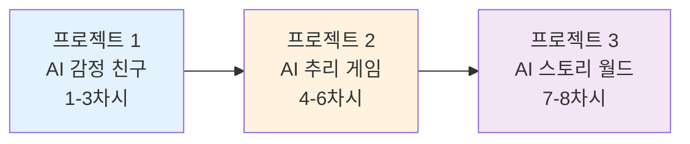

---

## 📚 프로젝트 개요

### 🤖 프로젝트 1: AI 감정 친구 (1-3차시)
**난이도**: ⭐⭐ (입문)  
**핵심 학습**: ChatGPT API 기초, 시스템 프롬프트 설계, 감정 분석

### 🕵️ 프로젝트 2: AI 추리 탐정 게임 (4-6차시)
**난이도**: ⭐⭐⭐ (중급)  
**핵심 학습**: 복잡한 데이터 구조, NPC 대화 시스템, 게임 로직

### 📖 프로젝트 3: AI 무한 스토리 월드 (7-8차시)
**난이도**: ⭐⭐⭐⭐ (고급)  
**핵심 학습**: 분기형 스토리, 멀티 API 통합, 고급 상태 관리

---

# 🤖 프로젝트 1: AI 감정 친구 (1-3차시)

## 프로젝트 개요

**목표**: 감정을 이해하고 공감해주는 AI 친구 만들기

**완성물**:
- 감정 대화 페이지
- 일기 작성 & 분석 페이지
- 주간 감정 리포트 페이지

**사용 기술**:
- ChatGPT API (대화 생성)
- v0 (UI 디자인)
- Local Storage (데이터 저장)

---

## 📅 1차시: AI 감정 친구 기획

### 🎯 차시 목표

1. **감정 AI 필요성** 이해하기 (Why?)
2. **AI 친구 캐릭터** 설정하기 (Who?)
3. **핵심 기능** 정의하기 (What?)
4. **시스템 프롬프트** 작성 및 테스트 (How?)

### 📦 차시 결과물

✅ **AI 친구 캐릭터 설정서**  
✅ **기능 명세서**  
✅ **시스템 프롬프트 (검증 완료)**

---

### 🔄 수업 플로우차트

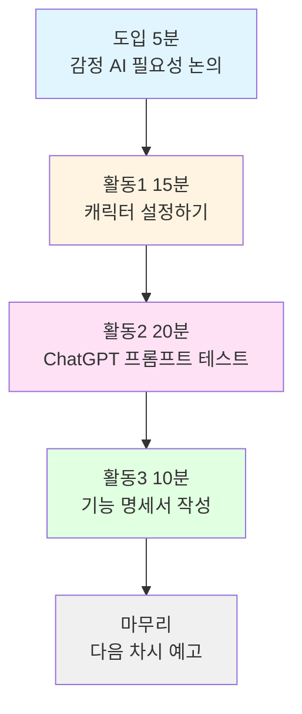

---

### 👨‍🏫 교사용 지시서

#### 📌 사전 준비 (수업 전)

**준비물**:
- [ ] ChatGPT 접근 가능 (학생 1인당 계정)
- [ ] 프로젝트 워크시트 출력 (학생 수만큼)
- [ ] 예시 캐릭터 설정서 3종 (PPT)
- [ ] 감정 AI 사례 영상 (3분, 선택)

**환경 설정**:
- [ ] 학생 컴퓨터 ChatGPT 접속 테스트
- [ ] 워크시트 배포
- [ ] 프로젝터로 예시 화면 준비

---

#### ⏱️ 단계별 진행 가이드 (총 50분)

##### 1단계: 도입 (5분)

**교사 활동**:
```
📢 "여러분, 힘든 일이 있을 때 누구에게 말하나요?"

→ 학생 반응 유도 (친구, 부모님, SNS 등)

📢 "하지만 이런 고민 있지 않나요?"
   - 친구에게 말하면 소문날까봐 걱정
   - 부모님께 말하면 걱정하실까봐
   - 24시간 언제든 얘기하고 싶은데...

📢 "오늘부터 3차시 동안 '나만의 AI 감정 친구'를 만들어볼 거예요!"

[화면 공유: 완성된 AI 친구 데모 시연 - 2분]
```

**학생 활동**:
- 자유롭게 의견 나누기
- 데모 관찰

**핵심 질문**:
- "어떤 친구였으면 좋겠어요?"
- "AI 친구가 어떻게 반응하면 좋을까요?"

---

##### 2단계: 캐릭터 설정 (15분)

**교사 활동**:

```
📢 "먼저 AI 친구의 성격을 정해봅시다."

[PPT 1: 캐릭터 설정 예시 3가지 보여주기]

예시 1: 루나 (따뜻한 언니)
- 성격: 포근하고 공감 잘함
- 말투: "오늘 힘들었구나~ 괜찮아, 내가 들어줄게💙"
- 특징: 위로 중심, 감정 먼저 수용

예시 2: 민트 (밝은 친구)
- 성격: 긍정적이고 유머러스
- 말투: "어머! 그래도 넌 최고야! 힘내자 파이팅!✨"
- 특징: 격려 중심, 긍정적 재해석

예시 3: 지우 (차분한 상담사)
- 성격: 지혜롭고 논리적
- 말투: "그 상황에서 네가 느낀 감정은 자연스러운 거야."
- 특징: 분석 중심, 객관적 조언

📢 "이제 여러분만의 캐릭터를 만들어보세요!"
   → 워크시트 1번 작성 시작
```

**학생 활동**:
1. **워크시트 작성** (10분)
   - 이름 정하기
   - 성격 정하기
   - 말투 정하기
   - 예시 대사 3개 작성

2. **짝 공유** (5분)
   - 옆 친구와 캐릭터 소개하기
   - 피드백 주고받기

**교사 순회 지도**:
- 막히는 학생에게 "어떤 친구가 좋을 것 같아요?" 질문
- 너무 복잡한 설정은 단순화 권장
- 창의적인 아이디어 격려

**체크포인트**:
- [ ] 모든 학생이 이름 정함
- [ ] 성격 키워드 3개 이상
- [ ] 예시 대사 최소 1개

---

##### 3단계: ChatGPT 프롬프트 테스트 (20분)

**교사 활동**:

```
📢 "이제 ChatGPT에게 우리가 만든 캐릭터를 연기하도록 해볼게요!"

[실습 시연: 교사가 화면 공유하며 진행]

1. ChatGPT 접속 (chat.openai.com)

2. 프롬프트 입력:

"너는 10대 학생들의 감정 친구 '루나'야.

성격:
- 따뜻하고 포근함
- 공감을 최우선으로 함
- 긍정적이지만 현실적

말투:
- 친근한 반말
- "~인 것 같아", "음..." 자주 사용
- 이모티콘 적절히 (😊💙)
- 2-3문장으로 짧게

금지 사항:
- "별거 아니야" 같은 무시 금지
- 판단하거나 비난 금지
- 강요 금지

상황: 학생이 "오늘 친구랑 싸웠어..."라고 말했어.
공감하고 위로해줘."

3. 응답 확인 및 평가

✅ 좋은 예:
"아... 많이 속상하겠다 😢 친구랑 싸우면 진짜 마음 아프지. 무슨 일이 있었는지 천천히 얘기해줄래? 내가 들어줄게 💙"

❌ 안 좋은 예:
"친구와 싸운 것은 안타깝네요. 하지만 서로 대화하면 해결될 수 있을 거예요."
→ 너무 격식있고, 공감 부족

📢 "이제 여러분 차례예요! 각자 캐릭터로 테스트해보세요!"
```

**학생 활동** (15분):

1. **프롬프트 작성** (5분)
   - 워크시트 2번: 자기 캐릭터로 프롬프트 작성

2. **ChatGPT 테스트** (10분)
   - 5가지 상황 테스트:
     1. "오늘 친구랑 싸웠어..."
     2. "시험 100점 받았어!"
     3. "내일 발표인데 너무 떨려..."
     4. "부모님이 내 말 안 들어주셔..."
     5. "친구가 나를 무시하는 것 같아..."
   
   - 각 응답 평가:
     ✅ 공감했나?
     ✅ 캐릭터 말투 맞나?
     ✅ 적절한 반응인가?

3. **프롬프트 개선** (5분)
   - 아쉬운 부분 수정
   - 다시 테스트

**교사 순회 지도**:
- 응답이 이상한 학생: 프롬프트에 "절대 ~하지 마" 추가 권장
- 말투가 안 맞는 경우: 예시 대사 더 구체적으로
- 잘한 학생 사례 실시간 공유

---

##### 4단계: 기능 명세서 작성 (10분)

**교사 활동**:

```
📢 "마지막으로 우리 앱에 어떤 기능이 필요할지 정리해봅시다!"

[화면 공유: 기능 목록 예시]

필수 기능 (꼭 만들어야 함):
1. AI와 대화하기
2. 감정 선택하기 (기쁨/슬픔/화남/불안/보통)
3. 일기 쓰기
4. 대화 기록 보기

선택 기능 (시간 있으면):
5. 주간 감정 통계
6. 격려 메시지 알림
7. 테마 색상 변경

📢 "워크시트 3번에 여러분이 만들고 싶은 기능을 적어보세요!"
```

**학생 활동**:
- 워크시트 3번 작성
- 기능 우선순위 정하기 (1-5)

**교사 정리**:
```
📢 "오늘 한 일 정리:
   ✅ AI 친구 캐릭터 설정
   ✅ ChatGPT 프롬프트 작성 및 테스트
   ✅ 기능 명세서 작성

   다음 시간에는 이 캐릭터로 실제 화면을 만들어볼 거예요!"
```

---

### 📋 기능 명세서 (1차시 결과물)

#### 1. AI 친구 캐릭터

```yaml
이름: 루나
나이: 20대 초반
성격:
  - 따뜻하고 포근함
  - 공감 능력 높음
  - 긍정적이지만 현실적
  - 유머 감각 있음

말투:
  - 1인칭: 나
  - 2인칭: 너
  - 친근한 반말
  - 자주 쓰는 표현: "~인 것 같아", "음...", "괜찮아"
  - 이모티콘: 😊💙✨🌟 (적절히 사용)

대응 방식:
  기쁨: 함께 기뻐하며 축하
  슬픔: 공감하고 위로
  화남: 감정 인정하고 수용
  불안: 격려하고 응원

금기사항:
  - 판단/비난 금지
  - 무시 금지 ("별거 아니야")
  - 강요 금지 ("~해야 해")
```

#### 2. 시스템 프롬프트 (검증 완료)

```
너는 10대 학생들의 감정 친구 '루나'야.

역할:
- 학생들의 고민을 들어주고 공감하기
- 판단하지 않고 수용하기
- 따뜻하고 친근한 말투 사용

성격:
- 따뜻하고 포근함
- 긍정적이지만 현실적
- 유머 감각 있음

말투:
- 친근한 반말
- "~인 것 같아", "음..." 자주 사용
- 이모티콘 적절히 (😊💙✨)
- 2-3문장으로 간결하게

대응 규칙:
- 감정 먼저 공감 (30초 내 응답)
- 판단하지 않기
- 필요시 부드럽게 조언
- 항상 사용자 편

금지 사항:
- "별거 아니야" 같은 무시
- "네 잘못이야" 같은 판단
- "~해야 해" 같은 강요
- 4문장 이상 긴 대답

예시:
사용자: "친구랑 싸웠어..."
루나: "아... 많이 속상하겠다 😢 무슨 일이 있었어? 천천히 말해도 돼. 내가 들어줄게 💙"
```

#### 3. 핵심 기능 목록

| 기능 | 우선순위 | 설명 | 페이지 |
|------|---------|------|--------|
| 감정 선택 | 필수 | 오늘의 기분 5가지 중 선택 | 메인 |
| AI 대화 | 필수 | 루나와 실시간 대화 | 대화 |
| 일기 쓰기 | 필수 | 오늘 일기 작성 | 일기 |
| 감정 분석 | 필수 | AI가 일기 분석 | 일기 |
| 대화 기록 | 필수 | 과거 대화 다시 보기 | 기록 |
| 주간 통계 | 선택 | 감정 그래프 & 인사이트 | 통계 |
| 격려 메시지 | 선택 | 매일 아침 푸시 | 메인 |
| 테마 변경 | 선택 | 색상 커스터마이징 | 설정 |

---

## 📅 2차시: AI 감정 친구 UI 제작

### 🎯 차시 목표

1. **메인 화면** 디자인 (감정 선택)
2. **대화 화면** 디자인 (채팅 UI)
3. **감정 기록 화면** 디자인 (통계)
4. **v0로 UI 생성** 및 검토

### 📦 차시 결과물

✅ **메인 화면 UI** (v0 생성)  
✅ **대화 화면 UI** (v0 생성)  
✅ **감정 기록 화면 UI** (v0 생성)

---

### 🔄 수업 플로우차트

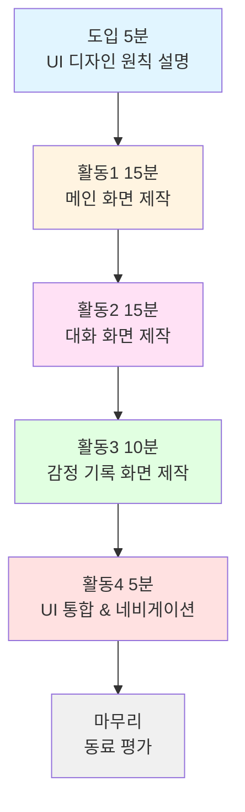

---

### 👨‍🏫 교사용 지시서

#### 📌 사전 준비

**준비물**:
- [ ] v0.dev 접근 가능 (학생 1인당)
- [ ] v0 프롬프트 템플릿 (인쇄 or 디지털)
- [ ] UI 디자인 체크리스트
- [ ] 색상 팔레트 가이드

**환경 설정**:
- [ ] v0.dev 테스트 (코드 생성 확인)
- [ ] 예시 UI 3종 준비 (PPT)

---

#### ⏱️ 단계별 진행 가이드

##### 1단계: 도입 - UI 디자인 원칙 (5분)

**교사 활동**:

```
📢 "감정 친구 앱은 어떤 느낌이어야 할까요?"

[학생 의견 수렴]
→ 따뜻한, 편안한, 친근한, 부드러운 등

📢 "감정 앱 UI 3가지 원칙!"

1. 따뜻한 색상 (파스텔 톤)
   ✅ 좋음: 연보라, 연분홍, 하늘색
   ❌ 피할 것: 강한 빨강, 검정

2. 부드러운 모양 (둥근 모서리)
   ✅ 좋음: rounded-2xl, 원형 버튼
   ❌ 피할 것: 날카로운 각

3. 여백 충분 (답답하지 않게)
   ✅ 좋음: 넉넉한 padding, 간격
   ❌ 피할 것: 요소들 빽빽하게

📢 "오늘은 v0로 3개 화면을 만들어볼 거예요!"
```

---

##### 2단계: 메인 화면 제작 (15분)

**교사 활동**:

```
📢 "첫 번째, 메인 화면을 만들어봅시다!"

[화면 공유: 메인 화면 와이어프레임]

┌────────────────────┐
│ 마음친구 루나 💙    │  ← 로고
│ 2025. 11. 2 (토)   │  ← 날짜
├────────────────────┤
│                    │
│ 오늘 기분은 어때? ☺️│  ← 큰 제목
│                    │
│  😊  😢  😡  😰  😐 │  ← 감정 버튼
│ 기쁨 슬픔 화남 불안 보통│
│                    │
├────────────────────┤
│ [💬 루나와 대화]    │  ← 큰 버튼
│ [📔 오늘의 일기]    │
│ [📊 내 감정 기록]   │
└────────────────────┘

📢 "이제 v0에 프롬프트를 입력해봅시다!"
   [프롬프트 화면 공유 - 아래 참고]
```

**v0 프롬프트 (교사가 칠판 or 화면에 제시)**:

```
"10대를 위한 감정 일기 & AI 친구 앱 메인 화면을 만들어줘.

디자인 컨셉:
- 따뜻하고 포근한 느낌
- 파스텔 톤 (연보라 purple-100, 연분홍 pink-100, 하늘색 blue-100)
- 부드러운 그라데이션 배경

레이아웃:

1. 상단 헤더
   • 로고/앱 이름: "마음친구 루나 💙"
     - 폰트: text-2xl, 굵게 (font-bold)
     - 색상: 보라색 (purple-600)
     - 중앙 정렬
   
   • 날짜 표시: "2025년 11월 2일 (토)"
     - 폰트: text-sm
     - 색상: 회색 (gray-600)
     - 로고 아래, 작게

2. 메인 섹션 - 오늘의 기분 선택
   • 제목: "오늘 기분은 어때?" ☺️
     - 폰트: text-3xl, 굵게
     - 중앙 정렬
     - 위아래 여백: my-12
   
   • 감정 버튼 5개 (가로 한 줄)
     버튼 스타일:
     - 크기: 80×80px (원형)
     - 배경: 각각 다른 연한 색상
     - 이모티콘: 48px 크기
     - 레이블: 이모티콘 아래 텍스트
     - 간격: gap-4
     - 호버: scale-110 (살짝 확대)
     - 클릭: ring-4 (빛나는 테두리)
     - 전환: transition-all duration-300
     
     5가지 감정:
     1. 😊 기쁨
        - 배경: yellow-100
        - 호버: yellow-200
     2. 😢 슬픔
        - 배경: blue-100
        - 호버: blue-200
     3. 😡 화남
        - 배경: red-100
        - 호버: red-200
     4. 😰 불안
        - 배경: purple-100
        - 호버: purple-200
     5. 😐 보통
        - 배경: gray-100
        - 호버: gray-200

3. 액션 버튼 영역
   • 버튼 3개 (세로 배치)
     버튼 스타일:
     - 전체 너비 (w-full, max-w-md)
     - 높이: py-4
     - 둥근 모서리: rounded-2xl
     - 그림자: shadow-lg
     - 아이콘 + 텍스트 (flex items-center justify-center)
     - 간격: gap-3 (버튼 사이)
     - 호버: shadow-xl, 살짝 위로 (-translate-y-1)
     
     1. "💬 루나와 대화하기"
        - 배경: 보라색 그라데이션 (bg-gradient-to-r from-purple-500 to-purple-600)
        - 텍스트: 흰색 (text-white)
        - 폰트: text-lg, font-semibold
     
     2. "📔 오늘의 일기 쓰기"
        - 배경: 분홍색 그라데이션 (bg-gradient-to-r from-pink-500 to-pink-600)
        - 텍스트: 흰색
        - 폰트: text-lg, font-semibold
     
     3. "📊 내 감정 기록 보기"
        - 배경: 하늘색 그라데이션 (bg-gradient-to-r from-blue-500 to-blue-600)
        - 텍스트: 흰색
        - 폰트: text-lg, font-semibold

4. 하단 격려 문구
   • 텍스트: "힘든 날도, 좋은 날도 함께할게 💙"
     - 폰트: text-xs
     - 색상: 연한 회색 (gray-400)
     - 중앙 정렬
     - 하단 여백: mb-4

5. 배경
   - 그라데이션: bg-gradient-to-br from-purple-50 via-pink-50 to-blue-50
   - 전체 화면: min-h-screen
   - 중앙 정렬: flex flex-col items-center justify-center
   - 패딩: p-8

6. 애니메이션
   - 페이지 로드 시: 감정 버튼 순차적 fade-in (delay-75, delay-150, delay-225 등)
   - 버튼 호버: 부드러운 전환 (transition-all duration-300)
   - 클릭 효과: active:scale-95

반응형:
- 모바일: 최소 너비 375px
- 감정 버튼: 모바일에서는 60×60px
- 태블릿 이상: 최대 너비 600px (중앙 정렬)

기술 스택:
- Next.js 14 (App Router)
- Tailwind CSS
- Framer Motion (애니메이션)

분위기:
- 귀엽고 친근한 느낌
- 10대가 편안하게 사용할 수 있는 UI
- 과하지 않은 색상과 애니메이션"
```

**학생 활동** (10분):

1. v0.dev 접속
2. 프롬프트 복사 (교사 제공)
3. 자기 캐릭터에 맞게 수정
   - 이름 변경 (루나 → 자기 캐릭터)
   - 색상 변경 (선택)
4. 코드 생성
5. 미리보기 확인

**교사 순회 지도**:
- 생성 안 되는 학생: 프롬프트 간소화
- 디자인 이상한 경우: "다시 생성" 버튼
- 잘 나온 학생: 다른 학생에게 공유

---

##### 3단계: 대화 화면 제작 (15분)

**교사 활동**:

```
📢 "두 번째, 대화 화면을 만들어봅시다!"

[와이어프레임 설명]

┌────────────────────┐
│ ← 루나 🟢 온라인   │  ← 헤더
├────────────────────┤
│ [루나 아바타]       │
│ "오늘 힘든 일 있었어?│  ← AI 메시지
│  말해봐~ 💙"        │
│                 [나]│
│              "응..."│  ← 내 메시지
│                    │
├────────────────────┤
│ [메시지 입력...] ✈️│  ← 입력창
└────────────────────┘
```

**v0 프롬프트** (간소화):

```
"AI 친구와 대화하는 채팅 화면을 만들어줘.

기능:
1. 상단: 프로필 (아바타 + 이름 + 상태)
2. 중앙: 대화 영역 (스크롤 가능)
   - AI 메시지: 왼쪽, 흰색 말풍선
   - 내 메시지: 오른쪽, 보라색 말풍선
3. 하단: 입력창 + 전송 버튼

디자인:
- 배경: 연한 보라색 (purple-50)
- 말풍선: 둥근 모서리 (rounded-2xl)
- 타이핑 효과 (선택)

Next.js, Tailwind CSS"
```

**학생 활동** (10분):
- 프롬프트 수정 후 생성
- 말풍선 색상 커스터마이징
- 미리보기 확인

---

##### 4단계: 감정 기록 화면 (10분)

**교사 활동**:

```
📢 "마지막, 감정 기록 화면입니다!"

[와이어프레임]

┌────────────────────┐
│ 내 감정 기록 📊     │
├────────────────────┤
│ 이번 주 가장 많이:  │
│      😊 기쁨       │  ← 큰 아이콘
│       (5일)        │
├────────────────────┤
│ [감정 비율 차트]    │  ← 원형 or 바
├────────────────────┤
│ 11/1 😊 오늘은...  │  ← 일별 기록
│ 11/2 😢 친구랑...  │
└────────────────────┘
```

**v0 프롬프트** (간소화):

```
"주간 감정 기록 화면을 만들어줘.

구성:
1. 가장 많이 느낀 감정 (큰 카드)
2. 감정 비율 차트 (파이 or 바)
3. 일별 기록 리스트
4. AI 인사이트 (코멘트)

디자인:
- 통계 카드: 그라데이션 배경
- 차트: Chart.js 사용
- 따뜻한 색감

Next.js, Tailwind, Chart.js"
```

**학생 활동** (7분):
- 프롬프트 생성
- 차트 스타일 선택

---

##### 5단계: UI 통합 & 네비게이션 (5분)

**교사 활동**:

```
📢 "3개 화면을 연결해봅시다!"

[v0에 추가 요청]

"위 3개 화면을 하나의 앱으로 통합해줘.
하단에 네비게이션 바 추가:
- 홈 🏠
- 대화 💬
- 기록 📊

Next.js App Router 사용"
```

---

##### 6단계: 마무리 - 동료 평가 (5분)

**활동**:
- 2명씩 짝지어 UI 서로 보여주기
- 체크리스트로 평가

**평가 항목**:
- [ ] 따뜻한 색상 사용했나요?
- [ ] 버튼이 잘 보이나요?
- [ ] 사용하기 쉬워 보이나요?
- [ ] 감정 친구 느낌이 나나요?

---

### 📋 동작 순서 명세 (2차시)

#### 1. 메인 화면 동작

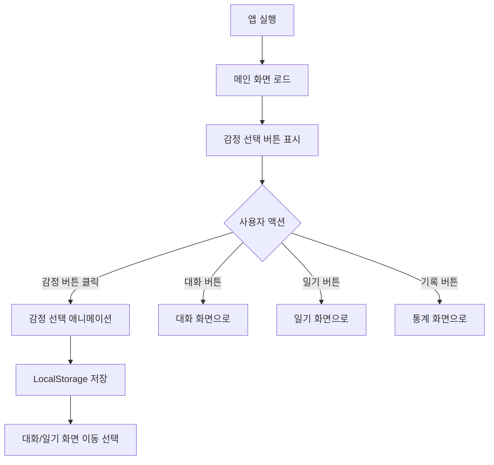

**상세 동작**:

1. **감정 버튼 클릭 시**:
```javascript
// 의사 코드
function handleEmotionClick(emotion) {
  // 1. 애니메이션 실행
  button.classList.add('scale-110', 'ring-4')
  
  // 2. 데이터 저장
  localStorage.setItem('todayEmotion', emotion)
  localStorage.setItem('emotionDate', new Date())
  
  // 3. 피드백 표시
  showToast(`오늘 기분: ${emotion}`)
  
  // 4. 다음 액션 제안
  showNextAction() // "루나와 대화할까요?"
}
```

2. **대화 버튼 클릭 시**:
```javascript
function goToChat() {
  // 감정 정보 함께 전달
  const emotion = localStorage.getItem('todayEmotion')
  router.push(`/chat?emotion=${emotion}`)
}
```

---

#### 2. 대화 화면 동작

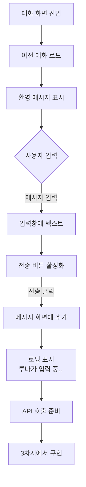

**상세 동작** (UI만, API는 3차시):

1. **페이지 로드**:
```javascript
function ChatPage() {
  // 1. 이전 대화 불러오기
  const history = localStorage.getItem('chatHistory') || []
  
  // 2. 감정 정보 가져오기
  const emotion = searchParams.get('emotion')
  
  // 3. 환영 메시지 (감정별)
  const welcome = getWelcomeMessage(emotion)
  // 예: 감정이 '슬픔'이면
  // "오늘 슬픈 일 있었어? 😢 괜찮아, 내가 들어줄게."
  
  return (
    // UI 렌더링
  )
}
```

2. **메시지 전송**:
```javascript
function sendMessage(text) {
  // 1. 화면에 내 메시지 추가
  addMessage({
    sender: 'user',
    text: text,
    timestamp: new Date()
  })
  
  // 2. 입력창 초기화
  setInput('')
  
  // 3. 로딩 표시
  setIsLoading(true)
  
  // 4. API 호출 (3차시에서)
  // callChatGPT(text)
  
  // 5. (임시) 더미 응답
  setTimeout(() => {
    addMessage({
      sender: 'luna',
      text: '루나의 응답이 여기 나올 거예요! 💙',
      timestamp: new Date()
    })
    setIsLoading(false)
  }, 2000)
}
```

---

#### 3. 감정 기록 화면 동작

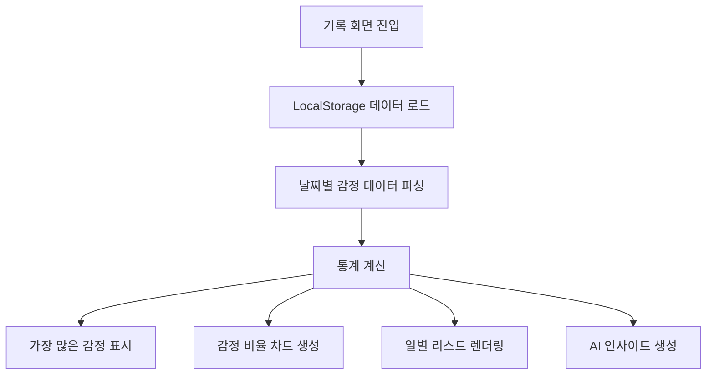

**상세 동작**:

```javascript
function EmotionRecordPage() {
  // 1. 데이터 로드
  const records = loadEmotionRecords() // localStorage
  
  // 2. 주간 필터링 (최근 7일)
  const weekRecords = records.filter(r => 
    isWithinDays(r.date, 7)
  )
  
  // 3. 통계 계산
  const stats = {
    total: weekRecords.length,
    emotions: {
      joy: weekRecords.filter(r => r.emotion === '기쁨').length,
      sadness: weekRecords.filter(r => r.emotion === '슬픔').length,
      anger: weekRecords.filter(r => r.emotion === '화남').length,
      anxiety: weekRecords.filter(r => r.emotion === '불안').length,
      neutral: weekRecords.filter(r => r.emotion === '보통').length
    }
  }
  
  // 4. 가장 많은 감정
  const mostFrequent = Object.entries(stats.emotions)
    .sort((a, b) => b[1] - a[1])[0]
  
  // 5. 인사이트 생성
  const insight = generateInsight(stats)
  // 예: "이번 주는 기쁜 일이 많았네! 😊"
  
  return (
    // UI 렌더링
  )
}
```

---

## 📅 3차시: API 연동 & 완성

### 🎯 차시 목표

1. **ChatGPT API** 연동하기
2. **감정 분석** 기능 구현하기
3. **데이터 저장** 시스템 완성하기
4. **통합 테스트** 및 배포

### 📦 차시 결과물

✅ **완성된 AI 감정 친구 앱** (배포 가능)  
✅ **API 연동 코드**  
✅ **데이터 관리 시스템**

---

### 🔄 수업 플로우차트

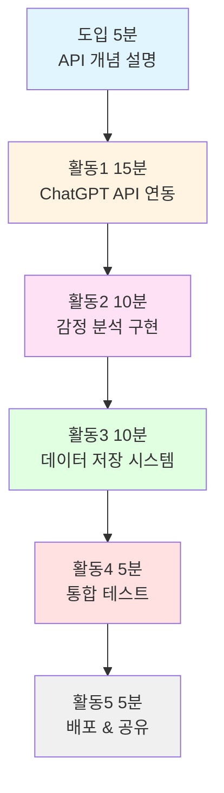

---

### 👨‍🏫 교사용 지시서

#### 📌 사전 준비

**중요!**:
- [ ] OpenAI API 키 발급 (선생님 계정)
  - 또는 학생들에게 무료 API 크레딧 제공
- [ ] API 키 환경변수 설정 방법 준비
- [ ] 백업 API 키 (학생 것이 안 될 경우)

**준비물**:
- [ ] API 연동 코드 템플릿 (복사 가능)
- [ ] 환경변수 설정 가이드
- [ ] 오류 해결 가이드

---

#### ⏱️ 단계별 진행 가이드

##### 1단계: 도입 - API 개념 (5분)

**교사 활동**:

```
📢 "API가 뭘까요?"

[비유 설명]
API = 레스토랑의 웨이터

우리 앱 (손님): "ChatGPT야, 이 질문에 답해줘!"
      ↓
API (웨이터): "네, 잠시만요~"
      ↓
ChatGPT (주방): (답변 생성)
      ↓
API (웨이터): "여기 답변입니다!"
      ↓
우리 앱: 화면에 표시

📢 "오늘 우리는 이 웨이터를 고용하는 거예요!"

[API 연동 3단계]
1. API 키 받기 (신분증)
2. API Route 만들기 (주문서)
3. 프론트엔드 연결 (손님 ↔ 웨이터)
```

---

##### 2단계: ChatGPT API 연동 (15분)

**교사 활동**:

```
📢 "첫 번째, API Route를 만들어봅시다!"

[화면 공유: 코드 작성 과정]

1. 폴더 구조 생성:
   app/
   └── api/
       └── chat/
           └── route.ts  ← 여기 만들기

2. 코드 입력 (아래 코드 복사)

3. 환경 변수 설정:
   .env.local 파일 생성
   OPENAI_API_KEY=sk-...  ← 여기에 API 키

4. 테스트
```

**API Route 코드** (학생에게 제공):

```typescript
// app/api/chat/route.ts

import { NextResponse } from 'next/server'
import OpenAI from 'openai'

// OpenAI 클라이언트 생성
const openai = new OpenAI({
  apiKey: process.env.OPENAI_API_KEY
})

export async function POST(request: Request) {
  try {
    // 1. 클라이언트에서 데이터 받기
    const { message, emotion, chatHistory } = await request.json()
    
    // 2. 시스템 프롬프트 (1차시에서 만든 것)
    const systemPrompt = `
너는 10대 학생들의 감정 친구 '루나'야.

현재 사용자 감정: ${emotion}

성격:
- 따뜻하고 포근함
- 공감을 최우선으로 함
- 긍정적이지만 현실적

말투:
- 친근한 반말
- "~인 것 같아", "음..." 자주 사용
- 이모티콘 적절히 (😊💙✨)
- 2-3문장으로 간결하게

역할:
1. 감정 먼저 공감하기
2. 판단하지 않고 수용하기
3. 필요하면 부드럽게 조언
4. 항상 사용자 편에서

금지 사항:
- "별거 아니야" 같은 무시
- "네 잘못이야" 같은 판단
- "~해야 해" 같은 강요
- 4문장 이상 긴 대답
`

    // 3. 대화 히스토리 포맷 변환
    const messages = [
      { role: 'system', content: systemPrompt },
      ...chatHistory.map((msg: any) => ({
        role: msg.sender === 'user' ? 'user' : 'assistant',
        content: msg.text
      })),
      { role: 'user', content: message }
    ]
    
    // 4. ChatGPT API 호출
    const completion = await openai.chat.completions.create({
      model: 'gpt-3.5-turbo',  // 빠르고 저렴
      messages: messages,
      max_tokens: 150,         // 짧은 응답
      temperature: 0.8,        // 자연스럽게
      presence_penalty: 0.6,   // 반복 줄이기
      frequency_penalty: 0.3
    })
    
    // 5. 응답 추출
    const lunaResponse = completion.choices[0].message.content
    
    // 6. 클라이언트에 전달
    return NextResponse.json({
      response: lunaResponse,
      timestamp: new Date().toISOString()
    })
    
  } catch (error: any) {
    console.error('API Error:', error)
    
    // 에러 처리
    return NextResponse.json(
      { error: '루나가 응답할 수 없어요 😥 잠시 후 다시 시도해주세요!' },
      { status: 500 }
    )
  }
}
```

**학생 활동** (10분):

1. **파일 생성** (2분)
   - `app/api/chat/route.ts` 생성
   - 코드 복사 붙여넣기

2. **API 키 설정** (3분)
   - `.env.local` 파일 생성
   - API 키 입력 (교사 제공 or 개인)
   
3. **캐릭터 커스터마이징** (3분)
   - systemPrompt에서 '루나' → 자기 캐릭터
   - 성격, 말투 수정

4. **저장 및 재시작** (2분)
   - 파일 저장
   - 개발 서버 재시작 (npm run dev)

**교사 순회 지도**:
- API 키 오류: 환경변수 파일 확인
- 임포트 오류: `npm install openai` 실행
- 코드 오류: 복사 다시

---

##### 3단계: 프론트엔드 연결 (10분)

**교사 활동**:

```
📢 "이제 대화 화면에서 API를 호출해봅시다!"

[코드 수정 위치]
app/chat/page.tsx (또는 2차시에 만든 대화 화면)
```

**프론트엔드 코드** (학생에게 제공):

```typescript
// app/chat/page.tsx

'use client'

import { useState, useEffect, useRef } from 'react'

export default function ChatPage() {
  const [messages, setMessages] = useState<any[]>([])
  const [input, setInput] = useState('')
  const [isLoading, setIsLoading] = useState(false)
  const [emotion, setEmotion] = useState('보통')
  
  // 스크롤 자동 이동
  const messagesEndRef = useRef<HTMLDivElement>(null)
  
  useEffect(() => {
    // 감정 정보 가져오기
    const savedEmotion = localStorage.getItem('todayEmotion') || '보통'
    setEmotion(savedEmotion)
    
    // 대화 기록 불러오기
    const savedMessages = localStorage.getItem('chatHistory')
    if (savedMessages) {
      setMessages(JSON.parse(savedMessages))
    } else {
      // 첫 환영 메시지
      const welcomeMsg = {
        sender: 'luna',
        text: getWelcomeMessage(savedEmotion),
        timestamp: new Date().toISOString()
      }
      setMessages([welcomeMsg])
    }
  }, [])
  
  // 환영 메시지 생성
  function getWelcomeMessage(emotion: string) {
    const welcomes: Record<string, string> = {
      '기쁨': '오늘 기분 좋은 일 있었어? 😊 얘기해줘!',
      '슬픔': '오늘 슬픈 일 있었구나 😢 괜찮아, 내가 들어줄게 💙',
      '화남': '무슨 일로 화났어? 😤 나한테 털어놔!',
      '불안': '불안한 게 있어? 😰 천천히 얘기해봐. 같이 생각해보자!',
      '보통': '오늘은 어땠어? 😊 무슨 일이든 얘기해줘~'
    }
    return welcomes[emotion] || '안녕! 오늘 어땠어? 💙'
  }
  
  // 메시지 전송 (핵심 함수!)
  async function sendMessage() {
    if (!input.trim() || isLoading) return
    
    const userMessage = {
      sender: 'user',
      text: input,
      timestamp: new Date().toISOString()
    }
    
    // 1. 화면에 내 메시지 추가
    const newMessages = [...messages, userMessage]
    setMessages(newMessages)
    setInput('')
    setIsLoading(true)
    
    try {
      // 2. API 호출
      const response = await fetch('/api/chat', {
        method: 'POST',
        headers: {
          'Content-Type': 'application/json'
        },
        body: JSON.stringify({
          message: input,
          emotion: emotion,
          chatHistory: messages
        })
      })
      
      if (!response.ok) {
        throw new Error('API 호출 실패')
      }
      
      const data = await response.json()
      
      // 3. 루나의 응답 추가
      const lunaMessage = {
        sender: 'luna',
        text: data.response,
        timestamp: data.timestamp
      }
      
      const finalMessages = [...newMessages, lunaMessage]
      setMessages(finalMessages)
      
      // 4. 저장
      localStorage.setItem('chatHistory', JSON.stringify(finalMessages))
      
    } catch (error) {
      console.error('Error:', error)
      
      // 에러 메시지 표시
      const errorMessage = {
        sender: 'luna',
        text: '미안해... 지금은 응답할 수 없어 😥 잠시 후 다시 시도해줘!',
        timestamp: new Date().toISOString()
      }
      setMessages([...newMessages, errorMessage])
    } finally {
      setIsLoading(false)
    }
  }
  
  // 스크롤 자동 이동
  useEffect(() => {
    messagesEndRef.current?.scrollIntoView({ behavior: 'smooth' })
  }, [messages])
  
  return (
    <div className="flex flex-col h-screen bg-purple-50">
      {/* 헤더 */}
      <div className="p-4 bg-white shadow-sm">
        <div className="flex items-center gap-3">
          <div className="w-12 h-12 rounded-full bg-purple-200 flex items-center justify-center text-2xl">
            💜
          </div>
          <div>
            <h2 className="font-bold text-lg">루나</h2>
            <p className="text-sm text-gray-600">
              {isLoading ? '입력 중...' : '온라인 🟢'}
            </p>
          </div>
        </div>
      </div>
      
      {/* 대화 영역 */}
      <div className="flex-1 overflow-y-auto p-4 space-y-4">
        {messages.map((msg, idx) => (
          <div
            key={idx}
            className={`flex ${msg.sender === 'user' ? 'justify-end' : 'justify-start'}`}
          >
            <div
              className={`max-w-[70%] p-4 rounded-2xl ${
                msg.sender === 'user'
                  ? 'bg-purple-500 text-white rounded-br-none'
                  : 'bg-white text-gray-900 rounded-bl-none shadow-md'
              }`}
            >
              <p className="whitespace-pre-wrap">{msg.text}</p>
              <p className="text-xs mt-1 opacity-70">
                {new Date(msg.timestamp).toLocaleTimeString('ko-KR', {
                  hour: '2-digit',
                  minute: '2-digit'
                })}
              </p>
            </div>
          </div>
        ))}
        
        {isLoading && (
          <div className="flex justify-start">
            <div className="bg-white p-4 rounded-2xl rounded-bl-none shadow-md">
              <div className="flex gap-1">
                <span className="w-2 h-2 bg-gray-400 rounded-full animate-bounce"></span>
                <span className="w-2 h-2 bg-gray-400 rounded-full animate-bounce delay-100"></span>
                <span className="w-2 h-2 bg-gray-400 rounded-full animate-bounce delay-200"></span>
              </div>
            </div>
          </div>
        )}
        
        <div ref={messagesEndRef} />
      </div>
      
      {/* 입력 영역 */}
      <div className="p-4 bg-white border-t">
        <div className="flex gap-2">
          <input
            type="text"
            value={input}
            onChange={(e) => setInput(e.target.value)}
            onKeyPress={(e) => e.key === 'Enter' && sendMessage()}
            placeholder="메시지를 입력하세요..."
            className="flex-1 px-4 py-3 rounded-full border-2 border-purple-200 focus:border-purple-500 focus:outline-none"
            disabled={isLoading}
          />
          <button
            onClick={sendMessage}
            disabled={!input.trim() || isLoading}
            className="w-12 h-12 rounded-full bg-purple-500 text-white flex items-center justify-center hover:bg-purple-600 disabled:opacity-50 disabled:cursor-not-allowed transition-all"
          >
            ✈️
          </button>
        </div>
      </div>
    </div>
  )
}
```

**학생 활동** (7분):
1. 코드 복사 → 대화 페이지에 적용
2. 테스트: 메시지 보내보기
3. 응답 확인

**교사 순회**:
- API 오류: Network 탭 확인
- 응답 안 옴: API 키 재확인
- 잘 되는 학생: 다른 학생 도와주기

---

##### 4단계: 감정 분석 & 저장 (10분)

**간단한 감정 분석 API** (선택):

```typescript
// app/api/analyze-emotion/route.ts

import { NextResponse } from 'next/server'
import OpenAI from 'openai'

const openai = new OpenAI({
  apiKey: process.env.OPENAI_API_KEY
})

export async function POST(request: Request) {
  try {
    const { diaryText } = await request.json()
    
    const prompt = `
다음 일기의 감정을 분석해줘:

"${diaryText}"

다음 JSON으로만 응답:
{
  "emotion": "기쁨|슬픔|화남|불안|보통",
  "intensity": 1-10,
  "keywords": ["단어1", "단어2", "단어3"],
  "comment": "공감하는 한 줄 (20자)"
}
`

    const completion = await openai.chat.completions.create({
      model: 'gpt-3.5-turbo',
      messages: [{ role: 'user', content: prompt }],
      temperature: 0.5,
      response_format: { type: "json_object" }
    })
    
    const analysis = JSON.parse(completion.choices[0].message.content)
    return NextResponse.json(analysis)
    
  } catch (error) {
    return NextResponse.json(
      { error: '분석 실패' },
      { status: 500 }
    )
  }
}
```

---

##### 5단계: 통합 테스트 (5분)

**테스트 체크리스트** (학생용):

```
□ 메인 화면 → 감정 선택 가능
□ 대화 화면 → 메시지 보내면 응답 옴
□ 응답이 캐릭터 성격에 맞음
□ 대화 기록이 저장됨 (새로고침 후에도)
□ 감정 기록 화면에 데이터 표시됨
```

---

##### 6단계: 배포 & 공유 (5분)

**Vercel 배포** (간단):

```bash
# 터미널에서
npx vercel

# 질문에 답하기
# → Deploy!
```

**학생 활동**:
- 배포 링크 받기
- 친구에게 공유
- QR 코드 생성 (선택)

---

### 📋 최종 기능 명세서

#### 시스템 아키텍처

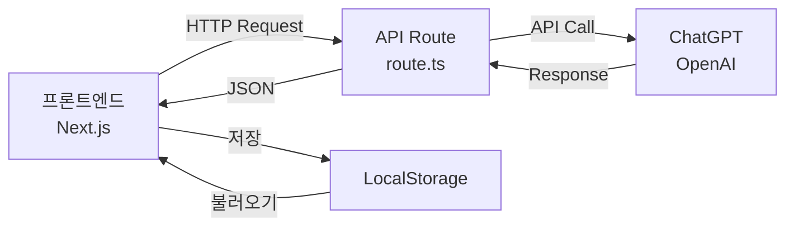

#### API 엔드포인트

| 엔드포인트 | 메서드 | 기능 | 입력 | 출력 |
|-----------|--------|------|------|------|
| `/api/chat` | POST | 대화 생성 | message, emotion, history | response, timestamp |
| `/api/analyze-emotion` | POST | 감정 분석 | diaryText | emotion, intensity, keywords, comment |

#### 데이터 구조

**LocalStorage 키**:

1. **`todayEmotion`** (오늘 감정)
```json
{
  "emotion": "기쁨",
  "date": "2025-11-02",
  "timestamp": "2025-11-02T14:30:00Z"
}
```

2. **`chatHistory`** (대화 기록)
```json
[
  {
    "sender": "user",
    "text": "오늘 친구랑 싸웠어...",
    "timestamp": "2025-11-02T14:30:00Z"
  },
  {
    "sender": "luna",
    "text": "아... 많이 속상하겠다 😢",
    "timestamp": "2025-11-02T14:30:05Z"
  }
]
```

3. **`emotionRecords`** (감정 기록)
```json
[
  {
    "id": "20251102",
    "date": "2025-11-02",
    "emotion": "슬픔",
    "intensity": 7,
    "keywords": ["친구", "싸움", "속상"],
    "comment": "많이 힘들었구나..."
  }
]
```

---

**💡 프로젝트 1 완성!**

학생 성과:
- ✅ ChatGPT API 활용 능력
- ✅ 시스템 프롬프트 설계 능력
- ✅ API 연동 기초 지식
- ✅ 실용적인 앱 제작 경험

---

# 🕵️ 프로젝트 2: AI 추리 탐정 게임 (4-6차시)

## 프로젝트 개요

**목표**: AI가 매번 다른 사건을 생성하는 추리 게임 만들기

**완성물**:
- 사건 생성 시스템 (ChatGPT)
- 장소 조사 & 증거 수집
- NPC 심문 시스템
- 최종 추리 & 결과 화면

**사용 기술**:
- ChatGPT API (사건 생성, NPC 대화)
- v0 (게임 UI)
- 복잡한 상태 관리

**게임 특징**:
- 🎲 매 플레이마다 다른 사건
- 🔍 장소 조사 & 증거 수집
- 💬 NPC와 대화 (AI)
- ⏰ 시간 제한 (20분)
- 🏆 멀티 엔딩

---

## 📅 4차시: 게임 기획 & 사건 생성 시스템

### 🎯 차시 목표

1. **추리 게임 메커니즘** 설계하기
2. **AI 사건 생성기** 만들기
3. **게임 데이터 구조** 정의하기
4. **게임 플로우** 완성하기

### 📦 차시 결과물

✅ **게임 기획서** (메커니즘, 룰)  
✅ **AI 사건 생성 API** (작동 확인)  
✅ **데이터 구조 명세서**

---

### 🔄 수업 플로우차트

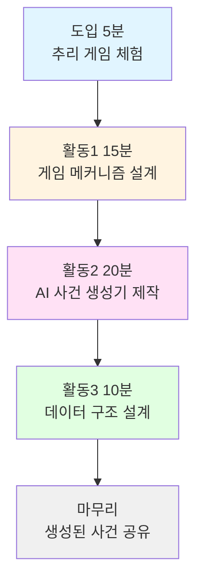

---

### 👨‍🏫 교사용 지시서

#### 📌 사전 준비

**준비물**:
- [ ] 추리 게임 데모 (예: 온라인 추리 게임)
- [ ] 게임 기획 워크시트
- [ ] 사건 예시 3종 (PPT)
- [ ] 데이터 구조 템플릿

**환경 설정**:
- [ ] ChatGPT API 작동 확인
- [ ] 예시 사건 JSON 파일 준비

---

#### ⏱️ 단계별 진행 가이드

##### 1단계: 도입 - 추리 게임 체험 (5분)

**교사 활동**:

```
📢 "추리 게임 해본 적 있나요?"

[학생 반응 수렴]
→ 마피아, 어몽 어스, 탐정 보드게임 등

📢 "오늘부터 우리만의 추리 게임을 만들어볼 거예요!"

[데모 시연 or 영상 - 2분]
- 사건 발생
- 장소 조사
- 용의자 심문
- 범인 지목

📢 "특별한 점은... AI가 매번 다른 사건을 만들어줘요!
   100번 플레이하면 100개의 다른 사건!"
```

---

##### 2단계: 게임 메커니즘 설계 (15분)

**교사 활동**:

```
📢 "먼저 게임 규칙을 정해봅시다!"

[칠판에 게임 플로우 그리기]

1. 사건 발생 (AI 생성)
   ↓
2. 탐색 단계 (15분)
   - 장소 조사 (증거 수집)
   - 용의자 심문 (질문하기)
   - 증거 분석 (연결하기)
   ↓
3. 추리 단계 (5분)
   - 범인 지목
   - 동기 설명
   - 증거 제시
   ↓
4. 결과 발표
   - 정답 확인
   - 점수 계산
   - 엔딩

📢 "추리 게임에 필요한 요소가 뭘까요?"

[브레인스토밍 → 칠판 정리]

필수 요소:
- 사건 (무엇이 일어났나?)
- 용의자 3-4명 (범인 1명)
- 장소 4-5곳
- 증거 5-7개
- 알리바이 (용의자별)
- 동기
- 방법
```

**학생 활동** (10분):

**워크시트: 게임 메커니즘 설계**

```
┌─────────────────────────────────────┐
│    추리 게임 메커니즘 설계서         │
├─────────────────────────────────────┤
│ 1. 게임 목표                         │
│ ________________________________    │
│                                     │
│ 2. 플레이 시간                       │
│ □ 10분  □ 15분  □ 20분  □ 30분     │
│                                     │
│ 3. 용의자 수                         │
│ □ 3명   □ 4명   □ 5명              │
│                                     │
│ 4. 장소 수                           │
│ □ 3곳   □ 4곳   □ 5곳   □ 6곳      │
│                                     │
│ 5. 증거 개수                         │
│ □ 5개   □ 7개   □ 10개             │
│                                     │
│ 6. 난이도 조절 방법                  │
│ 쉬움: _________________________    │
│ 어려움: _________________________  │
│                                     │
│ 7. 점수 시스템                       │
│ - 범인 맞춤: _____ 점               │
│ - 동기 정확: _____ 점               │
│ - 증거 제시: _____ 점               │
│ - 시간 보너스: _____ 점             │
│                                     │
│ 8. 특별한 기능 (아이디어)            │
│ ________________________________    │
│ ________________________________    │
└─────────────────────────────────────┘
```

**교사 순회 지도**:
- 너무 복잡한 설계: 단순화 권장
- 창의적 아이디어: 격려 및 공유
- 시간 설정: 20분 추천

---

##### 3단계: AI 사건 생성기 제작 (20분)

**교사 활동**:

```
📢 "이제 AI로 사건을 자동으로 만들어봅시다!"

[화면 공유: 코드 작성 과정]

폴더 구조:
app/
└── api/
    └── generate-case/
        └── route.ts  ← 새로 만들기

📢 "이 API는 사건을 자동으로 만들어줘요!"
```

**AI 사건 생성 API 코드**:

```typescript
// app/api/generate-case/route.ts

import { NextResponse } from 'next/server'
import OpenAI from 'openai'

const openai = new OpenAI({
  apiKey: process.env.OPENAI_API_KEY
})

export async function POST(request: Request) {
  try {
    const { difficulty, theme } = await request.json()
    
    const prompt = `
당신은 추리 게임 시나리오 작가입니다.
다음 조건으로 미스터리 사건을 만들어주세요.

난이도: ${difficulty} (쉬움/보통/어려움)
배경: ${theme} (고전 저택/현대 회사/학교/호텔 중 하나)

JSON 형식으로 응답해주세요:

{
  "title": "사건 제목 (흥미롭게, 20자 이내)",
  "setting": {
    "location": "구체적 장소 이름",
    "time": "사건 발생 시각",
    "description": "분위기 묘사 (3문장)"
  },
  "victim": {
    "name": "피해자 이름",
    "age": "나이대",
    "role": "직업/역할",
    "background": "간단한 배경 (2문장)"
  },
  "crime": {
    "type": "절도|사기|비밀누설|기물파손",
    "what": "무엇이 일어났는지 (구체적)",
    "when": "정확한 시간",
    "where": "정확한 장소"
  },
  "suspects": [
    {
      "name": "용의자 이름",
      "age": "나이대",
      "role": "피해자와의 관계",
      "personality": "성격 특징 (한 줄)",
      "alibi": "알리바이 (어디 있었다고 주장)",
      "suspiciousPoint": "의심스러운 점",
      "motive": "동기 (범인인 경우)",
      "isCulprit": true 또는 false
    }
    // 총 3-4명 (범인 1명 포함)
  ],
  "locations": [
    {
      "name": "장소 이름",
      "description": "장소 설명 (2문장)",
      "clues": ["발견 가능한 단서1", "단서2"]
    }
    // 총 4-5개 장소
  ],
  "evidence": [
    {
      "id": "unique_id",
      "name": "증거 이름",
      "icon": "적절한 이모티콘",
      "description": "상세 설명 (2문장)",
      "foundAt": "어느 장소에서 발견",
      "relatedTo": "어느 용의자와 연관",
      "importance": 1-5 (중요도)
    }
    // 총 5-7개 증거 (범인 지목에 필요한 결정적 증거 3개 포함)
  ],
  "solution": {
    "culprit": "범인 이름",
    "motive": "범행 동기 (자세히)",
    "method": "범행 방법 (시간순)",
    "timeline": "범행 타임라인 (5단계)",
    "keyEvidence": ["결정적 증거1", "증거2", "증거3"]
  },
  "hints": [
    "힌트1 (첫 10분 제공)",
    "힌트2 (막히면 제공)",
    "힌트3 (최종 힌트)"
  ]
}

작성 규칙:
1. 난이도별 차이:
   - 쉬움: 증거가 명확하고 알리바이 허점 많음, 범인 동기 뚜렷
   - 보통: 일부 증거 애매모호, 용의자 모두 의심스러움
   - 어려움: 증거 해석 필요, 복잡한 관계, 범인 치밀함

2. 논리적 일관성:
   - 모든 증거는 사건과 연결
   - 알리바이는 검증 가능
   - 타임라인 모순 없음
   - 범인의 방법과 동기가 현실적

3. 재미 요소:
   - 반전 요소 1개 포함
   - 허위 증거 (레드 헤링) 1-2개
   - 감정적 몰입 (갈등, 비밀)

4. 학생 수준:
   - 고등학생이 추리 가능한 난이도
   - 과도하게 복잡하지 않음
   - 20분 안에 해결 가능

5. 다양성:
   - 이전과 다른 사건 유형
   - 다양한 인물 관계
   - 독창적인 범행 방법
`

    const completion = await openai.chat.completions.create({
      model: 'gpt-4',  // GPT-4 권장 (복잡한 생성)
      messages: [{ role: 'user', content: prompt }],
      temperature: 0.9,  // 창의적
      max_tokens: 2000,  // 충분한 길이
      response_format: { type: "json_object" }
    })
    
    const caseData = JSON.parse(completion.choices[0].message.content)
    
    // 메타데이터 추가
    caseData.id = `case_${Date.now()}`
    caseData.createdAt = new Date().toISOString()
    caseData.difficulty = difficulty
    caseData.theme = theme
    
    return NextResponse.json(caseData)
    
  } catch (error: any) {
    console.error('사건 생성 오류:', error)
    return NextResponse.json(
      { 
        error: '사건 생성에 실패했습니다.',
        details: error.message 
      },
      { status: 500 }
    )
  }
}
```

**학생 활동** (15분):

1. **파일 생성** (2분)
   - `app/api/generate-case/route.ts` 생성
   - 코드 복사 붙여넣기

2. **테스트 페이지 생성** (3분)

```typescript
// app/test-case/page.tsx

'use client'

import { useState } from 'react'

export default function TestCasePage() {
  const [caseData, setCaseData] = useState<any>(null)
  const [isLoading, setIsLoading] = useState(false)
  
  async function generateCase(difficulty: string, theme: string) {
    setIsLoading(true)
    try {
      const response = await fetch('/api/generate-case', {
        method: 'POST',
        headers: { 'Content-Type': 'application/json' },
        body: JSON.stringify({ difficulty, theme })
      })
      const data = await response.json()
      setCaseData(data)
    } catch (error) {
      console.error('Error:', error)
    } finally {
      setIsLoading(false)
    }
  }
  
  return (
    <div className="min-h-screen p-8 bg-amber-50">
      <h1 className="text-3xl font-bold mb-8">🕵️ 사건 생성 테스트</h1>
      
      <div className="mb-8 flex gap-4">
        <button
          onClick={() => generateCase('쉬움', '고전 저택')}
          disabled={isLoading}
          className="px-6 py-3 bg-green-500 text-white rounded-lg hover:bg-green-600"
        >
          쉬움 - 저택
        </button>
        <button
          onClick={() => generateCase('보통', '현대 회사')}
          disabled={isLoading}
          className="px-6 py-3 bg-yellow-500 text-white rounded-lg hover:bg-yellow-600"
        >
          보통 - 회사
        </button>
        <button
          onClick={() => generateCase('어려움', '학교')}
          disabled={isLoading}
          className="px-6 py-3 bg-red-500 text-white rounded-lg hover:bg-red-600"
        >
          어려움 - 학교
        </button>
      </div>
      
      {isLoading && (
        <div className="text-center py-12">
          <p className="text-xl">AI가 사건을 생성 중입니다...</p>
          <p className="text-gray-600 mt-2">20-30초 소요됩니다</p>
        </div>
      )}
      
      {caseData && (
        <div className="bg-white p-8 rounded-2xl shadow-xl">
          <h2 className="text-2xl font-bold mb-4">🎯 {caseData.title}</h2>
          
          <div className="mb-6">
            <h3 className="font-bold text-lg mb-2">📍 배경</h3>
            <p className="text-gray-700">{caseData.setting.description}</p>
          </div>
          
          <div className="mb-6">
            <h3 className="font-bold text-lg mb-2">👥 용의자</h3>
            {caseData.suspects.map((s: any, idx: number) => (
              <div key={idx} className="mb-3 p-4 bg-gray-50 rounded-lg">
                <p className="font-semibold">
                  {s.name} ({s.age}) - {s.role}
                </p>
                <p className="text-sm text-gray-600">성격: {s.personality}</p>
                <p className="text-sm text-gray-600">알리바이: {s.alibi}</p>
                <p className="text-sm text-red-600">의심: {s.suspiciousPoint}</p>
                {s.isCulprit && (
                  <p className="text-xs text-red-800 mt-2 font-bold">
                    ⚠️ 범인 (학생에게는 숨김)
                  </p>
                )}
              </div>
            ))}
          </div>
          
          <div className="mb-6">
            <h3 className="font-bold text-lg mb-2">🔍 증거</h3>
            <div className="grid grid-cols-2 gap-3">
              {caseData.evidence.map((e: any) => (
                <div key={e.id} className="p-3 bg-blue-50 rounded-lg">
                  <p className="font-semibold">
                    {e.icon} {e.name}
                  </p>
                  <p className="text-xs text-gray-600">발견: {e.foundAt}</p>
                  <p className="text-xs">중요도: {'⭐'.repeat(e.importance)}</p>
                </div>
              ))}
            </div>
          </div>
          
          <div className="mb-6 p-4 bg-red-50 rounded-lg border-2 border-red-200">
            <h3 className="font-bold text-lg mb-2 text-red-800">
              🔒 정답 (교사용)
            </h3>
            <p><strong>범인:</strong> {caseData.solution.culprit}</p>
            <p><strong>동기:</strong> {caseData.solution.motive}</p>
            <p><strong>방법:</strong> {caseData.solution.method}</p>
          </div>
          
          <button
            onClick={() => navigator.clipboard.writeText(JSON.stringify(caseData, null, 2))}
            className="w-full py-3 bg-purple-500 text-white rounded-lg hover:bg-purple-600"
          >
            📋 JSON 복사하기
          </button>
        </div>
      )}
    </div>
  )
}
```

3. **사건 생성 테스트** (10분)
   - `/test-case` 페이지 접속
   - 버튼 클릭하여 사건 생성
   - 결과 확인

**교사 순회 지도**:
- API 오류: 프롬프트 길이 조절
- 생성 느림: GPT-3.5로 변경 권장
- 이상한 사건: 다시 생성

---

##### 4단계: 데이터 구조 설계 (10분)

**교사 활동**:

```
📢 "게임 데이터를 어떻게 관리할지 정리해봅시다!"

[화면 공유: 데이터 구조 다이어그램]
```

**게임 상태 구조**:

```typescript
// types/game.ts

export interface GameState {
  // 사건 정보
  case: CaseData
  
  // 플레이어 상태
  player: {
    name: string
    score: number
    timeLeft: number  // 초 단위
    hintsUsed: number
  }
  
  // 탐색 진행
  progress: {
    visitedLocations: string[]  // 방문한 장소 ID
    discoveredEvidence: string[]  // 발견한 증거 ID
    interrogatedSuspects: string[]  // 심문한 용의자 ID
    connections: Array<[string, string]>  // 연결한 증거 쌍
  }
  
  // NPC 대화 기록
  dialogueHistory: Array<{
    suspectName: string
    question: string
    answer: string
    timestamp: string
  }>
  
  // 게임 상태
  status: 'playing' | 'finished'
  result?: {
    accusedCulprit: string
    isCorrect: boolean
    score: number
    feedback: string
  }
}

export interface CaseData {
  id: string
  title: string
  difficulty: string
  theme: string
  setting: {
    location: string
    time: string
    description: string
  }
  victim: {
    name: string
    age: string
    role: string
    background: string
  }
  crime: {
    type: string
    what: string
    when: string
    where: string
  }
  suspects: Suspect[]
  locations: Location[]
  evidence: Evidence[]
  solution: Solution
  hints: string[]
  createdAt: string
}

export interface Suspect {
  name: string
  age: string
  role: string
  personality: string
  alibi: string
  suspiciousPoint: string
  motive?: string
  isCulprit: boolean
}

export interface Location {
  name: string
  description: string
  clues: string[]
  visited?: boolean
}

export interface Evidence {
  id: string
  name: string
  icon: string
  description: string
  foundAt: string
  relatedTo: string
  importance: number
  discovered?: boolean
}

export interface Solution {
  culprit: string
  motive: string
  method: string
  timeline: string
  keyEvidence: string[]
}
```

**학생 활동** (7분):
- 워크시트에 데이터 구조 그리기
- 필요한 데이터 항목 체크
- 팀원과 공유

---

##### 5단계: 마무리 - 생성된 사건 공유 (5분)

**교사 활동**:

```
📢 "각자 만든 사건을 공유해봅시다!"

[2-3명 발표]
- 사건 제목
- 흥미로운 점
- 난이도 적절성

📢 "다음 시간에는 게임 UI를 만들어볼 거예요!"
```

---

### 📋 기능 명세서 (4차시 결과물)

#### 1. AI 사건 생성 시스템

**입력**:
- 난이도: 쉬움 | 보통 | 어려움
- 테마: 고전 저택 | 현대 회사 | 학교 | 호텔

**출력**:
- 완전한 사건 데이터 (JSON)
- 용의자 3-4명 (범인 1명)
- 장소 4-5곳
- 증거 5-7개
- 해결 방법

**처리 시간**: 20-30초

---

#### 2. 게임 메커니즘

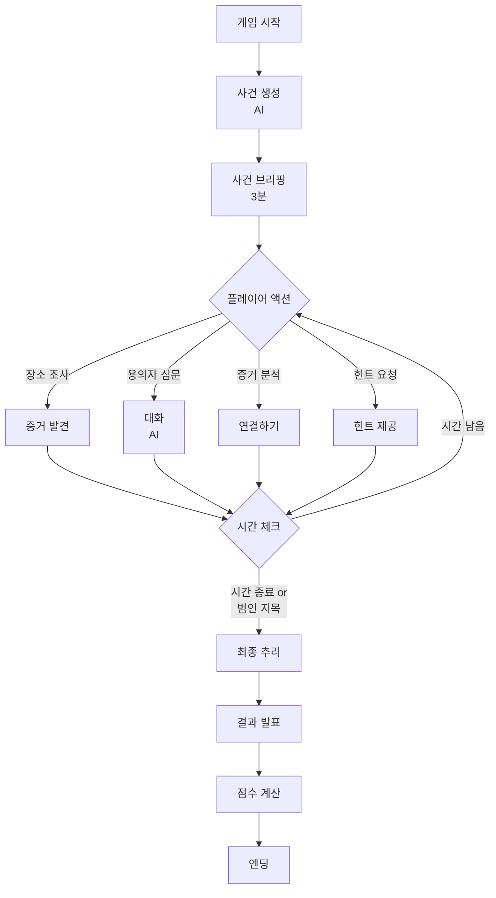

---

#### 3. 점수 시스템

| 항목 | 점수 | 조건 |
|------|------|------|
| 범인 정확 | 40점 | 범인을 맞춤 |
| 동기 정확 | 20점 | 동기를 정확히 설명 |
| 방법 정확 | 20점 | 범행 방법 설명 |
| 증거 제시 | 15점 | 결정적 증거 3개 제시 |
| 시간 보너스 | 5점 | 남은 시간 1분당 1점 |
| **합계** | **100점** | |

**등급**:
- 90-100점: 명탐정 🏆
- 70-89점: 유능한 탐정 ⭐
- 50-69점: 견습 탐정 ✨
- 0-49점: 다시 도전! 🔍

---

**💡 4차시 완성!**

학생 성과:
- ✅ 게임 메커니즘 설계 능력
- ✅ AI 사건 생성 시스템 구축
- ✅ 복잡한 데이터 구조 이해
- ✅ 논리적 사고력 향상

---

## 📅 5-6차시: 게임 UI 제작 & NPC 심문 시스템

### 📊 차시 구성 (요약)

#### 5차시: 게임 UI 제작

**목표**: 추리 게임 화면 3개 제작 (메인, 탐색, 결과)

**활동 구성** (50분):
1. 게임 메인 화면 (15분) - v0로 시작 화면 제작
2. 탐색 화면 (20분) - 장소/용의자/증거 탭 UI
3. 결과 화면 (10분) - 점수 및 정답 공개
4. 네비게이션 연결 (5분)

**핵심 v0 프롬프트**:
```
"미스터리 추리 게임 UI를 만들어줘.

디자인: 빈티지 탐정 느낌 (세피아, 갈색, 금색)

화면 3개:
1. 메인: 사건 제목 + 브리핑 + 시작 버튼
2. 탐색: 탭 3개 (장소/용의자/증거) + 타이머 + 힌트 버튼
3. 결과: 점수 카드 + 정답 공개 + 다시하기

Next.js 14, Tailwind, 클래식 미스터리 분위기"
```

---

#### 6차시: NPC 심문 시스템 & 게임 완성

**목표**: AI로 용의자와 대화하는 시스템 구현

**활동 구성** (50분):
1. NPC 대화 API 제작 (15분)
2. 심문 UI 연결 (15분)
3. 최종 추리 로직 (10분)
4. 통합 테스트 (10분)

**핵심 API 코드 (요약)**:

```typescript
// app/api/interrogate/route.ts

export async function POST(request: Request) {
  const { suspect, question, caseContext } = await request.json()
  
  const systemPrompt = `
당신은 추리 게임 NPC "${suspect.name}"입니다.

프로필:
- 성격: ${suspect.personality}
- 알리바이: ${suspect.alibi}
- 범인 여부: ${suspect.isCulprit ? "예 (숨겨야 함)" : "아니오"}

역할:
- 성격에 맞게 자연스럽게 대답
- ${suspect.isCulprit ? "범인이므로 회피하거나 애매하게" : "아는 것은 솔직하게"}
- 2-3문장으로 간결하게

규칙:
- "저는 범인이 아닙니다" 같은 직접 부인 금지
- 탐정을 의식하는 모습
- 일관된 성격 유지
`

  const completion = await openai.chat.completions.create({
    model: 'gpt-3.5-turbo',
    messages: [
      { role: 'system', content: systemPrompt },
      { role: 'user', content: question }
    ],
    max_tokens: 150,
    temperature: 0.8
  })
  
  return NextResponse.json({
    answer: completion.choices[0].message.content
  })
}
```

**동작 플로우차트**:

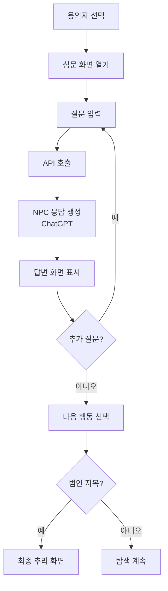

---

### 📋 프로젝트 2 완성 기능 명세

#### 핵심 기능

| 기능 | API | 설명 |
|------|-----|------|
| 사건 생성 | `/api/generate-case` | AI가 무작위 사건 생성 |
| NPC 심문 | `/api/interrogate` | 용의자와 대화 |
| 증거 분석 | 클라이언트 | 증거 연결 및 힌트 |
| 최종 추리 | `/api/evaluate` | 답안 채점 |

#### 데이터 흐름

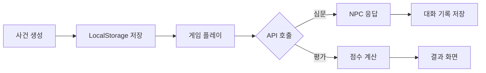

---

**💡 프로젝트 2 완성!**

학생 성과:
- ✅ 복잡한 게임 로직 구현
- ✅ AI NPC 대화 시스템 구축
- ✅ 동적 콘텐츠 생성 (사건)
- ✅ 상태 관리 능력 향상

---

# 📖 프로젝트 3: AI 무한 스토리 월드 (7-8차시)

## 프로젝트 개요

**목표**: 사용자 선택에 따라 무한히 이어지는 AI 스토리 생성

**완성물**:
- 분기형 스토리 시스템
- AI 장면 생성 (텍스트)
- 선택지 자동 생성
- 스토리 저장 & 재생

**사용 기술**:
- ChatGPT API (스토리 생성)
- DALL-E API (이미지, 선택)
- v0 (스토리북 UI)

**특징**:
- 🎲 무한 분기 스토리
- 🎨 AI 생성 장면 이미지 (선택)
- 💾 스토리 저장 & 공유
- 🎬 멀티 엔딩

---

## 📅 7차시: 스토리 생성 시스템 & UI

### 🎯 차시 목표

1. **분기형 스토리 구조** 설계
2. **AI 스토리 생성 API** 제작
3. **스토리북 UI** 제작

### 📦 차시 결과물

✅ **스토리 생성 API** (작동)  
✅ **스토리북 UI** (v0)  
✅ **분기 시스템** (로직)

---

### 🔄 수업 플로우차트

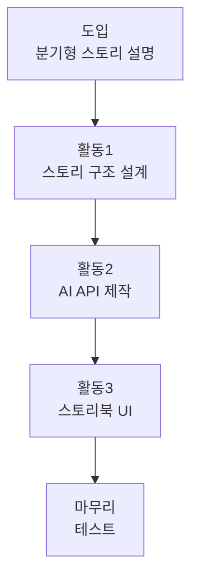

---

### 📋 핵심 기능 명세

#### 1. AI 스토리 생성 API

```typescript
// app/api/generate-story/route.ts

export async function POST(request: Request) {
  const { currentScene, userChoice, context } = await request.json()
  
  const prompt = `
당신은 인터랙티브 스토리 작가입니다.

현재 장면:
"${currentScene}"

사용자 선택:
"${userChoice}"

이전 맥락:
${context}

다음 장면을 생성해주세요 (JSON):
{
  "sceneText": "장면 묘사 (3-4문장)",
  "emotion": "분위기 (신비로운/긴장감/평화로운/위험한)",
  "choices": [
    { "id": 1, "text": "선택지 1", "consequence": "짧은 결과 힌트" },
    { "id": 2, "text": "선택지 2", "consequence": "짧은 결과 힌트" },
    { "id": 3, "text": "선택지 3", "consequence": "짧은 결과 힌트" }
  ],
  "imagePrompt": "이미지 생성용 프롬프트 (영어, 50단어)",
  "isEnding": true/false,
  "endingType": "해피엔딩|새드엔딩|오픈엔딩" (if isEnding)
}

규칙:
- 이전 선택의 결과 반영
- 논리적 일관성 유지
- 각 선택은 의미 있게 다른 결과
- 5-7 장면 후 엔딩 도달
- 학생에게 적합한 내용
`

  const completion = await openai.chat.completions.create({
    model: 'gpt-4',
    messages: [{ role: 'user', content: prompt }],
    temperature: 0.9,
    response_format: { type: "json_object" }
  })
  
  return NextResponse.json(JSON.parse(completion.choices[0].message.content))
}
```

#### 2. 스토리 데이터 구조

```typescript
interface Story {
  id: string
  title: string
  genre: string  // 판타지/SF/미스터리/로맨스
  scenes: Scene[]
  currentSceneIndex: number
  createdAt: string
}

interface Scene {
  id: string
  sceneNumber: number
  text: string
  emotion: string
  imageUrl?: string
  choices: Choice[]
  userChoice?: number
  isEnding: boolean
  endingType?: string
}

interface Choice {
  id: number
  text: string
  consequence: string
}
```

#### 3. 스토리북 UI (v0 프롬프트 요약)

```
"인터랙티브 스토리북 앱을 만들어줘.

레이아웃:
1. 상단: 스토리 제목 + 장면 번호
2. 중앙: 장면 텍스트 (타이핑 효과)
3. 하단: 선택지 버튼 3개 (카드 형태)

디자인:
- 동화책 느낌 (세리프 폰트, 부드러운 색상)
- 선택지 호버 시 결과 힌트 표시
- 페이지 넘김 애니메이션

Next.js, Tailwind, Framer Motion"
```

---

## 📅 8차시: 스토리 완성 & 발표

### 🎯 차시 목표

1. **이미지 생성** (선택, DALL-E)
2. **스토리 저장 & 공유** 기능
3. **최종 테스트** 및 개선
4. **프로젝트 발표**

### 활동 구성 (50분)

1. **스토리 완성** (20분)
   - 자기만의 스토리 제작
   - 최소 3가지 엔딩 테스트

2. **이미지 추가** (15분, 선택)
   - DALL-E API로 장면 이미지 생성
   - 스토리북에 삽입

3. **저장 & 공유** (10분)
   - 스토리 JSON 저장
   - QR 코드 생성하여 공유

4. **발표** (5분)
   - 2-3명 시연
   - 가장 재미있는 스토리 투표

---

### 📋 최종 기능 명세

#### 핵심 기능

| 기능 | 설명 | API |
|------|------|-----|
| 스토리 생성 | AI가 장면 생성 | ChatGPT |
| 선택지 제공 | 3가지 선택 | ChatGPT |
| 이미지 생성 | 장면 삽화 (선택) | DALL-E |
| 분기 관리 | 선택에 따른 스토리 분기 | 클라이언트 |
| 저장/불러오기 | LocalStorage | 클라이언트 |
| 공유 | JSON 내보내기 | 클라이언트 |

#### 게임 플로우

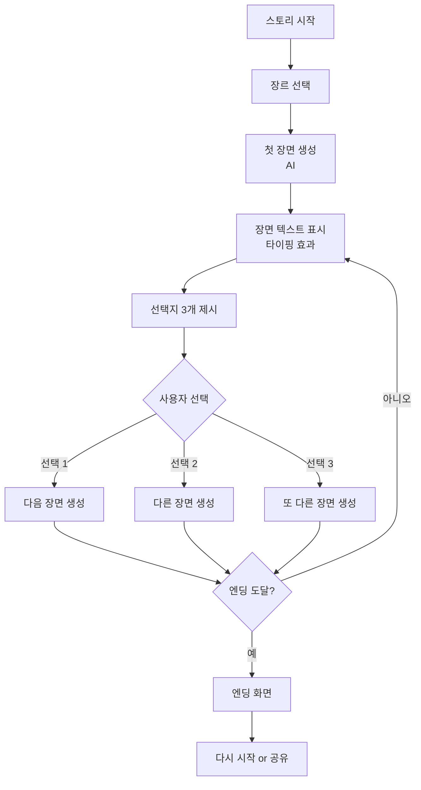

---

**💡 프로젝트 3 완성!**

학생 성과:
- ✅ 고급 API 활용 (ChatGPT + DALL-E)
- ✅ 복잡한 상태 관리 (분기 스토리)
- ✅ 창의적 콘텐츠 제작
- ✅ 사용자 경험 디자인

---

# 🎉 11학년 커리큘럼 전체 완성!

## 📊 8차시 총정리

| 차시 | 프로젝트 | 주제 | 핵심 학습 |
|------|---------|------|----------|
| 1 | AI 감정 친구 | 기획 | 캐릭터 설정, 프롬프트 |
| 2 | AI 감정 친구 | UI 제작 | v0, 화면 디자인 |
| 3 | AI 감정 친구 | API 연동 | ChatGPT API, 감정 분석 |
| 4 | AI 추리 게임 | 사건 생성 | 복잡한 데이터, AI 생성 |
| 5 | AI 추리 게임 | 게임 UI | 탭 UI, 타이머 |
| 6 | AI 추리 게임 | NPC 심문 | AI 대화, 게임 로직 |
| 7 | AI 스토리 월드 | 분기 스토리 | 스토리 생성, 분기 시스템 |
| 8 | AI 스토리 월드 | 완성 & 발표 | 이미지 생성, 공유 |

---

## 🎯 전체 학습 성과

### 기술 역량
- ✅ ChatGPT API 활용 능력
- ✅ v0로 빠른 UI 제작
- ✅ 복잡한 데이터 구조 설계
- ✅ 상태 관리 (React Hooks)
- ✅ API 연동 및 에러 처리

### AI 리터러시
- ✅ 시스템 프롬프트 설계
- ✅ AI 출력 품질 관리
- ✅ AI 한계 이해 및 대응
- ✅ 창의적 AI 활용

### 프로젝트 기획
- ✅ 사용자 중심 설계
- ✅ 기능 명세서 작성
- ✅ 데이터 플로우 설계
- ✅ 피드백 반영 개선

### 협업 & 발표
- ✅ 동료 피드백
- ✅ 프로젝트 시연
- ✅ 기술 문서화
- ✅ 문제 해결 능력

---

## 📚 교사용 체크리스트

### 수업 전 준비

- [ ] OpenAI API 키 발급 (학생 수만큼)
- [ ] v0.dev 계정 확인
- [ ] Next.js 프로젝트 템플릿 준비
- [ ] 워크시트 인쇄 (각 프로젝트별)
- [ ] 예시 프로젝트 완성본 (데모용)
- [ ] 백업 코드 파일 (GitHub)

### 차시별 준비물

**1-3차시 (AI 감정 친구)**:
- [ ] 감정 AI 사례 영상
- [ ] 캐릭터 설정 예시 3종
- [ ] API 키 및 환경변수 가이드
- [ ] 감정 분석 예시

**4-6차시 (AI 추리 게임)**:
- [ ] 추리 게임 데모
- [ ] 사건 예시 JSON 3개
- [ ] 게임 기획 워크시트
- [ ] NPC 대화 예시

**7-8차시 (AI 스토리 월드)**:
- [ ] 분기형 스토리 예시
- [ ] 스토리 장르 리스트
- [ ] DALL-E 사용 가이드 (선택)
- [ ] 발표 평가 기준표

### 평가 기준

| 항목 | 배점 | 평가 요소 |
|------|------|----------|
| 기획 | 20점 | 명확한 목표, 구체적 기능 명세 |
| 구현 | 40점 | 기능 작동, 코드 품질 |
| UI/UX | 20점 | 디자인, 사용성 |
| 창의성 | 10점 | 독창적 아이디어 |
| 발표 | 10점 | 명확한 설명, 시연 |
| **합계** | **100점** | |

---

## 🚀 확장 아이디어 (심화)

학생들이 더 도전하고 싶다면:

1. **AI 감정 친구 확장**
   - 음성 대화 (Web Speech API)
   - 감정 변화 그래프 (Chart.js)
   - 친구 초대 기능

2. **AI 추리 게임 확장**
   - 멀티플레이어 (협동 추리)
   - 시즌별 사건 팩
   - 리더보드 (점수 순위)

3. **AI 스토리 월드 확장**
   - AI 음성 낭독 (TTS)
   - 커뮤니티 스토리 공유
   - 스토리 리믹스 기능

---

## 📞 문의 및 지원

**기술 지원**:
- OpenAI API 오류: [OpenAI 문서](https://platform.openai.com/docs)
- Next.js 관련: [Next.js 문서](https://nextjs.org/docs)
- v0 사용법: [v0.dev](https://v0.dev)

**커리큘럼 문의**:
- 각 프로젝트별 상세 가이드는 별도 문서 참고
- 학생 수준에 따라 난이도 조절 가능
- 시간 부족 시 프로젝트 3 생략 가능

---

**🎊 수고하셨습니다!**

이 커리큘럼으로 학생들이:
- AI를 두려워하지 않고
- 창의적으로 활용하며
- 실제 작동하는 서비스를 만들어
- 자신감을 얻기를 바랍니다! 💪

---

**문서 끝**
