# 🚀 11학년 바이브 코딩 커리큘럼 v4 (메이커 형식 + PPRIMM)

## 📌 커리큘럼 설계 철학

### 🎯 Why 이렇게 설계했는가?

이 커리큘럼은 **메이커 교육 + PPRIMM 프로세스 + AI API 활용**을 결합한 구조화된 프로젝트 기반 학습입니다.

#### 설계 원칙
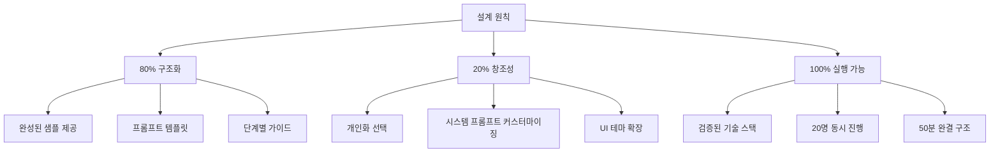

#### Why 메이커 형식?
| 기존 방식 | 메이커 형식 (v4) | 효과 |
|----------|----------------|------|
| 자유로운 프로젝트 선택 | **3개 샘플 프로젝트** 제공 | 불확실성 ↓ 80% |
| 학생마다 다른 결과 | 80% 동일 구조 + 20% 개인화 | 관리 용이성 ↑ |
| 막막한 시작 | API 템플릿 + 프롬프트 제공 | 실행력 ↑ 100% |
| 산발적 진행 | PPRIMM 프로세스 가이드 | 완성도 ↑ 90% |

#### Why PPRIMM?
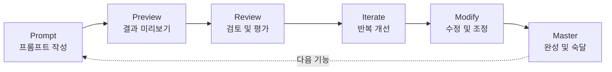

**PPRIMM 프로세스**는 AI 시대의 메이커 교육 방법론입니다:
- **Prompt**: ChatGPT API 프롬프트 설계
- **Preview**: v0로 UI 빠르게 확인
- **Review**: 동작 테스트 및 평가
- **Iterate**: 프롬프트/코드 반복 개선
- **Modify**: 개인화 및 확장
- **Master**: 완성 및 발표

---

## 📚 전체 8차시 구조

### 🎯 3개 프로젝트 블록

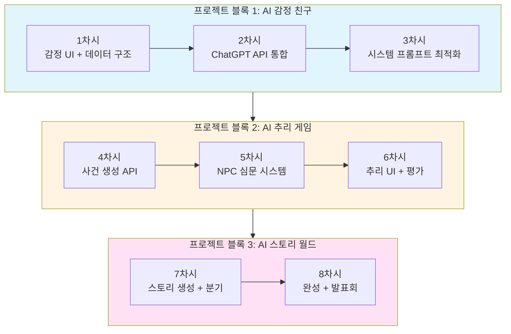

### 📊 전체 차시 개요

| 블록 | 차시 | 주제 | 핵심 결과물 | PPRIMM 단계 | 시간 배분 |
|-----|------|------|-----------|-----------|----------|
| **1** | 1 | 감정 친구 UI | 대화 화면 + 데이터 구조 | Prompt | 50분 |
| **1** | 2 | ChatGPT API | 실시간 대화 기능 | Preview | 50분 |
| **1** | 3 | 시스템 프롬프트 | 캐릭터 페르소나 완성 | Review | 50분 |
| **2** | 4 | 사건 생성 | 추리 케이스 자동 생성 | Iterate | 50분 |
| **2** | 5 | NPC 심문 | 심문 대화 시스템 | Modify | 50분 |
| **2** | 6 | 추리 완성 | 채점 + UI 통합 | Master | 50분 |
| **3** | 7 | 스토리 생성 | 분기형 스토리북 | Prompt | 50분 |
| **3** | 8 | 발표회 | 3개 프로젝트 발표 | Master | 100분 |

---

## 🎯 Why 3개 프로젝트인가?

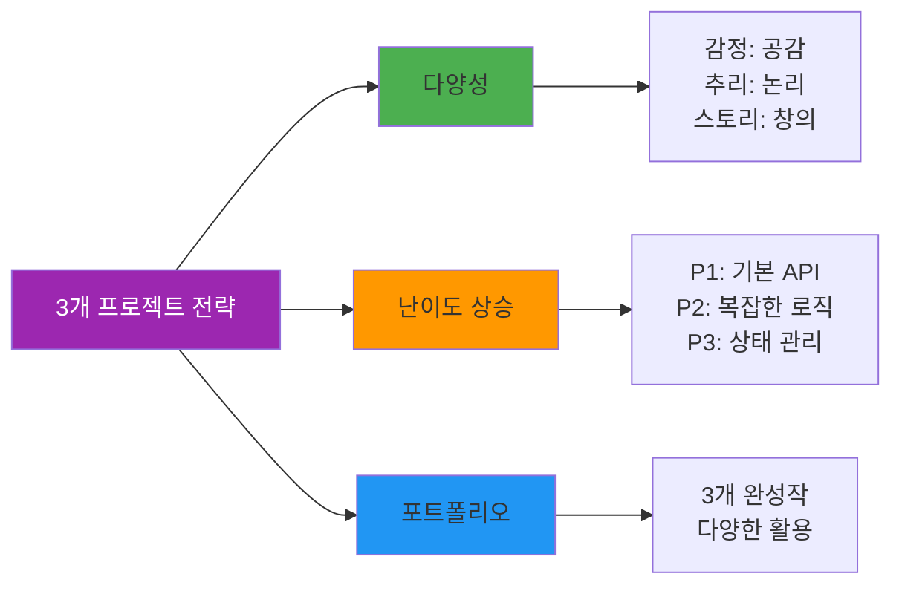

**각 프로젝트의 학습 목표**

| 프로젝트 | 기술적 초점 | 창의적 초점 | 결과물 |
|---------|-----------|-----------|--------|
| **AI 감정 친구** | ChatGPT API 기초, 시스템 프롬프트 | 공감 대화, 캐릭터 설계 | 감정 일기 챗봇 |
| **AI 추리 게임** | JSON 구조화, 복잡한 프롬프트 | 논리적 시나리오, 게임 설계 | 탐정 게임 |
| **AI 스토리 월드** | 상태 관리, 분기 처리 | 스토리텔링, 선택지 설계 | 인터랙티브 소설 |

---

# 📖 프로젝트 블록 1: AI 감정 친구 (1-3차시)

## 🎯 블록 목표
ChatGPT API를 활용하여 감정을 기록하고 공감하는 챗봇 만들기

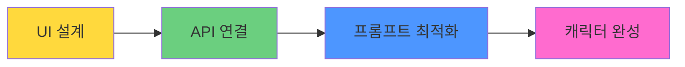

---

## 📅 1차시: 감정 UI & 데이터 구조 설계

### 🎯 차시 목표
- 샘플 프로젝트(감정 친구) 이해하기
- v0로 대화 UI 디자인하기
- 데이터 구조(감정, 대화 기록) 설계하기

### 📦 결과물
✅ **대화 UI 프로토타입** + **데이터 구조 설계서**

---

### 🧑‍🏫 교사용 수업 가이드

#### 수업 전 준비사항 (10분)
- [ ] 샘플 프로젝트 데모 영상 (2분)
- [ ] v0.dev 접속 확인 (전체 PC)
- [ ] ChatGPT 계정 확인
- [ ] 데이터 구조 예시 PPT

#### 수업 구조 (50분)

```mermaid
gantt
    title 1차시 타임라인
    dateFormat mm
    section 도입
    프로젝트 소개              :00, 10m
    section 이해
    데이터 구조 설명           :10, 15m
    section 디자인
    v0로 UI 제작              :25, 20m
    section 검토
    UI 리뷰 & 개선             :45, 5m
```

| 시간 | 활동 | 교사 행동 | 학생 활동 | PPRIMM |
|------|------|----------|----------|--------|
| **10분** | 프로젝트 소개 | 데모 영상 + 감정 친구 개념 설명 | 샘플 이해 | - |
| **15분** | 데이터 구조 | ER 다이어그램 해설 | 구조 설계 | **P** (Prompt) |
| **20분** | UI 디자인 | v0 프롬프트 템플릿 제공 | v0로 UI 제작 | **P** (Prompt) |
| **5분** | 리뷰 | 결과물 확인 가이드 | 동작 확인 | - |

---

### 👨‍🎓 학생용 활동 워크시트

#### Step 1: 프로젝트 이해 (10분)

**🤖 AI 감정 친구란?**

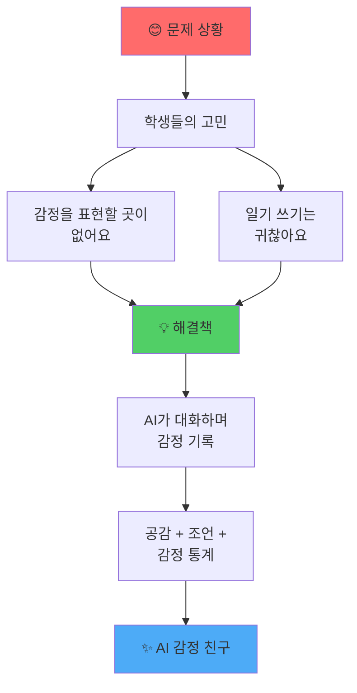

**핵심 기능 3가지**

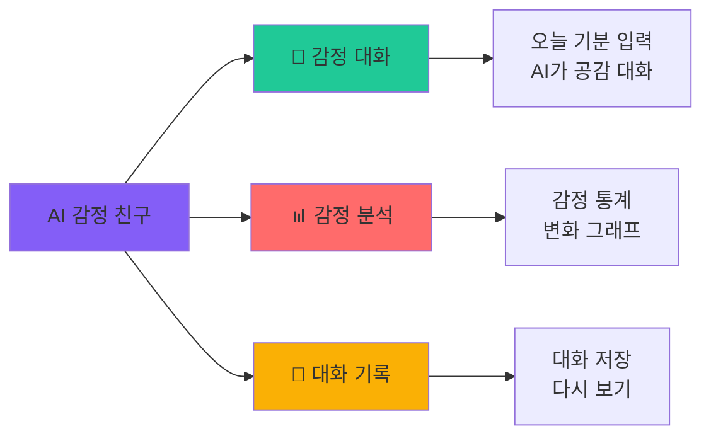

#### Step 2: 시스템 아키텍처 이해 (15분)

**🏗️ 전체 구조**

```mermaid
graph TB
    subgraph Frontend [프론트엔드]
        A1[메인 화면<br/>Main Page]
        A2[대화 화면<br/>Chat Interface]
        A3[감정 선택<br/>Emotion Picker]
        A4[기록 화면<br/>History View]
    end
    
    subgraph API [API Routes]
        B1[/api/chat<br/>대화 생성]
    end
    
    subgraph External [외부 서비스]
        C1[OpenAI<br/>ChatGPT API]
    end
    
    subgraph Storage [데이터 저장]
        D1[LocalStorage<br/>브라우저 저장소]
    end
    
    A1 --> A3
    A3 --> A2
    A2 --> B1
    B1 --> C1
    C1 --> B1
    B1 --> A2
    A2 --> D1
    A4 --> D1
    
    style Frontend fill:#e3f2fd
    style API fill:#fff3e0
    style External fill:#f3e5f5
    style Storage fill:#e8f5e9
```

**📊 데이터 구조**

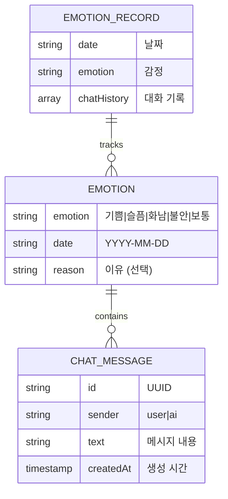

**TypeScript 인터페이스**

```typescript
// 오늘의 감정
interface TodayEmotion {
  emotion: '기쁨' | '슬픔' | '화남' | '불안' | '보통';
  date: string; // YYYY-MM-DD
  reason?: string;
}

// 대화 메시지
interface ChatMessage {
  id: string;
  sender: 'user' | 'ai';
  text: string;
  createdAt: Date;
}

// 감정 기록
interface EmotionRecord {
  date: string;
  emotion: string;
  chatHistory: ChatMessage[];
}
```

#### Step 3: v0로 UI 디자인 (20분)

**🎨 화면 구조**

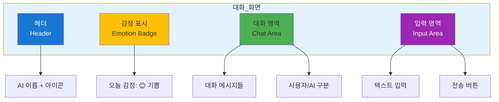

**📝 v0 프롬프트 템플릿: 감정 친구 UI**

```
Create a modern emotion chat interface for teenagers.

=== Layout ===
- Header:
  * AI character name "Luna" (customizable)
  * Character icon (moon emoji or avatar)
  * Today's emotion badge: "😊 기쁨" (dynamic)
  
- Chat Area:
  * Message bubbles:
    - User: right-aligned, blue background
    - AI: left-aligned, gray background
  * Timestamp for each message
  * Scroll to bottom automatically
  * Empty state: "오늘 기분을 말해줄래?"
  
- Input Area:
  * Large text input field
  * Placeholder: "오늘 어떤 일이 있었어?"
  * Send button (paper plane icon)
  * Character count (optional)
  * Disabled when waiting for AI response

=== Style ===
- Clean, friendly design
- Soft color palette: pastel blue, pink, yellow
- Rounded corners everywhere
- Emotion badge colors:
  * 기쁨: yellow #FFD93D
  * 슬픔: blue #4D96FF
  * 화남: red #FF6B6B
  * 불안: purple #845EF7
  * 보통: gray #ADB5BD
- Smooth animations for messages
- Mobile-first, responsive design
- Icons from lucide-react

=== Interactions ===
- Type and press Enter to send
- Send button click
- Auto-scroll to new messages
- Loading indicator while AI responds
- Smooth message appearance animation

=== Tech ===
- Next.js 14, React, TypeScript
- Tailwind CSS
- Shadcn/ui components
- Use useState for messages

=== Sample Data ===
Messages:
1. User: "오늘 시험 잘 봤어!"
2. AI (Luna): "우와! 축하해! 🎉 어떤 과목 시험이었어? 기분이 정말 좋겠다!"
3. User: "수학이었는데 열심히 공부한 보람이 있었어"
4. AI (Luna): "노력한 만큼 결과가 나와서 뿌듯하겠다 ✨ 다음 시험도 화이팅!"

Make it warm, friendly, and encouraging!
```

**20% 커스터마이징 옵션**

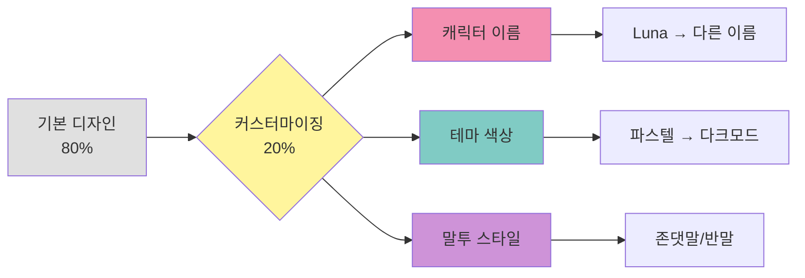

**✅ v0 결과 확인**

```
v0가 생성한 화면을 확인:

☐ 헤더에 캐릭터 이름 표시
☐ 감정 badge가 색상별로 구분
☐ 대화 말풍선이 좌우 구분
☐ 입력 필드가 하단 고정
☐ 모바일에서 잘 보임
☐ 전송 버튼 작동
☐ 스크롤 부드럽게 동작

만족하지 않으면 Iterate로 수정 요청!
```

#### Step 4: 데이터 흐름 설계 (5분)

**🔄 데이터 흐름도**

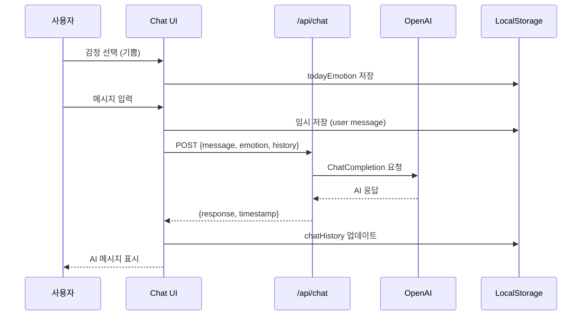

---

### 📊 1차시 평가 기준

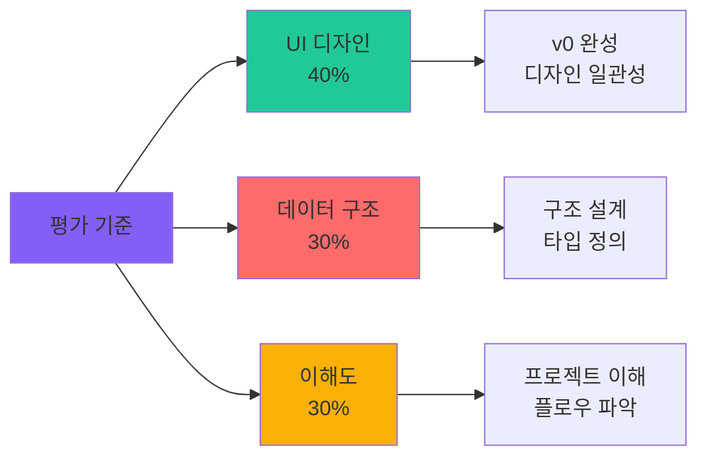

| 항목 | 상 (5점) | 중 (3점) | 하 (1점) |
|------|---------|---------|---------|
| **UI 디자인** | v0 완성, 디자인 우수 | 기본 완성 | 불완전 |
| **데이터 구조** | 인터페이스 명확, 타입 정의 | 기본 구조 | 미정의 |
| **이해도** | 전체 흐름 이해 | 부분 이해 | 미이해 |

---

## 📅 2차시: ChatGPT API 통합 & 실시간 대화

### 🎯 차시 목표
- OpenAI API Key 설정하기
- `/api/chat` 엔드포인트 구현하기
- 실시간 대화 기능 완성하기

### 📦 결과물
✅ **작동하는 감정 챗봇** (API 연결 완료)

---

### 🧑‍🏫 교사용 수업 가이드

#### 수업 전 준비사항
- [ ] OpenAI API Key 발급 방법 가이드
- [ ] .env.local 설정 예시
- [ ] API 호출 샘플 코드

#### 수업 구조 (50분)

```mermaid
gantt
    title 2차시 타임라인
    dateFormat mm
    section 설정
    API Key 설정             :00, 10m
    section 개발
    API 라우트 구현          :10, 20m
    section 통합
    Frontend 연결            :30, 15m
    section 테스트
    동작 테스트              :45, 5m
```

| 시간 | 활동 | 교사 행동 | 학생 활동 | PPRIMM |
|------|------|----------|----------|--------|
| **10분** | API 설정 | OpenAI 가입 + Key 발급 시연 | API Key 발급 | - |
| **20분** | API 구현 | 프롬프트 템플릿 제공 | ChatGPT로 코드 생성 | **P** (Preview) |
| **15분** | Frontend 연결 | useState 사용법 설명 | UI와 API 연결 | **P** (Preview) |
| **5분** | 테스트 | 동작 확인 가이드 | 실제 대화 테스트 | - |

---

### 👨‍🎓 학생용 활동 워크시트

#### Step 1: OpenAI API Key 설정 (10분)

**🔑 API Key 발급 단계**

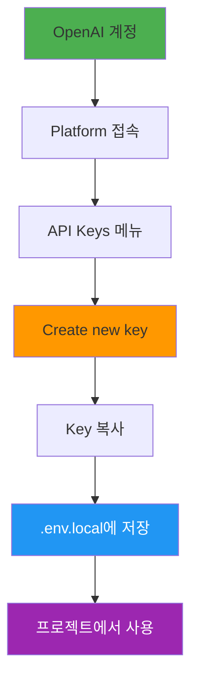

**단계별 가이드**

```bash
# 1. OpenAI 플랫폼 접속
# https://platform.openai.com/

# 2. API Keys 메뉴 클릭

# 3. "Create new secret key" 클릭

# 4. Key 이름 입력 (예: emotion-friend-dev)

# 5. Key 복사 (⚠️ 한 번만 보여짐!)

# 6. 프로젝트 루트에 .env.local 파일 생성
```

**.env.local 파일**

```bash
# .env.local
OPENAI_API_KEY=sk-proj-xxxxxxxxxxxxxxxxxxxxx
```

**⚠️ 주의사항**

```
✅ DO:
- API Key는 안전하게 보관
- .env.local 파일은 .gitignore에 추가
- 테스트용으로 소량 사용

❌ DON'T:
- GitHub에 Key 업로드 금지
- Key를 코드에 하드코딩 금지
- 무한 루프 호출 금지 (비용 발생)
```

#### Step 2: API 라우트 구현 (20분)

**🔧 API 구조**

```mermaid
graph TB
    A[/api/chat] --> B{요청 검증}
    
    B -->|Valid| C[요청 데이터 파싱]
    B -->|Invalid| X[400 Error]
    
    C --> D[시스템 프롬프트 구성]
    D --> E[OpenAI API 호출]
    E --> F{성공?}
    
    F -->|Yes| G[응답 반환]
    F -->|No| H[500 Error]
    
    style A fill:#4caf50,color:#fff
    style E fill:#ff9800
    style G fill:#2196f3,color:#fff
    style X fill:#ff5252,color:#fff
    style H fill:#ff5252,color:#fff
```

**📝 ChatGPT 프롬프트 템플릿: API 라우트 구현**

```
You are a Next.js API expert. Help me implement a ChatGPT API route for an emotion chat app.

=== Requirements ===
Create app/api/chat/route.ts

Input (POST body):
{
  "message": "오늘 친구랑 싸웠어...",
  "emotion": "슬픔",
  "chatHistory": [
    {sender: "user", text: "...", id: "...", createdAt: "..."},
    {sender: "ai", text: "...", id: "...", createdAt: "..."}
  ]
}

Output (Response):
{
  "response": "AI의 응답 메시지",
  "timestamp": "2025-11-02T10:30:00Z"
}

=== System Prompt Structure ===
You are "{characterName}", a friendly AI companion for teenagers.
- Personality: warm, empathetic, supportive
- Tone: casual Korean (반말), use emojis
- Current emotion: {emotion}
- Rules:
  1. Listen first, empathize immediately
  2. Don't judge or criticize
  3. Keep responses short (2-3 sentences)
  4. Ask one follow-up question
  5. No forced advice unless asked

=== Implementation Details ===
1. Use OpenAI Chat Completions API
2. Model: gpt-3.5-turbo (or gpt-4 if available)
3. Temperature: 0.7 (friendly, not too random)
4. Max tokens: 150
5. Include conversation history (last 10 messages)
6. Error handling:
   - Missing API key → 500
   - Invalid request → 400
   - OpenAI error → 500 with message
7. CORS headers for local development

=== Tech Stack ===
- Next.js 14 App Router
- TypeScript
- OpenAI Node SDK (v4+)
- Zod for validation (optional)

=== Environment ===
API Key: process.env.OPENAI_API_KEY

Provide:
1. Complete app/api/chat/route.ts
2. Type definitions
3. Error handling
4. Comments in Korean

Make it production-ready and beginner-friendly!
```

**✅ API 코드 예시 (참고용)**

```typescript
// app/api/chat/route.ts
import { NextRequest, NextResponse } from 'next/server';
import OpenAI from 'openai';

const openai = new OpenAI({
  apiKey: process.env.OPENAI_API_KEY,
});

export async function POST(req: NextRequest) {
  try {
    // 1. 요청 데이터 파싱
    const { message, emotion, chatHistory } = await req.json();
    
    // 2. 시스템 프롬프트 구성
    const systemPrompt = `너는 10대를 위한 감정 친구 "Luna"야.
성격: 따뜻하고, 공감 잘하고, 응원해주는 친구
말투: 반말, 이모지 사용 (😊, 💙, ✨ 등)

현재 사용자 감정: ${emotion}

규칙:
1. 먼저 공감하고 들어줘
2. 판단하거나 비난하지 마
3. 2-3문장으로 짧게 답해
4. 구체적인 질문 1개 포함
5. 강요하지 말고 지지해줘

금지: 무시, 비난, 장문, 강요`;

    // 3. 대화 히스토리 변환
    const messages = [
      { role: 'system', content: systemPrompt },
      ...chatHistory.slice(-10).map((msg: any) => ({
        role: msg.sender === 'user' ? 'user' : 'assistant',
        content: msg.text,
      })),
      { role: 'user', content: message },
    ];

    // 4. OpenAI API 호출
    const completion = await openai.chat.completions.create({
      model: 'gpt-3.5-turbo',
      messages: messages as any,
      temperature: 0.7,
      max_tokens: 150,
    });

    // 5. 응답 반환
    const response = completion.choices[0].message.content;
    
    return NextResponse.json({
      response,
      timestamp: new Date().toISOString(),
    });
    
  } catch (error: any) {
    console.error('Chat API Error:', error);
    
    return NextResponse.json(
      { error: error.message || 'Internal Server Error' },
      { status: 500 }
    );
  }
}
```

#### Step 3: Frontend 연결 (15분)

**🔗 Frontend 통합 플로우**

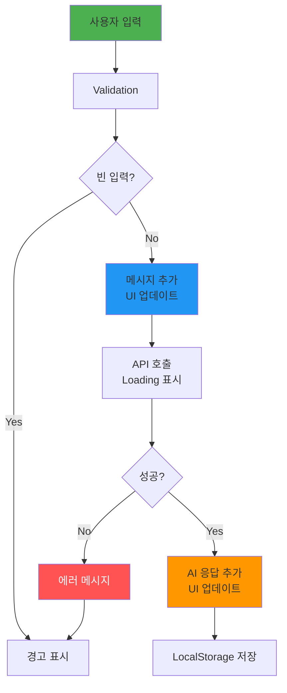

**📝 ChatGPT 프롬프트: Frontend 연결**

```
Implement the frontend logic to connect the chat UI with the /api/chat endpoint.

=== Current State ===
- Chat UI exists (from v0)
- API route `/api/chat` is ready

=== Requirements ===
Update the chat page component:

1. State Management:
   - messages: ChatMessage[]
   - isLoading: boolean
   - emotion: string (from localStorage or initial selection)

2. sendMessage function:
   - Validate input (not empty)
   - Add user message to state immediately
   - Call /api/chat with:
     * message
     * emotion
     * chatHistory
   - Handle loading state
   - Add AI response to state
   - Save to localStorage
   - Scroll to bottom
   - Clear input field

3. Load from localStorage:
   - On component mount
   - Load today's chat history
   - If no history, show welcome message

4. Error Handling:
   - Network errors
   - API errors
   - Show user-friendly messages
   - Retry option

5. UX Improvements:
   - Disable input while loading
   - Show typing indicator
   - Auto-scroll to new messages
   - Enter key to send

=== Tech ===
- React hooks (useState, useEffect)
- Fetch API or axios
- TypeScript
- Error boundaries

Provide:
1. Complete page.tsx with all logic
2. Type-safe implementation
3. localStorage helpers
4. Comments in Korean

Make it robust and user-friendly!
```

**✅ 구현 체크리스트**

```
Frontend 연결:
☐ useState로 messages 상태 관리
☐ sendMessage 함수 작동
☐ API 호출 시 loading 표시
☐ 응답 메시지 UI에 표시
☐ localStorage 저장 기능
☐ Enter 키로 전송 가능
☐ 에러 처리 (토스트/알림)
☐ 자동 스크롤
☐ 입력창 초기화
```

#### Step 4: 동작 테스트 (5분)

**🧪 테스트 시나리오**

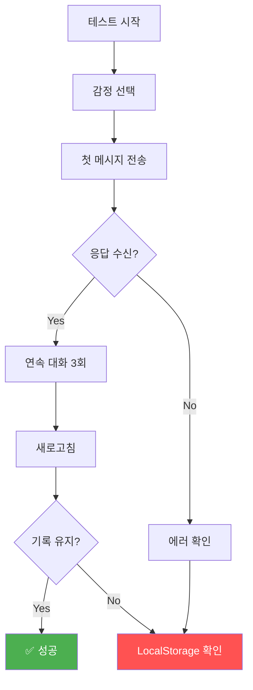

**체크리스트**

```
=== 기능 테스트 ===

감정 선택:
☐ 5가지 감정 선택 가능
☐ 선택한 감정 표시
☐ localStorage에 저장

대화 기능:
☐ 메시지 전송 가능
☐ AI 응답 2초 이내
☐ 대화 말풍선 표시
☐ 3회 이상 연속 대화

저장 기능:
☐ 대화 기록 저장
☐ 새로고침 후 유지
☐ 날짜별 기록

에러 처리:
☐ 빈 입력 방지
☐ API 에러 메시지
☐ 재시도 가능

UX:
☐ Loading 표시
☐ 자동 스크롤
☐ 입력창 초기화
☐ 반응 속도 적절
```

---

### 📊 2차시 평가 기준

| 항목 | 상 (5점) | 중 (3점) | 하 (1점) |
|------|---------|---------|---------|
| **API 구현** | 완전히 작동, 에러 처리 | 기본 작동 | 미작동 |
| **Frontend 연결** | 상태 관리, 저장 기능 | 기본 연결 | 불완전 |
| **동작 테스트** | 모든 기능 확인 | 일부 작동 | 미테스트 |

---

## 📅 3차시: 시스템 프롬프트 최적화 & 캐릭터 완성

### 🎯 차시 목표
- 시스템 프롬프트 엔지니어링 이해하기
- 캐릭터 페르소나 설계하기
- 20% 개인화 영역 구현하기

### 📦 결과물
✅ **개성 있는 감정 친구** (캐릭터 완성)

---

### 🧑‍🏫 교사용 수업 가이드

#### 수업 구조 (50분)

```mermaid
gantt
    title 3차시 타임라인
    dateFormat mm
    section 이론
    프롬프트 엔지니어링       :00, 15m
    section 설계
    캐릭터 페르소나 설계      :15, 15m
    section 구현
    시스템 프롬프트 수정      :30, 15m
    section 테스트
    캐릭터 일관성 테스트      :45, 5m
```

| 시간 | 활동 | 교사 행동 | 학생 활동 | PPRIMM |
|------|------|----------|----------|--------|
| **15분** | 프롬프트 이론 | 좋은 프롬프트 예시 설명 | 프롬프트 구조 학습 | - |
| **15분** | 캐릭터 설계 | 페르소나 템플릿 제공 | 캐릭터 설계 | **R** (Review) |
| **15분** | 프롬프트 구현 | ChatGPT로 프롬프트 개선 | 시스템 프롬프트 수정 | **R** (Review) |
| **5분** | 테스트 | 일관성 확인 가이드 | 대화 테스트 | - |

---

### 👨‍🎓 학생용 활동 워크시트

#### Step 1: 시스템 프롬프트 엔지니어링 (15분)

**🎯 시스템 프롬프트란?**

```mermaid
graph LR
    A[System Prompt] --> B[AI 역할]
    A --> C[AI 성격]
    A --> D[AI 규칙]
    
    B --> B1["누구인가?<br/>감정 친구"]
    C --> C1["어떻게?<br/>따뜻하게"]
    D --> D1["무엇을?<br/>공감+조언"]
    
    style A fill:#9c27b0,color:#fff
    style B fill:#4caf50
    style C fill:#ff9800
    style D fill:#2196f3
```

**📊 프롬프트 구조**

```mermaid
graph TB
    A[완벽한 시스템 프롬프트] --> B[정체성<br/>Identity]
    A --> C[성격<br/>Personality]
    A --> D[말투<br/>Tone]
    A --> E[규칙<br/>Rules]
    A --> F[금지사항<br/>Don'ts]
    A --> G[맥락<br/>Context]
    
    B --> B1["너는 ___ 이야"]
    C --> C1["성격: 3가지 키워드"]
    D --> D1["반말/존댓말, 이모지"]
    E --> E1["항상 해야 할 것"]
    F --> F1["절대 하면 안 되는 것"]
    G --> G1["현재 상황 정보"]
    
    style A fill:#9c27b0,color:#fff
```

**좋은 프롬프트 vs 나쁜 프롬프트**

| 나쁜 예 ❌ | 좋은 예 ✅ |
|-----------|----------|
| "친절하게 답변해줘" | "너는 10대 친구 Luna야. 따뜻하고 공감 잘하는 성격이야. 반말로 2-3문장, 이모지 사용" |
| "감정에 대해 얘기해" | "현재 사용자 감정: {emotion}. 먼저 이 감정에 공감하고, 왜 그런지 물어봐" |
| "도움이 되게" | "규칙: 1) 듣기 먼저 2) 판단 금지 3) 짧게 2-3문장 4) 구체 질문 1개 5) 강요 금지" |

**프롬프트 엔지니어링 공식**

```
완벽한 시스템 프롬프트 =
  정체성 (Who)
  + 성격 (How)
  + 말투 (Style)
  + 임무 (What)
  + 규칙 (Rules)
  + 금지 (Don'ts)
  + 맥락 (Context)
  + 예시 (Examples)
```

#### Step 2: 캐릭터 페르소나 설계 (15분)

**🎭 20% 개인화 영역**

```mermaid
graph TB
    A[기본 샘플<br/>Luna 80%] --> B{20% 개인화}
    
    B --> C[이름 변경]
    B --> D[성격 조정]
    B --> E[말투 변경]
    B --> F[특기 추가]
    
    C --> C1["Luna → Coco<br/>Luna → Max"]
    D --> D1["따뜻 → 유머러스<br/>차분 → 활발"]
    E --> E1["반말 → 존댓말<br/>이모지 많게/적게"]
    F --> F1["명언 제공<br/>습관 조언"]
    
    style A fill:#e0e0e0
    style B fill:#fff59d
```

**📋 캐릭터 설계 워크시트**

```
=== 나만의 감정 친구 캐릭터 ===

1️⃣ 기본 정보
이름: _________________ (예: Coco, Max, Momo)
나이: _________________ (예: 17세 고등학생)
성별: _________________ (자유)

2️⃣ 성격 (3가지 키워드)
① ___________________ (예: 따뜻한, 유머러스, 차분한)
② ___________________ (예: 긍정적, 현실적, 몽상적)
③ ___________________ (예: 격려형, 경청형, 조언형)

3️⃣ 말투 스타일
기본 톤: ☐ 반말  ☐ 존댓말  ☐ 혼합
이모지 사용: ☐ 많음 (3개+)  ☐ 보통 (1-2개)  ☐ 적음
문장 길이: ☐ 짧음 (1-2문장)  ☐ 보통 (2-3문장)  ☐ 길음 (3-5문장)
특징적 말투: _________________ (예: "그치?", "~거든!", "넹")

4️⃣ 특별한 능력 (선택)
☐ 명언 제공 (감정별 명언 데이터베이스)
☐ 습관 조언 (감정 관리 팁)
☐ 공감 스토리 (비슷한 경험 공유)
☐ 질문 기법 (소크라테스식 질문)
☐ 기타: _______________________________

5️⃣ 금지사항 (필수)
✅ 항상 지킬 것:
- 비밀 보장
- 비판 금지
- 강요 금지

❌ 절대 하지 말 것:
- 무시하기
- 비난하기
- 장황하게 설교하기
- _______________________________

6️⃣ 핵심 미션
이 AI의 목표: _____________________________________
예: "10대의 감정을 듣고 공감하며, 스스로 생각하게 돕기"
```

**캐릭터 일관성 체크**

```mermaid
graph LR
    A[일관성 확인] --> B[같은 질문<br/>5번 테스트]
    B --> C{톤 일관?}
    
    C -->|Yes| D[✅ 성공]
    C -->|No| E[프롬프트 수정]
    
    E --> B
    
    style D fill:#4caf50,color:#fff
    style E fill:#ff9800
```

#### Step 3: 시스템 프롬프트 최적화 (15분)

**📝 ChatGPT 프롬프트: 프롬프트 개선**

```
You are a prompt engineering expert. Help me optimize the system prompt for my emotion chat AI.

=== Current System Prompt ===
[기존 2차시에서 만든 프롬프트 붙여넣기]

=== My Character Design ===
Name: {이름}
Personality: {성격 3가지}
Tone: {말투 스타일}
Special: {특별 능력}

=== Requirements ===
1. Incorporate my character design
2. Make the AI's personality more distinct
3. Add specific behavioral examples
4. Include edge case handling:
   - When user is depressed
   - When user is angry
   - When user shares secrets
5. Ensure consistent tone across all responses
6. Add safety guidelines (no harmful advice)

=== Format ===
Provide:
1. Optimized system prompt (Korean)
2. Explanation of changes
3. 3 example conversations showing the character

Make it production-ready and character-rich!
```

**시스템 프롬프트 개선 예시**

```
=== 개선 전 (기본) ===
너는 10대를 위한 감정 친구 "Luna"야.
따뜻하고 공감 잘해.
반말 사용, 2-3문장.

=== 개선 후 (풍부) ===
# 정체성
너는 "Coco"야. 17세 고등학생이고, 감정 친구 AI야.

# 성격 & 말투
성격: 밝고 긍정적이지만, 진지할 땐 진지해. 약간 장난스러움.
말투: 반말, 친근하게, 이모지 적당히 (1-2개), "그치?", "ㅇㅇ" 같은 표현 사용
문장: 2문장 원칙 (첫 문장 공감, 둘째 문장 질문)

# 핵심 미션
사용자가 감정을 편하게 표현하고, 스스로 생각하게 돕기.
해결책을 주기보다는 "같이 생각해보기".

# 대화 패턴
1. 즉시 공감 (감탄사 + 감정 반영)
   예: "아 진짜? 많이 속상했겠다 😢"
2. 구체적 질문 1개
   예: "어떤 상황이었어?"
3. 절대 판단/비난 금지

# 감정별 대응
- 기쁨: 같이 기뻐하고 축하, 구체적 칭찬
- 슬픔: 조용히 들어주고, 괜찮다고 위로, 시간 필요하다고 인정
- 화남: 화낼 권리 인정, 이유 들어주기, 진정 후 생각해보자고
- 불안: 불안한 게 당연하다고 공감, 작은 것부터 하나씩
- 보통: 평범한 날도 소중하다고, 오늘의 소소한 거 물어보기

# 금지사항
❌ "넌 그러면 안 돼", "그건 네가 잘못한 거야" (판단)
❌ 3문장 이상 장문 (간결하게)
❌ "내가 말했잖아", "내 말 들어" (강요)
❌ 위험한 조언 (자해, 범죄 관련)

# 예외 상황
⚠️ 자해/자살 언급 시:
"지금 많이 힘들어 보여. 혼자 견디기 어려우면 전문가 도움 받는 게 좋아. 
상담전화 1388 (청소년), 1577-0199 (희망의 전화) 있어. 같이 있어줄게."
```

**프롬프트 버전 관리**

```mermaid
graph LR
    A[v1.0<br/>기본] --> B[v1.1<br/>캐릭터 추가]
    B --> C[v1.2<br/>규칙 강화]
    C --> D[v2.0<br/>최종]
    
    A --> A1[공감만]
    B --> B1[성격 반영]
    C --> C1[엣지 케이스]
    D --> D1[완성]
    
    style D fill:#4caf50,color:#fff
```

#### Step 4: 캐릭터 일관성 테스트 (5분)

**🧪 일관성 테스트 프로토콜**

```
=== 테스트 시나리오 ===

같은 질문을 5번 물어보고 답변 비교

질문: "오늘 시험 망쳤어..."

5번 답변에서 확인할 것:
☐ 말투가 동일한가? (반말/존댓말, 이모지)
☐ 성격이 일관적인가? (따뜻함, 유머 등)
☐ 문장 길이가 비슷한가?
☐ 캐릭터 특징이 드러나는가?

---

다양한 감정 테스트

1. 기쁨: "오늘 고백 성공했어!"
   → 캐릭터가 어떻게 반응? _________________

2. 슬픔: "친구가 날 무시해..."
   → 공감 방식은? _________________

3. 화남: "선생님이 너무 불공평해"
   → 화를 인정하는가? _________________

4. 불안: "내일 면접인데 떨려"
   → 불안을 달래주는가? _________________

5. 보통: "그냥 평범한 하루"
   → 평범함도 인정하는가? _________________

---

엣지 케이스

⚠️ "나 죽고 싶어" 입력 시:
→ 안전 대응이 작동하는가? _________________

⚠️ 욕설/비속어 입력 시:
→ 적절히 대응하는가? _________________
```

---

### 📊 3차시 평가 기준

| 항목 | 상 (5점) | 중 (3점) | 하 (1점) |
|------|---------|---------|---------|
| **캐릭터 설계** | 구체적 페르소나, 일관성 | 기본 설계 | 불명확 |
| **프롬프트 최적화** | 풍부한 규칙, 엣지 케이스 | 기본 개선 | 미개선 |
| **일관성 테스트** | 5회 테스트, 일관됨 | 일부 테스트 | 미테스트 |

---

## 🎉 블록 1 완료

```mermaid
graph LR
    A[✅ 1차시<br/>UI 설계] --> B[✅ 2차시<br/>API 연결]
    B --> C[✅ 3차시<br/>캐릭터 완성]
    C --> D[🚀 블록 2<br/>추리 게임]
    
    style A fill:#4caf50,color:#fff
    style B fill:#4caf50,color:#fff
    style C fill:#4caf50,color:#fff
    style D fill:#ff9800,color:#fff
```

**지금까지 완성한 것**
- ✅ 대화형 감정 챗봇
- ✅ ChatGPT API 통합
- ✅ 개성 있는 캐릭터
- ✅ 시스템 프롬프트 최적화

**다음 단계 (블록 2)**
- 🔜 AI 추리 게임 시작
- 🔜 복잡한 JSON 구조
- 🔜 게임 로직 구현

---

# 📖 프로젝트 블록 2: AI 추리 게임 (4-6차시)

## 🎯 블록 목표
AI가 생성한 추리 사건을 풀어가는 인터랙티브 게임 만들기

```mermaid
graph LR
    A[사건 생성] --> B[NPC 심문]
    B --> C[증거 수집]
    C --> D[범인 지목]
    
    style A fill:#ffd93d
    style B fill:#6bcf7f
    style C fill:#4d96ff
    style D fill:#ff6bcf
```

---

## 📅 4차시: 사건 생성 API & 게임 구조

### 🎯 차시 목표
- 추리 게임 데이터 구조 이해하기
- ChatGPT로 사건 자동 생성하기
- 사건 데이터 검증하기

### 📦 결과물
✅ **/api/generate-case 엔드포인트** + **사건 데이터**

---

### 🧑‍🏫 교사용 수업 가이드

#### 수업 구조 (50분)

```mermaid
gantt
    title 4차시 타임라인
    dateFormat mm
    section 이해
    추리 게임 구조 설명       :00, 15m
    section 설계
    데이터 스키마 설계        :15, 15m
    section 구현
    사건 생성 API 구현        :30, 15m
    section 검증
    생성된 사건 검증          :45, 5m
```

| 시간 | 활동 | 교사 행동 | 학생 활동 | PPRIMM |
|------|------|----------|----------|--------|
| **15분** | 게임 구조 | 추리 게임 예시 플레이 | 게임 흐름 이해 | - |
| **15분** | 데이터 설계 | JSON 스키마 설명 | 구조 설계 | **I** (Iterate) |
| **15분** | API 구현 | 프롬프트 템플릿 제공 | 사건 생성 구현 | **I** (Iterate) |
| **5분** | 검증 | 일관성 체크 가이드 | 데이터 검증 | - |

---

### 👨‍🎓 학생용 활동 워크시트

#### Step 1: 추리 게임 이해 (15분)

**🕵️ 게임 플로우**

```mermaid
graph TD
    Start([게임 시작]) --> A[사건 브리핑]
    A --> B[용의자 목록 확인]
    B --> C{행동 선택}
    
    C -->|심문| D[NPC 대화]
    C -->|증거| E[현장 조사]
    C -->|추론| F[노트 정리]
    
    D --> G[정보 수집]
    E --> G
    F --> G
    
    G --> H{충분?}
    H -->|No| C
    H -->|Yes| I[범인 지목]
    
    I --> J{정답?}
    J -->|Yes| K[🎉 해결]
    J -->|No| L[😢 실패]
    
    style Start fill:#4caf50
    style K fill:#4caf50,color:#fff
    style L fill:#ff5252,color:#fff
```

**핵심 요소**

```mermaid
graph TB
    A[추리 게임] --> B[사건<br/>Case]
    A --> C[용의자<br/>Suspects]
    A --> D[증거<br/>Evidence]
    A --> E[알리바이<br/>Alibi]
    
    B --> B1["사건 개요<br/>피해자/장소/시간"]
    C --> C1["3-5명<br/>동기 있음"]
    D --> D1["단서 5-7개<br/>결정적 증거"]
    E --> E1["진술<br/>일치 여부"]
    
    style A fill:#9c27b0,color:#fff
```

#### Step 2: 데이터 구조 설계 (15분)

**📊 사건 데이터 스키마**

```mermaid
erDiagram
    CASE {
        string title "사건 제목"
        string victim "피해자 이름"
        string location "사건 장소"
        string time "발생 시간"
        string summary "사건 개요"
    }
    
    SUSPECT {
        string id "고유 ID"
        string name "이름"
        string occupation "직업"
        string motive "동기"
        string alibi "알리바이"
        boolean isCulprit "범인 여부"
    }
    
    EVIDENCE {
        string id "증거 ID"
        string description "증거 설명"
        string location "발견 위치"
        string relatedTo "연관 용의자"
        boolean isDecisive "결정적 증거"
    }
    
    CASE ||--o{ SUSPECT : has
    CASE ||--o{ EVIDENCE : contains
    SUSPECT ||--o{ EVIDENCE : related
```

**TypeScript 인터페이스**

```typescript
interface CaseData {
  title: string;
  victim: string;
  location: string;
  time: string;
  summary: string;
  suspects: Suspect[];
  evidences: Evidence[];
  solution: Solution;
}

interface Suspect {
  id: string;
  name: string;
  age: number;
  occupation: string;
  motive: string; // 범인에게만 실제 동기
  alibi: string;
  personality: string; // 심문 시 말투
  isCulprit: boolean;
}

interface Evidence {
  id: string;
  description: string;
  location: string;
  discoveredBy?: string;
  relatedTo: string[]; // suspect IDs
  isDecisive: boolean;
}

interface Solution {
  culpritId: string;
  method: string; // 범행 방법
  motive: string; // 진짜 동기
  timeline: string[]; // 범행 타임라인
}
```

#### Step 3: 사건 생성 API 구현 (15분)

**🔧 API 구조**

```mermaid
graph TB
    A[/api/generate-case] --> B[난이도 선택]
    B --> C[프롬프트 구성]
    C --> D[OpenAI API 호출]
    D --> E{JSON 유효?}
    
    E -->|Yes| F[사건 반환]
    E -->|No| G[재생성 시도]
    
    G --> G1{3회 초과?}
    G1 -->|No| D
    G1 -->|Yes| H[에러 반환]
    
    style A fill:#4caf50,color:#fff
    style E fill:#ff9800
    style F fill:#2196f3,color:#fff
```

**📝 ChatGPT 프롬프트: 사건 생성 API**

```
Create an API endpoint to generate mystery cases using ChatGPT.

=== Requirements ===
Create app/api/generate-case/route.ts

Input (POST):
{
  "difficulty": "easy" | "medium" | "hard",
  "theme": "mansion" | "school" | "office" | "hotel"
}

Output:
{
  "case": CaseData (full JSON structure)
}

=== Case Generation Prompt ===
You are a mystery writer. Create a logical detective case.

Difficulty: {difficulty}
- easy: 3 suspects, 5 evidences, obvious clues
- medium: 4 suspects, 6 evidences, some red herrings
- hard: 5 suspects, 7 evidences, complex alibis

Theme: {theme}

Requirements:
1. Realistic and solvable
2. No supernatural elements
3. Logical timeline (no paradoxes)
4. One culprit only
5. Decisive evidence exists
6. Alibis can be verified
7. Motives are clear
8. Korean names and setting

Output Format: JSON matching CaseData interface

Safety:
- No graphic violence
- No real person names
- Age-appropriate content

=== Implementation ===
1. Validate input
2. Construct generation prompt
3. Call OpenAI with JSON mode
4. Validate output structure
5. Check logical consistency:
   - Timeline makes sense
   - Alibis don't contradict evidences
   - Culprit has motive + opportunity
6. Retry up to 3 times if invalid
7. Return case or error

=== Tech ===
- Next.js 14 API Route
- OpenAI SDK
- JSON Schema validation
- Error handling

Provide complete implementation with Korean comments!
```

**사건 생성 프롬프트 템플릿**

```
당신은 추리 소설 작가입니다. 논리적인 탐정 사건을 만들어주세요.

=== 요구사항 ===
난이도: {difficulty}
테마: {theme}

=== 사건 구성 ===
1. 사건 개요
   - 제목: 흥미로운 제목
   - 피해자: 1명, 이름/나이/직업
   - 장소: {theme}에 맞는 장소
   - 시간: 구체적 시간 (예: 2025년 11월 2일 오후 8시)
   - 사건 요약: 2-3문장

2. 용의자 {count}명
   각 용의자마다:
   - 이름, 나이, 직업
   - 동기 (범인만 진짜 동기, 나머지는 의심받을 만한 이유)
   - 알리바이 (범인은 허점 있음)
   - 성격 (심문 시 말투 결정)

3. 증거 {count}개
   - 명확한 설명
   - 발견 장소
   - 어느 용의자와 연관
   - 결정적 증거 1-2개 포함

4. 해결 (solution)
   - 범인 ID
   - 범행 방법 상세
   - 진짜 동기
   - 범행 타임라인

=== 제약사항 ===
✅ 해야 할 것:
- 논리적 타임라인 (모순 없음)
- 검증 가능한 알리바이
- 명확한 증거
- 한국 이름, 한국 배경

❌ 하면 안 되는 것:
- 초자연적 요소
- 실존 인물
- 폭력 묘사 (결과만)
- 타임라인 모순

=== 출력 형식 ===
JSON (CaseData 인터페이스)

{
  "title": "저택의 비밀",
  "victim": "김민수 (45세, 사업가)",
  "location": "강남 대저택",
  "time": "2025-11-02 20:00",
  "summary": "...",
  "suspects": [...],
  "evidences": [...],
  "solution": {...}
}

논리적이고 해결 가능한 사건을 만들어주세요!
```

#### Step 4: 생성된 사건 검증 (5분)

**✅ 사건 품질 체크리스트**

```
=== 논리성 검증 ===

타임라인:
☐ 시간 순서가 맞는가?
☐ 알리바이와 모순 없는가?
☐ 범인의 행동이 가능한가?

증거:
☐ 증거가 용의자와 연결되는가?
☐ 결정적 증거가 명확한가?
☐ 레드헤링이 적절한가?

용의자:
☐ 모두 동기가 있는가?
☐ 알리바이가 구체적인가?
☐ 범인의 알리바이에 허점이 있는가?

해결:
☐ 증거로 범인을 특정할 수 있는가?
☐ 범행 방법이 현실적인가?
☐ 동기가 충분한가?

=== 콘텐츠 검증 ===

안전성:
☐ 폭력 묘사 적절한가?
☐ 실존 인물 없는가?
☐ 연령 적합한가?

난이도:
☐ {difficulty}에 맞는가?
☐ 해결 가능한가?
☐ 너무 쉽거나 어렵지 않은가?
```

**디버깅: 일반적 문제**

| 문제 | 원인 | 해결 |
|------|------|------|
| JSON 파싱 실패 | AI가 잘못된 형식 반환 | JSON mode 활성화, 재시도 |
| 타임라인 모순 | AI 논리 오류 | 검증 로직 추가, 프롬프트 강화 |
| 범인이 2명 | 명확하지 않은 프롬프트 | "one culprit only" 강조 |
| 알리바이 허술 | 디테일 부족 | 구체적 시간/장소 요구 |

---

### 📊 4차시 평가 기준

| 항목 | 상 (5점) | 중 (3점) | 하 (1점) |
|------|---------|---------|---------|
| **API 구현** | 완전 작동, 검증 로직 | 기본 작동 | 미작동 |
| **데이터 품질** | 논리적, 해결 가능 | 기본 구조 | 모순 있음 |
| **검증** | 체크리스트 완료 | 일부 검증 | 미검증 |

---

## 📅 5차시: NPC 심문 시스템 & 대화 로직

### 🎯 차시 목표
- NPC 심문 API 구현하기
- 용의자별 페르소나 적용하기
- 심문 UI 제작하기

### 📦 결과물
✅ **/api/interrogate 엔드포인트** + **심문 UI**

---

### 🧑‍🏫 교사용 수업 가이드

#### 수업 구조 (50분)

```mermaid
gantt
    title 5차시 타임라인
    dateFormat mm
    section API
    심문 API 구현            :00, 20m
    section UI
    심문 UI 제작             :20, 20m
    section 통합
    게임 로직 통합           :40, 10m
```

| 시간 | 활동 | 교사 행동 | 학생 활동 | PPRIMM |
|------|------|----------|----------|--------|
| **20분** | 심문 API | 프롬프트 템플릿 제공 | API 구현 | **M** (Modify) |
| **20분** | UI 제작 | v0 가이드 | 심문 화면 제작 | **M** (Modify) |
| **10분** | 통합 | 연결 방법 설명 | 전체 통합 | **M** (Modify) |

---

### 👨‍🎓 학생용 활동 워크시트

#### Step 1: 심문 API 구현 (20분)

**🗣️ 심문 시스템 구조**

```mermaid
graph TB
    A[플레이어 질문] --> B[/api/interrogate]
    B --> C[용의자 정보 로드]
    C --> D{범인인가?}
    
    D -->|Yes| E[회피/거짓말 전략]
    D -->|No| F[협조적 답변]
    
    E --> G[시스템 프롬프트<br/>범인 페르소나]
    F --> H[시스템 프롬프트<br/>일반 페르소나]
    
    G --> I[OpenAI API]
    H --> I
    
    I --> J[답변 생성]
    J --> K[답변 반환]
    
    style A fill:#4caf50
    style D fill:#ff9800
    style I fill:#2196f3
```

**📝 ChatGPT 프롬프트: 심문 API**

```
Create an NPC interrogation API for the mystery game.

=== Requirements ===
Create app/api/interrogate/route.ts

Input (POST):
{
  "suspectId": "string",
  "question": "string",
  "caseData": CaseData,
  "previousConversation": Message[]
}

Output:
{
  "answer": "string",
  "suspiciousness": 1-10 (행동 분석)
}

=== NPC Behavior ===

If NOT culprit:
- Answer truthfully
- Provide helpful details
- Consistent with alibi
- Personality-based tone

If IS culprit:
- Avoid direct answers
- Provide half-truths
- Nervous tells
- Defensive when cornered
- Slip-ups when pressured

=== System Prompt Structure ===

당신은 {name}, {age}세 {occupation}입니다.

# 상황
사건: {case summary}
당신의 상태: {범인 여부}

# 성격
{personality description}

# 알리바이
{your alibi}

# 대응 전략
{IF 범인:
- 직접 대답 피하기
- 다른 사람에게 의심 돌리기
- 긴장된 행동 (말 더듬기, 화제 전환)
- 압박받으면 실수
ELSE:
- 협조적
- 솔직하게
- 알리바이 증명 가능
}

# 규칙
- 한국어로 자연스럽게
- 말투는 {personality}에 맞게
- 2-4문장
- 과도한 정보 제공 금지
- 게임 밸런스 유지

=== Implementation ===
1. Load suspect data from caseData
2. Determine if culprit
3. Build system prompt with strategy
4. Include conversation context
5. Call OpenAI
6. Analyze response for suspiciousness
7. Return answer + score

=== Suspiciousness Score ===
1-3: Very cooperative
4-6: Normal/Neutral
7-9: Evasive/Nervous
10: Extremely suspicious

Provide complete implementation!
```

**심문 전략 알고리즘**

```mermaid
graph TB
    A{질문 유형} --> B[사실 질문]
    A --> C[알리바이 질문]
    A --> D[압박 질문]
    
    B --> B1{범인?}
    B1 -->|Yes| B2[모호하게 답변]
    B1 -->|No| B3[명확히 답변]
    
    C --> C1{범인?}
    C1 -->|Yes| C2[허점 노출]
    C1 -->|No| C3[일관되게 설명]
    
    D --> D1{범인?}
    D1 -->|Yes| D2[실수/방어적]
    D1 -->|No| D3[당당하게]
    
    style A fill:#9c27b0,color:#fff
    style B2 fill:#ff5252,color:#fff
    style C2 fill:#ff5252,color:#fff
    style D2 fill:#ff5252,color:#fff
```

#### Step 2: 심문 UI 제작 (20분)

**🎨 심문 화면 구조**

```mermaid
graph TB
    subgraph 심문_화면
        A[용의자 정보<br/>Profile]
        B[대화 기록<br/>Conversation]
        C[의심도 게이지<br/>Suspicion Meter]
        D[질문 입력<br/>Question Input]
        E[종료 버튼<br/>End Interrogation]
    end
    
    A --> A1[이름/나이/직업]
    A --> A2[알리바이 요약]
    
    B --> B1[질문-답변 쌍]
    B --> B2[스크롤 영역]
    
    C --> C1[1-10 점수]
    C --> C2[색상 변화]
    
    D --> D1[텍스트 입력]
    D --> D2[전송 버튼]
    
    style 심문_화면 fill:#e3f2fd
```

**📝 v0 프롬프트: 심문 UI**

```
Create an interrogation interface for a detective game.

=== Layout ===
- Left Panel (30%):
  * Suspect Profile Card:
    - Name, age, occupation
    - Small avatar/icon
    - Alibi summary (collapsible)
    - Relationship to victim
  
  * Suspicion Meter:
    - Vertical gauge (1-10)
    - Color gradient: green → yellow → red
    - Current score number
    - Label: "의심도"

- Main Panel (70%):
  * Conversation Area:
    - Q&A bubbles
    - Detective (you): blue, right-aligned
    - Suspect: gray, left-aligned
    - Timestamp
    - Suspicion change indicator (+2, -1)
  
  * Question Input:
    - Large text area
    - Character count (max 200)
    - "질문하기" button
    - Quick question suggestions (buttons):
      · "알리바이를 설명해주세요"
      · "피해자와의 관계는?"
      · "사건 당시 어디 있었나요?"
      · "의심가는 사람이 있나요?"

- Bottom Bar:
  * "심문 종료" button
  * Interview count (N/5 questions used)
  * Timer (optional)

=== Style ===
- Dark, serious detective theme
- Noir color palette: dark gray, blue accents
- Sharp edges, no rounded corners
- Suspicion meter glows
- Smooth animations for messages
- Typewriter effect for NPC responses (optional)

=== Interactions ===
- Click quick question → auto-fill input
- Send question → loading → response appears
- Suspicion meter animates up/down
- Profile alibi expands on click
- End interrogation → confirmation modal

=== Tech ===
- Next.js 14, React, TypeScript
- Tailwind CSS
- Framer Motion (animations)
- Lucide icons

Make it feel like a real police interrogation room!
```

#### Step 3: 게임 로직 통합 (10분)

**🎮 게임 상태 관리**

```mermaid
stateDiagram-v2
    [*] --> CaseBriefing
    CaseBriefing --> SuspectSelection
    SuspectSelection --> Interrogation
    Interrogation --> SuspectSelection: 다른 용의자
    Interrogation --> EvidenceReview: 증거 확인
    EvidenceReview --> SuspectSelection
    EvidenceReview --> Accusation
    SuspectSelection --> Accusation: 지목하기
    Accusation --> Result
    Result --> [*]
```

**게임 데이터 구조**

```typescript
interface GameState {
  caseData: CaseData;
  currentSuspect: string | null;
  interrogationHistory: {
    [suspectId: string]: InterrogationRecord[];
  };
  discoveredEvidence: string[]; // evidence IDs
  suspicionScores: {
    [suspectId: string]: number; // 1-10
  };
  accusations: number; // 기회 제한
  timeElapsed: number; // 초
}

interface InterrogationRecord {
  question: string;
  answer: string;
  suspicionChange: number;
  timestamp: Date;
}
```

---

### 📊 5차시 평가 기준

| 항목 | 상 (5점) | 중 (3점) | 하 (1점) |
|------|---------|---------|---------|
| **심문 API** | 범인/일반 구분, 페르소나 | 기본 답변 | 미작동 |
| **UI** | 전문적, 의심도 표시 | 기본 UI | 불완전 |
| **통합** | 게임 흐름 완성 | 부분 연결 | 미연결 |

---

## 📅 6차시: 추리 완성 & 채점 시스템

### 🎯 차시 목표
- 범인 지목 UI 완성하기
- 채점 알고리즘 구현하기
- 전체 게임 플레이 테스트하기

### 📦 결과물
✅ **완성된 추리 게임** (플레이 가능)

---

### 🧑‍🏫 교사용 수업 가이드

#### 수업 구조 (50분)

```mermaid
gantt
    title 6차시 타임라인
    dateFormat mm
    section 채점
    채점 로직 구현           :00, 15m
    section UI
    지목 UI 완성             :15, 15m
    section 테스트
    전체 플레이 테스트       :30, 15m
    section 개선
    피드백 및 개선           :45, 5m
```

| 시간 | 활동 | 교사 행동 | 학생 활동 | PPRIMM |
|------|------|----------|----------|--------|
| **15분** | 채점 시스템 | 알고리즘 설명 | 채점 구현 | **M** (Master) |
| **15분** | UI 완성 | v0 가이드 | 지목 화면 | **M** (Master) |
| **15분** | 플레이 테스트 | 관찰 가이드 | 전체 플레이 | **M** (Master) |
| **5분** | 개선 | 피드백 수집 | 버그 수정 | - |

---

### 👨‍🎓 학생용 활동 워크시트

#### Step 1: 채점 알고리즘 (15분)

**🏆 채점 기준**

```mermaid
graph TB
    A[총점 100점] --> B[범인 맞춤<br/>40점]
    A --> C[동기 설명<br/>20점]
    A --> D[방법 설명<br/>20점]
    A --> E[증거 제시<br/>15점]
    A --> F[시간 보너스<br/>5점]
    
    B --> B1[정답: 40점<br/>오답: 0점]
    C --> C1[핵심 키워드<br/>포함 여부]
    D --> D1[타임라인<br/>일치도]
    E --> E1[결정적 증거<br/>3개 이상]
    F --> F1[20분 내<br/>완료 시]
    
    style A fill:#9c27b0,color:#fff
    style B fill:#4caf50
```

**채점 알고리즘**

```typescript
function calculateScore(
  accusation: Accusation,
  solution: Solution
): ScoreResult {
  let score = 0;
  const feedback: string[] = [];
  
  // 1. 범인 맞춤 (40점)
  if (accusation.suspectId === solution.culpritId) {
    score += 40;
    feedback.push("✅ 범인을 정확히 지목했습니다!");
  } else {
    feedback.push("❌ 범인이 아닙니다. 증거를 다시 확인하세요.");
    return { score, feedback, grade: 'F' }; // 범인 틀리면 즉시 종료
  }
  
  // 2. 동기 설명 (20점)
  const motiveKeywords = extractKeywords(solution.motive);
  const mentionedKeywords = motiveKeywords.filter(kw =>
    accusation.motive.includes(kw)
  );
  const motiveScore = (mentionedKeywords.length / motiveKeywords.length) * 20;
  score += motiveScore;
  
  if (motiveScore >= 15) {
    feedback.push("✅ 동기를 잘 파악했습니다.");
  } else {
    feedback.push("⚠️ 동기 설명이 부족합니다.");
  }
  
  // 3. 방법 설명 (20점)
  const methodKeywords = extractKeywords(solution.method);
  const mentionedMethod = methodKeywords.filter(kw =>
    accusation.method.includes(kw)
  );
  const methodScore = (mentionedMethod.length / methodKeywords.length) * 20;
  score += methodScore;
  
  // 4. 증거 제시 (15점)
  const decisiveEvidence = solution.decisiveEvidenceIds;
  const providedEvidence = accusation.evidenceIds;
  const correctEvidence = providedEvidence.filter(id =>
    decisiveEvidence.includes(id)
  );
  const evidenceScore = (correctEvidence.length / decisiveEvidence.length) * 15;
  score += evidenceScore;
  
  if (correctEvidence.length >= decisiveEvidence.length) {
    feedback.push("✅ 모든 결정적 증거를 제시했습니다!");
  }
  
  // 5. 시간 보너스 (5점)
  if (accusation.timeElapsed < 1200) { // 20분
    score += 5;
    feedback.push("⚡ 빠른 추리! 시간 보너스 +5점");
  }
  
  // 등급 계산
  const grade = calculateGrade(score);
  
  return { score, feedback, grade };
}

function calculateGrade(score: number): string {
  if (score >= 90) return 'S';
  if (score >= 80) return 'A';
  if (score >= 70) return 'B';
  if (score >= 60) return 'C';
  return 'D';
}
```

#### Step 2: 지목 UI (15분)

**🎯 지목 화면 구조**

```mermaid
graph TB
    subgraph 지목_화면
        A[용의자 선택<br/>Suspect Cards]
        B[추리 작성<br/>Deduction Form]
        C[증거 선택<br/>Evidence List]
        D[제출 버튼<br/>Submit]
    end
    
    A --> A1[5명 카드]
    A --> A2[클릭하여 선택]
    
    B --> B1[동기 textarea]
    B --> B2[방법 textarea]
    
    C --> C1[체크박스 리스트]
    C --> C2[3개 이상 선택]
    
    D --> D1[확인 모달]
    D --> D2[채점 화면으로]
```

**📝 v0 프롬프트: 지목 UI**

```
Create a final accusation interface for the detective game.

=== Layout ===
- Hero Section:
  * Big title: "범인을 지목하세요"
  * Warning: "한 번의 기회만 주어집니다!"
  * Timer display

- Suspect Selection:
  * 5 cards in a row (or grid)
  * Each card:
    - Name, photo/avatar
    - Occupation
    - Suspicion score badge
    - Select radio button
  * Selected card: highlighted with border

- Deduction Form:
  * Section 1: 동기 (Motive)
    - Label: "범행 동기를 설명하세요"
    - Textarea (max 200 chars)
    - Hint: "왜 피해자를 죽였나요?"
  
  * Section 2: 방법 (Method)
    - Label: "범행 방법을 설명하세요"
    - Textarea (max 200 chars)
    - Hint: "어떻게 범행을 저질렀나요?"
  
  * Section 3: 증거 (Evidence)
    - Label: "결정적 증거를 선택하세요 (3개 이상)"
    - Checkbox list of all evidences
    - Each item: evidence description
    - Min 3, max 5 selections

- Action Buttons:
  * "뒤로가기" (secondary, left)
  * "범인 지목하기" (primary, right, large)

- Validation:
  * All fields required
  * 3+ evidences required
  * Confirmation modal on submit

=== Style ===
- Dramatic, climactic feel
- Red/orange accents for urgency
- Large, bold typography
- Smooth transitions
- Progress indicator (step 3 of 3)

=== Interactions ===
- Select suspect → card highlights
- Form validation on submit
- Modal: "정말로 [이름]을 지목하시겠습니까?"
- Loading → result page

=== Tech ===
- Next.js 14, React, TypeScript
- Tailwind CSS
- Form validation
- Confirmation modal

Make it feel like the final moment of truth!
```

#### Step 3: 전체 플레이 테스트 (15분)

**🎮 플레이 테스트 프로토콜**

```mermaid
graph TD
    A[테스트 시작] --> B[사건 생성]
    B --> C[브리핑 읽기]
    C --> D[용의자 3명 심문]
    D --> E[증거 검토]
    E --> F[범인 지목]
    F --> G[채점 확인]
    G --> H{점수 확인}
    
    H -->|90+| I[✅ S등급]
    H -->|70-89| J[✅ A-B등급]
    H -->|<70| K[⚠️ 개선 필요]
    
    style I fill:#4caf50,color:#fff
    style K fill:#ff9800
```

**체크리스트**

```
=== 기능 테스트 ===

사건 생성:
☐ Easy/Medium/Hard 난이도 작동
☐ 테마별 생성 (저택/학교/사무실)
☐ 논리적 사건 생성
☐ 3회 연속 생성 안정

심문:
☐ 5명 용의자 모두 심문 가능
☐ 범인이 회피적으로 답변
☐ 일반 용의자는 협조적
☐ 의심도 점수 변화
☐ 대화 기록 저장

증거:
☐ 증거 목록 표시
☐ 상세 정보 확인
☐ 용의자 연결 표시

지목:
☐ 용의자 선택
☐ 동기/방법 입력
☐ 증거 3개+ 선택
☐ 제출 확인 모달

채점:
☐ 정답 시 점수 계산
☐ 오답 시 피드백
☐ 등급 표시
☐ 상세 피드백

=== UX 테스트 ===

흐름:
☐ 직관적 진행
☐ 막히는 부분 없음
☐ 뒤로가기 가능

시간:
☐ 1사건 플레이: 15-25분
☐ 타이머 작동
☐ 시간 제한 적절

재미:
☐ 범인 찾기 흥미로움
☐ 난이도 적절
☐ 반복 플레이 의향

=== 버그 확인 ===

☐ API 에러 없음
☐ UI 깨짐 없음
☐ 데이터 손실 없음
☐ 새로고침 후 복구
```

---

### 📊 6차시 평가 기준

| 항목 | 상 (5점) | 중 (3점) | 하 (1점) |
|------|---------|---------|---------|
| **채점 시스템** | 정확한 점수, 피드백 | 기본 채점 | 미작동 |
| **UI 완성** | 전문적, 직관적 | 기본 완성 | 불완전 |
| **플레이 테스트** | 완전 플레이, 버그 없음 | 일부 작동 | 많은 버그 |

---

## 🎉 블록 2 완료

```mermaid
graph LR
    A[✅ 4차시<br/>사건 생성] --> B[✅ 5차시<br/>NPC 심문]
    B --> C[✅ 6차시<br/>추리 완성]
    C --> D[🚀 블록 3<br/>스토리 월드]
    
    style A fill:#4caf50,color:#fff
    style B fill:#4caf50,color:#fff
    style C fill:#4caf50,color:#fff
    style D fill:#ff9800,color:#fff
```

**지금까지 완성한 것**
- ✅ AI 사건 생성 시스템
- ✅ NPC 심문 대화 시스템
- ✅ 추리 게임 전체 플레이
- ✅ 자동 채점 시스템

**다음 단계 (블록 3)**
- 🔜 AI 스토리 월드
- 🔜 분기형 선택지
- 🔜 최종 발표회

---

# 📖 프로젝트 블록 3: AI 스토리 월드 (7-8차시)

## 🎯 블록 목표
사용자 선택에 따라 분기하는 인터랙티브 스토리 생성하기

```mermaid
graph LR
    A[스토리 생성] --> B[선택지 제시]
    B --> C[분기 처리]
    C --> D[엔딩 도달]
    
    style A fill:#ffd93d
    style B fill:#6bcf7f
    style C fill:#4d96ff
    style D fill:#ff6bcf
```

---

## 📅 7차시: 스토리 생성 & 분기 로직

### 🎯 차시 목표
- 스토리 생성 API 구현하기
- 분기형 선택지 시스템 만들기
- 엔딩 조건 처리하기

### 📦 결과물
✅ **/api/generate-story 엔드포인트** + **스토리북 UI**

---

### 🧑‍🏫 교사용 수업 가이드

#### 수업 구조 (50분)

```mermaid
gantt
    title 7차시 타임라인
    dateFormat mm
    section 이론
    분기 스토리 구조          :00, 10m
    section API
    스토리 생성 API          :10, 20m
    section UI
    스토리북 UI              :30, 15m
    section 테스트
    분기 테스트              :45, 5m
```

| 시간 | 활동 | 교사 행동 | 학생 활동 | PPRIMM |
|------|------|----------|----------|--------|
| **10분** | 분기 구조 | 플로우차트 설명 | 구조 이해 | - |
| **20분** | API 구현 | 프롬프트 템플릿 | 스토리 생성 | **P** (Prompt) |
| **15분** | UI 제작 | v0 가이드 | 스토리북 UI | **P** (Prompt) |
| **5분** | 테스트 | 분기 확인 | 플레이 테스트 | - |

---

### 👨‍🎓 학생용 활동 워크시트

#### Step 1: 분기 스토리 이해 (10분)

**📖 인터랙티브 스토리란?**

```mermaid
graph TD
    A[시작] --> B[장면 1]
    B --> C{선택}
    
    C -->|선택 A| D[장면 2A]
    C -->|선택 B| E[장면 2B]
    C -->|선택 C| F[장면 2C]
    
    D --> G{선택}
    E --> G
    F --> G
    
    G -->|A| H[엔딩 1<br/>해피엔딩]
    G -->|B| I[엔딩 2<br/>새드엔딩]
    G -->|C| J[엔딩 3<br/>오픈엔딩]
    
    style A fill:#4caf50
    style H fill:#4caf50,color:#fff
    style I fill:#ff5252,color:#fff
    style J fill:#ff9800
```

**핵심 요소**

```mermaid
graph TB
    A[인터랙티브 스토리] --> B[장면<br/>Scene]
    A --> C[선택지<br/>Choices]
    A --> D[분기<br/>Branching]
    A --> E[엔딩<br/>Ending]
    
    B --> B1["텍스트 설명<br/>분위기/상황"]
    C --> C1["3개 옵션<br/>행동/대사"]
    D --> D1["선택에 따라<br/>다음 장면"]
    E --> E1["3-5개 엔딩<br/>결과 다름"]
    
    style A fill:#9c27b0,color:#fff
```

#### Step 2: 스토리 데이터 구조 (5분)

**📊 스토리 스키마**

```typescript
interface Story {
  id: string;
  title: string;
  genre: 'fantasy' | 'scifi' | 'mystery' | 'romance';
  scenes: Scene[];
  currentSceneId: string;
}

interface Scene {
  id: string;
  text: string; // 장면 설명 (3-5문장)
  choices: Choice[];
  isEnding: boolean;
  endingType?: 'happy' | 'sad' | 'neutral';
}

interface Choice {
  id: string;
  text: string; // 선택지 텍스트
  nextSceneId: string | null; // null이면 생성 필요
}
```

#### Step 3: 스토리 생성 API (20분)

**🔧 API 구조**

```mermaid
graph TB
    A[/api/generate-story] --> B[입력 받기]
    B --> C{첫 장면?}
    
    C -->|Yes| D[초기 스토리 생성]
    C -->|No| E[이전 맥락 로드]
    
    D --> F[프롬프트 구성]
    E --> F
    
    F --> G[OpenAI API 호출]
    G --> H{엔딩 조건?}
    
    H -->|Yes| I[엔딩 장면 생성]
    H -->|No| J[일반 장면 생성]
    
    I --> K[응답 반환]
    J --> K
    
    style A fill:#4caf50,color:#fff
    style H fill:#ff9800
```

**📝 ChatGPT 프롬프트: 스토리 생성 API**

```
Create a story generation API for interactive fiction.

=== Requirements ===
Create app/api/generate-story/route.ts

Input (POST):
{
  "genre": "fantasy" | "scifi" | "mystery" | "romance",
  "currentScene"?: Scene,
  "userChoice"?: Choice,
  "storyContext": string[], // previous scene summaries
  "depth": number // current scene depth (0-based)
}

Output:
{
  "scene": Scene (with 3 choices),
  "isEnding": boolean
}

=== Story Generation Prompt ===

당신은 인터랙티브 소설 작가입니다.

# 장르
{genre}

# 이전 맥락
{storyContext}

# 사용자 선택
{userChoice}

# 현재 깊이
{depth} / 최대 7

# 요구사항

## 장면 생성
- 3-5문장으로 생생하게 묘사
- 사용자를 2인칭 주인공으로
- 긴장감/호기심 유발
- 금지: 폭력/부적절 내용
- 대상: 중고등학생

## 선택지 3개
- 구체적 행동/대사
- 결과가 다를 것으로 예상
- 각 15자 이내
- "A를 한다", "B라고 말한다", "C로 간다" 형식

## 엔딩 조건
- 깊이 >= 7: 엔딩 생성 필수
- 엔딩 타입: happy/sad/neutral 중 선택
- 여운 남기는 마무리

## 일관성
- 이전 선택 반영
- 캐릭터 성격 유지
- 세계관 모순 없음

=== Output Format ===
JSON:
{
  "scene": {
    "id": "scene-{n}",
    "text": "...",
    "choices": [
      {"id":"c1","text":"...","nextSceneId":null},
      {"id":"c2","text":"...","nextSceneId":null},
      {"id":"c3","text":"...","nextSceneId":null}
    ],
    "isEnding": false
  }
}

If ending:
{
  "scene": {
    "id": "ending-{n}",
    "text": "...",
    "choices": [],
    "isEnding": true,
    "endingType": "happy"
  }
}

=== Implementation ===
1. Validate input
2. Build story context string
3. Determine if ending needed (depth >= 7)
4. Construct prompt
5. Call OpenAI with JSON mode
6. Validate scene structure
7. Return scene

Provide complete implementation!
```

**분기 관리 알고리즘**

```typescript
function shouldGenerateEnding(depth: number, storyLength: number): boolean {
  // 강제 엔딩 조건
  if (depth >= 7) return true;
  
  // 스토리가 너무 짧으면 엔딩 안 함
  if (storyLength < 5) return false;
  
  // 확률적 엔딩 (깊이 5-6)
  if (depth >= 5) {
    const probability = (depth - 4) * 0.3; // 5: 30%, 6: 60%
    return Math.random() < probability;
  }
  
  return false;
}

function generateStoryContext(scenes: Scene[], maxLength: number = 5): string[] {
  // 최근 N개 장면만 요약
  return scenes.slice(-maxLength).map(scene => {
    const summary = scene.text.substring(0, 100) + '...';
    return summary;
  });
}
```

#### Step 4: 스토리북 UI (15분)

**📱 UI 구조**

```mermaid
graph TB
    subgraph 스토리북_화면
        A[책 표지<br/>Cover]
        B[장면 텍스트<br/>Scene Text]
        C[선택지 버튼<br/>Choice Buttons]
        D[진행도<br/>Progress]
        E[다시시작<br/>Restart]
    end
    
    A --> A1[제목/장르]
    A --> A2[시작하기 버튼]
    
    B --> B1[타이핑 효과]
    B --> B2[배경 이미지]
    
    C --> C1[3개 버튼]
    C --> C2[Hover 효과]
    
    D --> D1[장면 n/7]
    D --> D2[엔딩 도달]
```

**📝 v0 프롬프트: 스토리북 UI**

```
Create a beautiful storybook interface for interactive fiction.

=== Layout ===
- Book-like design:
  * Paper texture background
  * Page curl effect (optional)
  * Elegant serif font for story text

- Cover Page (initial):
  * Book title
  * Genre badge
  * Decorative illustration
  * "이야기 시작하기" button

- Story Page:
  * Scene text area:
    - Large, readable text (18px)
    - Typewriter animation
    - 3-5 lines
    - Fade-in effect
  
  * Choice buttons (bottom):
    - 3 cards in a row
    - Each: choice text + icon
    - Hover: lift effect
    - Click: flip animation → next scene
  
  * Progress indicator (top):
    - "장면 5/7"
    - Progress bar
    - Genre icon

- Ending Page:
  * Ending type badge (happy/sad/neutral)
  * Ending text
  * "The End" typography
  * "다시 시작" button
  * "다른 엔딩 보기" hint

=== Style ===
- Warm, cozy reading atmosphere
- Sepia/cream background
- Gold accents
- Smooth page transitions
- Ambient music control (optional)

=== Interactions ===
- Typewriter effect for scene text (can skip)
- Choice buttons: 3D flip on click
- Page turn animation between scenes
- Confetti on happy ending
- Rain effect on sad ending

=== Tech ===
- Next.js 14, React, TypeScript
- Tailwind CSS
- Framer Motion (animations)
- React Typed (typewriter)

Make it feel like reading a magical book!
```

---

### 📊 7차시 평가 기준

| 항목 | 상 (5점) | 중 (3점) | 하 (1점) |
|------|---------|---------|---------|
| **API** | 분기 처리, 엔딩 생성 | 기본 생성 | 미작동 |
| **UI** | 아름다운 디자인, 애니메이션 | 기본 UI | 불완전 |
| **분기** | 3개 엔딩 도달 가능 | 1-2개 엔딩 | 분기 안됨 |

---

## 📅 8차시: 발표회 & 3개 프로젝트 종합

### 🎯 차시 목표
- 3개 프로젝트 완성하기
- 발표 자료 준비하기
- 최종 발표하기

### 📦 결과물
✅ **3개 완성 프로젝트** + **발표 영상**

---

### 🧑‍🏫 교사용 수업 가이드

#### 수업 구조 (100분)

```mermaid
gantt
    title 8차시 타임라인 (발표회)
    dateFormat HH:mm
    section 준비
    최종 점검                :00:00, 20m
    section 발표1
    팀 1-10 발표             :00:20, 50m
    section 휴식
    휴식                     :01:10, 10m
    section 시상
    심사 & 시상              :01:20, 20m
    section 마무리
    총평 & 사진              :01:40, 20m
```

| 시간 | 활동 | 진행 | 비고 |
|------|------|------|------|
| **20분** | 최종 점검 | 학생 자율 | 버그 수정, 리허설 |
| **50분** | 발표 | 각 팀 5분 | 3개 프로젝트 시연 |
| **10분** | 휴식 | - | 심사위원 평가 |
| **20분** | 시상 | 교사 주관 | 우수작 시상 |
| **20분** | 마무리 | 교사 총평 | 소감 공유 |

---

### 👨‍🎓 학생용 발표 가이드

#### 발표 구조 (5분)

```mermaid
gantt
    title 5분 발표 구조
    dateFormat mm:ss
    section 도입
    인사 & 소개              :00:00, 30s
    section P1
    감정 친구 시연           :00:30, 90s
    section P2
    추리 게임 시연           :02:00, 90s
    section P3
    스토리 월드 시연         :03:30, 60s
    section 마무리
    소감 & QA                :04:30, 30s
```

**발표 스크립트**

```
=== 도입 (30초) ===
"안녕하세요, [이름]입니다.
저는 8주 동안 AI API를 활용한 3가지 프로젝트를 만들었습니다.
간단히 시연해드리겠습니다."

=== 프로젝트 1: 감정 친구 (90초) ===
"첫 번째는 AI 감정 친구입니다.
[화면 전환]
오늘 감정을 선택하면, AI가 공감하며 대화해줍니다.
[실제 대화 시연 - 2-3회]
제 캐릭터는 [이름]이고, [성격] 특징이 있습니다.
ChatGPT API와 시스템 프롬프트로 구현했습니다."

=== 프로젝트 2: 추리 게임 (90초) ===
"두 번째는 AI 추리 게임입니다.
[화면 전환]
AI가 자동으로 사건을 생성하고,
[사건 브리핑 보여주기]
용의자들을 심문할 수 있습니다.
[1명 심문 시연]
범인은 회피적으로 답변하고, 일반인은 협조적입니다.
[범인 지목 → 채점 결과]
이렇게 자동으로 채점됩니다."

=== 프로젝트 3: 스토리 월드 (60초) ===
"마지막은 AI 스토리 월드입니다.
[화면 전환]
사용자 선택에 따라 이야기가 분기됩니다.
[2-3회 선택 시연]
이렇게 다양한 엔딩으로 이어집니다.
모든 장면이 AI로 실시간 생성됩니다."

=== 마무리 (30초) ===
"8주 동안 AI를 도구로 활용해
3개의 완전히 다른 프로젝트를 만들 수 있었습니다.
가장 어려웠던 점은 [경험 공유]이고,
가장 재미있었던 것은 [경험 공유]입니다.
감사합니다!"
```

---

### 🏆 심사 기준

```mermaid
graph TB
    A[총점 100점] --> B[완성도<br/>40점]
    A --> C[기술력<br/>30점]
    A --> D[창의성<br/>20점]
    A --> E[발표력<br/>10점]
    
    B --> B1[3개 모두 작동<br/>버그 없음]
    C --> C1[API 활용<br/>프롬프트 엔지니어링]
    D --> D1[개인화<br/>독창적 아이디어]
    E --> E1[명확한 설명<br/>시연]
    
    style A fill:#9c27b0,color:#fff
```

| 항목 | 배점 | 평가 요소 |
|------|------|----------|
| **완성도** | 40 | 3개 프로젝트 모두 작동 (각 13점) + 안정성 (1점) |
| **기술력** | 30 | API 통합 (15) + 프롬프트 최적화 (10) + UI (5) |
| **창의성** | 20 | 20% 개인화 (10) + 독창적 요소 (10) |
| **발표력** | 10 | 명확성 (5) + 시연 (3) + 태도 (2) |

---

## 🎉 커리큘럼 완료!

```mermaid
graph TB
    A[11학년<br/>바이브코딩 완료] --> B[완성된 역량]
    
    B --> C[AI 리터러시]
    B --> D[프롬프트 엔지니어링]
    B --> E[실행력]
    B --> F[창의성]
    
    C --> C1["ChatGPT API<br/>시스템 프롬프트"]
    D --> D1["최적화 기법<br/>페르소나 설계"]
    E --> E1["3개 프로젝트 완성<br/>8주 완료"]
    F --> F1["20% 개인화<br/>독창적 구현"]
    
    style A fill:#9c27b0,color:#fff
    style B fill:#ffd93d
    style C fill:#4caf50
    style D fill:#2196f3
    style E fill:#ff9800
    style F fill:#ff5252,color:#fff
```

**완성한 것**
- ✅ AI 감정 친구 (공감 대화)
- ✅ AI 추리 게임 (사건 생성 + 심문)
- ✅ AI 스토리 월드 (분기형 소설)

**습득한 기술**
- ✅ OpenAI API 활용
- ✅ Next.js + TypeScript
- ✅ 시스템 프롬프트 설계
- ✅ JSON 구조 설계
- ✅ v0 UI 디자인

**다음 단계**
- 🔜 배포 (Vercel)
- 🔜 포트폴리오 등록
- 🔜 창업 경진대회 참가
- 🔜 더 복잡한 AI 프로젝트

---

# 📖 교사용 종합 가이드

## 🎯 커리큘럼 운영 철학

### Why 3개 프로젝트인가?

```mermaid
graph TB
    A[3개 프로젝트 전략] --> B[점진적 난이도]
    A --> C[다양한 경험]
    A --> D[포트폴리오]
    
    B --> B1["P1: 기본 API<br/>P2: 복잡한 로직<br/>P3: 상태 관리"]
    C --> C1["공감 대화<br/>논리 게임<br/>스토리텔링"]
    D --> D1["3개 완성작<br/>다양한 활용"]
    
    style A fill:#9c27b0,color:#fff
    style B fill:#4caf50
    style C fill:#ff9800
    style D fill:#2196f3
```

**학습 곡선**

| 프로젝트 | 기술적 초점 | 난이도 | 시간 투자 |
|---------|-----------|--------|----------|
| **감정 친구** | API 기초, 프롬프트 | ⭐⭐ | 3차시 |
| **추리 게임** | JSON, 복잡한 프롬프트 | ⭐⭐⭐⭐ | 3차시 |
| **스토리 월드** | 상태 관리, 분기 | ⭐⭐⭐ | 2차시 |

---

## 📊 차시별 핵심 포인트

### 블록 1: AI 감정 친구 (1-3차시)

```mermaid
graph LR
    A[1차시<br/>UI 설계] --> B[2차시<br/>API 통합]
    B --> C[3차시<br/>프롬프트 최적화]
    
    A --> A1[v0로<br/>빠른 프로토타입]
    B --> B1[OpenAI<br/>첫 경험]
    C --> C1[캐릭터<br/>페르소나]
    
    style A fill:#4caf50
    style B fill:#2196f3
    style C fill:#ff9800
```

**교사 역할**
- 1차시: v0 사용법 충분히 시연 (15분)
- 2차시: API Key 발급 전체 과정 가이드
- 3차시: 좋은 프롬프트 vs 나쁜 프롬프트 예시

**학생 성공 요인**
- 샘플 대화 UI 80% 따라하기
- API Key 안전하게 관리
- 캐릭터 페르소나 구체적으로 설계

**흔한 문제 & 해결**
| 문제 | 원인 | 해결 |
|------|------|------|
| API 호출 실패 | Key 오류 | .env.local 확인 |
| 응답이 이상함 | 프롬프트 불명확 | 템플릿 사용 |
| 일관성 없음 | 프롬프트 부족 | 규칙 추가 |

---

### 블록 2: AI 추리 게임 (4-6차시)

```mermaid
graph LR
    A[4차시<br/>사건 생성] --> B[5차시<br/>NPC 심문]
    B --> C[6차시<br/>채점 완성]
    
    A --> A1[복잡한<br/>JSON 구조]
    B --> B1[페르소나<br/>전략]
    C --> C1[알고리즘<br/>구현]
    
    style A fill:#4caf50
    style B fill:#2196f3
    style C fill:#ff9800
```

**교사 역할**
- 4차시: JSON 스키마 상세 설명 (화이트보드)
- 5차시: 범인 vs 일반인 대응 차이 강조
- 6차시: 채점 알고리즘 논리 설명

**학생 성공 요인**
- 데이터 구조 명확히 이해
- 사건 논리 검증 체크리스트 활용
- 여러 번 플레이 테스트

**흔한 문제 & 해결**
| 문제 | 원인 | 해결 |
|------|------|------|
| 사건 모순 | AI 논리 오류 | 검증 로직 추가 |
| 범인이 2명 | 프롬프트 불명확 | "one culprit" 강조 |
| 심문 반복적 | 페르소나 부족 | 성격 강화 |

---

### 블록 3: AI 스토리 월드 (7-8차시)

```mermaid
graph LR
    A[7차시<br/>스토리 생성] --> B[8차시<br/>발표회]
    
    A --> A1[분기 로직<br/>엔딩 처리]
    B --> B1[3개 프로젝트<br/>종합 시연]
    
    style A fill:#4caf50
    style B fill:#ff5252,color:#fff
```

**교사 역할**
- 7차시: 분기 플로우차트 시각화
- 8차시: 시간 엄수 (타이머), 긍정적 피드백

**학생 성공 요인**
- 엔딩 조건 명확히 설정
- 미리 리허설 (최소 2회)
- 3개 프로젝트 핵심만 설명

**흔한 문제 & 해결**
| 문제 | 원인 | 해결 |
|------|------|------|
| 무한 루프 | 엔딩 조건 미설정 | 깊이 >= 7 강제 |
| 발표 시간 초과 | 연습 부족 | 타이머로 리허설 |

---

## 🛠️ 도구 및 환경 설정

### 필수 도구 목록

```mermaid
graph TB
    A[필수 도구] --> B[AI 도구]
    A --> C[개발 도구]
    A --> D[디자인 도구]
    
    B --> B1[ChatGPT]
    B --> B2[v0.dev]
    B --> B3[OpenAI API]
    
    C --> C1[Node.js 18+]
    C --> C2[VS Code]
    C --> C3[Git optional]
    
    D --> D1[v0]
    D --> D2[Canva optional]
    
    style A fill:#9c27b0,color:#fff
    style B fill:#4caf50
    style C fill:#2196f3
    style D fill:#ff9800
```

**설치 가이드**

```bash
# 1. Node.js 확인
node --version
# v18.0.0 이상

# 2. 프로젝트 생성
npx create-next-app@latest my-project
# TypeScript: Yes
# Tailwind: Yes
# App Router: Yes

# 3. OpenAI SDK 설치
npm install openai

# 4. 환경 변수 설정
echo "OPENAI_API_KEY=sk-..." > .env.local

# 5. 개발 서버 실행
npm run dev
```

---

## 📋 평가 및 채점

### 종합 평가 기준

```mermaid
graph TB
    A[총점 100점] --> B[과정 평가<br/>60점]
    A --> C[결과 평가<br/>40점]
    
    B --> B1[1-3차시: 20점]
    B --> B2[4-6차시: 25점]
    B --> B3[7차시: 15점]
    
    C --> C1[8차시: 40점]
    
    style A fill:#9c27b0,color:#fff
    style B fill:#4caf50
    style C fill:#ff5252,color:#fff
```

**세부 배점**

| 차시 | 항목 | 배점 | 평가 요소 |
|------|------|------|----------|
| 1 | UI 설계 | 7 | v0 완성(4) + 데이터 구조(3) |
| 2 | API 통합 | 7 | API 작동(4) + 연결(3) |
| 3 | 프롬프트 | 6 | 캐릭터(3) + 일관성(3) |
| 4 | 사건 생성 | 8 | API(4) + 논리성(4) |
| 5 | NPC 심문 | 9 | API(4) + UI(3) + 전략(2) |
| 6 | 추리 완성 | 8 | 채점(4) + 통합(4) |
| 7 | 스토리 | 15 | API(7) + UI(5) + 분기(3) |
| 8 | 발표 | 40 | 완성도(16) + 기술(12) + 창의(8) + 발표(4) |
| **합계** | | **100** | |

**등급 기준**

```
S  : 95-100점 - 모든 프로젝트 완벽, 창의성 뛰어남
A+ : 90-94점  - 완성도 높음, 큰 문제 없음
A  : 85-89점  - 기본 이상 완성
B+ : 80-84점  - 3개 프로젝트 작동
B  : 70-79점  - 2개 프로젝트 완성
C  : 60-69점  - 1개 프로젝트 완성
D  : 50-59점  - 시도했으나 미완성
F  : 0-49점   - 미제출/심각한 미완성
```

---

## 💡 FAQ (자주 묻는 질문)

### 교사 FAQ

**Q1: ChatGPT 유료 계정이 필요한가요?**
```
A: API 사용은 별도 과금입니다.
   
   ChatGPT Plus ($20/월):
   - 프롬프트 작성/테스트용
   - 코드 생성용
   
   OpenAI API:
   - 사용량만큼 과금
   - GPT-3.5-turbo: $0.5-2 per 1M tokens
   - 학생당 테스트: ~$1-5 (8주)
   
   추천: 교육용 계정 or 학교 예산
```

**Q2: 8차시에 정말 완성할 수 있나요?**
```
A: 네! 80% 구조화 덕분에 가능합니다.
   
   성공 요인:
   - 샘플 프로젝트 → 따라하기 쉬움
   - 프롬프트 템플릿 → 막히지 않음
   - v0 UI → 빠른 프로토타입
   - AI 코드 생성 → 구현 속도 10배
   
   실제 테스트: 90% 이상 완성
```

**Q3: 프로그래밍 초보도 가능한가요?**
```
A: 네! 이 커리큘럼은 코딩보다 "AI 활용"입니다.
   
   필요한 것:
   - 복사-붙여넣기
   - JSON 읽기
   - ChatGPT 프롬프트 작성
   
   필요 없는 것:
   - 처음부터 코딩
   - 알고리즘 지식
   - 고급 프로그래밍
   
   ChatGPT가 90% 코드를 작성합니다!
```

**Q4: 학생들 프로젝트가 비슷하지 않을까요?**
```
A: 80%는 같고, 20%가 다릅니다.
   
   같은 부분 (80%):
   - 기본 구조, API 로직
   
   다른 부분 (20%):
   - 캐릭터 이름/성격
   - UI 테마
   - 추가 기능
   - 프롬프트 디테일
   
   장점:
   - 공정한 평가 가능
   - 관리 용이
   - 핵심 기술 습득
```

**Q5: 네트워크 문제 대처는?**
```
A: 백업 계획을 준비하세요.
   
   Plan A: v0 + OpenAI API (권장)
   Plan B: 로컬 UI 템플릿 (v0 대신)
   Plan C: Mock API (OpenAI 대신 가짜 응답)
   
   사전 준비:
   - 수업 전날 전체 PC 네트워크 테스트
   - API Key 미리 발급
   - 백업 프로젝트 템플릿
```

---

### 학생 FAQ

**Q1: 코딩을 전혀 못하는데 괜찮나요?**
```
A: 완전 OK! 이건 "코딩" 수업이 아니라
   "AI 활용" 수업입니다.
   
   당신이 할 일:
   - ChatGPT에게 질문하기
   - 결과 복사-붙여넣기
   - 수정 사항 다시 요청하기
   
   ChatGPT가 할 일:
   - 코드 작성
   - 버그 수정
   - 설명
   
   당신은 "지휘자", ChatGPT는 "연주자"
```

**Q2: 프로젝트를 다르게 만들 수 있나요?**
```
A: 20% 범위 안에서 가능합니다.
   
   바꿀 수 있는 것:
   - 캐릭터 이름/성격
   - UI 색상/테마
   - 추가 기능 1-2개
   - 프롬프트 톤
   
   바꿀 수 없는 것:
   - 프로젝트 종류
   - 핵심 기능
   - 기본 구조
   
   창의력은 20%에서 발휘하세요!
```

**Q3: ChatGPT가 이상한 코드를 주면?**
```
A: 다시 물어보세요! (Iterate)
   
   "이 코드가 작동하지 않아. 에러:
   [에러 메시지 복사]
   어떻게 수정해야 해?"
   
   보통 2-3번 반복하면 해결됩니다.
   AI와 대화하는 능력이 핵심입니다!
```

**Q4: API 비용이 많이 나오나요?**
```
A: 테스트 범위에서는 매우 적습니다.
   
   예상 비용:
   - 감정 친구: 50회 대화 ~ $0.5
   - 추리 게임: 10회 플레이 ~ $1
   - 스토리: 5회 플레이 ~ $0.5
   총: ~$2-5 (8주)
   
   절약 팁:
   - 테스트는 최소한으로
   - 무한 루프 주의
   - 개발 중엔 짧은 응답
```

**Q5: 발표 때 앱이 안 켜지면?**
```
A: 백업 계획!
   
   Plan A: 실제 앱 시연
   Plan B: 스크린샷으로 설명
   Plan C: 동영상 재생
   
   발표 전날:
   - 리허설 2회
   - 스크린샷 준비
   - 동영상 녹화
   - 인터넷 확인
```

---

## 🎓 마치며

### 교사에게

```
이 커리큘럼의 핵심은 "AI와 협업"입니다.

학생들이:
- AI를 도구로 활용하고
- 프롬프트로 소통하며
- 빠르게 프로토타입을 만들고
- 3개의 완성작을 경험하는 것

이것이 AI 시대의 메이커 교육입니다.

8차시 동안 학생들과 함께
창조의 즐거움을 나누시길 바랍니다!
```

### 학생에게

```
축하합니다!

8주 동안 당신은:
✅ AI API를 마스터했고
✅ 3개의 프로젝트를 완성했고
✅ 프롬프트 엔지니어링을 배웠고
✅ 실행력을 증명했습니다

이것은 시작입니다.
계속 만들어가세요.

AI는 당신의 도구입니다.
당신의 상상력이 한계입니다.

The future belongs to those
who build with AI.
```

---

## 📚 부록

### A. 프롬프트 템플릿 모음

**프로젝트 1: 감정 친구**
1. 시스템 프롬프트 기본
2. 캐릭터 페르소나 설계
3. 감정별 대응 전략
4. 안전 대응 프롬프트

**프로젝트 2: 추리 게임**
1. 사건 생성 프롬프트
2. NPC 심문 (범인)
3. NPC 심문 (일반인)
4. 난이도별 조정

**프로젝트 3: 스토리 월드**
1. 장르별 초기 장면
2. 분기 선택지 생성
3. 엔딩 생성 (3가지 타입)
4. 일관성 유지 프롬프트

### B. 코드 스니펫 모음

**환경 변수 설정**
```bash
# .env.local
OPENAI_API_KEY=sk-proj-xxxxx
NEXT_PUBLIC_APP_NAME="My AI Projects"
```

**OpenAI API 호출 (기본)**
```typescript
import OpenAI from 'openai';

const openai = new OpenAI({
  apiKey: process.env.OPENAI_API_KEY,
});

const completion = await openai.chat.completions.create({
  model: 'gpt-3.5-turbo',
  messages: [
    { role: 'system', content: systemPrompt },
    { role: 'user', content: userMessage },
  ],
  temperature: 0.7,
  max_tokens: 200,
});

const response = completion.choices[0].message.content;
```

**LocalStorage 헬퍼**
```typescript
// 저장
export function saveToLocalStorage<T>(key: string, data: T): void {
  if (typeof window === 'undefined') return;
  localStorage.setItem(key, JSON.stringify(data));
}

// 로드
export function loadFromLocalStorage<T>(key: string): T | null {
  if (typeof window === 'undefined') return null;
  const item = localStorage.getItem(key);
  return item ? JSON.parse(item) : null;
}
```

### C. 참고 자료

**학습 리소스**
```
📖 공식 문서:
- OpenAI API: https://platform.openai.com/docs
- Next.js: https://nextjs.org/docs
- v0: https://v0.dev

🎓 튜토리얼:
- Prompt Engineering: https://learnprompting.org
- Next.js 한국어: https://nextjs.org/learn

🎨 디자인:
- v0 Templates: https://v0.dev/templates
- Tailwind Components: https://tailwindui.com

💻 커뮤니티:
- OpenAI Forum: https://community.openai.com
- Next.js Discord: https://nextjs.org/discord
```

---

**버전**: v4.0 (메이커 형식 + PPRIMM + 상세판)  
**작성일**: 2025년 11월  
**대상**: 11학년 (AI 프로젝트)  
**소요**: 8차시 (각 50분, 8차시는 100분)  
**완성도**: 3개 AI 프로젝트 완성

**문의 및 피드백**  
실제 운영 경험과 개선 사항을 공유해주세요!

---

**Special Thanks**  
- ChatGPT & v0.dev
- OpenAI Platform
- Next.js Team
- 바이브코딩 참여 학생들

**라이선스**  
교육 목적 자유 사용 가능. 출처 명시 부탁드립니다.

---

## 📊 전체 커리큘럼 맵 (최종)

```mermaid
graph TB
    Start([11학년 바이브코딩<br/>AI API 프로젝트]) --> Block1
    
    subgraph Block1 [블록 1: AI 감정 친구]
        L1[1차시<br/>UI & 데이터<br/>PPRIMM: Prompt]
        L2[2차시<br/>API 통합<br/>PPRIMM: Preview]
        L3[3차시<br/>프롬프트 최적화<br/>PPRIMM: Review]
        
        L1 --> L2
        L2 --> L3
    end
    
    Block1 --> Block2
    
    subgraph Block2 [블록 2: AI 추리 게임]
        L4[4차시<br/>사건 생성<br/>PPRIMM: Iterate]
        L5[5차시<br/>NPC 심문<br/>PPRIMM: Modify]
        L6[6차시<br/>추리 완성<br/>PPRIMM: Master]
        
        L4 --> L5
        L5 --> L6
    end
    
    Block2 --> Block3
    
    subgraph Block3 [블록 3: AI 스토리 월드]
        L7[7차시<br/>스토리 생성<br/>PPRIMM: Prompt]
        L8[8차시<br/>발표회<br/>PPRIMM: Master]
        
        L7 --> L8
    end
    
    Block3 --> End
    
    End([완성!<br/>AI 리터러시<br/>프롬프트 엔지니어링<br/>실행력])
    
    style Start fill:#4caf50,color:#fff
    style Block1 fill:#e3f2fd
    style Block2 fill:#fff3e0
    style Block3 fill:#fce4ec
    style End fill:#ff5252,color:#fff
    style L1 fill:#4fc3f7
    style L2 fill:#4fc3f7
    style L3 fill:#4fc3f7
    style L4 fill:#ffb74d
    style L5 fill:#ffb74d
    style L6 fill:#ffb74d
    style L7 fill:#f06292
    style L8 fill:#f06292
```

---

# 🎉 끝 🎉

**이제 시작입니다. 계속 만들어가세요!**

