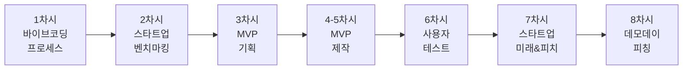
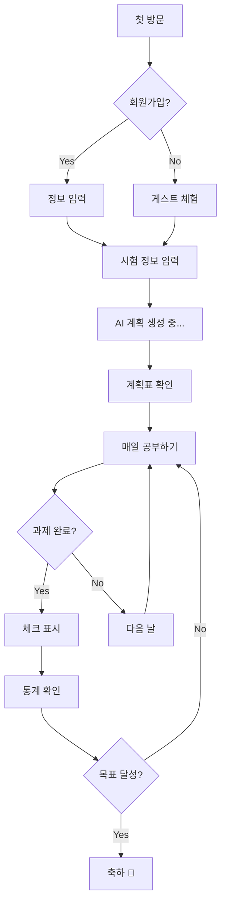
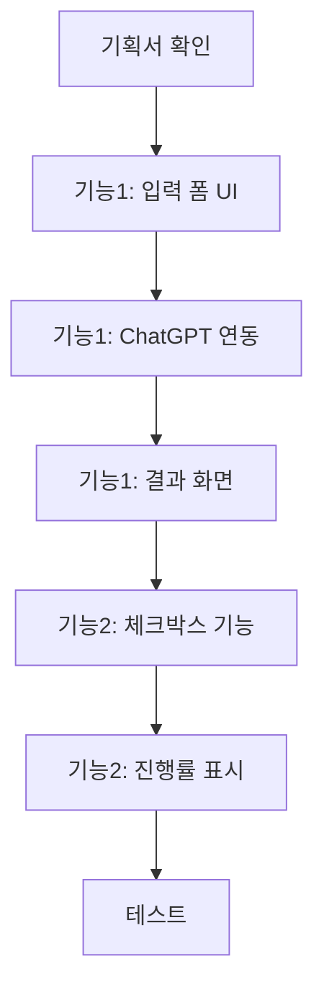

# 🚀 11학년 바이브 코딩 커리큘럼 (8차시)

## 📌 학년 목표 및 핵심 역량

### 학습 목표
- **창업 마인드**: 실제 창업 아이디어를 MVP로 구현하기
- **시장 검증**: 벤치마킹과 사용자 테스트로 아이디어 검증
- **프로세스 이해**: 벤치마킹 → 기획 → 제작 → 테스트 → 발전
- **피칭 능력**: 투자자/사용자에게 효과적으로 전달하기

### 핵심 역량
| 역량 | 세부 내용 | 평가 방법 |
|------|----------|----------|
| **기업가 정신** | 문제 발견, 실행력, 피벗 능력 | MVP 완성도 |
| **벤치마킹 능력** | 스타트업 사례 분석, 인사이트 도출 | 분석 보고서 |
| **시장 검증 능력** | 아이디어 검증, 사용자 조사 | 검증 프로세스 |
| **커뮤니케이션** | 스토리텔링, 피칭, 설득 | 피치 덱, 발표 |

---

## 📚 전체 8차시 개요



| 차시 | 주제 | 핵심 활동 | 결과물 | 프로세스 단계 |
|------|------|----------|--------|--------------|
| 1 | 바이브 코딩 프로세스 | ChatGPT+v0 체험, 전체 프로세스 | 샘플 프로젝트 | 🎯 프로세스 이해 |
| 2 | 스타트업 벤치마킹 | 학생 창업 사례 분석, 아이디어 검증 | 벤치마킹 + 아이디어 | 📊 사례 연구 |
| 3 | MVP 기획 | 린 캔버스, 핵심 기능 정의 | MVP 기획서 | 📋 기획 |
| 4-5 | MVP 제작 | v0로 MVP 구현, 기능 통합 | 작동하는 MVP | 🛠️ 제작 |
| 6 | 사용자 테스트 | 타겟 사용자 피드백, 개선 | 테스트 리포트 | 🐛 테스트 |
| 7 | 스타트업 미래 & 피치 준비 | 생태계 이해, 피치 덱 제작 | 피치 덱 + 스크립트 | 🚀 발전 방향 |
| 8 | 데모 데이 | 투자자 피칭, 질의응답 | 최종 발표 | 🎉 완성 |

---

## 🎯 차시별 상세 커리큘럼

---

### 📅 1차시: 바이브 코딩 프로세스 요약 & 스타트업 벤치마킹

> **🎯 11학년 특화 차시**: 프로세스 요약(15분) + 벤치마킹 시작(35분)

#### 🎯 차시 목표
- 바이브 코딩 프로세스 핵심 이해하기 (빠르게)
- 성공/실패한 학생 창업 사례 분석하기
- 창업 아이디어 도출 시작하기

#### 📦 예상 결과물
✅ **벤치마킹 리포트** (최소 3개 스타트업 분석) + **아이디어 후보 리스트**

---

#### 🧑‍🏫 교사용 지시서

##### 수업 전 준비사항
- [ ] 바이브 코딩 프로세스 요약 PPT (10분 분량)
- [ ] 학생 창업 성공 사례 10개 (국내외)
  - 예: Summly(15세), Nannycam(고등학생), 국내 학생 창업 사례
- [ ] 실패 사례 3개 (배울 점 중심)
- [ ] 벤치마킹 분석표 출력
- [ ] ChatGPT 접속 확인

##### 수업 진행 (50분)

| 시간 | 활동 | 교사 행동 | 학생 활동 |
|------|------|----------|----------|
| **15분** | 바이브 코딩 요약 | - 개념 간단 설명 (5분)<br/>- ChatGPT/v0 시연 (5분)<br/>- 5단계 프로세스 소개 (5분) | - 핵심 개념 이해<br/>- 도구 확인 |
| **10분** | 학생 창업 사례 | - 성공 사례 영상 (2개)<br/>- 핵심 성공 요인 강조 | - 사례 관찰<br/>- 성공 요인 메모 |
| **20분** | 벤치마킹 실습 | - 3개 스타트업 분석 가이드<br/>- 성공/실패 요인 도출 | - 3개 분석<br/>- 분석표 작성 |
| **5분** | 아이디어 브레인스토밍 | - 문제 발견 프레임워크<br/>- 다음 시간 과제 | - 아이디어 메모<br/>- 과제 확인 |

##### 교사 스크립트

```
[Part 1: 바이브 코딩 프로세스 요약 - 15분]

"고등학교 3년 동안 바이브 코딩을 해왔죠?
9학년: 개인 작품
10학년: 사회문제 해결
11학년: 창업!

바이브 코딩 = MVP를 8주 만에 만드는 힘

오늘부터 여러분은 '창업가'입니다.
• ChatGPT: 아이디어 검증, 시장 조사, 디버깅
• v0: 실제 MVP 제작

5단계 프로세스:
1️⃣ 벤치마킹 (오늘!)
2️⃣ 기획 (린 캔버스)
3️⃣ 제작 (MVP)
4️⃣ 테스트 (사용자)
5️⃣ 피칭 (투자자)

9,10학년과 다른 점:
• 작품 → 비즈니스
• 만들기 → 검증하기
• 완성 → 반복 개선 (피벗)

준비됐나요? 실전 창업 시작합니다!"

[Part 2: 스타트업 벤치마킹 - 35분]

"여러분 또래가 만든 서비스를 알려줄게요.

Nick D'Aloisio (15세):
→ Summly (뉴스 요약 앱)
→ Yahoo에 3,000만 달러 매각!

국내 고등학생:
→ 학생 플래너 앱
→ 10만 다운로드

왜 성공했을까?
✅ 자신이 겪은 불편함 해결
✅ 작게 시작 (MVP)
✅ 사용자 피드백 반영

오늘은 이런 사례 3개를 분석하고,
여러분의 창업 아이디어를 찾습니다!"
```

---

#### 👨‍🎓 학생용 활동 시나리오

##### Part 1: 바이브 코딩 프로세스 복습 (15분)

**바이브 코딩 핵심 요약**

```
🚀 바이브 코딩 (Vibe Coding)

1. 도구
   • ChatGPT: 
     - 아이디어 검증
     - 시장 조사
     - 경쟁자 분석
     - 디버깅
   • v0: 
     - MVP 빠른 제작
     - UI/UX 구현

2. 5단계 창업 프로세스
   벤치마킹 → 기획(린캔버스) → 제작(MVP) → 테스트 → 피칭

3. 핵심 능력
   ✅ 문제를 발견하고 정의하기
   ✅ 시장을 검증하기
   ✅ 빠르게 만들고 테스트하기
   ✅ 피벗할 줄 알기

4. 11학년 목표
   • 8주 만에 작동하는 MVP 완성
   • 실제 사용자 10명 확보
   • 투자자 앞에서 피칭
```

**빠른 도구 체크**

```
✅ 준비 확인:
□ ChatGPT 접속 가능
□ v0.dev 접속 가능
□ 9,10학년 프로젝트 포트폴리오 정리
□ 창업 마인드셋 준비

💡 이전 학년과 다른 점:
- 작품 → 제품 (Product)
- 완성 → 검증 (Validation)
- 혼자 or 팀 → 창업 팀
- 만들기 → 사업하기
```

##### Part 2: 학생 스타트업 벤치마킹 (35분)

**Step 1: 벤치마킹 대상 찾기 (5분)**

🔍 **추천 벤치마킹 대상**

```
국내 학생 창업:
1. 청소년 비즈쿨 수상작
2. 대학생 창업 경진대회
3. "고등학생 창업" 검색
4. K-스타트업 학생 부문

해외 학생 창업:
1. Young Entrepreneur
2. Teen Startup Stories
3. Student Business Ideas
4. Teenpreneur

특별히 주목할 분야:
• EdTech (교육)
• 학생 생활 편의
• 진로/입시 관련
• 10대 커뮤니티

오늘 분석할 3개 선택:
1. _______________________
2. _______________________
3. _______________________
```

**Step 2: 스타트업 분석 (20분)**

📋 **빠른 분석표**

```
┌────────────────────────────────────┐
│     스타트업 분석표 (#1)            │
├────────────────────────────────────┤
│ 서비스명: ______________________   │
│ 창업자: __________ (나이)          │
│ 현재 상태: □운영 □매각 □폐업       │
│                                    │
│ ⭐ 평가 (각 5점)                    │
│                                    │
│ 1. 문제 명확성: [ ]/5              │
│    해결한 문제: _________________  │
│                                    │
│ 2. 차별화: [ ]/5                   │
│    기존 vs 우리: ________________  │
│                                    │
│ 3. 타겟 명확성: [ ]/5               │
│    누구를 위한?: ________________  │
│                                    │
│ 4. 비즈니스 모델: [ ]/5             │
│    수익 방법: ___________________  │
│                                    │
│ 5. 실행력: [ ]/5                    │
│    MVP 품질: ____________________  │
│                                    │
│ 📈 총점: ___/25점                  │
│                                    │
│ ✅ 성공 요인 1가지:                 │
│ _______________________________    │
│                                    │
│ 💡 우리가 따라할 점:                │
│ _______________________________    │
│                                    │
│ ⚠️ 피해야 할 실수:                  │
│ _______________________________    │
└────────────────────────────────────┘

※ 3개 빠르게 분석
```

**Step 3: 아이디어 브레인스토밍 (10분)**

```
💡 창업 아이디어 발견 프레임워크

1️⃣ 내가 겪은 불편함 (5분)
   • 학교: _________________________
   • 공부/진로: _____________________
   • 일상: _________________________

2️⃣ 친구들의 문제 (3분)
   • 자주 듣는 불평: ________________
   • 공통 어려움: ___________________

3️⃣ 벤치마킹 영감 (2분)
   분석한 스타트업과 비슷한 구조로 
   내가 만들 수 있는 것:
   _________________________________

→ 아이디어 후보 5개:
1. _______________________________
2. _______________________________
3. _______________________________
4. _______________________________
5. _______________________________

다음 시간까지 과제:
□ 각 아이디어를 ChatGPT로 1차 검증
□ 추가 스타트업 2개 더 분석
□ 가장 하고 싶은 아이디어 3개 선택
```

---

### 📅 2차시: 아이디어 심화 검증 & 린 캔버스

#### 🎯 차시 목표
- 성공/실패한 학생 창업 사례 분석하기
- 스타트업 성공 요인 파악하기
- 내 창업 아이디어 도출 및 검증하기

#### 📦 예상 결과물
✅ **벤치마킹 리포트** (최소 5개 사례) + **아이디어 검증 리포트**

---

#### 🧑‍🏫 교사용 지시서

##### 수업 전 준비사항
- [ ] 학생 창업 성공 사례 10개 (국내외)
  - 예: Summly(15세), Nannycam(고등학생), 국내 학생 창업 사례
- [ ] 실패 사례 5개 (배울 점 중심)
- [ ] 벤치마킹 분석표 출력
- [ ] ChatGPT 접속 확인

##### 수업 진행 (50분)

| 시간 | 활동 | 교사 행동 | 학생 활동 |
|------|------|----------|----------|
| **10분** | 학생 창업 사례 | - 성공 사례 영상 (3개)<br/>- 왜 성공했는가? 질문 | - 사례 관찰<br/>- 성공 요인 메모 |
| **15분** | 벤치마킹 실습 | - 5개 사례 분석 가이드<br/>- 성공/실패 요인 도출 | - 분석표 작성<br/>- 패턴 발견 |
| **15분** | 아이디어 도출 | - 문제 발견 프레임워크<br/>- 브레인스토밍 가이드 | - 아이디어 10개<br/>- 상위 3개 선택 |
| **10분** | ChatGPT 검증 | - 검증 질문 가이드<br/>- 피벗 개념 설명 | - ChatGPT로 검증<br/>- 최종 아이디어 선정 |

##### 교사 스크립트

```
[학생 창업 사례 소개]
"여러분 또래가 만든 서비스를 알려줄게요.

1. Nick D'Aloisio (15세)
   → Summly (뉴스 요약 앱) → Yahoo에 3,000만 달러 매각

2. 국내 고등학생
   → 학생 플래너 앱 → 10만 다운로드

3. 대학생 (시작은 고3)
   → 중고책 거래 플랫폼 → 투자 유치

공통점:
✅ 자신이 겪은 불편함 해결
✅ 작게 시작 (MVP)
✅ 사용자 피드백 반영
✅ 꾸준히 개선

여러분도 할 수 있어요!
오늘은 이런 사례를 벤치마킹합니다."

[벤치마킹의 중요성]
"창업가는 매일 배웁니다.
특히 다른 스타트업의 성공/실패에서!

우리가 볼 것:
• 무엇을 만들었나? (제품)
• 누구를 위한 것인가? (타겟)
• 어떻게 해결했나? (해결책)
• 왜 성공/실패했나? (요인)
• 우리가 배울 점은? (인사이트)

이게 바로 '벤치마킹'입니다!"
```

---

#### 👨‍🎓 학생용 활동 시나리오

##### 미션: 스타트업 분석 & 내 아이디어 검증하기

**Step 1: 학생 창업 벤치마킹 (15분)**

🔍 **벤치마킹 대상 찾는 곳**

```
추천 사이트/검색어:

국내:
1. 청소년 비즈쿨 (k-startup.go.kr/edu/bizcool)
2. 대학생 창업 경진대회 수상작
3. "고등학생 창업" "학생 스타트업"
4. K-스타트업 학생 부문

해외:
1. Young Entrepreneur (검색어)
2. Teen Startup Stories
3. Student Business Ideas
4. Teenpreneur (블로그)
5. Youth Business International

내가 분석할 5개:
1. _______________________
2. _______________________
3. _______________________
4. _______________________
5. _______________________
```

📋 **스타트업 벤치마킹 분석표**

```
┌────────────────────────────────────┐
│     스타트업 분석표 (Case #1)       │
├────────────────────────────────────┤
│ 서비스명: ______________________   │
│ 창업자: ____________ (나이/학년)   │
│ 시작 연도: __________년            │
│ 현재 상태: □운영중 □매각 □폐업     │
│                                    │
│ 📱 제품/서비스                      │
│ • 무엇을 만들었나?                  │
│   _____________________________    │
│ • 핵심 기능 3가지:                  │
│   1. _________________________    │
│   2. _________________________    │
│   3. _________________________    │
│                                    │
│ 🎯 문제 & 타겟                      │
│ • 해결한 문제:                      │
│   _____________________________    │
│ • 타겟 사용자:                      │
│   _____________________________    │
│ • 왜 이 문제를 선택?                │
│   _____________________________    │
│                                    │
│ 💡 차별화 포인트                    │
│ • 기존 솔루션의 문제:               │
│   _____________________________    │
│ • 우리만의 해결책:                  │
│   _____________________________    │
│                                    │
│ 💰 비즈니스 모델                    │
│ • 수익 구조: □무료 □유료 □광고     │
│   □프리미엄 □기타: _____________  │
│ • 성공 여부: □성공 □실패           │
│                                    │
│ ✅ 성공 요인 (성공한 경우)           │
│ 1. ___________________________    │
│ 2. ___________________________    │
│ 3. ___________________________    │
│                                    │
│ ❌ 실패 원인 (실패한 경우)           │
│ 1. ___________________________    │
│ 2. ___________________________    │
│                                    │
│ 🎓 배울 점                          │
│ • 우리 프로젝트에 적용할 것:        │
│   _____________________________    │
│   _____________________________    │
│                                    │
│ • 피해야 할 실수:                   │
│   _____________________________    │
│                                    │
│ 💭 종합 평가                        │
│ • 이 아이디어가 좋았던 이유:        │
│   _____________________________    │
│ • 내가 더 잘 만들 수 있는 부분:     │
│   _____________________________    │
└────────────────────────────────────┘

※ 5개 사례 모두 분석
```

**Step 2: 패턴 발견 (5분)**

```
📊 5개 사례 공통점 찾기

성공 요인 순위:
1. _____________________________ (출현 빈도: ___회)
2. _____________________________ (출현 빈도: ___회)
3. _____________________________ (출현 빈도: ___회)

실패 원인 순위:
1. _____________________________ (출현 빈도: ___회)
2. _____________________________ (출현 빈도: ___회)

핵심 인사이트:
"성공하는 학생 창업의 공통점은..."
_________________________________________
_________________________________________
```

**Step 3: 내 아이디어 도출 (15분)**

💡 **문제 발견 프레임워크**

```
🔍 어디에서 아이디어를 찾을까?

1️⃣ 내가 겪은 불편함 (가장 중요!)
   • 학교 생활: _____________________
   • 공부/진로: _____________________
   • 일상: _________________________
   • 취미: _________________________

2️⃣ 친구들이 겪는 문제
   • 자주 듣는 불평: ________________
   • 공통적 어려움: _________________

3️⃣ 시장 트렌드
   • 요즘 핫한 것: __________________
   • 사라지는 것: ___________________
   • 새로 생기는 것: ________________

4️⃣ 기존 서비스의 부족한 점
   • [서비스명]의 불편한 점: _________
   • 내가 개선할 수 있는 부분: _______

💡 10개 아이디어 빠르게 적기:
1. _______________________________
2. _______________________________
...
10. _______________________________

⭐ 가장 하고 싶은 것 3개 선택
```

**아이디어 평가**

```
┌──────────────────────────────────┐
│ 아이디어 평가표                   │
├──────────────────────────────────┤
│ 아이디어 1: ___________________  │
│                                  │
│ • 열정: [ ]/5점 (정말 하고 싶은가?)│
│ • 시장성: [ ]/5점 (사람들이 쓸까?)│
│ • 실현성: [ ]/5점 (8주 안에 가능?)│
│ • 차별성: [ ]/5점 (기존과 다른가?)│
│ • 총점: ___/20점                 │
│                                  │
│ 벤치마킹 사례와 비교:             │
│ • 비슷한 서비스: _______________  │
│ • 우리만의 차별점: ______________  │
└──────────────────────────────────┘

아이디어 2, 3도 동일하게 평가

→ 최고점 아이디어 선택!
```

**Step 4: ChatGPT로 검증 (10분)**

💬 **검증 프롬프트**

```
"학생 창업 아이디어를 검증해줘.

아이디어: [내 아이디어 설명]

타겟 사용자: [구체적으로]
해결하는 문제: [구체적으로]
해결 방법: [간단히]

다음을 분석해줘:

1. 시장 조사
   • 이 문제를 겪는 사람이 얼마나 많은가?
   • 시장 규모는?

2. 경쟁자 분석
   • 이미 비슷한 서비스가 있는가?
   • 있다면 왜 부족한가?

3. 차별화 가능성
   • 학생이 만드는 것의 장점은?
   • 기존 서비스 대비 우위는?

4. 실현 가능성
   • 8주 안에 MVP 제작 가능한가?
   • 기술적 난이도는?

5. 비즈니스 가능성
   • 수익 모델은?
   • 지속 가능한가?

6. 리스크
   • 예상되는 어려움 3가지
   • 극복 방법

솔직하고 비판적으로 평가해줘.
개선 제안도 구체적으로 줘."
```

**ChatGPT 답변 정리**

```
┌────────────────────────────────────┐
│        아이디어 검증 리포트         │
├────────────────────────────────────┤
│ 아이디어: _______________________  │
│                                    │
│ ✅ 강점 (Go!)                       │
│ 1. ___________________________    │
│ 2. ___________________________    │
│ 3. ___________________________    │
│                                    │
│ ⚠️ 약점 (보완 필요)                 │
│ 1. ___________________________    │
│ 2. ___________________________    │
│                                    │
│ 💡 개선 방향                        │
│ 1. ___________________________    │
│ 2. ___________________________    │
│ 3. ___________________________    │
│                                    │
│ 🎯 최종 결정                        │
│ □ 이대로 진행                      │
│ □ 일부 수정 후 진행 (수정 내용: __)│
│ □ 피벗 필요 (새 방향: __________)  │
│                                    │
│ 🚀 다음 단계: MVP 기획             │
└────────────────────────────────────┘
```

---

#### 📊 평가 기준

| 항목 | 상 (3점) | 중 (2점) | 하 (1점) |
|------|---------|---------|---------|
| **벤치마킹** | 5개 사례 심층 분석, 패턴 발견 | 5개 분석, 기본 내용 | 3개 이하 또는 피상적 |
| **아이디어** | 구체적이고 검증됨, 차별성 명확 | 기본 아이디어, 일부 검증 | 모호하거나 미검증 |
| **인사이트** | 벤치마킹 인사이트 아이디어 반영 | 부분 반영 | 연결 부족 |

---

### 📅 3차시: MVP 상세 기획 (린 스타트업 방법론)

#### 🎯 차시 목표
- 벤치마킹 인사이트를 반영한 MVP 기획
- 린 캔버스로 비즈니스 모델 검증하기
- 핵심 기능 3개 상세 명세서 작성하기
- 사용자 플로우 및 데이터 구조 설계하기

#### 📦 예상 결과물
✅ **MVP 상세 기획서** (린 캔버스 + 기능 명세서 + 데이터 구조 + 사용자 플로우 + 화면 설계)

---

#### 🧑‍🏫 교사용 지시서

##### 수업 진행 (50분)

| 시간 | 활동 | 교사 행동 | 학생 활동 |
|------|------|----------|----------|
| **5분** | 도입 | - 벤치마킹 인사이트 복습<br/>- 린 스타트업 방법론 소개 | - 2차시 분석 결과 확인 |
| **15분** | 린 캔버스 | - 린 캔버스 9개 블록 설명<br/>- 성공 스타트업 사례 공유 | - 린 캔버스 작성 |
| **20분** | 기능 명세 | - MVP 범위 설정 방법 (MoSCoW)<br/>- 기능 우선순위 결정 가이드 | - 핵심 기능 3개 상세 정의 |
| **10분** | 사용자 플로우 | - 사용자 여정 설계<br/>- 화면 전환 흐름도 작성 | - 플로우차트 그리기 |

---

#### 👨‍🎓 학생용 활동 시나리오

##### 미션: 린 스타트업 방법론으로 MVP 설계하기

**Step 1: 린 캔버스 작성 (15분)**

📋 **린 캔버스 (Lean Canvas) - 상세 버전**

```
┌──────────────────────────────────────────────────────────┐
│                    린 캔버스 (Lean Canvas)                │
│            ※ 각 칸을 구체적으로 작성하세요                │
├──────────────┬──────────────────┬────────────────────────┤
│ 1️⃣ 문제      │ 4️⃣ 해결책         │ 3️⃣ 고유 가치 제안 (UVP)│
│ (Problem)    │ (Solution)       │ (Unique Value Prop)    │
│              │                  │                        │
│ 상위 3가지:  │ 핵심 기능 3개:   │ 한 문장으로:           │
│              │                  │                        │
│ 1. [가장중요]│ 1. [MVP 필수]    │ "__을 위한"            │
│ 예: 시험기간 │ 예: AI 학습계획  │ "__"                   │
│ 학습 계획이  │ 생성 기능        │                        │
│ 막막함       │                  │ 예: "막막한 학생을     │
│              │ 2. [MVP 필수]    │     위한 AI 학습       │
│ 2. [두번째]  │ 예: 진도 체크    │     도우미"            │
│ 예: 진도 관리│ 기능             │                        │
│ 어려움       │                  │ 왜 우리인가?           │
│              │ 3. [MVP 필수]    │ "__때문에"             │
│ 3. [세번째]  │ 예: 학습 통계    │                        │
│ 예: 동기부여 │ 대시보드         │ 예: "AI가 자동으로     │
│ 부족         │                  │     계획 세워주기      │
│              │ ※ 있으면 좋은:  │     때문에"            │
│ 기존 해결책: │ - 친구와 공유    │                        │
│ 종이 플래너, │ - 리마인더       │ 측정 가능한 목표:      │
│ 스터디 카페  │ - 분석 레포트    │ • 학습 시간 30% 증가   │
│              │                  │ • 목표 달성률 80%      │
├──────────────┼──────────────────┼────────────────────────┤
│ 2️⃣ 고객 세그먼트│ 9️⃣ 차별화 요소    │ 5️⃣ 채널              │
│ (Customers)  │ (Unfair Advantage)│ (Channels)            │
│              │                  │                        │
│ 초기 타겟:   │ 경쟁자:          │ 어떻게 도달?           │
│              │ ____________     │                        │
│ • 나이: ___  │ 예: 플래너 앱,   │ □ SNS (인스타, 틱톡)   │
│ 예: 15-18세  │     스터디 앱    │ □ 학교 (학급 단위)     │
│              │                  │ □ 입소문 (친구 추천)   │
│ • 직업/학년: │ 우리만의 장점:   │ □ 온라인 광고 (구글)   │
│ 예: 고등학생 │ 1. AI 자동화     │ □ 커뮤니티 (카페, 밴드)│
│              │ 2. 학생 눈높이   │ □ 기타: ___            │
│ • 특징:      │ 3. 무료          │                        │
│ 시험 걱정,   │                  │ 초기 확산 전략:        │
│ 계획 서툼    │ ※ 쉽게 못 따라함│ 1주차: 우리 반 (30명)  │
│              │ (2년 개발경험    │ 1개월: 우리 학교(300명)│
│ 얼리어답터:  │  or 특별한 데이터│ 3개월: 다른 학교(1000명)│
│ (처음 써줄   │  or 독점 기술)   │                        │
│  10명 누구?) │                  │ 트래픽 유입 경로:      │
│ • 우리 반    │                  │ → SNS 게시물 → 랜딩    │
│ • 친한 친구  │                  │   → 가입 → 사용        │
│ • 학원 동기  │                  │                        │
├──────────────┴──────────────────┴────────────────────────┤
│ 7️⃣ 수익 모델 (Revenue Streams)                           │
│                                                           │
│ 언제부터 돈을 벌까?                                       │
│ ☑ 지금은 무료 (사용자 먼저 모으기)                        │
│ □ 처음부터 유료                                           │
│                                                           │
│ 미래 수익화 방법:                                         │
│ □ 프리미엄 기능 (예: 상세 분석, 개인 튜터링)              │
│ □ 광고 (예: 학원, 교재 광고)                              │
│ □ 수수료 (예: 스터디 모임 중개 수수료)                    │
│ ☑ 구독제 (예: 월 3,000원 프리미엄)                        │
│ □ B2B (예: 학교/학원에 판매)                              │
│ □ 기타: ___________________                              │
│                                                           │
│ 예상 수익 (1년 후):                                       │
│ • 사용자 1,000명 × 10% 유료 전환 × 월 3,000원 = 월 300,000원│
├───────────────────────────────────────────────────────────┤
│ 8️⃣ 비용 구조 (Cost Structure)                            │
│                                                           │
│ 필요한 비용:                                              │
│ • 개발: 0원 (직접 제작, ChatGPT + v0)                     │
│ • 서버/호스팅: 월 10,000원 (Vercel 무료 or 저가 호스팅)   │
│ • 도메인: 연 15,000원 (xxx.com)                           │
│ • 마케팅: 월 50,000원 (SNS 광고, 전단지)                  │
│ • 기타: 0원                                               │
│                                                           │
│ 총 예상 비용 (3개월): 약 200,000원                        │
│ (대부분 무료 도구 활용 → 비용 최소화 전략)                │
├───────────────────────────────────────────────────────────┤
│ 6️⃣ 핵심 지표 (Key Metrics)                               │
│                                                           │
│ 성공을 어떻게 측정할까?                                   │
│                                                           │
│ 단기 목표 (1개월):                                        │
│ • 가입자 수: 100명                                        │
│ • 주간 활성 사용자 (WAU): 50명                            │
│ • 평균 사용 시간: 15분/일                                 │
│                                                           │
│ 중기 목표 (3개월):                                        │
│ • 가입자 수: 500명                                        │
│ • 재방문율: 60% (주 3회 이상)                             │
│ • NPS (추천 의향): 8점 이상                               │
│                                                           │
│ 장기 목표 (1년):                                          │
│ • 가입자 수: 5,000명                                      │
│ • 유료 전환율: 10% (500명)                                │
│ • 월 수익: 500,000원                                      │
│                                                           │
│ 피벗 판단 기준:                                           │
│ → 1개월 후 가입자 30명 미만 → 타겟/기능 변경 검토         │
│ → 재방문율 20% 미만 → 핵심 가치 재점검                    │
└───────────────────────────────────────────────────────────┘

💡 린 캔버스 작성 팁:
1. 문제(1번)부터 시작 → 가장 중요!
2. 고객(2번) 구체적으로 → "10대"보다 "고2 수험생"
3. 해결책(4번) 간단하게 → MVP는 3개 기능만!
4. 수익(7번)은 나중에 생각해도 OK → 사용자가 먼저
5. 1시간마다 업데이트 → 배우면서 계속 수정
```

**Step 2: MVP 핵심 기능 상세 정의 (20분)**

📋 **기능 명세서 (MoSCoW 방법론)**

```
┌──────────────────────────────────────────────────────────┐
│              MVP 기능 명세서 (상세)                       │
│  예시: AI 학습 도우미 (시험 준비 앱)                      │
├──────────────────────────────────────────────────────────┤
│ ✅ MUST (꼭 필요 - MVP에 반드시 포함)                     │
│                                                           │
│ 기능 1: AI 학습 계획 생성                                 │
│ ━━━━━━━━━━━━━━━━━━━━━━━━━━━━━━━━━━━━━━━━━━━━━━         │
│ 📌 목적: 학생이 시험 범위를 입력하면 자동으로             │
│          일별 학습 계획을 만들어주기                      │
│                                                           │
│ 📊 입력 데이터:                                           │
│ • 시험 과목 (예: 수학, 영어, 과학)                        │
│ • 시험 날짜 (예: 2025-12-15)                             │
│ • 학습 범위 (예: 수학 1-1, 2-1단원)                       │
│ • 하루 공부 가능 시간 (예: 3시간)                         │
│ • 현재 이해도 (선택: 상/중/하)                            │
│                                                           │
│ 🔄 처리 로직:                                             │
│ 1. ChatGPT API 호출                                       │
│ 2. 프롬프트 생성:                                         │
│    "고등학생의 시험 준비를 도와줘.                        │
│     과목: [입력값], 시험일: [입력값],                     │
│     범위: [입력값], 하루 가능 시간: [입력값]              │
│     일별 학습 계획을 JSON 형식으로 만들어줘."             │
│ 3. 응답 파싱 → JSON 변환                                  │
│ 4. 데이터베이스(localStorage) 저장                       │
│                                                           │
│ 📤 출력 결과:                                             │
│ • 일별 학습 계획표 (JSON)                                 │
│   [{                                                      │
│     "day": 1,                                             │
│     "date": "2025-12-01",                                 │
│     "subject": "수학",                                    │
│     "topic": "1단원: 방정식",                             │
│     "duration": 120,  // 분 단위                          │
│     "tasks": [                                            │
│       "개념 정리 (30분)",                                 │
│       "문제 풀이 (60분)",                                 │
│       "복습 (30분)"                                       │
│     ]                                                     │
│   }, ...]                                                 │
│                                                           │
│ 🎨 UI 요소:                                               │
│ • 입력 폼:                                                │
│   - 과목 선택 (드롭다운 or 입력)                          │
│   - 시험 날짜 (날짜 선택기)                               │
│   - 학습 범위 (텍스트 영역, 200자)                        │
│   - 하루 공부 시간 (슬라이더: 1-8시간)                    │
│   - "계획 생성하기" 버튼 (크고 눈에 띄게)                 │
│                                                           │
│ • 결과 화면:                                              │
│   - 달력 뷰 (날짜별 계획 표시)                            │
│   - 리스트 뷰 (일별 상세 계획)                            │
│   - 진행률 표시 (예: Day 3/14)                            │
│   - 체크박스 (완료 표시)                                  │
│                                                           │
│ 📱 화면 배치:                                             │
│ ┌──────────────────────────┐                             │
│ │ [AI 학습 도우미]         │ ← 제목                       │
│ ├──────────────────────────┤                             │
│ │ 📚 시험 정보 입력        │ ← 섹션 제목                  │
│ │                          │                             │
│ │ 과목: [수학 ▼]           │ ← 드롭다운                   │
│ │ 시험 날짜: [📅 선택]     │ ← 날짜 선택기                │
│ │ 학습 범위:               │                             │
│ │ [1-1, 2-1 단원...]       │ ← 텍스트 영역                │
│ │                          │                             │
│ │ 하루 공부 시간: [3시간]  │ ← 슬라이더                   │
│ │ ━━━━●━━━━━━━             │                             │
│ │                          │                             │
│ │ [✨ 계획 생성하기]        │ ← 큰 버튼                    │
│ └──────────────────────────┘                             │
│                                                           │
│ → 생성 후 화면:                                           │
│                                                           │
│ ┌──────────────────────────┐                             │
│ │ 📅 내 학습 계획           │                             │
│ ├──────────────────────────┤                             │
│ │ Day 1 (12/01 월)         │ ← 날짜 헤더                  │
│ │ ✅ 수학 1단원 (2시간)    │ ← 체크박스 + 내용            │
│ │   • 개념 정리 30분       │                             │
│ │   • 문제 풀이 60분       │                             │
│ │   • 복습 30분            │                             │
│ │                          │                             │
│ │ Day 2 (12/02 화)         │                             │
│ │ ⬜ 수학 2단원 (2시간)    │                             │
│ │   • ...                  │                             │
│ │                          │                             │
│ │ [전체 진행률: 1/14]      │ ← 프로그레스 바              │
│ │ ████░░░░░░░░░░ 7%        │                             │
│ └──────────────────────────┘                             │
│                                                           │
│ ⚠️ 중요 포인트:                                           │
│ • ChatGPT API 호출 실패 시 → 에러 메시지 + 재시도 버튼    │
│ • 로딩 중 → 스피너 + "AI가 계획을 세우는 중..."          │
│ • 계획 저장 → localStorage (오프라인 접근 가능)           │
│                                                           │
│ 🐛 예상 에러 & 해결:                                      │
│ • API 키 없음 → 환경변수 설정 안내                        │
│ • 네트워크 오류 → 재시도 옵션 제공                        │
│ • 잘못된 입력 → 유효성 검사 + 안내 메시지                 │
│                                                           │
├──────────────────────────────────────────────────────────┤
│ 기능 2: 진도 체크 & 완료 표시                             │
│ ━━━━━━━━━━━━━━━━━━━━━━━━━━━━━━━━━━━━━━━━━━━━━━         │
│ 📌 목적: 학생이 계획대로 공부했는지 체크하고              │
│          진행 상황을 시각화하기                           │
│                                                           │
│ 📊 입력 데이터:                                           │
│ • 완료한 과제 ID                                          │
│ • 완료 시간 (타임스탬프)                                  │
│ • 난이도 피드백 (선택: 쉬움/보통/어려움)                  │
│                                                           │
│ 🔄 처리 로직:                                             │
│ 1. 체크박스 클릭 이벤트                                   │
│ 2. 해당 과제 상태 변경 (pending → completed)              │
│ 3. 완료 시간 기록                                         │
│ 4. localStorage 업데이트                                  │
│ 5. 통계 재계산 (완료율, 남은 시간)                        │
│                                                           │
│ 📤 출력 결과:                                             │
│ • 완료 표시 (체크박스 ON)                                 │
│ • 진행률 업데이트                                         │
│ • 축하 메시지 (예: "잘했어요! 🎉")                        │
│                                                           │
│ 🎨 UI 요소:                                               │
│ • 체크박스 (큼직하게, 터치하기 쉽게)                      │
│ • 진행률 바 (컬러풀하게)                                  │
│ • 완료 애니메이션 (체크 시 효과)                          │
│ • 통계 대시보드:                                          │
│   - 오늘 완료한 과제 수                                   │
│   - 전체 진행률 (%)                                       │
│   - 남은 일수                                             │
│                                                           │
├──────────────────────────────────────────────────────────┤
│ 기능 3: 학습 통계 대시보드                                │
│ ━━━━━━━━━━━━━━━━━━━━━━━━━━━━━━━━━━━━━━━━━━━━━━         │
│ 📌 목적: 학생이 자신의 학습 패턴을 파악하고               │
│          동기부여 받기                                    │
│                                                           │
│ 📊 표시 데이터:                                           │
│ • 총 공부 시간 (누적)                                     │
│ • 과목별 공부 시간 (파이 차트)                            │
│ • 일별 공부 시간 (막대 그래프)                            │
│ • 완료율 (%)                                              │
│ • 연속 공부 일수 (스트릭)                                 │
│                                                           │
│ 🎨 UI 요소:                                               │
│ • 큰 숫자로 통계 표시                                     │
│ • 시각화 차트 (Chart.js 사용)                             │
│ • 격려 메시지 (예: "3일 연속! 멋져요!")                   │
│                                                           │
│ 📱 화면 배치:                                             │
│ ┌──────────────────────────┐                             │
│ │ 📊 내 학습 통계           │                             │
│ ├──────────────────────────┤                             │
│ │  총 공부 시간             │                             │
│ │  [24시간 30분]            │ ← 큰 숫자                    │
│ │                          │                             │
│ │  연속 공부 일수           │                             │
│ │  [🔥 5일]                │ ← 불 아이콘 + 숫자           │
│ │                          │                             │
│ │ [파이 차트: 과목별 시간]  │                             │
│ │ [막대 그래프: 일별 시간]  │                             │
│ │                          │                             │
│ │ "5일 연속! 대단해요! 🎉" │ ← 격려 메시지                │
│ └──────────────────────────┘                             │
│                                                           │
├──────────────────────────────────────────────────────────┤
│ 🟡 SHOULD (중요 - V2에 추가)                              │
│ • 친구와 공유 (SNS 연동)                                  │
│ • 리마인더 (알림 기능)                                    │
│ • 학습 분석 레포트 (주간/월간)                            │
│                                                           │
│ 🟢 COULD (추가 - 나중에)                                  │
│ • 스터디 그룹 기능                                        │
│ • 학습 자료 추천                                          │
│ • 랭킹 시스템                                             │
│                                                           │
│ 🔴 WON'T (제외 - MVP에서 하지 않음)                       │
│ • 실시간 화상 통화                                        │
│ • 유료 결제 시스템 (나중에 추가)                          │
│ • 복잡한 분석 알고리즘                                    │
│                                                           │
│ → MVP는 MUST 3개 기능만 8주 안에 완성!                    │
└──────────────────────────────────────────────────────────┘
```

**Step 3: 데이터 구조 설계 (10분)**

💾 **JSON 데이터 구조**

```javascript
// mvp-data.json

{
  "user": {
    "id": "user123",
    "name": "홍길동",
    "grade": "고2",
    "subjects": ["수학", "영어", "과학"],
    "createdAt": "2025-11-01"
  },
  
  "studyPlan": {
    "id": "plan001",
    "examDate": "2025-12-15",
    "totalDays": 14,
    "dailyStudyHours": 3,
    "subjects": [
      {
        "name": "수학",
        "range": "1-1, 2-1 단원",
        "currentLevel": "중"
      }
    ],
    "dailyPlans": [
      {
        "day": 1,
        "date": "2025-12-01",
        "subject": "수학",
        "topic": "1단원: 방정식",
        "duration": 120,  // 분
        "tasks": [
          {
            "id": "task001",
            "title": "개념 정리",
            "duration": 30,
            "completed": true,
            "completedAt": "2025-12-01T10:30:00",
            "difficulty": "보통"
          },
          {
            "id": "task002",
            "title": "문제 풀이",
            "duration": 60,
            "completed": false,
            "completedAt": null,
            "difficulty": null
          }
        ]
      }
    ]
  },
  
  "statistics": {
    "totalStudyTime": 1470,  // 분 (24.5시간)
    "streakDays": 5,
    "completionRate": 65,  // %
    "subjectBreakdown": {
      "수학": 600,
      "영어": 480,
      "과학": 390
    },
    "dailyLog": [
      {
        "date": "2025-12-01",
        "totalMinutes": 120,
        "tasksCompleted": 3
      }
    ]
  }
}
```

**Step 4: 사용자 플로우 설계 (5min)**

🗺️ **사용자 여정 맵**



---

### 📅 4-5차시: MVP 제작 (기능별 구현)

#### 🎯 차시 목표
- 3차시 기획서를 바탕으로 MVP 구현하기
- v0로 3개 핵심 기능을 단계적으로 제작하기
- 실제 작동하는 프로토타입 완성하기

#### 📦 예상 결과물
✅ **작동하는 MVP** (3개 핵심 기능 포함, 배포 가능)

---

#### 👨‍🎓 학생용 활동 시나리오

##### 4차시: 기능 1-2 제작 (계획 생성 + 진도 체크)

**기능별 구현 로드맵**



**Step 1: 랜딩 페이지 + 입력 폼 (20분)**

🎨 **v0 프롬프트**

```
"학생 시험 준비 도우미 MVP를 만들어줘.

페이지 1: 랜딩 페이지 + 입력 폼

기능 명세:

1. 상단 섹션 (Hero)
   - 제목:
     • 텍스트: "AI 학습 도우미 📚"
     • 폰트: 48px (text-5xl), 굵게
     • 색상: 파란색 (blue-600)
     • 중앙 정렬
   
   - 서브 제목:
     • 텍스트: "막막한 시험 준비, AI가 계획 세워드려요"
     • 폰트: 20px (text-xl)
     • 색상: 회색 (gray-600)
     • 여백: 위 16px
   
   - 특징 3개 (아이콘 + 텍스트):
     • "⚡ 30초 만에 계획 생성"
     • "📊 진도 관리 자동화"
     • "🎯 맞춤형 학습 전략"
     • 레이아웃: 가로 나열
     • 간격: 24px

2. 입력 폼 섹션
   - 제목: "시험 정보를 입력하세요"
     • 폰트: 32px (text-3xl), 굵게
     • 여백: 상단 60px, 하단 32px
   
   - 폼 컨테이너:
     • 최대 너비: 600px (중앙 정렬)
     • 배경: 흰색
     • 패딩: 40px
     • 둥근 모서리: rounded-2xl
     • 그림자: shadow-xl
   
   입력 필드 4개:
   
   필드 1 - 과목:
   • 레이블: "과목" (굵게)
   • Input type: text
   • Placeholder: "예: 수학, 영어, 과학"
   • 스타일:
     - 전체 너비
     - 패딩: px-4 py-3
     - 테두리: 2px 회색
     - 둥근 모서리: rounded-lg
     - Focus: 파란색 테두리
   • 여백: 하단 20px
   
   필드 2 - 시험 날짜:
   • 레이블: "시험 날짜"
   • Input type: date
   • 스타일: 필드 1과 동일
   • 여백: 하단 20px
   
   필드 3 - 학습 범위:
   • 레이블: "학습 범위"
   • Textarea (4줄)
   • Placeholder: "예: 1단원~3단원, 문법 전체"
   • 최대 길이: 200자
   • 글자 수 표시: "0/200"
   • 여백: 하단 20px
   
   필드 4 - 하루 공부 시간:
   • 레이블: "하루 공부 가능 시간"
   • Range 슬라이더 (1-8시간)
   • 현재 값 표시: "3시간"
   • 색상: 파란색
   • 여백: 하단 32px
   
   제출 버튼:
   • 텍스트: "✨ AI 계획 생성하기"
   • 크기: 전체 너비, py-4
   • 폰트: text-xl, 굵게
   • 색상: 파란색 그라데이션 (blue-500 → blue-600)
   • 호버: 약간 어둡게
   • 둥근 모서리: rounded-xl
   • 그림자: shadow-lg
   • 클릭 시: 로딩 상태 표시

3. 로딩 상태
   - 버튼 텍스트 변경: "AI가 계획 세우는 중..."
   - 스피너 애니메이션
   - 버튼 비활성화

4. 하단 섹션
   - 이용 안내:
     • "무료로 시작하세요!"
     • "가입 불필요, 3분이면 완성"
   
레이아웃:
- 전체 배경: 연한 회색 (gray-50)
- 최대 너비: 1200px (중앙)
- 패딩: 상하 80px, 좌우 24px

반응형:
- 모바일 (768px 이하): 1열, 패딩 감소

Next.js 14, Tailwind CSS 사용"
```

**Step 2: ChatGPT 연동 & 결과 화면 (20min)**

```
"이전 페이지에 ChatGPT API 연동을 추가하고
결과 화면을 만들어줘.

기능 명세:

1. ChatGPT API 호출
   - API Key: 환경 변수에서 가져오기 (OPENAI_API_KEY)
   - Model: gpt-3.5-turbo
   
   프롬프트 템플릿:
   "고등학생의 시험 준비를 도와줘.
   
   정보:
   - 과목: {subject}
   - 시험 날짜: {examDate}
   - 학습 범위: {range}
   - 하루 공부 가능 시간: {hours}시간
   
   요구사항:
   1. 오늘부터 시험 전날까지 일별 학습 계획을 세워줘
   2. 각 날짜마다:
      - 공부할 주제
      - 세부 과제 3-4개
      - 각 과제의 예상 소요 시간
   3. JSON 형식으로 응답해줘
   
   형식:
   {
     \"totalDays\": 숫자,
     \"plans\": [
       {
         \"day\": 1,
         \"date\": \"YYYY-MM-DD\",
         \"subject\": \"과목명\",
         \"topic\": \"주제\",
         \"tasks\": [
           {\"title\": \"과제명\", \"duration\": 분}
         ]
       }
     ]
   }"
   
2. 결과 화면
   - 상단 헤더:
     • 제목: "내 학습 계획 📅"
     • 전체 진행률 프로그레스 바
     • "0/14일 완료 (0%)"
   
   - 일별 계획 리스트:
     각 항목 (카드 형식):
     • 배경: 흰색
     • 패딩: 24px
     • 둥근 모서리: rounded-xl
     • 그림자: shadow-md
     • 여백: 하단 16px
     • 호버: 살짝 확대
     
     구조:
     • 날짜 헤더:
       - 예: "Day 1 (12/01 월)"
       - 폰트: text-lg, 굵게
       - 색상: 파란색
     
     • 주제:
       - 예: "수학 1단원: 방정식"
       - 폰트: text-base, 굵게
       - 여백: 위 12px
     
     • 과제 리스트 (체크박스):
       - 각 과제: 체크박스 + 제목 + 시간
       - 예: "☐ 개념 정리 (30분)"
       - 체크 시: 취소선 + 회색
       - 여백: 각 과제 8px
     
     • 하단 정보:
       - 총 시간: "총 2시간"
       - 완료 상태: "0/3 완료"
   
   - 하단 버튼:
     • "새 계획 만들기" (파란색, 보조)
     • "계획 공유하기" (회색, 보조)

3. 데이터 저장
   - localStorage에 저장:
     • Key: "studyPlan"
     • Value: JSON 객체
   - 페이지 새로고침 시에도 유지

4. 에러 처리
   - API 호출 실패 시:
     • 에러 메시지: "계획 생성에 실패했습니다 😥"
     • 재시도 버튼
   
   - 네트워크 오류:
     • "인터넷 연결을 확인해주세요"
   
   - 잘못된 입력:
     • 유효성 검사 (필수 필드 체크)
     • "모든 항목을 입력해주세요"

Next.js 14 App Router 사용
API Route: /api/generate-plan
환경 변수: .env.local"
```

##### 5차시: 기능 3 제작 & 통합 (통계 대시보드)

**Step 1: 통계 대시보드 (30분)**

```
"학습 통계 대시보드 페이지를 만들어줘.

기능 명세:

1. 페이지 레이아웃
   - 상단: 제목 + 날짜 범위 선택
   - 중앙: 통계 카드 4개 (그리드)
   - 하단: 차트 2개 (과목별, 일별)

2. 통계 카드 (2×2 그리드)
   카드 1 - 총 공부 시간:
   • 아이콘: "⏱️"
   • 큰 숫자: "24시간 30분"
   • 레이블: "총 공부 시간"
   • 배경: 연한 파란색 (blue-50)
   
   카드 2 - 연속 공부 일수:
   • 아이콘: "🔥"
   • 큰 숫자: "5일"
   • 레이블: "연속 공부 일수"
   • 배경: 연한 주황색 (orange-50)
   
   카드 3 - 완료율:
   • 아이콘: "📈"
   • 큰 숫자: "65%"
   • 레이블: "계획 완료율"
   • 프로그레스 바 (파란색)
   • 배경: 연한 초록색 (green-50)
   
   카드 4 - 완료한 과제:
   • 아이콘: "✅"
   • 큰 숫자: "18개"
   • 레이블: "완료한 과제"
   • 배경: 연한 보라색 (purple-50)
   
   각 카드:
   • 패딩: 32px
   • 둥근 모서리: rounded-2xl
   • 그림자: shadow-lg
   • 호버: 살짝 위로 (-translate-y-1)

3. 차트 섹션
   차트 1 - 과목별 공부 시간 (파이 차트):
   • 라이브러리: Chart.js or Recharts
   • 데이터:
     - 수학: 600분 (40%)
     - 영어: 480분 (32%)
     - 과학: 390분 (26%)
   • 색상: 파란색, 초록색, 주황색
   • 레이블 표시
   • 반응형 크기
   
   차트 2 - 일별 공부 시간 (막대 그래프):
   • X축: 날짜 (최근 7일)
   • Y축: 공부 시간 (분)
   • 막대 색상: 파란색 그라데이션
   • 호버: 정확한 시간 표시 (툴팁)
   • 목표선 표시 (예: 180분 = 3시간)

4. 격려 메시지
   - 위치: 차트 상단
   - 조건별 메시지:
     • 5일 연속: "5일 연속! 대단해요! 🎉"
     • 목표 달성: "오늘 목표 달성! 최고예요! 🏆"
     • 첫 완료: "첫 과제 완료! 시작이 반이에요! 🚀"
   - 폰트: text-xl, 굵게
   - 색상: 파란색
   - 배경: 연한 파란색 카드
   - 애니메이션: 페이드인

5. 데이터 연동
   - localStorage에서 데이터 불러오기
   - 실시간 업데이트 (체크 시 즉시 반영)
   - 통계 자동 계산:
     • 총 시간 = sum(completed tasks duration)
     • 연속 일수 = count(consecutive days with tasks)
     • 완료율 = (completed / total) × 100

Next.js, Tailwind CSS, Chart.js 사용
반응형 디자인 (모바일: 1열)"
```

**Step 2: 네비게이션 & 페이지 연결 (15min)**

```
"3개 페이지를 연결하고 네비게이션을 추가해줘.

기능 명세:

1. 네비게이션 바
   - 위치: 상단 고정 (sticky)
   - 배경: 흰색
   - 그림자: shadow-sm
   - 패딩: py-4
   
   구조:
   • 좌측: 로고 + 제목
     - "AI 학습 도우미 📚"
     - 폰트: text-xl, 굵게
     - 색상: 파란색
   
   • 우측: 메뉴 3개
     - "계획 생성" (/)
     - "내 계획" (/plans)
     - "통계" (/stats)
     - 현재 페이지: 파란색, 굵게, 밑줄
     - 기타: 회색
     - 호버: 파란색
     - 간격: 24px

2. 페이지 라우팅
   - 페이지 구조:
     / → 랜딩 + 입력 폼
     /plans → 학습 계획 목록
     /stats → 통계 대시보드
   
   - Next.js App Router 사용
   - Link 컴포넌트로 이동
   - 부드러운 전환

3. 모바일 메뉴
   - 768px 이하: 햄버거 메뉴
   - 클릭 시: 사이드바 슬라이드
   - 메뉴 항목: 세로 배치
   - 닫기 버튼 (X)

4. Footer
   - 배경: 연한 회색
   - 패딩: py-8
   - 중앙 정렬
   - 내용:
     • "© 2025 AI 학습 도우미"
     • "문의: help@example.com"
     • SNS 링크 (선택)

Next.js 14 App Router
파일 구조:
app/
├── layout.tsx (네비게이션 포함)
├── page.tsx (랜딩)
├── plans/
│   └── page.tsx
└── stats/
    └── page.tsx"
```

**Step 3: 최종 테스트 & 배포 준비 (5min)**

✅ **MVP 테스트 체크리스트**

```
기능 테스트:
□ 입력 폼 유효성 검사
□ ChatGPT API 호출 성공
□ 계획 생성 및 표시
□ 체크박스 클릭 → 완료 표시
□ 진행률 자동 업데이트
□ 통계 정확히 계산
□ 차트 데이터 표시
□ localStorage 저장/불러오기
□ 페이지 네비게이션
□ 모바일 메뉴 작동

디자인 테스트:
□ 일관된 색상 (파란색 테마)
□ 적절한 간격 및 여백
□ 폰트 크기 가독성
□ 반응형 레이아웃
□ 애니메이션 부드러움

성능 테스트:
□ 페이지 로딩 빠름 (3초 이내)
□ API 응답 시간 (5초 이내)
□ 이미지 최적화
□ 애니메이션 버벅임 없음

사용자 테스트:
□ 친구 3명에게 테스트
□ 피드백 수집
□ 개선 사항 메모
```

🚀 **배포 준비**

```
1. 환경 변수 설정
   - OPENAI_API_KEY=your_key_here

2. Vercel 배포
   - GitHub 연동
   - 자동 배포 설정
   - 커스텀 도메인 (선택)

3. 오픈 베타
   - 친구들에게 공유
   - 피드백 수집
   - 버그 수정
```

---

### 📅 6차시: 사용자 테스트

*(10학년 6차시와 유사, 피벗 여부 판단 추가)*

---

### 📅 7차시: 스타트업 생태계 미래 & 피치 덱 제작

#### 🎯 차시 목표
- 스타트업 생태계 및 미래 트렌드 이해하기
- 제작 과정 문서화하기
- 투자자용 피치 덱 만들기

#### 📦 예상 결과물
✅ **피치 덱 (10슬라이드)** + **피칭 스크립트** + **제작 일지**

---

#### 👨‍🎓 학생용 활동 시나리오

**Step 1: 스타트업 생태계 이해 (15분)**

💬 **ChatGPT로 학습**

```
"스타트업 생태계에 대해 알려줘.

다음 주제를:
1. 스타트업이란? (일반 회사와 차이)
2. 투자 단계 (Seed → Series A, B, C → Exit)
3. 액셀러레이터/인큐베이터의 역할
4. 학생 창업 지원 제도 (국내)
5. 10년 후 스타트업 생태계
6. 유망한 스타트업 분야 (AI, 기후테크 등)

각 주제를 고등학생이 이해하기 쉽게 설명하고
내가 지금 준비할 수 있는 것을 알려줘."
```

📊 **트렌드 정리**

```
🚀 스타트업 미래 트렌드

1. AI + Startup = ?
   • 우리 MVP에 적용 가능성: ___________

2. 청소년 창업가 증가 추세
   • 내가 지금 시작하는 이유: __________

3. 소셜 임팩트 + 수익 (임팩트 스타트업)
   • 우리 서비스의 사회적 가치: _________

4. 노코드/로우코드 툴의 발전
   • 바이브 코딩의 의미: ______________

5. 10년 후 나의 모습:
   _________________________________
```

**Step 2: 제작 과정 문서화 (10분)**

```
┌────────────────────────────────────┐
│        MVP 제작 일지                │
├────────────────────────────────────┤
│ 📊 전체 프로세스 타임라인           │
│                                    │
│ Week 1: 벤치마킹 & 아이디어 검증    │
│ • 분석한 스타트업: ___개            │
│ • 피벗 횟수: ___회                 │
│ • 최종 아이디어 확정: ___주차       │
│                                    │
│ Week 2: MVP 기획                   │
│ • 린 캔버스 작성 시간: ___시간      │
│ • ChatGPT 활용: ___회              │
│ • 핵심 기능 축소: ___개 → ___개     │
│                                    │
│ Week 3-4: 제작                     │
│ • v0 프롬프트 작성: ___회           │
│ • 주요 페이지 수: ___개             │
│ • 구현 못한 기능: _________________  │
│ • 가장 어려웠던 점: _______________  │
│                                    │
│ Week 5: 테스트                     │
│ • 테스터 수: ___명                 │
│ • 주요 피드백: ___________________  │
│ • 개선 사항: _____________________  │
│                                    │
│ 🎓 핵심 배움                        │
│                                    │
│ 1. 린 스타트업 방법론:              │
│    ______________________________  │
│                                    │
│ 2. 사용자 중심 사고:                │
│    ______________________________  │
│                                    │
│ 3. 빠른 실행의 중요성:              │
│    ______________________________  │
│                                    │
│ 💪 성장 지표                        │
│ • 프롬프트 작성: 1점 → ___점        │
│ • 기획 능력: 1점 → ___점            │
│ • 피칭 능력: 1점 → ___점            │
└────────────────────────────────────┘
```

**Step 3: 피치 덱 제작 (25분)**

📊 **10슬라이드 구성**

```
1. 타이틀
   • 서비스명 + 태그라인
   • 팀명 + 발표자

2. 문제 (Problem)
   • 충격적인 통계 1개
   • 타겟의 고통 포인트
   • "이래서 우리가 필요합니다"

3. 해결책 (Solution)
   • 우리 MVP 소개
   • 핵심 기능 3개 (간단히)
   • 어떻게 문제를 해결하는가

4. 제품 데모 (Demo)
   • 주요 화면 3장
   • 사용 플로우
   • "이렇게 작동합니다"

5. 시장 기회 (Market)
   • TAM/SAM/SOM (시장 크기)
   • 타겟 세그먼트
   • 성장 가능성

6. 비즈니스 모델
   • 수익 구조 (다이어그램)
   • 단가 × 예상 사용자 = 수익
   • 손익분기점

7. 트랙션 (Traction)
   • MVP 완성 ✅
   • 사용자 테스트 결과
   • 주요 피드백
   • 초기 사용자 수

8. 경쟁 분석
   • 경쟁자 vs 우리 (표)
   • 포지셔닝 맵
   • 우리만의 강점

9. 팀
   • 팀원 소개
   • 역할 및 강점
   • "왜 우리가 할 수 있는가"

10. 요청 (Ask)
    • 다음 단계 목표
    • 필요한 지원
    • "함께해주세요"
```

**ChatGPT로 스크립트 작성**

```
"3분 피칭 스크립트를 만들어줘.

[린 캔버스 + 사용자 테스트 결과 붙여넣기]

요구사항:
• 스토리텔링 (문제 상황으로 시작)
• 감정 이입 유도
• 데이터로 설득
• 3분 (약 450단어)
• 슬라이드별 멘트
• 강력한 마무리

고등학생이 발표하는 톤으로."
```

---

### 📅 8차시: 데모 데이 (투자자 피칭)

#### 🎯 차시 목표
- 투자자(심사위원) 앞에서 피칭하기
- 실제 MVP 시연하기
- Q&A 대응하기

#### 📦 예상 결과물
✅ **성공적인 피칭** + **피드백 수집** + **다음 단계 계획**

---

#### 🎤 발표 구성 (5분)

```
┌─────────────────────────────────┐
│        피칭 타임테이블           │
├─────────────────────────────────┤
│ 00:00-00:30 | 문제 제시 (후킹)  │
│ 00:30-01:00 | 해결책 소개       │
│ 01:00-02:30 | MVP 데모 시연     │ ← 핵심!
│ 02:30-03:00 | 비즈니스/팀       │
│ 03:00-05:00 | Q&A              │
└─────────────────────────────────┘
```

**예상 질문 & 답변**

```
💼 투자자 관점 질문

Q1: "시장이 정말 클까요?"
A: ________________________________

Q2: "경쟁자 [X]와 뭐가 다른가요?"
A: ________________________________

Q3: "수익화 계획이 현실적인가요?"
A: ________________________________

Q4: "팀이 이걸 실행할 수 있나요?"
A: ________________________________

Q5: "만약 실패하면?"
A: ________________________________

Q6: "다음 단계는?"
A: ________________________________
```

**론칭 계획 발표**

```
🚀 데모 데이 이후 계획

1주차: 베타 테스트
□ 우리 학교 50명 모집
□ 피드백 수집
□ 즉각 개선

1개월: 확장
□ 주변 학교 3곳
□ 사용자 500명 목표
□ 수익화 실험

3개월: 성장
□ 지역 확대
□ 투자 유치 준비
□ 팀 확장

1년: 비전
□ 전국 학교
□ 기업 협력
□ Series A 준비
```

---

## 🎉 마치며

11학년 과정을 마친 학생들은:

✅ **스타트업 프로세스 전 과정** 체험 (벤치마킹→기획→제작→테스트→피칭)  
✅ **린 스타트업 방법론** 실전 적용  
✅ **MVP 구현** 능력  
✅ **사용자 중심 사고** 체화  
✅ **투자자 피칭** 경험  
✅ **기업가 정신** 함양

**핵심 메시지**: 
**"아이디어가 있다면, 8주 만에 MVP를 만들고 검증할 수 있다!"**

---

### 🚀 다음 단계

```
대학 진학 후:
□ 창업 동아리 활동
□ 액셀러레이터 지원
□ 창업 경진대회 참가
□ 실제 창업 도전

포트폴리오:
□ GitHub 코드 공개
□ Medium 개발 스토리
□ 피치 덱 LinkedIn
□ 데모 영상 YouTube
```

---

**버전**: v2.0 (11학년용 - 프로세스 강화)  
**작성일**: 2025년 11월  
**주요 변경사항**:
- 1차시: 바이브 코딩 프로세스 통일
- 2차시: 스타트업 벤치마킹 추가 (학생 창업 사례 중심)
- 7차시: 스타트업 생태계 미래 + 피치 덱 제작
- 8차시: 데모 데이 + 론칭 계획 강화
