# 🚀 11학년 바이브 코딩 커리큘럼 v4 (메이커 형식 + PPRIMM)

## 📌 커리큘럼 목표
- 20명 동시 진행 가능한 **구조화된 메이커 수업**
- **PPRIMM(Prompt→Preview→Review→Iterate→Modify→Master)** 기반 실행 중심 수업
- **프롬프트 템플릿 제공**으로 불확실성 최소화(80% 동일 구조, 20% 창의)

### 🎯 Why 이렇게 설계했는가?
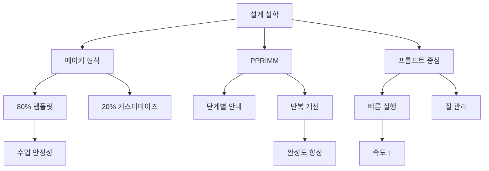

---

## 📚 전체 8차시 구조 (v4 주제 반영)
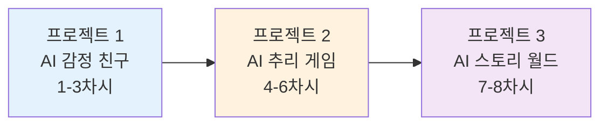

- **80/20 원칙**: 제공 템플릿(80%)을 그대로 사용하고, 캐릭터/테마/색상/난이도 등 20%만 개인화
- **각 블록의 PPRIMM 포커스**:
  - 1-3차시(프로젝트1): Prompt/Preview/Review로 기획→UI→API 기초
  - 4-6차시(프로젝트2): Iterate/Modify로 복잡 로직/데이터/AI 연동 고도화
  - 7-8차시(프로젝트3): Prompt/Master로 창작/완성/발표

---

## 🧱 공통 시스템 아키텍처
```mermaid
graph LR
  subgraph App[Next.js App]
    UI[Pages/Components]
    ST[State (Hooks)]
  end
  API[/App Router API Routes/]
  OAI[(OpenAI API)]
  LS[(LocalStorage)]

  UI --> API --> OAI
  UI <--> ST
  ST <--> LS

  style App fill:#e1f5ff
  style API fill:#fff4e1
  style OAI fill:#ffe1f5
  style LS fill:#e1ffe1
```

---

## 🧭 PPRIMM 전체 흐름
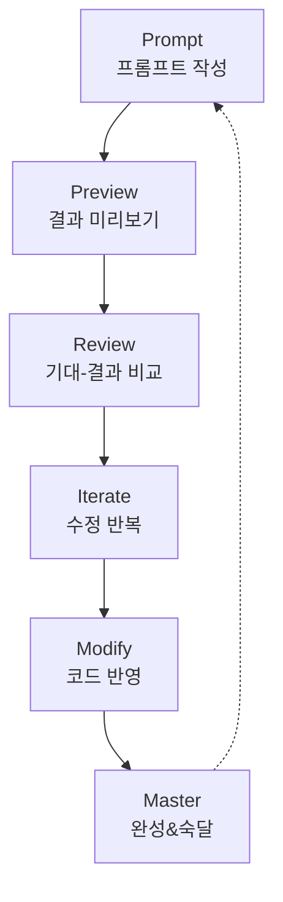


# 🎮 프로젝트 1: AI 감정 친구 (1-3차시) — 메이커+PPRIMM

## ✅ 목표 & 결과물
- 목표: 감정을 이해하고 공감해주는 AI 친구 만들기
- 결과물: 메인(감정선택) · 대화 · 기록(통계) 3화면 + ChatGPT API 연동 + 저장

## 🧩 80/20 개인화 범위
- 80%: 캐릭터 프레임/페이지 구성/저장 구조/기본 프롬프트
- 20%: 캐릭터 톤/색상 테마/환영 멘트/이모지/분석 문구

## 🗺️ 3차시 타임라인
```mermaid
gantt
  title 프로젝트1(1-3차시) 타임라인
  dateFormat mm
  section 1차시
  캐릭터/프롬프트/기능정의 :00, 50m
  section 2차시
  v0 UI 3화면 생성/통합   :00, 50m
  section 3차시
  API 연동/저장/테스트     :00, 50m
```

## 🧱 아키텍처(프로젝트1)
```mermaid
graph LR
  UI[Main/Chat/Record] --> API[/api/chat, /api/analyze-emotion]
  UI <--> LS[(localStorage)]
  API --> OAI[(OpenAI)]

  style UI fill:#e3f2fd
  style API fill:#fff4e1
  style OAI fill:#ffe1f5
  style LS fill:#e1ffe1
```

## 🗃️ 데이터 구조(프로젝트1)
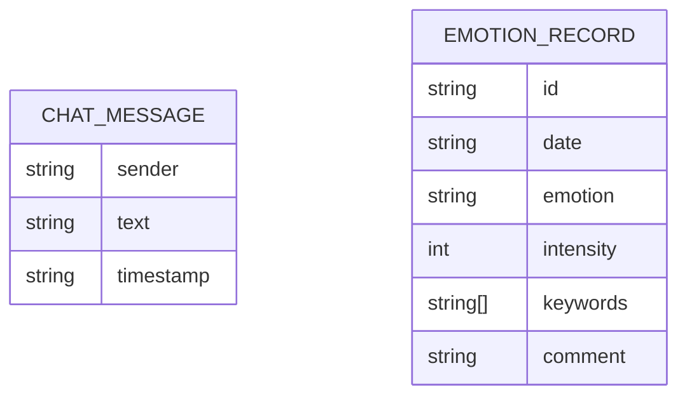

---

## 📅 1차시: 캐릭터 정의 + 시스템 프롬프트 + 기능 명세 (Prompt/Preview)

### 🧑‍🏫 교사용 가이드(요약)
- 데모 시연(2분) → 캐릭터 옵션 제시(3종) → 워크시트 → 프롬프트 테스트 → 기능 우선순위

### 👨‍🎓 학생 워크시트 핵심
- 캐릭터 이름/성격/말투/예시대사 3개
- 필수 기능 4개(감정선택/대화/일기/기록), 선택 기능 2개

### 🤖 시스템 프롬프트 템플릿
```
너는 10대 감정 친구 '[캐릭터명]'이야.

성격:
- [따뜻함/차분함/유머러스] (3개 키워드)

말투:
- [반말/이모지/짧은 2-3문장]
- 자주 쓰는 표현: [예: "음...", "괜찮아"]

역할/규칙:
- 먼저 공감 → 판단 금지 → 필요시 짧은 조언
- 금지: "별거 아니야", "네 잘못", 강요형 표현, 4문장 이상

상황 예시:
사용자: "친구랑 싸웠어"
너: [캐릭터 톤으로 2-3문장 공감/질문]
```

### ✅ 산출물 체크리스트(1차시)
- [ ] 캐릭터 설정 완료(키워드 3개+대사 1개)
- [ ] 시스템 프롬프트 초안 작성
- [ ] 기능 우선순위(MUST 4, SHOULD 2)

---

## 📅 2차시: UI 제작(v0) — 메인/대화/기록 (Review)

### v0 프롬프트 템플릿 — 메인 화면
```
"감정 일기 & AI 친구 앱 메인 화면을 만들어줘.

레이아웃:
- 상단: 앱 이름(중앙), 날짜(작게)
- 중앙: "오늘 기분은 어때?" + 감정 5개 원형 버튼(😊😢😡😰😐)
- 하단: [💬 대화하기] [📔 일기쓰기] [📊 기록보기] 3버튼(세로)

스타일:
- 파스텔 톤, 둥근 모서리, 충분한 여백
- hover: scale-110, ring-4
- bg-gradient-to-br from-purple-50 via-pink-50 to-blue-50

Tech: Next.js, Tailwind, 반응형"
```

### v0 프롬프트 템플릿 — 대화/기록 화면(요약)
- 대화: 좌우 말풍선, 상단 프로필/상태, 하단 입력/전송
- 기록: 최다 감정 카드, 감정 비율 차트(Chart.js), 일별 리스트

### ✅ 산출물 체크리스트(2차시)
- [ ] 메인/대화/기록 3화면 생성
- [ ] 하단 네비게이션/라우팅 연결
- [ ] 기본 인터랙션(hover, 이동) 동작

---

## 📅 3차시: API 연동/저장/테스트 (Iterate/Modify/Master)

### API 라우트 개요
```mermaid
graph LR
  FE[Chat Page] -->|POST message,emotion,history| CHAT[/api/chat]
  CHAT --> OAI[(OpenAI Chat)]
  FE <--> LS[(chatHistory, todayEmotion)]
```

### API 설계(요약)
- POST `/api/chat`: { message, emotion, chatHistory } → { response, timestamp }
- POST `/api/analyze-emotion`: { diaryText } → { emotion, intensity, keywords[], comment }

### 저장 키(권장)
- `todayEmotion`, `chatHistory`, `emotionRecords`

### ✅ 산출물 체크리스트(3차시)
- [ ] 대화 요청/응답 정상
- [ ] 기록 저장/로드 정상
- [ ] 새로고침 후 데이터 유지
- [ ] 오류 시 사용자 메시지 표시

---

## 📊 프로젝트1 평가 기준(간단 루브릭)
| 항목 | 상(5) | 중(3) | 하(1) |
|------|------|------|------|
| 기획/프롬프트 | 캐릭터/규칙 명확 | 기본 작성 | 모호함 |
| UI/UX | 3화면 완성/일관성 | 기본 화면 | 불완성 |
| API/저장 | 연동/저장/오류처리 | 일부 동작 | 미동작 |
| 창의성(20%) | 말투/테마/인사이트 | 일부 반영 | 미반영 |


# 🕵️ 프로젝트 2: AI 추리 게임 (4-6차시) — 메이커+PPRIMM

## ✅ 목표 & 결과물
- 목표: AI가 매번 다른 사건을 생성하고, 용의자/NPC와 대화하며 추리로 결론 도출
- 결과물: 사건 생성 API + 게임 UI(메인/탐색/결과) + NPC 심문 API + 점수 시스템

## 🧩 80/20 개인화 범위
- 80%: 사건 JSON 스키마/탐색 탭 UI/점수 규칙/프롬프트 템플릿
- 20%: 난이도(쉬움/보통/어려움), 테마(저택/회사/학교/호텔), 색감/타이포

## 🗺️ 3차시 타임라인


## 🧱 아키텍처(프로젝트2)
```mermaid
graph LR
  GEN[/api/generate-case] --> OAI[(OpenAI)]
  INT[/api/interrogate] --> OAI
  UI[Main/Explore/Result] <--> LS[(localStorage)]
  UI --> GEN
  UI --> INT

  style UI fill:#e3f2fd
  style GEN fill:#fff4e1
  style INT fill:#fff4e1
  style OAI fill:#ffe1f5
```

## 🗃️ 핵심 데이터(요약)
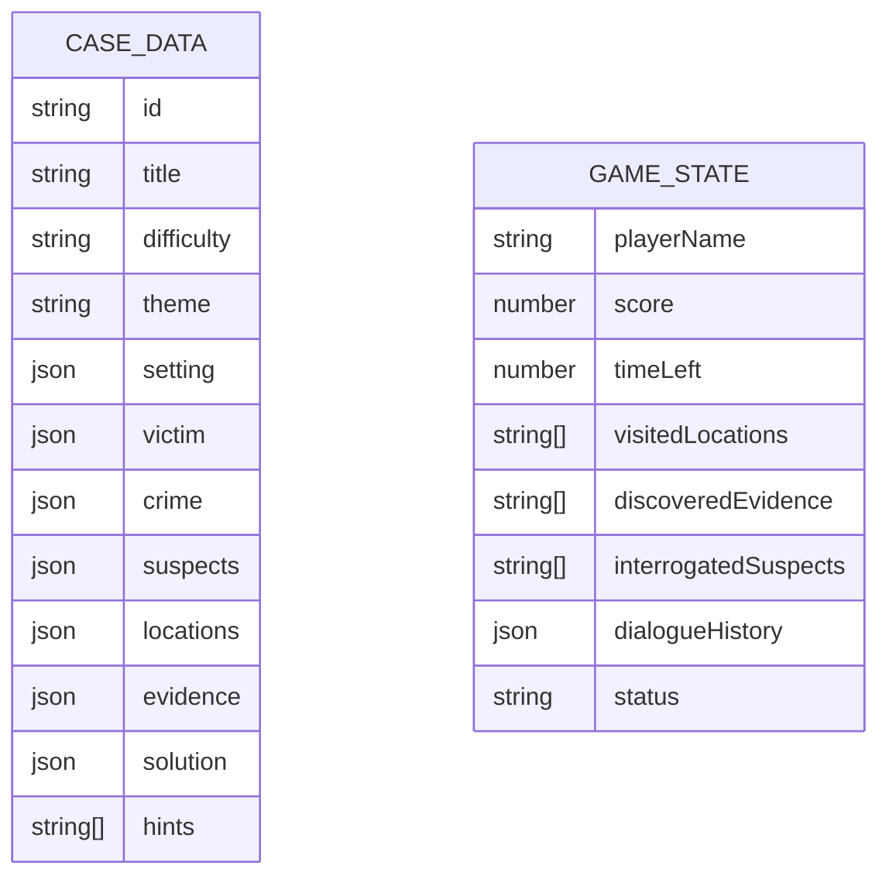

---

## 📅 4차시: 사건 생성기 + 기획/데이터 (Prompt/Preview)

### 🤖 사건 생성 프롬프트(템플릿)
```
당신은 추리 게임 시나리오 작가입니다. 아래 JSON 스키마에 맞춰 사건을 생성해주세요.

난이도: [쉬움|보통|어려움]
테마: [고전 저택|현대 회사|학교|호텔]

[스키마 요약]
- title, setting(location/time/description)
- victim(name/age/role/background)
- crime(type/what/when/where)
- suspects[3-4]: name/age/role/personality/alibi/suspiciousPoint/motive/isCulprit
- locations[4-5]: name/description/clues[]
- evidence[5-7]: id/name/icon/description/foundAt/relatedTo/importance(1-5)
- solution: culprit/motive/method/timeline/keyEvidence[3]
- hints[3]

규칙:
- 고등학생 난이도, 20분 내 해결 가능
- 논리적 일관성 유지(타임라인/증거/알리바이)
- 반전 요소 1, 허위 증거 1-2
```

### ✅ 체크리스트(4차시)
- [ ] /api/generate-case 응답 JSON 정상
- [ ] 사건 미리보기 페이지에서 표시
- [ ] 난이도/테마 옵션 적용

---

## 📅 5차시: 게임 UI 제작 (Review/Iterate)

### v0 프롬프트 — 3화면
```
"미스터리 추리 게임 UI를 만들어줘.

화면:
1) 메인: 사건 제목/브리핑/시작 버튼
2) 탐색: 탭 3개(장소/용의자/증거) + 타이머 + 힌트 버튼
3) 결과: 점수 카드 + 정답 공개 + 다시하기

디자인: 빈티지 탐정(세피아/갈색/금색), 카드/리스트 혼합
Tech: Next.js 14, Tailwind"
```

### 점수 규칙(권장)
| 항목 | 점수 |
|------|------|
| 범인 정확 | 40 |
| 동기 정확 | 20 |
| 방법 정확 | 20 |
| 결정적 증거 3개 | 15 |
| 시간 보너스 | 5 |

### ✅ 체크리스트(5차시)
- [ ] 메인→탐색→결과 네비 연결
- [ ] 탭 전환/타이머/힌트 UI 동작
- [ ] 사건 데이터 바인딩(제목/용의자/증거)

---

## 📅 6차시: NPC 심문/통합/테스트 (Modify/Master)

### 🤖 심문 프롬프트(템플릿)
```
당신은 추리 게임 NPC "[용의자 이름]"입니다.

프로필:
- 성격: [personality]
- 알리바이: [alibi]
- 범인 여부: [isCulprit]

규칙:
- 성격에 맞게 자연스럽게 답변(2-3문장)
- 범인인 경우 회피/애매, 직접 부인 금지
- 일관성 유지(알리바이/증거와 충돌 금지)
```

### 통합 플로우
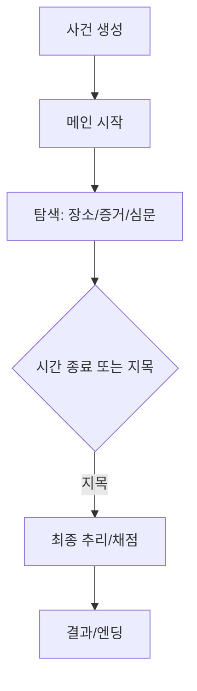

### ✅ 체크리스트(6차시)
- [ ] /api/interrogate 연결/응답 표시
- [ ] 대화 기록 저장/재현
- [ ] 최종 추리/채점/엔딩 표시

---

## 📊 프로젝트2 평가 기준
| 항목 | 상(5) | 중(3) | 하(1) |
|------|------|------|------|
| 사건 생성 | 논리/다양성/난이도 적절 | 기본 생성 | 불일치 다수 |
| 게임 UI | 탐색/타이머/힌트 작동 | 기본 동작 | 불완전 |
| 심문/통합 | 심문/채점/엔딩 완비 | 일부 동작 | 미동작 |
| 창의(20%) | 테마/난이도/연출 우수 | 일부 반영 | 미반영 |


# 📖 프로젝트 3: AI 스토리 월드 (7-8차시) — 메이커+PPRIMM

## ✅ 목표 & 결과물
- 목표: 사용자 선택에 따라 분기하는 스토리를 AI로 생성/저장/공유
- 결과물: 스토리 생성 API + 스토리북 UI + 선택 분기 로직 + (선택) 이미지 생성

## 🧩 80/20 개인화 범위
- 80%: 장면 JSON 스키마/스토리북 레이아웃/선택지 3개/엔딩 규칙
- 20%: 장르/톤&무드/색상/타이포/엔딩 문구

## 🗺️ 2차시 타임라인
```mermaid
gantt
  title 프로젝트3(7-8차시) 타임라인
  dateFormat mm
  section 7차시
  스토리 API/스토리북 UI/분기 설계 :00, 50m
  section 8차시
  완성/저장&공유/(선택)이미지/발표 :00, 50m
```

## 🧱 아키텍처(프로젝트3)
```mermaid
graph LR
  GEN[/api/generate-story] --> OAI[(OpenAI)]
  UI[Storybook UI] <--> LS[(stories)]
  IMG[/api/generate-image (선택)] --> OAI

  style UI fill:#e3f2fd
  style GEN fill:#fff4e1
  style IMG fill:#fff4e1
  style OAI fill:#ffe1f5
```

## 🗃️ 장면 데이터(요약)
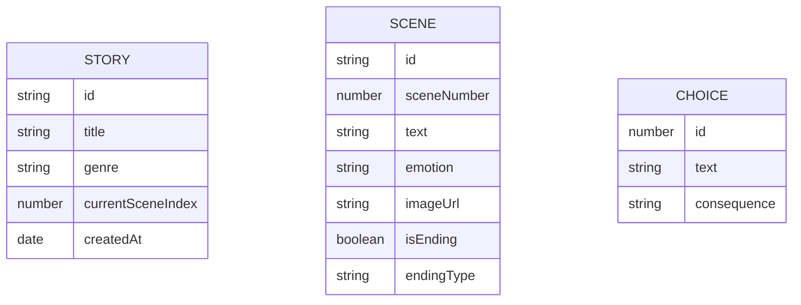

---

## 📅 7차시: 스토리 생성 API + 스토리북 UI (Prompt/Preview/Review)

### 🤖 스토리 생성 프롬프트(템플릿)
```
당신은 인터랙티브 스토리 작가입니다. 아래 JSON에 맞게 다음 장면을 생성하세요.

입력:
- currentScene: "이전 장면 텍스트"
- userChoice: "사용자 선택"
- context: "줄거리 요약"

출력(JSON):
{
  "sceneText": "3-4문장",
  "emotion": "신비로운|긴장감|평화로운|위험한",
  "choices": [
    {"id":1, "text":"선택1", "consequence":"힌트"},
    {"id":2, "text":"선택2", "consequence":"힌트"},
    {"id":3, "text":"선택3", "consequence":"힌트"}
  ],
  "imagePrompt": "영어 50단어(선택)",
  "isEnding": true|false,
  "endingType": "해피|새드|오픈"
}

규칙: 이전 선택 반영, 5-7장면 안에 엔딩 도달, 학생 적합
```

### v0 프롬프트 — 스토리북 UI
```
"인터랙티브 스토리북 UI를 만들어줘.
- 상단: 제목/장면 번호
- 중앙: 장면 텍스트(타이핑 효과)
- 하단: 선택지 3개(호버 시 힌트)
- 페이지 넘김 애니메이션
- 분위기: 동화책 느낌(세리프 폰트/부드러운 색)
Tech: Next.js, Tailwind, Framer Motion"
```

### ✅ 체크리스트(7차시)
- [ ] /api/generate-story 응답 정상
- [ ] 선택→다음 장면 생성 흐름 동작
- [ ] 스토리 저장/불러오기

---

## 📅 8차시: 완성/공유/발표 (Iterate/Modify/Master)

### 선택: 이미지 생성(DALL·E) 프롬프트(요약)
```
장면을 묘사하는 이미지 프롬프트를 영어로 만들어줘.
스타일: [watercolor|storybook|noir]
색감: [pastel|warm|cool]
구성: 주요 오브젝트 3개, 배경 디테일 2개
```

### 발표 구조(5분)
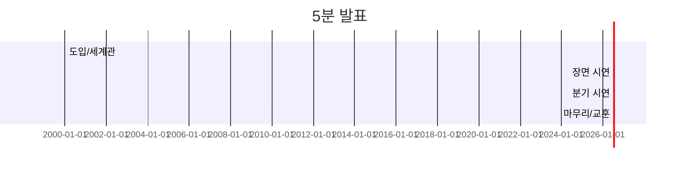

### ✅ 체크리스트(8차시)
- [ ] 최소 3가지 엔딩 확인
- [ ] 스토리 JSON 내보내기/공유
- [ ] 발표 스크립트 3분 버전 작성

---

## 📊 프로젝트3 평가 기준
| 항목 | 상(5) | 중(3) | 하(1) |
|------|------|------|------|
| 스토리 생성 | 분기/일관성/완결성 | 기본 분기 | 비논리 |
| 스토리북 UI | 타이핑/애니메/선택 | 기본 표시 | 불완전 |
| 저장/공유 | 저장/불러오기/공유 | 일부 동작 | 미동작 |
| 창의(20%) | 장르/톤/연출 우수 | 일부 반영 | 미반영 |

---

# 🧑‍🏫 교사용 종합 가이드(요약)

## 운영 팁
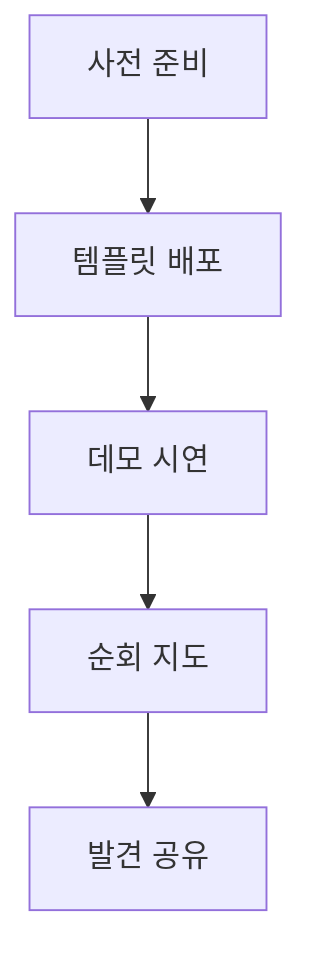
- 사전: API 키/프로젝트 템플릿/v0 계정/워크시트
- 진행: 80%는 동일 안내, 20% 개인화 피드백
- 이슈: 네트워크/의존성/포트 충돌 → 즉시 가이드 마련

## 평가(총 100)
- 프로젝트1: 30(기획/프롬프트/기본 연동)
- 프로젝트2: 40(사건/심문/게임 UI)
- 프로젝트3: 30(스토리/분기/UI/발표)

---

## 📊 전체 커리큘럼 맵
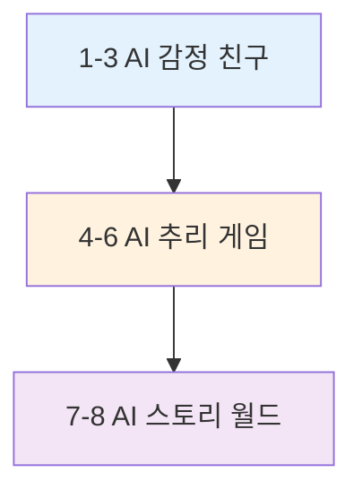


---

## 🔬 프로젝트 1 심화: 알고리즘 · 순서도 · 템플릿 세트

### 🎬 미리보기 결과(샘플)
```
대화 샘플
User: 오늘 친구랑 싸웠어...
AI(루나): 아... 많이 속상했겠다 😢 무슨 일이 있었는지 천천히 얘기해줄래? 내가 들어줄게 💙

localStorage 미리보기
- todayEmotion: {"emotion":"슬픔","date":"2025-11-02"}
- chatHistory: [{sender:"user",text:"..."},{sender:"luna",text:"..."}]
```

### 🧠 핵심 알고리즘: 응답 생성 파이프라인
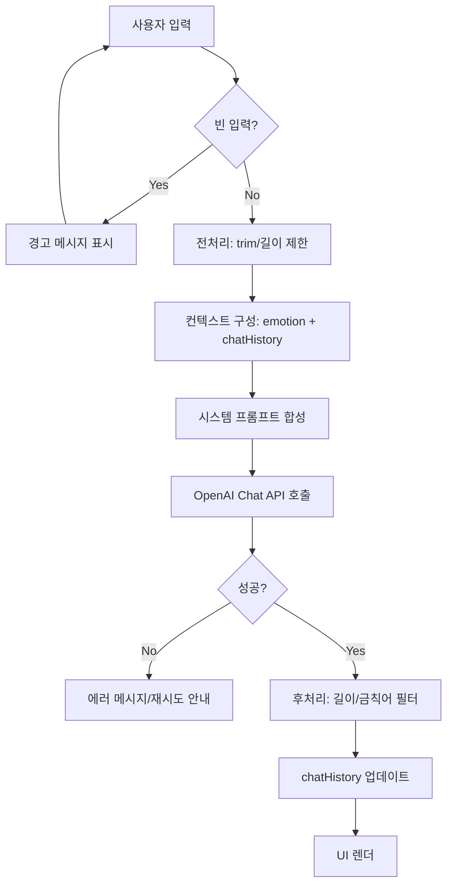

### 🔁 상태 머신 (대화 세션)
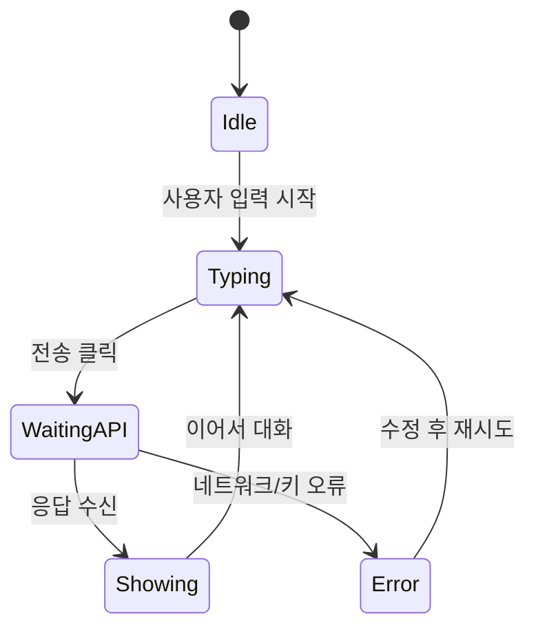

### 📡 시퀀스 다이어그램 (저장 포함)
```mermaid
sequenceDiagram
  participant U as 사용자
  participant UI as Chat UI
  participant API as /api/chat
  participant OAI as OpenAI
  participant LS as localStorage

  U->>UI: 메시지 입력/전송
  UI->>LS: 임시 저장(사용자 메시지)
  UI->>API: POST {message, emotion, history}
  API->>OAI: ChatCompletion 호출
  OAI-->>API: 응답 텍스트
  API-->>UI: {response, timestamp}
  UI->>LS: chatHistory 갱신
  UI-->>U: 화면에 응답 표시
```

### 🧩 프롬프트 템플릿 묶음
- 시스템 프롬프트 생성
```
너는 10대 감정 친구 "[이름]"이야. 성격:[3키워드], 말투:[반말/이모지/2-3문장].
규칙: 먼저 공감→판단 금지→필요시 짧은 조언. 금지:[무시/비난/강요/장문].
현재 감정:[기쁨/슬픔/화남/불안/보통]. 상황: "[사용자 문장]". 캐릭터 톤 유지.
```
- 말투/톤 튜닝
```
위 시스템 프롬프트의 톤을 더 [따뜻/차분/유머러스]하게 조정해줘.
예시 문장 3개를 포함하고, 금칙어/길이 규칙은 유지.
```
- 품질 리뷰(Review 단계)
```
다음 응답을 체크리스트로 평가하고 개선 버전을 제공해줘.
체크리스트: 1) 즉시 공감 2) 3문장 이내 3) 금칙어 없음 4) 캐릭터 말투 일관 5) 구체 질문 1개.
원문: "[응답]"
```
- 에러 복구
```
현재 OpenAI 호출 실패. 가능한 원인 3개와 사용자가 볼 친절 메시지 1개, 재시도 지침을 제안해줘.
```
- UI 마이크로카피 생성
```
감정 앱의 버튼/토스트/빈상태 문구 10개를 친근한 톤으로 만들어줘. 12자 이내, 이모지 1개 제한.
```

### 🧪 테스트 케이스 (수용 기준)
- 입력/UX
  - 빈 입력 시 경고, Enter 전송, 버튼 비활성화 동작
- API/저장
  - 5회 연속 요청 안정, 새로고침 후 기록 유지
- 품질
  - 90% 응답이 3문장 이하, 금칙어 0회, 첫 문장 공감 100%

---

## 🔬 프로젝트 2 심화: 알고리즘 · 상태/시퀀스 · 템플릿

### 🎯 채점 알고리즘(권장)
```mermaid
graph TD
  A[최종 지목 입력] --> B[범인 일치 점수 40]
  A --> C[동기 일치 점수 20]
  A --> D[방법 일치 점수 20]
  A --> E[증거 3개 제출 점수 15]
  A --> F[시간 보너스 5]
  B --> G[총점 계산]
  C --> G
  D --> G
  E --> G
  F --> G
  G --> H{등급}
  H -->|90-100| S1[명탐정]
  H -->|70-89| S2[유능]
  H -->|50-69| S3[견습]
  H -->|<50| S4[재도전]
```

### 🧭 게임 상태 머신
```mermaid
stateDiagram-v2
  [*] --> NotStarted
  NotStarted --> Briefing: 사건 생성 완료
  Briefing --> Exploration: 타이머 시작(20분)
  Exploration --> Inference: 지목 선택/시간 만료
  Inference --> Result: 채점/엔딩
  Result --> NotStarted: 다시하기
```

### 📡 시퀀스(심문 흐름)
```mermaid
sequenceDiagram
  participant P as Player
  participant UI as Explore UI
  participant INT as /api/interrogate
  participant OAI as OpenAI

  P->>UI: 용의자 선택/질문 입력
  UI->>INT: POST {suspect, question, caseContext}
  INT->>OAI: ChatCompletion(system: NPC 역할)
  OAI-->>INT: 답변
  INT-->>UI: answer
  UI-->>P: 대화 말풍선 표시 + 기록 저장
```

### 🧩 프롬프트 템플릿 묶음
- 사건 생성 다양화
```
난이도:[쉬움/보통/어려움], 테마:[저택/회사/학교/호텔].
레드헤링 2개 포함, 결정적 증거 3개 명확, 타임라인 모순 금지.
스키마에 맞춘 JSON만 출력.
```
- NPC 심문 톤 조절
```
NPC "[이름]"의 성격을 [까칠/소심/허세]로 강화. 범인인 경우 회피/반문 전략 2가지 포함.
```
- 최종 평가 프롬프트(설명형)
```
플레이어 답안을 다음 기준으로 평가하고 피드백을 생성해줘.
기준: 범인/동기/방법/증거.
각 항목 점수와 보완 팁 1줄.
```

### 🧪 테스트 케이스
- 사건 무결성: 범인 1명, 타임라인/알리바이/증거 간 상호 일관성
- UI: 탭 전환/타이머/힌트/기록 표시
- 심문: 5회 연속 호출 지연<2s(로컬 기준) 또는 로딩 UI 정상

---

## 🔬 프로젝트 3 심화: 분기 알고리즘 · 플로우 · 템플릿

### 🌿 분기 관리 알고리즘(루프 방지/완결 보장)
```mermaid
graph TD
  A[현재 장면] --> B{엔딩?}
  B -->|Yes| Z[스토리 종료]
  B -->|No| C[선택지 3개 표시]
  C --> D[선택 기록 push]
  D --> E[컨텍스트 요약 업데이트]
  E --> F[다음 장면 생성(API)]
  F --> G{깊이 ≥ 7?}
  G -->|Yes| H[엔딩 강제 생성 요청]
  G -->|No| A
```

### 📡 시퀀스(선택→장면 생성)
```mermaid
sequenceDiagram
  participant U as 사용자
  participant UI as Story UI
  participant API as /api/generate-story
  participant OAI as OpenAI
  participant LS as localStorage

  U->>UI: 선택지 클릭
  UI->>LS: 선택 스택 저장
  UI->>API: POST {currentScene, userChoice, context}
  API->>OAI: ChatCompletion(JSON 응답 요구)
  OAI-->>API: nextScene JSON
  API-->>UI: scene/choices/isEnding
  UI->>LS: scenes 배열 갱신
  UI-->>U: 새 장면/선택지 표시
```

### 🔁 상태 머신(스토리 진행)
```mermaid
stateDiagram-v2
  [*] --> Start
  Start --> Reading
  Reading --> Choosing: 타이핑 효과 종료
  Choosing --> Reading: 다음 장면 로드
  Reading --> Ending: isEnding=true
  Ending --> [*]
```

### 🧩 프롬프트 템플릿 묶음
- 장르/톤 제어
```
장르:[판타지/SF/미스터리/로맨스], 톤:[따뜻/긴장/신비].
금지: 폭력/부적절 요소, 학습자 부적합 내용.
각 장면은 3-4문장, 선택지 3개, 힌트 포함.
```
- 엔딩 생성 전환
```
현재 깊이:[n]. 다음 장면은 엔딩이어야 한다.
해피/새드/오픈 중 하나를 선택하고 여운이 남는 한 줄을 포함.
JSON 스키마 준수.
```
- 이미지 프롬프트 생성(선택)
```
장면 텍스트를 50단어 영어 프롬프트로 요약. 스타일:[storybook pastel], 구도:[mid-shot], 키워드 5개.
```

### 🧪 테스트 케이스
- 분기: 최소 3엔딩 도달 가능, 루프 없음, 7장면 이내 엔딩
- 저장/로드: 새로고침 후 이어보기 정상
- UI: 타이핑/전환 애니메이션 부드럽게(프레임드랍 無)

---

## 🧑‍🏫 운영 보강: 리스크/대응 · 프롬프트 바이브 루틴

### ⚠️ 위험요소와 즉시 대응
```mermaid
graph TB
  A[네트워크 느림] --> B[v0 대신 로컬 UI 템플릿]
  A --> C[API 호출 타임아웃 8s]
  D[OpenAI 키 문제] --> E[백업 키/모의 응답]
  F[학생 편차] --> G[체크리스트/짝프로그래밍]
```

- 네트워크: v0 미사용 플랜(미리 준비된 UI 코드 조각) 배포
- API: 실패 시 모의 응답 JSON 표시로 흐름 유지
- 편차: 프롬프트 템플릿 복붙 우선, 20% 커스터마이즈는 마무리 후

### 🔄 프롬프트 바이브 루틴(PPRIMM 반복문)
```mermaid
graph LR
  T1[Template 복붙] --> T2[내 맥락 주입]
  T2 --> T3[Preview 보고 체크리스트 점검]
  T3 --> T4[개선 포인트 2개만 수정]
  T4 --> T5[반복 최대 3회]
  T5 --> T6[Master: 고정/공유]
```

