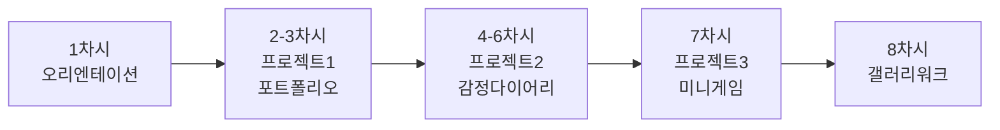
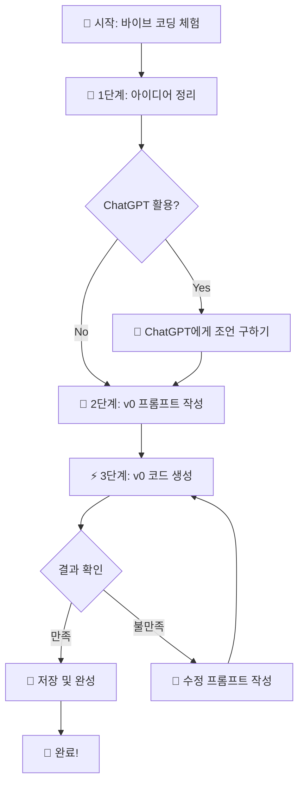
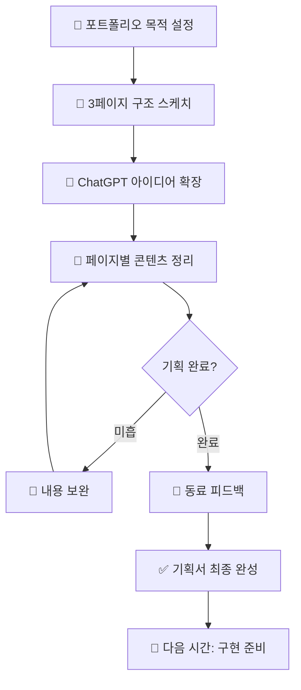
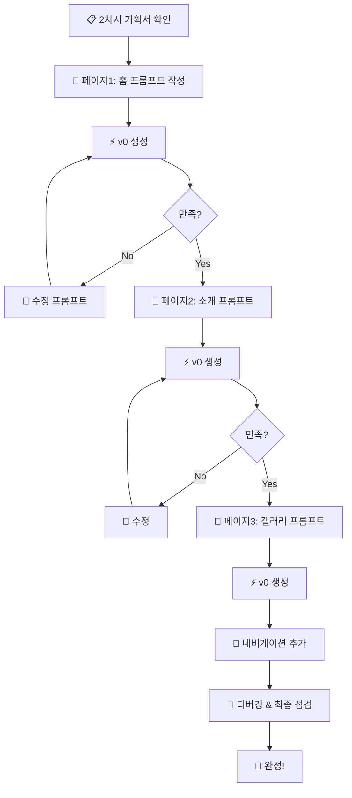
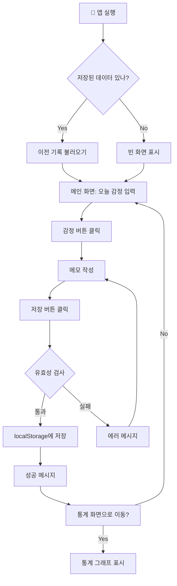
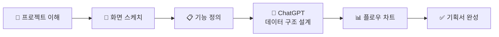

# 🎨 9학년 바이브 코딩 커리큘럼 (8차시)

## 📌 학년 목표 및 핵심 역량

### 학습 목표
- **자기표현**: 나만의 이야기를 웹으로 표현하기
- **AI 협업**: ChatGPT와 v0를 활용한 창작 경험
- **문제 해결**: 디버깅을 통한 문제 해결 능력 향상
- **프로세스 이해**: 기획 → 설계 → 구현 → 테스트 과정 체험

### 핵심 역량
| 역량 | 세부 내용 | 평가 방법 |
|------|----------|----------|
| **AI 리터러시** | 효과적인 프롬프트 작성, AI와 대화 | 프롬프트 품질 평가 |
| **기획 능력** | 아이디어 구체화, 구조 설계 | 기획서/스케치 평가 |
| **디버깅 능력** | 에러 해결, ChatGPT 활용 | 문제 해결 과정 관찰 |
| **창의성** | 독창적 아이디어, 디자인 | 결과물 창의성 평가 |

---

## 📚 전체 8차시 개요



| 차시 | 주제 | 프로젝트 | 결과물 | 핵심 도구 |
|------|------|---------|--------|----------|
| 1 | 바이브 코딩 체험 | 자기소개 카드 | 디지털 명함 1개 | ChatGPT, v0 |
| 2 | 프로젝트 기획 | 나만의 포트폴리오 | 기획서 + 스케치 | ChatGPT, 종이 |
| 3 | 디자인 구현 | 포트폴리오 완성 | 3페이지 포트폴리오 | v0 |
| 4 | 데이터 설계 | 감정 다이어리 기획 | 데이터 구조도 | ChatGPT |
| 5 | UI 제작 | 감정 입력 화면 | 입력 페이지 | v0 |
| 6 | 기능 구현 | 통계 및 저장 | 완성된 다이어리 | v0, ChatGPT |
| 7 | 미니 게임 | 간단한 게임 | 클릭 게임 | v0 |
| 8 | 성찰 및 공유 | 전시회 | 포트폴리오 전시 | - |

---

## 🎯 차시별 상세 커리큘럼

---

### 📅 1차시: 바이브 코딩 세계로 초대

#### 🎯 차시 목표
- 바이브 코딩 개념 이해하기
- ChatGPT와 v0 도구 체험하기
- 첫 번째 웹 카드 만들어보기

#### 📦 예상 결과물
✅ **개인별 디지털 명함 1개** (자기소개 카드)

#### 🧑‍🏫 교사용 지시서

##### 수업 전 준비사항
- [ ] ChatGPT 계정 확인 (학생별 또는 공용)
- [ ] v0.dev 접속 확인
- [ ] 예시 작품 3개 준비 (화면 공유용)
- [ ] 학생용 워크시트 출력 (프롬프트 작성 가이드)

##### 수업 진행 (50분)

| 시간 | 활동 | 교사 행동 | 학생 활동 |
|------|------|----------|----------|
| **5분** | 도입 | - 바이브 코딩 소개 영상 (2분)<br/>- "코딩 없이 웹사이트 만들기" 개념 설명 | - 영상 시청<br/>- 질문 떠올리기 |
| **10분** | 도구 소개 | - ChatGPT 시연: "자기소개 카드에 뭐 넣을까?" 질문<br/>- v0 시연: 실시간으로 카드 생성 | - 화면 관찰<br/>- 메모하기 |
| **5분** | 기획 | - 워크시트 배부<br/>- "내 카드에 들어갈 3가지 정보" 적기 지도 | - 워크시트 작성<br/>(이름, 취미, 꿈) |
| **25분** | 실습 | - 순회지도<br/>- 프롬프트 피드백<br/>- 기술적 문제 해결 | - v0에 프롬프트 입력<br/>- 카드 생성<br/>- 내용 수정 |
| **5분** | 정리 | - 2-3명 작품 공유<br/>- 다음 시간 예고 | - 작품 감상<br/>- 저장하기 |

##### 교사 스크립트 예시

```
[도입]
"여러분, 오늘부터 우리는 특별한 코딩을 배웁니다. 
코드를 한 줄도 쓰지 않고, AI에게 '말'로 설명하면 
웹사이트가 만들어져요. 이게 바로 '바이브 코딩'입니다!"

[시연]
"제가 ChatGPT에게 물어볼게요. 
'자기소개 카드에 어떤 내용을 넣으면 좋을까?'
보세요, ChatGPT가 아이디어를 주네요!"

[실습 시작]
"이제 여러분 차례입니다. 워크시트에 
1) 내 이름/별명
2) 가장 좋아하는 것 3가지
3) 10년 후 내 모습
을 적어보세요. 이게 우리 카드의 재료입니다!"
```

##### 자주 나오는 질문 & 답변

| 학생 질문 | 교사 답변 |
|----------|----------|
| "ChatGPT가 이상한 답을 줘요" | "더 구체적으로 질문해보세요. '자기소개 카드'보다 '학생용 자기소개 카드에 들어갈 항목 5가지'라고 물어보세요" |
| "v0가 내가 원하는 색이 아니에요" | "v0에게 '배경을 파란색으로 바꿔줘'라고 말해보세요. 여러 번 수정할 수 있어요!" |
| "어렵게 느껴져요" | "괜찮아요! 오늘은 체험하는 날이에요. 완벽하지 않아도 돼요. 일단 만들어보는 게 중요해요." |

---

#### 👨‍🎓 학생용 활동 시나리오

##### 미션: 나만의 디지털 명함 만들기

**Step 1: 아이디어 정리 (5분)**

📝 **워크시트 작성하기**
```
┌─────────────────────────────┐
│ 나의 디지털 명함 기획서      │
├─────────────────────────────┤
│ 1. 내 이름/별명:             │
│    _______________________   │
│                             │
│ 2. 좋아하는 것 3가지:        │
│    ① __________________     │
│    ② __________________     │
│    ③ __________________     │
│                             │
│ 3. 나를 표현하는 색:         │
│    _______________________   │
│                             │
│ 4. 10년 후 내 모습:          │
│    _______________________   │
└─────────────────────────────┘
```

**Step 2: ChatGPT에게 조언 구하기 (선택)**

```
💬 ChatGPT에게 질문 예시:

"나는 게임과 그림 그리기를 좋아하는 중학생이야. 
자기소개 카드를 만들 건데, 어떤 디자인이 좋을까?"
```

**Step 3: v0로 카드 만들기 (20분)**

🎨 **v0 프롬프트 작성 예시**

```
[초보자용 - 간단하게]
"자기소개 카드를 만들어줘.
- 가운데 이름: [내 이름]
- 좋아하는 것: 게임, 그림, 음악
- 배경: 파스텔 핑크색
- 카드 크기: 중간
Next.js로 만들어줘"

[도전용 - 구체적으로]
"학생용 디지털 명함을 만들어줘.

레이아웃:
- 상단: 큰 이름 (굵은 글씨)
- 중간: 프로필 사진 영역 (원형, 150px)
- 하단: 좋아하는 것 3개 (아이콘과 함께)

스타일:
- 배경: 그라데이션 (연보라 → 하늘색)
- 카드: 흰색, 그림자 효과
- 폰트: 깔끔하고 읽기 쉬운 서체

기능:
- 카드에 마우스 올리면 살짝 위로 올라가는 애니메이션

Next.js와 Tailwind CSS 사용"
```

**Step 4: 수정하기 (5분)**

🔧 **수정 프롬프트 예시**
```
"배경을 더 밝게 해줘"
"이름 글씨를 2배 크게 해줘"
"카드를 좀 더 작게 만들어줘"
"아이콘을 더 귀엽게 바꿔줘"
```

**Step 5: 완성 및 저장**

✅ 체크리스트:
- [ ] 내 정보가 정확하게 들어갔나?
- [ ] 디자인이 마음에 드나?
- [ ] 글씨가 잘 보이나?
- [ ] 스크린샷 저장했나?

---

#### 🔄 기능 프로세스



---

#### 📊 평가 기준

| 항목 | 상 (3점) | 중 (2점) | 하 (1점) |
|------|---------|---------|---------|
| **결과물** | 모든 정보가 정확하고 완성도 높음 | 일부 정보 누락, 기본 완성 | 미완성 또는 정보 부족 |
| **프롬프트** | 구체적이고 명확한 지시사항 | 기본 요구사항 포함 | 너무 간단하거나 불명확 |
| **참여도** | 적극적으로 실습 및 질문 | 실습 완료 | 소극적 참여 |

---

#### 💡 교사 TIP

```
✅ 성공 포인트:
- 첫 시간은 "체험"이 목표! 완벽함보다 재미를 우선으로
- 프롬프트 예시를 칠판에 크게 적어두기
- 빠른 학생은 친구 도와주기 역할 부여

⚠️ 주의사항:
- v0 생성 시간이 걸릴 수 있음 (대기 중 다른 학생 지도)
- 일부 학생은 기술적 막힘 → 미리 준비된 예시 제공
- 개인정보 노출 주의 (실명보다 별명 사용 권장)
```

---

### 📅 2차시: 나만의 포트폴리오 기획하기

#### 🎯 차시 목표
- 3페이지 포트폴리오 구조 설계하기
- 페이지별 콘텐츠 기획하기
- 화면 스케치 및 구조도 그리기

#### 📦 예상 결과물
✅ **포트폴리오 기획서** (3페이지 구조도 + 콘텐츠 정리)

#### 🧑‍🏫 교사용 지시서

##### 수업 전 준비사항
- [ ] 포트폴리오 예시 3개 (다양한 스타일)
- [ ] 기획 워크시트 출력
- [ ] A4 용지 / 색연필 준비
- [ ] ChatGPT 접속 확인

##### 수업 진행 (50분)

| 시간 | 활동 | 교사 행동 | 학생 활동 |
|------|------|----------|----------|
| **5분** | 도입 | - 1차시 복습<br/>- 포트폴리오 개념 설명<br/>- "왜 포트폴리오가 필요할까?" 질문 | - 생각 나누기<br/>- 예시 관찰 |
| **10분** | 영감 찾기 | - 포트폴리오 예시 3개 공유<br/>- 각 예시의 장단점 분석<br/>- 3페이지 구조 설명 | - 예시 분석<br/>- 마음에 드는 스타일 선택 |
| **10분** | 구조 설계 | - 3페이지 구조 설명<br/>(홈-소개-작품)<br/>- 종이에 스케치하기 시범 | - 3페이지 구조 스케치<br/>- 레이아웃 그리기 |
| **20분** | 콘텐츠 기획 | - ChatGPT 활용 시연<br/>- 순회지도<br/>- 기획서 작성 도움 | - ChatGPT로 아이디어 확장<br/>- 기획서 작성 |
| **5분** | 공유 및 피드백 | - 2-3명 기획 공유<br/>- 동료 피드백<br/>- 다음 시간 준비사항 | - 발표 듣기<br/>- 피드백 주고받기 |

##### 교사 스크립트 예시

```
[도입]
"여러분이 대학 입시나 취업할 때 꼭 필요한 게 '포트폴리오'예요.
오늘은 나를 소개하는 3페이지 웹 포트폴리오를 기획합니다.
코딩은 다음 시간에! 오늘은 '무엇을 만들지' 정하는 날이에요."

[구조 설계]
"포트폴리오는 3페이지면 충분해요.
1페이지: 첫인상 (이름, 한 줄 소개, 사진)
2페이지: 내 이야기 (좋아하는 것, 특기, 경험)
3페이지: 연락처 또는 미니 갤러리

종이에 간단하게 그려보세요. 네모 박스로 충분해요!"
```

---

#### 👨‍🎓 학생용 활동 시나리오

##### 미션: 3페이지 포트폴리오 설계도 만들기

**Step 1: 포트폴리오 목적 정하기 (5분)**

```
❓ 질문: 내 포트폴리오를 누가 볼까?

☐ 친구들 (자랑하기 용)
☐ 선생님 (과제 제출용)
☐ 미래의 대학/회사 (입시/취업용)
☐ 나 자신 (기록용)

→ 목적에 따라 내용이 달라져요!
```

**Step 2: 3페이지 구조 스케치 (10분)**

📐 **종이에 그리기**

```
┌─────────────────┐
│  페이지 1: 홈    │
│  ┌───────────┐  │
│  │   사진    │  │
│  └───────────┘  │
│   [내 이름]     │
│  "한 줄 소개"   │
│   [더 보기 버튼] │
└─────────────────┘

┌─────────────────┐
│ 페이지 2: 소개   │
│  • 좋아하는 것   │
│  • 특기         │
│  • 경험 3가지   │
│  • 타임라인     │
└─────────────────┘

┌─────────────────┐
│ 페이지 3: 갤러리 │
│  [작품1] [작품2] │
│  [작품3] [작품4] │
│  • 연락처       │
└─────────────────┘
```

**Step 3: ChatGPT로 콘텐츠 아이디어 얻기 (10분)**

💬 **ChatGPT 질문 예시**

```
질문 1:
"중학생 포트폴리오에 어떤 내용을 넣으면 좋을까? 
나는 [내 특징]을 좋아해."

질문 2:
"자기소개 페이지에 타임라인을 만들고 싶어. 
어떤 사건을 넣으면 좋을까?"

질문 3:
"포트폴리오를 더 인상적으로 만들 아이디어 3가지를 추천해줘."
```

**Step 4: 기획서 작성 (15분)**

📋 **포트폴리오 기획서**

```
┌──────────────────────────────────┐
│     나만의 포트폴리오 기획서      │
├──────────────────────────────────┤
│ 프로젝트명: _________________    │
│ 목적: _______________________    │
│ 주요 색상: __________________    │
│ 전체 분위기: _________________   │
└──────────────────────────────────┘

📄 페이지 1: 홈 (첫인상)
┌─────────────────────────────────┐
│ • 들어갈 내용:                   │
│   - 이름: ___________________   │
│   - 한 줄 소개: ______________  │
│   - 메인 이미지: _____________  │
│   - 버튼: ____________________  │
│                                 │
│ • 디자인 컨셉:                   │
│   _____________________________│
└─────────────────────────────────┘

📄 페이지 2: 소개 (스토리)
┌─────────────────────────────────┐
│ • 섹션 1: 좋아하는 것 3가지      │
│   ① _________________________  │
│   ② _________________________  │
│   ③ _________________________  │
│                                 │
│ • 섹션 2: 특기/경험              │
│   _____________________________│
│   _____________________________│
│                                 │
│ • 섹션 3: 타임라인 (선택)        │
│   _____________________________│
└─────────────────────────────────┘

📄 페이지 3: 작품 / 연락
┌─────────────────────────────────┐
│ • 보여줄 작품 4개:               │
│   ① _________________________  │
│   ② _________________________  │
│   ③ _________________________  │
│   ④ _________________________  │
│                                 │
│ • 연락 방법:                    │
│   _____________________________│
└─────────────────────────────────┘
```

**Step 5: 동료 피드백 (5분)**

```
👥 짝과 기획서 교환하기

피드백 질문:
✓ 3페이지 구조가 명확한가요?
✓ 더 추가하면 좋을 내용이 있나요?
✓ 전체적인 느낌이 어떤가요?
```

---

#### 🔄 기획 프로세스



---

#### 📊 평가 기준

| 항목 | 상 (3점) | 중 (2점) | 하 (1점) |
|------|---------|---------|---------|
| **구조 설계** | 3페이지 구조 명확, 레이아웃 구체적 | 3페이지 구조 있으나 레이아웃 모호 | 구조 불명확 |
| **콘텐츠 기획** | 페이지별 내용 구체적, 창의적 | 기본 내용 포함 | 내용 부족 |
| **스케치** | 상세한 스케치, 요소 위치 명확 | 기본 스케치 | 스케치 미흡 |
| **ChatGPT 활용** | 효과적 질문, 아이디어 확장 | 기본 질문 | 미활용 또는 부적절 |

---

### 📅 3차시: v0로 포트폴리오 구현하기

#### 🎯 차시 목표
- 기획서를 바탕으로 v0 프롬프트 작성하기
- 3페이지 포트폴리오 구현하기
- 디버깅 및 수정하기

#### 📦 예상 결과물
✅ **작동하는 3페이지 포트폴리오 웹사이트**

#### 🧑‍🏫 교사용 지시서

##### 수업 전 준비사항
- [ ] 2차시 기획서 준비 (학생들)
- [ ] v0 프롬프트 예시 PPT
- [ ] 디버깅 가이드 유인물
- [ ] 백업용 예시 코드 준비

##### 수업 진행 (50분)

| 시간 | 활동 | 교사 행동 | 학생 활동 |
|------|------|----------|----------|
| **5분** | 도입 | - 기획서 확인<br/>- 프롬프트 작성 팁 공유<br/>- 시연 예고 | - 기획서 재확인<br/>- 프롬프트 작성 준비 |
| **10분** | 시연 | - 1페이지 프롬프트 작성 시연<br/>- v0 생성 과정 보여주기<br/>- 수정하는 방법 시연 | - 관찰 및 메모<br/>- 질문 준비 |
| **30분** | 실습 | - 순회지도<br/>- 프롬프트 피드백<br/>- 디버깅 도움<br/>- 진도 체크 | - 프롬프트 작성<br/>- v0로 페이지 생성<br/>- 수정 및 개선 |
| **5분** | 정리 | - 진행 상황 체크<br/>- 미완성 학생 과제 안내<br/>- 다음 시간 예고 | - 작업 저장<br/>- 진행 상황 체크 |

##### 교사 스크립트 예시

```
[프롬프트 작성 팁]
"좋은 프롬프트는 5가지를 포함해요:
1. 무엇을 만들지 (페이지 종류)
2. 어떤 내용이 들어가는지 (콘텐츠)
3. 어디에 배치할지 (레이아웃)
4. 어떤 느낌인지 (디자인 스타일)
5. 어떤 기술로 만들지 (Next.js, Tailwind)

예시를 보여드릴게요!"

[시연]
"제 기획서를 보세요. 홈 페이지에는 이름, 사진, 소개가 들어가네요.
이걸 v0에게 이렇게 설명합니다..."
[실제 프롬프트 작성 및 생성 과정 보여주기]

[디버깅 격려]
"에러가 나면 좌절하지 마세요! 
에러는 '여기를 고치세요'라는 친절한 신호예요.
에러 메시지를 ChatGPT에 붙여넣으면 해결책을 알려줍니다!"
```

---

#### 👨‍🎓 학생용 활동 시나리오

##### 미션: 3페이지 포트폴리오 구현하기

**Step 1: 페이지 1 (홈) 구현 (15분)**

🎨 **v0 프롬프트 작성**

```
[기본 템플릿]
"포트폴리오 홈 페이지를 만들어줘.

콘텐츠:
- 이름: [내 이름]
- 한 줄 소개: [내 소개 문구]
- 프로필 이미지 영역 (원형, 200px)
- 버튼: '더 알아보기'

레이아웃:
- 전체 중앙 정렬
- 세로 방향 배치
- 버튼은 하단에

디자인:
- 배경: 그라데이션 ([내가 선택한 색])
- 텍스트: 흰색, 깔끔한 폰트
- 버튼: 둥근 모양, [버튼 색상]

기능:
- 버튼 클릭하면 부드럽게 아래로 스크롤

Next.js, Tailwind CSS 사용"

[실제 예시]
"포트폴리오 홈 페이지를 만들어줘.

콘텐츠:
- 이름: 김바이브
- 한 줄 소개: '세상을 바꾸는 아이디어를 만들어요'
- 프로필 이미지 영역 (원형, 200px)
- 버튼: '내 이야기 보기'

레이아웃:
- 화면 전체를 차지하는 섹션
- 모든 요소 중앙 정렬
- 이름 → 이미지 → 소개 → 버튼 순서

디자인:
- 배경: 보라색에서 분홍색으로 그라데이션
- 이름: 매우 큰 폰트 (4xl), 굵게
- 소개: 중간 크기, 투명도 90%
- 버튼: 흰색 배경, 보라색 텍스트, 그림자 효과

기능:
- 버튼에 마우스 올리면 크기가 살짝 커지는 애니메이션
- 버튼 클릭 시 다음 섹션으로 부드럽게 스크롤

Next.js, Tailwind CSS, Framer Motion 사용"
```

✅ **체크포인트 1**
- [ ] 페이지가 생성되었나요?
- [ ] 내 정보가 정확히 들어갔나요?
- [ ] 디자인이 기획과 비슷한가요?

🔧 **수정이 필요하면**
```
"이름 글씨를 더 크게 해줘"
"배경 그라데이션을 더 밝게 해줘"
"버튼을 화면 아래쪽으로 더 내려줘"
"이미지 영역을 더 크게 (300px) 만들어줘"
```

---

**Step 2: 페이지 2 (소개) 구현 (10분)**

🎨 **v0 프롬프트**

```
"포트폴리오 소개 페이지를 만들어줘.

콘텐츠:
- 제목: '나를 소개합니다'
- 좋아하는 것 3가지 (아이콘과 함께)
  • [항목 1]
  • [항목 2]
  • [항목 3]
- 특기/경험 카드 3개
  각 카드: 제목, 짧은 설명, 날짜

레이아웃:
- 제목은 상단 중앙
- 좋아하는 것은 3열 그리드
- 경험 카드는 세로로 타임라인 형식

디자인:
- 배경: 흰색
- 카드: 연한 회색 배경, 둥근 모서리, 그림자
- 아이콘: 큰 이모지 또는 아이콘
- 타임라인: 왼쪽에 세로 선

기능:
- 스크롤하면 카드가 하나씩 페이드인 애니메이션

Next.js, Tailwind CSS 사용"
```

---

**Step 3: 페이지 3 (갤러리) 구현 (5분)**

🎨 **v0 프롬프트**

```
"포트폴리오 갤러리 페이지를 만들어줘.

콘텐츠:
- 제목: '내 작품들'
- 작품 카드 4개 (2x2 그리드)
  각 카드: 이미지 영역, 작품 제목, 짧은 설명
- 하단: 연락처 (이메일 아이콘)

레이아웃:
- 제목 상단
- 2x2 그리드 (모바일에서는 1열)
- 연락처 하단 중앙

디자인:
- 배경: 연한 파스텔
- 카드: 흰색, 호버 시 살짝 위로
- 이미지 영역: 회색 플레이스홀더

기능:
- 카드 클릭 시 확대 (모달)

Next.js, Tailwind CSS 사용"
```

---

**Step 4: 페이지 연결 및 네비게이션 (5분)**

🔗 **네비게이션 추가 프롬프트**

```
"이전에 만든 3개 페이지를 연결해줘.

상단에 고정 네비게이션 바 추가:
- 로고/이름 (왼쪽)
- 메뉴: 홈 / 소개 / 갤러리 (오른쪽)
- 반투명 배경
- 스크롤해도 상단 고정

기능:
- 메뉴 클릭하면 해당 섹션으로 부드럽게 스크롤
- 현재 보고 있는 섹션 메뉴 하이라이트"
```

---

**Step 5: 최종 점검 및 디버깅 (10분)**

🐛 **자주 나오는 문제 & 해결법**

| 문제 | 증상 | 해결 방법 |
|------|------|----------|
| **레이아웃 깨짐** | 요소들이 겹치거나 벗어남 | v0에게: "레이아웃을 다시 정렬해줘. 요소들이 겹치지 않게" |
| **글씨 안 보임** | 배경과 글자 색이 비슷함 | v0에게: "텍스트 색상을 더 진하게 해줘" |
| **버튼 작동 안 함** | 클릭해도 반응 없음 | ChatGPT: "버튼 onClick 이벤트가 작동하지 않아요" + 코드 붙여넣기 |
| **이미지 안 나옴** | 이미지 자리에 X 표시 | 정상 (플레이스홀더), 나중에 실제 이미지 업로드 |
| **모바일에서 이상함** | 핸드폰으로 보면 깨짐 | v0에게: "모바일 반응형으로 만들어줘" |

🆘 **ChatGPT 디버깅 질문 템플릿**

```
"[문제 상황]이 발생했어요.

현상: [자세한 설명]
예상: [원래 되어야 할 것]
코드: [문제가 있는 부분 붙여넣기]

어떻게 해결하면 될까요?"
```

---

✅ **최종 체크리스트**

```
포트폴리오 완성 확인:
□ 3개 페이지 모두 생성됨
□ 네비게이션이 작동함
□ 내 정보가 정확히 들어감
□ 디자인이 기획과 비슷함
□ 모바일에서도 잘 보임 (선택)
□ 버튼/링크가 작동함
□ 스크린샷 또는 URL 저장

미완성이면:
□ 어디까지 완성했는지 메모
□ 다음 시간에 이어서 작업
```

---

#### 🔄 구현 프로세스



---

#### 📊 평가 기준

| 항목 | 상 (4점) | 중 (2-3점) | 하 (1점) |
|------|---------|-----------|---------|
| **완성도** | 3페이지 모두 완성, 네비게이션 작동 | 2페이지 완성 또는 일부 기능 미흡 | 1페이지만 완성 |
| **프롬프트** | 구체적이고 체계적인 프롬프트 | 기본 프롬프트, 주요 요소 포함 | 불명확하거나 너무 간단 |
| **디자인** | 기획과 일치, 일관된 스타일 | 기본 디자인, 일부 불일치 | 디자인 미흡 |
| **문제 해결** | 디버깅 성공, ChatGPT 효과적 활용 | 일부 문제 해결 | 해결 시도 부족 |

---

#### 💡 교사 TIP

```
✅ 성공 포인트:
- 시연 시 실제 에러도 보여주기 (학생들이 덜 두려워함)
- 빠른 학생은 애니메이션 추가 도전 과제 제시
- "완벽"보다 "작동하는 것" 강조

⚠️ 주의사항:
- v0 생성 시간 고려 (대기 중 다음 단계 준비)
- 미완성 학생 위한 체크포인트 파일 준비
- 시간 부족 시 2페이지까지만 완성도 OK

🎯 차별화 지도:
- 빠른 학생: 다크모드 토글, 애니메이션 강화
- 느린 학생: 1페이지 포트폴리오로 축소, 내용에 집중
```

---

### 📅 4차시: 감정 다이어리 프로젝트 기획

#### 🎯 차시 목표
- 데이터 기반 프로젝트 이해하기
- 감정 다이어리 구조 설계하기
- 데이터 구조 설계하기 (localStorage)

#### 📦 예상 결과물
✅ **감정 다이어리 기획서** + **데이터 구조 설계 문서**

#### 🧑‍🏫 교사용 지시서

##### 수업 전 준비사항
- [ ] 감정 다이어리 데모 준비
- [ ] 데이터 구조 설명 PPT
- [ ] localStorage 개념 유인물
- [ ] 기획 워크시트 출력

##### 수업 진행 (50분)

| 시간 | 활동 | 교사 행동 | 학생 활동 |
|------|------|----------|----------|
| **5분** | 도입 | - 감정 다이어리 데모 시연<br/>- "왜 감정을 기록할까?" 질문 | - 데모 체험<br/>- 필요성 공감 |
| **10분** | 개념 학습 | - 데이터란 무엇인가?<br/>- localStorage 개념 설명<br/>- JSON 구조 간단 소개 | - 개념 이해<br/>- 메모하기 |
| **10분** | 기능 설계 | - 필요한 기능 브레인스토밍<br/>- 우선순위 정하기<br/>- MVP 개념 소개 | - 기능 목록 작성<br/>- 우선순위 표시 |
| **20분** | 데이터 설계 | - ChatGPT로 데이터 구조 설계<br/>- 예시 JSON 작성<br/>- 순회지도 | - ChatGPT 활용<br/>- 데이터 구조 설계<br/>- 기획서 작성 |
| **5분** | 정리 | - 기획 공유<br/>- 다음 시간 예고 | - 발표<br/>- 피드백 |

##### 교사 스크립트 예시

```
[도입 - 데모 시연]
"오늘부터 두 번째 프로젝트를 시작합니다!
포트폴리오는 '정적'인 페이지였다면,
감정 다이어리는 '데이터'를 저장하고 불러오는 '동적'인 프로젝트예요.

제가 만든 감정 다이어리를 보세요.
[화면 공유]
감정을 선택하고, 메모를 쓰고, 저장하면...
여기 통계로 보여지네요! 이게 바로 데이터가 쌓이는 거예요."

[데이터 개념 설명]
"여러분이 게임할 때 '저장'하잖아요? 그게 데이터 저장이에요.
우리 프로젝트도 마찬가지예요.
오늘 어떤 감정이었는지 저장하고, 나중에 다시 볼 수 있게 만들 거예요.

localStorage는 브라우저가 제공하는 '저장 공간'이에요.
서버 없이도 데이터를 저장할 수 있어요!"

[MVP 강조]
"완벽한 앱을 만들려고 하지 마세요.
먼저 '핵심 기능'만 만들고, 시간이 남으면 추가해요.
이게 바로 MVP (최소 기능 제품) 개념입니다!"
```

---

#### 👨‍🎓 학생용 활동 시나리오

##### 미션: 감정 다이어리 설계하기

**Step 1: 프로젝트 이해하기 (5분)**

```
❓ 감정 다이어리란?

✅ 매일 내 감정을 기록하는 앱
✅ 감정 패턴을 시각적으로 확인
✅ 셀프 케어와 자기 이해 도구

핵심 기능:
1. 감정 선택 (버튼 클릭)
2. 메모 작성
3. 저장하기
4. 과거 기록 보기
5. 통계 그래프
```

**Step 2: 화면 구성 그리기 (10분)**

📐 **종이에 스케치**

```
화면 1: 오늘의 감정 입력
┌────────────────────────┐
│ 오늘 기분은 어때요?     │
├────────────────────────┤
│ 😊 😢 😡 😰 😴        │
│ (5개 감정 버튼)         │
├────────────────────────┤
│ 메모를 적어보세요...    │
│ [                  ]   │
├────────────────────────┤
│     [저장하기]          │
└────────────────────────┘

화면 2: 통계 보기
┌────────────────────────┐
│ 이번 주 감정 리포트     │
├────────────────────────┤
│    😊 ■■■■■ 5회    │
│    😢 ■■ 2회          │
│    😡 ■ 1회            │
├────────────────────────┤
│ 가장 많은 감정: 행복    │
└────────────────────────┘

화면 3: 과거 기록 (선택)
┌────────────────────────┐
│ 11월 1일  😊           │
│ "친구들과 재미있게..."  │
├────────────────────────┤
│ 10월 31일 😢           │
│ "시험이 어려웠어요"     │
└────────────────────────┘
```

**Step 3: 필요한 기능 정리 (10분)**

📋 **기능 우선순위**

```
┌─────────────────────────────────┐
│      기능 목록 & 우선순위        │
├─────────────────────────────────┤
│ 🔴 필수 기능 (MVP)               │
│ □ 감정 선택 버튼 (5개)          │
│ □ 메모 입력창                   │
│ □ 저장 기능 (localStorage)      │
│ □ 저장된 데이터 보여주기         │
│                                 │
│ 🟡 중요 기능 (시간 있으면)        │
│ □ 통계 그래프                   │
│ □ 날짜별 정렬                   │
│ □ 감정 아이콘 애니메이션         │
│                                 │
│ 🟢 추가 기능 (여유 있으면)        │
│ □ 감정 일기 검색                │
│ □ 테마 변경 (다크모드)           │
│ □ 데이터 내보내기               │
└─────────────────────────────────┘
```

**Step 4: 데이터 구조 설계 (15분)**

💾 **ChatGPT와 함께 설계하기**

```
💬 ChatGPT 질문:

"감정 다이어리 앱을 만들고 있어요.
localStorage에 저장할 데이터 구조를 설계해줘.

저장할 정보:
- 날짜
- 선택한 감정 (5가지 중 하나)
- 메모
- 감정 점수 (1-5)

JSON 형식으로 예시를 보여줘."
```

📄 **ChatGPT가 제안한 데이터 구조 예시**

```javascript
// 한 개의 감정 기록
{
  "id": "20251102-001",
  "date": "2025-11-02",
  "time": "14:30",
  "emotion": "happy",
  "emotionIcon": "😊",
  "emotionName": "행복",
  "score": 5,
  "memo": "친구들과 축구하고 재미있었어요!",
  "tags": ["친구", "운동"]  // 선택 사항
}

// 전체 데이터 배열
[
  { /* 감정 기록 1 */ },
  { /* 감정 기록 2 */ },
  { /* 감정 기록 3 */ }
]
```

📝 **내 프로젝트 데이터 설계**

```
┌──────────────────────────────────┐
│      감정 다이어리 데이터 설계    │
├──────────────────────────────────┤
│ 저장할 정보:                      │
│ ✓ 날짜: YYYY-MM-DD 형식          │
│ ✓ 감정: [내가 선택할 5가지]       │
│   - _________________________    │
│   - _________________________    │
│   - _________________________    │
│   - _________________________    │
│   - _________________________    │
│ ✓ 메모: 최대 ___자               │
│ ✓ 점수: 1-5점                    │
│                                  │
│ localStorage 키 이름:             │
│ "emotionDiary" 또는 _________    │
└──────────────────────────────────┘
```

**Step 5: 기능 플로우 차트 (10분)**



**Step 6: 기획서 완성 (5분)**

📋 **최종 기획서**

```
┌───────────────────────────────────┐
│    감정 다이어리 프로젝트 기획서   │
├───────────────────────────────────┤
│ 프로젝트명: _________________     │
│ 목적: ________________________    │
│ 주요 색상: ____________________   │
│ 감정 5가지: ___________________   │
├───────────────────────────────────┤
│ 화면 수: __개                     │
│ 핵심 기능 __개:                   │
│ 1. __________________________     │
│ 2. __________________________     │
│ 3. __________________________     │
│                                   │
│ 데이터 구조: (위에서 설계한 것)    │
│ [JSON 구조 붙여넣기]              │
│                                   │
│ 다음 시간 구현 목표:               │
│ □ _________________________       │
│ □ _________________________       │
└───────────────────────────────────┘
```

---

#### 🔄 기획 프로세스



---

#### 📊 평가 기준

| 항목 | 상 (3점) | 중 (2점) | 하 (1점) |
|------|---------|---------|---------|
| **화면 설계** | 3개 화면 스케치, 요소 명확 | 2개 화면, 기본 요소 | 스케치 미흡 |
| **기능 정의** | 우선순위 명확, MVP 이해 | 기능 나열, 우선순위 모호 | 기능 정의 부족 |
| **데이터 구조** | JSON 구조 정확, ChatGPT 활용 | 기본 구조 이해 | 구조 불명확 |
| **플로우 차트** | 논리적 흐름, 예외 처리 포함 | 기본 흐름 | 미작성 또는 불완전 |

---

#### 💡 교사 TIP

```
✅ 성공 포인트:
- 데이터 개념을 생활 예시로 설명 (게임 저장, 메신저 대화 기록)
- localStorage를 "브라우저 메모장"으로 비유
- JSON은 "정리된 서랍"으로 비유

⚠️ 주의사항:
- 데이터 구조가 어려운 학생 → ChatGPT 답변 그대로 사용 OK
- 너무 많은 기능 기획 방지 → MVP 강조
- 기술 용어는 최소화, 개념 이해가 우선

🎯 핵심 메시지:
"데이터를 설계하는 것 = 정보를 체계적으로 정리하는 것"
```

---

### 📅 5차시: 감정 입력 화면 구현

#### 🎯 차시 목표
- v0로 감정 입력 UI 만들기
- 버튼 인터랙션 구현하기
- 입력 폼 완성하기

#### 📦 예상 결과물
✅ **작동하는 감정 입력 페이지** (5개 버튼 + 입력창 + 저장 버튼)

#### 🧑‍🏫 교사용 지시서

##### 수업 진행 (50분)

| 시간 | 활동 | 교사 행동 | 학생 활동 |
|------|------|----------|----------|
| **5분** | 도입 | - 4차시 기획 확인<br/>- 오늘 목표: 입력 화면 완성 | - 기획서 준비 |
| **10분** | 시연 | - 감정 버튼 프롬프트 작성 시연<br/>- v0 생성 과정 공유 | - 관찰 및 메모 |
| **30분** | 실습 | - 순회지도<br/>- 프롬프트 피드백<br/>- 인터랙션 테스트 도움 | - 프롬프트 작성<br/>- v0 생성<br/>- 버튼 테스트 |
| **5분** | 정리 | - 작동 확인<br/>- 다음 시간 예고 | - 저장 및 테스트 |

---

#### 👨‍🎓 학생용 활동 시나리오

##### 미션: 감정 입력 화면 만들기

**Step 1: 감정 버튼 섹션 (15분)**

🎨 **v0 프롬프트**

```
"감정 다이어리 입력 화면을 만들어줘.

구성:
- 제목: '오늘 기분은 어때요?' (큰 글씨, 중앙)
- 5개 감정 버튼 가로 배치:
  😊 행복 (초록색)
  😢 슬픔 (파란색)
  😡 화남 (빨간색)
  😰 불안 (노란색)
  😴 피곤 (회색)

버튼 스타일:
- 크기: 100px × 100px
- 둥근 모양
- 이모지 크게 (50px)
- 아래 감정 이름 텍스트
- 그림자 효과

인터랙션:
- 클릭하면 해당 버튼만 밝은 색으로 하이라이트
- 다른 버튼은 선택 해제
- 선택된 버튼은 살짝 위로 올라가는 애니메이션

배경:
- 부드러운 그라데이션 (하늘색 → 연보라)

Next.js, Tailwind CSS, useState 사용"
```

✅ **체크포인트**
- [ ] 5개 버튼 모두 보이나요?
- [ ] 버튼 클릭하면 하이라이트 되나요?
- [ ] 이모지와 텍스트가 명확한가요?

**Step 2: 메모 입력창 추가 (10분)**

```
"이전 화면에 메모 입력 섹션을 추가해줘.

감정 버튼 아래에:
- 제목: '오늘 무슨 일이 있었나요?'
- 텍스트 입력창 (textarea)
  • 크기: 넓게, 높이 150px
  • 플레이스홀더: '오늘 있었던 일을 자유롭게 적어보세요...'
  • 최대 200자 제한
- 글자 수 카운터 (우측 하단에 작게)
  • 예: '50 / 200'

스타일:
- 입력창: 흰색 배경, 둥근 모서리, 연한 그림자
- 포커스 시 테두리 색상 변경 (파란색)

기능:
- 200자 초과하면 더 이상 입력 안 됨
- 실시간으로 글자 수 업데이트"
```

**Step 3: 저장 버튼 추가 (5분)**

```
"화면 하단에 저장 버튼을 추가해줘.

버튼:
- 텍스트: '저장하기 💾'
- 크기: 넓게 (전체 너비의 80%)
- 색상: 밝은 초록색
- 위치: 중앙, 입력창 아래 20px 간격

인터랙션:
- 호버 시 더 진한 초록색
- 클릭 시 살짝 작아지는 애니메이션

유효성 검사:
- 감정 미선택 시: 버튼 비활성화 (회색)
- 감정 선택 시: 활성화 (초록색)
- 비활성화 시 툴팁: '감정을 먼저 선택해주세요'"
```

**Step 4: 디버깅 및 테스트 (10분)**

🐛 **테스트 시나리오**

| 테스트 | 절차 | 예상 결과 |
|--------|------|----------|
| 1 | 감정 버튼 클릭 | 버튼 하이라이트됨 |
| 2 | 다른 감정 버튼 클릭 | 이전 선택 해제, 새 버튼 선택 |
| 3 | 메모 200자 입력 | 더 이상 입력 안 됨 |
| 4 | 감정 미선택 상태에서 저장 버튼 | 버튼 비활성화 |
| 5 | 감정 선택 후 저장 버튼 | 버튼 활성화, 클릭 가능 |

🆘 **자주 나오는 문제**

```
문제 1: 버튼 여러 개 동시 선택됨
→ ChatGPT: "한 번에 하나의 버튼만 선택되게 하고 싶어요. 
   useState를 사용한 코드를 수정해줘"

문제 2: 글자 수 카운터가 업데이트 안 됨
→ ChatGPT: "textarea 입력 시 실시간으로 글자 수를 
   세는 기능이 작동하지 않아요"

문제 3: 저장 버튼이 항상 활성화됨
→ ChatGPT: "감정 선택 여부에 따라 버튼 활성화/비활성화 
   조건문을 만들어줘"
```

---

#### 📊 평가 기준

| 항목 | 상 (3점) | 중 (2점) | 하 (1점) |
|------|---------|---------|---------|
| **UI 완성도** | 모든 요소 구현, 디자인 우수 | 주요 요소 구현 | 일부만 구현 |
| **인터랙션** | 버튼 선택, 유효성 검사 정상 | 기본 기능만 작동 | 작동 불안정 |
| **프롬프트** | 구체적이고 명확한 지시 | 기본 요구사항 포함 | 불명확 |

---

### 📅 6차시: 데이터 저장 및 통계 화면 구현

#### 🎯 차시 목표
- localStorage 저장 기능 구현하기
- 저장된 데이터 불러오기
- 간단한 통계 화면 만들기

#### 📦 예상 결과물
✅ **완성된 감정 다이어리** (저장/불러오기/통계 기능)

#### 🧑‍🏫 교사용 지시서

##### 수업 진행 (50분)

| 시간 | 활동 | 교사 행동 | 학생 활동 |
|------|------|----------|----------|
| **5분** | 도입 | - localStorage 개념 복습<br/>- 저장 로직 설명 | - 개념 복습 |
| **10분** | 시연 | - 저장 기능 코드 작성 시연<br/>- 개발자 도구로 확인 | - 시연 관찰 |
| **25분** | 실습 | - 저장 기능 구현 지도<br/>- 통계 화면 프롬프트 피드백<br/>- 디버깅 도움 | - 저장 기능 추가<br/>- 통계 화면 생성<br/>- 테스트 |
| **10분** | 종합 테스트 | - 전체 기능 테스트 가이드<br/>- 문제 해결 | - 입력→저장→확인 테스트<br/>- 데이터 여러 개 입력 |

---

#### 👨‍🎓 학생용 활동 시나리오

##### 미션: 저장 기능 완성하기

**Step 1: localStorage 저장 기능 (15분)**

💬 **ChatGPT에게 질문**

```
"감정 다이어리 저장 기능을 만들어줘.

요구사항:
- 저장 버튼 클릭 시 실행
- 저장할 데이터:
  {
    id: 고유ID (날짜+시간),
    date: 날짜,
    emotion: 선택한 감정,
    emotionIcon: 이모지,
    memo: 메모 내용
  }
- localStorage 키: 'emotionDiary'
- 배열 형태로 저장 (여러 개 기록)
- 저장 성공 시 알림 메시지
- 입력창 초기화

React useState, localStorage API 사용
코드 전체를 보여줘"
```

🎨 **v0 프롬프트 (저장 기능 추가)**

```
"이전에 만든 감정 입력 화면에 저장 기능을 추가해줘.

저장 버튼 클릭 시:
1. 선택한 감정, 메모, 현재 날짜를 객체로 만들기
2. localStorage에서 기존 데이터 불러오기
3. 새 데이터를 배열에 추가
4. localStorage에 다시 저장
5. 성공 알림 표시 (초록색 토스트 메시지)
6. 감정 선택 해제, 메모 입력창 비우기

예외 처리:
- 감정 미선택 시: '감정을 선택해주세요' 알림
- 메모 없이 저장: 허용 (메모는 선택사항)

localStorage 키: 'emotionDiaryData'
JSON.stringify, JSON.parse 사용"
```

✅ **테스트: 저장 확인하기**

```
🔍 개발자 도구로 확인 (F12)

1. 개발자 도구 열기
2. Application 탭 클릭
3. 좌측 Storage → Local Storage 클릭
4. 현재 사이트 선택
5. 'emotionDiaryData' 키 확인

✓ 데이터가 보이면 성공!
✓ 여러 개 저장해서 배열 확인
```

**Step 2: 저장된 기록 보기 화면 (10분)**

```
"저장된 감정 기록을 리스트로 보여주는 화면을 만들어줘.

구조:
- 제목: '내 감정 기록' (상단)
- 리스트:
  각 항목에 카드 형식으로:
  • 날짜 (좌측 상단, 작게)
  • 감정 이모지 (크게, 중앙)
  • 메모 내용 (하단)
  • 삭제 버튼 (우측 상단, 작은 X)

레이아웃:
- 세로 스크롤 리스트
- 최신 기록이 위에
- 카드 간격 10px

스타일:
- 카드: 흰색 배경, 둥근 모서리, 그림자
- 날짜: 회색 작은 글씨
- 메모 없으면: '(메모 없음)' 표시

기능:
- localStorage에서 데이터 불러오기
- 데이터 없으면: '아직 기록이 없어요 📝' 메시지
- 삭제 버튼 클릭 시 해당 기록 삭제 (확인 후)

React useEffect로 컴포넌트 로드 시 데이터 불러오기"
```

**Step 3: 간단한 통계 화면 (10분)**

```
"감정 통계를 보여주는 화면을 만들어줘.

표시 내용:
- 제목: '이번 주 감정 리포트'
- 각 감정별 횟수:
  😊 행복: ■■■■ 4회
  😢 슬픔: ■■ 2회
  😡 화남: ■ 1회
  😰 불안: - 0회
  😴 피곤: ■■■ 3회

- 가장 많은 감정 표시:
  "이번 주는 '행복'을 가장 많이 느꼈어요! 😊"

레이아웃:
- 중앙 정렬
- 각 감정은 행으로 표시
- 막대 그래프 느낌으로 (■ 문자 반복)

스타일:
- 밝고 긍정적인 색상
- 카드 형식

로직:
- localStorage 데이터에서 최근 7일 필터링
- 각 감정별 개수 계산
- 가장 많은 감정 찾기
- 데이터 없으면: '아직 데이터가 부족해요' 메시지"
```

**Step 4: 네비게이션 추가 (5분)**

```
"3개 화면(입력/기록/통계)을 전환할 수 있는 
하단 네비게이션 바를 추가해줘.

버튼 3개:
- 📝 입력하기
- 📖 기록 보기
- 📊 통계 보기

위치: 화면 하단 고정
스타일: 버튼 3등분, 현재 화면 하이라이트
기능: 클릭 시 해당 화면으로 전환"
```

**Step 5: 전체 테스트 (10분)**

✅ **완성 체크리스트**

```
□ 감정 선택 및 저장 가능
□ localStorage에 데이터 저장 확인
□ 새로고침해도 데이터 유지
□ 기록 화면에서 저장된 데이터 보임
□ 통계 화면에서 집계 표시
□ 네비게이션으로 화면 전환 가능
□ 삭제 기능 작동 (선택)

🎯 최소 3개 이상의 감정 기록 입력해보기!
```

🐛 **디버깅**

```
문제: 저장했는데 기록 화면에 안 보여요
→ 확인: localStorage에 데이터 있나?
→ 확인: 기록 화면에서 불러오기 코드 실행되나?
→ ChatGPT: "데이터는 있는데 화면에 표시 안 돼요"

문제: 통계가 0으로만 나와요
→ 확인: 날짜 필터링 로직 확인
→ 확인: 감정 이름이 정확히 일치하나?
→ ChatGPT: "통계 계산 로직이 작동하지 않아요"
```

---

#### 📊 평가 기준

| 항목 | 상 (4점) | 중 (2-3점) | 하 (1점) |
|------|---------|-----------|---------|
| **저장 기능** | 저장/불러오기 완벽 작동 | 기본 저장 작동 | 저장 불안정 |
| **화면 완성도** | 3개 화면 모두 구현 | 2개 화면 구현 | 1개 화면만 |
| **데이터 처리** | 정확한 통계, 에러 처리 | 기본 통계 표시 | 데이터 처리 오류 |
| **문제 해결** | 디버깅 성공, ChatGPT 활용 | 일부 문제 해결 | 해결 시도 부족 |

---

### 📅 7차시: 미니 게임 프로젝트

#### 🎯 차시 목표
- 빠른 프로토타이핑 경험하기
- 인터랙티브 요소 구현하기
- 게임 로직 이해하기

#### 📦 예상 결과물
✅ **간단한 클릭/반응 게임 1개**

#### 🧑‍🏫 교사용 지시서

##### 수업 진행 (50분)

| 시간 | 활동 | 교사 행동 | 학생 활동 |
|------|------|----------|----------|
| **5분** | 도입 | - 게임 예시 시연<br/>- 오늘은 빠르게 만들기! 강조 | - 게임 체험 |
| **10분** | 기획 | - 간단한 게임 아이디어 제시<br/>- 선택하기 | - 게임 선택<br/>- 빠른 스케치 |
| **30분** | 실습 | - 프롬프트 예시 제공<br/>- 빠른 순회지도<br/>- 시간 체크 | - 프롬프트 작성<br/>- 게임 생성<br/>- 테스트 |
| **5분** | 게임 대회 | - 2-3개 게임 시연<br/>- 다음 시간 예고 | - 서로 게임 해보기 |

##### 교사 스크립트

```
[도입]
"오늘은 특별해요! 50분 안에 게임을 만들어봅니다.
복잡한 게임이 아니라 아주 간단한 미니 게임이에요.
중요한 건 '빠르게 완성'하는 경험입니다!

MVP를 기억하세요? 핵심 기능만 먼저 만들어요."

[게임 예시]
"예를 들면:
- 클릭 게임: 랜덤 위치에 나타나는 버튼 빠르게 클릭
- 색깔 맞추기: 같은 색 카드 찾기
- 반응속도: 색이 바뀌면 클릭
- 숫자 기억: 숫자 순서 맞추기

10분 안에 만들 게임 선택하세요!"
```

---

#### 👨‍🎓 학생용 활동 시나리오

##### 미션: 30분 안에 게임 완성하기

**Step 1: 게임 선택 (5분)**

🎮 **게임 옵션**

```
옵션 1: 💥 클릭 스피드 게임
- 화면에 랜덤 위치로 버튼이 나타남
- 10초 안에 몇 번 클릭할 수 있나?
- 점수 표시

옵션 2: 🎨 색깔 기억 게임
- 4개 색깔 카드가 섞임
- 같은 색 2개 찾기
- 짝 맞추면 사라짐

옵션 3: ⚡ 반응속도 테스트
- 빨간 화면 → 초록 화면 변할 때까지 대기
- 초록색 되면 빠르게 클릭
- 반응 시간 측정

옵션 4: 🔢 숫자 순서 게임
- 3초간 숫자 여러 개 표시
- 사라지면 순서대로 클릭
- 레벨업할수록 숫자 증가

👉 내 선택: __________________
```

**Step 2: v0 프롬프트 작성 (10분)**

📝 **예시 프롬프트 (클릭 스피드 게임)**

```
"클릭 스피드 게임을 만들어줘.

게임 규칙:
- 시작 버튼 클릭하면 게임 시작
- 10초 동안 진행
- 화면에 버튼이 랜덤 위치에 나타남
- 버튼 클릭하면 점수 +1, 다른 위치에 다시 나타남
- 10초 후 게임 종료, 최종 점수 표시
- '다시 하기' 버튼

화면 구성:
- 상단: 남은 시간 (초), 현재 점수
- 중앙: 게임 영역 (큰 박스)
- 버튼: 빨간 원형 버튼 (80px)

스타일:
- 게임 영역: 연한 회색 배경, 600px × 400px
- 버튼: 빨간색, 그림자 효과
- 점수: 큰 숫자

기능:
- 타이머: setInterval 사용
- 랜덤 위치: Math.random()
- 게임 종료 시 최고 점수 localStorage 저장

Next.js, Tailwind CSS, useState 사용"
```

**다른 게임 프롬프트 템플릿**

```
[색깔 기억 게임]
"4×2 카드 뒤집기 게임을 만들어줘.
- 8개 카드 (4쌍의 같은 색)
- 카드 클릭하면 앞면 보임
- 2개 선택 시 같으면 계속 보임, 다르면 다시 뒤집힘
- 모든 짝 맞추면 성공 메시지
- 시도 횟수 카운트"

[반응속도 테스트]
"반응속도 측정 게임을 만들어줘.
- 시작: 빨간 화면 '대기하세요...'
- 랜덤 시간 후(2-5초) 초록색으로 변경
- 초록색 되는 순간 클릭하면 반응 시간 측정
- 결과: '당신의 반응속도: 234ms'
- 평균 반응속도 표시"
```

**Step 3: 게임 생성 및 테스트 (15분)**

✅ **체크포인트**

```
□ 게임 시작 버튼이 작동하나요?
□ 점수가 제대로 올라가나요?
□ 타이머가 정확히 작동하나요?
□ 게임이 끝나면 결과가 표시되나요?
□ 다시 하기 버튼이 작동하나요?
```

🐛 **빠른 디버깅**

```
문제: 타이머가 이상하게 작동해요
→ v0: "타이머를 수정해줘. 1초마다 정확히 1씩 감소"

문제: 버튼 위치가 이상해요
→ v0: "버튼이 게임 영역 안에만 나타나게 해줘"

문제: 점수가 계속 올라가요
→ v0: "게임 종료 후 클릭 못하게 막아줘"
```

**Step 4: 추가 기능 (여유 있으면)**

```
- 난이도 선택 (쉬움/보통/어려움)
- 효과음 추가
- 최고 기록 저장 및 표시
- 게임 설명 모달
- 랭킹 시스템
```

---

### 📅 8차시: 갤러리 워크 & 성찰

#### 🎯 차시 목표
- 완성된 프로젝트 전시 및 공유
- 동료 피드백 주고받기
- 8차시 학습 성찰하기

#### 📦 예상 결과물
✅ **포트폴리오 전시** + **성찰 일지**

#### 🧑‍🏫 교사용 지시서

##### 수업 전 준비사항
- [ ] 학생 작품 전시 공간 확보 (노트북/모니터)
- [ ] 포스트잇, 펜 준비
- [ ] 성찰 워크시트 출력
- [ ] 시상 준비 (선택)

##### 수업 진행 (50분)

| 시간 | 활동 | 교사 행동 | 학생 활동 |
|------|------|----------|----------|
| **5분** | 오프닝 | - 8차시 여정 요약<br/>- 갤러리 워크 방법 설명 | - 작품 세팅 |
| **20분** | 갤러리 워크 | - 시간 체크<br/>- 관찰 및 기록 | - 자유롭게 작품 구경<br/>- 포스트잇 피드백 |
| **10분** | 투표 및 발표 | - 베스트 작품 투표<br/>- 수상작 발표 시연 | - 투표<br/>- 발표 듣기 |
| **10분** | 성찰 | - 성찰 질문 가이드<br/>- 순회하며 대화 | - 성찰 워크시트 작성 |
| **5분** | 마무리 | - 격려 및 축하<br/>- 다음 단계 안내 | - 소감 나누기 |

##### 교사 스크립트

```
[오프닝]
"여러분, 8차시 동안 정말 많은 것을 만들었어요!
1차시: 첫 카드 → 지금: 완성된 프로젝트 3개!

오늘은 서로의 작품을 감상하고,
무엇을 배웠는지 돌아보는 시간입니다.

갤러리 워크 규칙:
1. 조용히 돌아다니며 구경
2. 포스트잇에 좋은 점 2개, 제안 1개 적기
3. 질문이 있으면 작품 주인에게 물어보기
4. 모든 작품을 최소 1번씩 보기"

[마무리]
"여러분 모두 대단해요!
코딩을 몰라도 AI와 협업하면
멋진 웹사이트를 만들 수 있다는 걸 증명했어요.

앞으로도 계속 만들어보세요.
아이디어가 있으면 v0에게 말하면 됩니다!"
```

---

#### 👨‍🎓 학생용 활동 시나리오

##### 미션: 나의 성장 돌아보기

**Step 1: 갤러리 워크 (20분)**

📋 **피드백 포스트잇 작성**

```
작품명: _______________
제작자: _______________

👍 좋은 점 2가지:
1. _______________________________
2. _______________________________

💡 이렇게 하면 더 좋을 것 같아요:
_________________________________
```

**관찰 포인트**

```
✓ 디자인: 색상, 레이아웃, 일관성
✓ 기능: 버튼 작동, 데이터 저장, 인터랙션
✓ 창의성: 독특한 아이디어, 차별점
✓ 완성도: 에러 없음, 세밀함
```

**Step 2: 베스트 작품 투표 (5분)**

```
🏆 투표 카테고리:

□ 가장 창의적인 프로젝트
□ 가장 완성도 높은 프로젝트
□ 가장 유용한 프로젝트
□ 가장 디자인이 예쁜 프로젝트

각 카테고리당 1명 선택 (자기 자신 X)
```

**Step 3: 성찰 워크시트 (10분)**

📝 **바이브 코딩 8차시 성찰**

```
┌────────────────────────────────────┐
│      바이브 코딩 여정 돌아보기      │
├────────────────────────────────────┤
│ 1. 완성한 프로젝트:                 │
│    □ 포트폴리오 (  페이지)          │
│    □ 감정 다이어리 (완성도:  %)     │
│    □ 미니 게임                      │
│                                    │
│ 2. 가장 재미있었던 순간:            │
│    ______________________________  │
│    ______________________________  │
│                                    │
│ 3. 가장 어려웠던 점:                │
│    ______________________________  │
│    어떻게 해결했나요?               │
│    ______________________________  │
│                                    │
│ 4. ChatGPT/v0를 사용하면서:         │
│    • 처음 생각: __________________│
│    • 지금 생각: __________________│
│    • 가장 유용했던 순간: __________│
│                                    │
│ 5. 내가 성장한 점 (체크):           │
│    □ 프롬프트 작성 능력             │
│    □ 기획 및 구조 설계 능력         │
│    □ 디버깅 능력                   │
│    □ 문제 해결 능력                 │
│    □ 창의적 사고                   │
│                                    │
│ 6. AI 시대의 개발자란?              │
│    ______________________________  │
│    ______________________________  │
│                                    │
│ 7. 다음에 만들고 싶은 것:           │
│    ______________________________  │
│    왜 만들고 싶나요?                │
│    ______________________________  │
│                                    │
│ 8. 미래의 나에게 한마디:            │
│    ______________________________  │
│    ______________________________  │
└────────────────────────────────────┘
```

**Step 4: 포트폴리오 정리 (과제)**

```
📁 내 작품 정리하기

□ 스크린샷 저장 (각 프로젝트 3장 이상)
□ URL 또는 코드 백업
□ README 작성:
  - 프로젝트 소개
  - 주요 기능
  - 사용 기술
  - 배운 점
□ 포트폴리오에 추가

💡 이 작품들은 대학 입시나 취업 시 
   실제 포트폴리오로 활용 가능해요!
```

---

#### 📊 최종 평가 기준

| 항목 | 평가 내용 | 배점 |
|------|----------|------|
| **프로젝트 완성** | 3개 프로젝트 완성도 | 40% |
| **프롬프트 품질** | 구체적이고 효과적인 프롬프트 작성 | 20% |
| **문제 해결** | 디버깅 및 에러 해결 능력 | 20% |
| **참여도** | 수업 참여, 동료 피드백 | 10% |
| **성찰** | 학습 성찰의 깊이 | 10% |

---

## 📖 교사용 리소스

### 🎯 수업 운영 핵심 원칙

```
1. 완벽보다 완성 우선
   - "작동하는 것"이 목표
   - 에러는 배움의 기회

2. 학생 중심 탐구
   - 답을 주기보다 질문 유도
   - ChatGPT 활용 적극 권장

3. 개별 맞춤 지도
   - 빠른 학생: 도전 과제
   - 느린 학생: 범위 축소

4. 긍정적 피드백
   - 시도 자체를 격려
   - 작은 성공 축하
```

### 🆘 자주 발생하는 문제 & 솔루션

| 상황 | 원인 | 해결 방법 |
|------|------|----------|
| v0 생성 느림 | 서버 혼잡 | 대기 중 기획 보완 시간으로 활용 |
| 프롬프트 결과 이상함 | 불명확한 지시 | 체크리스트 제공, 예시 보여주기 |
| 학생이 막혀서 못 넘어감 | 기술적 오류 | 백업 코드 제공, 다음 단계 진행 |
| 시간 부족 | 프로젝트 범위 과다 | MVP 강조, 핵심 기능만 완성 |

### 📚 추가 자료

```
v0 프롬프트 모음집:
- 9학년_프롬프트_예시_20개.pdf

디버깅 가이드:
- 자주_나오는_에러_Top10.pdf
- ChatGPT_질문_템플릿.pdf

평가 도구:
- 프로젝트_평가_루브릭.xlsx
- 프롬프트_품질_체크리스트.pdf
```

---

## 🎉 마치며

이 8차시 커리큘럼을 통해 학생들은:

✅ AI와 협업하여 3개의 웹 프로젝트 완성  
✅ 기획 → 설계 → 구현 → 테스트 프로세스 체험  
✅ 문제 해결 및 디버깅 능력 향상  
✅ AI 시대의 개발자 마인드셋 형성

**핵심 메시지**: "아이디어가 있으면 만들 수 있다!"

---

**버전**: v1.0 (9학년용)  
**작성일**: 2025년 11월  
**문의**: 본 커리큘럼 관련 질문은 언제든 환영합니다

