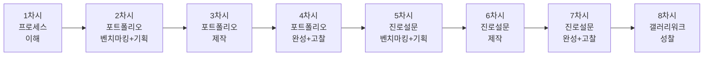
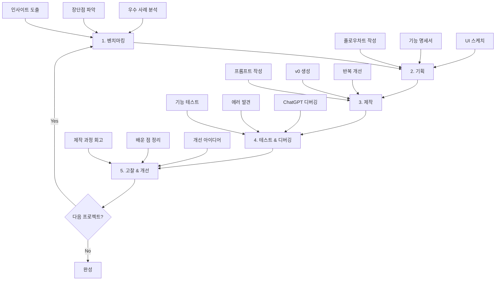
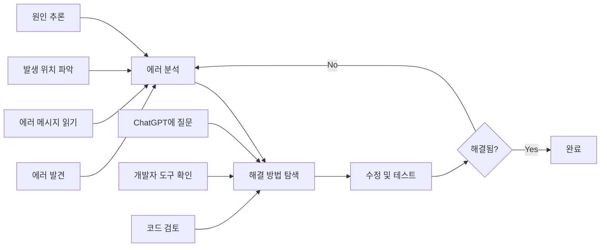
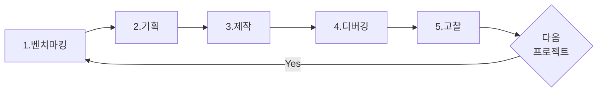
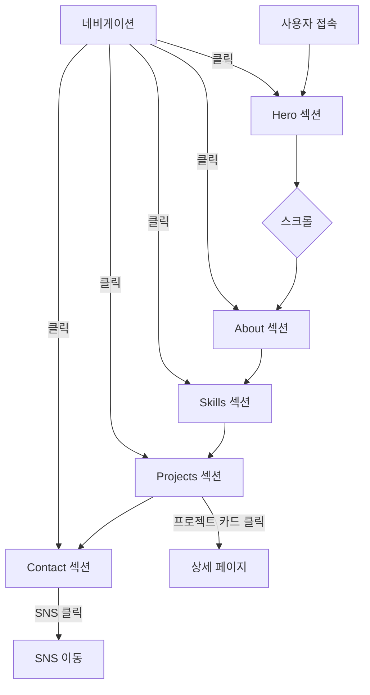
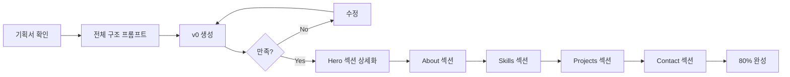
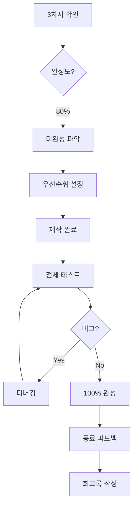
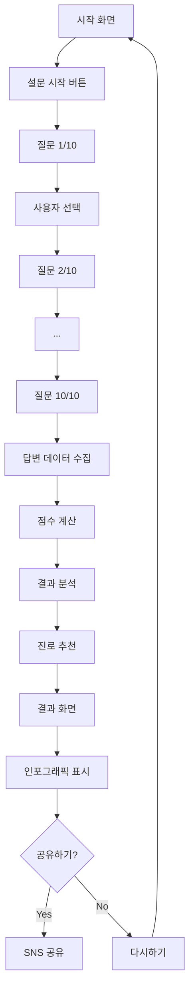
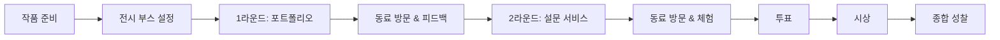

# 🎨 9학년 바이브 코딩 커리큘럼 v3 (8차시)

## 📌 커리큘럼 개요

### 핵심 변경사항
- **2개의 독립적인 원페이지 프로젝트**
- **개발 프로세스 명확화**: Mermaid 플로우차트로 시각화
- **프롬프트 엔지니어링 강화**: 단계별 프롬프트 작성 가이드
- **체계적 디버깅 전략**: 문제 해결 프로세스 제시

### 학습 목표
- **프로세스 이해**: 벤치마킹 → 기획 → 제작 → 테스트 → 고찰
- **AI 협업**: ChatGPT와 v0를 활용한 효율적 개발
- **프롬프트 작성**: 명확하고 구체적인 프롬프트 엔지니어링
- **디버깅 능력**: 에러 분석 및 해결 전략 수립
- **실용적 서비스**: 실제 사용 가능한 웹 서비스 제작

---

## 📚 전체 8차시 개요



| 차시 | 프로젝트 | 핵심 활동 | 결과물 | 프로세스 단계 |
|------|---------|----------|--------|--------------|
| 1 | 프로세스 이해 | 바이브 코딩 체험, 프롬프트 작성법 | 샘플 카드 | 🎯 전체 프로세스 |
| 2 | 프로젝트 1 시작 | 포트폴리오 벤치마킹 + 플로우차트 기획 | 기획서 + 플로우차트 | 📊 분석 + 📋 기획 |
| 3 | 프로젝트 1 제작 | v0 프롬프트 작성 및 제작 | 원페이지 포트폴리오 (80%) | 🛠️ 제작 |
| 4 | 프로젝트 1 완성 | 디버깅 + 완성 + 고찰 | 완성본 + 회고록 | 🐛 디버깅 + 💭 고찰 |
| 5 | 프로젝트 2 시작 | 설문 서비스 벤치마킹 + 로직 설계 | 기획서 + 플로우차트 | 📊 분석 + 📋 기획 |
| 6 | 프로젝트 2 제작 | 설문 로직 및 결과 페이지 제작 | 진로 설문 서비스 (80%) | 🛠️ 제작 |
| 7 | 프로젝트 2 완성 | 디버깅 + 완성 + 고찰 | 완성본 + 회고록 | 🐛 디버깅 + 💭 고찰 |
| 8 | 종합 성찰 | 갤러리 워크, 전체 학습 정리 | 포트폴리오 전시 | 🎉 발표 + 성찰 |

---

## 🎯 2개 프로젝트 비교표

| 프로젝트명 | 학습 목표 (구체적 기술) | 웹 제작 이유 (기술적/교육적) | 난이도 | 핵심 학습 내용 | 창작·기업가 정신 연결 포인트 |
| --- | --- | --- | --- | --- | --- |
| **나만의 원페이지 포트폴리오** | - 자신의 강점, 관심사를 시각적으로 정리하여 발표<br/>- 웹 레이아웃과 정보구조 기획 능력 함양<br/>- 스크롤 기반 원페이지 UX 이해 | - 멀티미디어(사진/아이콘/색상) 활용한 자기소개<br/>- 반응형 디자인으로 모바일/데스크톱 대응<br/>- 실제 사용 가능한 포트폴리오 제작 | ★★☆ | 정보 구조화, 레이아웃 설계, 시각적 커뮤니케이션, 스크롤 인터랙션 | 자기표현, 브랜딩, 설계 능력, 창의적 구성 |
| **진로 탐색 설문 서비스** | - 설문 로직과 조건문을 활용한 결과 분석 구현<br/>- 인터랙티브 UI/UX 설계<br/>- 데이터 처리 및 시각화 기초 | - 사용자 입력 → 데이터 처리 → 결과 도출 흐름 학습<br/>- 조건문/배열/객체 등 프로그래밍 개념 적용<br/>- 실제 친구들과 공유 가능한 서비스 | ★★★ | 로직 설계, 조건 분기, 데이터 구조, 결과 시각화, localStorage 활용 | 문제 해결, 서비스 설계, 사용자 중심 사고, 실용성 |

---

## 🔄 바이브 코딩 개발 프로세스

### 5단계 프로세스 상세



### 각 단계별 핵심 활동

| 단계 | 목적 | 주요 활동 | 도구 | 결과물 |
|------|------|----------|------|--------|
| **1. 벤치마킹** | 우수 사례 학습 | - 3개 이상 사이트 분석<br/>- 장단점 파악<br/>- 적용 아이디어 도출 | Google, Behance, Dribbble | 벤치마킹 리포트 |
| **2. 기획** | 구조 설계 | - Mermaid 플로우차트<br/>- 기능 명세서<br/>- UI 와이어프레임 | ChatGPT, 손 스케치 | 기획서 + 플로우차트 |
| **3. 제작** | 실제 구현 | - 프롬프트 작성<br/>- v0로 생성<br/>- 반복 수정 | v0, ChatGPT | 작동하는 웹사이트 |
| **4. 테스트 & 디버깅** | 품질 확보 | - 기능 테스트<br/>- 에러 수정<br/>- 동료 피드백 | 개발자 도구, ChatGPT | 개선된 버전 |
| **5. 고찰** | 학습 정리 | - 과정 회고<br/>- 배운 점 정리<br/>- 다음 목표 설정 | 워크시트 | 회고록 + 개선 계획 |

---

## 📖 프롬프트 작성 핵심 원칙

### 좋은 프롬프트의 5가지 요소

```
1. 명확한 목적: 무엇을 만들지 (카드, 페이지, 버튼 등)
2. 구체적 내용: 어떤 정보가 들어가는지
3. 레이아웃 정의: 위치, 크기, 배치
4. 디자인 스타일: 색상, 폰트, 분위기
5. 기술 스택: Next.js, Tailwind CSS 등
```

### 프롬프트 품질 비교

| 구분 | 나쁜 예시 ❌ | 좋은 예시 ✅ |
|------|------------|------------|
| **명확성** | "카드 만들어줘" | "자기소개 카드를 만들어줘. 이름, 사진, 한 줄 소개가 포함되어야 해" |
| **레이아웃** | "예쁘게 배치해줘" | "중앙 정렬로 배치하고, 이미지는 상단, 텍스트는 하단에 위치" |
| **디자인** | "파란색으로" | "배경은 연한 파스텔 블루(#E3F2FD), 텍스트는 진한 네이비(#1E3A8A)" |
| **기술** | 언급 없음 | "Next.js 14와 Tailwind CSS를 사용해서 만들어줘" |

---

## 🐛 디버깅 프로세스

### 체계적 디버깅 4단계



### 자주 나오는 에러 & 해결법

| 에러 유형 | 증상 | 원인 | ChatGPT 프롬프트 예시 |
|----------|------|------|---------------------|
| **레이아웃 깨짐** | 요소가 화면 밖으로 나감 | CSS 크기 설정 오류 | "요소가 화면 밖으로 나가요. 모든 섹션을 화면에 맞게 조정해줘" |
| **클릭 안됨** | 버튼 클릭 시 반응 없음 | 이벤트 핸들러 누락 | "버튼 클릭 시 다음 페이지로 이동하는 기능을 추가해줘" |
| **텍스트 안보임** | 글자가 배경과 같은 색 | 색상 대비 부족 | "텍스트 색상을 배경과 대비되게 변경해줘. 가독성 높게" |
| **이미지 안뜸** | 이미지 영역이 비어있음 | 경로 오류 또는 플레이스홀더 | "이미지가 로드되지 않을 때 회색 플레이스홀더를 보여줘" |
| **모바일 깨짐** | 모바일에서 레이아웃 이상 | 반응형 클래스 누락 | "모바일(768px 이하)에서 1열로 변경하고 패딩을 줄여줘" |

---

## 🎯 차시별 상세 커리큘럼

---

### 📅 1차시: 바이브 코딩 프로세스 이해하기

> **목표**: 바이브 코딩의 개념과 전체 프로세스를 체험하며, 프롬프트 작성과 디버깅 기초를 익힌다.

#### 🎯 차시 목표
- 바이브 코딩의 개념과 전통적 코딩의 차이 이해하기
- ChatGPT와 v0 도구 사용법 익히기
- 5단계 개발 프로세스 체험하기
- 프롬프트 작성 및 디버깅 기초 익히기

#### 📦 예상 결과물
✅ **간단한 자기소개 카드** (프롬프트 + 디버깅 경험)

---

#### 🧑‍🏫 교사용 지시서

##### 수업 전 준비사항
- [ ] ChatGPT 접속 확인 (학생별 계정)
- [ ] v0.dev 접속 확인
- [ ] 5단계 프로세스 PPT 또는 영상
- [ ] 프롬프트 예시 화면 (좋은 예 vs 나쁜 예)
- [ ] 학생용 워크시트 출력

##### 수업 진행 (50분)

| 시간 | 활동 | 교사 행동 | 학생 활동 |
|------|------|----------|----------|
| **10분** | 바이브 코딩 소개 | - 전통적 코딩 vs 바이브 코딩 비교<br/>- 5단계 프로세스 설명<br/>- 프롬프트 중요성 강조 | - 개념 이해<br/>- 질문 정리 |
| **15분** | 프로세스 시연 | - 라이브 시연:<br/>1. 기획 (종이에 스케치)<br/>2. 프롬프트 작성 (좋은 예)<br/>3. v0 생성<br/>4. 에러 발견 → 디버깅<br/>5. 완성 | - 각 단계 관찰<br/>- 프롬프트 메모<br/>- 디버깅 과정 주목 |
| **20분** | 실습: 자기소개 카드 | - 순회지도<br/>- 프롬프트 피드백<br/>- 디버깅 도움 | - ChatGPT로 기획<br/>- v0로 제작<br/>- 에러 해결 시도 |
| **5분** | 정리 및 다음 예고 | - 8차시 전체 로드맵 소개<br/>- 2개 프로젝트 소개 | - 학습 내용 확인 |

##### 교사 스크립트

```
[도입 - 바이브 코딩이란?]
"여러분, 코딩 배우려면 몇 년 걸릴까요?
전통적 방법은 1-2년... 하지만 바이브 코딩은 다릅니다!

바이브 코딩 = AI에게 말로 설명 → 웹사이트 완성
핵심은 '무엇을, 어떻게 만들지' 설명하는 능력!

오늘부터 8차시 동안:
✅ 나만의 포트폴리오 (원페이지)
✅ 진로 탐색 설문 서비스
2개 프로젝트를 완성합니다!"

[5단계 프로세스 설명]
"모든 프로젝트는 5단계를 거칩니다:

1️⃣ 벤치마킹: 좋은 사례 분석
2️⃣ 기획: 플로우차트 + 기능 명세
3️⃣ 제작: 프롬프트 → v0 생성
4️⃣ 디버깅: 에러 찾아 수정
5️⃣ 고찰: 과정 돌아보기

오늘은 3-4-5 단계를 빠르게 체험합니다!"

[프롬프트 작성 시연]
"프롬프트가 모든 것을 결정합니다.
나쁜 예시: '카드 만들어줘' → 뭘 만들지 모름
좋은 예시: '자기소개 카드를 만들어줘. 
             이름은 큰 글씨로 중앙에,
             프로필 이미지는 200px 원형,
             배경은 파스텔 블루(#E3F2FD),
             Next.js와 Tailwind CSS 사용'

보세요, 이렇게 구체적으로 설명하면..."
[v0 생성 중...]

[디버깅 시연]
"어? 텍스트가 너무 작네요. (일부러 오류 유도)
이럴 때는:
1. 문제 파악: 텍스트 크기가 작음
2. 원인 추론: 폰트 크기 설정 필요
3. 수정 프롬프트: '이름 텍스트를 64px로 크게 해줘'
4. 재생성 → 확인!

이게 디버깅입니다. 여러분도 해봅시다!"
```

---

#### 👨‍🎓 학생용 활동 시나리오

##### 미션: 첫 바이브 코딩 프로젝트 완성하기

**📖 바이브 코딩이란?**

```
🎨 바이브 코딩 (Vibe Coding)
= 코드 없이 AI와 대화로 웹 개발하기

전통적 코딩:
HTML/CSS/JS 문법 공부 → 코드 작성 → 디버깅
(몇 달 ~ 몇 년)

바이브 코딩:
기획 → AI에게 설명 → 생성 → 테스트 → 수정
(몇 시간 ~ 몇 주)

핵심 역량:
✅ 명확하게 설명하기
✅ 논리적으로 기획하기
✅ 에러를 찾고 수정하기
```

**🔄 5단계 프로세스**



**Step 1: 기획하기 (5분)**

```
💭 자기소개 카드에 무엇을 넣을까?

ChatGPT에게 질문:
"중학생 자기소개 카드를 만들려고 해.
어떤 정보를 넣으면 좋을까? 5가지 추천해줘."

[답변 활용]
내가 선택한 3가지:
1. _______________________
2. _______________________
3. _______________________
```

**Step 2: 프롬프트 작성하기 (10분)**

```
📝 v0 프롬프트 작성 템플릿

┌─────────────────────────────────┐
│ 프롬프트 작성 체크리스트         │
├─────────────────────────────────┤
│ □ 1. 무엇을 만드는지 명시        │
│     "자기소개 카드를 만들어줘"   │
│                                 │
│ □ 2. 포함할 내용 나열            │
│     - 이름: _________________   │
│     - 역할/소개: _____________   │
│     - 기타: _________________   │
│                                 │
│ □ 3. 레이아웃 설명               │
│     - 이미지 위치: ___________   │
│     - 텍스트 배치: ___________   │
│     - 정렬: _________________   │
│                                 │
│ □ 4. 디자인 스타일               │
│     - 배경색: _______________   │
│     - 글씨 크기: _____________   │
│     - 분위기: _______________   │
│                                 │
│ □ 5. 기술 스택 명시              │
│     "Next.js, Tailwind CSS 사용" │
└─────────────────────────────────┘
```

**실제 프롬프트 예시**

```
[초보자용 - 간단]
"자기소개 카드를 만들어줘.
- 이름: 홍길동 (큰 글씨)
- 한 줄 소개: 바이브 코딩 배우는 학생
- 프로필 이미지: 원형 (200px)
- 배경: 파스텔 블루
- 중앙 정렬
Next.js, Tailwind CSS 사용"

[중급자용 - 구체적]
"자기소개 카드를 만들어줘.

레이아웃:
- 전체: 400px × 600px 카드
- 프로필 이미지: 상단 중앙, 200px 원형, 흰색 테두리 4px
- 이름: 이미지 아래, 48px, 굵게 (font-bold)
- 역할: 이름 아래, 18px, 회색 (text-gray-600)
- 한 줄 소개: 역할 아래, 16px, 투명도 80%

디자인:
- 배경: 그라데이션 (연보라 → 하늘색)
- 카드: 흰색, 둥근 모서리 (rounded-2xl), 큰 그림자
- 모든 요소: 중앙 정렬

내용:
- 이름: "홍길동"
- 역할: "학생 개발자"
- 소개: "바이브 코딩으로 세상을 바꾸는 중학생"

Next.js 14, Tailwind CSS, 반응형 디자인"
```

**Step 3: v0로 제작하기 (5분)**

```
🎨 v0.dev에 프롬프트 입력

1. v0.dev 접속
2. 작성한 프롬프트 붙여넣기
3. Generate 버튼 클릭
4. 생성 대기 (30초~1분)
5. 결과 확인
```

**Step 4: 디버깅하기 (10분)**

```
🐛 체크리스트로 문제 찾기

□ 이름이 잘 보이나요?
□ 이미지가 원형인가요?
□ 배경색이 적절한가요?
□ 모든 텍스트가 읽기 쉬운가요?
□ 레이아웃이 중앙에 있나요?
```

**자주 나오는 문제 & 해결**

| 문제 | 수정 프롬프트 |
|------|--------------|
| 글씨가 너무 작다 | "이름 글씨를 64px로 크게 해줘" |
| 이미지가 사각형이다 | "프로필 이미지를 원형(rounded-full)으로 변경해줘" |
| 색이 마음에 안 든다 | "배경을 더 밝은 파스텔 톤(#E3F2FD)으로 바꿔줘" |
| 요소가 한쪽으로 치우침 | "모든 요소를 중앙 정렬(items-center, justify-center)해줘" |
| 간격이 좁다 | "각 요소 사이에 24px 간격을 추가해줘" |

**ChatGPT 활용 디버깅**

```
[프롬프트]
"v0로 자기소개 카드를 만들었는데 
[문제]: 텍스트가 배경색과 비슷해서 안 보여요.

어떻게 수정하면 좋을까요?
v0에게 줄 수정 프롬프트를 만들어줘."

[예상 답변]
"텍스트 색상을 진한 색으로 변경하세요.
v0 프롬프트: '텍스트 색상을 진한 네이비(#1E3A8A)로 
변경하고, 가독성을 높여줘'"
```

**Step 5: 완성 및 저장 (5분)**

```
💾 결과물 저장

□ 스크린샷 찍기
□ v0 프로젝트 링크 복사
□ 사용한 프롬프트 메모장에 저장
□ 디버깅 과정 간단히 메모

파일명:
- 1차시_자기소개카드_홍길동.png
- 1차시_프롬프트_홍길동.txt
```

---

#### 📊 1차시 평가

| 항목 | 평가 기준 | 배점 |
|------|----------|------|
| **프롬프트 품질** | 5가지 요소 포함 (목적/내용/레이아웃/디자인/기술) | 30% |
| **결과물 완성도** | 기능 구현 및 디자인 적절성 | 40% |
| **디버깅 시도** | 문제 발견 및 수정 시도 여부 | 20% |
| **참여도** | 적극적 실습 참여 | 10% |

---

#### 💡 교사 TIP

```
✅ 성공 포인트:
- 첫 시간은 '경험'이 목표! 완벽함 추구 X
- 프롬프트 예시를 큰 화면에 띄워두기
- 학생별 진도 차이 인정 (빠른 학생은 추가 기능)
- 디버깅 실패도 학습 과정임을 강조

⚠️ 주의사항:
- v0 생성 시간 소요 → 대기 중 다른 학생 지도
- 프롬프트는 한글/영어 모두 가능
- 완성도보다 프로세스 이해가 중요

🎯 핵심 메시지:
"코드 몰라도 만들 수 있다! 하지만 명확한 설명은 필수!"
```

---

### 📅 2차시: 프로젝트 1 - 벤치마킹 & 기획

> **목표**: 우수 포트폴리오 사이트를 분석하고, 나만의 원페이지 포트폴리오 플로우차트를 설계한다.

#### 🎯 차시 목표
- 우수 원페이지 포트폴리오 사이트 3개 이상 분석하기
- 벤치마킹을 통해 적용 가능한 인사이트 도출하기
- Mermaid를 활용한 사이트 플로우차트 작성하기
- 기능 명세서 및 UI 스케치 완성하기

#### 📦 예상 결과물
✅ **벤치마킹 리포트** (3개 사이트 분석)  
✅ **플로우차트** (Mermaid 다이어그램)  
✅ **기획서** (기능 명세 + UI 스케치)

---

#### 🔄 프로젝트 플로우차트



---

#### 👨‍🎓 학생 핵심 활동

**Step 1: 벤치마킹 (20분)**

- 우수 원페이지 포트폴리오 3개 선정 (Behance, Awwwards, Dribbble)
- 5가지 기준 평가: 첫인상, 섹션 구성, 디자인, 인터랙션, 반응형
- 적용 가능한 아이디어 3가지 도출

**Step 2: 플로우차트 작성 (15분)**

ChatGPT 프롬프트:
```
"원페이지 포트폴리오 플로우차트를 Mermaid로 만들어줘.
섹션: Hero(메인), About(소개), Skills(스킬), Projects(프로젝트), Contact(연락처)
사용자 흐름: 접속→Hero→스크롤로 각 섹션 이동→네비게이션 클릭 가능"
```

**Step 3: 기능 명세서 (10분)**

| 섹션 | 필수 요소 | 데이터 |
|------|----------|--------|
| **Hero** | 프로필 이미지, 이름, 역할, 한줄소개, CTA버튼 | 이름/역할/소개 준비 |
| **About** | 제목, 자기소개 텍스트(300자), 사진 | 자기소개 작성 |
| **Skills** | 제목, 스킬 카드 3-5개(아이콘+제목+설명) | 스킬 3-5개 정리 |
| **Projects** | 제목, 프로젝트 카드 2-3개, 링크 버튼 | 프로젝트 2-3개 정리 |
| **Contact** | 제목, 이메일, SNS 링크 | 연락처 정리 |

**Step 4: UI 스케치 (5분)**

종이에 각 섹션 레이아웃 간단히 스케치

---

#### 📊 평가 기준

| 항목 | 배점 |
|------|------|
| 벤치마킹 분석 깊이 | 30% |
| 플로우차트 명확성 | 30% |
| 기능 명세서 구체성 | 25% |
| UI 스케치 | 15% |

---

### 📅 3차시: 프로젝트 1 - 제작

> **목표**: v0 프롬프트를 작성하여 원페이지 포트폴리오 80% 완성

#### 🎯 차시 목표
- 섹션별 프롬프트 작성 전략 익히기
- v0 단계적 제작 경험하기
- 80% 완성도 달성하기

#### 📦 예상 결과물
✅ **원페이지 포트폴리오 (80%)**  
✅ **프롬프트 모음집**

---

#### 🔄 제작 프로세스



---

#### 👨‍🎓 핵심 프롬프트 예시

**프롬프트 #1: 전체 구조**

```
"5개 섹션(Hero/About/Skills/Projects/Contact) 원페이지 포트폴리오 만들어줘.
- 스크롤 기반, 각 섹션 전체 화면 높이
- 네비게이션 상단 고정, 클릭 시 smooth scroll
- 반응형 디자인
- Next.js 14, Tailwind CSS
지금은 기본 구조만, 각 섹션은 제목과 플레이스홀더만"
```

**프롬프트 #2: Hero 섹션 상세화**

```
"Hero 섹션 상세화:
- 프로필 이미지: 200px 원형, 중앙 상단, 흰색 테두리 4px
- 이름: "[이름]" 64px, 굵게, 네이비
- 역할: "[역할]" 24px, 회색
- 소개: "[한줄소개]" 18px
- CTA 버튼: "프로젝트 보기", 파란색, Projects 섹션으로 이동
- SNS 링크 3개: GitHub, Email, Instagram
- 배경: 그라데이션(연보라→하늘색)
- 페이드인 애니메이션"
```

**프롬프트 #3-6: 나머지 섹션**

각 섹션마다 기능 명세서 기반으로 구체적 프롬프트 작성
- About: 2단 레이아웃, 자기소개+이미지
- Skills: 3열 그리드, 카드 형식, 호버 효과
- Projects: 2열 그리드, 이미지+제목+설명+버튼
- Contact: 이메일+SNS 링크, 아이콘

---

#### 🐛 자주 나오는 문제 & 해결

| 문제 | 수정 프롬프트 |
|------|--------------|
| 섹션 스크롤 끊김 | "scroll-behavior: smooth 적용" |
| 모바일 글자 잘림 | "모바일 padding 20px로 증가" |
| 버튼 반응 없음 | "버튼 클릭 이벤트 추가" |
| 카드 레이아웃 깨짐 | "데스크톱 3열 grid로 변경" |

---

#### 📊 평가 기준

| 항목 | 배점 |
|------|------|
| 프롬프트 품질 | 25% |
| 완성도 (5개 섹션 구현) | 40% |
| 디자인 일관성 | 20% |
| 디버깅 시도 | 15% |

---

### 📅 4차시: 프로젝트 1 - 완성 & 고찰

> **목표**: 100% 완성 및 제작 과정 회고

#### 🎯 차시 목표
- 100% 완성도 달성
- 체계적 디버깅
- 제작 과정 성찰

#### 📦 예상 결과물
✅ **완성된 포트폴리오 (100%)**  
✅ **회고록**

---

#### 🔄 완성 & 고찰 프로세스



---

#### 👨‍🎓 핵심 활동

**Step 1: 완성 체크리스트 (5분)**

```
□ Hero: 이미지, 텍스트, 버튼, SNS 링크
□ About: 자기소개, 이미지, 2단 레이아웃
□ Skills: 카드 3-5개, 그리드, 호버 효과
□ Projects: 카드 2-3개, 버튼 작동
□ Contact: 이메일, SNS 링크
□ 네비게이션 작동
□ 모바일 반응형
```

**Step 2: 디버깅 (20분)**

- 모든 버튼/링크 클릭 테스트
- 데스크톱/태블릿/모바일 확인
- 스크롤 부드러움 확인
- 애니메이션 작동 확인

**Step 3: 동료 피드백 (10분)**

2-3명과 작품 공유, 피드백 주고받기

**Step 4: 회고록 작성 (15분)**

```
📝 프로젝트 회고록

1. 차시별 활동 요약
   - 2차시: 벤치마킹 사이트 __개, 인사이트
   - 3차시: 프롬프트 __개, 어려웠던 점
   - 4차시: 수정 버그 __개

2. 배운 점
   - 기술적: (3가지)
   - 프로세스: (3가지)
   - 가장 뿌듯했던 순간
   - 가장 힘들었던 순간과 극복 방법

3. 개선 아이디어
   - 이 프로젝트에 추가하고 싶은 기능 (3가지)
   - 다음 프로젝트에 적용할 점 (3가지)

4. 자기 평가
   - 노력도: [ ]/10
   - 완성도: [ ]/10
   - 창의성: [ ]/10
   - 문제해결: [ ]/10
```

---

#### 📊 평가 기준

| 항목 | 배점 |
|------|------|
| 완성도 | 35% |
| 디버깅 노력 | 20% |
| 회고록 깊이 | 30% |
| 동료 피드백 | 15% |

---

### 📅 5차시: 프로젝트 2 - 벤치마킹 & 기획

> **목표**: 진로 탐색 설문 서비스 분석 및 로직 설계

#### 🎯 차시 목표
- 설문 서비스 사례 분석하기
- 질문-결과 로직 플로우차트 설계하기
- 데이터 구조 및 조건 분기 설계하기

#### 📦 예상 결과물
✅ **벤치마킹 리포트**  
✅ **로직 플로우차트**  
✅ **데이터 구조 설계서**

---

#### 🔄 프로젝트 2 전체 플로우



---

#### 👨‍🎓 핵심 활동

**Step 1: 벤치마킹 (15분)**

설문 서비스 분석 (16personalities, MBTI 테스트 등)
- 질문 방식 (객관식, 슬라이더, 선택지)
- 진행 표시 (프로그레스 바)
- 결과 표시 (그래프, 인포그래픽)
- UI/UX (버튼 배치, 색상, 전환)

**Step 2: 로직 플로우차트 (20분)**

ChatGPT 프롬프트:
```
"진로 탐색 설문 서비스 로직 플로우차트를 Mermaid로 만들어줘.

구조:
1. 시작 화면
2. 10개 질문 (감정/관심분야 파악)
3. 답변에 따라 점수 누적
4. 4가지 진로 유형으로 분류 (예: 창작형, 기술형, 소통형, 분석형)
5. 결과 화면 (유형 설명 + 추천 진로 + 인포그래픽)
6. 공유 기능

데이터 흐름:
질문 → 선택 → 점수 계산 → 유형 판별 → 결과 표시"
```

**Step 3: 데이터 구조 설계 (15분)**

```javascript
// 질문 데이터
questions = [
  {
    id: 1,
    text: "어떤 활동이 더 즐거운가요?",
    options: [
      { text: "그림 그리기", type: "creative", score: 10 },
      { text: "코딩하기", type: "technical", score: 10 },
      { text: "친구와 대화", type: "social", score: 10 },
      { text: "데이터 분석", type: "analytical", score: 10 }
    ]
  },
  // ... 9개 질문 더
]

// 결과 유형
results = {
  creative: { name: "창작형", jobs: ["디자이너", "작가", "예술가"] },
  technical: { name: "기술형", jobs: ["개발자", "엔지니어", "연구원"] },
  social: { name: "소통형", jobs: ["교사", "상담가", "마케터"] },
  analytical: { name: "분석형", jobs: ["데이터 과학자", "회계사", "전략가"] }
}
```

---

#### 📊 평가 기준

| 항목 | 배점 |
|------|------|
| 벤치마킹 분석 | 25% |
| 로직 플로우차트 | 35% |
| 데이터 구조 설계 | 30% |
| 창의성 | 10% |

---

### 📅 6차시: 프로젝트 2 - 제작

> **목표**: 설문 로직 및 결과 페이지 구현

#### 🎯 차시 목표
- 질문 화면 및 진행 표시 구현
- 답변 데이터 수집 및 처리 로직 구현
- 결과 분석 및 인포그래픽 생성

#### 📦 예상 결과물
✅ **진로 탐색 설문 서비스 (80%)**

---

#### 👨‍🎓 핵심 프롬프트

**프롬프트 #1: 전체 구조**

```
"진로 탐색 설문 서비스를 만들어줘.

구조:
1. 시작 화면
   - 제목: "나에게 맞는 진로는?"
   - 설명: 간단한 소개
   - "시작하기" 버튼

2. 질문 화면 (10개)
   - 상단: 진행률 바 (예: 3/10)
   - 질문 텍스트
   - 4개 선택지 버튼
   - "다음" 버튼

3. 결과 화면
   - 유형 제목
   - 유형 설명
   - 추천 진로 3가지
   - 점수 막대 그래프
   - "다시하기" 버튼

기능:
- useState로 현재 질문 번호 관리
- 선택 시 답변 배열에 저장
- 마지막 질문 후 자동으로 결과 계산
- localStorage에 결과 저장

Next.js 14, Tailwind CSS, TypeScript"
```

**프롬프트 #2: 질문 데이터 & 로직**

```
"10개 질문과 결과 계산 로직을 추가해줘.

질문 데이터:
[
  {
    id: 1,
    text: "어떤 활동이 더 즐거운가요?",
    options: [
      { text: "그림 그리기", type: "creative" },
      { text: "코딩하기", type: "technical" },
      { text: "친구와 대화", type: "social" },
      { text: "데이터 분석", type: "analytical" }
    ]
  },
  // 9개 더 추가 (감정 표현, 문제 해결 방식, 좋아하는 과목 등)
]

결과 계산 로직:
- 각 선택마다 type 카운트
- 가장 많이 선택된 type이 결과 유형
- 동점일 경우 첫 번째 선택

결과 유형:
{
  creative: { name: "창작형 🎨", jobs: ["디자이너", "작가", "예술가"], desc: "..." },
  technical: { name: "기술형 💻", jobs: ["개발자", "엔지니어", "과학자"], desc: "..." },
  social: { name: "소통형 💬", jobs: ["교사", "상담가", "마케터"], desc: "..." },
  analytical: { name: "분석형 📊", jobs: ["데이터 과학자", "연구원", "전략가"], desc: "..." }
}"
```

**프롬프트 #3: 결과 화면 & 인포그래픽**

```
"결과 화면을 만들어줘.

레이아웃:
1. 유형 제목 (큰 이모지 + 이름)
2. 유형 설명 (200자)
3. "이런 직업이 잘 맞아요!" 섹션
   - 추천 진로 3가지 (카드 형식)
4. 점수 분포 (막대 그래프)
   - 4가지 유형별 점수 시각화
5. 버튼 2개
   - "다시하기" (초기화)
   - "결과 공유" (링크 복사)

디자인:
- 유형별 색상 테마
  • creative: 보라색
  • technical: 파란색
  • social: 초록색
  • analytical: 주황색
- 카드: 흰색 배경, 그림자, 호버 효과
- 애니메이션: 결과 화면 페이드인, 그래프 애니메이션"
```

---

#### 🐛 자주 나오는 문제 & 해결

| 문제 | 해결 프롬프트 |
|------|--------------|
| 답변 데이터가 저장 안 됨 | "useState로 answers 배열 관리, 선택 시 추가" |
| 다음 버튼 안 눌림 | "선택하지 않으면 다음 버튼 비활성화" |
| 결과 계산 오류 | "각 type별 카운트를 Object.keys로 계산" |
| 그래프가 안 보임 | "Recharts 라이브러리 설치, BarChart 컴포넌트 사용" |

---

#### 📊 평가 기준

| 항목 | 배점 |
|------|------|
| 질문 화면 구현 | 25% |
| 데이터 처리 로직 | 30% |
| 결과 화면 & 인포그래픽 | 30% |
| 디자인 & UX | 15% |

---

### 📅 7차시: 프로젝트 2 - 완성 & 고찰

> **목표**: 설문 서비스 100% 완성 및 2개 프로젝트 비교 회고

#### 🎯 차시 목표
- 100% 완성 및 전체 테스트
- 프로젝트 1과 2 비교 성찰
- 바이브 코딩 역량 종합 평가

#### 📦 예상 결과물
✅ **완성된 설문 서비스 (100%)**  
✅ **종합 회고록** (2개 프로젝트 비교)

---

#### 👨‍🎓 핵심 활동

**Step 1: 완성 & 테스트 (20분)**

```
✅ 완성 체크리스트

기능 테스트:
□ 시작 버튼 작동
□ 10개 질문 순서대로 표시
□ 선택 시 다음 버튼 활성화
□ 진행률 바 정확히 표시
□ 결과 계산 정확
□ 유형별 결과 표시
□ 그래프 표시
□ 다시하기 버튼 작동
□ localStorage 저장/불러오기

UX 테스트:
□ 버튼 크기 적절 (모바일)
□ 텍스트 가독성
□ 페이지 전환 부드러움
□ 로딩 시간 빠름
```

**Step 2: 동료 테스트 (10분)**

친구에게 실제로 설문 참여시키고 피드백 받기

**Step 3: 2개 프로젝트 비교 회고 (20min)**

```
📝 종합 회고록

1. 프로젝트 비교
   
   | 항목 | 프로젝트 1 (포트폴리오) | 프로젝트 2 (설문) |
   |------|----------------------|------------------|
   | 난이도 | ★★☆ | ★★★ |
   | 재미도 | [ ]/10 | [ ]/10 |
   | 완성도 | [ ]/10 | [ ]/10 |
   | 어려웠던 점 | _______ | _______ |

2. 성장 지표
   
   프롬프트 작성 능력:
   - 프로젝트 1 시작: [ ]/10
   - 프로젝트 2 완성: [ ]/10
   - 성장 이유: ______________

   디버깅 능력:
   - 프로젝트 1: 평균 __분/버그
   - 프로젝트 2: 평균 __분/버그
   - 개선 포인트: ______________

3. 가장 큰 배움
   - 기술적: ______________
   - 프로세스: ______________
   - 협업/소통: ______________

4. 다음 도전 과제
   - 배우고 싶은 기술: ______________
   - 만들고 싶은 프로젝트: ______________
```

---

#### 📊 평가 기준

| 항목 | 배점 |
|------|------|
| 완성도 | 35% |
| 기능 정확성 | 25% |
| 종합 회고 깊이 | 25% |
| 성장 인식 | 15% |

---

### 📅 8차시: 갤러리 워크 & 종합 성찰

> **목표**: 전체 작품 전시 및 8차시 학습 정리

#### 🎯 차시 목표
- 2개 프로젝트 갤러리 워크
- 동료 피드백 및 투표
- 바이브 코딩 학습 종합 정리
- 미래 학습 계획 수립

#### 📦 예상 결과물
✅ **작품 전시 (2개 프로젝트)**  
✅ **최종 성찰 보고서**

---

#### 🔄 갤러리 워크 프로세스



---

#### 👨‍🎓 핵심 활동

**Step 1: 갤러리 워크 (30분)**

- 작품 설명서 준비 (프로젝트 소개, 주요 기능, 제작 기간)
- 1라운드 (15분): 포트폴리오 전시
- 2라운드 (15분): 설문 서비스 체험

동료 피드백 시트:
```
방문자: _____________
작품명: _____________

👍 좋은 점:
1. ___________________
2. ___________________

💡 개선 제안:
___________________

⭐ 평점: [ ]/10
```

**Step 2: 베스트 작품 투표 (5분)**

카테고리:
- 🎨 최고 디자인상
- 💻 최고 기술상
- 🚀 최고 창의성상
- 👥 최고 인기상

**Step 3: 종합 성찰 (15분)**

```
📝 8차시 종합 성찰

1. 바이브 코딩이란?
   내 언어로 정의: _________________

2. 가장 큰 성장
   - 시작 전 나: _________________
   - 지금의 나: _________________

3. 프로세스 5단계 중 가장 중요한 단계
   단계: _________________
   이유: _________________

4. 8차시 후 달라진 점
   - 기술적: _________________
   - 태도: _________________
   - 목표: _________________

5. 앞으로의 계획
   - 1개월 내: _________________
   - 6개월 내: _________________
   - 1년 내: _________________

6. 바이브 코딩을 친구에게 추천한다면?
   한 문장: _________________
```

---

#### 📊 최종 평가

| 항목 | 배점 |
|------|------|
| 작품 완성도 (2개) | 40% |
| 갤러리 워크 참여 | 20% |
| 동료 피드백 품질 | 15% |
| 종합 성찰 깊이 | 25% |

---

## 🎉 마치며

### 8차시 학습 성과

이 커리큘럼을 통해 학생들은:

✅ **2개의 실용적 프로젝트 완성**
- 원페이지 포트폴리오 (정적 콘텐츠)
- 진로 탐색 설문 서비스 (동적 로직)

✅ **핵심 역량 습득**
- 5단계 개발 프로세스 (벤치마킹→기획→제작→디버깅→고찰)
- 프롬프트 엔지니어링 (명확하고 구체적인 지시)
- 플로우차트 설계 (Mermaid 활용)
- 체계적 디버깅 (문제 분석 및 해결)
- 데이터 구조 설계 (로직 구현)

✅ **메타 인지 강화**
- 각 프로젝트마다 회고 활동
- 성장 과정 기록 및 분석
- 개선 아이디어 도출

---

### 교사를 위한 총평

**성공 요인**
- 독립적인 2개 프로젝트로 다양한 경험 제공
- 매 프로젝트마다 전체 프로세스 반복 (내재화)
- 난이도 점진적 증가 (정적 → 동적)
- 프롬프트+플로우차트+디버깅 체계화

**주의사항**
- 학생별 진도 차이 인정
- 완성도보다 과정 중시
- 실패도 학습 기회임을 강조
- 개별 피드백 시간 확보

**후속 활동 제안**
- 프로젝트 개선 및 배포
- 추가 프로젝트 (게임, 다이어리 등)
- 동아리/대회 출품
- 10학년 심화 과정 연계

---

**버전**: v3.0 (9학년용 - 2개 독립 프로젝트)  
**작성일**: 2025년 11월  
**주요 변경사항**:
- 3페이지 포트폴리오 → 원페이지 포트폴리오
- 단일 프로젝트 → 2개 독립 프로젝트
- 프롬프트 작성 가이드 강화
- Mermaid 플로우차트 필수 포함
- 디버깅 프로세스 체계화
- 매 프로젝트 고찰 활동 포함

