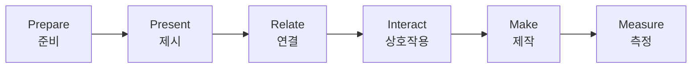
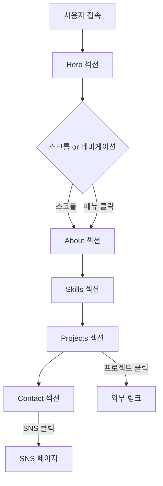

# 🎨 9학년 바이브 코딩 프로젝트 수업 (PPRIMM 방식)

## 📌 커리큘럼 개요

### v4 주요 특징
- **PPRIMM 교수법** 적용 (체계적 수업 진행)
- **완성된 프롬프트 템플릿** 제공 (80% 가이드)
- **결과물 먼저 제시** (명확한 목표)
- **20% 커스터마이징** 영역 (창의성 발휘)
- **단계별 체크포인트** (진도 관리 용이)

### 프로젝트 구성

| 차시 | 프로젝트 | 활동 | 결과물 |
|------|---------|------|--------|
| 1 | 프로세스 이해 | 바이브 코딩 체험 | 샘플 카드 |
| 2-4 | **프로젝트 1** | 원페이지 포트폴리오 | 완성된 포트폴리오 |
| 5-7 | **프로젝트 2** | 진로 탐색 설문 서비스 | 완성된 설문 서비스 |
| 8 | 종합 | 갤러리 워크 | 전시 & 성찰 |

---

## 🎯 PPRIMM 교수법 이해

### PPRIMM 6단계



| 단계 | 시간 | 활동 | 목적 |
|------|------|------|------|
| **Prepare** (준비) | 5분 | 도구 준비, 이전 결과 확인 | 수업 준비 상태 확인 |
| **Present** (제시) | 10분 | 완성된 결과물 시연, 목표 제시 | 명확한 목표 설정 |
| **Relate** (연결) | 5분 | 이전 학습과 연결, 필요성 논의 | 학습 맥락 이해 |
| **Interact** (상호작용) | 5분 | 질문/토론, 예상 어려움 공유 | 학생 참여 유도 |
| **Make** (제작) | 20분 | 프롬프트 템플릿 활용 제작 | 실제 구현 |
| **Measure** (측정) | 5분 | 체크포인트 확인, 피드백 | 학습 달성도 평가 |

---

## 📊 프로젝트 1: 원페이지 포트폴리오

### 프로젝트 개요

**완성 목표**: 5개 섹션으로 구성된 스크롤 기반 원페이지 포트폴리오

```
구조:
┌─────────────────┐
│ Hero 섹션       │ ← 이름, 역할, 한줄소개
├─────────────────┤
│ About 섹션      │ ← 자기소개, 사진
├─────────────────┤
│ Skills 섹션     │ ← 스킬 카드 3-5개
├─────────────────┤
│ Projects 섹션   │ ← 프로젝트 2-3개
├─────────────────┤
│ Contact 섹션    │ ← 연락처, SNS
└─────────────────┘
```

**참고 결과물**: [교사가 미리 만든 샘플 포트폴리오 링크]

---

## 📅 2차시: 프로젝트 1 - 벤치마킹 & 기획 (PPRIMM)

### 🎯 학습 목표
- 완성된 포트폴리오 구조 이해하기
- Mermaid 플로우차트로 사용자 여정 설계하기
- 내 포트폴리오 데이터 준비하기

### 📦 예상 결과물
✅ **플로우차트** (Mermaid)  
✅ **데이터 시트** (5개 섹션 내용)  
✅ **UI 스케치**

---

### 📚 PPRIMM 수업 진행 (50분)

#### 1️⃣ Prepare (준비) - 5분

**교사 활동**
- 컴퓨터 부팅 및 도구 접속 확인
- 샘플 포트폴리오 링크 배포
- 워크시트 배부

**학생 활동**
```
✅ 체크리스트
□ ChatGPT 접속 (chatgpt.com)
□ 메모장 또는 노션 열기
□ 샘플 포트폴리오 열기
□ 워크시트 준비
```

---

#### 2️⃣ Present (제시) - 10분

**교사 시연: 완성된 샘플 포트폴리오 보여주기**

```
🎬 시연 스크립트

"오늘부터 여러분이 만들 포트폴리오를 보여드릴게요."

[샘플 포트폴리오 화면 공유]

1. Hero 섹션 (첫 화면)
   "이름, 역할, 한줄소개가 중앙에 크게 보입니다.
    프로필 이미지는 원형이고, CTA 버튼이 있어요."

2. 스크롤 시연
   "아래로 스크롤하면 About → Skills → Projects → Contact
    순서대로 나옵니다."

3. 네비게이션 시연
   "상단 메뉴를 클릭하면 원하는 섹션으로 바로 이동합니다."

4. 반응형 시연
   "F12 누르고 모바일 화면으로 바꾸면...
    레이아웃이 자동으로 조정됩니다."

"이게 여러분이 3차시 후에 완성할 결과물입니다!"
```

**완성된 플로우차트 제시**



---

#### 3️⃣ Relate (연결) - 5분

**이전 학습 연결**

```
교사 질문:
"1차시에서 자기소개 카드를 만들었죠?
오늘 만들 포트폴리오와 뭐가 다를까요?"

예상 답변:
- 카드: 1개 화면, 간단한 정보
- 포트폴리오: 여러 섹션, 상세한 정보, 전문적

"맞아요! 포트폴리오는 자기소개 카드의 확장판이에요.
더 많은 정보를 체계적으로 보여주는 거죠."
```

**필요성 논의**

```
"왜 포트폴리오가 필요할까요?"

→ 대학 입학 / 동아리 지원 / 대회 출품 / 인턴십 지원
→ 나를 소개하는 명함

"여러분의 포트폴리오는 10학년, 11학년에도 계속 업데이트하며
사용할 수 있는 평생 자산입니다!"
```

---

#### 4️⃣ Interact (상호작용) - 5분

**질문 & 토론**

```
교사 질문 1:
"샘플 포트폴리오에서 가장 마음에 드는 부분은?"

학생 발표 (2-3명)
→ 색상, 레이아웃, 애니메이션 등

교사 질문 2:
"여러분 포트폴리오에서 가장 강조하고 싶은 섹션은?"

학생 토론 (짝 활동, 2분)
→ Skills? Projects? 개인마다 다름

교사 정리:
"좋아요! 기본 80%는 같지만, 
여러분만의 20%를 어디에 넣을지 생각하며 만들어봅시다."
```

---

#### 5️⃣ Make (제작) - 20분

**활동 1: 플로우차트 만들기 (8분)**

```
📝 완성된 ChatGPT 프롬프트 템플릿 (80% 완성)

[학생 화면에 이 프롬프트를 띄워주고 복사하게 함]

───────────────────────────────────────
프롬프트 복사 ▼
───────────────────────────────────────

"원페이지 포트폴리오의 사용자 플로우차트를 Mermaid 문법으로 만들어줘.

구조:
- 5개 섹션: Hero, About, Skills, Projects, Contact
- 섹션 순서: Hero → About → Skills → Projects → Contact
- 이동 방법: 
  1) 스크롤로 순서대로 이동
  2) 상단 네비게이션 클릭 시 해당 섹션으로 바로 이동
- Projects 섹션에서 프로젝트 클릭 → 외부 링크 (새 탭)
- Contact 섹션에서 SNS 아이콘 클릭 → SNS 페이지 (새 탭)

Mermaid graph TD 형식으로 작성해줘."

───────────────────────────────────────
```

**단계별 가이드**

```
Step 1: ChatGPT에 프롬프트 붙여넣기 (1분)
Step 2: 생성된 Mermaid 코드 복사 (1분)
Step 3: 메모장에 저장 (1분)
Step 4: ChatGPT에게 "이 플로우차트를 설명해줘" 질문 (2분)
Step 5: 내 포트폴리오에 맞게 수정 (3분) ← 20% 커스터마이징

예시 수정:
- 섹션 추가: "Hobby" 섹션 추가하고 싶다면
  ChatGPT에게 "Skills 섹션 다음에 Hobby 섹션을 추가해줘"
```

**체크포인트 1 (중간 확인)**

```
□ ChatGPT가 Mermaid 코드를 생성했는가?
□ graph TD로 시작하는가?
□ 5개 섹션이 모두 포함되어 있는가?
□ 화살표 방향이 논리적인가?

※ 문제 발생 시 손들기 → 교사 순회 지도
```

---

**활동 2: 데이터 시트 작성 (12분)**

```
📋 포트폴리오 데이터 시트 (80% 템플릿)

[학생 화면에 워크시트 표시]

───────────────────────────────────────
워크시트 작성 ▼
───────────────────────────────────────

┌─────────────────────────────────────┐
│     포트폴리오 데이터 준비 시트      │
├─────────────────────────────────────┤
│                                     │
│ 📌 Hero 섹션 (필수 80%)             │
│                                     │
│ • 이름: [              ]            │
│   예: 홍길동                         │
│                                     │
│ • 역할/직업: [              ]       │
│   예: 학생 개발자, 디자이너, 창작자  │
│                                     │
│ • 한 줄 소개 (30자 이내):            │
│   [                                ]│
│   예: 바이브 코딩으로 세상을 바꾸는  │
│       중학생                         │
│                                     │
│ • 선택 (20% 커스터마이징):           │
│   □ 배경 색상 변경 원함              │
│     → 원하는 색: [         ]        │
│   □ 애니메이션 추가 원함             │
│     → 어떤 효과: [         ]        │
│                                     │
├─────────────────────────────────────┤
│                                     │
│ 📌 About 섹션 (필수 80%)            │
│                                     │
│ • 자기소개 텍스트 (300자):           │
│   [                                ]│
│   [                                ]│
│   [                                ]│
│                                     │
│   작성 팁:                           │
│   - 1문단: 나는 누구인가?           │
│   - 2문단: 무엇을 좋아하는가?       │
│   - 3문단: 미래 목표는?             │
│                                     │
│ • 선택 (20% 커스터마이징):           │
│   □ 사진 위치 변경 (좌/우)          │
│   □ 추가 정보 넣기: [      ]        │
│                                     │
├─────────────────────────────────────┤
│                                     │
│ 📌 Skills 섹션 (필수 80%)           │
│                                     │
│ • 스킬 3-5개:                        │
│                                     │
│   스킬 1:                            │
│   - 이름: [              ]          │
│   - 이모지: [  ] (선택)             │
│   - 설명 (50자): [              ]   │
│                                     │
│   스킬 2:                            │
│   - 이름: [              ]          │
│   - 이모지: [  ]                    │
│   - 설명: [              ]          │
│                                     │
│   스킬 3:                            │
│   - 이름: [              ]          │
│   - 이모지: [  ]                    │
│   - 설명: [              ]          │
│                                     │
│   (스킬 4, 5 선택사항)               │
│                                     │
│ • 선택 (20% 커스터마이징):           │
│   □ 카드 색상 변경                   │
│   □ 레벨/숙련도 표시 추가            │
│                                     │
├─────────────────────────────────────┤
│                                     │
│ 📌 Projects 섹션 (필수 80%)         │
│                                     │
│ • 프로젝트 2-3개:                    │
│                                     │
│   프로젝트 1:                        │
│   - 제목: [              ]          │
│   - 설명 (100자): [              ]  │
│   - 사용 기술: [              ]     │
│   - 링크: [              ]          │
│     (없으면 # 입력)                  │
│                                     │
│   프로젝트 2:                        │
│   - 제목: [              ]          │
│   - 설명: [              ]          │
│   - 사용 기술: [              ]     │
│   - 링크: [              ]          │
│                                     │
│   (프로젝트 3 선택사항)              │
│                                     │
│ • 선택 (20% 커스터마이징):           │
│   □ 카드 레이아웃 변경               │
│   □ 호버 효과 변경                   │
│                                     │
├─────────────────────────────────────┤
│                                     │
│ 📌 Contact 섹션 (필수 80%)          │
│                                     │
│ • 연락처:                            │
│   - 이메일: [              ]        │
│     (학교 이메일 가능)               │
│                                     │
│ • SNS (선택):                        │
│   - GitHub: [              ]        │
│   - Instagram: [              ]     │
│   - 기타: [              ]          │
│                                     │
│ • 선택 (20% 커스터마이징):           │
│   □ 추가 연락 수단 넣기              │
│   □ 연락 가능 시간 명시              │
│                                     │
└─────────────────────────────────────┘

작성 완료 후 교사 확인: □
```

**작성 가이드**

```
📝 각 섹션별 작성 시간 배분 (12분)

Hero (2분):
- 이름, 역할은 즉시 작성
- 한 줄 소개가 어려우면 ChatGPT 활용:
  "중학생 개발자를 소개하는 한 줄 문구 5개 만들어줘"

About (4분):
- 300자가 부담스러우면:
  ChatGPT 프롬프트: 
  "중학생 자기소개를 300자로 작성해줘.
   좋아하는 것: [내가 좋아하는 것 3가지]
   목표: [내 목표]"
  → 결과를 참고하여 수정

Skills (3분):
- 학교 과목도 스킬이 될 수 있음
  예: 수학, 과학, 영어, 미술, 체육
- 취미도 스킬
  예: 사진 촬영, 영상 편집, 글쓰기

Projects (2분):
- 아직 프로젝트가 없다면:
  - 이번에 만들 포트폴리오
  - 학교 과제
  - 동아리 활동
  - 취미 작품

Contact (1분):
- 실제 이메일 또는 연습용
- SNS는 선택사항
```

**체크포인트 2 (종료 전)**

```
✅ 데이터 시트 완성도 확인

필수 항목 (80%):
□ Hero: 이름, 역할, 한줄소개 작성
□ About: 자기소개 텍스트 작성
□ Skills: 최소 3개 작성
□ Projects: 최소 2개 작성
□ Contact: 이메일 작성

선택 항목 (20%):
□ 커스터마이징 아이디어 1개 이상

※ 필수 항목 미완성 시 3차시까지 완성 필수
```

---

#### 6️⃣ Measure (측정) - 5분

**학습 목표 달성도 평가**

```
✅ 자가 평가 체크리스트

□ 플로우차트를 이해하고 생성했는가?
□ 5개 섹션의 역할을 이해했는가?
□ 내 포트폴리오 데이터를 80% 이상 준비했는가?
□ 20% 커스터마이징 아이디어가 있는가?

4개 모두 체크: 다음 차시 준비 완료 ✅
3개 체크: 보통, 집에서 보완 필요
2개 이하: 교사 개별 지도 필요
```

**교사 빠른 피드백**

```
[화면에 표시]

진도 체크:
- 초록불 🟢: 플로우차트 + 데이터 80% 완성
- 노란불 🟡: 플로우차트 완성, 데이터 50%
- 빨간불 🔴: 도움 필요

Zoom 채팅 또는 손들기:
→ 초록불, 노란불, 빨간불 중 하나 입력

[교사 집계 후]
"초록불 15명, 노란불 4명, 빨간불 1명
빨간불, 노란불 학생은 쉬는 시간에 개별 지도!"
```

**다음 차시 예고**

```
📢 3차시 예고

"다음 시간에는 오늘 준비한 데이터로
실제 v0에서 포트폴리오를 만듭니다!

준비물:
✅ 오늘 작성한 데이터 시트
✅ (선택) 프로필 사진 파일

꼭 데이터 시트를 완성해 오세요!"
```

---

### 📊 2차시 평가 루브릭

| 항목 | 상 (3점) | 중 (2점) | 하 (1점) |
|------|---------|---------|---------|
| **플로우차트** | Mermaid 코드 정확, 5개 섹션 포함 | 생성했으나 일부 오류 | 미완성 |
| **데이터 시트** | 80% 이상 완성, 구체적 | 50% 완성 | 30% 미만 |
| **20% 커스터마이징** | 창의적 아이디어 구체적 | 아이디어 있음 | 없음 |
| **참여도** | 적극 참여, 질문 | 보통 참여 | 소극적 |

---

### 💡 교사 팁

**성공 포인트**
- ✅ 샘플 포트폴리오를 미리 만들어 보여주기 (목표 명확화)
- ✅ 프롬프트 템플릿을 화면에 크게 띄우기
- ✅ 데이터 시트 작성 시 순회 지도
- ✅ 80% 완성을 강조 (완벽주의 방지)

**트러블슈팅**
- ❓ ChatGPT가 Mermaid 코드를 안 만들면: 프롬프트 마지막에 "```mermaid로 시작해줘" 추가
- ❓ 학생이 자기소개를 못 쓰면: ChatGPT 활용 또는 친구와 인터뷰
- ❓ 데이터 시트 작성 시간 부족: 집에서 완성 과제로 부여

**시간 조절**
- Make 시간이 부족하면: Interact 3분으로 단축
- 빠른 학생: 추가 섹션 (Hobby, Awards 등) 설계
- 느린 학생: 필수 80%만 완성하도록 유도

---

## 📅 3차시: 프로젝트 1 - 제작 Part 1 (Hero + About)

### 🎯 학습 목표
- 완성된 프롬프트로 Hero 섹션 만들기
- About 섹션 제작하기
- 40% 완성도 달성하기

### 📦 예상 결과물
✅ **Hero 섹션 (완성)**  
✅ **About 섹션 (완성)**  
✅ **프롬프트 기록**

---

### 📚 PPRIMM 수업 진행 (50분)

#### 1️⃣ Prepare (준비) - 3분

```
✅ 준비 체크리스트

□ v0.dev 접속 (v0.dev)
□ 2차시 데이터 시트 확인
□ ChatGPT 탭 열기
□ 메모장 열기 (프롬프트 기록용)

※ v0 처음 사용: 
  - Google 계정으로 로그인
  - Free tier 사용 가능
```

---

#### 2️⃣ Present (제시) - 7분

**교사 라이브 시연: v0로 Hero 섹션 만들기**

```
🎬 시연 스크립트

"제가 실제로 v0에서 Hero 섹션을 만들어볼게요."

[화면 공유: v0.dev]

Step 1: v0 프롬프트 창에 템플릿 붙여넣기
"이 프롬프트를 그대로 복사해서 붙여넣으면 됩니다."

Step 2: 생성 대기 (30초~1분)
"기다리는 동안 여러분은 다음 프롬프트를 준비하세요."

Step 3: 결과 확인
"짜잔! Hero 섹션이 만들어졌어요.
 - 프로필 이미지 원형 ✅
 - 이름 큰 글씨 ✅
 - CTA 버튼 ✅
 모두 우리가 요청한 대로 생성되었습니다!"

Step 4: 수정이 필요하면
"글씨가 작다면? v0에게 다시 요청:
 '이름 글씨를 더 크게 해줘'
 → 수정됨!"

"이게 여러분이 오늘 할 작업입니다. 따라해보세요!"
```

---

#### 3️⃣ Relate (연결) - 3분

```
"2차시에서 데이터 시트를 작성했죠?
오늘은 그 데이터를 실제로 웹사이트로 만드는 날입니다!

1차시: 자기소개 카드 (연습)
2차시: 데이터 준비 (재료)
3차시: 실제 제작 (요리)

데이터 시트 = 레시피
v0 프롬프트 = 요리 도구"
```

---

#### 4️⃣ Interact (상호작용) - 2분

```
빠른 질문:
"데이터 시트를 완성해 온 사람? 손들어보세요."
→ 안 가져온 학생은 지금 빠르게 작성

"v0 사용해본 사람?"
→ 대부분 처음일 것 → "걱정 마세요, 템플릿대로만 하면 됩니다!"
```

---

#### 5️⃣ Make (제작) - 30분

**활동 1: Hero 섹션 만들기 (15분)**

```
📝 v0 프롬프트 템플릿 #1 - Hero 섹션

[복사하세요 - 80% 완성] ▼
───────────────────────────────────────

"Next.js 14와 Tailwind CSS를 사용해서 포트폴리오 Hero 섹션을 만들어줘.

필수 요소:

1. 프로필 이미지
   - 크기: 200px × 200px
   - 모양: 원형 (rounded-full)
   - 위치: 화면 중앙 상단
   - 테두리: 흰색 4px
   - 그림자: shadow-2xl
   - 플레이스홀더: 회색 배경에 이니셜

2. 이름
   - 텍스트: "[여기에 내 이름 입력]"  ← 20% 커스터마이징
   - 폰트 크기: 64px (text-6xl)
   - 굵기: 900 (font-black)
   - 색상: 진한 네이비 (#1E3A8A)
   - 여백: 이미지 아래 24px

3. 역할
   - 텍스트: "[여기에 내 역할 입력]"  ← 20% 커스터마이징
   - 폰트 크기: 24px (text-2xl)
   - 색상: 회색 (#6B7280)
   - 여백: 이름 아래 8px

4. 한 줄 소개
   - 텍스트: "[여기에 한줄소개 입력]"  ← 20% 커스터마이징
   - 폰트 크기: 18px (text-lg)
   - 색상: 회색 (#4B5563)
   - 최대 너비: 600px
   - 여백: 역할 아래 16px

5. CTA 버튼
   - 텍스트: "프로젝트 보기"
   - 크기: px-8 py-4
   - 배경: 파란색 그라데이션 (from-blue-500 to-blue-700)
   - 글씨: 흰색, 굵게
   - 둥근 모서리: rounded-full
   - 호버 효과: 약간 확대 (scale-105), 그림자 증가
   - 여백: 소개 아래 32px

6. SNS 링크
   - 위치: 버튼 아래 24px
   - 아이콘 3개: GitHub, Email, Instagram
   - 크기: 24px
   - 간격: 16px
   - 색상: 회색
   - 호버: 파란색으로 변경

레이아웃:
- 전체: 화면 전체 높이 (h-screen)
- 모든 요소: 세로 배치 (flex-col), 중앙 정렬
- 배경: 그라데이션 (from-purple-50 via-pink-50 to-blue-50)

애니메이션:
- 페이지 로드 시 순차적 페이드인 (Framer Motion)
  1. 이미지 (delay-0)
  2. 이름 (delay-200ms)
  3. 역할 (delay-400ms)
  4. 소개 (delay-600ms)
  5. 버튼 (delay-800ms)
  6. SNS (delay-1000ms)

반응형:
- 모바일 (768px 이하):
  • 이름: text-4xl로 축소
  • 역할: text-xl로 축소
  • 최대 너비: 90%
  • 패딩: 20px"

───────────────────────────────────────
```

**단계별 실행 가이드**

```
Step 1: 데이터 시트에서 내 정보 확인 (1분)
- 이름: ___________
- 역할: ___________
- 한줄소개: ___________

Step 2: 프롬프트 템플릿 복사 (1분)
- 위 프롬프트 전체 복사
- [여기에 ... 입력] 부분에 내 정보 입력

Step 3: v0.dev에 붙여넣기 (1분)
- v0 프롬프트 창에 붙여넣기
- "Generate" 버튼 클릭

Step 4: 생성 대기 (2-3분)
- v0가 코드 생성 중... (30초~1분)
- 프리뷰 화면 확인

Step 5: 결과 확인 (2분)
✅ 체크리스트:
□ 프로필 이미지 원형으로 표시
□ 내 이름이 큰 글씨로 표시
□ 역할과 소개가 보임
□ CTA 버튼이 있음
□ SNS 아이콘 3개 보임

Step 6: 수정 필요 시 (5분)
→ 다음 "자주 나오는 문제" 참고

Step 7: 프롬프트 기록 (1분)
- 사용한 프롬프트를 메모장에 저장
- 파일명: 3차시_Hero_프롬프트.txt
```

**자주 나오는 문제 & 즉시 해결**

```
🐛 문제 1: 글씨가 너무 작다
해결 프롬프트:
"이름 글씨를 80px (text-8xl)로 더 크게 해줘"

🐛 문제 2: 이미지가 사각형이다
해결 프롬프트:
"프로필 이미지를 rounded-full로 완전한 원형으로 만들어줘"

🐛 문제 3: 버튼 색이 마음에 안 든다
해결 프롬프트:
"CTA 버튼 색상을 초록색 그라데이션 (from-green-500 to-green-700)로 바꿔줘"

🐛 문제 4: 요소가 한쪽으로 치우침
해결 프롬프트:
"모든 요소를 items-center와 justify-center로 중앙 정렬해줘"

🐛 문제 5: 모바일에서 글씨 잘림
해결 프롬프트:
"모바일 (768px 이하)에서 좌우 padding을 24px로 늘려줘"
```

**체크포인트 1 (15분 경과)**

```
✅ Hero 섹션 완성 확인

필수 (80%):
□ 모든 텍스트 표시
□ 이미지 원형
□ 버튼 작동
□ SNS 아이콘 표시

선택 (20%):
□ 색상 변경
□ 폰트 크기 조정
□ 추가 정보

진도:
🟢 완성: 다음 단계 진행
🟡 80% 완성: 보완 후 진행
🔴 50% 미만: 교사 도움 요청
```

---

**활동 2: About 섹션 만들기 (15분)**

```
📝 v0 프롬프트 템플릿 #2 - About 섹션

[복사하세요 - 80% 완성] ▼
───────────────────────────────────────

"이전에 만든 Hero 섹션 아래에 About 섹션을 추가해줘.

필수 요소:

1. 제목
   - 텍스트: "About Me"
   - 폰트 크기: 48px (text-5xl)
   - 굵기: 800 (font-extrabold)
   - 색상: 진한 네이비
   - 중앙 정렬
   - 여백: 상단 80px, 하단 40px

2. 레이아웃 (2단 구성)
   데스크톱:
   - 좌측 60%: 텍스트
   - 우측 40%: 이미지
   - gap: 64px
   
   모바일:
   - 위: 이미지
   - 아래: 텍스트
   - 1열 배치

3. 텍스트 영역 (좌측)
   - 자기소개 텍스트: "[여기에 데이터 시트의 자기소개 붙여넣기]"  ← 20%
   - 폰트 크기: 18px (text-lg)
   - 줄 간격: 넓게 (leading-relaxed)
   - 색상: 회색 (#374151)
   - 3개 문단으로 구성
   - 각 문단 여백: 16px

4. 이미지 영역 (우측)
   - 크기: 400px × 400px
   - 둥근 모서리: rounded-2xl
   - 그림자: shadow-xl
   - 플레이스홀더: 그라데이션 배경 (from-blue-200 to-purple-200)

전체 섹션:
- 배경: 흰색
- 패딩: 상하 80px, 좌우 40px
- 최대 너비: 1200px, 중앙 정렬
- 전체 높이: min-h-screen

애니메이션:
- 스크롤 시 페이드인 (Intersection Observer)
- 좌측 텍스트: 왼쪽에서 슬라이드인
- 우측 이미지: 오른쪽에서 슬라이드인

반응형:
- 모바일 (768px 이하):
  • 1열 배치 (flex-col)
  • 이미지 크기: 300px
  • 패딩: 40px 20px"

───────────────────────────────────────
```

**단계별 실행 가이드**

```
Step 1: v0에서 이전 Hero 섹션 열기 (1분)

Step 2: 데이터 시트에서 자기소개 복사 (1분)
- 300자 자기소개 텍스트 복사

Step 3: 프롬프트 템플릿에 자기소개 입력 (2분)
- [여기에 ... 붙여넣기] 부분에 복사한 텍스트 입력

Step 4: v0에 프롬프트 입력 (1분)
- "Edit" 또는 새 프롬프트 입력
- 붙여넣기

Step 5: 생성 및 확인 (3분)
✅ 체크리스트:
□ About Me 제목 보임
□ 2단 레이아웃 (데스크톱)
□ 자기소개 텍스트 3문단
□ 이미지 영역 (플레이스홀더)

Step 6: 수정 (5분)
→ 필요 시 아래 해결 프롬프트 사용

Step 7: 프롬프트 기록 (1분)
- 메모장에 저장: 3차시_About_프롬프트.txt
```

**자주 나오는 문제 & 해결**

```
🐛 문제 1: 2단 레이아웃이 안 됨
해결: "flex 또는 grid로 좌측 60%, 우측 40% 2단 레이아웃을 만들어줘"

🐛 문제 2: 텍스트가 너무 빽빽함
해결: "자기소개 텍스트의 줄 간격을 leading-relaxed로 넓혀줘"

🐛 문제 3: 이미지가 너무 큼
해결: "이미지 크기를 350px로 줄여줘"

🐛 문제 4: 모바일에서 레이아웃 깨짐
해결: "모바일에서 flex-col로 세로 배치하고, 이미지를 위에 배치해줘"
```

**체크포인트 2 (30분 경과)**

```
✅ About 섹션 완성 확인

필수 (80%):
□ 제목 표시
□ 2단 레이아웃 (데스크톱)
□ 자기소개 텍스트 보임
□ 이미지 영역 있음

선택 (20%):
□ 레이아웃 수정
□ 텍스트 스타일 변경
□ 추가 정보

진도:
🟢 Hero + About 완성: 40% 달성!
🟡 About 80% 완성: 4차시 보완
🔴 도움 필요: 교사 확인
```

---

#### 6️⃣ Measure (측정) - 5분

**학습 목표 달성도**

```
✅ 자가 평가

□ Hero 섹션 완성 (필수)
□ About 섹션 완성 (필수)
□ 프롬프트를 이해하고 수정할 수 있음
□ 20% 커스터마이징 적용

포트폴리오 완성도: ___%
목표: 40% 이상

※ 40% 미만인 경우:
- 4차시 시작 15분 전에 와서 보완
- 또는 집에서 완성 후 스크린샷 제출
```

**다음 차시 예고**

```
📢 4차시 예고

다음 시간:
- Skills 섹션 (스킬 카드 3-5개)
- Projects 섹션 (프로젝트 카드 2-3개)
- Contact 섹션 (연락처)
→ 100% 완성!

준비물:
✅ 오늘 만든 Hero + About 섹션
✅ 데이터 시트 (Skills, Projects, Contact)
✅ (선택) 프로젝트 이미지
```

---

### 📊 3차시 평가

| 항목 | 배점 |
|------|------|
| Hero 섹션 완성도 | 40% |
| About 섹션 완성도 | 40% |
| 프롬프트 기록 | 10% |
| 20% 커스터마이징 | 10% |

---

### 💡 교사 팁

**성공 포인트**
- ✅ 프롬프트 템플릿을 별도 문서로 배포 (복사 용이)
- ✅ v0 생성 시간 활용 (순회 지도)
- ✅ 체크포인트마다 진도 확인
- ✅ 빠른 학생은 20% 커스터마이징 확대

**트러블슈팅**
- v0 로그인 안 됨: Google 계정 확인
- 생성 속도 느림: 학생 순차 작업 (한꺼번에 생성 X)
- 프롬프트 오류: 템플릿 재확인, 복사 오류 체크

**시간 관리**
- Hero 15분 넘으면: About 10분으로 단축
- 빠른 완성: 추가 섹션 (Hobby 등) 시도
- 미완성: 4차시 조기 등교 또는 온라인 제출

---

## 📅 4차시: 프로젝트 1 - 완성 (Skills + Projects + Contact)

### 🎯 학습 목표
- Skills, Projects, Contact 섹션 완성
- 전체 통합 및 테스트
- 100% 완성 및 배포

### 📦 예상 결과물
✅ **완성된 5개 섹션 포트폴리오**  
✅ **배포 링크** (v0 또는 Vercel)

---

### 📚 PPRIMM 수업 진행 (50분)

#### 1️⃣ Prepare (준비) - 3분

```
✅ 준비 체크리스트

□ 3차시 작업물 (Hero + About) 확인
□ v0.dev 접속
□ 데이터 시트 (Skills, Projects, Contact)
□ 메모장 열기

진도 확인:
- 3차시 40% 미만: 먼저 Hero/About 완성
- 3차시 40% 이상: 바로 Skills 시작
```

---

#### 2️⃣ Present (제시) - 7분

**완성된 5개 섹션 포트폴리오 시연**

```
🎬 최종 결과물 시연

"오늘 완성할 포트폴리오를 보여드립니다."

[전체 화면 스크롤 시연]
Hero → About → Skills (카드 3개) → Projects (카드 2개) → Contact

"특히 주목할 부분:
1. Skills 카드 호버 효과
2. Projects 카드 클릭 시 링크 이동
3. Contact 이메일 클릭 시 메일 앱 실행
4. 네비게이션 클릭 시 부드러운 스크롤

오늘 수업 끝나면 여러분도 이렇게 됩니다!"
```

---

#### 3️⃣ Relate (연결) - 3분

```
"3차시: Hero + About (40%)
4차시: Skills + Projects + Contact (60%)
→ 100% 완성!

마라톤으로 치면 후반전입니다.
템플릿을 따라하면 오늘 안에 반드시 완성됩니다!"
```

---

#### 4️⃣ Interact (상호작용) - 2분

```
"3차시에서 가장 어려웠던 점?"
→ 학생 2-3명 발표
→ 공통 문제 빠르게 해결 팁 공유

"Skills 섹션에서 어떤 스킬을 보여주고 싶나요?"
→ 짝과 1분 토론
```

---

#### 5️⃣ Make (제작) - 30분

**활동 1: Skills 섹션 (10분)**

```
📝 v0 프롬프트 템플릿 #3 - Skills 섹션

[복사하세요] ▼
───────────────────────────────────────

"About 섹션 아래에 Skills 섹션을 추가해줘.

필수 요소:

1. 제목
   - 텍스트: "My Skills"
   - 폰트: 48px, 굵게, 중앙 정렬
   - 여백: 상단 80px, 하단 48px

2. 스킬 카드 그리드
   데스크톱: 3열
   태블릿: 2열
   모바일: 1열
   gap: 32px
   
3. 각 스킬 카드:
   - 배경: 흰색
   - 패딩: 32px
   - 둥근 모서리: rounded-xl
   - 그림자: shadow-lg
   - 테두리: 연한 회색 1px
   
   구조:
   • 이모지 아이콘 (상단 중앙, 64px)
   • 제목 (text-xl, 굵게, 여백 상단 16px)
   • 설명 (text-sm, 회색, 여백 상단 8px)
   
   호버 효과:
   • 위로 이동 (-8px)
   • 그림자 증가 (shadow-2xl)
   • 부드러운 전환 (transition-all duration-300)

4. 내 스킬 데이터:
   
   스킬 1:
   - 이모지: "[데이터 시트 이모지]"  ← 20%
   - 제목: "[데이터 시트 스킬명]"  ← 20%
   - 설명: "[데이터 시트 설명]"  ← 20%
   
   스킬 2:
   - 이모지: "[이모지]"
   - 제목: "[스킬명]"
   - 설명: "[설명]"
   
   스킬 3:
   - 이모지: "[이모지]"
   - 제목: "[스킬명]"
   - 설명: "[설명]"
   
   (스킬 4, 5 선택사항)

전체:
- 배경: 연한 회색 (bg-gray-50)
- 패딩: 상하 80px
- 최대 너비: 1200px

애니메이션:
- 스크롤 시 카드 순차 페이드인 (각 200ms 간격)

반응형:
- 모바일: 1열, 패딩 40px 20px"

───────────────────────────────────────
```

**빠른 실행 (10분)**

```
Step 1: 데이터 시트에서 스킬 3-5개 확인 (1분)
Step 2: 프롬프트에 데이터 입력 (2분)
Step 3: v0에 붙여넣기 → 생성 (1분)
Step 4: 결과 확인 및 수정 (4분)
Step 5: 저장 (1분)

✅ 체크포인트:
□ 스킬 카드 3개 이상 표시
□ 그리드 레이아웃
□ 호버 효과 작동
```

---

**활동 2: Projects 섹션 (10분)**

```
📝 v0 프롬프트 템플릿 #4 - Projects 섹션

[복사하세요] ▼
───────────────────────────────────────

"Skills 섹션 아래에 Projects 섹션을 추가해줘.

필수 요소:

1. 제목
   - 텍스트: "My Projects"
   - 폰트: 48px, 굵게, 중앙 정렬
   - 여백: 상단 80px, 하단 48px

2. 프로젝트 카드 그리드
   데스크톱: 2열
   모바일: 1열
   gap: 32px

3. 각 프로젝트 카드:
   
   구조:
   • 이미지 영역 (상단)
     - 높이: 200px
     - 너비: 100%
     - 둥근 모서리: 상단만 (rounded-t-xl)
     - 플레이스홀더: 그라데이션
   
   • 콘텐츠 영역 (하단)
     - 패딩: 24px
     - 배경: 흰색
     
     내용:
     - 제목 (text-xl, 굵게)
     - 설명 (text-sm, 회색, 2줄 제한, line-clamp-2)
     - 기술 태그들 (가로 나열):
       • 작은 배지 (px-2 py-1)
       • 배경: 파란색 10%
       • 텍스트: 파란색
       • 둥근 모서리
     - 버튼 2개 (가로 나열):
       • "GitHub" (회색 테두리)
       • "상세보기" (파란색 배경)
       • 새 탭 열기 (target="_blank")
   
   전체 카드:
   - 배경: 흰색
   - 둥근 모서리: rounded-xl
   - 그림자: shadow-lg
   - 테두리: 연한 회색 1px
   - 호버: 위로 이동 (-8px), 그림자 증가

4. 내 프로젝트 데이터:

   프로젝트 1:
   - 제목: "[데이터 시트 제목]"  ← 20%
   - 설명: "[데이터 시트 설명]"  ← 20%
   - 기술: ["기술1", "기술2", "기술3"]  ← 20%
   - GitHub URL: "[URL 또는 #]"
   - Demo URL: "[URL 또는 #]"
   
   프로젝트 2:
   - 제목: "[제목]"
   - 설명: "[설명]"
   - 기술: ["기술1", "기술2"]
   - GitHub URL: "[URL]"
   - Demo URL: "[URL]"
   
   (프로젝트 3 선택사항)

전체:
- 배경: 흰색
- 패딩: 상하 80px
- 최대 너비: 1200px

애니메이션:
- 스크롤 시 카드 순차 페이드인

반응형:
- 모바일: 1열, 이미지 높이 150px"

───────────────────────────────────────
```

**빠른 실행 (10분)** - 동일 패턴

---

**활동 3: Contact 섹션 (5분)**

```
📝 v0 프롬프트 템플릿 #5 - Contact 섹션

[복사하세요] ▼
───────────────────────────────────────

"Projects 섹션 아래에 Contact 섹션을 추가해줘.

필수 요소:

1. 제목
   - 텍스트: "Let's Connect"
   - 폰트: 48px, 굵게, 중앙 정렬
   - 부제: "프로젝트 협업이나 질문이 있다면 연락주세요!"
     (18px, 회색, 중앙 정렬)
   - 여백: 상단 80px, 하단 40px

2. 연락처 카드
   - 중앙에 큰 카드
   - 최대 너비: 600px
   - 배경: 흰색
   - 패딩: 48px
   - 둥근 모서리: rounded-2xl
   - 그림자: shadow-2xl
   
   내용:
   • 이메일
     - 아이콘: 📧 (32px)
     - 텍스트: "[데이터 시트 이메일]"  ← 20%
     - 링크: mailto:[이메일]
     - 호버: 파란색
   
   • SNS 링크 (가로 나열, 중앙)
     - GitHub: 아이콘 + "[GitHub URL]"  ← 20%
     - Instagram: 아이콘 + "[Instagram URL]"  ← 20%
     - 간격: 32px
     - 아이콘 크기: 40px
     - 호버: 색상 변경, scale-110
     - 새 탭 열기

3. Footer
   - 배경: 진한 회색
   - 텍스트: "© 2025 [내 이름]. Made with 바이브 코딩."  ← 20%
   - 폰트: 작게, 흰색
   - 중앙 정렬
   - 패딩: 32px

전체:
- 배경: 그라데이션 (from-blue-50 to-purple-50)
- 패딩: 상하 80px
- 높이: min-h-screen

애니메이션:
- 스크롤 시 카드 페이드인, 아래에서 위로 슬라이드

반응형:
- 모바일: 카드 너비 90%, 패딩 24px"

───────────────────────────────────────
```

**빠른 실행 (5분)** - 동일 패턴

---

**활동 4: 통합 테스트 (5분)**

```
✅ 최종 체크리스트

기능 테스트:
□ 5개 섹션 모두 표시
□ 네비게이션 메뉴 클릭 → 해당 섹션 이동
□ 스크롤 smooth
□ 프로젝트 버튼 클릭 → 새 탭 열기
□ 이메일 클릭 → 메일 앱 실행
□ SNS 링크 작동

디자인 테스트:
□ 모든 텍스트 읽기 쉬움
□ 이미지/아이콘 정상 표시
□ 간격 일관성
□ 색상 조화

반응형 테스트:
□ 데스크톱 (F12 → 1920px)
□ 태블릿 (768px)
□ 모바일 (375px)

성능 테스트:
□ 로딩 빠름 (3초 이내)
□ 스크롤 부드러움
□ 애니메이션 정상
```

---

#### 6️⃣ Measure (측정) - 5분

```
✅ 완성도 자가 평가

필수 (80%):
□ 5개 섹션 완성
□ 모든 데이터 입력
□ 기본 기능 작동
→ 80% = 합격!

선택 (20%):
□ 색상/레이아웃 커스터마이징
□ 추가 섹션
□ 독창적 요소
→ 20% = 우수!

최종 점수: ____%

※ 80% 미만: 집에서 보완 후 제출
※ 100%: 프로젝트 2 도전 준비 완료!
```

**배포 (선택)**

```
📤 v0에서 배포하기 (시간 여유 시)

Step 1: v0 "Deploy" 버튼 클릭
Step 2: Vercel 연결
Step 3: 배포 완료 → 링크 복사
Step 4: 링크 제출

※ 배포 안 해도 OK, v0 링크만 제출
```

---

### 📊 4차시 평가

| 항목 | 배점 |
|------|------|
| 5개 섹션 완성도 | 60% |
| 기능 정상 작동 | 20% |
| 20% 커스터마이징 | 10% |
| 최종 테스트 통과 | 10% |

---

## 📊 프로젝트 1 총평

### 학생 자가 회고 (5분 과제)

```
📝 프로젝트 1 회고록 (간단 버전)

1. 완성도: ____%

2. 가장 어려웠던 부분:
   ______________________________

3. 가장 뿌듯했던 순간:
   ______________________________

4. 프롬프트 템플릿 도움이 되었나요?
   □ 매우 도움 (따라하기만 하면 됨)
   □ 도움 (가끔 수정 필요)
   □ 보통 (많이 수정함)

5. 20% 커스터마이징에서 뭘 했나요?
   ______________________________

6. 프로젝트 2에서 도전하고 싶은 것:
   ______________________________
```

---

## 🚀 프로젝트 2 예고

**5-7차시: 진로 탐색 설문 서비스**

```
프로젝트 2는 더 재미있습니다!

차이점:
- 프로젝트 1: 정적 콘텐츠 (보여주기만)
- 프로젝트 2: 동적 로직 (사용자 입력 → 결과 도출)

구조:
시작 화면 → 질문 10개 → 결과 계산 → 결과 화면

더 어렵지만, 프롬프트 템플릿이 있으니
프로젝트 1처럼 따라하면 됩니다!

5차시에서 만나요! 🎉
```

---

## 💡 교사 전체 가이드

### 프로젝트 1 성공 전략

**80/20 원칙 준수**
- ✅ 80%: 프롬프트 템플릿 그대로
- ✅ 20%: 학생 커스터마이징
- → 불확실성 최소화, 완성도 보장

**PPRIMM 타이밍**
- Prepare: 3-5분 (준비 시간 확보)
- Present: 7-10분 (목표 명확화)
- Relate: 3-5분 (동기 부여)
- Interact: 2-5분 (학생 참여)
- Make: 20-30분 (실제 제작, 가장 중요)
- Measure: 5분 (진도 체크)

**트러블슈팅 매뉴얼**

| 문제 | 즉시 해결법 |
|------|------------|
| v0 로그인 실패 | Google 계정 재확인, 교사 계정 공유 |
| 프롬프트 오류 | 템플릿 재확인, 특수문자 제거 |
| 생성 실패 | 프롬프트 단순화, 필수만 요청 |
| 데이터 없음 | ChatGPT로 샘플 생성, 나중에 수정 |
| 진도 느림 | 필수 80%만 완성, 20% 포기 |

### 진도 관리 스프레드시트

```
[Google Sheets 템플릿]

학생명 | 2차시 | 3차시 | 4차시 | 최종 완성도
------+-------+-------+-------+------------
홍길동 | 🟢100% | 🟢40% | 🟢100% | 100%
김철수 | 🟡80%  | 🟡30% | 🟢90%  | 90%
...

범례:
🟢 초록: 목표 달성
🟡 노랑: 보완 필요
🔴 빨강: 지도 필요
```

---

## 📊 프로젝트 2: 진로 탐색 설문 서비스

### 프로젝트 개요

**완성 목표**: 10개 질문 → 4가지 유형 분류 → 인포그래픽 결과

```
플로우:
┌─────────────────┐
│ 시작 화면       │
├─────────────────┤
│ 질문 1/10       │
│ 질문 2/10       │
│ ...             │
│ 질문 10/10      │
├─────────────────┤
│ 결과 계산       │
├─────────────────┤
│ 결과 화면       │
│ - 유형          │
│ - 설명          │
│ - 추천 진로     │
│ - 그래프        │
└─────────────────┘
```

**4가지 진로 유형**:
- 🎨 창작형: 디자이너, 작가, 예술가
- 💻 기술형: 개발자, 엔지니어, 과학자
- 💬 소통형: 교사, 상담가, 마케터
- 📊 분석형: 데이터 과학자, 연구원, 전략가

**참고 결과물**: [교사가 미리 만든 샘플 설문 서비스 링크]

---

## 📅 5차시: 프로젝트 2 - 벤치마킹 & 로직 설계 (PPRIMM)

### 🎯 학습 목표
- 설문 서비스 구조 이해하기
- 질문-결과 로직 설계하기
- 10개 질문 및 4가지 유형 데이터 준비하기

### 📦 예상 결과물
✅ **로직 플로우차트** (Mermaid)  
✅ **질문 데이터 시트** (10개)  
✅ **결과 유형 정의서** (4가지)

---

### 📚 PPRIMM 수업 진행 (50분)

#### 1️⃣ Prepare (준비) - 3분

```
✅ 체크리스트

□ 프로젝트 1 완성 확인
□ ChatGPT 접속
□ 메모장 또는 노션
□ 샘플 설문 서비스 열기
```

---

#### 2️⃣ Present (제시) - 10분

**샘플 설문 서비스 시연**

```
🎬 시연 스크립트

"프로젝트 2는 '진로 탐색 설문 서비스'입니다."

[샘플 서비스 실행]

Step 1: 시작 화면
"'나에게 맞는 진로는?' 제목과 시작 버튼이 있습니다."

Step 2: 질문 화면 (실제로 답변)
"질문 10개를 하나씩 답변합니다.
 상단에 진행률 바 (3/10)가 보이죠?"

Step 3: 결과 계산 (자동)
"마지막 질문 답하면 자동으로 계산됩니다."

Step 4: 결과 화면
"제 결과는... '기술형 💻'!
 - 유형 설명
 - 추천 진로 3가지
 - 4가지 유형 점수 그래프
 - 다시하기 버튼"

"프로젝트 1과 차이점:
 - 프로젝트 1: 보여주기만 (정적)
 - 프로젝트 2: 사용자 입력 + 결과 도출 (동적)
 
더 어렵지만, 템플릿이 있으니 따라하면 됩니다!"
```

---

#### 3️⃣ Relate (연결) - 3분

```
"프로젝트 1에서 배운 것:
- 프롬프트 작성법
- v0 사용법
- 섹션 구조 설계

프로젝트 2에서 추가로 배울 것:
- 사용자 입력 받기
- 데이터 처리 (점수 계산)
- 조건 분기 (결과 유형 판별)
- 인터랙티브 UI

→ 프로젝트 1의 확장판입니다!"
```

---

#### 4️⃣ Interact (상호작용) - 4분

```
질문 1: "어떤 유형이 나올 것 같나요?"
→ 학생 예상 (창작/기술/소통/분석)

질문 2: "설문에 어떤 질문이 있으면 좋을까요?"
→ 짝과 2분 토론
→ 2-3명 발표

교사 정리:
"좋은 아이디어들이네요!
오늘은 기본 10개 질문 템플릿을 제공합니다.
20% 커스터마이징으로 질문을 수정하거나 추가할 수 있어요."
```

---

#### 5️⃣ Make (제작) - 25분

**활동 1: 로직 플로우차트 (8분)**

```
📝 ChatGPT 프롬프트 템플릿 (80% 완성)

[복사하세요] ▼
───────────────────────────────────────

"진로 탐색 설문 서비스의 로직 플로우차트를 Mermaid graph TD로 만들어줘.

전체 흐름:

1. 시작 화면
   - 제목: "나에게 맞는 진로는?"
   - 설명: 간단한 소개
   - "시작하기" 버튼

2. 질문 화면 (10개 반복)
   - 진행률 바 (n/10)
   - 질문 텍스트
   - 4개 선택지 (각각 유형 할당)
     • 선택지 1 → creative (창작형)
     • 선택지 2 → technical (기술형)
     • 선택지 3 → social (소통형)
     • 선택지 4 → analytical (분석형)
   - 선택 시 답변 배열에 저장
   - "다음" 버튼 → 다음 질문

3. 결과 계산 (자동)
   - 답변 배열에서 각 유형 카운트
   - 가장 많이 선택된 유형이 결과
   - 동점일 경우 첫 번째 선택

4. 결과 화면
   - 결과 유형 표시 (이모지 + 이름)
   - 유형 설명
   - 추천 진로 3가지
   - 4가지 유형 점수 막대 그래프
   - "다시하기" 버튼 → 시작 화면
   - "공유하기" 버튼 (선택)

5. 데이터 저장
   - localStorage에 결과 저장
   - 재방문 시 이전 결과 표시 (선택)

노드와 엣지를 명확히 표시하고,
조건 분기는 다이아몬드 노드로,
데이터 흐름은 화살표로 표현해줘."

───────────────────────────────────────
```

**실행 가이드 (8분)**

```
Step 1: ChatGPT에 프롬프트 붙여넣기 (1분)
Step 2: 생성된 Mermaid 코드 확인 (2분)
Step 3: 메모장에 저장 (1분)
Step 4: ChatGPT에게 "이 플로우를 설명해줘" (2분)
Step 5: 내 설문에 맞게 수정 (2분) ← 20% 커스터마이징

예시 수정:
- 질문 개수 변경: "질문을 15개로 늘려줘"
- 유형 추가: "실용형 유형을 추가해줘"
```

**체크포인트 1**

```
□ 플로우차트 생성 완료
□ 시작 → 질문 → 계산 → 결과 흐름 명확
□ 4가지 유형 포함
```

---

**활동 2: 질문 데이터 시트 (12분)**

```
📋 설문 질문 데이터 시트 (80% 템플릿)

[학생 워크시트] ▼
───────────────────────────────────────

┌─────────────────────────────────────┐
│     진로 설문 질문 데이터 시트       │
├─────────────────────────────────────┤
│                                     │
│ 📌 질문 1 (필수 80%)                │
│                                     │
│ 질문: "어떤 활동이 더 즐거운가요?"   │
│                                     │
│ 선택지 A: "그림 그리기"              │
│ → 유형: creative (창작형)           │
│                                     │
│ 선택지 B: "코딩하기"                 │
│ → 유형: technical (기술형)          │
│                                     │
│ 선택지 C: "친구와 대화"              │
│ → 유형: social (소통형)             │
│                                     │
│ 선택지 D: "데이터 분석"              │
│ → 유형: analytical (분석형)         │
│                                     │
├─────────────────────────────────────┤
│                                     │
│ 📌 질문 2 (필수 80%)                │
│                                     │
│ 질문: "문제를 해결할 때 어떻게 하나요?"│
│                                     │
│ 선택지 A: "창의적으로 새로운 방법"   │
│ → 유형: creative                    │
│                                     │
│ 선택지 B: "체계적으로 단계별"        │
│ → 유형: technical                   │
│                                     │
│ 선택지 C: "다른 사람과 협력"         │
│ → 유형: social                      │
│                                     │
│ 선택지 D: "데이터를 분석"            │
│ → 유형: analytical                  │
│                                     │
├─────────────────────────────────────┤
│                                     │
│ 📌 질문 3 (필수 80%)                │
│                                     │
│ 질문: "좋아하는 과목은?"             │
│                                     │
│ 선택지 A: "미술, 음악"               │
│ → 유형: creative                    │
│                                     │
│ 선택지 B: "과학, 수학"               │
│ → 유형: technical                   │
│                                     │
│ 선택지 C: "국어, 사회"               │
│ → 유형: social                      │
│                                     │
│ 선택지 D: "통계, 경제"               │
│ → 유형: analytical                  │
│                                     │
├─────────────────────────────────────┤
│                                     │
│ 📌 질문 4-10 (템플릿 제공)          │
│                                     │
│ 질문 4: "여가 시간에 뭐하나요?"      │
│ 질문 5: "강점이 뭐라고 생각하나요?"  │
│ 질문 6: "미래에 하고 싶은 일은?"     │
│ 질문 7: "어떤 환경에서 일하고 싶나요?"│
│ 질문 8: "성취감을 느끼는 순간은?"    │
│ 질문 9: "스트레스 받을 때 어떻게?"   │
│ 질문 10: "10년 후 모습은?"           │
│                                     │
│ (각 질문마다 4개 선택지, 동일 유형 배정)│
│                                     │
├─────────────────────────────────────┤
│                                     │
│ 💡 20% 커스터마이징                  │
│                                     │
│ 추가하고 싶은 질문:                  │
│ [                                ]  │
│                                     │
│ 수정하고 싶은 질문:                  │
│ [                                ]  │
│                                     │
└─────────────────────────────────────┘

작성 완료 후 교사 확인: □
```

**ChatGPT 활용 팁**

```
질문 생성이 어려우면:

프롬프트:
"중학생 진로 탐색 설문 질문 10개를 만들어줘.
각 질문마다 4개 선택지가 있고,
각 선택지는 창작형/기술형/소통형/분석형 중 하나에 해당해야 해.
JSON 형식으로 만들어줘."

→ 결과를 워크시트에 옮기기
```

---

**활동 3: 결과 유형 정의 (5min)**

```
📋 4가지 진로 유형 정의서 (80% 완성)

┌─────────────────────────────────────┐
│         진로 유형 정의서             │
├─────────────────────────────────────┤
│                                     │
│ 🎨 창작형 (Creative)                │
│                                     │
│ 특징:                                │
│ - 새로운 것을 만드는 걸 좋아함       │
│ - 상상력과 감성이 풍부함             │
│ - 예술적 표현을 중요시함             │
│                                     │
│ 추천 진로:                           │
│ 1. 디자이너 (그래픽, UX/UI, 제품)   │
│ 2. 작가 (소설가, 시나리오, 카피라이터)│
│ 3. 예술가 (화가, 음악가, 영상 크리에이터)│
│                                     │
│ 색상 테마: 보라색 (#8B5CF6)          │
│                                     │
├─────────────────────────────────────┤
│                                     │
│ 💻 기술형 (Technical)               │
│                                     │
│ 특징:                                │
│ - 논리적이고 체계적                  │
│ - 기술과 시스템에 관심 많음          │
│ - 문제를 분석하고 해결하는 걸 좋아함  │
│                                     │
│ 추천 진로:                           │
│ 1. 개발자 (소프트웨어, 웹, 앱)       │
│ 2. 엔지니어 (기계, 전기, 화학)       │
│ 3. 과학자 (물리, 화학, 생물)         │
│                                     │
│ 색상 테마: 파란색 (#3B82F6)          │
│                                     │
├─────────────────────────────────────┤
│                                     │
│ 💬 소통형 (Social)                  │
│                                     │
│ 특징:                                │
│ - 사람과 소통하는 걸 좋아함          │
│ - 공감 능력이 뛰어남                 │
│ - 협력과 관계 형성을 중요시함        │
│                                     │
│ 추천 진로:                           │
│ 1. 교사 (교사, 강사, 튜터)           │
│ 2. 상담가 (심리상담, 진로상담, 코치)  │
│ 3. 마케터 (브랜드, SNS, 홍보)        │
│                                     │
│ 색상 테마: 초록색 (#10B981)          │
│                                     │
├─────────────────────────────────────┤
│                                     │
│ 📊 분석형 (Analytical)              │
│                                     │
│ 특징:                                │
│ - 데이터와 숫자에 강함               │
│ - 패턴을 찾고 분석하는 걸 좋아함     │
│ - 전략적이고 계획적                  │
│                                     │
│ 추천 진로:                           │
│ 1. 데이터 과학자 (데이터 분석, AI)   │
│ 2. 연구원 (학술, 시장조사, R&D)      │
│ 3. 전략가 (컨설턴트, 애널리스트, 기획) │
│                                     │
│ 색상 테마: 주황색 (#F59E0B)          │
│                                     │
├─────────────────────────────────────┤
│                                     │
│ 💡 20% 커스터마이징                  │
│                                     │
│ 추가하고 싶은 유형:                  │
│ [                                ]  │
│                                     │
│ 수정하고 싶은 설명:                  │
│ [                                ]  │
│                                     │
└─────────────────────────────────────┘
```

**체크포인트 2**

```
□ 10개 질문 작성 (또는 템플릿 확인)
□ 4가지 유형 정의 확인
□ 각 선택지에 유형 배정
```

---

#### 6️⃣ Measure (측정) - 5분

```
✅ 5차시 달성도

필수 (80%):
□ 로직 플로우차트 생성
□ 10개 질문 준비 (템플릿 사용 가능)
□ 4가지 유형 정의 확인

선택 (20%):
□ 질문 커스터마이징
□ 유형 추가/수정

다음 차시 준비:
✅ 오늘 작성한 데이터 시트
✅ (선택) 추가 질문 아이디어
```

**다음 차시 예고**

```
📢 6차시 예고

오늘 설계한 로직을 v0로 실제 구현!
- 시작 화면
- 질문 화면 (진행률 바 포함)
- 결과 계산 로직
→ 80% 완성 목표

준비: 오늘 작성한 질문 데이터 시트 필수!
```

---

### 📊 5차시 평가

| 항목 | 배점 |
|------|------|
| 로직 플로우차트 | 35% |
| 질문 데이터 (10개) | 40% |
| 유형 정의 | 20% |
| 20% 커스터마이징 | 5% |

---

## 📅 6차시: 프로젝트 2 - 제작 (질문 + 로직)

### 🎯 학습 목표
- 시작 화면 및 질문 화면 구현
- 진행률 바 및 선택 로직 구현
- 결과 계산 로직 구현

### 📦 예상 결과물
✅ **시작 + 질문 화면 (80%)**  
✅ **결과 계산 로직 작동**

---

### 📚 PPRIMM 수업 진행 (50분)

#### 1️⃣ Prepare (준비) - 3분

```
□ v0.dev 접속
□ 5차시 질문 데이터 시트
□ ChatGPT 탭
□ 메모장
```

---

#### 2️⃣ Present (제시) - 7분

**설문 서비스 제작 시연**

```
"오늘은 실제로 작동하는 설문을 만듭니다.
사용자가 질문에 답하면,
자동으로 유형이 판별됩니다.

[라이브 시연]
v0에 프롬프트 입력 → 생성 → 테스트
'이렇게 따라하면 됩니다!'"
```

---

#### 3️⃣ Relate (연결) - 3분

```
프로젝트 1: 정적 (데이터 표시만)
프로젝트 2: 동적 (사용자 입력 + 계산)

새로 배울 것:
- useState (상태 관리)
- 배열 처리
- 조건문 (if/else)
```

---

#### 4️⃣ Interact (상호작용) - 2분

```
"설문 만들 때 가장 중요한 건 뭘까요?"
→ 질문 순서, 결과 정확도, UI 등

"여러분은 로직만 설계했으니,
v0가 코드로 만들어줍니다!"
```

---

#### 5️⃣ Make (제작) - 30분

**활동 1: 전체 구조 + 시작 화면 (10분)**

```
📝 v0 프롬프트 템플릿 #1 (80% 완성)

[복사하세요] ▼
───────────────────────────────────────

"Next.js 14와 Tailwind CSS로 진로 탐색 설문 서비스를 만들어줘.

전체 구조:

1. 상태 관리 (useState)
   - currentQuestion: 현재 질문 번호 (0-9)
   - answers: 답변 배열 (선택한 유형들)
   - showResult: 결과 화면 표시 여부
   - resultType: 최종 유형

2. 페이지 조건부 렌더링
   - currentQuestion === -1 → 시작 화면
   - 0 <= currentQuestion <= 9 → 질문 화면
   - showResult === true → 결과 화면

3. 시작 화면
   
   구조:
   • 제목: "나에게 맞는 진로는?"
     - 폰트: 64px (text-6xl), 굵게
     - 색상: 진한 네이비
     - 중앙 정렬
   
   • 부제: "10개 질문으로 알아보는 나의 진로 유형"
     - 폰트: 18px, 회색
     - 중앙 정렬, 제목 아래 16px
   
   • 설명: "각 질문에 가장 가까운 답을 선택해주세요."
     - 폰트: 16px, 연한 회색
     - 중앙 정렬
   
   • 시작 버튼
     - 텍스트: "시작하기"
     - 크기: px-8 py-4
     - 배경: 파란색 그라데이션
     - 폰트: 18px, 흰색, 굵게
     - 둥근 모서리: rounded-full
     - 호버: scale-105, 그림자 증가
     - 클릭: currentQuestion을 0으로 변경
   
   전체:
   • 배경: 그라데이션 (from-blue-50 to-purple-50)
   • 높이: h-screen
   • 중앙 정렬

4. 네비게이션 바 (상단 고정)
   - 로고/제목: "진로 탐색"
   - 홈 버튼 (시작 화면으로)

반응형:
- 모바일: 제목 text-4xl, 버튼 text-base

TypeScript, 컴포넌트 구조로 작성"

───────────────────────────────────────
```

**실행 (10분)** - 동일 패턴

---

**활동 2: 질문 화면 + 진행률 (15분)**

```
📝 v0 프롬프트 템플릿 #2 (80% 완성)

[복사하세요] ▼
───────────────────────────────────────

"질문 화면을 추가해줘.

질문 데이터 (10개):
[
  {
    id: 1,
    text: "어떤 활동이 더 즐거운가요?",
    options: [
      { text: "그림 그리기", type: "creative" },
      { text: "코딩하기", type: "technical" },
      { text: "친구와 대화", type: "social" },
      { text: "데이터 분석", type: "analytical" }
    ]
  },
  {
    id: 2,
    text: "문제를 해결할 때 어떻게 하나요?",
    options: [
      { text: "창의적으로 새로운 방법", type: "creative" },
      { text: "체계적으로 단계별", type: "technical" },
      { text: "다른 사람과 협력", type: "social" },
      { text: "데이터를 분석", type: "analytical" }
    ]
  },
  // ... 8개 질문 더 (5차시 데이터 시트 활용)  ← 20% 커스터마이징
]

질문 화면 구조:

1. 진행률 바 (상단)
   - 높이: 4px
   - 배경: 연한 회색
   - 진행 바: 파란색
   - 너비: (currentQuestion + 1) / 10 * 100%
   - 애니메이션: 부드러운 전환

2. 진행 텍스트
   - 텍스트: "질문 {currentQuestion + 1} / 10"
   - 폰트: 16px, 회색
   - 중앙 정렬
   - 여백: 상단 24px

3. 질문 텍스트
   - 현재 질문: questions[currentQuestion].text
   - 폰트: 32px (text-3xl), 굵게
   - 중앙 정렬
   - 최대 너비: 800px
   - 여백: 상단 40px

4. 선택지 버튼 (4개)
   - 세로 배치 (flex-col)
   - 간격: 16px
   - 최대 너비: 600px
   
   각 버튼:
   • 텍스트: option.text
   • 크기: 전체 너비, py-4
   • 배경: 흰색
   • 테두리: 회색 2px
   • 둥근 모서리: rounded-lg
   • 폰트: 18px
   • 호버: 파란색 테두리, 배경 연한 파란색
   • 클릭 시:
     1. answers 배열에 option.type 추가
     2. currentQuestion + 1
     3. currentQuestion === 10이면 결과 계산

5. 뒤로 버튼 (선택)
   - 텍스트: "← 이전"
   - currentQuestion > 0일 때만 표시
   - 클릭: currentQuestion - 1

전체:
- 배경: 흰색
- 패딩: 상하 40px
- 중앙 정렬

애니메이션:
- 질문 전환 시 페이드인

반응형:
- 모바일: 질문 text-2xl, 버튼 text-base"

───────────────────────────────────────
```

**실행 (15분)** - 템플릿 따라하기

**체크포인트 1**

```
□ 시작 버튼 → 질문 1 표시
□ 진행률 바 작동
□ 4개 선택지 버튼 표시
□ 버튼 클릭 → 다음 질문
□ 질문 10까지 진행
```

---

**활동 3: 결과 계산 로직 (5min)**

```
📝 v0 프롬프트 템플릿 #3 (80% 완성)

[복사하세요] ▼
───────────────────────────────────────

"결과 계산 로직을 추가해줘.

로직:

1. 질문 10 답변 후 자동 실행:
   
   ```typescript
   const calculateResult = () => {
     const counts = {
       creative: 0,
       technical: 0,
       social: 0,
       analytical: 0
     };
     
     // 답변 배열 순회하여 카운트
     answers.forEach(type => {
       counts[type]++;
     });
     
     // 최대값 찾기
     const maxType = Object.keys(counts).reduce((a, b) =>
       counts[a] > counts[b] ? a : b
     );
     
     return maxType;
   };
   ```

2. 결과 저장:
   - resultType = calculateResult()
   - showResult = true
   - localStorage에 저장 (선택)

3. 결과 화면으로 전환:
   - 질문 화면 숨김
   - 결과 화면 표시

에러 처리:
- answers 배열이 10개가 아니면 경고"

───────────────────────────────────────
```

**실행 (5분)** - 빠른 추가

---

#### 6️⃣ Measure (측정) - 5분

```
✅ 6차시 달성도

필수 (80%):
□ 시작 화면 → 질문 화면 전환
□ 10개 질문 순차 표시
□ 진행률 바 작동
□ 결과 계산 로직 작동

선택 (20%):
□ 애니메이션 추가
□ 뒤로 버튼
□ 질문 수정

완성도: ___%
목표: 70% 이상

다음 차시:
- 결과 화면 (유형 표시 + 그래프)
- 100% 완성!
```

---

### 📊 6차시 평가

| 항목 | 배점 |
|------|------|
| 질문 화면 구현 | 40% |
| 진행률 & 로직 | 35% |
| 결과 계산 | 20% |
| 테스트 통과 | 5% |

---

## 📅 7차시: 프로젝트 2 - 완성 (결과 화면 + 인포그래픽)

### 🎯 학습 목표
- 결과 화면 및 인포그래픽 완성
- 전체 테스트 및 디버깅
- 100% 완성

### 📦 예상 결과물
✅ **완성된 설문 서비스 (100%)**  
✅ **2개 프로젝트 회고록**

---

### 📚 PPRIMM 수업 진행 (50분)

#### 1️⃣ Prepare (준비) - 3분

```
□ 6차시 작업물 확인
□ v0 접속
□ 완성도 70% 이상 확인
```

---

#### 2️⃣ Present (제시) - 5분

**결과 화면 시연**

```
"마지막 퍼즐 조각: 결과 화면!
유형 표시 + 인포그래픽 + 다시하기 버튼"

[시연]
```

---

#### 3️⃣ Relate (연결) - 2min

```
"프로젝트 2 마지막 단계!
오늘 완성하면 8차시 갤러리 워크에서 발표합니다."
```

---

#### 4️⃣ Interact (상호작용) - 2분

```
"여러분 결과 유형 궁금하죠?
오늘 완성하면 바로 테스트!"
```

---

#### 5️⃣ Make (제작) - 33분

**활동 1: 결과 화면 (20분)**

```
📝 v0 프롬프트 템플릿 #4 (80% 완성)

[복사하세요 - 매우 상세] ▼
───────────────────────────────────────

"결과 화면을 만들어줘.

결과 유형 데이터:
{
  creative: {
    name: "창작형",
    emoji: "🎨",
    color: "#8B5CF6",
    description: "새로운 것을 만드는 걸 좋아하고, 상상력과 감성이 풍부합니다. 예술적 표현을 중요시합니다.",
    jobs: ["디자이너", "작가", "예술가"]
  },
  technical: {
    name: "기술형",
    emoji: "💻",
    color: "#3B82F6",
    description: "논리적이고 체계적입니다. 기술과 시스템에 관심이 많고, 문제를 분석하고 해결하는 걸 좋아합니다.",
    jobs: ["개발자", "엔지니어", "과학자"]
  },
  social: {
    name: "소통형",
    emoji: "💬",
    color: "#10B981",
    description: "사람과 소통하는 걸 좋아하고, 공감 능력이 뛰어납니다. 협력과 관계 형성을 중요시합니다.",
    jobs: ["교사", "상담가", "마케터"]
  },
  analytical: {
    name: "분석형",
    emoji: "📊",
    color: "#F59E0B",
    description: "데이터와 숫자에 강하고, 패턴을 찾고 분석하는 걸 좋아합니다. 전략적이고 계획적입니다.",
    jobs: ["데이터 과학자", "연구원", "전략가"]
  }
}

결과 화면 구조:

1. 유형 헤더 (상단)
   - 배경: 유형 색상 (result.color)
   - 패딩: py-12
   
   내용:
   • 이모지: 120px
   • 유형명: "당신은... {result.name}!"
     - 폰트: 48px, 굵게, 흰색
     - 중앙 정렬

2. 유형 설명 (중앙 카드)
   - 배경: 흰색
   - 패딩: 40px
   - 둥근 모서리: rounded-2xl
   - 그림자: shadow-xl
   - 최대 너비: 800px
   
   내용:
   • 설명 텍스트: result.description
     - 폰트: 18px, 회색
     - 줄 간격: 넓게

3. 추천 진로 (카드 3개)
   - 제목: "이런 직업이 잘 맞아요!"
     - 폰트: 32px, 굵게
     - 중앙 정렬, 여백 상단 40px
   
   - 카드 3개 (가로 배치)
     • 배경: 연한 색상 (유형 색상 10%)
     • 패딩: 24px
     • 둥근 모서리: rounded-lg
     • 직업명: result.jobs[i]
       - 폰트: 24px, 굵게
     • 아이콘 (선택)

4. 점수 분포 그래프
   - 제목: "유형별 점수"
     - 폰트: 32px, 굵게
     - 중앙 정렬, 여백 상단 40px
   
   - 막대 그래프 (4개)
     • 각 유형: creative/technical/social/analytical
     • 점수: answers 배열에서 카운트
     • 너비: (count / 10) * 100%
     • 높이: 40px
     • 배경: 유형 색상
     • 레이블: 유형명 + 점수
     • 애니메이션: 로드 시 너비 증가

5. 버튼 2개 (하단)
   - "다시하기"
     • 배경: 회색
     • 클릭: 초기화 (currentQuestion = -1, answers = [])
   
   - "결과 공유" (선택)
     • 배경: 파란색
     • 클릭: 링크 복사 또는 SNS 공유

전체:
- 배경: 연한 회색
- 패딩: 상하 60px

애니메이션:
- 화면 로드 시 순차 페이드인
- 그래프 막대 증가 애니메이션

반응형:
- 모바일: 카드 1열, 그래프 세로 배치"

───────────────────────────────────────
```

**실행 (20분)** - 템플릿 따라하기

**체크포인트 1**

```
□ 결과 유형 표시
□ 설명 텍스트 보임
□ 추천 진로 3개
□ 그래프 표시
□ 다시하기 버튼 작동
```

---

**활동 2: 전체 테스트 (8분)**

```
✅ 최종 체크리스트

흐름 테스트:
□ 시작 → 질문 10개 → 결과
□ 진행률 바 0% → 100%
□ 다시하기 → 초기화

로직 테스트:
□ 창작형 답변 많이 선택 → 창작형 결과
□ 각 유형별 결과 확인 (4회 테스트)

디자인 테스트:
□ 모든 텍스트 가독성
□ 유형별 색상 적용
□ 그래프 정확성

반응형 테스트:
□ 데스크톱
□ 모바일
```

---

**활동 3: 2개 프로젝트 비교 회고 (5분)**

```
📝 2개 프로젝트 비교 회고 (간단)

| 항목 | 프로젝트 1 | 프로젝트 2 |
|------|-----------|-----------|
| 난이도 | ★★☆ | ★★★ |
| 재미도 | [  ]/10 | [  ]/10 |
| 완성도 | [  ]% | [  ]% |
| 배운 점 | ______ | ______ |

가장 큰 성장:
______________________________

프롬프트 템플릿 활용도:
□ 80% 그대로 → 효율적
□ 많이 수정 → 창의적
□ 중간

다음 도전:
______________________________
```

---

#### 6️⃣ Measure (측정) - 5분

```
✅ 프로젝트 2 완성!

필수 (80%):
□ 100% 완성
□ 모든 기능 작동
□ 테스트 통과

선택 (20%):
□ 추가 기능
□ 디자인 커스터마이징

최종 점수: ___%

※ 8차시 갤러리 워크에서 발표 준비!
```

---

### 📊 7차시 평가

| 항목 | 배점 |
|------|------|
| 결과 화면 완성 | 40% |
| 그래프 정확성 | 20% |
| 전체 통합 테스트 | 25% |
| 회고록 | 15% |

---

## 🎉 프로젝트 2 완료!

### 학생 성취

```
프로젝트 1: 정적 포트폴리오 (5개 섹션)
프로젝트 2: 동적 설문 서비스 (로직 구현)

총 습득 역량:
✅ PPRIMM 프로세스 이해
✅ 프롬프트 템플릿 활용 (80/20 원칙)
✅ 플로우차트 설계
✅ 데이터 구조 설계
✅ 로직 구현 (상태관리, 조건분기)
✅ 디버깅 전략

8차시 갤러리 워크에서
2개 프로젝트 모두 발표!
```

---

## 💡 교사 최종 가이드

### PPRIMM 성공 전략 총정리

**80/20 원칙 엄수**
- 80% 템플릿 → 불확실성 제거
- 20% 커스터마이징 → 창의성 발휘
- 결과: 20명 전원 완성 가능

**프롬프트 템플릿 관리**
- 별도 문서로 배포 (복사 용이)
- 화면에 크게 띄우기
- 커스터마이징 부분 명확히 표시

**진도 관리**
- 매 Make 단계마다 체크포인트
- 초록/노랑/빨강 신호로 즉시 파악
- 빨강 학생 즉시 지도

**시간 배분**
- Make에 최소 20-30분 확보
- Present는 7-10분 넘지 않기
- Interact는 필요시 단축 가능

### 트러블슈팅 총정리

| 문제 유형 | 빈도 | 즉시 해결법 | 예방법 |
|----------|------|------------|--------|
| v0 로그인 실패 | 높음 | Google 계정 재확인 | 사전 테스트 |
| 프롬프트 복사 오류 | 중간 | 재복사, 특수문자 확인 | 템플릿 문서 배포 |
| 생성 실패 | 낮음 | 프롬프트 단순화 | 검증된 템플릿 사용 |
| 진도 느림 | 중간 | 20% 포기, 80%만 | 필수/선택 명확화 |
| 완성 못함 | 낮음 | 집에서 완성 과제 | 체크포인트 관리 |

### 평가 종합

**프로젝트 1 (40%)**
- 완성도: 20%
- 프롬프트 활용: 10%
- 20% 커스터마이징: 10%

**프로젝트 2 (40%)**
- 완성도: 20%
- 로직 정확성: 10%
- 20% 커스터마이징: 10%

**과정 평가 (20%)**
- 참여도: 10%
- 회고록: 10%

---

**버전**: v4.0 (PPRIMM 방식)  
**작성일**: 2025년 11월  
**최종 업데이트**: 프로젝트 1, 2 완료  

**핵심 성과**:
- ✅ PPRIMM 교수법 전면 적용
- ✅ 80/20 원칙으로 완성도 보장
- ✅ 완성된 프롬프트 템플릿 제공
- ✅ 결과물 먼저 제시로 목표 명확화
- ✅ 체크포인트로 진도 관리 용이
- ✅ 20명 학급에서 실행 가능한 구조

**8차시 갤러리 워크는 v3 파일 참고**

