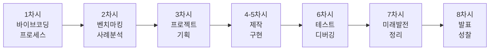
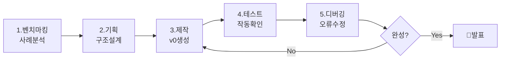
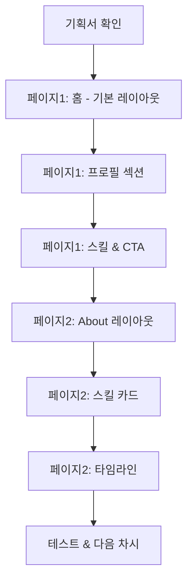

# 🎨 9학년 바이브 코딩 커리큘럼 (8차시)

## 📌 학년 목표 및 핵심 역량

### 학습 목표
- **자기표현**: 나만의 이야기를 웹으로 표현하기
- **AI 협업**: ChatGPT와 v0를 활용한 창작 경험
- **프로세스 이해**: 벤치마킹 → 기획 → 제작 → 테스트 → 발전 방향
- **디버깅 능력**: 문제 해결 및 개선 능력 향상

### 핵심 역량
| 역량 | 세부 내용 | 평가 방법 |
|------|----------|----------|
| **AI 리터러시** | 효과적인 프롬프트 작성, AI와 대화 | 프롬프트 품질 평가 |
| **벤치마킹 능력** | 사례 분석, 장단점 파악 | 분석 보고서 |
| **기획 능력** | 아이디어 구체화, 구조 설계 | 기획서/스케치 평가 |
| **디버깅 능력** | 에러 해결, ChatGPT 활용 | 문제 해결 과정 관찰 |

---

## 📚 전체 8차시 개요



| 차시 | 주제 | 핵심 활동 | 결과물 | 프로세스 단계 |
|------|------|----------|--------|--------------|
| 1 | 바이브 코딩 프로세스 | ChatGPT+v0 체험, 전체 프로세스 이해 | 샘플 프로젝트 | 🎯 프로세스 이해 |
| 2 | 벤치마킹 & 사례 분석 | 포트폴리오 사이트 분석, 장단점 파악 | 벤치마킹 리포트 | 📊 사례 연구 |
| 3 | 프로젝트 기획 | 나만의 포트폴리오 구조 설계 | 기획서 + 스케치 | 📋 기획 |
| 4-5 | 프로젝트 제작 | v0로 포트폴리오 구현 | 3페이지 포트폴리오 | 🛠️ 제작 |
| 6 | 테스트 & 디버깅 | 동료 테스트, 에러 수정 | 개선된 결과물 | 🐛 테스트 |
| 7 | 미래 발전 방향 & 정리 | 웹 개발 트렌드, 제작 과정 문서화 | 제작 일지 | 🚀 발전 방향 |
| 8 | 갤러리 워크 & 성찰 | 작품 전시, 학습 성찰 | 포트폴리오 전시 | 🎉 완성 |

---

## 🎯 차시별 상세 커리큘럼

---

### 📅 1차시: 바이브 코딩 프로세스 이해하기

> **🎯 학년 공통 차시**: 모든 학년이 동일한 내용으로 바이브 코딩의 전체 프로세스를 이해합니다.

#### 🎯 차시 목표
- 바이브 코딩의 개념과 특징 이해하기
- ChatGPT와 v0 도구 사용법 익히기
- 전체 개발 프로세스 체험하기 (기획→제작→테스트→디버깅)

#### 📦 예상 결과물
✅ **간단한 자기소개 카드** (ChatGPT + v0 활용)

---

#### 🧑‍🏫 교사용 지시서

##### 수업 전 준비사항
- [ ] ChatGPT 접속 확인 (학생별 계정 또는 교사 계정)
- [ ] v0.dev 접속 확인
- [ ] 바이브 코딩 프로세스 영상 또는 PPT
- [ ] 예시 프로젝트 3개 (간단 → 복잡)
- [ ] 학생용 워크시트 (프로세스 체크리스트)

##### 수업 진행 (50분)

| 시간 | 활동 | 교사 행동 | 학생 활동 |
|------|------|----------|----------|
| **10분** | 바이브 코딩 소개 | - 바이브 코딩 정의 설명<br/>- 전통적 코딩 vs 바이브 코딩 비교<br/>- 왜 배우는가? (Why) 강조 | - 개념 이해<br/>- 질문 정리 |
| **15분** | 전체 프로세스 시연 | - 실제 프로세스 라이브 시연<br/>1. ChatGPT로 아이디어 구체화<br/>2. v0로 디자인 생성<br/>3. 에러 발생 → ChatGPT 디버깅<br/>4. 완성 | - 관찰 및 메모<br/>- 각 단계 이해 |
| **20분** | 실습: 자기소개 카드 | - 순회지도<br/>- 개별 질문 답변<br/>- 프롬프트 피드백 | - ChatGPT에 질문<br/>- v0로 카드 생성<br/>- 에러 해결 시도 |
| **5분** | 정리 및 다음 예고 | - 8차시 전체 프로세스 소개<br/>- 다음 시간: 벤치마킹 | - 프로세스 이해 확인 |

##### 교사 스크립트

```
[도입 - 바이브 코딩이란?]
"여러분, '코딩'하면 뭐가 떠오르나요?
까만 화면에 복잡한 영어 타이핑...? 

오늘부터 배울 '바이브 코딩'은 달라요!
코드 한 줄 안 쓰고, AI에게 '말'로 설명하면
웹사이트가 만들어집니다.

핵심은:
✅ 무엇을 만들지 '기획'하는 능력
✅ AI에게 '질문 잘하는' 능력
✅ 에러가 나면 '디버깅'하는 능력

코딩 문법은 몰라도 돼요. 
대신 '생각하는 법'을 배웁니다!"

[프로세스 설명]
"바이브 코딩 프로세스는 5단계예요:

1️⃣ 벤치마킹: 잘 만든 것 보고 배우기
2️⃣ 기획: 무엇을 어떻게 만들지 계획
3️⃣ 제작: AI(v0)에게 말로 설명해서 만들기
4️⃣ 테스트: 작동하는지 확인, 에러 찾기
5️⃣ 디버깅: ChatGPT 도움받아 고치기

오늘은 이 전체 과정을 빠르게 체험합니다!"

[시연 - 실제로 보여주기]
"제가 실시간으로 만들어볼게요.

[1단계 - ChatGPT]
'자기소개 카드에 어떤 내용을 넣으면 좋을까?'

[ChatGPT 답변 확인]
오! 이름, 사진, 좋아하는 것, 꿈... 좋네요!

[2단계 - v0]
이제 v0에게 이렇게 말합니다:
'자기소개 카드를 만들어줘. 
중앙에 이름, 아래에 좋아하는 것 3가지,
배경은 파스텔 블루. Next.js로.'

[v0 생성 중...]
기다리는 동안 다른 학생 도와주기~

[생성 완료]
짜잔! 만들어졌네요!

[3단계 - 테스트]
어? 그런데 글씨가 너무 작네요. (일부러 오류 유도)

[4단계 - 디버깅]
v0에게 다시: '제목 글씨를 2배 크게 해줘'
→ 수정됨!

이게 바이브 코딩입니다. 간단하죠?"

[실습 안내]
"이제 여러분 차례!
20분 동안 자기소개 카드를 만들어보세요.

1. ChatGPT에게 아이디어 물어보기
2. v0에 프롬프트 입력
3. 결과 확인
4. 맘에 안 들면 수정 요청
5. 완성!

막히면 손들고 질문하세요!"
```

---

#### 👨‍🎓 학생용 활동 시나리오

##### 미션: 바이브 코딩으로 첫 작품 만들기

**📖 바이브 코딩이란?**

```
🎨 바이브 코딩 (Vibe Coding)

= 코드 없이 AI와 대화로 웹 개발하기

전통적 코딩:
HTML, CSS, JavaScript 문법 공부 → 코드 작성 → 디버깅
(몇 달 ~ 몇 년 소요)

바이브 코딩:
아이디어 → AI에게 설명 → 생성 → 테스트 → 수정
(몇 시간 ~ 몇 주 소요)

핵심 역량:
✅ 문제를 명확하게 정의하기
✅ AI에게 효과적으로 질문하기
✅ 에러를 찾고 해결하기
✅ 사용자 관점에서 생각하기
```

**🛠️ 바이브 코딩 도구**

```
1. ChatGPT (챗GPT)
   역할: 아이디어 브레인스토밍, 질문 답변, 디버깅
   사용 시점: 모든 단계
   
   예시:
   "자기소개 페이지에 뭘 넣으면 좋을까?"
   "이 에러를 어떻게 고치지?"

2. v0 (Vercel v0)
   역할: 실제 웹페이지 디자인 및 코드 생성
   사용 시점: 제작 단계
   
   예시:
   "파란색 배경에 이름이 큰 글씨로 있는 카드를 만들어줘"

3. 개발자 도구 (F12)
   역할: 테스트, 디버깅, 데이터 확인
   사용 시점: 테스트 단계
```

**📊 바이브 코딩 5단계 프로세스**



**Step 1: ChatGPT로 아이디어 구체화 (5분)**

💬 **ChatGPT 질문 예시**

```
[질문 1 - 콘텐츠 아이디어]
"중학생 자기소개 카드를 만들고 싶어.
어떤 정보를 넣으면 좋을까? 5가지 추천해줘."

[예상 답변 활용]
ChatGPT가 준 아이디어 중 3가지 선택:
✓ _______________________
✓ _______________________
✓ _______________________

[질문 2 - 디자인 아이디어]
"자기소개 카드 디자인 컨셉을 3가지 제안해줘.
각 컨셉의 색상과 분위기도 알려줘."

[선택]
내가 선택한 컨셉: _______________
색상: _______________
```

**Step 2: v0로 제작하기 (10분)**

🎨 **v0 프롬프트 작성 가이드**

```
좋은 프롬프트 5요소:

1. 무엇을 만들지 (카드, 페이지, 버튼 등)
2. 어떤 내용이 들어가는지
3. 레이아웃 (위치, 크기)
4. 디자인 스타일 (색상, 분위기)
5. 기술 스택 (Next.js, Tailwind CSS)
```

📝 **실제 프롬프트 예시**

```
[초보자용 - 간단하게]
"자기소개 카드를 만들어줘.
- 이름: 홍길동
- 좋아하는 것: 축구, 음악, 게임
- 배경: 파스텔 블루
Next.js로 만들어줘"

[중급자용 - 구체적으로]
"학생 자기소개 카드를 만들어줘.

레이아웃:
- 상단: 이름 '홍길동' (큰 글씨, 굵게)
- 중앙: 원형 프로필 이미지 영역 (150px)
- 하단: 좋아하는 것 3개 (아이콘과 함께)
  ⚽ 축구
  🎵 음악
  🎮 게임

디자인:
- 카드: 흰색 배경, 둥근 모서리, 그림자
- 배경: 그라데이션 (하늘색 → 연보라)
- 폰트: 깔끔한 sans-serif

크기: 400px × 600px
Next.js, Tailwind CSS 사용"
```

**Step 3: 테스트하기 (3분)**

✅ **체크리스트**

```
□ 모든 내용이 잘 보이나요?
□ 글씨 크기가 적당한가요?
□ 색상 조합이 좋은가요?
□ 모바일에서도 괜찮은가요? (화면 크기 조절)
□ 원하는 느낌이 나나요?
```

**Step 4: 디버깅 & 수정 (5분)**

🔧 **수정 프롬프트 예시**

```
[문제별 해결 프롬프트]

글씨가 작다:
"제목 글씨를 2배 크게 해줘"

색이 마음에 안 든다:
"배경을 더 밝은 파스텔 톤으로 바꿔줘"

위치가 이상하다:
"모든 요소를 중앙 정렬해줘"

간격이 좁다:
"각 요소 사이 간격을 넓혀줘"

이미지 자리가 이상하다:
"프로필 이미지를 이름 위로 옮겨줘"
```

🆘 **ChatGPT에게 도움 요청**

```
"v0로 자기소개 카드를 만들었는데 
[문제 설명: 예: 글씨가 배경과 비슷한 색이라 안 보여요]

어떻게 수정하면 좋을까요?
v0에게 줄 수정 프롬프트를 만들어줘."
```

**Step 5: 완성 및 저장 (2분)**

💾 **결과물 저장**

```
□ 스크린샷 찍기 (전체 화면)
□ v0 프로젝트 링크 복사
□ 사용한 프롬프트 메모장에 저장

파일명 예시:
- 1차시_자기소개카드_홍길동.png
- 1차시_프롬프트_홍길동.txt
```

---

#### 📊 1차시 학습 체크

```
✅ 오늘 배운 것:

□ 바이브 코딩 개념
□ ChatGPT 기본 사용법
□ v0 프롬프트 작성법
□ 테스트 방법
□ 간단한 디버깅

✅ 다음 시간 준비:

2차시는 '벤치마킹'입니다!
좋은 포트폴리오 사이트를 찾아보세요.
(예: Behance, Dribbble, 학생 작품 등)
```

---

#### 💡 교사 TIP

```
✅ 성공 포인트:
- 첫 시간은 '체험'이 목표! 완벽함보다 과정 경험
- 프롬프트 예시를 화면에 크게 띄워두기
- 빠른 학생은 카드 디자인 변형 도전
- 느린 학생은 예시 프롬프트 그대로 사용 OK

⚠️ 주의사항:
- v0 생성 시간 소요 → 대기 중 다른 학생 지도
- 학생 계정 없으면 교사 계정 공유 (순서대로)
- 첫 시간이므로 기술적 완성도보다 흥미 유발

🎯 이번 차시 핵심:
"코드 몰라도 만들 수 있다!"는 자신감 심어주기
```

---

### 📅 2차시: 벤치마킹 & 사례 분석

#### 🎯 차시 목표
- 우수 포트폴리오 사이트 분석하기
- 장단점 파악 및 인사이트 도출하기
- 내 프로젝트에 적용할 아이디어 찾기

#### 📦 예상 결과물
✅ **벤치마킹 리포트** (최소 3개 사이트 분석)

---

#### 🧑‍🏫 교사용 지시서

##### 수업 전 준비사항
- [ ] 우수 포트폴리오 사이트 10개 선정 (학생/전문가 포함)
- [ ] 벤치마킹 분석 워크시트 출력
- [ ] 프로젝터로 사이트 예시 보여줄 준비
- [ ] 분석 기준표 준비

##### 수업 진행 (50분)

| 시간 | 활동 | 교사 행동 | 학생 활동 |
|------|------|----------|----------|
| **10분** | 벤치마킹 개념 | - 벤치마킹이란 무엇인가<br/>- 왜 필요한가<br/>- 어떻게 분석하는가 | - 개념 이해<br/>- 분석 기준 학습 |
| **15분** | 사례 시연 | - 3개 사이트 함께 분석<br/>- 좋은 점, 나쁜 점, 배울 점<br/>- 분석 프레임워크 적용 | - 관찰 및 메모<br/>- 질문 |
| **20분** | 개별 분석 | - 학생별로 3개 사이트 선택 분석<br/>- ChatGPT 활용 가이드<br/>- 순회지도 | - 사이트 탐색<br/>- 워크시트 작성<br/>- 인사이트 도출 |
| **5분** | 공유 및 정리 | - 2-3명 발표<br/>- 다음 시간 예고 | - 발표 및 피드백 |

##### 교사 스크립트

```
[벤치마킹이란?]
"여러분, 작곡가가 곡을 만들기 전에 뭘 할까요?
→ 다른 노래를 많이 듣죠!

개발자도 마찬가지예요.
만들기 전에 '잘 만든 것'을 연구합니다.
이게 바로 '벤치마킹'이에요.

벤치마킹 = 좋은 사례 연구 + 내 것에 적용

주의:
❌ 그대로 베끼기 (복사)
✅ 아이디어 배우기 (영감)

오늘은 포트폴리오 사이트 3개를 분석합니다!"

[분석 기준 설명]
"포트폴리오를 볼 때 5가지를 체크하세요:

1. 첫인상 (5초 안에 무엇을 하는 사람인지 알 수 있나?)
2. 구조 (정보가 논리적으로 배치되었나?)
3. 디자인 (색상, 폰트, 레이아웃이 조화로운가?)
4. 콘텐츠 (어떤 정보를 담고 있나?)
5. 인터랙션 (클릭, 스크롤 시 반응이 있나?)

이 5가지로 점수를 매겨보세요!"
```

---

#### 👨‍🎓 학생용 활동 시나리오

##### 미션: 3개 사이트 분석하고 배우기

**Step 1: 벤치마킹 대상 찾기 (5분)**

🔍 **포트폴리오 사이트 찾는 곳**

```
추천 사이트:

1. Behance (behance.net)
   → 전문 디자이너 포트폴리오

2. Dribbble (dribbble.com)
   → UI/UX 디자이너 작품

3. GitHub Pages
   → 학생 개발자 포트폴리오

4. Notion 포트폴리오
   → 간단한 학생 포트폴리오

5. 검색어:
   "student portfolio website"
   "포트폴리오 사이트 예시"

내가 선택한 3개:
1. _______________________
2. _______________________
3. _______________________
```

**Step 2: 벤치마킹 분석표 작성 (20분)**

📋 **사이트 #1 분석**

```
┌────────────────────────────────────┐
│      벤치마킹 분석표 (Site #1)     │
├────────────────────────────────────┤
│ 사이트명: ____________________     │
│ URL: __________________________    │
│ 제작자: ____________ (학생/전문가) │
│                                    │
│ 📊 5가지 기준 평가 (각 5점 만점)    │
│                                    │
│ 1️⃣ 첫인상: [ ]/5점                │
│   • 5초 안에 이해 가능?: □Yes □No  │
│   • 첫 화면에 보이는 것:            │
│     ___________________________    │
│                                    │
│ 2️⃣ 구조: [ ]/5점                  │
│   • 페이지 수: ___개               │
│   • 메뉴 구성: _________________   │
│   • 정보 찾기 쉬운가?: □Yes □No    │
│                                    │
│ 3️⃣ 디자인: [ ]/5점                │
│   • 주요 색상: _________________   │
│   • 전체 느낌: _________________   │
│   • 일관성 있나?: □Yes □No         │
│                                    │
│ 4️⃣ 콘텐츠: [ ]/5점                │
│   • 포함된 정보:                   │
│     □ 소개  □ 경력  □ 프로젝트     │
│     □ 스킬  □ 연락처 □ 기타___     │
│   • 텍스트 양: □많음 □적당 □적음   │
│                                    │
│ 5️⃣ 인터랙션: [ ]/5점              │
│   • 애니메이션: □있음 □없음        │
│   • 호버 효과: □있음 □없음         │
│   • 특별한 기능: _________________  │
│                                    │
│ 📈 총점: ___/25점                  │
│                                    │
│ 👍 가장 좋았던 점 3가지:            │
│ 1. ___________________________    │
│ 2. ___________________________    │
│ 3. ___________________________    │
│                                    │
│ 👎 아쉬운 점 2가지:                 │
│ 1. ___________________________    │
│ 2. ___________________________    │
│                                    │
│ 💡 내 프로젝트에 적용할 아이디어:   │
│ _______________________________    │
│ _______________________________    │
│                                    │
│ 📸 스크린샷 저장: □완료             │
└────────────────────────────────────┘

※ 사이트 #2, #3도 동일하게 분석
```

**Step 3: ChatGPT로 심화 분석 (10분)**

💬 **ChatGPT 활용하기**

```
[프롬프트 1 - 디자인 분석]
"이 포트폴리오 사이트를 분석해줘.
[스크린샷 첨부 또는 URL]

다음을 알려줘:
1. 디자인 스타일 (예: 미니멀, 모던, 캐주얼 등)
2. 색상 조합이 잘 어울리는지
3. 레이아웃 구조의 장점
4. 중학생이 따라할 만한 요소 3가지"

[프롬프트 2 - 개선점 도출]
"3개 포트폴리오를 분석했어.

사이트1: [특징 요약]
사이트2: [특징 요약]
사이트3: [특징 요약]

공통적으로 좋았던 요소와 
중학생 포트폴리오에 꼭 필요한 요소를 
3가지씩 알려줘."
```

**Step 4: 인사이트 종합 (5분)**

📝 **벤치마킹 인사이트 정리**

```
┌────────────────────────────────────┐
│         인사이트 종합 리포트        │
├────────────────────────────────────┤
│ 🏆 가장 높은 점수 사이트:           │
│    _______________ (___/25점)      │
│    이유: ________________________   │
│                                    │
│ ✨ 공통적으로 좋았던 요소:           │
│ 1. ___________________________    │
│ 2. ___________________________    │
│ 3. ___________________________    │
│                                    │
│ ⚠️ 피해야 할 실수:                  │
│ 1. ___________________________    │
│ 2. ___________________________    │
│                                    │
│ 🎯 내 포트폴리오에 꼭 넣을 것:       │
│ 1. ___________________________    │
│ 2. ___________________________    │
│ 3. ___________________________    │
│                                    │
│ 🎨 선택한 디자인 방향:              │
│    분위기: _____________________   │
│    색상: _______________________   │
│    레이아웃: ____________________   │
└────────────────────────────────────┘
```

---

#### 📊 평가 기준

| 항목 | 상 (3점) | 중 (2점) | 하 (1점) |
|------|---------|---------|---------|
| **분석 깊이** | 3개 사이트 상세 분석, 구체적 | 3개 사이트 기본 분석 | 2개 이하 또는 피상적 |
| **인사이트** | 명확한 배울 점 도출 | 기본 장단점 파악 | 인사이트 부족 |
| **적용 가능성** | 내 프로젝트 연계 구체적 | 기본 연계 | 연계 불명확 |

---

### 📅 3차시: 포트폴리오 상세 기획 (기능 중심)

#### 🎯 차시 목표
- 벤치마킹 인사이트를 반영한 포트폴리오 기획
- 페이지별 기능 명세서 작성하기
- 데이터 구조 및 콘텐츠 상세 설계하기

#### 📦 예상 결과물
✅ **포트폴리오 상세 기획서** (기능 명세서 + 데이터 구조 + 화면별 상세 설계)

---

#### 🧑‍🏫 교사용 지시서

##### 수업 진행 (50분)

| 시간 | 활동 | 교사 행동 | 학생 활동 |
|------|------|----------|----------|
| **5분** | 도입 | - 벤치마킹 인사이트 복습<br/>- 기능 중심 기획의 중요성 | - 2차시 리포트 확인 |
| **15분** | 기능 정의 | - 기능 분류 방법 (MUST/SHOULD/COULD)<br/>- 예시 시연 | - 페이지별 기능 리스트 작성 |
| **20분** | 데이터 설계 | - 콘텐츠 구조화 방법<br/>- ChatGPT 활용 가이드 | - 데이터 구조 설계<br/>- 콘텐츠 작성 |
| **10분** | 화면 설계 | - 와이어프레임 작성 가이드 | - 화면별 레이아웃 스케치 |

---

#### 👨‍🎓 학생용 활동 시나리오

##### 미션: 기능과 데이터 중심으로 포트폴리오 설계하기

**Step 1: 3페이지 기능 정의 (15분)**

📋 **기능 명세서**

```
┌──────────────────────────────────────┐
│      포트폴리오 기능 명세서           │
├──────────────────────────────────────┤
│ 📄 페이지 1: 홈 (Home)                │
├──────────────────────────────────────┤
│ 🎯 목적: 첫인상, 핵심 정보 전달       │
│                                      │
│ ✅ 필수 기능 (MUST):                  │
│ 1. 프로필 표시                        │
│    - 이름 (큰 글씨, 굵게)            │
│    - 직업/역할 (예: "학생 개발자")    │
│    - 한 줄 소개 (30자 이내)           │
│                                      │
│ 2. 프로필 이미지                      │
│    - 크기: 200px × 200px (원형)       │
│    - 위치: 중앙 상단                  │
│    - 대체 텍스트: 플레이스홀더        │
│                                      │
│ 3. 주요 스킬/관심사 표시              │
│    - 아이콘 3-5개 (이모지 or 아이콘)  │
│    - 텍스트 레이블                    │
│    - 가로 배치                        │
│                                      │
│ 4. 네비게이션 메뉴                    │
│    - 위치: 상단 고정                  │
│    - 메뉴: 홈 / 소개 / 프로젝트      │
│    - 클릭 시 부드러운 스크롤          │
│                                      │
│ 5. CTA 버튼                          │
│    - 텍스트: "프로젝트 보기"          │
│    - 액션: 페이지 2로 이동            │
│    - 스타일: 눈에 띄는 색상           │
│                                      │
│ 🟡 선택 기능 (SHOULD):                │
│ 6. 배경 애니메이션                    │
│    - 그라데이션 또는 파티클            │
│    - 부드러운 움직임                  │
│                                      │
│ 7. SNS 링크                          │
│    - GitHub, Instagram, Email        │
│    - 아이콘 버튼                      │
│                                      │
│ 🟢 추가 기능 (COULD):                 │
│ 8. 다크모드 토글                      │
│ 9. 타이핑 애니메이션 (한 줄 소개)     │
│                                      │
│ 📊 데이터 필요 항목:                  │
│ • 이름: _________________________    │
│ • 역할: _________________________    │
│ • 한 줄 소개: ____________________    │
│ • 스킬 3-5개: ____________________    │
│ • 이미지 URL (선택): _____________    │
└──────────────────────────────────────┘

┌──────────────────────────────────────┐
│ 📄 페이지 2: 소개 (About)             │
├──────────────────────────────────────┤
│ 🎯 목적: 상세 정보, 스토리텔링         │
│                                      │
│ ✅ 필수 기능 (MUST):                  │
│ 1. 자기소개 섹션                      │
│    - 제목: "About Me"                │
│    - 본문: 2-3 문단 (300자)          │
│    - 좌우 2단 레이아웃 (텍스트 | 이미지)│
│                                      │
│ 2. 스킬/특기 리스트                   │
│    - 카드 형식 (3개)                  │
│    - 각 카드: 아이콘 + 제목 + 설명    │
│    - 그리드 배치 (1행 3열)            │
│                                      │
│ 3. 타임라인 (경험/활동)               │
│    - 세로 타임라인                    │
│    - 각 항목: 날짜 + 제목 + 설명      │
│    - 최소 3개 항목                    │
│                                      │
│ 4. 좋아하는 것/관심사                 │
│    - 아이콘 + 텍스트 (6-8개)          │
│    - 그리드 배치                      │
│                                      │
│ 🟡 선택 기능 (SHOULD):                │
│ 5. 스크롤 애니메이션                  │
│    - 스크롤 시 페이드인                │
│    - 순차적 등장                      │
│                                      │
│ 6. 프로그레스 바 (스킬 레벨)          │
│    - 각 스킬별 숙련도 표시            │
│    - 애니메이션 효과                  │
│                                      │
│ 📊 데이터 필요 항목:                  │
│ • 자기소개 텍스트: ________________   │
│ • 스킬 3개:                           │
│   1. [제목] [설명]                    │
│   2. [제목] [설명]                    │
│   3. [제목] [설명]                    │
│ • 타임라인 3-5개:                     │
│   - 날짜 / 제목 / 설명                │
│ • 관심사 6-8개                        │
└──────────────────────────────────────┘

┌──────────────────────────────────────┐
│ 📄 페이지 3: 프로젝트 (Projects)      │
├──────────────────────────────────────┤
│ 🎯 목적: 작품 전시, 포트폴리오 핵심    │
│                                      │
│ ✅ 필수 기능 (MUST):                  │
│ 1. 프로젝트 갤러리                    │
│    - 카드 형식 (2×2 그리드)           │
│    - 각 카드: 이미지 + 제목 + 설명    │
│    - 최소 4개 프로젝트                │
│                                      │
│ 2. 프로젝트 상세 정보                 │
│    - 사용 기술 태그                   │
│    - 제작 기간                        │
│    - 짧은 설명 (100자)                │
│                                      │
│ 3. 링크 버튼                          │
│    - "상세 보기" or "GitHub" 버튼     │
│    - 새 탭에서 열기                   │
│                                      │
│ 4. 연락처 섹션                        │
│    - 제목: "Let's Connect"           │
│    - 이메일, GitHub, SNS             │
│    - 아이콘 버튼 (클릭 가능)          │
│                                      │
│ 🟡 선택 기능 (SHOULD):                │
│ 5. 필터 기능                          │
│    - 카테고리별 필터 (Web/Game/Design)│
│    - 버튼 클릭 시 해당 프로젝트만 표시│
│                                      │
│ 6. 호버 효과                          │
│    - 카드 위에 마우스 → 확대/그림자    │
│    - 부드러운 전환                    │
│                                      │
│ 📊 데이터 필요 항목:                  │
│ • 프로젝트 4개:                       │
│   프로젝트 1:                         │
│   - 제목: _______________________    │
│   - 설명: _______________________    │
│   - 기술: _______________________    │
│   - 기간: _______________________    │
│   - 링크: _______________________    │
│   (프로젝트 2, 3, 4 동일)             │
│                                      │
│ • 연락처:                             │
│   - 이메일: ______________________   │
│   - GitHub: ______________________   │
│   - SNS: _________________________   │
└──────────────────────────────────────┘
```

**Step 2: 데이터 구조 설계 (10분)**

💾 **JSON 데이터 구조**

```javascript
// portfolio-data.json

{
  "profile": {
    "name": "홍길동",
    "role": "학생 개발자",
    "intro": "바이브 코딩으로 세상을 바꾸는 중학생",
    "imageUrl": "/images/profile.jpg",
    "skills": ["JavaScript", "AI", "Design"],
    "socialLinks": {
      "email": "example@email.com",
      "github": "https://github.com/username",
      "instagram": "https://instagram.com/username"
    }
  },
  
  "about": {
    "description": "안녕하세요! 저는 ...",
    "specialties": [
      {
        "icon": "💻",
        "title": "웹 개발",
        "description": "ChatGPT와 v0로 웹사이트 제작"
      },
      {
        "icon": "🎨",
        "title": "UI/UX 디자인",
        "description": "사용자 중심의 인터페이스 설계"
      },
      {
        "icon": "🤖",
        "title": "AI 활용",
        "description": "AI 도구를 활용한 효율적 개발"
      }
    ],
    "timeline": [
      {
        "date": "2025.03",
        "title": "바이브 코딩 시작",
        "description": "첫 포트폴리오 제작"
      },
      {
        "date": "2025.05",
        "title": "프로젝트 완성",
        "description": "3개의 웹 프로젝트 완료"
      }
    ],
    "interests": [
      "🎮 게임", "🎵 음악", "📚 독서",
      "⚽ 축구", "🎬 영화", "🍕 맛집 탐방"
    ]
  },
  
  "projects": [
    {
      "id": 1,
      "title": "첫 포트폴리오",
      "description": "바이브 코딩으로 만든 나만의 포트폴리오",
      "image": "/images/project1.jpg",
      "tags": ["Next.js", "Tailwind CSS", "v0"],
      "period": "2025.03 - 2025.04",
      "link": "https://example.com",
      "category": "Web"
    },
    // 프로젝트 2, 3, 4...
  ]
}
```

**Step 3: ChatGPT로 콘텐츠 작성 (15분)**

💬 **콘텐츠 생성 프롬프트**

```
[프롬프트 1: 자기소개 작성]
"중학생 포트폴리오의 About 섹션 자기소개를 작성해줘.

정보:
- 이름: [내 이름]
- 특징: [내 특징 3가지]
- 좋아하는 것: [3가지]
- 목표: [미래 목표]

요구사항:
- 2-3 문단 (300자 정도)
- 친근하고 자연스러운 톤
- '~습니다' 보다 '~해요' 사용
- 긍정적이고 활기찬 느낌

3가지 버전을 만들어줘."

[프롬프트 2: 프로젝트 설명]
"프로젝트 설명을 작성해줘.

프로젝트: [프로젝트명]
무엇을: [간단 설명]
왜 만들었나: [이유]
기술: [사용한 기술]

요구사항:
- 100자 이내
- 핵심만 간결하게
- 임팩트 있게

5가지 버전을 제안해줘."

[프롬프트 3: 타임라인 아이디어]
"중학생의 포트폴리오 타임라인에 들어갈 
활동/경험 아이디어 10개를 제안해줘.

카테고리:
- 학습 경험
- 프로젝트
- 수상/인증
- 동아리/봉사
- 특별한 경험

각 항목마다:
- 날짜 (예시)
- 제목
- 짧은 설명 (50자)

형식으로 정리해줘."
```

**Step 4: 와이어프레임 (화면 설계) (10분)**

📐 **상세 레이아웃 스케치**

```
페이지 1: 홈 (Home)
┌─────────────────────────────────┐
│ [로고]         홈 소개 프로젝트  │ ← 네비게이션 (고정)
├─────────────────────────────────┤
│                                 │
│         ┌─────────┐             │
│         │ Profile │             │ ← 프로필 이미지
│         │  Image  │             │   (200×200, 원형)
│         └─────────┘             │
│                                 │
│         홍 길 동                │ ← 이름 (4xl, 굵게)
│                                 │
│      학생 개발자                │ ← 역할 (xl)
│                                 │
│  바이브 코딩으로 세상을 바꾸는  │ ← 한 줄 소개 (lg)
│        중학생입니다             │
│                                 │
│   💻  🎨  🤖  📱  🎮          │ ← 스킬 아이콘
│  코딩 디자인 AI 앱개발 게임      │
│                                 │
│     [프로젝트 보기 →]           │ ← CTA 버튼
│                                 │
│   GitHub | Email | Instagram    │ ← SNS 링크
│                                 │
└─────────────────────────────────┘

레이아웃 상세:
• 배경: 그라데이션 (연보라 → 하늘색)
• 모든 요소: 중앙 정렬
• 여백: 각 요소 사이 20-30px
• 폰트: 
  - 이름: 64px (4xl)
  - 역할: 24px (xl)
  - 소개: 18px (lg)

───────────────────────────────────

페이지 2: 소개 (About)
┌─────────────────────────────────┐
│ [로고]         홈 소개 프로젝트  │
├─────────────────────────────────┤
│                                 │
│        About Me                 │ ← 제목 (3xl, 중앙)
│                                 │
├──────────────┬──────────────────┤
│              │   ┌─────────┐   │
│ 안녕하세요!  │   │         │   │
│ 저는 바이브  │   │  Image  │   │ ← 2단 레이아웃
│ 코딩으로...  │   │         │   │   (텍스트 | 이미지)
│              │   └─────────┘   │
├──────────────┴──────────────────┤
│                                 │
│        My Specialties           │ ← 부제목
│                                 │
│ ┌────┐  ┌────┐  ┌────┐        │
│ │💻  │  │🎨  │  │🤖  │        │ ← 스킬 카드
│ │웹  │  │디자│  │AI  │        │   (3열 그리드)
│ │개발│  │인  │  │활용│        │
│ └────┘  └────┘  └────┘        │
│                                 │
│        My Journey               │
│                                 │
│  │ 2025.03  바이브 코딩 시작   │
│  │ 2025.05  첫 프로젝트 완성   │ ← 타임라인
│  │ 2025.08  포트폴리오 제작    │   (세로 라인)
│  │                             │
│                                 │
│        Interests                │
│                                 │
│  🎮 게임  🎵 음악  📚 독서     │
│  ⚽ 축구  🎬 영화  🍕 맛집     │ ← 관심사 그리드
│                                 │
└─────────────────────────────────┘

───────────────────────────────────

페이지 3: 프로젝트 (Projects)
┌─────────────────────────────────┐
│ [로고]         홈 소개 프로젝트  │
├─────────────────────────────────┤
│                                 │
│        My Projects              │ ← 제목
│                                 │
│ ┌──────────┐  ┌──────────┐     │
│ │ Project1 │  │ Project2 │     │
│ │  Image   │  │  Image   │     │ ← 2×2 그리드
│ │  Title   │  │  Title   │     │
│ │ [보기]   │  │ [보기]   │     │
│ └──────────┘  └──────────┘     │
│                                 │
│ ┌──────────┐  ┌──────────┐     │
│ │ Project3 │  │ Project4 │     │
│ │  Image   │  │  Image   │     │
│ │  Title   │  │  Title   │     │
│ │ [보기]   │  │ [보기]   │     │
│ └──────────┘  └──────────┘     │
│                                 │
│        Let's Connect            │
│                                 │
│   📧 Email  🐙 GitHub  📷 SNS  │ ← 연락처
│                                 │
└─────────────────────────────────┘

각 프로젝트 카드 상세:
┌──────────────┐
│              │
│   [이미지]   │ ← 300×200
│              │
├──────────────┤
│ 프로젝트 제목 │ ← 폰트 xl, 굵게
│ 짧은 설명...  │ ← 폰트 sm, 2줄
│ #Tag #Tag    │ ← 기술 태그
│              │
│ [GitHub]보기 │ ← 버튼 2개
└──────────────┘
```

---

### 📅 4-5차시: 포트폴리오 제작 (기능별 구현)

#### 🎯 차시 목표
- 3차시 기획서를 바탕으로 기능별 구현하기
- v0로 각 기능을 단계적으로 제작하기
- 데이터를 실제로 연동하기

#### 📦 예상 결과물 
✅ **작동하는 3페이지 포트폴리오** (모든 기능 구현)

---

#### 👨‍🎓 학생용 활동 시나리오

##### 4차시: 페이지 1-2 제작 (50분)

**기능별 구현 로드맵**



**Step 1: 홈 페이지 - 기본 레이아웃 (15분)**

🎨 **v0 프롬프트 (기능 1-4)**

```
"포트폴리오 홈 페이지를 만들어줘.

기능 명세:

1. 네비게이션 바 (고정)
   - 위치: 상단 고정 (sticky)
   - 로고: 좌측 (내 이름 또는 로고)
   - 메뉴: 우측 (홈, 소개, 프로젝트)
   - 배경: 반투명 흰색 (backdrop-blur)
   - 스크롤 시에도 상단 유지

2. 프로필 섹션 (중앙)
   - 프로필 이미지:
     • 크기: 200×200px
     • 모양: 원형 (rounded-full)
     • 테두리: 4px, 흰색
     • 그림자: 큰 그림자 (shadow-2xl)
     • 플레이스홀더: 회색 배경 + 이니셜
   
   - 이름:
     • 텍스트: "홍길동"
     • 폰트 크기: 64px (text-6xl)
     • 굵기: 900 (font-black)
     • 여백: 위 24px
   
   - 역할:
     • 텍스트: "학생 개발자"
     • 폰트 크기: 24px (text-2xl)
     • 색상: 회색 (text-gray-600)
     • 여백: 위 8px
   
   - 한 줄 소개:
     • 텍스트: "바이브 코딩으로 세상을 바꾸는 중학생"
     • 폰트 크기: 18px (text-lg)
     • 투명도: 80%
     • 여백: 위 16px

3. 스킬 아이콘 섹션
   - 레이아웃: 가로 나열 (flex row)
   - 간격: 24px
   - 각 스킬:
     • 이모지: 48px 크기
     • 텍스트: 아래에 작게
     • 호버: 살짝 위로 (hover:-translate-y-2)
   - 스킬 5개: 💻코딩 🎨디자인 🤖AI 📱앱 🎮게임

4. CTA 버튼
   - 텍스트: "프로젝트 보기 →"
   - 크기: 큼직하게 (px-8 py-4)
   - 색상: 파란색 그라데이션
   - 둥근 모서리: rounded-full
   - 호버: 약간 커지고 그림자 증가
   - 클릭: 페이지 3으로 스크롤 (smooth)

레이아웃:
- 전체: 중앙 정렬 (items-center, justify-center)
- 높이: 전체 화면 (h-screen)
- 배경: 그라데이션 (from-purple-100 to-blue-100)
- 모든 요소: 세로 배치 (flex-col)

애니메이션:
- 페이지 로드 시: 순차적 페이드인
  1. 이미지 (0ms)
  2. 이름 (200ms)
  3. 역할 (400ms)
  4. 소개 (600ms)
  5. 스킬 (800ms)
  6. 버튼 (1000ms)

Next.js 14, Tailwind CSS, Framer Motion 사용"
```

✅ **체크포인트 1**
```
□ 네비게이션 상단 고정
□ 프로필 이미지 원형
□ 텍스트 크기 및 배치 정확
□ 스킬 아이콘 5개 보임
□ 버튼 호버 효과 작동
□ 페이드인 애니메이션 작동
```

**Step 2: 홈 페이지 - SNS 링크 추가 (5분)**

```
"이전 홈 페이지에 SNS 링크 섹션을 추가해줘.

기능 명세:

5. SNS 링크 섹션
   - 위치: CTA 버튼 아래
   - 레이아웃: 가로 나열
   - 간격: 16px
   
   링크 3개:
   1. GitHub
      • 아이콘: GitHub 아이콘 (react-icons)
      • 텍스트: "GitHub"
      • URL: https://github.com/username
   
   2. Email
      • 아이콘: 메일 아이콘
      • 텍스트: "Email"
      • URL: mailto:example@email.com
   
   3. Instagram
      • 아이콘: Instagram 아이콘
      • 텍스트: "Instagram"
      • URL: https://instagram.com/username
   
   스타일:
   - 각 링크: 아이콘 + 텍스트
   - 크기: 작게 (text-sm)
   - 색상: 회색 (gray-600)
   - 호버: 파란색으로 변경, 밑줄
   - 새 탭: target="_blank"

react-icons 라이브러리 사용"
```

**Step 3: About 페이지 - 레이아웃 (15min)**

🎨 **v0 프롬프트**

```
"포트폴리오 About 페이지를 만들어줘.

기능 명세:

1. 자기소개 섹션 (2단 레이아웃)
   - 전체 너비: 최대 1200px
   - 레이아웃: 좌 60% | 우 40%
   
   좌측 (텍스트):
   • 제목: "About Me"
     - 폰트: 48px (text-5xl), 굵게
     - 여백: 하단 24px
   
   • 본문: 자기소개 텍스트
     - 문단 3개
     - 폰트: 18px (text-lg)
     - 줄 간격: 넓게 (leading-relaxed)
     - 색상: 회색 (gray-700)
     - 각 문단 여백: 16px
   
   우측 (이미지):
   • 이미지: 정사각형
     - 크기: 400×400px
     - 둥근 모서리: rounded-2xl
     - 그림자: shadow-xl
     - 플레이스홀더: 회색

2. 스킬 카드 섹션
   - 제목: "My Specialties"
     • 중앙 정렬
     • 폰트: 36px (text-4xl)
     • 여백: 상단 80px, 하단 40px
   
   - 카드 3개 (그리드)
     • 레이아웃: 3열 (grid-cols-3)
     • 간격: 32px
     
     각 카드:
     • 배경: 흰색
     • 패딩: 32px
     • 둥근 모서리: rounded-xl
     • 그림자: shadow-lg
     • 호버: 위로 이동, 그림자 증가
     
     구조:
     • 아이콘: 상단 중앙 (64px)
     • 제목: 아래 (text-xl, 굵게)
     • 설명: 하단 (text-sm, 회색)

3. 타임라인 섹션
   - 제목: "My Journey"
     • 중앙 정렬
     • 폰트: 36px
     • 여백: 상단 80px, 하단 40px
   
   - 타임라인 (세로)
     • 중앙에 세로 라인 (2px, 파란색)
     • 각 항목:
       - 좌측: 날짜 (작게, 회색)
       - 원형 점: 라인 위 (12px, 파란색)
       - 우측: 제목 + 설명
     • 최소 3개 항목
     • 간격: 40px

4. 관심사 섹션
   - 제목: "Interests"
   - 그리드: 4열
   - 각 항목: 이모지 + 텍스트
   - 배경: 연한 색상 카드
   - 호버: 색상 진하게

스타일:
- 배경: 흰색
- 전체 패딩: 상하 80px, 좌우 40px
- 반응형: 모바일에서 1열

애니메이션:
- 스크롤 시: 각 섹션 페이드인
- Intersection Observer 사용

Next.js, Tailwind, Framer Motion"
```

**데이터 연동**

```javascript
// about-data.ts

export const aboutData = {
  intro: {
    paragraphs: [
      "안녕하세요! 저는 바이브 코딩으로 세상을 바꾸고 싶은 중학생 개발자입니다.",
      "AI 도구인 ChatGPT와 v0를 활용하여 코딩 없이도 멋진 웹사이트를 만들 수 있다는 것을 배웠습니다.",
      "앞으로 더 많은 프로젝트를 통해 실력을 키우고, 사람들에게 도움이 되는 서비스를 만들고 싶습니다!"
    ],
    imageUrl: "/images/about.jpg"
  },
  
  specialties: [
    {
      icon: "💻",
      title: "웹 개발",
      description: "ChatGPT와 v0를 활용한 빠른 프로토타이핑"
    },
    {
      icon: "🎨",
      title: "UI/UX 디자인",
      description: "사용자 중심의 직관적인 인터페이스"
    },
    {
      icon: "🤖",
      title: "AI 활용",
      description: "AI 도구를 활용한 효율적인 개발"
    }
  ],
  
  timeline: [
    {
      date: "2025.03",
      title: "바이브 코딩 시작",
      description: "9학년 수업에서 처음 접함"
    },
    {
      date: "2025.05",
      title: "첫 프로젝트 완성",
      description: "포트폴리오 웹사이트 제작"
    },
    {
      date: "2025.08",
      title: "3개 프로젝트 완료",
      description: "포트폴리오, 다이어리, 게임"
    }
  ],
  
  interests: [
    { emoji: "🎮", text: "게임" },
    { emoji: "🎵", text: "음악" },
    { emoji: "📚", text: "독서" },
    { emoji: "⚽", text: "축구" },
    { emoji: "🎬", text: "영화" },
    { emoji: "🍕", text: "맛집" },
    { emoji: "🎨", text: "그림" },
    { emoji: "🚴", text: "자전거" }
  ]
};
```

##### 5차시: 페이지 3 제작 & 통합 (50분)

**Step 1: Projects 페이지 (30분)**

```
"포트폴리오 Projects 페이지를 만들어줘.

기능 명세:

1. 프로젝트 갤러리
   - 제목: "My Projects"
     • 중앙 정렬, 48px, 굵게
     • 여백: 상단 80px, 하단 60px
   
   - 그리드 레이아웃
     • 2×2 그리드 (데스크톱)
     • 1열 (모바일)
     • 간격: 32px
     • 최대 너비: 1200px

2. 프로젝트 카드 (각 카드)
   구조:
   • 이미지 영역 (상단)
     - 크기: 가로 100%, 세로 200px
     - 둥근 모서리: 상단만
     - 오버플로: 숨김
     - 플레이스홀더: 그라데이션 배경
   
   • 콘텐츠 영역 (하단)
     - 패딩: 24px
     - 배경: 흰색
     
     내용:
     - 제목: text-xl, 굵게, 여백 하단 8px
     - 설명: text-sm, 회색, 2줄 제한
     - 기술 태그: 
       • 가로 나열
       • 각 태그: 작은 배지 (px-2 py-1)
       • 배경: 파란색 10%
       • 텍스트: 파란색
       • 둥근 모서리
     - 기간: text-xs, 회색, 위 여백 12px
   
   • 버튼 영역
     - 2개 버튼 (가로 나열)
     - "GitHub" (회색)
     - "상세보기" (파란색)
     - 새 탭 열기
   
   스타일:
   • 카드 전체:
     - 배경: 흰색
     - 둥근 모서리: rounded-xl
     - 그림자: shadow-lg
     - 테두리: 연한 회색 1px
     - 호버: 위로 이동, 그림자 증가
     - 전환: 부드럽게

3. 필터 기능 (선택)
   - 위치: 제목과 그리드 사이
   - 버튼 3개: All / Web / Game
   - 클릭 시 해당 카테고리만 표시
   - 활성 버튼: 파란색 배경

4. 연락처 섹션
   - 제목: "Let's Connect"
     • 중앙 정렬
     • 여백: 상단 120px
   
   - SNS 링크 3개 (가로 나열)
     • 각 링크: 큰 아이콘 + 텍스트
     • 크기: 아이콘 32px
     • 호버: 색상 변경, 확대
     • 새 탭 열기

애니메이션:
- 스크롤 시: 카드 순차 페이드인
- 호버: 카드 위로 이동 (-8px)
- 필터: 페이드 전환

데이터:
- 프로젝트 배열을 props로 받기
- map 함수로 카드 생성

Next.js, Tailwind CSS, Framer Motion"
```

**프로젝트 데이터**

```javascript
// projects-data.ts

export const projectsData = [
  {
    id: 1,
    title: "첫 번째 포트폴리오",
    description: "바이브 코딩으로 제작한 나만의 포트폴리오 웹사이트. 3페이지로 구성되어 있으며 반응형 디자인 적용.",
    image: "/images/project1.jpg",
    tags: ["Next.js", "Tailwind CSS", "v0", "Framer Motion"],
    period: "2025.03 - 2025.04",
    githubUrl: "https://github.com/username/portfolio",
    demoUrl: "https://portfolio.example.com",
    category: "Web"
  },
  {
    id: 2,
    title: "감정 다이어리",
    description: "매일의 감정을 기록하고 통계로 확인할 수 있는 웹 앱. localStorage를 활용한 데이터 저장.",
    image: "/images/project2.jpg",
    tags: ["React", "Chart.js", "localStorage"],
    period: "2025.05 - 2025.06",
    githubUrl: "https://github.com/username/diary",
    demoUrl: "https://diary.example.com",
    category: "Web"
  },
  {
    id: 3,
    title: "클릭 스피드 게임",
    description: "10초 안에 최대한 많이 클릭하는 반응속도 게임. 최고 기록 저장 기능 포함.",
    image: "/images/project3.jpg",
    tags: ["JavaScript", "HTML5", "CSS3"],
    period: "2025.07",
    githubUrl: "https://github.com/username/game",
    demoUrl: "https://game.example.com",
    category: "Game"
  },
  {
    id: 4,
    title: "환경 캠페인 페이지",
    description: "플라스틱 사용 줄이기 캠페인 랜딩페이지. 서명 기능과 공유 기능 구현.",
    image: "/images/project4.jpg",
    tags: ["Next.js", "Vercel", "Social API"],
    period: "2025.08",
    githubUrl: "https://github.com/username/campaign",
    demoUrl: "https://campaign.example.com",
    category: "Web"
  }
];
```

**Step 2: 페이지 연결 & 네비게이션 (15분)**

```
"3개 페이지를 연결하고 네비게이션을 작동시켜줘.

기능 명세:

1. 페이지 라우팅
   - 페이지 구조:
     / → 홈 (Home)
     /about → 소개 (About)
     /projects → 프로젝트 (Projects)
   
   - Next.js App Router 사용
   - 각 페이지는 별도 컴포넌트

2. 네비게이션 메뉴 업데이트
   - 현재 페이지 하이라이트
     • 활성 페이지: 파란색, 굵게
     • 비활성: 회색
   
   - 클릭 시 페이지 이동
     • Next.js Link 사용
     • 부드러운 전환

3. 스크롤 기능 (홈 페이지 내)
   - "프로젝트 보기" 버튼 클릭 시
   - → /projects 페이지로 이동
   - (같은 페이지 스크롤 아님)

4. 공통 레이아웃
   - 네비게이션 바: 모든 페이지 공통
   - Footer: 모든 페이지 하단
     • 저작권 정보
     • SNS 링크
     • 상단으로 버튼

5. 반응형 디자인
   - 모바일 메뉴
     • 768px 이하: 햄버거 메뉴
     • 클릭 시 사이드바 열림
     • 메뉴 항목 세로 배치

6. 로딩 상태
   - 페이지 전환 시 로딩 바
   - Next.js의 loading.tsx 활용

파일 구조:
app/
├── layout.tsx (공통 레이아웃)
├── page.tsx (홈)
├── about/
│   └── page.tsx
├── projects/
│   └── page.tsx
└── components/
    ├── Navigation.tsx
    └── Footer.tsx"
```

**Step 3: 최종 테스트 & 디버깅 (5분)**

✅ **통합 테스트 체크리스트**

```
기능 테스트:
□ 홈 페이지 모든 요소 표시
□ About 페이지 스크롤 애니메이션
□ Projects 페이지 카드 4개 표시
□ 네비게이션 메뉴 작동
□ 현재 페이지 하이라이트
□ 모든 링크 작동 (GitHub, Demo)
□ SNS 링크 새 탭 열기
□ 필터 기능 작동 (선택사항)

디자인 테스트:
□ 모든 텍스트 읽기 쉬움
□ 이미지 비율 정상
□ 간격 및 여백 적절
□ 색상 조합 일관성
□ 호버 효과 작동
□ 애니메이션 부드러움

반응형 테스트:
□ 데스크톱 (1920px)
□ 태블릿 (768px)
□ 모바일 (375px)
□ 햄버거 메뉴 작동 (모바일)

성능 테스트:
□ 페이지 로딩 빠름 (3초 이내)
□ 애니메이션 버벅임 없음
□ 이미지 최적화
```

🐛 **자주 나오는 에러 & 해결**

```
에러 1: 네비게이션 메뉴 현재 페이지 표시 안 됨
원인: usePathname() 미사용
해결: 
"Navigation 컴포넌트에서 현재 경로를 감지하여 
활성 메뉴를 하이라이트하는 기능을 추가해줘.
usePathname() hook 사용"

에러 2: 페이지 전환 시 애니메이션 깨짐
원인: Framer Motion과 Next.js 라우팅 충돌
해결:
"페이지 전환 애니메이션을 Next.js와 
Framer Motion이 충돌하지 않게 수정해줘"

에러 3: 모바일에서 레이아웃 깨짐
원인: 반응형 클래스 누락
해결:
"모바일 (768px 이하)에서 그리드를 1열로,
패딩을 줄여줘. Tailwind responsive 사용"

에러 4: 이미지 로딩 느림
원인: 최적화 안 됨
해결:
"Next.js Image 컴포넌트로 변경하고
loading='lazy', placeholder='blur' 추가해줘"
```

---

### 📅 6차시: 테스트 & 디버깅

*(기존 내용 유지, 동료 테스트 강화)*

---

### 📅 7차시: 미래 발전 방향 & 제작 과정 정리

#### 🎯 차시 목표
- 웹 개발 분야의 미래 트렌드 이해하기
- 내가 만든 프로젝트의 발전 가능성 탐색하기
- 제작 과정 문서화하여 포트폴리오에 추가하기

#### 📦 예상 결과물
✅ **제작 일지** + **발전 방향 로드맵**

---

#### 👨‍🎓 학생용 활동 시나리오

##### 미션: 제작 과정 정리 & 미래 구상하기

**Step 1: 제작 과정 문서화 (20분)**

📝 **프로젝트 회고록**

```
┌────────────────────────────────────┐
│        프로젝트 제작 일지           │
├────────────────────────────────────┤
│ 프로젝트명: ____________________   │
│ 제작 기간: _____월 _____일 ~ ___일 │
│                                    │
│ 📋 기획 단계                        │
│ • 벤치마킹한 사이트: _개           │
│ • 핵심 아이디어: _________________  │
│ • 처음 계획 vs 최종 결과:           │
│   - 같은 점: ___________________   │
│   - 다른 점: ___________________   │
│   - 왜 변경?: __________________   │
│                                    │
│ 🛠️ 제작 단계                       │
│ • 사용한 도구:                     │
│   □ ChatGPT (___회 사용)          │
│   □ v0 (___회 프롬프트 입력)       │
│   □ 기타: ____________________    │
│                                    │
│ • 가장 어려웠던 부분:               │
│   _____________________________   │
│   해결 방법: ___________________   │
│                                    │
│ • 가장 뿌듯했던 순간:               │
│   _____________________________   │
│                                    │
│ 🐛 디버깅 경험                      │
│ • 마주한 에러 개수: ___개           │
│ • 주요 에러 3가지와 해결법:         │
│   1. 에러: _____________________   │
│      해결: _____________________   │
│   2. 에러: _____________________   │
│      해결: _____________________   │
│   3. 에러: _____________________   │
│      해결: _____________________   │
│                                    │
│ 📊 최종 결과                        │
│ • 완성도: ____%                    │
│ • 총 페이지 수: ___개               │
│ • 구현한 기능: __________________   │
│ • 구현 못한 기능: ________________  │
│                                    │
│ 🎓 배운 점                          │
│ 1. ___________________________    │
│ 2. ___________________________    │
│ 3. ___________________________    │
│                                    │
│ 💪 성장한 부분                      │
│ • 프롬프트 작성: Before [  ] After [  ]│
│ • 디버깅 능력: Before [  ] After [  ] │
│ • 기획 능력: Before [  ] After [  ]   │
└────────────────────────────────────┘
```

**Step 2: 웹 개발 미래 트렌드 탐색 (15분)**

💬 **ChatGPT로 트렌드 학습**

```
"웹 개발의 미래 트렌드를 중학생이 이해할 수 있게 설명해줘.

다음 주제에 대해:
1. AI와 웹 개발의 결합 (예: AI 디자이너, 자동 코딩)
2. 노코드/로우코드 플랫폼의 발전
3. 개인 포트폴리오의 중요성
4. 메타버스와 3D 웹
5. 앞으로 10년 후 웹 개발자의 모습

각 주제마다:
- 현재 상황
- 미래 전망
- 중학생이 지금 준비할 수 있는 것"
```

📊 **트렌드 정리**

```
🚀 웹 개발 미래 트렌드 (내가 이해한 것)

1. AI + 개발 = ?
   ___________________________________

2. 노코드로 누구나 개발자?
   ___________________________________

3. 내 포트폴리오가 중요한 이유:
   ___________________________________

4. 가상 공간에서의 웹:
   ___________________________________

5. 10년 후 나는?
   ___________________________________
```

**Step 3: 내 프로젝트 발전 방향 (10분)**

🗺️ **로드맵 작성**

```
┌────────────────────────────────────┐
│      내 포트폴리오 발전 로드맵      │
├────────────────────────────────────┤
│ 🎯 현재 (지금)                      │
│ • 완성한 것: _____________________  │
│ • 부족한 것: _____________________  │
│                                    │
│ 📅 1개월 후                         │
│ • 추가할 기능: ___________________  │
│ • 보완할 디자인: _________________  │
│ • 새로 만들 페이지: _______________  │
│                                    │
│ 📅 6개월 후                         │
│ • 목표: _________________________  │
│ • 새 프로젝트 아이디어:             │
│   1. _________________________    │
│   2. _________________________    │
│                                    │
│ 📅 1년 후 (10학년)                  │
│ • 포트폴리오 활용 계획:             │
│   □ 대회 출품                      │
│   □ 동아리 지원서에 첨부            │
│   □ 진로 탐색 활동                 │
│   □ 기타: ____________________    │
│                                    │
│ 🌟 궁극적 목표                      │
│ _______________________________   │
│ _______________________________   │
└────────────────────────────────────┘
```

**Step 4: README 작성 (5분)**

```markdown
# 내 첫 포트폴리오

## 📌 프로젝트 소개
[한 문장으로]

## 🛠️ 사용 기술
- ChatGPT
- v0 (Next.js, Tailwind CSS)
- [기타]

## ✨ 주요 기능
1. [기능 1]
2. [기능 2]
3. [기능 3]

## 📸 스크린샷
[이미지]

## 🎓 배운 점
- [배운 점 1]
- [배운 점 2]

## 🚀 향후 계획
- [개선 계획]

## 📧 연락처
- Email: your@email.com
- GitHub: github.com/yourusername
```

---

#### 💡 교사 TIP

```
✅ 이 차시의 의미:
- 단순히 "만들고 끝"이 아님
- 과정을 되돌아보며 메타인지 강화
- 미래 방향성 제시로 동기부여
- 포트폴리오 자료로 활용 가능한 문서화

🎯 진행 팁:
- ChatGPT로 트렌드 학습 → 흥미 유발
- 제작 일지는 솔직하게 (실패도 성장의 증거)
- 로드맵은 구체적으로 (날짜, 목표 명확히)
```

---

### 📅 8차시: 갤러리 워크 & 성찰

*(기존 내용 유지)*

---

## 🎉 마치며

이 8차시 커리큘럼을 통해 학생들은:

✅ **프로세스 이해**: 벤치마킹 → 기획 → 제작 → 테스트 → 발전  
✅ **AI 협업**: ChatGPT/v0 활용한 효율적 개발  
✅ **분석 능력**: 우수 사례 분석 및 인사이트 도출  
✅ **문서화**: 제작 과정 체계적 정리  
✅ **미래 준비**: 웹 개발 트렌드 이해 및 로드맵 작성

**핵심 메시지**: 
**"벤치마킹하고, 기획하고, AI와 함께 만들고, 발전 방향을 그린다!"**

---

**버전**: v2.0 (9학년용 - 프로세스 강화)  
**작성일**: 2025년 11월  
**주요 변경사항**:
- 1차시: 바이브 코딩 프로세스 통일
- 2차시: 벤치마킹 차시 추가
- 7차시: 미래 발전 방향 & 정리 추가
- 전체: 5단계 프로세스 반영
