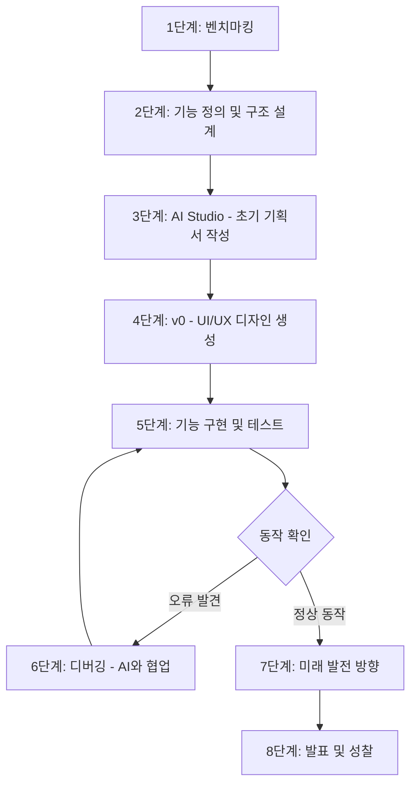
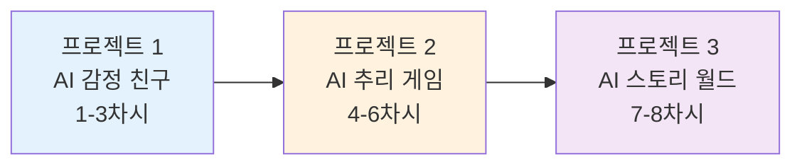

# 바이브 코딩 기반 창업가 정신 교육 커리큘럼 (24차시)

## 📋 교육 개요

### 교육 철학 및 핵심 목표

**"코딩하지 않고 창조하라 - 기획자이자 실행자로서의 성장"**

이 교육은 **코딩 능력**이 아닌 **기획 능력**과 **기업가 정신**을 키우는 데 초점을 맞춥니다.  
학생들은 가상 제작 공간에서 자신의 아이디어를 구현하며, AI 도구를 활용하는 **리터러시 능력**을 습득합니다.

---

### 🎯 핵심 역량 (Core Competencies)

| 역량 | 설명 | Why? |
|------|------|------|
| **AI 리터러시** | AI 도구(AI Studio, v0, ChatGPT)를 활용하여 아이디어를 코드로 변환하는 능력 | 미래 사회에서 AI는 협업 파트너이며, 이를 효과적으로 사용하는 능력이 경쟁력이 됨 |
| **질문 설계 능력** | 명확하고 구체적인 프롬프트를 작성하여 원하는 결과를 얻는 능력 | 좋은 질문이 좋은 결과를 만들며, 이는 문제 해결의 시작점 |
| **기획 및 구조화** | 프로젝트의 전체 구조, 플로우, 아키텍처를 설계하는 능력 | 실행 전 설계가 명확해야 효율적인 개발과 디버깅이 가능 |
| **프로세스 이해** | 개발 단계(기획→설계→구현→테스트)를 이해하고 각 단계의 의미를 아는 능력 | 전체 프로세스를 이해해야 효과적인 협업과 프로젝트 관리 가능 |
| **디버거 역할** | 오류를 발견하고 AI와 협업하여 해결하는 능력 | 완벽한 코드는 없으며, 문제를 발견하고 해결하는 과정이 학습의 핵심 |
| **기업가 정신** | 문제를 발견하고 해결책을 제안하며 실행하는 주도적 태도 | 단순 소비자가 아닌 창조자로서의 마인드셋 형성 |

---

### 🛠️ 바이브 코딩 프로세스 (Vibe Coding Process)

---

### 📊 도구별 역할 및 활용 방법

| 도구 | 역할 | 활용 시점 | 학생이 작성할 내용 | Why? |
|------|------|-----------|-------------------|------|
| **AI Studio (Google)** | 프로젝트 기획서 작성, 기능 명세서 생성 | 1-2차시 (기획 단계) | - 프로젝트 목표 - 주요 기능 리스트 - 사용자 시나리오 - 화면 구성안 | 명확한 기획이 성공적인 실행의 기반이며, AI에게 정확한 지시를 내리기 위한 준비 |
| **v0 (Vercel)** | UI/UX 디자인 자동 생성, 컴포넌트 제작 | 3-5차시 (설계 및 구현) | - 화면별 레이아웃 설명 - 버튼/입력창 등 UI 요소 - 색상/스타일 선호도 | 디자인 능력 없이도 전문적인 인터페이스 제작 가능, 시각적 피드백을 통한 빠른 반복 |
| **localStorage / JSON** | 간단한 데이터 저장 및 관리 | 4-6차시 (기능 구현) | - 저장할 데이터 항목 정의 - 데이터 흐름 설계 | 백엔드/DB 없이 프로토타입 테스트 가능, 데이터 구조 이해 |
| **ChatGPT API** | 코드 설명, 오류 해결, 기능 추가 | 전 과정 (특히 디버깅) | - 구체적인 질문 작성 - 오류 메시지 복사 - 원하는 결과 설명 | AI와의 대화를 통해 문제 해결 능력 향상, 즉각적인 학습 피드백 |

---

### 🎓 학년별 교육 목표 및 프로젝트 방향

| 학년 | 주제 | 교육 목표 | 프로젝트 방향 | 기대 성과 |
|------|------|-----------|---------------|-----------|
| **9학년** | 자기표현과 창의 | - 자신의 아이디어를 디지털로 표현 - 기본적인 웹 구조 이해 - AI 도구 기초 활용법 습득 | 개인 포트폴리오 웹사이트 (3페이지: Home/About/Projects) | 자기효능감 향상, 디지털 창작 자신감 |
| **10학년** | 사회 공감과 협력 | - 사회 문제 인식 및 해결책 기획 - 팀 협업 및 역할 분담 - 사용자 관점 UX 설계 | 사회문제 해결 캠페인 랜딩페이지 (5섹션: Hero/Problem/Solution/Action/Impact) | 공감 능력, 협업 역량, 사회적 책임감 |
| **11학년** | AI API 활용과 혁신 | - ChatGPT API 심화 활용 - 복잡한 데이터 구조 설계 - 인터랙티브 시스템 구현 | AI 감정 친구 + AI 추리 게임 + AI 스토리 월드 (3개 API 기반 프로젝트) | AI 리터러시, 시스템 사고, 창의적 문제 해결 |

---

## 📚 9학년: 자기표현과 창의 (8차시)

### 학습 목표 (Learning Objectives)

**핵심 질문**: "나는 누구이며, 무엇을 만들고 싶은가?"

| 영역 | 목표 | Why? |
|------|------|------|
| **인지적** | 웹 프로젝트의 기본 구조(페이지, 컴포넌트, 데이터 흐름) 이해 | 구조를 이해해야 효과적인 기획 가능 |
| **기능적** | AI 도구를 활용하여 간단한 웹 페이지 제작 | 도구 활용 능력이 창작의 장벽을 낮춤 |
| **정의적** | 자신의 아이디어를 시각적으로 표현하는 자신감 획득 | 자기효능감이 지속적 학습의 동기 |

---

### 프로젝트: 개인 포트폴리오 웹사이트 (1-8차시)

#### 차시별 세부 계획

| 차시 | 주제 | 핵심 활동 | 도구 | 산출물 | 프로세스 단계 |
|------|------|----------|------|--------|--------------|
| **1차시** | 바이브 코딩 프로세스 이해 | ChatGPT+v0 체험, 전체 프로세스 | ChatGPT, v0 | 샘플 프로젝트 | 🎯 프로세스 이해 |
| **2차시** | 벤치마킹 & 사례 분석 | 포트폴리오 사이트 분석, 장단점 파악 | ChatGPT | 벤치마킹 리포트 | 📊 사례 연구 |
| **3차시** | 프로젝트 기획 | 3페이지 구조 설계 (Home/About/Projects) | ChatGPT, AI Studio | 기획서 + 와이어프레임 | 📋 기획 |
| **4-5차시** | 프로젝트 제작 | v0로 3페이지 구현, 컴포넌트 연결 | v0 | 3페이지 포트폴리오 | 🛠️ 제작 |
| **6차시** | 테스트 & 디버깅 | 동료 테스트, 에러 수정 | ChatGPT, v0 | 개선된 결과물 | 🐛 테스트 |
| **7차시** | 미래 발전 방향 & 정리 | 웹 개발 트렌드, 제작 과정 문서화 | ChatGPT | 제작 일지 | 🚀 발전 방향 |
| **8차시** | 갤러리 워크 & 성찰 | 작품 전시, 학습 성찰 | - | 포트폴리오 전시 | 🎉 완성 |

#### 프로젝트 구성

**3페이지 구조**:
1. **Home**: 메인 랜딩 페이지 (히어로 섹션, 자기소개)
2. **About**: 상세 소개 (취미, 관심사, 강점)
3. **Projects**: 프로젝트 갤러리 (작품 전시)

**핵심 기능**:
- 반응형 디자인 (모바일/데스크톱)
- 페이지 네비게이션
- 이미지 갤러리
- 연락처 정보

---

## 📚 10학년: 사회 공감과 협력 (8차시)

### 학습 목표 (Learning Objectives)

**핵심 질문**: "우리 사회의 문제는 무엇이며, 어떻게 해결할 수 있을까?"

| 영역 | 목표 | Why? |
|------|------|------|
| **인지적** | 사회 문제를 기술로 해결하는 방법론 이해 | 기술은 수단이며, 문제 정의가 선행되어야 함 |
| **기능적** | 팀 협업을 통한 프로젝트 설계 및 역할 분담 | 현실 프로젝트는 협업이 필수 |
| **정의적** | 타인의 관점을 이해하고 공감하는 태도 | 사용자 중심 사고가 좋은 제품을 만듦 |

---

### 프로젝트: 사회문제 해결 캠페인 랜딩페이지 (1-8차시)

#### 차시별 세부 계획

| 차시 | 주제 | 핵심 활동 | 도구 | 산출물 | 프로세스 단계 |
|------|------|----------|------|--------|--------------|
| **1차시** | 바이브 코딩 프로세스 + 벤치마킹 | 프로세스 요약(15분) + NGO 캠페인 분석(35분) | ChatGPT | 벤치마킹 + 문제 정의서 | 🎯 프로세스 + 사례 연구 |
| **2차시** | 사회문제 선정 & 기획 | 팀 구성, 문제 정의, 해결책 기획 | ChatGPT, AI Studio | 문제 정의서 + 기획서 | 📋 기획 |
| **3차시** | 캠페인 페이지 기획 | 5섹션 구조 설계, 사용자 여정 | ChatGPT, AI Studio | 상세 기획서 + 스케치 | 📋 상세 기획 |
| **4-5차시** | 캠페인 제작 | v0로 5섹션 랜딩페이지 구현 | v0 | 캠페인 웹사이트 | 🛠️ 제작 |
| **6차시** | 사용자 테스트 | 타겟 사용자 피드백 수집 | ChatGPT, v0 | 테스트 리포트 | 🐛 테스트 |
| **7차시** | 소셜 임팩트 미래 & 정리 | 사회혁신 트렌드, 제작 과정 문서화 | ChatGPT | 임팩트 리포트 | 🚀 발전 방향 |
| **8차시** | 캠페인 론칭 & 성찰 | 실제 배포, 팀 성찰 | Vercel | 라이브 캠페인 | 🎉 완성 |

#### 프로젝트 구성

**5섹션 랜딩페이지 구조**:
1. **Hero**: 임팩트 있는 메인 메시지 + 행동 유도 버튼
2. **Problem**: 사회문제 현황 (통계, 사례)
3. **Solution**: 우리의 해결책 및 접근 방식
4. **Action**: 참여 방법 (서명, 실천 인증, 공유)
5. **Impact**: 예상 효과 및 진행 현황

**핵심 기능**:
- 참여자 데이터 수집 (localStorage)
- 실천 인증 시스템
- 소셜 미디어 공유
- 진행 현황 대시보드

---

## 📚 11학년: AI API 활용과 혁신 (8차시)

### 학습 목표 (Learning Objectives)

**핵심 질문**: "AI API를 활용하여 어떤 혁신적인 서비스를 만들 수 있을까?"

| 영역 | 목표 | Why? |
|------|------|------|
| **인지적** | ChatGPT API의 동작 원리 및 시스템 프롬프트 설계 이해 | API는 현대 웹 개발의 핵심이며, 효과적인 활용이 필수 |
| **기능적** | 복잡한 데이터 구조 설계 및 API 연동 구현 | 실무 수준의 프로젝트 경험 |
| **정의적** | 창의적 문제 해결 및 사용자 경험 중심 사고 | 기술을 도구로 활용하여 가치 창출 |

---

### 3개 프로젝트 구성

---

### 프로젝트 1: AI 감정 친구 (1-3차시)

#### 프로젝트 개요

**목표**: 감정을 이해하고 공감해주는 AI 친구 만들기

**핵심 기능**:
- 감정 대화 시스템 (ChatGPT API)
- 일기 작성 & 감정 분석
- 주간 감정 리포트

**사용 기술**:
- ChatGPT API (대화 생성)
- LocalStorage (데이터 저장)
- v0 (UI 디자인)

#### 차시별 계획

| 차시 | 주제 | 핵심 활동 | 산출물 |
|------|------|----------|--------|
| **1차시** | AI 친구 기획 | 캐릭터 설정, 시스템 프롬프트 작성 | 캐릭터 설정서 + 프롬프트 |
| **2차시** | UI 제작 | v0로 대화/일기/통계 화면 제작 | 3개 화면 UI |
| **3차시** | API 연동 & 완성 | ChatGPT API 연동, 감정 분석 구현 | 완성된 AI 친구 앱 |

#### 학습 성과

- ✅ ChatGPT API 기초 사용법
- ✅ 시스템 프롬프트 설계 능력
- ✅ 대화형 UI/UX 이해
- ✅ 감정 데이터 분석 경험

---

### 프로젝트 2: AI 추리 탐정 게임 (4-6차시)

#### 프로젝트 개요

**목표**: AI가 매번 다른 사건을 생성하는 추리 게임 제작

**핵심 기능**:
- 랜덤 사건 생성 (ChatGPT API)
- NPC 심문 시스템 (AI 대화)
- 증거 수집 & 분석
- 최종 추리 & 결과

**사용 기술**:
- ChatGPT API (사건 생성, NPC 대화)
- 복잡한 데이터 구조 (사건, 용의자, 증거)
- v0 (게임 UI)

#### 차시별 계획

| 차시 | 주제 | 핵심 활동 | 산출물 |
|------|------|----------|--------|
| **4차시** | 게임 기획 & 사건 생성 | 게임 메커니즘 설계, AI 사건 생성 시스템 | 게임 기획서 + 사건 생성 API |
| **5차시** | 게임 UI 제작 | v0로 탐색/심문/추리 화면 제작 | 게임 UI (3개 화면) |
| **6차시** | NPC 심문 & 완성 | NPC 대화 API, 최종 추리 로직 | 완성된 추리 게임 |

#### 학습 성과

- ✅ 복잡한 데이터 구조 설계
- ✅ AI 기반 콘텐츠 생성 경험
- ✅ 게임 로직 구현 능력
- ✅ 인터랙티브 시스템 이해

---

### 프로젝트 3: AI 무한 스토리 월드 (7-8차시)

#### 프로젝트 개요

**목표**: 사용자 선택에 따라 무한히 이어지는 AI 스토리 생성

**핵심 기능**:
- 분기형 스토리 시스템
- AI 장면 자동 생성
- 선택지 시스템
- 멀티 엔딩

**사용 기술**:
- ChatGPT API (스토리 생성)
- DALL-E API (이미지 생성, 선택)
- v0 (스토리북 UI)

#### 차시별 계획

| 차시 | 주제 | 핵심 활동 | 산출물 |
|------|------|----------|--------|
| **7차시** | 스토리 시스템 & UI | 분기형 스토리 구조 설계, UI 제작 | 스토리 생성 API + UI |
| **8차시** | 완성 & 발표 | 이미지 생성 추가(선택), 최종 발표 | 완성된 스토리 월드 |

#### 학습 성과

- ✅ 고급 API 활용 (ChatGPT + DALL-E)
- ✅ 복잡한 상태 관리 (분기 스토리)
- ✅ 창의적 콘텐츠 제작
- ✅ 사용자 경험 디자인

---

### 11학년 전체 성과

8차시를 통해 학생들은:

1. **API 마스터**: ChatGPT API를 자유자재로 활용
2. **시스템 사고**: 복잡한 데이터 구조와 플로우 설계
3. **창의적 응용**: AI를 활용한 혁신적인 서비스 기획
4. **실전 경험**: 3개의 완성도 높은 프로젝트 포트폴리오

**차별화 포인트**:
- 11학년은 API 중심으로 한 단계 더 깊은 학습
- 단순 웹페이지가 아닌 인터랙티브 서비스 제작
- 비즈니스 모델보다는 기술 구현에 집중

---

## 🎯 평가 기준 (Assessment Rubrics)

### 학년별 평가 영역

| 평가 영역 | 9학년 비중 | 10학년 비중 | 11학년 비중 | 평가 방법 |
|----------|-----------|-----------|-----------|----------|
| **기획 능력** | 30% | 35% | 30% | 기획서, 구조도, 플로우 차트 평가 |
| **AI 활용 능력** | 25% | 25% | 40% | 프롬프트 품질, API 연동, 도구 활용도 |
| **결과물 완성도** | 25% | 20% | 20% | 동작 여부, UI/UX 품질, 기능 구현 |
| **협업 및 소통** | 10% | 20% | - | 팀워크, 피드백 참여도 |
| **성찰 및 개선** | 10% | - | 10% | 성찰 일지, 개선 노력, 문제 해결 과정 |

### 11학년 특화 평가 기준

| 평가 항목 | 배점 | 평가 요소 |
|---------|------|----------|
| **시스템 프롬프트 설계** | 20점 | 명확한 역할 정의, 제약 조건, 출력 형식 지정 |
| **API 연동 및 활용** | 20점 | API 호출 성공, 에러 처리, 데이터 처리 |
| **데이터 구조 설계** | 15점 | 논리적 구조, 확장 가능성, 효율성 |
| **UI/UX 완성도** | 15점 | 사용성, 디자인, 반응형 |
| **창의성 및 혁신** | 15점 | 독창적 아이디어, 문제 해결 방식 |
| **프로젝트 완성도** | 15점 | 모든 기능 작동, 통합 테스트 |
| **합계** | **100점** | |

---

## 📋 교사용 체크리스트 및 준비 사항

### 사전 준비

| 항목 | 내용 | 비고 |
|------|------|------|
| **도구 계정** | AI Studio, v0, ChatGPT 계정 준비 | 학생 수만큼 또는 팀당 1개 |
| **API 키** | OpenAI API 키 발급 (11학년) | 학생당 또는 교사 공용 |
| **예시 프로젝트** | 각 학년별 샘플 프로젝트 1개씩 시연 준비 | 이해도 향상 |
| **템플릿** | 기획서, 벤치마킹 시트, 프롬프트 템플릿 제공 | 작업 시간 단축 |
| **평가 도구** | 루브릭 출력, 동료 평가 양식 | 공정한 평가 |

### 11학년 특화 준비사항

- [ ] OpenAI API 키 관리 방법 교육
- [ ] API 호출 제한 및 비용 안내
- [ ] 시스템 프롬프트 작성 가이드
- [ ] 복잡한 데이터 구조 예시
- [ ] 에러 처리 방법 교육 자료

### 매 차시 운영 팁

| 단계 | 시간 | 활동 | 주의사항 |
|------|------|------|----------|
| **도입** | 5분 | 학습 목표 공유, 동기부여 | Why? 강조 |
| **전개** | 35분 | 실습 활동, 순회 지도 | 개별/팀 진행 상황 체크 |
| **정리** | 10분 | 산출물 제출, 다음 차시 예고 | 명확한 과제 제시 |

---

## 🌟 성공적인 바이브 코딩 교육을 위한 핵심 원칙

### 1. **질문이 답보다 중요하다**
- 좋은 프롬프트 = 좋은 결과
- 학생들에게 "어떻게 물어볼까?" 훈련

### 2. **완벽보다 완성이 우선이다**
- MVP 마인드셋
- 빠른 프로토타입 → 피드백 → 개선

### 3. **실패는 학습의 기회다**
- 오류 메시지는 힌트
- 디버깅 과정 자체가 문제 해결 능력 향상

### 4. **기획 80%, 실행 20%**
- 명확한 기획이 빠른 실행을 만듦
- 구조도와 플로우 차트에 시간 투자

### 5. **AI는 파트너다**
- AI에게 명령하는 것이 아니라 협업
- "이렇게 해줘" → "이런 결과를 원하는데 어떻게 하면 좋을까?"

---

## 📚 참고 자료 및 추가 학습

### 추천 도구 및 플랫폼

| 도구 | 용도 | 링크 |
|------|------|------|
| **AI Studio** | 프로젝트 기획서 작성 | aistudio.google.com |
| **v0** | UI/UX 디자인 자동 생성 | v0.dev |
| **ChatGPT** | 코드 설명, 디버깅 도움 | chat.openai.com |
| **Mermaid Live** | 플로우 차트 작성 | mermaid.live |
| **OpenAI Platform** | API 키 관리 및 문서 | platform.openai.com |

### 추천 학습 자료

- **린 스타트업** - 에릭 리스
- **스프린트** - 제이크 냅
- **디자인 씽킹** - 팀 브라운
- **OpenAI API 공식 문서** - API 활용법

---

**문의 및 피드백**: 본 커리큘럼에 대한 의견이나 개선 사항은 언제든 환영합니다.

**버전**: v2.0 (11학년 AI API 특화 버전)  
**최종 업데이트**: 2025년 11월

