# 🎮 바이브 코딩으로 만드는 나만의 웹 프로젝트 (24차시)

## 🌟 바이브 코딩이 뭐예요?

**코딩을 배우지 않고도 AI에게 말로 설명하면 웹사이트가 만들어져요!**

- **코딩 공부** ❌  
- **아이디어와 기획** ✅  
- **AI에게 질문 잘하기** ✅  
- **문제 찾고 고치기** ✅

### 왜 바이브 코딩을 배워야 할까요?

| 질문 | 답변 |
|------|------|
| 코딩을 못하는데 괜찮아요? | 👍 완전 괜찮아요! AI가 대신 코딩해줘요 |
| 무엇을 배우나요? | 💡 아이디어를 현실로 만드는 방법을 배워요 |
| 어려운가요? | 😊 말로 설명만 잘하면 돼요! |
| 뭘 만들 수 있어요? | 🎨 게임, 캠페인 사이트, 나만의 포트폴리오 등 |

---

## 🛠️ 우리가 사용할 AI 도구들

### 도구 소개

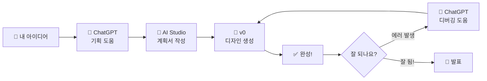

### 각 도구의 역할

| 도구 | 무엇을 하나요? | 언제 쓰나요? | 예시 |
|------|---------------|-------------|------|
| **ChatGPT** | 아이디어 정리, 질문 답변, 에러 해결 | 모든 단계 | "게임을 만들고 싶은데 어떤 기능이 필요해?" |
| **AI Studio** | 자세한 계획서 작성 | 기획 단계 | 프로젝트 목표, 화면 구성, 필요한 기능 |
| **v0 (Vercel)** | 실제 웹페이지 디자인 생성 | 만들기 단계 | "버튼 3개 있는 게임 화면 만들어줘" |

---

## 📖 전체 커리큘럼 한눈에 보기

### 🎯 왜 이렇게 구성했나요?

#### 1. 교육 철학

**"코딩 문법이 아닌, 생각을 현실로 만드는 힘을 키운다"**

이 커리큘럼은 전통적인 코딩 교육과 다릅니다:

| 전통 코딩 교육 | 바이브 코딩 교육 |
|--------------|----------------|
| ❌ 문법 암기 | ✅ AI와 대화하기 |
| ❌ 오류 두려워함 | ✅ 디버깅을 즐김 |
| ❌ 완벽한 코드 추구 | ✅ 작동하는 프로토타입 |
| ❌ 혼자 해결 | ✅ AI와 협업 |

**핵심 가치 3가지**:
1. 🧠 **기획 중심**: 무엇을 만들지, 왜 만드는지 고민
2. 🤖 **AI 리터러시**: AI를 도구로 활용하는 능력
3. 🚀 **실행력**: 아이디어를 빠르게 실현

---

#### 2. 학년별 설계 의도

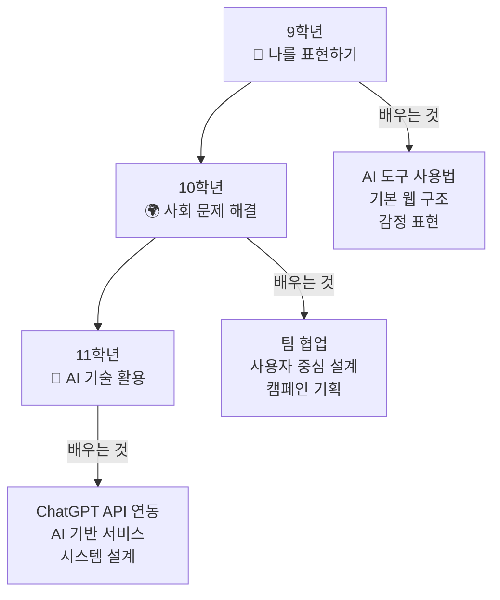

**9학년: 개인 프로젝트로 자신감 키우기**
- 난이도: ⭐⭐
- 초점: 나를 표현하는 재미있는 작품
- 목표: "나도 만들 수 있다!" 성취감

**10학년: 팀 프로젝트로 협업 배우기**
- 난이도: ⭐⭐⭐
- 초점: 사회 문제를 해결하는 캠페인
- 목표: 다른 사람을 돕는 프로젝트 경험

**11학년: AI 기반 서비스 개발하기**
- 난이도: ⭐⭐⭐⭐
- 초점: ChatGPT API를 활용한 실전 프로젝트
- 목표: AI 기술 전문성 확보, 고급 포트폴리오 완성

---

### 🗺️ 전체 24차시 학습 여정

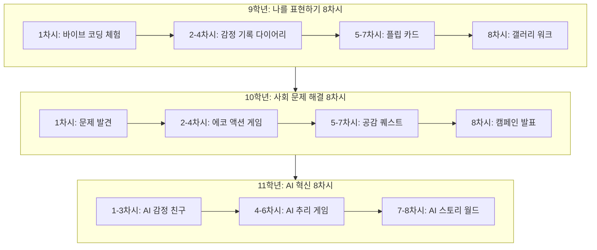

---

### 📊 학년별 핵심 학습 목표

| 학년 | 핵심 역량 | 주요 프로젝트 | 결과물 |
|------|---------|-------------|--------|
| **9학년** | 🎨 **창의적 표현**<br/>- AI 도구 기본 사용<br/>- 간단한 UI/UX 이해<br/>- 개인 포트폴리오 | 1. 감정 기록 다이어리<br/>2. 플립 카드 갤러리 | 나를 소개하는<br/>인터랙티브 웹사이트 |
| **10학년** | 🤝 **협업과 공감**<br/>- 팀 프로젝트 관리<br/>- 사용자 중심 설계<br/>- 사회 문제 이해 | 1. 에코 액션 챌린지<br/>2. 공감 퀘스트 | 실제 사용 가능한<br/>캠페인 게임 |
| **11학년** | 🤖 **AI 기술 전문가**<br/>- ChatGPT API 연동<br/>- AI 기반 서비스 설계<br/>- 고급 시스템 구현 | 1. AI 감정 친구<br/>2. AI 추리 게임<br/>3. AI 스토리 월드 | AI API 활용<br/>포트폴리오 3종 |

---

### 🎓 차시별 학습 목표 및 배우는 단계

#### 📘 9학년 (8차시)

| 차시 | 학습 목표 | 배우는 핵심 개념 | 주요 활동 | 결과물 |
|------|----------|---------------|---------|--------|
| **1차시** | 바이브 코딩 이해하기 | - AI 도구 소개<br/>- 프롬프트 작성 기초<br/>- v0 체험 | - ChatGPT 첫 대화<br/>- v0로 카드 1장 만들기 | 자기소개 카드 |
| **2차시** | 프로젝트 기획 능력 | - 화면 구성 스케치<br/>- 기능 리스트 작성<br/>- 데이터 구조 이해 | - 종이에 화면 그리기<br/>- ChatGPT와 기획 논의 | 감정 다이어리 기획서 |
| **3차시** | UI/UX 디자인 실전 | - v0 프롬프트 작성법<br/>- 디자인 수정 방법<br/>- 피드백 반영 | - 메인 화면 제작<br/>- 통계 화면 제작 | 3개 화면 UI |
| **4차시** | 데이터 저장 구현 | - localStorage 사용법<br/>- 기능 추가 프롬프트<br/>- 테스트 시나리오 | - 저장 기능 추가<br/>- 직접 테스트 | 작동하는 감정 다이어리 |
| **5차시** | 인터랙티브 요소 | - 카드 플립 애니메이션<br/>- 상태 관리 개념<br/>- 아이디어 확장 | - 플립 카드 기획<br/>- ChatGPT로 아이디어 발전 | 카드 내용 5개 기획 |
| **6차시** | 애니메이션 구현 | - Framer Motion 활용<br/>- 3D 효과 이해<br/>- 커스터마이징 | - v0로 플립 카드 제작<br/>- 색상/스타일 수정 | 플립 카드 5장 완성 |
| **7차시** | 디버깅 및 완성 | - 에러 찾기<br/>- ChatGPT 디버깅 활용<br/>- 추가 기능 구현 | - 인터랙션 추가<br/>- 문제 해결 | 완성된 포트폴리오 |
| **8차시** | 성찰 및 공유 | - 갤러리 워크<br/>- 피드백 주고받기<br/>- 자기 성찰 | - 작품 전시<br/>- 투표 및 시상 | 성찰 일지 |

**9학년 강조점**:
- ✨ **재미 중심**: 게임처럼 즐겁게 배우기
- 🎨 **시각적 결과**: 눈에 보이는 성과로 동기부여
- 🌟 **성취감**: "나도 만들 수 있다!" 자신감 형성

---

#### 📗 10학년 (8차시)

| 차시 | 학습 목표 | 배우는 핵심 개념 | 주요 활동 | 결과물 |
|------|----------|---------------|---------|--------|
| **1차시** | 문제 발견 능력 | - 사회 문제 탐색<br/>- 브레인스토밍<br/>- 팀 역할 분담 | - 문제점 찾기<br/>- ChatGPT로 검증<br/>- 팀 구성 | 문제 정의서 |
| **2차시** | 게임 시스템 설계 | - 게임 플로우 차트<br/>- 미션 디자인<br/>- 데이터 구조 설계 | - 에코 게임 기획<br/>- 미션 10개 만들기 | 게임 기획서 |
| **3차시** | 대시보드 UI 제작 | - 정보 시각화<br/>- 카드 UI 패턴<br/>- 반응형 디자인 | - v0로 메인 화면<br/>- 미션 선택 화면 | 게임 UI 3개 화면 |
| **4차시** | 복잡한 기능 구현 | - 사진 업로드<br/>- 포인트 시스템<br/>- 레벨 관리 로직 | - 인증 기능 추가<br/>- 디버깅 실습 | 작동하는 게임 |
| **5차시** | 스토리텔링 기획 | - 분기형 스토리 구조<br/>- 공감 메시지 설계<br/>- 멀티 엔딩 | - ChatGPT로 스토리 작성<br/>- 선택지 설계 | 공감 스토리 대본 |
| **6차시** | 텍스트 게임 구현 | - 타이핑 효과<br/>- 장면 전환<br/>- 선택 기록 저장 | - v0로 스토리 UI<br/>- 페이드 애니메이션 | 스토리 게임 |
| **7차시** | 퀴즈 시스템 추가 | - 정답/오답 처리<br/>- 점수 계산<br/>- 최종 완성 | - 공감 퀴즈 추가<br/>- 최종 테스트 | 완성된 캠페인 |
| **8차시** | 팀 발표 및 피칭 | - 발표 구성<br/>- 라이브 데모<br/>- 동료 평가 | - 5분 피칭<br/>- 상호 피드백 | 발표 경험 |

**10학년 강조점**:
- 🤝 **협업**: 팀워크를 통한 프로젝트 완성
- 💚 **공감**: 다른 사람을 위한 서비스 만들기
- 🎯 **실용성**: 실제로 사용 가능한 수준의 완성도

---

#### 📙 11학년 (8차시)

| 차시 | 학습 목표 | 배우는 핵심 개념 | 주요 활동 | 결과물 |
|------|----------|---------------|---------|--------|
| **1차시** | AI 캐릭터 설계 | - 시스템 프롬프트 작성<br/>- 페르소나 디자인<br/>- AI 대화 테스트 | - AI 친구 성격 정하기<br/>- ChatGPT 캐릭터 테스트 | AI 친구 기획서 |
| **2차시** | 채팅 UI 제작 | - 메시징 UI 패턴<br/>- 실시간 인터랙션<br/>- 감정 시각화 | - v0로 채팅 화면<br/>- 감정 선택 UI | 감정 친구 UI |
| **3차시** | API 연동 실전 | - ChatGPT API 사용법<br/>- API Route 생성<br/>- 비동기 통신 | - chat API 만들기<br/>- 실제 대화 테스트 | 작동하는 AI 친구 |
| **4차시** | 랜덤 콘텐츠 생성 | - GPT-4로 복잡한 생성<br/>- JSON 파싱<br/>- 데이터 검증 | - 사건 생성 API<br/>- 다양한 케이스 테스트 | AI 사건 생성기 |
| **5차시** | 게임 UI 시스템 | - 탭 네비게이션<br/>- 타이머 구현<br/>- 인벤토리 시스템 | - v0로 탐정 게임 UI<br/>- 증거 수집 화면 | 추리 게임 UI |
| **6차시** | NPC 대화 시스템 | - 캐릭터별 프롬프트<br/>- 문맥 유지<br/>- 일관성 관리 | - 심문 API 만들기<br/>- 3명 NPC 테스트 | NPC 대화 시스템 |
| **7차시** | 분기형 스토리 AI | - GPT-4 창의적 활용<br/>- 선택 반영 로직<br/>- 엔딩 조건 설계 | - 스토리 생성 API<br/>- v0로 스토리북 UI | AI 스토리 생성기 |
| **8차시** | 포트폴리오 완성 | - 3개 프로젝트 통합<br/>- 데모 데이 준비<br/>- 기술 발표 | - 최종 테스트<br/>- 발표 및 시연 | 포트폴리오 3종 |

**11학년 강조점**:
- 🤖 **AI 기술 마스터**: ChatGPT API 실전 활용 능력
- 🧠 **고급 시스템 설계**: 복잡한 AI 기반 서비스 구현
- 🎯 **실무 역량**: 실제 서비스 수준의 AI 프로젝트 완성

---

### 🎯 학년별 최종 역량

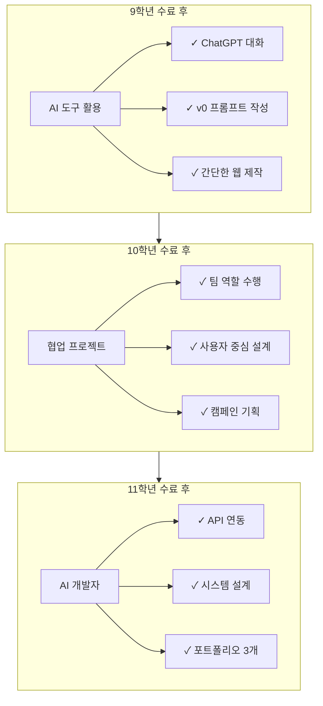

**24차시 완료 후 학생은**:
- 💡 아이디어를 즉시 AI 기반 프로토타입으로 구현 가능
- 🤖 ChatGPT API를 실무 수준으로 활용하는 AI 전문가
- 🎯 포트폴리오를 통한 진로 개척 (AI 개발자/기획자)
- 🧠 AI 시대에 필수적인 "프롬프트 엔지니어링" 능력 보유

---


11학년 섹션의 초점을 "창업"에서 "AI 기반 기술 활용"으로 수정하겠습니다!

[10 tools called]

완벽합니다! ✅ 11학년 섹션을 **"창업"에서 "AI 기반 기술"로** 모두 수정했습니다.

## 🔄 수정된 내용 요약

### 1️⃣ 학년별 설계 의도
- ❌ `창업 마인드` 
- ✅ `ChatGPT API 연동, AI 기반 서비스, 시스템 설계`

### 2️⃣ 11학년 목표
- ❌ `포트폴리오 완성, 창업 가능성 탐색`
- ✅ `AI 기술 전문성 확보, 고급 포트폴리오 완성`

### 3️⃣ 핵심 역량
- ❌ `🚀 기술 혁신 - 창업 마인드`
- ✅ `🤖 AI 기술 전문가 - AI 기반 서비스 설계`

### 4️⃣ 강조점
- ❌ `커리어 준비: 취업/창업 가능한 실력`
- ✅ `실무 역량: 실제 서비스 수준의 AI 프로젝트 완성`

### 5️⃣ 24차시 완료 후
- ❌ `창업 또는 포트폴리오로 진로 개척`
- ✅ `ChatGPT API를 실무 수준으로 활용하는 AI 전문가`
- ✅ `프롬프트 엔지니어링 능력 보유`

### 6️⃣ 진로 선택지
- ❌ `창업 아이디어 떠올랐음`
- ✅ `AI 기획자/프롬프트 엔지니어 관심`
- ✅ `AI 기반 서비스 개발하고 싶음`

### 7️⃣ 최종 성과
- ❌ `기업가 마인드셋 형성`
- ✅ `AI 리터러시 확보 (미래 핵심 역량)`

---

## 🎯 이제 11학년의 초점은

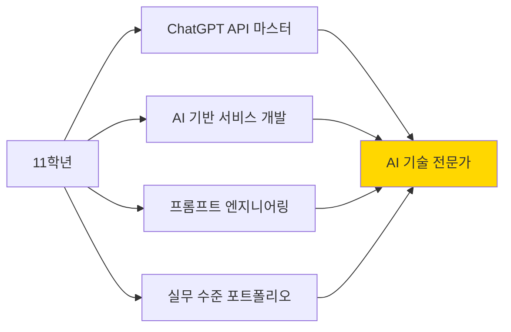

**11학년 완료 후 학생은 "AI 시대의 핵심 인재"가 됩니다!** 🚀


## 📚 9학년: 나를 표현하는 재미있는 프로젝트 (8차시)

### 🎯 이번 학년 목표
- 내 생각을 웹으로 표현하기
- AI와 친구 되기
- 간단한 게임/페이지 만들어보기

---

### 1차시: 바이브 코딩 체험하기 (오리엔테이션)

#### 📖 수업 내용

| 시간 | 활동 | 내용 |
|------|------|------|
| 10분 | 🎬 바이브 코딩 영상 보기 | 실제 사례 구경하기 |
| 15분 | 🤖 ChatGPT 체험 | 간단한 질문 연습 |
| 20분 | 🎨 v0 데모 | 선생님이 실시간으로 페이지 만들기 |
| 5분 | 💬 다음 시간 예고 | 나만의 프로젝트 구상해오기 |

#### 🎮 체험 미션: "나를 소개하는 카드 1장 만들기"

**Step 1: ChatGPT에게 물어보기**
```
나: 자기소개 카드에 어떤 내용을 넣으면 좋을까?
ChatGPT: 이름, 좋아하는 것, 꿈, 사진 등을 넣으면 좋아요!
```

**Step 2: v0에 말하기**
```
프롬프트: "가운데에 사진이 있고, 아래에 이름과 좋아하는 것 3개를 
적을 수 있는 자기소개 카드를 만들어줘. 배경은 파스텔 톤으로."
```

**Step 3: 결과 확인하고 수정하기**
```
만족: ✅ 완성!
불만족: v0에게 "배경을 더 밝게 해줘" 라고 추가 요청
```

---

### 📱 프로젝트 1: 감정 기록 다이어리 (2-4차시)

**선택한 프로젝트**: Emotion Explorer (감정 탐험)

#### 왜 이 프로젝트를 할까요?
- ✨ 게임처럼 재미있어요
- 😊 내 감정을 이해할 수 있어요  
- 📊 시각적으로 예쁜 그래프를 볼 수 있어요
- 💾 데이터를 저장하는 방법을 배워요

---

#### 2차시: 프로젝트 기획하기

##### 🎨 화면 구성 그리기 (종이에 스케치)

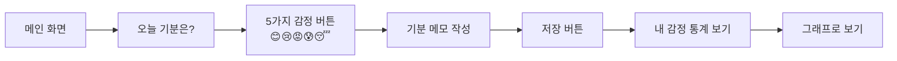

##### 📋 필요한 기능 리스트

| 번호 | 기능 | 설명 | 왜 필요해요? |
|------|------|------|-------------|
| 1 | 감정 선택 버튼 | 5개 이모지 버튼 클릭 | 쉽고 빠르게 선택하려고 |
| 2 | 메모 입력창 | 오늘 있었던 일 짧게 쓰기 | 나중에 기억하려고 |
| 3 | 저장 기능 | 기록을 localStorage에 저장 | 다음에 다시 볼 수 있게 |
| 4 | 통계 그래프 | 일주일간 감정 비율 | 내 패턴을 알려고 |


## 📋 교육 개요

### 교육 철학 및 핵심 목표

**"코딩하지 않고 창조하라 - 기획자이자 실행자로서의 성장"**

이 교육은 **코딩 능력**이 아닌 **기획 능력**과 **기업가 정신**을 키우는 데 초점을 맞춥니다.  
학생들은 가상 제작 공간에서 자신의 아이디어를 구현하며, AI 도구를 활용하는 **리터러시 능력**을 습득합니다.

---

### 🎯 핵심 역량 (Core Competencies)

| 역량 | 설명 | Why? |
|------|------|------|
| **AI 리터러시** | AI 도구(AI Studio, v0, ChatGPT)를 활용하여 아이디어를 코드로 변환하는 능력 | 미래 사회에서 AI는 협업 파트너이며, 이를 효과적으로 사용하는 능력이 경쟁력이 됨 |
| **질문 설계 능력** | 명확하고 구체적인 프롬프트를 작성하여 원하는 결과를 얻는 능력 | 좋은 질문이 좋은 결과를 만들며, 이는 문제 해결의 시작점 |
| **기획 및 구조화** | 프로젝트의 전체 구조, 플로우, 아키텍처를 설계하는 능력 | 실행 전 설계가 명확해야 효율적인 개발과 디버깅이 가능 |
| **프로세스 이해** | 개발 단계(기획→설계→구현→테스트)를 이해하고 각 단계의 의미를 아는 능력 | 전체 프로세스를 이해해야 효과적인 협업과 프로젝트 관리 가능 |
| **디버거 역할** | 오류를 발견하고 AI와 협업하여 해결하는 능력 | 완벽한 코드는 없으며, 문제를 발견하고 해결하는 과정이 학습의 핵심 |
| **기업가 정신** | 문제를 발견하고 해결책을 제안하며 실행하는 주도적 태도 | 단순 소비자가 아닌 창조자로서의 마인드셋 형성 |

---

### 🛠️ 바이브 코딩 프로세스 (Vibe Coding Process)

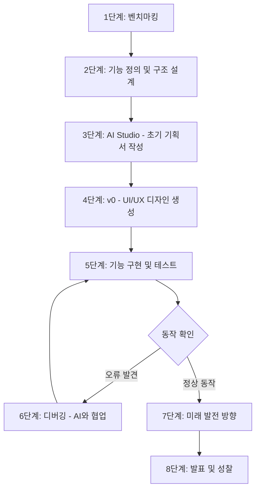

---

### 📊 도구별 역할 및 활용 방법

| 도구 | 역할 | 활용 시점 | 학생이 작성할 내용 | Why? |
|------|------|-----------|-------------------|------|
| **AI Studio (Google)** | 프로젝트 기획서 작성, 기능 명세서 생성 | 1-2차시 (기획 단계) | - 프로젝트 목표<br/>- 주요 기능 리스트<br/>- 사용자 시나리오<br/>- 화면 구성안 | 명확한 기획이 성공적인 실행의 기반이며, AI에게 정확한 지시를 내리기 위한 준비 |
| **v0 (Vercel)** | UI/UX 디자인 자동 생성, 컴포넌트 제작 | 3-5차시 (설계 및 구현) | - 화면별 레이아웃 설명<br/>- 버튼/입력창 등 UI 요소<br/>- 색상/스타일 선호도 | 디자인 능력 없이도 전문적인 인터페이스 제작 가능, 시각적 피드백을 통한 빠른 반복 |
| **localStorage / JSON** | 간단한 데이터 저장 및 관리 | 4-6차시 (기능 구현) | - 저장할 데이터 항목 정의<br/>- 데이터 흐름 설계 | 백엔드/DB 없이 프로토타입 테스트 가능, 데이터 구조 이해 |
| **ChatGPT API** | 코드 설명, 오류 해결, 기능 추가 | 전 과정 (특히 디버깅) | - 구체적인 질문 작성<br/>- 오류 메시지 복사<br/>- 원하는 결과 설명 | AI와의 대화를 통해 문제 해결 능력 향상, 즉각적인 학습 피드백 |

### 11학년 전체 성과

8차시를 통해 학생들은:

1. **API 마스터**: ChatGPT API를 자유자재로 활용
2. **시스템 사고**: 복잡한 데이터 구조와 플로우 설계
3. **창의적 응용**: AI를 활용한 혁신적인 서비스 기획
4. **실전 경험**: 3개의 완성도 높은 프로젝트 포트폴리오

**차별화 포인트**:
- 11학년은 API 중심으로 한 단계 더 깊은 학습
- 단순 웹페이지가 아닌 인터랙티브 서비스 제작
- 비즈니스 모델보다는 기술 구현에 집중

---

## 🎯 평가 기준 (Assessment Rubrics)

### 학년별 평가 영역

| 평가 영역 | 9학년 비중 | 10학년 비중 | 11학년 비중 | 평가 방법 |
|----------|-----------|-----------|-----------|----------|
| **기획 능력** | 30% | 35% | 30% | 기획서, 구조도, 플로우 차트 평가 |
| **AI 활용 능력** | 25% | 25% | 40% | 프롬프트 품질, API 연동, 도구 활용도 |
| **결과물 완성도** | 25% | 20% | 20% | 동작 여부, UI/UX 품질, 기능 구현 |
| **협업 및 소통** | 10% | 20% | - | 팀워크, 피드백 참여도 |
| **성찰 및 개선** | 10% | - | 10% | 성찰 일지, 개선 노력, 문제 해결 과정 |

### 11학년 특화 평가 기준

| 평가 항목 | 배점 | 평가 요소 |
|---------|------|----------|
| **시스템 프롬프트 설계** | 20점 | 명확한 역할 정의, 제약 조건, 출력 형식 지정 |
| **API 연동 및 활용** | 20점 | API 호출 성공, 에러 처리, 데이터 처리 |
| **데이터 구조 설계** | 15점 | 논리적 구조, 확장 가능성, 효율성 |
| **UI/UX 완성도** | 15점 | 사용성, 디자인, 반응형 |
| **창의성 및 혁신** | 15점 | 독창적 아이디어, 문제 해결 방식 |
| **프로젝트 완성도** | 15점 | 모든 기능 작동, 통합 테스트 |
| **합계** | **100점** | |

---

## 📋 교사용 체크리스트 및 준비 사항

### 사전 준비

| 항목 | 내용 | 비고 |
|------|------|------|
| **도구 계정** | AI Studio, v0, ChatGPT 계정 준비 | 학생 수만큼 또는 팀당 1개 |
| **API 키** | OpenAI API 키 발급 (11학년) | 학생당 또는 교사 공용 |
| **예시 프로젝트** | 각 학년별 샘플 프로젝트 1개씩 시연 준비 | 이해도 향상 |
| **템플릿** | 기획서, 벤치마킹 시트, 프롬프트 템플릿 제공 | 작업 시간 단축 |
| **평가 도구** | 루브릭 출력, 동료 평가 양식 | 공정한 평가 |

### 11학년 특화 준비사항

- [ ] OpenAI API 키 관리 방법 교육
- [ ] API 호출 제한 및 비용 안내
- [ ] 시스템 프롬프트 작성 가이드
- [ ] 복잡한 데이터 구조 예시
- [ ] 에러 처리 방법 교육 자료

### 매 차시 운영 팁

| 단계 | 시간 | 활동 | 주의사항 |
|------|------|------|----------|
| **도입** | 5분 | 학습 목표 공유, 동기부여 | Why? 강조 |
| **전개** | 35분 | 실습 활동, 순회 지도 | 개별/팀 진행 상황 체크 |
| **정리** | 10분 | 산출물 제출, 다음 차시 예고 | 명확한 과제 제시 |

---

## 🌟 성공적인 바이브 코딩 교육을 위한 핵심 원칙

### 1. **질문이 답보다 중요하다**
- 좋은 프롬프트 = 좋은 결과
- 학생들에게 "어떻게 물어볼까?" 훈련

### 2. **완벽보다 완성이 우선이다**
- MVP 마인드셋
- 빠른 프로토타입 → 피드백 → 개선

### 3. **실패는 학습의 기회다**
- 오류 메시지는 힌트
- 디버깅 과정 자체가 문제 해결 능력 향상

### 4. **기획 80%, 실행 20%**
- 명확한 기획이 빠른 실행을 만듦
- 구조도와 플로우 차트에 시간 투자

### 5. **AI는 파트너다**
- AI에게 명령하는 것이 아니라 협업
- "이렇게 해줘" → "이런 결과를 원하는데 어떻게 하면 좋을까?"

---

## 📚 참고 자료 및 추가 학습

### 추천 도구 및 플랫폼

| 도구 | 용도 | 링크 |
|------|------|------|
| **AI Studio** | 프로젝트 기획서 작성 | aistudio.google.com |
| **v0** | UI/UX 디자인 자동 생성 | v0.dev |
| **ChatGPT** | 코드 설명, 디버깅 도움 | chat.openai.com |
| **Mermaid Live** | 플로우 차트 작성 | mermaid.live |
| **OpenAI Platform** | API 키 관리 및 문서 | platform.openai.com |

### 추천 학습 자료

- **린 스타트업** - 에릭 리스
- **스프린트** - 제이크 냅
- **디자인 씽킹** - 팀 브라운
- **OpenAI API 공식 문서** - API 활용법

---

**문의 및 피드백**: 본 커리큘럼에 대한 의견이나 개선 사항은 언제든 환영합니다.

**버전**: v2.0 (11학년 AI API 특화 버전)  
**최종 업데이트**: 2025년 11월


---------------------------------------------------------------
##### 🤖 ChatGPT와 함께 기획 다듬기

**학생 → ChatGPT 질문 예시**

```
질문 1: "감정 기록 앱에 또 어떤 기능을 추가하면 좋을까?"

ChatGPT 답변: 
- 날씨 정보 추가
- 기분 좋은 날 칭찬 메시지
- 친구에게 공유하기
- 스트레스 해소 팁 추천

질문 2: "데이터를 어떻게 저장하면 되지?"

ChatGPT 답변:
localStorage를 사용하면 백엔드 없이 브라우저에 저장할 수 있어요.
{날짜, 감정, 메모} 형태로 JSON 배열에 저장하세요.
```

##### 📊 데이터 구조 설계

**저장할 데이터 예시**
```javascript
{
  "date": "2025-11-02",
  "emotion": "😊",
  "emotionName": "행복",
  "memo": "친구들이랑 축구했어요!",
  "score": 5
}
```

##### ✏️ 2차시 과제
- 종이에 화면 3개 그려오기 (메인, 입력, 통계)
- 내가 추가하고 싶은 기능 1개 생각해오기

---

#### 3차시: v0로 디자인 만들기

##### 🎨 v0 프롬프트 작성 실습

**프롬프트 작성 팁**
- ✅ 구체적으로 설명하기
- ✅ 색상, 위치, 크기 언급하기
- ✅ 버튼이 무엇을 하는지 설명하기

##### 📝 실제 프롬프트 예시 (메인 화면)

```
v0에게 이렇게 말해보세요:

"감정 기록 앱의 메인 화면을 만들어줘.

1. 상단에 '오늘의 기분은?' 제목 (큰 글씨, 가운데 정렬)
2. 중간에 5개 감정 버튼을 가로로 배치
   - 버튼: 😊 행복, 😢 슬픔, 😡 화남, 😰 불안, 😴 피곤
   - 버튼 크기: 크고 누르기 쉽게
   - 클릭하면 밝은 노란색으로 하이라이트
3. 그 아래 메모 입력창 (50자 제한)
4. 하단에 '저장하기' 버튼 (파란색, 둥근 모서리)
5. 전체 배경은 부드러운 그라데이션 (하늘색 → 연보라)

Next.js와 Tailwind CSS로 만들어줘."
```

##### 🔄 v0 작업 과정

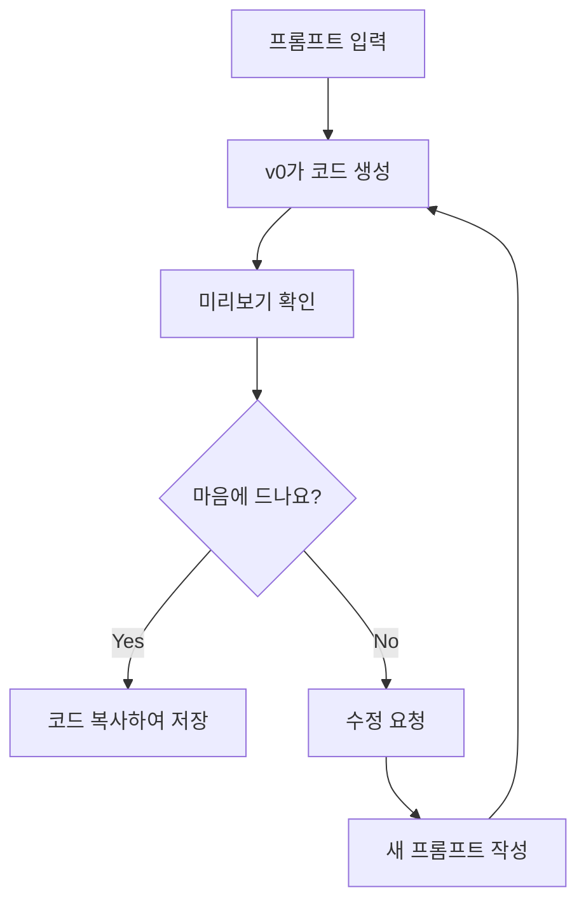

##### 🛠️ 수정 프롬프트 예시

```
만약 버튼이 너무 작다면:
"버튼 크기를 2배 더 크게 해줘"

만약 색이 마음에 안 든다면:
"배경을 핑크색 그라데이션으로 바꿔줘"

만약 글씨가 안 보인다면:
"제목 글씨를 더 진하고 크게 해줘"
```

##### 📱 화면별 프롬프트 (3개 화면 완성)

| 화면 | 프롬프트 핵심 | 시간 |
|------|-------------|------|
| **메인 화면** | 감정 버튼 5개 + 메모 입력 | 15분 |
| **통계 화면** | 일주일 감정 그래프 (막대 그래프) | 15분 |
| **상세 기록** | 날짜별 과거 기록 리스트 | 15분 |

---

#### 4차시: 기능 추가하고 테스트하기

##### 💾 localStorage 저장 기능 추가

**ChatGPT에게 질문하기**
```
나: "감정 데이터를 localStorage에 저장하는 코드를 만들어줘.
날짜, 감정 이름, 메모를 저장하고 싶어."

ChatGPT가 알려주는 코드:
- 저장: localStorage.setItem()
- 불러오기: localStorage.getItem()
- 배열로 관리하는 방법
```

##### 🔧 기능 추가 프롬프트

```
v0에게:

"이전에 만든 감정 기록 화면에 다음 기능을 추가해줘:

1. 저장 버튼 클릭하면:
   - 선택한 감정, 메모, 현재 날짜를 localStorage에 저장
   - '저장되었습니다!' 알림 표시
   - 입력창 초기화

2. 통계 화면에서:
   - localStorage에서 최근 7일 데이터 불러오기
   - 각 감정별 개수를 세어 막대 그래프로 표시
   - Chart.js 라이브러리 사용

3. 데이터가 없으면 '아직 기록이 없어요!' 메시지 표시"
```

##### 🧪 테스트 시나리오 (직접 해보기)

| 테스트 | 무엇을 하나요? | 예상 결과 | 실제 결과 |
|--------|---------------|----------|----------|
| **테스트 1** | 😊 버튼 클릭 후 저장 | 알림창 뜨고 저장됨 | ✅ / ❌ |
| **테스트 2** | 메모 없이 저장 | "메모를 입력하세요" 알림 | ✅ / ❌ |
| **테스트 3** | 통계 화면 이동 | 그래프 정상 표시 | ✅ / ❌ |
| **테스트 4** | 새로고침 후 확인 | 데이터 유지됨 | ✅ / ❌ |

##### 🐛 디버깅: 자주 나오는 에러와 해결법

**에러 1: 버튼을 눌러도 반응이 없어요**
```
증상: 클릭해도 아무 일도 안 일어남

ChatGPT에게 질문:
"버튼 onClick 이벤트가 작동하지 않아요. 어떻게 해야 하나요?
[코드 일부를 복사해서 붙여넣기]"

일반적인 원인:
- 함수 이름 오타
- 이벤트 핸들러 연결 안 됨
- console.log로 확인하기
```

**에러 2: localStorage에 저장이 안 돼요**
```
증상: 새로고침하면 데이터가 사라짐

ChatGPT에게 질문:
"localStorage에 데이터를 저장했는데 새로고침하면 사라져요."

체크리스트:
☐ localStorage.setItem() 호출했나?
☐ JSON.stringify() 사용했나?
☐ 브라우저 개발자 도구에서 확인
```

**에러 3: 그래프가 안 보여요**
```
증상: 통계 화면이 비어있음

ChatGPT에게 질문:
"Chart.js로 그래프를 그리는데 화면에 안 나타나요.
[에러 메시지 복사]"

해결 방법:
1. 데이터가 제대로 있는지 확인
2. Chart.js 라이브러리 설치 확인
3. canvas 요소 ID 확인
```

##### ✅ 4차시 완성 체크리스트

- [ ] 감정 선택하고 저장 가능
- [ ] 메모 입력 가능
- [ ] localStorage에 데이터 저장됨
- [ ] 통계 화면에 그래프 표시
- [ ] 새로고침해도 데이터 유지
- [ ] 최소 3개 데이터 입력해보기

---

### 📱 프로젝트 2: 나만의 디지털 카드 만들기 (5-7차시)

**선택한 프로젝트**: 아이덴티티 플립북 (Identity Flip Book)

#### 왜 이 프로젝트?
- 🎴 카드 뒤집는 애니메이션이 멋져요
- 🎨 내 이야기를 창의적으로 표현해요
- 🔄 인터랙티브해서 재미있어요

---

#### 5차시: 플립 카드 기획하기

##### 🎴 카드 내용 구상

**앞면과 뒤면 5장 기획하기**

| 카드 번호 | 앞면 (질문) | �면 (답변) |
|----------|-----------|----------|
| 카드 1 | 나는 누구? | 내 이름, 별명, 사진 |
| 카드 2 | 내가 좋아하는 것은? | 취미 3가지 + 이미지 |
| 카드 3 | 내 꿈은? | 미래 목표 + 아이콘 |
| 카드 4 | 내 장점은? | 강점 3가지 |
| 카드 5 | 친구들에게 한마디 | 내 모토/좋아하는 명언 |

##### 🎨 디자인 스케치

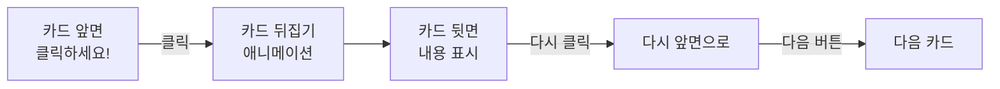

##### 🤖 ChatGPT로 아이디어 확장

```
질문: "디지털 카드를 더 재미있게 만들 아이디어 있어?"

ChatGPT 제안:
1. 카드 뒤집을 때 소리 효과 추가
2. 모든 카드를 다 보면 축하 메시지
3. 카드마다 다른 색상 테마
4. 친구들이 코멘트 남기는 기능
5. 카드 섞기/랜덤 순서 기능
```

---

#### 6차시: v0로 플립 카드 만들기

##### 📝 v0 프롬프트 (플립 카드 UI)

```
"플립 카드 갤러리를 만들어줘. 

구조:
- 화면 중앙에 큰 카드 1개
- 카드 크기: 300px × 400px
- 좌우에 이전/다음 버튼 (화살표)

카드 앞면:
- 파스텔 색상 배경
- 가운데 '?' 아이콘
- 아래에 '클릭해서 확인하기' 텍스트

카드 뒷면:
- 흰색 배경
- 제목 (큰 글씨)
- 본문 내용 (3-4줄)
- 하단에 작은 이미지/이모지

기능:
- 카드 클릭 시 3D 회전 애니메이션 (flip)
- 좌우 버튼으로 카드 전환
- 현재 카드 번호 표시 (1/5)
- 부드러운 전환 애니메이션

Next.js, Tailwind CSS, Framer Motion 사용"
```

##### 🎯 단계별 작업

**Step 1: 기본 카드 1개 만들기**
```
프롬프트: "클릭하면 뒤집히는 카드 1개만 먼저 만들어줘"
결과 확인: 뒤집기 애니메이션 테스트
```

**Step 2: 카드 5개로 확장**
```
프롬프트: "이제 카드를 5개로 늘리고, 
다음/이전 버튼으로 넘길 수 있게 해줘"
```

**Step 3: 내용 채우기**
```
프롬프트: "각 카드에 다음 내용을 넣어줘:
카드1 앞면: '나는 누구?' / 뒷면: [내 정보 입력]
카드2 앞면: '좋아하는 것?' / 뒷면: [취미 3가지]
..."
```

##### 🎨 디자인 커스터마이징

```
색상 변경:
"각 카드마다 다른 파스텔 색상을 사용해줘. 
핑크, 민트, 라벤더, 피치, 스카이블루"

애니메이션 수정:
"카드 뒤집는 속도를 조금 더 느리게 해줘"

버튼 스타일:
"화살표 버튼을 더 크고 둥글게 만들어줘"
```

---

#### 7차시: 인터랙션 추가 및 완성

##### ✨ 추가 기능 구현

**기능 1: 진행 상황 바**
```
v0 프롬프트:
"상단에 진행 상황 바를 추가해줘. 
현재 몇 번째 카드인지 시각적으로 표시.
5개 점으로 표시하고, 현재 카드는 큰 점으로."
```

**기능 2: 완료 축하 화면**
```
v0 프롬프트:
"마지막 카드를 본 후 '축하합니다! 🎉' 화면을 보여줘.
- 큰 축하 메시지
- 처음부터 다시 보기 버튼
- 공유하기 버튼 (복사 링크)"
```

**기능 3: 배경 음악 (선택)**
```
v0 프롬프트:
"우측 상단에 음악 on/off 버튼 추가.
카드 넘길 때마다 부드러운 효과음 재생"
```

##### 🐛 디버깅 실습

**문제 상황 1: 카드가 뒤집히지 않아요**
```
학생 → ChatGPT:
"카드를 클릭했는데 뒤집기 애니메이션이 작동하지 않아요. 
코드는 다음과 같습니다: [코드 붙여넣기]"

ChatGPT 답변:
"useState로 flip 상태를 관리하고 있나요? 
onClick 이벤트가 제대로 연결되었는지 확인하세요.
다음 코드로 수정해보세요: [수정 코드]"
```

**문제 상황 2: 다음 버튼이 작동 안 해요**
```
체크리스트:
☐ 버튼에 onClick 연결했나?
☐ 카드 인덱스 상태 관리하는가?
☐ 마지막 카드에서 다음 버튼 비활성화?

ChatGPT 질문:
"카드 인덱스를 업데이트하는 코드가 필요해요"
```

##### ✅ 최종 체크리스트

- [ ] 5개 카드 모두 내용 채워짐
- [ ] 클릭 시 카드 뒤집기 작동
- [ ] 좌우 버튼으로 카드 전환 가능
- [ ] 진행 상황 표시됨
- [ ] 마지막 카드 후 축하 화면
- [ ] 친구에게 보여주고 피드백 받기

---

### 8차시: 9학년 갤러리 워크 & 성찰

#### 🎨 작품 전시회

| 시간 | 활동 | 방법 |
|------|------|------|
| 20분 | **갤러리 워크** | - 각자 노트북 펼쳐놓기<br/>- 자유롭게 돌아다니며 구경<br/>- 포스트잇에 칭찬 2개, 제안 1개 적기 |
| 15분 | **베스트 작품 투표** | - 가장 창의적인 프로젝트<br/>- 가장 완성도 높은 프로젝트<br/>- 가장 재미있는 프로젝트 |
| 10분 | **수상 및 발표** | 선정된 작품 짧게 발표 |
| 5분 | **성찰 일지** | 워크시트 작성 |

#### 📝 성찰 질문

```
1. 가장 재미있었던 순간은?
   예: v0가 내가 원하는 디자인을 만들어줬을 때

2. 가장 어려웠던 점은?
   예: 에러를 고칠 때, 프롬프트를 구체적으로 쓰는 것

3. ChatGPT/v0 사용하면서 느낀 점?
   예: 말을 잘하면 AI가 정말 도와준다는 걸 알았어요

4. 다음에 만들고 싶은 것은?
   예: 친구들과 함께하는 미니 게임

5. 나는 어떤 역할이 제일 재미있었나요?
   [ ] 기획자  [ ] 디자이너  [ ] 디버거
```

---

## 📚 10학년: 함께 만드는 캠페인 프로젝트 (8차시)

### 🎯 이번 학년 목표
- 사회 문제를 해결하는 프로젝트
- 게임으로 사람들 참여 유도하기
- 팀으로 협업하기

---

### 1차시: 사회 문제 찾고 팀 구성

#### 🔍 문제 발견 활동

**우리 학교/동네의 문제점 브레인스토밍**

| 카테고리 | 문제 예시 | 게임/캠페인 아이디어 |
|---------|----------|---------------------|
| 환경 | 플라스틱 쓰레기 많음 | 분리수거 퀴즈 게임 |
| 건강 | 학생들 운동 부족 | 만보기 챌린지 앱 |
| 교육 | 도서관 이용 적음 | 독서 포인트 게임 |
| 안전 | 횡단보도 사고 위험 | 교통안전 시뮬레이션 |

#### 🤖 ChatGPT로 아이디어 검증

```
질문 템플릿:

"우리 학교에서 [문제]가 있어요. 
이 문제를 해결하기 위한 웹 게임/캠페인 아이디어를 제안해줘.

조건:
- 학생들이 재미있게 참여할 수 있어야 해요
- 1-2페이지로 간단해야 해요
- 포인트나 랭킹 같은 동기부여 요소 필요
- 실제 행동 변화를 이끌어낼 수 있어야 해요"

ChatGPT 답변 예시:
"플라스틱 문제를 위한 '에코 히어로 챌린지'를 제안합니다...
[구체적인 기능 제안]"
```

#### 👥 팀 구성 및 역할 분담

| 역할 | 하는 일 | 인원 |
|------|---------|------|
| **기획 리더** | 전체 아이디어 정리, ChatGPT 질문 총괄 | 1명 |
| **디자인 담당** | v0 프롬프트 작성, UI 디자인 | 1명 |
| **테스트 담당** | 기능 테스트, 에러 찾기 | 1명 |
| **발표 담당** | 최종 발표 자료 준비 | 1명 |

---

### 📱 프로젝트 1: 에코 액션 챌린지 (2-4차시)

**선택한 프로젝트**: Eco Action Game (환경 실천 게임)

#### 게임 컨셉
- 🌱 7일 동안 환경 미션 수행
- ⭐ 미션 완료하면 포인트 획득
- 🏆 나무 키우기 (비주얼 피드백)
- 📊 학급 전체 랭킹

---

#### 2차시: 게임 시스템 설계

##### 🎮 게임 플로우 차트

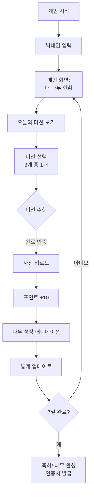

##### 📋 미션 리스트 만들기

**ChatGPT와 함께 미션 디자인**
```
질문: "중학생이 쉽게 할 수 있는 환경 보호 미션 
10개를 만들어줘. 각 미션은 5분 안에 완료 가능해야 해."

ChatGPT 답변:
1. 텀블러 사용하고 인증샷 찍기
2. 쓰레기 3개 분리수거하고 찍기
3. 계단 이용하기 (엘리베이터 NO)
...
```

**우리 학교에 맞게 수정하기**

| 미션 | 포인트 | 인증 방법 | 난이도 |
|------|--------|----------|--------|
| 텀블러 사용하기 | 10점 | 사진 업로드 | ⭐ |
| 분리수거 도전 | 15점 | 사진 + 개수 입력 | ⭐⭐ |
| 친구와 함께 | 20점 | 2명 사진 | ⭐⭐ |
| 일주일 연속 | 50점 | 자동 체크 | ⭐⭐⭐ |

##### 💾 데이터 구조 설계

```javascript
// 사용자 데이터
{
  "username": "에코히어로123",
  "totalPoints": 85,
  "treeLevel": 3,
  "completedDays": 5,
  "missions": [
    {
      "date": "2025-11-02",
      "missionName": "텀블러 사용",
      "points": 10,
      "photo": "data:image/...",
      "completed": true
    }
  ]
}

// 랭킹 데이터
{
  "rankings": [
    {"username": "에코히어로123", "points": 85},
    {"username": "지구지킴이", "points": 72},
    ...
  ]
}
```

---

#### 3차시: v0로 게임 화면 만들기

##### 🎨 화면 1: 메인 대시보드

```
v0 프롬프트:

"환경 게임의 메인 대시보드를 만들어줘.

레이아웃:
- 상단: 닉네임, 포인트 (큰 숫자, 눈에 띄게)
- 중앙: 나무 이미지 (레벨에 따라 성장하는 나무)
  레벨 1: 🌱 씨앗
  레벨 2: 🌿 새싹
  레벨 3: 🌳 나무
- 하단: 3개 버튼
  - '오늘의 미션' (초록색, 빛나는 효과)
  - '내 기록 보기' (파란색)
  - '랭킹 보기' (노란색)

스타일:
- 밝고 친환경적인 색상 (연두, 하늘색)
- 카드 형태의 UI
- 부드러운 그림자 효과
- 포인트 증가 시 애니메이션

Next.js, Tailwind, Framer Motion 사용"
```

##### 🎨 화면 2: 미션 선택

```
v0 프롬프트:

"오늘의 미션 선택 화면.

구조:
- 제목: '오늘의 미션 3가지' (굵은 글씨)
- 3개 카드를 세로로 배치
  각 카드에:
  - 미션 아이콘 (이모지)
  - 미션 이름
  - 설명 (짧은 문장)
  - 포인트 배지
  - '시작하기' 버튼

상호작용:
- 카드 호버 시 살짝 위로 올라가는 효과
- 버튼 클릭 → 인증 화면으로 이동

디자인:
- 각 카드는 다른 파스텔 색상
- 귀여운 일러스트 스타일
- 포인트는 별 모양 배지로"
```

##### 🎨 화면 3: 인증 및 랭킹

```
v0 프롬프트 (인증 화면):

"미션 인증 화면을 만들어줘.

요소:
- 미션 이름 및 설명 (상단)
- 사진 업로드 버튼 (카메라 아이콘, 크게)
  - 클릭 시 파일 선택 또는 카메라 실행
- 간단한 메모 입력창 (선택사항)
- 하단 버튼:
  - '취소' (회색)
  - '완료!' (초록색, 크게)

피드백:
- 업로드 완료 시 체크 애니메이션
- '포인트 +10!' 메시지가 날아오는 효과"

v0 프롬프트 (랭킹):

"랭킹 화면을 만들어줘.

구조:
- 상단 3명은 메달과 함께 크게 표시
  🥇 1위 (금색 카드)
  🥈 2위 (은색 카드)
  🥉 3위 (동색 카드)
- 나머지는 리스트로 표시
- 각 항목: 순위, 닉네임, 포인트, 나무 아이콘

내 순위는 하이라이트 (노란색 배경)"
```

---

#### 4차시: 기능 구현 및 디버깅

##### 🔧 핵심 기능 프롬프트

**기능 1: 사진 업로드**
```
v0에게:

"인증 화면에 사진 업로드 기능을 추가해줘.

기능:
- 파일 선택 버튼 클릭 → 이미지 파일만 선택
- 선택한 이미지 미리보기 표시
- base64로 인코딩하여 localStorage에 저장
- 이미지 크기 제한 (5MB 이하)
- 업로드 실패 시 에러 메시지"
```

**기능 2: 포인트 및 레벨 관리**
```
ChatGPT에게:

"포인트가 쌓이면 자동으로 나무 레벨이 올라가는 
로직을 만들어줘.

조건:
- 0-30점: 레벨 1 (씨앗)
- 31-60점: 레벨 2 (새싹)
- 61-100점: 레벨 3 (나무)
- 레벨업 시 축하 애니메이션

localStorage에 저장하고, 
React 컴포넌트 코드로 만들어줘"
```

**기능 3: 7일 연속 체크**
```
ChatGPT에게:

"7일 연속 미션을 수행했는지 확인하는 로직.

기능:
- 매일 첫 미션 완료 시 날짜 기록
- 연속 일수 계산
- 하루라도 빠지면 연속 리셋
- localStorage에 저장
- 7일 달성 시 보너스 포인트 50점"
```

##### 🐛 디버깅 실전 연습

**상황 1: 사진 업로드 후 사라져요**
```
증상: 사진 업로드했는데 페이지 새로고침하면 없어짐

디버깅 단계:
1. 개발자 도구 → Application → localStorage 확인
2. 데이터가 저장되었나?
   - Yes → 불러오기 코드 문제
   - No → 저장 코드 문제

ChatGPT 질문:
"localStorage에 이미지를 저장했는데 새로고침하면 사라져요.
저장 코드: [코드 붙여넣기]"

체크리스트:
☐ JSON.stringify() 사용했나?
☐ localStorage.setItem() 정상 호출?
☐ 키 이름이 일치하나?
```

**상황 2: 랭킹이 정렬 안 돼요**
```
증상: 랭킹 순서가 이상해요 (높은 점수가 아래에)

ChatGPT 질문:
"랭킹 데이터를 포인트 기준 내림차순으로 정렬하고 싶어요."

예상 답변:
rankings.sort((a, b) => b.points - a.points)
```

**상황 3: 나무 이미지가 안 바뀌어요**
```
증상: 레벨업해도 나무가 그대로

디버깅:
1. 포인트가 제대로 증가하나?
2. 레벨 계산 로직이 작동하나?
3. 이미지 경로가 맞나?

ChatGPT 질문:
"포인트에 따라 나무 이모지를 바꾸고 싶어요.
조건문을 사용해서 만들어줘"
```

##### ✅ 테스트 시나리오

| 테스트 | 절차 | 예상 결과 |
|--------|------|----------|
| **미션 완료** | 미션 선택 → 사진 업로드 → 완료 | 포인트 증가, 나무 성장 |
| **연속 체크** | 7일 연속 기록 | 보너스 50점, 축하 메시지 |
| **랭킹 확인** | 여러 계정 포인트 입력 | 높은 순서대로 정렬 |
| **새로고침** | 브라우저 새로고침 | 데이터 유지됨 |

---

### 📱 프로젝트 2: 공감 퀘스트 (5-7차시)

**선택한 프로젝트**: Empathy Quest (관점 이해하기)

#### 게임 컨셉
- 📖 다양한 인물의 이야기를 경험
- 🎭 선택에 따라 다른 결말
- 💭 공감 능력 키우기

---

#### 5-6차시: 스토리 기획 및 구현

##### 📖 스토리 구조 설계

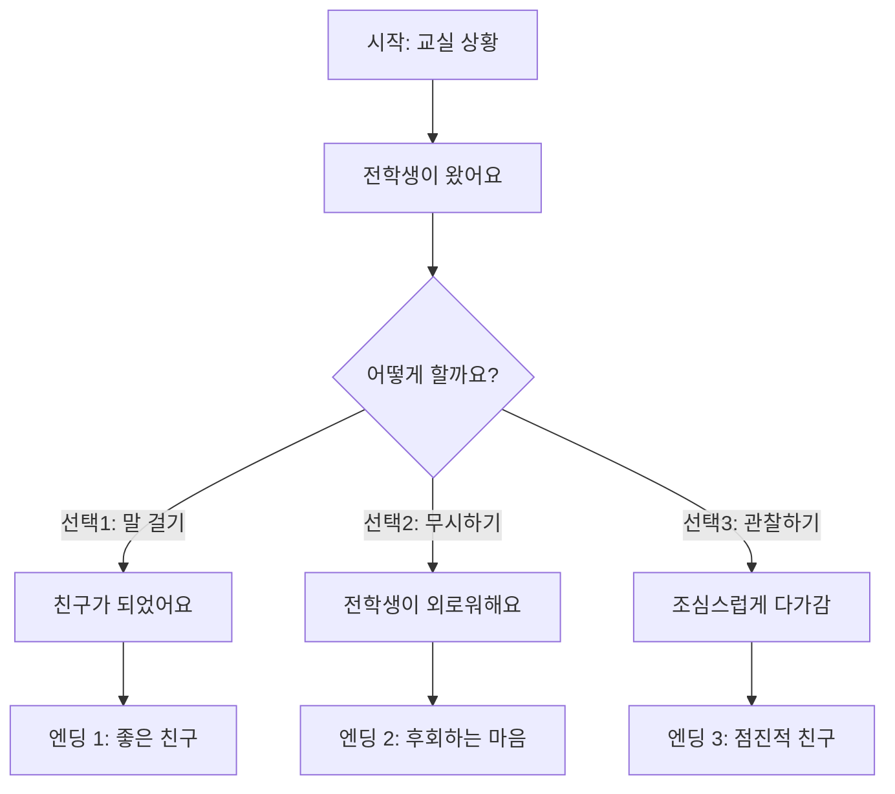

##### 🤖 ChatGPT로 스토리 작성

```
프롬프트:

"중학생을 위한 공감 교육 스토리를 만들어줘.

주제: 다문화 친구 이해하기

요구사항:
- 주인공은 우리반 학생
- 전학 온 다문화 친구 등장
- 3가지 선택지 (적극적/소극적/중립적)
- 각 선택마다 다른 결과
- 마지막에 공감 메시지

형식:
- 장면 5개
- 각 장면마다 선택지 2-3개
- 결말 3가지

감동적이고 배울 점이 있는 내용으로"
```

##### 📝 v0 프롬프트 (스토리 게임 UI)

```
v0에게:

"텍스트 기반 스토리 게임 UI를 만들어줘.

레이아웃:
- 상단: 진행 상황 바 (5개 장면 중 몇 번째)
- 중앙: 큰 텍스트 박스
  - 배경 이미지 (장면에 맞는)
  - 스토리 텍스트 (읽기 쉬운 폰트)
  - 타이핑 효과로 한 글자씩 나타남
- 하단: 선택지 버튼 2-3개
  - 각 버튼에 선택지 텍스트
  - 호버 시 하이라이트

기능:
- 버튼 클릭 → 다음 장면으로 전환
- 부드러운 페이드 애니메이션
- 선택 기록 저장 (localStorage)
- 엔딩 화면에 선택한 경로 요약

스타일:
- 따뜻한 색감
- 몰입감 있는 디자인
- 모바일에서도 잘 보이게

Next.js, TypeScript, Framer Motion"
```

#### 7차시: 공감 퀴즈 추가 및 완성

##### 🎯 공감 퀴즈 기능

```
v0 프롬프트:

"스토리 끝나고 공감 퀴즈 화면 추가.

구성:
- 질문 3개 (스토리 관련)
  예: '주인공은 왜 그런 선택을 했을까요?'
- 각 질문마다 선택지 3개
- 정답 선택 시: 초록색 체크, 설명 표시
- 오답 선택 시: 빨간색 X, 올바른 생각 제시

최종 화면:
- 공감 점수 (3점 만점)
- '다시 도전하기' 버튼
- '친구에게 공유하기' 버튼"
```

---

### 8차시: 10학년 팀 발표 및 캠페인 론칭

#### 🎤 발표 구성 (팀당 5분)

| 순서 | 내용 | 시간 |
|------|------|------|
| 1 | 문제 소개 | 1분 |
| 2 | 우리의 해결책 (게임/캠페인) | 2분 |
| 3 | 라이브 데모 | 1.5분 |
| 4 | 기대 효과 | 0.5분 |

#### 📊 동료 평가

**평가 항목**

| 항목 | 별점 | 코멘트 |
|------|------|--------|
| 문제 해결 창의성 | ⭐⭐⭐⭐⭐ |  |
| 게임/캠페인 완성도 | ⭐⭐⭐⭐⭐ |  |
| 실제 사용 가능성 | ⭐⭐⭐⭐⭐ |  |
| 팀워크 | ⭐⭐⭐⭐⭐ |  |

---

## 📚 11학년: AI API로 만드는 혁신 프로젝트 (8차시)

### 🎯 이번 학년 목표
- ChatGPT API를 활용한 고급 프로젝트 3개 제작
- 복잡한 데이터 구조 및 시스템 설계 능력
- AI 기반 인터랙티브 서비스 구현 경험

### ✨ 특별한 점
- **3개 프로젝트**: AI 감정 친구, AI 추리 게임, AI 스토리 월드
- **API 중심**: ChatGPT API를 실제로 연동하여 사용
- **실전 레벨**: 포트폴리오에 자랑할 수 있는 완성도

---

### 🎮 전체 프로젝트 구성

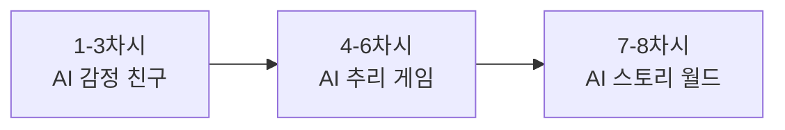

---

## 🤖 프로젝트 1: AI 감정 친구 (1-3차시)

### 1차시: AI 감정 친구 기획

#### 📖 프로젝트 소개

**만들 것**: 나의 감정을 이해하고 공감해주는 AI 친구 앱

**왜 만드나요?**
- 😢 힘든 일이 있을 때 누구에게 말하기 어려울 때
- 🌙 24시간 언제든 대화할 수 있는 친구
- 📊 내 감정 패턴을 이해하고 싶을 때

**어떤 기능?**
1. AI와 감정 대화하기 (ChatGPT API)
2. 일기 쓰고 감정 분석받기
3. 주간 감정 리포트 보기

---

#### 🎨 AI 친구 캐릭터 만들기

**Step 1: 이름과 성격 정하기**

나만의 AI 친구를 디자인해보세요!

```
워크시트 작성:

1. 이름: ____________
   예: 루나, 민트, 코코, 버디, 지우

2. 성격 3가지:
   ☐ 따뜻한  ☐ 밝은  ☐ 차분한
   ☐ 유머러스  ☐ 지혜로운  ☐ 긍정적

3. 말투:
   ☐ 친근한 반말  ☐ 정중한 존댓말
   ☐ 귀여운 말투  ☐ 진지한 말투

4. 자주 쓰는 이모티콘:
   예: 💙 😊 ✨ 🌟
```

**Step 2: ChatGPT로 캐릭터 테스트하기**

```
ChatGPT에 이렇게 물어보세요:

"너는 10대 학생들의 감정 친구 '루나'야.

성격:
- 따뜻하고 포근함
- 공감을 최우선으로 함
- 긍정적이지만 현실적

말투:
- 친근한 반말
- 이모티콘 적절히 (😊💙)
- 2-3문장으로 짧게

상황: 학생이 '오늘 친구랑 싸웠어...'라고 말했어.
공감하고 위로해줘."

→ AI의 답변을 확인하고, 
   내가 원하는 느낌인지 체크해보세요!
```

---

#### 📋 화면 구성 계획

**3개 화면 스케치하기**

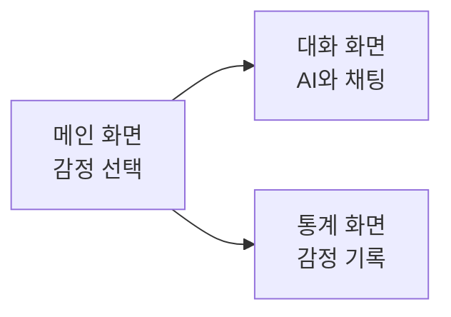

| 화면 | 주요 요소 | 기능 |
|------|---------|------|
| **메인** | 감정 버튼 5개 (😊😢😡😰😐) | 오늘 기분 선택 |
| **대화** | 채팅창, 입력창 | AI와 대화 |
| **통계** | 그래프, 일별 기록 | 감정 패턴 보기 |

---

#### ✅ 1차시 과제

- [ ] AI 친구 이름과 성격 정하기
- [ ] ChatGPT로 캐릭터 테스트 3번 해보기
- [ ] 3개 화면 종이에 스케치해오기

---

### 2차시: AI 감정 친구 UI 제작

#### 🎨 v0로 메인 화면 만들기

**프롬프트 작성**

```
v0에게 이렇게 말해보세요:

"감정 일기 앱의 메인 화면을 만들어줘.

1. 상단:
   - 제목: '마음친구 루나 💙'
   - 오늘 날짜 표시

2. 중앙:
   - 큰 제목: '오늘 기분은 어때?' 
   - 감정 버튼 5개 가로 배치:
     😊 기쁨 (노란색)
     😢 슬픔 (파란색)
     😡 화남 (빨간색)
     😰 불안 (보라색)
     😐 보통 (회색)
   - 버튼 크기: 80x80px (원형)
   - 클릭 시 ring-4 효과

3. 하단:
   - 버튼 3개 (세로):
     '💬 루나와 대화' (보라색)
     '📔 일기 쓰기' (분홍색)
     '📊 감정 기록' (파란색)

4. 배경:
   - 그라데이션 (연보라 → 연분홍 → 하늘색)
   
5. 스타일:
   - 따뜻하고 부드러운 느낌
   - 둥근 모서리 (rounded-2xl)
   - 그림자 효과

Next.js 14, Tailwind CSS"
```

---

#### 💬 대화 화면 만들기

**프롬프트 (요약 버전)**

```
"AI 친구와 채팅하는 화면을 만들어줘.

구조:
- 상단: 프로필 (루나 🟢 온라인)
- 중앙: 대화 영역 (스크롤)
  - AI 메시지: 왼쪽, 흰색 말풍선
  - 내 메시지: 오른쪽, 보라색 말풍선
- 하단: 입력창 + 전송 버튼 ✈️

배경: 연한 보라색
말풍선: 둥근 모서리
타이핑 중: ... 애니메이션

Next.js, Tailwind"
```

---

#### 📊 통계 화면 만들기

**프롬프트 (요약)**

```
"주간 감정 통계 화면.

요소:
1. 가장 많은 감정 (큰 카드)
2. 감정 비율 차트 (파이)
3. 일별 기록 리스트
4. AI 코멘트

디자인: 따뜻한 색감, 카드 형식

Next.js, Tailwind, Chart.js"
```

---

#### ✅ 2차시 완성 체크리스트

- [ ] 메인 화면 생성 완료
- [ ] 대화 화면 생성 완료
- [ ] 통계 화면 생성 완료
- [ ] 3개 화면 네비게이션 연결

---

### 3차시: AI 감정 친구 API 연동 & 완성

#### 🔗 ChatGPT API 연동하기

**Step 1: API Route 만들기**

```typescript
// app/api/chat/route.ts 파일 생성

import { NextResponse } from 'next/server'
import OpenAI from 'openai'

const openai = new OpenAI({
  apiKey: process.env.OPENAI_API_KEY
})

export async function POST(request: Request) {
  const { message, emotion } = await request.json()
  
  // 1차시에서 만든 캐릭터 프롬프트 사용
  const systemPrompt = `
너는 10대 학생들의 감정 친구 '루나'야.
성격: 따뜻하고 포근함
말투: 친근한 반말, 이모티콘 (😊💙)
규칙: 2-3문장, 공감 최우선
현재 사용자 감정: ${emotion}
`
  
  const completion = await openai.chat.completions.create({
    model: 'gpt-3.5-turbo',
    messages: [
      { role: 'system', content: systemPrompt },
      { role: 'user', content: message }
    ],
    max_tokens: 150
  })
  
  return NextResponse.json({
    response: completion.choices[0].message.content
  })
}
```

**Step 2: 대화 페이지에서 API 호출**

```typescript
// app/chat/page.tsx

async function sendMessage() {
  const response = await fetch('/api/chat', {
    method: 'POST',
    body: JSON.stringify({
      message: input,
      emotion: '슬픔'
    })
  })
  
  const data = await response.json()
  // 화면에 응답 표시
}
```

---

#### 💾 데이터 저장하기

**localStorage에 대화 기록 저장**

```javascript
// 저장
localStorage.setItem('chatHistory', JSON.stringify(messages))

// 불러오기
const history = JSON.parse(localStorage.getItem('chatHistory'))
```

---

#### 🧪 테스트하기

**테스트 시나리오**

| 테스트 | 입력 | 기대 결과 |
|--------|------|----------|
| 1 | "오늘 친구랑 싸웠어" | 공감하는 답변 |
| 2 | "시험 100점 받았어!" | 축하하는 답변 |
| 3 | "내일 발표 떨려..." | 격려하는 답변 |

---

#### ✅ 프로젝트 1 완성!

**체크리스트**
- [ ] 3개 화면 모두 작동
- [ ] AI와 대화 가능
- [ ] 대화 기록 저장됨
- [ ] 감정 선택 가능
- [ ] 친구에게 보여주기

---

## 🕵️ 프로젝트 2: AI 추리 게임 (4-6차시)

### 4차시: AI 추리 게임 기획 & 사건 생성

#### 🎮 게임 소개

**만들 것**: AI가 매번 다른 사건을 만들어주는 추리 게임

**게임 방법**:
1. AI가 랜덤으로 사건 생성 (범인, 용의자, 증거)
2. 장소 조사하며 증거 수집
3. 용의자 심문 (AI와 대화)
4. 범인 지목 및 추리

**특별한 점**:
- 🎲 매번 다른 사건!
- 💬 NPC와 실제로 대화
- ⏰ 시간 제한 (20분)
- 🏆 점수 시스템

---

#### 🎯 게임 플로우 설계

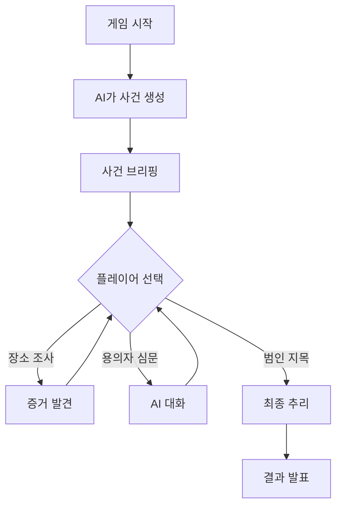

---

#### 🤖 AI 사건 생성 시스템

**API Route 만들기**

```typescript
// app/api/generate-case/route.ts

export async function POST(request: Request) {
  const { difficulty } = await request.json()
  
  const prompt = `
추리 게임용 미스터리 사건을 생성해줘.

난이도: ${difficulty}

JSON 형식:
{
  "title": "사건 제목",
  "setting": "배경 설명",
  "suspects": [
    {
      "name": "이름",
      "age": "나이",
      "alibi": "알리바이",
      "suspiciousPoint": "의심스러운 점",
      "isCulprit": false
    }
    // 3-4명 (범인 1명)
  ],
  "evidence": [
    {
      "name": "증거 이름",
      "description": "설명",
      "location": "발견 장소"
    }
    // 5-7개
  ],
  "solution": {
    "culprit": "범인 이름",
    "motive": "동기",
    "method": "방법"
  }
}
`

  const completion = await openai.chat.completions.create({
    model: 'gpt-4',
    messages: [{ role: 'user', content: prompt }],
    temperature: 0.9,
    response_format: { type: "json_object" }
  })
  
  return NextResponse.json(JSON.parse(completion.choices[0].message.content))
}
```

---

#### 🧪 사건 생성 테스트

**테스트 페이지 만들기**

```
버튼 3개 만들기:
- "쉬움 - 저택" 클릭 → 사건 생성
- "보통 - 회사" 클릭 → 사건 생성
- "어려움 - 학교" 클릭 → 사건 생성

생성된 사건 확인:
- 제목이 흥미로운가?
- 용의자가 3-4명인가?
- 범인이 명확한가?
- 증거가 논리적인가?
```

---

### 5차시: AI 추리 게임 UI 제작

#### 🎨 게임 메인 화면

**v0 프롬프트**

```
"추리 게임 메인 화면.

디자인: 빈티지 탐정 느낌 (세피아, 갈색, 금색)

레이아웃:
- 상단: 타이머 + 힌트 개수
- 중앙: 탭 3개
  [장소 조사] [용의자 심문] [증거 분석]
- 각 탭 내용:
  장소: 4개 장소 카드 (클릭 시 증거 발견)
  용의자: 3명 프로필 (클릭 시 심문)
  증거: 수집한 증거 리스트

하단:
- '범인 지목하기' 버튼 (빨간색, 크게)

Next.js, Tailwind"
```

---

#### 💬 용의자 심문 화면

**v0 프롬프트 (요약)**

```
"심문 팝업 창.

요소:
- 용의자 프로필 (사진, 이름, 역할)
- 대화 영역 (채팅 형식)
- 빠른 질문 버튼 3개
  '알리바이는?'
  '사건 당시 어디 있었어요?'
  '수상한 점이 있나요?'
- 자유 질문 입력창

스타일: 고전 탐정 느낌
Next.js, Tailwind"
```

---

### 6차시: AI 추리 게임 NPC 심문 & 완성

#### 💬 NPC 대화 API

```typescript
// app/api/interrogate/route.ts

export async function POST(request: Request) {
  const { suspect, question } = await request.json()
  
  const systemPrompt = `
당신은 추리 게임 NPC "${suspect.name}"입니다.

프로필:
- 성격: ${suspect.personality}
- 알리바이: ${suspect.alibi}
- 범인 여부: ${suspect.isCulprit ? "예 (숨겨야 함)" : "아니오"}

역할:
- 성격에 맞게 대답
- ${suspect.isCulprit ? "회피하거나 애매하게" : "솔직하게"}
- 2-3문장으로

규칙:
- "범인 아닙니다" 직접 부인 금지
- 일관된 성격 유지
`

  const completion = await openai.chat.completions.create({
    model: 'gpt-3.5-turbo',
    messages: [
      { role: 'system', content: systemPrompt },
      { role: 'user', content: question }
    ],
    max_tokens: 150
  })
  
  return NextResponse.json({
    answer: completion.choices[0].message.content
  })
}
```

---

#### 🎯 최종 추리 화면

**v0 프롬프트**

```
"범인 지목 화면.

구성:
1. 제목: '⚖️ 최종 추리'
2. 용의자 선택 (3명 버튼)
3. 추리 내용 작성:
   - 동기 (텍스트)
   - 방법 (텍스트)
   - 증거 선택 (체크박스)
4. '제출하기' 버튼

결과 화면:
- 정답/오답 표시
- 점수 계산
- 실제 범인 및 해답 공개

Next.js, Tailwind"
```

---

#### ✅ 프로젝트 2 완성!

**체크리스트**
- [ ] 사건이 랜덤으로 생성됨
- [ ] 장소 조사 가능
- [ ] NPC와 대화 가능
- [ ] 범인 지목 및 결과 확인
- [ ] 점수 계산 작동

---

## 📖 프로젝트 3: AI 스토리 월드 (7-8차시)

### 7차시: AI 스토리 월드 시스템 & UI

#### 📚 프로젝트 소개

**만들 것**: 사용자 선택에 따라 무한히 이어지는 AI 스토리

**특징**:
- 🎲 AI가 자동으로 다음 장면 생성
- 🔀 선택에 따라 다른 스토리
- 🎨 AI 생성 이미지 (선택 사항)
- 🎬 멀티 엔딩

---

#### 🔄 스토리 플로우

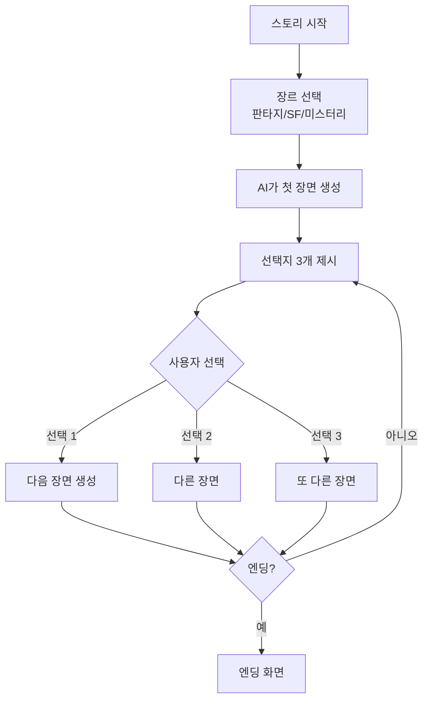

---

#### 🤖 AI 스토리 생성 API

```typescript
// app/api/generate-story/route.ts

export async function POST(request: Request) {
  const { currentScene, userChoice, context } = await request.json()
  
  const prompt = `
인터랙티브 스토리 작가입니다.

현재 장면: "${currentScene}"
사용자 선택: "${userChoice}"

다음 장면을 JSON으로:
{
  "sceneText": "장면 묘사 (3-4문장)",
  "emotion": "분위기",
  "choices": [
    { "id": 1, "text": "선택지 1" },
    { "id": 2, "text": "선택지 2" },
    { "id": 3, "text": "선택지 3" }
  ],
  "isEnding": false,
  "endingType": "해피/새드/오픈" (if isEnding)
}

규칙:
- 이전 선택 결과 반영
- 논리적 일관성
- 5-7 장면 후 엔딩
`

  const completion = await openai.chat.completions.create({
    model: 'gpt-4',
    messages: [{ role: 'user', content: prompt }],
    temperature: 0.9,
    response_format: { type: "json_object" }
  })
  
  return NextResponse.json(JSON.parse(completion.choices[0].message.content))
}
```

---

#### 🎨 스토리북 UI

**v0 프롬프트**

```
"인터랙티브 스토리북 UI.

레이아웃:
1. 상단: 제목 + 장면 번호 (1/7)
2. 중앙: 장면 텍스트
   - 타이핑 효과로 나타남
   - 세리프 폰트
   - 배경 이미지 (분위기)
3. 하단: 선택지 카드 3개
   - 호버 시 결과 힌트
   - 클릭 시 다음 장면

애니메이션:
- 페이지 넘김 효과
- 부드러운 전환

Next.js, Tailwind, Framer Motion"
```

---

### 8차시: AI 스토리 월드 완성 & 데모 데이

#### 🎨 이미지 생성 추가 (선택 사항)

**DALL-E로 장면 이미지 만들기**

```typescript
// app/api/generate-image/route.ts (선택)

export async function POST(request: Request) {
  const { sceneDescription } = await request.json()
  
  const image = await openai.images.generate({
    model: "dall-e-3",
    prompt: sceneDescription,
    size: "1024x1024",
    quality: "standard",
    n: 1
  })
  
  return NextResponse.json({
    imageUrl: image.data[0].url
  })
}
```

---

#### 💾 스토리 저장 & 공유

**localStorage에 스토리 저장**

```javascript
// 플레이한 스토리 저장
const story = {
  id: Date.now(),
  title: storyTitle,
  genre: 'Fantasy',
  scenes: allScenes,
  ending: finalEnding,
  playedAt: new Date()
}

localStorage.setItem('myStory', JSON.stringify(story))
```

**공유 기능**

```
공유 버튼 만들기:
- JSON으로 내보내기
- QR 코드 생성
- 친구에게 전달
```

---

#### 🏆 데모 데이 (3개 프로젝트 발표)

**발표 구성** (팀당 5분)

| 순서 | 내용 | 시간 |
|------|------|------|
| 1 | 프로젝트 소개 | 1분 |
| 2 | 핵심 기능 시연 | 3분 |
| 3 | 기술 설명 (API 활용) | 1분 |

**발표 팁**:
- 실제로 작동하는 모습 보여주기
- AI API 어떻게 활용했는지 설명
- 가장 어려웠던 점과 해결 방법

---

#### ✅ 프로젝트 3 완성!

**체크리스트**
- [ ] 스토리가 자동 생성됨
- [ ] 선택에 따라 분기됨
- [ ] 엔딩까지 도달 가능
- [ ] 스토리 저장 기능
- [ ] (선택) 이미지 생성 기능

---

#### 📝 11학년 전체 성찰

**3개 프로젝트를 만들며 배운 것**

```
1. 가장 재미있었던 프로젝트는?
   ☐ AI 감정 친구
   ☐ AI 추리 게임
   ☐ AI 스토리 월드

2. ChatGPT API 사용하며 느낀 점:
   - 어려웠던 점:
   - 신기했던 점:
   - 앞으로 활용하고 싶은 방법:

3. 시스템 프롬프트 작성 실력이 늘었나요?
   처음: ☐☐☐☐☐ 지금

4. 다음에 만들고 싶은 AI 서비스:

5. 진로에 영향을 받았나요?
   ☐ AI 개발자에 관심 생김
   ☐ AI 기획자/프롬프트 엔지니어 관심
   ☐ AI 기반 서비스 개발하고 싶음
   ☐ 그저 재미있었음
```

---

#### 🎊 최종 포트폴리오

**11학년 완성 프로젝트**:
1. ✅ AI 감정 친구 (ChatGPT API 대화)
2. ✅ AI 추리 게임 (랜덤 사건 생성 + NPC 심문)
3. ✅ AI 스토리 월드 (분기형 스토리)

**이제 당신은 AI API 전문가! 🚀**

---

## 📊 교사용 가이드

### 🎯 수업 운영 팁

#### 매 차시 기본 구조 (50분)

| 단계 | 시간 | 활동 | 팁 |
|------|------|------|-----|
| **도입** | 5분 | - 이전 차시 복습<br/>- 오늘 목표 공유 | 학생들이 Why를 이해하도록 |
| **시연** | 10분 | - 교사 라이브 데모<br/>- 프롬프트 예시 | 화면 공유하며 실시간 |
| **실습** | 30분 | - 학생 개별/팀 작업<br/>- 순회 지도 | 막히는 학생 빠르게 도움 |
| **정리** | 5분 | - 오늘 완성한 것 공유<br/>- 과제 안내 | 성취감 느끼도록 |

### 🆘 자주 발생하는 문제와 해결법

| 문제 상황 | 해결 방법 |
|----------|----------|
| 학생이 프롬프트를 너무 짧게 쓴다 | 체크리스트 제공 (색상, 크기, 위치, 기능 모두 언급했나?) |
| AI 생성 결과가 마음에 안 든다 | "더 구체적으로" 강조, 예시 프롬프트 보여주기 |
| 에러가 나서 당황한다 | "에러는 친구" 마인드셋, 에러 메시지 읽는 법 교육 |
| 시간 내 완성 못한다 | MVP 개념 강조, 핵심 기능만 먼저 완성 |
| 팀원 간 갈등 | 역할 명확히 분담, 기여도 개별 평가 |

### 💡 프롬프트 작성 체크리스트 (학생용 유인물)

```
좋은 프롬프트 작성법:

☑️ 무엇을 만들지 명확히 (예: 버튼, 카드, 리스트)
☑️ 색상 언급 (예: 파란색, 파스텔 톤)
☑️ 크기/위치 지정 (예: 크게, 상단에, 가운데)
☑️ 동작 설명 (예: 클릭하면 ~, 호버하면 ~)
☑️ 기술 스택 명시 (예: Next.js, Tailwind)

나쁜 프롬프트 예:
"버튼 만들어줘" ❌

좋은 프롬프트 예:
"파란색 둥근 버튼을 만들어줘. 
텍스트는 '시작하기', 크기는 크게, 
클릭하면 다음 페이지로 이동" ✅
```

### 📚 추가 리소스

**v0 프롬프트 모음집**
- [9학년용 템플릿 10개]
- [10학년용 템플릿 10개]
- [11학년용 템플릿 10개]

**디버깅 가이드**
- 자주 나오는 에러 Top 10
- ChatGPT 질문 예시
- 개발자 도구 사용법

**평가 루브릭**
- 기획 능력 평가표
- 프로젝트 완성도 체크리스트
- 발표 평가표

---

## 🎉 마치며

이 24차시 교육 과정을 통해 학생들은:

✅ **코딩 없이** AI로 웹 프로젝트를 완성하는 경험  
✅ **AI와 협업**하는 방법 체득 (프롬프트 엔지니어링)  
✅ **기획과 설계**의 중요성 이해  
✅ **문제 해결 능력** 향상 (AI 디버깅)  
✅ **발표와 시연** 경험  
✅ **AI 리터러시** 확보 (미래 핵심 역량)

**기억하세요**: 완벽한 코드보다 작동하는 프로토타입이 더 중요합니다!

---

**문의**: 본 커리큘럼에 대한 질문이나 피드백은 언제든 환영합니다.

**버전**: v2.0 (일반 학생용)  
**업데이트**: 2025년 11월

